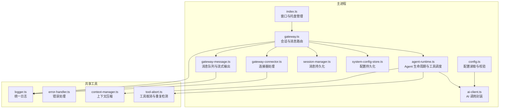
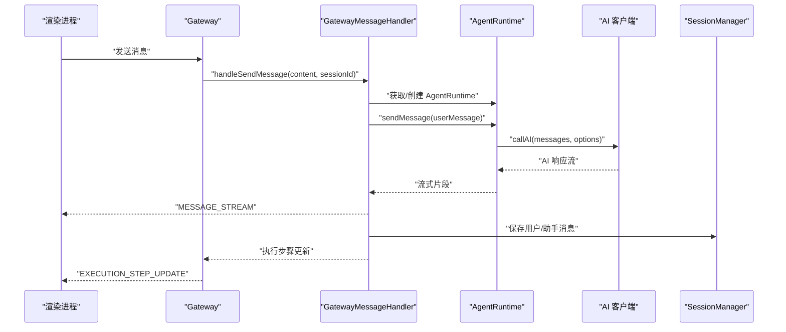
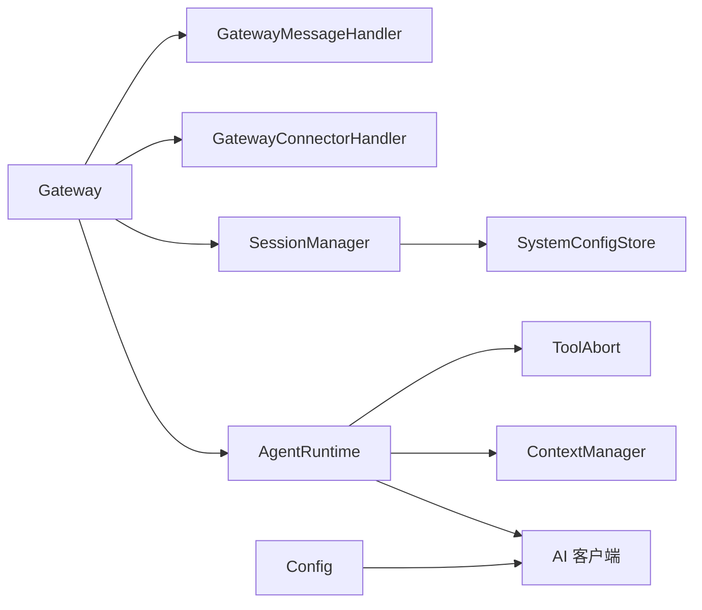
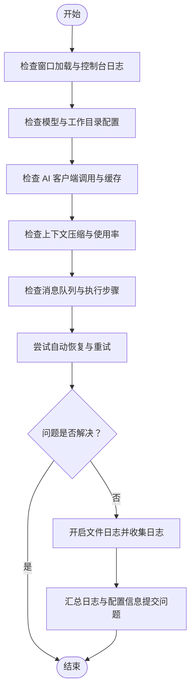

# 故障排除和调试

<cite>
**本文档引用的文件**
- [src/main/index.ts](file://src/main/index.ts)
- [src/main/gateway.ts](file://src/main/gateway.ts)
- [src/main/gateway-connector.ts](file://src/main/gateway-connector.ts)
- [src/main/gateway-message.ts](file://src/main/gateway-message.ts)
- [src/main/agent-runtime/agent-runtime.ts](file://src/main/agent-runtime/agent-runtime.ts)
- [src/main/session/session-manager.ts](file://src/main/session/session-manager.ts)
- [src/main/database/system-config-store.ts](file://src/main/database/system-config-store.ts)
- [src/main/config.ts](file://src/main/config.ts)
- [src/main/utils/ai-client.ts](file://src/main/utils/ai-client.ts)
- [src/shared/utils/logger.ts](file://src/shared/utils/logger.ts)
- [src/shared/utils/error-handler.ts](file://src/shared/utils/error-handler.ts)
- [src/main/tools/tool-abort.ts](file://src/main/tools/tool-abort.ts)
- [src/main/context/context-manager.ts](file://src/main/context/context-manager.ts)
- [package.json](file://package.json)
</cite>

## 目录
1. [简介](#简介)
2. [项目结构](#项目结构)
3. [核心组件](#核心组件)
4. [架构总览](#架构总览)
5. [详细组件分析](#详细组件分析)
6. [依赖关系分析](#依赖关系分析)
7. [性能考虑](#性能考虑)
8. [故障排除指南](#故障排除指南)
9. [结论](#结论)
10. [附录](#附录)

## 简介
本指南面向 DeepBot 开发者与运维人员，提供系统性的故障排除与调试方法。内容覆盖启动问题、性能问题、配置问题三大类，结合日志系统、错误处理、性能监控与工具链，帮助快速定位与解决问题。同时给出开发环境与生产环境的差异化调试策略，并提供性能优化与问题定位的实用技巧。

## 项目结构
DeepBot 采用 Electron 主进程 + 渲染进程 + 服务端（可选）的混合架构。主进程负责窗口管理、IPC 通信、Gateway 生命周期与系统托盘；Agent Runtime 负责与 LLM 的交互与工具执行；Session 管理器负责消息持久化；SystemConfigStore 负责配置持久化；AI 客户端提供统一的模型调用封装。

**图表来源**
- [src/main/index.ts:1-331](file://src/main/index.ts#L1-L331)
- [src/main/gateway.ts:1-114](file://src/main/gateway.ts#L1-L114)
- [src/main/gateway-connector.ts:1-800](file://src/main/gateway-connector.ts#L1-L800)
- [src/main/gateway-message.ts:1-525](file://src/main/gateway-message.ts#L1-L525)
- [src/main/agent-runtime/agent-runtime.ts:1-909](file://src/main/agent-runtime/agent-runtime.ts#L1-L909)
- [src/main/session/session-manager.ts:1-195](file://src/main/session/session-manager.ts#L1-L195)
- [src/main/database/system-config-store.ts:1-576](file://src/main/database/system-config-store.ts#L1-L576)
- [src/main/config.ts:1-108](file://src/main/config.ts#L1-L108)
- [src/main/utils/ai-client.ts:1-365](file://src/main/utils/ai-client.ts#L1-L365)
- [src/shared/utils/logger.ts:1-176](file://src/shared/utils/logger.ts#L1-L176)
- [src/shared/utils/error-handler.ts:1-51](file://src/shared/utils/error-handler.ts#L1-L51)
- [src/main/context/context-manager.ts:1-366](file://src/main/context/context-manager.ts#L1-L366)
- [src/main/tools/tool-abort.ts:1-427](file://src/main/tools/tool-abort.ts#L1-L427)

**章节来源**
- [src/main/index.ts:1-331](file://src/main/index.ts#L1-L331)
- [src/main/gateway.ts:1-114](file://src/main/gateway.ts#L1-L114)
- [src/main/gateway-connector.ts:1-800](file://src/main/gateway-connector.ts#L1-L800)
- [src/main/gateway-message.ts:1-525](file://src/main/gateway-message.ts#L1-L525)
- [src/main/agent-runtime/agent-runtime.ts:1-909](file://src/main/agent-runtime/agent-runtime.ts#L1-L909)
- [src/main/session/session-manager.ts:1-195](file://src/main/session/session-manager.ts#L1-L195)
- [src/main/database/system-config-store.ts:1-576](file://src/main/database/system-config-store.ts#L1-L576)
- [src/main/config.ts:1-108](file://src/main/config.ts#L1-L108)
- [src/main/utils/ai-client.ts:1-365](file://src/main/utils/ai-client.ts#L1-L365)
- [src/shared/utils/logger.ts:1-176](file://src/shared/utils/logger.ts#L1-L176)
- [src/shared/utils/error-handler.ts:1-51](file://src/shared/utils/error-handler.ts#L1-L51)
- [src/main/context/context-manager.ts:1-366](file://src/main/context/context-manager.ts#L1-L366)
- [src/main/tools/tool-abort.ts:1-427](file://src/main/tools/tool-abort.ts#L1-L427)

## 核心组件
- 主进程入口与窗口管理：负责创建窗口、系统托盘、监听渲染进程控制台输出、拦截导航与外部链接、注册 IPC 处理器。
- Gateway：会话与消息路由中枢，协调 AgentRuntime、连接器、消息处理器与会话管理器。
- AgentRuntime：封装 Agent 生命周期、消息处理、工具执行、上下文压缩与状态恢复。
- SessionManager：负责消息持久化（UI 与上下文两套限制）、历史消息加载与统计。
- SystemConfigStore：SQLite 持久化配置中心，涵盖模型、工作目录、工具禁用、连接器配置等。
- AI 客户端：统一的模型调用封装，支持连接池、缓存、Keep-Alive、快速模型切换与取消信号。
- 日志与错误处理：统一日志级别、文件落盘、安全控制台输出；统一错误提取与分类。
- 工具取消与重复检测：AbortSignal 支持、重复操作检测、连续失败阈值与自动停止。

**章节来源**
- [src/main/index.ts:1-331](file://src/main/index.ts#L1-L331)
- [src/main/gateway.ts:1-114](file://src/main/gateway.ts#L1-L114)
- [src/main/agent-runtime/agent-runtime.ts:1-909](file://src/main/agent-runtime/agent-runtime.ts#L1-L909)
- [src/main/session/session-manager.ts:1-195](file://src/main/session/session-manager.ts#L1-L195)
- [src/main/database/system-config-store.ts:1-576](file://src/main/database/system-config-store.ts#L1-L576)
- [src/main/utils/ai-client.ts:1-365](file://src/main/utils/ai-client.ts#L1-L365)
- [src/shared/utils/logger.ts:1-176](file://src/shared/utils/logger.ts#L1-L176)
- [src/shared/utils/error-handler.ts:1-51](file://src/shared/utils/error-handler.ts#L1-L51)
- [src/main/tools/tool-abort.ts:1-427](file://src/main/tools/tool-abort.ts#L1-L427)

## 架构总览
下图展示从用户输入到 AI 响应的端到端流程，以及关键的错误恢复与调试点。

**图表来源**
- [src/main/gateway.ts:455-466](file://src/main/gateway.ts#L455-L466)
- [src/main/gateway-message.ts:76-160](file://src/main/gateway-message.ts#L76-L160)
- [src/main/agent-runtime/agent-runtime.ts:661-688](file://src/main/agent-runtime/agent-runtime.ts#L661-L688)
- [src/main/utils/ai-client.ts:196-365](file://src/main/utils/ai-client.ts#L196-L365)
- [src/main/session/session-manager.ts:38-85](file://src/main/session/session-manager.ts#L38-L85)

## 详细组件分析

### 主进程与窗口管理（启动与界面问题）
- 关键职责：创建窗口、系统托盘、监听渲染进程控制台、拦截导航与外部链接、注册 IPC 处理器。
- 常见问题与定位：
  - 窗口无法加载：检查开发/生产模式加载路径与错误日志；确认 index.html 存在与可访问。
  - 托盘行为异常：检查平台图标资源路径与模板图像设置。
  - 外链拦截失效：确认 will-navigate 与 setWindowOpenHandler 的拦截逻辑。
- 调试技巧：
  - 使用 before-input-event 快捷键打开开发者工具。
  - 监听 did-fail-load 与 console-message 获取加载与脚本报错。
  - 通过 IPC 注册点定位消息处理链路。

**章节来源**
- [src/main/index.ts:119-331](file://src/main/index.ts#L119-L331)

### Gateway（消息路由与会话管理）
- 关键职责：管理 AgentRuntime 实例、消息路由、连接器处理、会话管理、系统提示词重载、工作目录重载。
- 常见问题与定位：
  - 会话历史缺失：检查 SessionManager 初始化与工作目录配置。
  - 系统提示词未生效：检查 reloadSystemPrompts 与 AgentRuntime 初始化顺序。
  - 连接器消息堆积：检查队列处理与进度提醒定时器。
- 调试技巧：
  - 使用 getActiveSessionCount 与 getSessionIds 辅助诊断。
  - 观察 autoStartConnectors 的启动日志与错误。
  - 通过 reloadWorkspaceConfig 与 reloadModelConfig 验证配置热更新。

**章节来源**
- [src/main/gateway.ts:1-772](file://src/main/gateway.ts#L1-L772)

### AgentRuntime（Agent 生命周期与工具调度）
- 关键职责：初始化 Agent、加载历史消息、系统提示词、工具包装（重复检测、取消支持）、流式响应与执行步骤上报。
- 常见问题与定位：
  - Agent 卡住：检查 isCurrentlyGenerating 与 ensureAgentReady 的状态修复。
  - 工具重复执行：OperationTracker 的重复检测与失败阈值。
  - 上下文过大：结合 context-manager 的上下文压缩。
- 调试技巧：
  - 在构造函数与 initialize 中打印配置与模型信息。
  - 使用 setExecutionStepCallback 实时观察执行步骤。
  - 通过 clearMessageHistory 与 setSkipHistory 控制历史记录。

**章节来源**
- [src/main/agent-runtime/agent-runtime.ts:1-909](file://src/main/agent-runtime/agent-runtime.ts#L1-L909)
- [src/main/context/context-manager.ts:1-366](file://src/main/context/context-manager.ts#L1-L366)
- [src/main/tools/tool-abort.ts:1-427](file://src/main/tools/tool-abort.ts#L1-L427)

### SessionManager（消息持久化）
- 关键职责：UI 消息（最多 100 轮）与上下文消息（最多 10 轮）的加载与保存。
- 常见问题与定位：
  - 历史消息为空：检查 session-exists 与 loadContextMessages 的返回。
  - 保存失败：检查 saveUserMessage/saveAssistantMessage 的异常日志。
- 调试技巧：
  - 使用 getSessionFilePath 定位会话文件。
  - 在 loadContextMessages 前后打印消息条数与 token 估算。

**章节来源**
- [src/main/session/session-manager.ts:1-195](file://src/main/session/session-manager.ts#L1-L195)

### SystemConfigStore（配置持久化）
- 关键职责：SQLite 持久化模型、工作目录、工具禁用、连接器配置等；支持迁移与索引。
- 常见问题与定位：
  - 配置读取失败：检查数据库初始化与表结构迁移。
  - 工作目录变更未生效：确认 reloadWorkspaceConfig 的调用链。
- 调试技巧：
  - 通过 getDefaultWorkspaceSettings/getWorkspaceSettings 验证默认与当前配置。
  - 观察迁移日志与字段存在性检查。

**章节来源**
- [src/main/database/system-config-store.ts:1-576](file://src/main/database/system-config-store.ts#L1-L576)

### AI 客户端（模型调用封装）
- 关键职责：连接池缓存、Keep-Alive、快速模型切换、取消信号、错误友好化。
- 常见问题与定位：
  - API Key 无效：检查 getConfig 与 createErrorResponse 的错误映射。
  - 调用超时：检查超时时间与网络状况。
- 调试技巧：
  - 使用 clearAICache 清理缓存后重试。
  - 在 callAI 中打印关键参数与响应摘要。

**章节来源**
- [src/main/utils/ai-client.ts:1-365](file://src/main/utils/ai-client.ts#L1-L365)
- [src/main/config.ts:1-108](file://src/main/config.ts#L1-L108)

### 日志与错误处理（统一日志与错误）
- 关键职责：统一日志级别、文件落盘、安全控制台输出；错误提取与分类。
- 常见问题与定位：
  - 日志未落盘：检查 setFileLogging 与初始化标志。
  - 控制台 EPIPE：通过安全输出避免应用退出时崩溃。
- 调试技巧：
  - 使用 createLogger 创建模块化日志器。
  - 通过 getErrorMessage 统一错误字符串化。

**章节来源**
- [src/shared/utils/logger.ts:1-176](file://src/shared/utils/logger.ts#L1-L176)
- [src/shared/utils/error-handler.ts:1-51](file://src/shared/utils/error-handler.ts#L1-L51)

## 依赖关系分析
- 组件耦合：
  - Gateway 作为中枢，依赖 AgentRuntime、SessionManager、ConnectorManager、MessageHandler。
  - AgentRuntime 依赖 AI 客户端、上下文管理器、工具取消与重复检测。
  - SessionManager 与 SystemConfigStore 通过配置驱动。
- 外部依赖：
  - Electron 主进程与渲染进程通信（IPC）。
  - SQLite 数据库存储配置与会话。
  - @mariozechner/pi-ai 提供模型调用能力。

**图表来源**
- [src/main/gateway.ts:1-114](file://src/main/gateway.ts#L1-L114)
- [src/main/agent-runtime/agent-runtime.ts:1-909](file://src/main/agent-runtime/agent-runtime.ts#L1-L909)
- [src/main/session/session-manager.ts:1-195](file://src/main/session/session-manager.ts#L1-L195)
- [src/main/database/system-config-store.ts:1-576](file://src/main/database/system-config-store.ts#L1-L576)
- [src/main/utils/ai-client.ts:1-365](file://src/main/utils/ai-client.ts#L1-L365)
- [src/main/context/context-manager.ts:1-366](file://src/main/context/context-manager.ts#L1-L366)
- [src/main/tools/tool-abort.ts:1-427](file://src/main/tools/tool-abort.ts#L1-L427)
- [src/main/config.ts:1-108](file://src/main/config.ts#L1-L108)

**章节来源**
- [src/main/gateway.ts:1-114](file://src/main/gateway.ts#L1-L114)
- [src/main/agent-runtime/agent-runtime.ts:1-909](file://src/main/agent-runtime/agent-runtime.ts#L1-L909)
- [src/main/session/session-manager.ts:1-195](file://src/main/session/session-manager.ts#L1-L195)
- [src/main/database/system-config-store.ts:1-576](file://src/main/database/system-config-store.ts#L1-L576)
- [src/main/utils/ai-client.ts:1-365](file://src/main/utils/ai-client.ts#L1-L365)
- [src/main/context/context-manager.ts:1-366](file://src/main/context/context-manager.ts#L1-L366)
- [src/main/tools/tool-abort.ts:1-427](file://src/main/tools/tool-abort.ts#L1-L427)
- [src/main/config.ts:1-108](file://src/main/config.ts#L1-L108)

## 性能考虑
- 连接池与缓存：AI 客户端复用 Model 实例与 HTTP 连接，减少握手开销。
- 上下文压缩：根据使用率自动裁剪工具结果与历史消息，降低 token 使用。
- 队列与并发：消息队列与任务 Tab 的等待机制，避免并发冲突。
- 日志与文件落盘：按需开启文件日志，避免磁盘 IO 影响。

**章节来源**
- [src/main/utils/ai-client.ts:51-187](file://src/main/utils/ai-client.ts#L51-L187)
- [src/main/context/context-manager.ts:99-303](file://src/main/context/context-manager.ts#L99-L303)
- [src/main/gateway-message.ts:164-196](file://src/main/gateway-message.ts#L164-L196)
- [src/shared/utils/logger.ts:16-94](file://src/shared/utils/logger.ts#L16-L94)

## 故障排除指南

### 启动问题
- 症状：应用无法启动、窗口空白、托盘不显示。
- 诊断步骤：
  - 检查主进程窗口创建与加载路径（开发/生产）。
  - 查看 did-fail-load 错误描述与控制台日志。
  - 确认系统托盘图标资源路径与平台差异。
- 解决方案：
  - 修正 index.html 路径与资源打包。
  - 在开发模式下打开开发者工具辅助定位。
  - 确保托盘图标在不同平台存在。

**章节来源**
- [src/main/index.ts:119-331](file://src/main/index.ts#L119-L331)

### 性能问题
- 症状：响应慢、内存占用高、上下文溢出。
- 诊断步骤：
  - 使用 AI 客户端的连接池与缓存日志判断是否命中缓存。
  - 检查上下文压缩统计与使用率。
  - 观察消息队列长度与处理耗时。
- 解决方案：
  - 启用快速模型（modelId2）以降低 token 使用。
  - 合理设置上下文窗口与裁剪阈值。
  - 优化工具执行，避免重复操作与连续失败。

**章节来源**
- [src/main/utils/ai-client.ts:87-187](file://src/main/utils/ai-client.ts#L87-L187)
- [src/main/context/context-manager.ts:100-303](file://src/main/context/context-manager.ts#L100-L303)
- [src/main/gateway-message.ts:288-371](file://src/main/gateway-message.ts#L288-L371)

### 配置问题
- 症状：模型未配置、API Key 无效、工作目录不生效。
- 诊断步骤：
  - 检查 getConfig 的优先级（数据库 → 环境变量）。
  - 通过 SystemConfigStore 验证模型与工作目录配置。
  - 观察 reloadWorkspaceConfig 与 reloadModelConfig 的调用链。
- 解决方案：
  - 在系统设置中正确配置模型与 API Key。
  - 保存后调用相应重载方法使配置生效。
  - 在 Docker 环境下确认 DB_DIR 与容器挂载。

**章节来源**
- [src/main/config.ts:38-108](file://src/main/config.ts#L38-L108)
- [src/main/database/system-config-store.ts:337-380](file://src/main/database/system-config-store.ts#L337-L380)
- [src/main/gateway.ts:252-281](file://src/main/gateway.ts#L252-L281)

### 调试工具与最佳实践
- 日志系统：
  - 使用 createLogger 创建模块化日志器，按需开启文件落盘。
  - 通过 setGlobalLogLevel 调整全局日志级别。
- 错误处理：
  - 使用 getErrorMessage 统一错误字符串化。
  - 通过 isAbortError/isCancelError 区分取消与用户取消。
- 性能监控：
  - 在 AgentRuntime 中打印配置与模型信息，便于核对。
  - 使用 MESSAGE_STREAM 的 totalDuration 评估单次调用耗时。
- 工具链：
  - 使用 before-input-event 快捷键打开开发者工具。
  - 通过 IPC 注册点定位消息处理链路。

**章节来源**
- [src/shared/utils/logger.ts:152-176](file://src/shared/utils/logger.ts#L152-L176)
- [src/shared/utils/error-handler.ts:8-51](file://src/shared/utils/error-handler.ts#L8-L51)
- [src/main/gateway-message.ts:416-473](file://src/main/gateway-message.ts#L416-L473)
- [src/main/index.ts:171-177](file://src/main/index.ts#L171-L177)

### 开发环境与生产环境调试策略
- 开发环境：
  - 使用 Vite 开发服务器与 Electron 主进程热编译。
  - 通过 before-input-event 快捷键打开开发者工具。
  - 启用文件日志以便快速定位问题。
- 生产环境：
  - 通过系统托盘最小化而非退出，避免误关。
  - 严格控制日志级别，避免过度 IO。
  - 使用错误处理与自动恢复机制提升稳定性。

**章节来源**
- [src/main/index.ts:148-177](file://src/main/index.ts#L148-L177)
- [src/main/index.ts:182-198](file://src/main/index.ts#L182-L198)
- [src/shared/utils/logger.ts:16-94](file://src/shared/utils/logger.ts#L16-L94)

### 问题定位流程图

[本图为概念性流程图，不直接映射具体源文件，故无图表来源]

## 结论
通过统一的日志体系、完善的错误处理、连接池与上下文压缩等性能优化手段，DeepBot 在启动、性能与配置三类常见问题上具备较强的可诊断性与可恢复性。建议在开发阶段充分使用文件日志与开发者工具，在生产阶段严格控制日志级别并利用自动恢复机制保障稳定性。

## 附录
- 常用 IPC 通道与调试要点：
  - SEND_MESSAGE/STOP_GENERATION：用于验证消息路由与停止逻辑。
  - SCHEDULED_TASK/ENVIRONMENT_CHECK：用于验证工具链与环境检查。
  - GET/SAVE_WORKSPACE_SETTINGS：用于验证工作目录热更新。
- 常用配置键：
  - AI_API_KEY/AI_BASE_URL/AI_MODEL_ID：模型配置优先级。
  - DB_DIR：Docker 环境下数据库目录。

**章节来源**
- [src/main/index.ts:336-522](file://src/main/index.ts#L336-L522)
- [src/main/config.ts:38-108](file://src/main/config.ts#L38-L108)
- [src/main/database/system-config-store.ts:337-380](file://src/main/database/system-config-store.ts#L337-L380)
- [package.json:9-44](file://package.json#L9-L44)