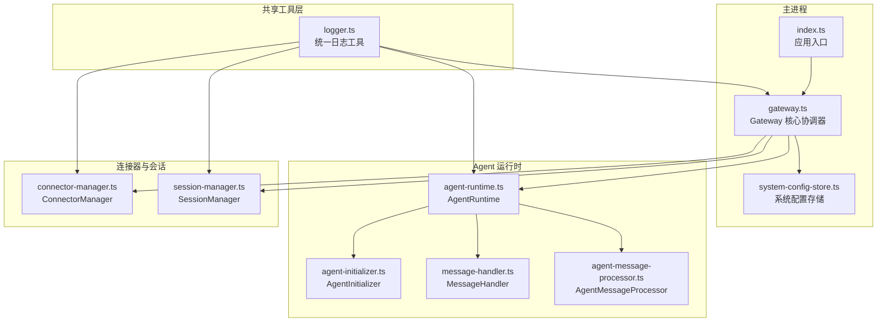
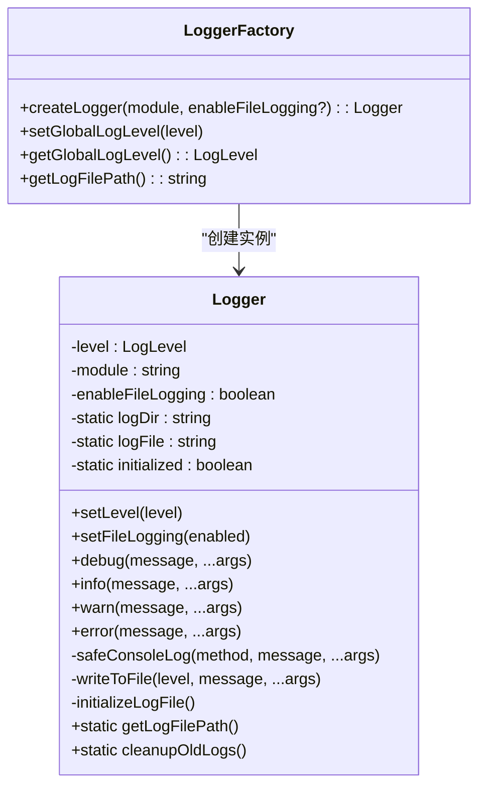
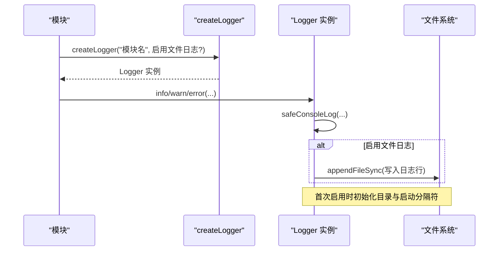
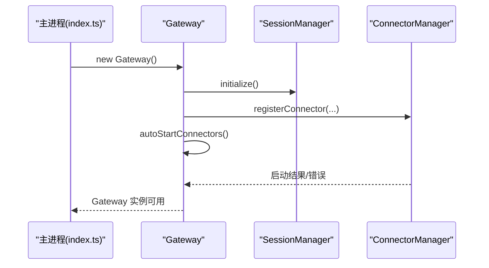
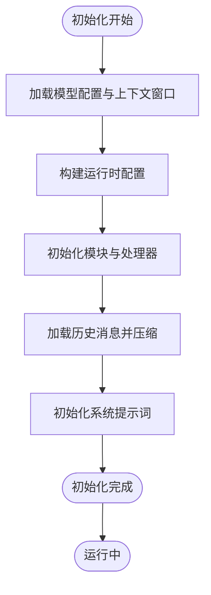
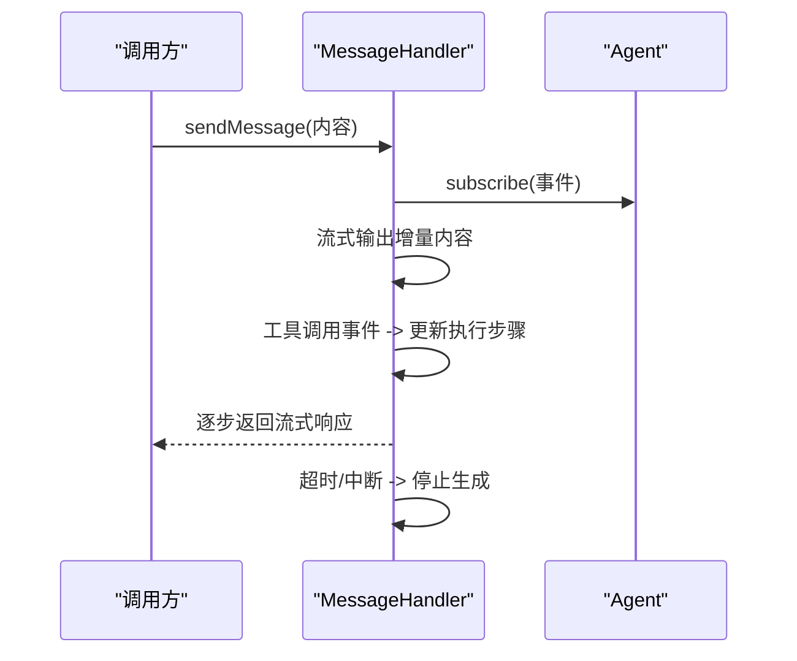
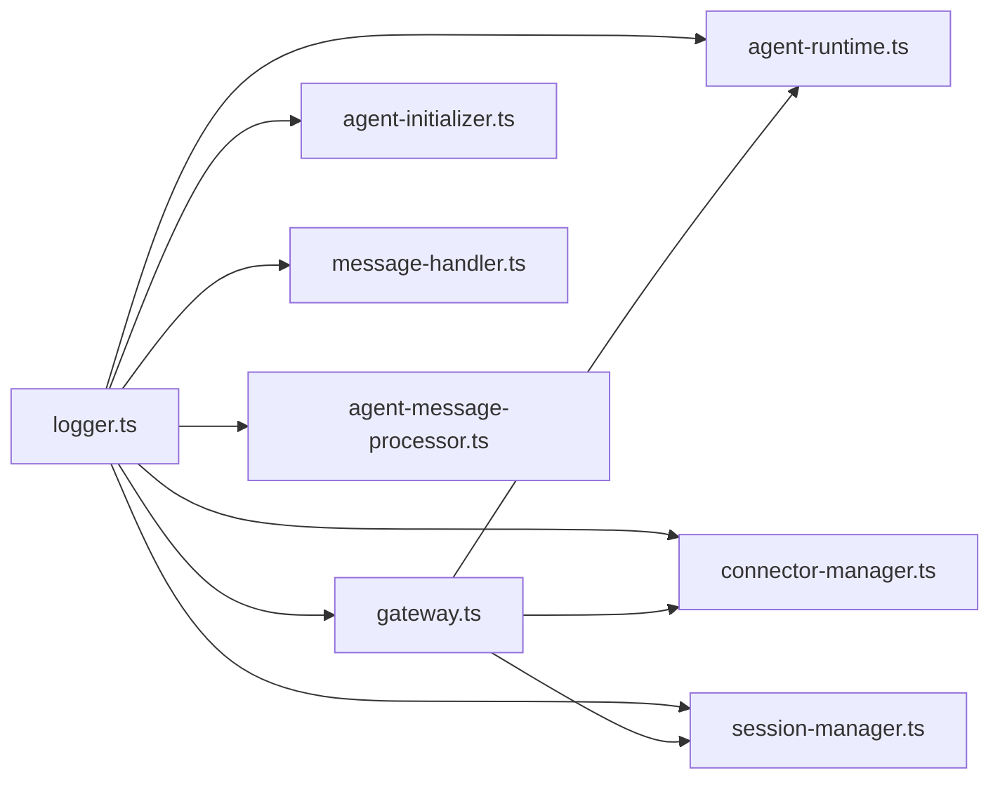

# 日志系统

<cite>
**本文档引用的文件**
- [logger.ts](file://src/shared/utils/logger.ts)
- [gateway.ts](file://src/main/gateway.ts)
- [agent-runtime.ts](file://src/main/agent-runtime/agent-runtime.ts)
- [agent-initializer.ts](file://src/main/agent-runtime/agent-initializer.ts)
- [message-handler.ts](file://src/main/agent-runtime/message-handler.ts)
- [agent-message-processor.ts](file://src/main/agent-runtime/agent-message-processor.ts)
- [connector-manager.ts](file://src/main/connectors/connector-manager.ts)
- [session-manager.ts](file://src/main/session/session-manager.ts)
- [system-config-store.ts](file://src/main/database/system-config-store.ts)
- [index.ts](file://src/main/index.ts)
</cite>

## 目录
1. [简介](#简介)
2. [项目结构](#项目结构)
3. [核心组件](#核心组件)
4. [架构概览](#架构概览)
5. [详细组件分析](#详细组件分析)
6. [依赖关系分析](#依赖关系分析)
7. [性能考虑](#性能考虑)
8. [故障排查指南](#故障排查指南)
9. [结论](#结论)
10. [附录](#附录)

## 简介
本文件为 DeepBot 日志系统的权威技术文档，围绕统一日志工具的实现原理展开，涵盖日志级别管理、模块化日志记录、文件日志功能、Logger 类设计模式、日志文件管理与自动初始化机制。文档还提供在 Gateway、Agent Runtime、连接器、会话管理等核心组件中的使用范式、最佳实践、性能考量以及日志分析与问题定位方法论。

## 项目结构
DeepBot 的日志系统位于共享工具层，采用单一 Logger 类与工厂函数 createLogger 的组合模式，既满足控制台输出的即时性，又支持可选的文件落盘能力。核心文件与关键模块如下：

- 统一日志工具：src/shared/utils/logger.ts
- 应用入口与全局初始化：src/main/index.ts
- 核心协调器（Gateway）：src/main/gateway.ts
- Agent 运行时（AgentRuntime）：src/main/agent-runtime/agent-runtime.ts
- Agent 初始化器（AgentInitializer）：src/main/agent-runtime/agent-initializer.ts
- 消息处理器（MessageHandler）：src/main/agent-runtime/message-handler.ts
- 消息处理器（AgentMessageProcessor）：src/main/agent-runtime/agent-message-processor.ts
- 连接器管理器（ConnectorManager）：src/main/connectors/connector-manager.ts
- 会话管理器（SessionManager）：src/main/session/session-manager.ts
- 系统配置存储（SystemConfigStore）：src/main/database/system-config-store.ts

**图表来源**
- [logger.ts:1-176](file://src/shared/utils/logger.ts#L1-L176)
- [index.ts:1-331](file://src/main/index.ts#L1-L331)
- [gateway.ts:1-772](file://src/main/gateway.ts#L1-L772)
- [agent-runtime.ts:1-909](file://src/main/agent-runtime/agent-runtime.ts#L1-L909)
- [agent-initializer.ts:1-188](file://src/main/agent-runtime/agent-initializer.ts#L1-L188)
- [message-handler.ts:1-752](file://src/main/agent-runtime/message-handler.ts#L1-L752)
- [agent-message-processor.ts:1-549](file://src/main/agent-runtime/agent-message-processor.ts#L1-L549)
- [connector-manager.ts:1-379](file://src/main/connectors/connector-manager.ts#L1-L379)
- [session-manager.ts:1-195](file://src/main/session/session-manager.ts#L1-L195)
- [system-config-store.ts:1-576](file://src/main/database/system-config-store.ts#L1-L576)

**章节来源**
- [logger.ts:1-176](file://src/shared/utils/logger.ts#L1-L176)
- [index.ts:1-331](file://src/main/index.ts#L1-L331)

## 核心组件
- 统一日志工具（Logger 类与工厂函数）
  - 日志级别枚举：DEBUG/INFO/WARN/ERROR
  - 控制台输出与文件落盘双通道
  - 安全控制台写入（EPIPE 错误捕获）
  - 文件初始化与启动分隔符写入
  - 全局日志级别与文件路径查询
- 应用入口与全局初始化
  - 主进程创建窗口与 Gateway 实例
  - 全局 Gateway 实例设置与依赖注入
- 核心协调器（Gateway）
  - 会话生命周期管理、消息路由、连接器与消息处理器装配
  - 组件初始化与错误处理
- Agent 运行时（AgentRuntime）
  - 模型配置、工具装载、系统提示词初始化
  - 历史消息加载、上下文压缩、消息队列维护
  - 生成状态检查与异常恢复
- 消息处理器（MessageHandler）
  - 流式输出、工具调用事件监听、执行步骤收集
  - 超时保护、用户中断处理、状态重置
- 消息处理器（AgentMessageProcessor）
  - 未完成意图检测、自动继续执行、上下文管理
  - Prompt 捕获与调试输出
- 连接器管理器（ConnectorManager）
  - 连接器注册、启动/停止、消息转发与发送
  - 健康检查与待授权推送
- 会话管理器（SessionManager）
  - 消息持久化、UI/上下文消息加载、会话清理
- 系统配置存储（SystemConfigStore）
  - SQLite 持久化、多配置模块、数据库迁移

**章节来源**
- [logger.ts:9-145](file://src/shared/utils/logger.ts#L9-L145)
- [gateway.ts:29-772](file://src/main/gateway.ts#L29-L772)
- [agent-runtime.ts:27-800](file://src/main/agent-runtime/agent-runtime.ts#L27-L800)
- [message-handler.ts:16-752](file://src/main/agent-runtime/message-handler.ts#L16-L752)
- [agent-message-processor.ts:20-549](file://src/main/agent-runtime/agent-message-processor.ts#L20-L549)
- [connector-manager.ts:21-379](file://src/main/connectors/connector-manager.ts#L21-L379)
- [session-manager.ts:17-195](file://src/main/session/session-manager.ts#L17-L195)
- [system-config-store.ts:37-566](file://src/main/database/system-config-store.ts#L37-L566)

## 架构概览
统一日志工具采用“单例文件初始化 + 模块化实例化”的设计：Logger 类内部维护静态日志目录与文件路径，首次启用文件日志时进行目录创建与启动分隔符写入；每个模块通过 createLogger(module, enableFileLogging?) 创建独立 Logger 实例，实现模块化日志记录与可选文件落盘。

**图表来源**
- [logger.ts:16-145](file://src/shared/utils/logger.ts#L16-L145)

**章节来源**
- [logger.ts:16-176](file://src/shared/utils/logger.ts#L16-L176)

## 详细组件分析

### 统一日志工具（Logger 类与工厂函数）
- 设计要点
  - 单例文件初始化：静态字段 logDir/logFile 与 initialized 控制，首次启用文件日志时创建目录并写入启动分隔符
  - 安全控制台写入：捕获 EPIPE 错误，避免应用退出时控制台关闭导致异常
  - 文件落盘：按模块写入时间戳、级别、模块名与附加参数，支持对象参数 JSON 序列化
  - 全局日志级别：setGlobalLogLevel/getGlobalLogLevel 提供全局级别控制（当前实现未在 Logger 内部使用，建议在模块中结合使用）
- 使用建议
  - 在需要持久化日志的模块启用文件日志（enableFileLogging=true）
  - 在生产环境谨慎开启文件日志，避免频繁写盘影响性能
  - 通过模块名区分日志来源，便于检索与分析

**图表来源**
- [logger.ts:24-94](file://src/shared/utils/logger.ts#L24-L94)
- [logger.ts:32-49](file://src/shared/utils/logger.ts#L32-L49)
- [logger.ts:51-65](file://src/shared/utils/logger.ts#L51-L65)

**章节来源**
- [logger.ts:9-176](file://src/shared/utils/logger.ts#L9-L176)

### Gateway（核心协调器）
- 日志使用点
  - 初始化 SessionManager、连接器管理器、消息处理器
  - 注册连接器、传递 Gateway 实例给工具模块
  - 自动启动连接器流程与错误处理
- 最佳实践
  - 在关键生命周期（初始化、重载配置、销毁）输出 info/warn/error
  - 对异步流程（加载持久化 Tab、自动启动连接器）使用 try/catch 并记录错误

**图表来源**
- [index.ts:307-331](file://src/main/index.ts#L307-L331)
- [gateway.ts:53-185](file://src/main/gateway.ts#L53-L185)

**章节来源**
- [gateway.ts:29-185](file://src/main/gateway.ts#L29-L185)
- [index.ts:307-331](file://src/main/index.ts#L307-L331)

### Agent Runtime（AgentRuntime）
- 日志使用点
  - 构造函数与初始化流程中的配置调试输出
  - 历史消息加载、上下文压缩、消息队列维护
  - 系统提示词初始化与重载、Agent 状态检查与异常恢复
- 最佳实践
  - 在关键配置（模型、API 类型、工作目录）处输出调试信息
  - 对异常状态（卡在 streaming）进行重置并记录

**图表来源**
- [agent-runtime.ts:65-229](file://src/main/agent-runtime/agent-runtime.ts#L65-L229)

**章节来源**
- [agent-runtime.ts:65-229](file://src/main/agent-runtime/agent-runtime.ts#L65-L229)

### AgentInitializer（Agent 初始化器）
- 日志使用点
  - 初始化 Agent、加载工具、构建系统提示词
  - 降级提示词与错误处理
- 最佳实践
  - 在系统提示词构建失败时记录错误并回退到最小提示词

**章节来源**
- [agent-initializer.ts:42-138](file://src/main/agent-runtime/agent-initializer.ts#L42-L138)

### MessageHandler（消息处理器）
- 日志使用点
  - 流式输出、工具调用事件监听、执行步骤收集
  - 超时保护、用户中断处理、状态重置
- 最佳实践
  - 在长耗时操作（如 AI 调用）输出进度日志
  - 对异常（如 Gemini 模型）输出调试信息

**图表来源**
- [message-handler.ts:114-587](file://src/main/agent-runtime/message-handler.ts#L114-L587)

**章节来源**
- [message-handler.ts:114-587](file://src/main/agent-runtime/message-handler.ts#L114-L587)

### AgentMessageProcessor（消息处理器）
- 日志使用点
  - 未完成意图检测、自动继续执行、上下文管理
  - Prompt 捕获与调试输出
- 最佳实践
  - 在自动继续前输出决策依据与剩余次数
  - 对 AI 判断失败进行降级处理并记录

**章节来源**
- [agent-message-processor.ts:87-170](file://src/main/agent-runtime/agent-message-processor.ts#L87-L170)
- [agent-message-processor.ts:345-547](file://src/main/agent-runtime/agent-message-processor.ts#L345-L547)

### ConnectorManager（连接器管理器）
- 日志使用点
  - 连接器注册、启动/停止、消息转发与发送
  - 健康检查与待授权推送
- 最佳实践
  - 在启动/停止连接器前后输出状态变更
  - 对健康检查失败输出错误信息

**章节来源**
- [connector-manager.ts:45-168](file://src/main/connectors/connector-manager.ts#L45-L168)

### SessionManager（会话管理器）
- 日志使用点
  - 消息持久化、UI/上下文消息加载、会话清理
  - 加载失败时输出错误
- 最佳实践
  - 在加载 UI/上下文消息时记录消息数量与异常

**章节来源**
- [session-manager.ts:103-130](file://src/main/session/session-manager.ts#L103-L130)

### SystemConfigStore（系统配置存储）
- 日志使用点
  - 数据库表初始化、迁移与错误处理
- 最佳实践
  - 在迁移失败时记录错误并降级处理

**章节来源**
- [system-config-store.ts:82-315](file://src/main/database/system-config-store.ts#L82-L315)

## 依赖关系分析
- Logger 与各模块的耦合
  - Logger 与模块之间为弱耦合：模块通过 createLogger 获取实例，可按需启用文件日志
  - Logger 与文件系统耦合：仅在启用文件日志时写入，避免对控制台输出造成性能影响
- 模块间协作
  - Gateway 作为协调器，向 AgentRuntime、ConnectorManager、SessionManager 注入依赖
  - AgentRuntime 通过 MessageHandler 与 AgentMessageProcessor 协作完成消息发送与流式输出
  - ConnectorManager 与 SessionManager 为独立模块，通过 Gateway 协调

**图表来源**
- [logger.ts:1-176](file://src/shared/utils/logger.ts#L1-L176)
- [gateway.ts:1-772](file://src/main/gateway.ts#L1-L772)
- [agent-runtime.ts:1-909](file://src/main/agent-runtime/agent-runtime.ts#L1-L909)
- [agent-initializer.ts:1-188](file://src/main/agent-runtime/agent-initializer.ts#L1-L188)
- [message-handler.ts:1-752](file://src/main/agent-runtime/message-handler.ts#L1-L752)
- [agent-message-processor.ts:1-549](file://src/main/agent-runtime/agent-message-processor.ts#L1-L549)
- [connector-manager.ts:1-379](file://src/main/connectors/connector-manager.ts#L1-L379)
- [session-manager.ts:1-195](file://src/main/session/session-manager.ts#L1-L195)

**章节来源**
- [logger.ts:1-176](file://src/shared/utils/logger.ts#L1-L176)
- [gateway.ts:1-772](file://src/main/gateway.ts#L1-L772)

## 性能考虑
- 控制台输出
  - Logger 的控制台输出为同步调用，建议在高频日志场景（如流式输出）中谨慎使用，避免阻塞主线程
- 文件落盘
  - 首次启用文件日志时进行目录创建与启动分隔符写入，属于一次性开销
  - appendFileSync 为同步写入，建议在生产环境谨慎启用文件日志，或在模块内部进行节流/批量化
- 流式输出
  - MessageHandler 的流式输出采用轮询检查，建议根据业务场景调整检查间隔
- 上下文管理
  - AgentMessageProcessor 的上下文压缩与 Prompt 捕获可能产生额外 IO，建议在调试阶段启用，生产环境关闭

[本节为通用指导，无需特定文件引用]

## 故障排查指南
- 控制台输出异常（EPIPE）
  - 现象：应用退出时出现控制台写入错误
  - 处理：Logger 已捕获 EPIPE 错误；若需持久化，可在异常分支写入文件
- 文件日志未生成
  - 检查：是否调用 setFileLogging(true) 或在 createLogger 时启用文件日志
  - 检查：日志目录权限与磁盘空间
- 日志级别无效
  - 现象：日志未按预期级别输出
  - 处理：确认模块中是否调用 setLevel 或全局级别设置
- Agent 卡住（streaming）
  - 现象：Agent 长时间无响应
  - 处理：MessageHandler 提供 forceReset 与 stopGeneration，配合日志定位问题
- 连接器启动失败
  - 现象：连接器启动报错
  - 处理：ConnectorManager 输出详细错误信息，检查配置有效性与网络连通性

**章节来源**
- [logger.ts:84-94](file://src/shared/utils/logger.ts#L84-L94)
- [message-handler.ts:592-624](file://src/main/agent-runtime/message-handler.ts#L592-L624)
- [connector-manager.ts:77-80](file://src/main/connectors/connector-manager.ts#L77-L80)

## 结论
DeepBot 的日志系统以统一 Logger 为核心，结合模块化实例化与可选文件落盘，实现了清晰的模块边界与灵活的输出策略。通过在 Gateway、Agent Runtime、连接器与会话管理等关键模块中合理使用日志，能够有效支撑问题定位与性能优化。建议在开发阶段广泛使用日志，在生产阶段谨慎启用文件日志，并结合日志级别与模块化命名提升可观测性。

[本节为总结，无需特定文件引用]

## 附录

### 日志级别与使用建议
- DEBUG：开发调试细节（如 Agent 配置、消息队列状态）
- INFO：关键流程与状态变更（如初始化完成、配置重载）
- WARN：潜在问题（如配置缺失、健康检查失败）
- ERROR：错误与异常（如启动失败、网络错误）

### 日志文件管理与自动初始化机制
- 存储位置：用户目录下的 ~/.deepbot/logs，文件名为 deepbot.log
- 自动初始化：首次启用文件日志时创建目录并写入启动分隔符
- 清理策略：预留清理接口（TODO），建议结合业务需求实现轮转与保留策略

**章节来源**
- [logger.ts:20-22](file://src/shared/utils/logger.ts#L20-L22)
- [logger.ts:32-49](file://src/shared/utils/logger.ts#L32-L49)
- [logger.ts:142-144](file://src/shared/utils/logger.ts#L142-L144)

### 在核心组件中集成日志的最佳实践
- Gateway
  - 在初始化、重载配置、销毁时输出 info/warn/error
  - 对异步流程使用 try/catch 并记录错误
- AgentRuntime
  - 在模型配置、系统提示词初始化、历史消息加载时输出调试信息
  - 对异常状态进行重置并记录
- MessageHandler
  - 在长耗时操作输出进度日志，对中断与超时进行明确标注
- ConnectorManager
  - 在启动/停止连接器前后输出状态变更，对健康检查失败输出错误
- SessionManager
  - 在消息加载失败时输出错误并返回空列表
- SystemConfigStore
  - 在数据库迁移失败时记录错误并降级处理

**章节来源**
- [gateway.ts:129-147](file://src/main/gateway.ts#L129-L147)
- [agent-runtime.ts:89-164](file://src/main/agent-runtime/agent-runtime.ts#L89-L164)
- [message-handler.ts:381-422](file://src/main/agent-runtime/message-handler.ts#L381-L422)
- [connector-manager.ts:45-80](file://src/main/connectors/connector-manager.ts#L45-L80)
- [session-manager.ts:111-114](file://src/main/session/session-manager.ts#L111-L114)
- [system-config-store.ts:132-134](file://src/main/database/system-config-store.ts#L132-L134)