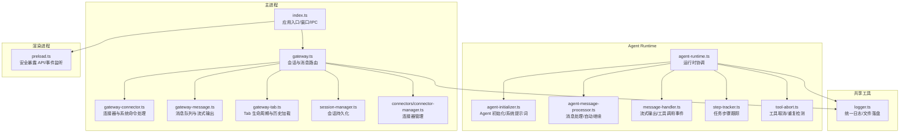
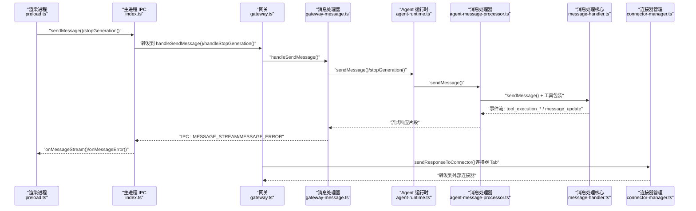
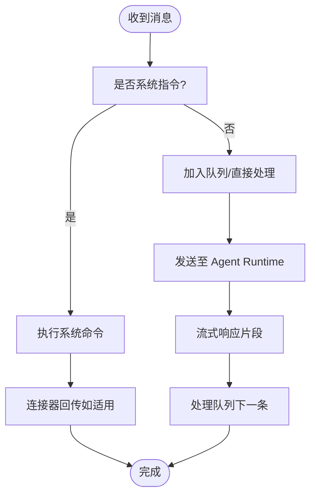
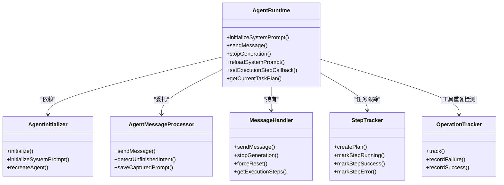
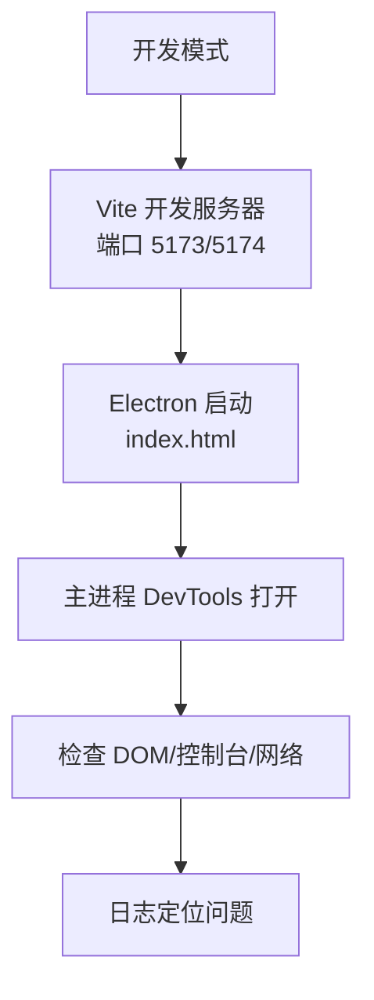
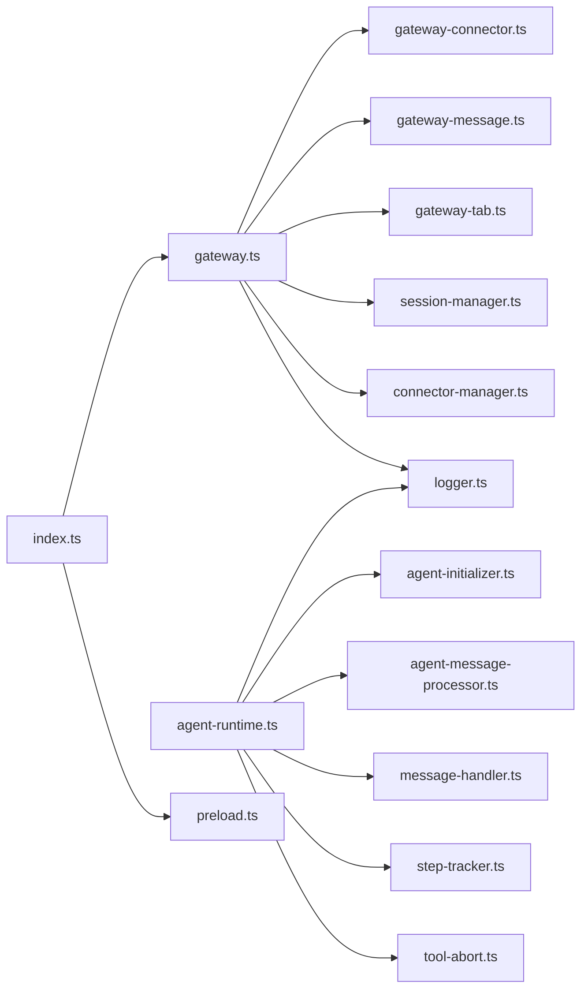

# 调试工具

<cite>
**本文档引用的文件**
- [src/main/index.ts](file://src/main/index.ts)
- [src/main/preload.ts](file://src/main/preload.ts)
- [src/main/gateway.ts](file://src/main/gateway.ts)
- [src/main/gateway-connector.ts](file://src/main/gateway-connector.ts)
- [src/main/gateway-message.ts](file://src/main/gateway-message.ts)
- [src/main/gateway-tab.ts](file://src/main/gateway-tab.ts)
- [src/main/agent-runtime/agent-runtime.ts](file://src/main/agent-runtime/agent-runtime.ts)
- [src/main/agent-runtime/agent-initializer.ts](file://src/main/agent-runtime/agent-initializer.ts)
- [src/main/agent-runtime/agent-message-processor.ts](file://src/main/agent-runtime/agent-message-processor.ts)
- [src/main/agent-runtime/message-handler.ts](file://src/main/agent-runtime/message-handler.ts)
- [src/main/agent-runtime/step-tracker.ts](file://src/main/agent-runtime/step-tracker.ts)
- [src/main/tools/tool-abort.ts](file://src/main/tools/tool-abort.ts)
- [src/main/session/session-manager.ts](file://src/main/session/session-manager.ts)
- [src/main/connectors/connector-manager.ts](file://src/main/connectors/connector-manager.ts)
- [src/shared/utils/logger.ts](file://src/shared/utils/logger.ts)
- [vite.config.ts](file://vite.config.ts)
- [package.json](file://package.json)
</cite>

## 目录
1. [简介](#简介)
2. [项目结构](#项目结构)
3. [核心组件](#核心组件)
4. [架构总览](#架构总览)
5. [详细组件分析](#详细组件分析)
6. [依赖关系分析](#依赖关系分析)
7. [性能考量](#性能考量)
8. [故障排查指南](#故障排查指南)
9. [结论](#结论)
10. [附录](#附录)

## 简介
本指南面向 史丽慧小助理 的开发者与运维人员，提供一套系统化的调试方法论与实操步骤，覆盖日志调试、断点调试、性能分析与工具链联动。重点围绕以下方面展开：
- Electron 主进程与渲染进程的调试（含 DevTools、远程调试、热重载）
- Gateway 消息路由与连接器交互的调试
- Agent Runtime 执行流程与工具调用链的跟踪
- 日志系统与文件落盘策略
- 开发/生产环境的调试配置与安全限制
- 常见问题的定位与处理流程

## 项目结构
史丽慧小助理 采用 Electron + TypeScript 的架构，主进程负责窗口、IPC、网关与连接器管理；渲染进程负责 UI 与前端交互；Agent Runtime 负责智能体执行与工具调用。

图示来源
- [src/main/index.ts:119-331](file://src/main/index.ts#L119-L331)
- [src/main/gateway.ts:29-114](file://src/main/gateway.ts#L29-L114)
- [src/main/gateway-connector.ts:44-88](file://src/main/gateway-connector.ts#L44-L88)
- [src/main/gateway-message.ts:31-64](file://src/main/gateway-message.ts#L31-L64)
- [src/main/gateway-tab.ts:26-61](file://src/main/gateway-tab.ts#L26-L61)
- [src/main/agent-runtime/agent-runtime.ts:27-188](file://src/main/agent-runtime/agent-runtime.ts#L27-L188)
- [src/main/agent-runtime/agent-initializer.ts:17-71](file://src/main/agent-runtime/agent-initializer.ts#L17-L71)
- [src/main/agent-runtime/agent-message-processor.ts:20-45](file://src/main/agent-runtime/agent-message-processor.ts#L20-L45)
- [src/main/agent-runtime/message-handler.ts:16-35](file://src/main/agent-runtime/message-handler.ts#L16-L35)
- [src/main/agent-runtime/step-tracker.ts:34-43](file://src/main/agent-runtime/step-tracker.ts#L34-L43)
- [src/main/tools/tool-abort.ts:149-271](file://src/main/tools/tool-abort.ts#L149-L271)
- [src/main/session/session-manager.ts:17-26](file://src/main/session/session-manager.ts#L17-L26)
- [src/main/connectors/connector-manager.ts:21-28](file://src/main/connectors/connector-manager.ts#L21-L28)
- [src/shared/utils/logger.ts:16-30](file://src/shared/utils/logger.ts#L16-L30)
- [src/main/preload.ts:75-409](file://src/main/preload.ts#L75-L409)

章节来源
- [src/main/index.ts:119-331](file://src/main/index.ts#L119-L331)
- [src/main/gateway.ts:29-114](file://src/main/gateway.ts#L29-L114)
- [src/main/agent-runtime/agent-runtime.ts:27-188](file://src/main/agent-runtime/agent-runtime.ts#L27-L188)
- [src/shared/utils/logger.ts:16-30](file://src/shared/utils/logger.ts#L16-L30)

## 核心组件
- 主进程入口与窗口：负责创建 BrowserWindow、注册 IPC、初始化 Gateway，并在开发模式下开启 DevTools。
- 网关（Gateway）：会话生命周期、消息路由、连接器与系统命令处理、Tab 管理、运行时重置与配置热重载。
- Agent Runtime：统一的智能体运行时，协调初始化、消息处理、工具调用、执行步骤与任务计划。
- 日志系统：统一日志门面，支持控制台输出与文件落盘，便于问题定位与审计。
- 连接器管理：抽象外部连接器（如飞书）的接入、启动、停止与消息转发。

章节来源
- [src/main/index.ts:307-331](file://src/main/index.ts#L307-L331)
- [src/main/gateway.ts:29-114](file://src/main/gateway.ts#L29-L114)
- [src/main/agent-runtime/agent-runtime.ts:27-188](file://src/main/agent-runtime/agent-runtime.ts#L27-L188)
- [src/shared/utils/logger.ts:16-30](file://src/shared/utils/logger.ts#L16-L30)
- [src/main/connectors/connector-manager.ts:21-28](file://src/main/connectors/connector-manager.ts#L21-L28)

## 架构总览
下图展示从渲染进程发起消息到 Agent Runtime 执行、工具调用、再到连接器回传的关键路径与调试关注点。

图示来源
- [src/main/preload.ts:75-409](file://src/main/preload.ts#L75-L409)
- [src/main/index.ts:336-421](file://src/main/index.ts#L336-L421)
- [src/main/gateway.ts:455-466](file://src/main/gateway.ts#L455-L466)
- [src/main/gateway-message.ts:76-160](file://src/main/gateway-message.ts#L76-L160)
- [src/main/agent-runtime/agent-runtime.ts:661-688](file://src/main/agent-runtime/agent-runtime.ts#L661-L688)
- [src/main/agent-runtime/agent-message-processor.ts:345-548](file://src/main/agent-runtime/agent-message-processor.ts#L345-L548)
- [src/main/agent-runtime/message-handler.ts:114-587](file://src/main/agent-runtime/message-handler.ts#L114-L587)
- [src/main/connectors/connector-manager.ts:178-207](file://src/main/connectors/connector-manager.ts#L178-L207)

## 详细组件分析

### 网关（Gateway）与消息路由调试
- 关键职责：会话管理、消息路由、连接器与系统命令处理、Tab 生命周期、运行时重置与配置热重载。
- 调试要点：
  - 使用日志观察会话创建、销毁与重置流程。
  - 检查队列与并发：普通 Tab 会进入队列等待，定时任务 Tab 会等待上一次执行完成。
  - 连接器消息：确认 conversationKey、群组名称更新、系统指令（/new、/memory、/history、/stop、/status、/reload-env）解析与执行。
  - 进度提醒：长任务的进度提示定时器是否按预期触发与清理。
- 常见问题：
  - 队列堆积：检查是否遗漏处理下一条消息或异常未清理定时器。
  - 连接器回传失败：确认 connectorId/conversationId 与 replyToMessageId 的映射。

图示来源
- [src/main/gateway-connector.ts:98-296](file://src/main/gateway-connector.ts#L98-L296)
- [src/main/gateway-message.ts:76-160](file://src/main/gateway-message.ts#L76-L160)
- [src/main/gateway-message.ts:288-371](file://src/main/gateway-message.ts#L288-L371)

章节来源
- [src/main/gateway.ts:455-557](file://src/main/gateway.ts#L455-L557)
- [src/main/gateway-connector.ts:98-296](file://src/main/gateway-connector.ts#L98-L296)
- [src/main/gateway-message.ts:76-160](file://src/main/gateway-message.ts#L76-L160)

### Agent Runtime 执行流程与工具调用链跟踪
- 关键职责：初始化 Agent、加载工具、构建系统提示词、消息处理、工具调用事件收集、执行步骤与任务计划跟踪。
- 调试要点：
  - 系统提示词初始化与重载：观察初始化状态、重复初始化防护与重载触发。
  - 工具包装：AbortController 注入、重复检测、失败计数与自动停止。
  - 流式输出：message_handler 的事件流（tool_execution_*、message_update）、思维过程（thinking）解析。
  - 自动继续：detectUnfinishedIntent 的判断逻辑与自动继续触发。
- 常见问题：
  - Agent 卡住：检查 isCurrentlyGenerating、forceReset 与 stopGeneration 的调用。
  - 工具重复执行：OperationTracker 的重复检测阈值与浏览器工具的特殊处理。
  - 空响应：检查 AI 返回空响应的错误分支与重试逻辑。

图示来源
- [src/main/agent-runtime/agent-runtime.ts:193-229](file://src/main/agent-runtime/agent-runtime.ts#L193-L229)
- [src/main/agent-runtime/agent-runtime.ts:661-688](file://src/main/agent-runtime/agent-runtime.ts#L661-L688)
- [src/main/agent-runtime/agent-initializer.ts:42-71](file://src/main/agent-runtime/agent-initializer.ts#L42-L71)
- [src/main/agent-runtime/agent-message-processor.ts:345-548](file://src/main/agent-runtime/agent-message-processor.ts#L345-L548)
- [src/main/agent-runtime/message-handler.ts:114-587](file://src/main/agent-runtime/message-handler.ts#L114-L587)
- [src/main/agent-runtime/step-tracker.ts:48-145](file://src/main/agent-runtime/step-tracker.ts#L48-L145)
- [src/main/tools/tool-abort.ts:149-271](file://src/main/tools/tool-abort.ts#L149-L271)

章节来源
- [src/main/agent-runtime/agent-runtime.ts:193-229](file://src/main/agent-runtime/agent-runtime.ts#L193-L229)
- [src/main/agent-runtime/agent-message-processor.ts:345-548](file://src/main/agent-runtime/agent-message-processor.ts#L345-L548)
- [src/main/agent-runtime/message-handler.ts:114-587](file://src/main/agent-runtime/message-handler.ts#L114-L587)
- [src/main/tools/tool-abort.ts:149-271](file://src/main/tools/tool-abort.ts#L149-L271)

### 连接器与系统命令处理
- 关键职责：解析外部消息、创建/查找 Tab、系统指令解析与执行、进度提醒、连接器回传。
- 调试要点：
  - 群组消息：飞书群组名称动态更新、conversationKey 的一致性。
  - 系统指令：/status、/stop 的即时执行与回传；/new、/memory、/history 的 UI 通知与自动触发。
  - 进度提醒：定时器注册、清理与连接器回传。
- 常见问题：
  - 群组标题未更新：检查异步获取群名称的回调与更新逻辑。
  - 指令未回传：确认 Tab 类型与 sendResponseToConnector 的条件。

章节来源
- [src/main/gateway-connector.ts:118-296](file://src/main/gateway-connector.ts#L118-L296)
- [src/main/gateway-connector.ts:488-767](file://src/main/gateway-connector.ts#L488-L767)
- [src/main/gateway-connector.ts:773-800](file://src/main/gateway-connector.ts#L773-L800)

### 日志系统与文件落盘
- 统一日志门面：支持 DEBUG/INFO/WARN/ERROR 级别，控制台输出与文件落盘。
- 调试要点：
  - 控制台：主进程与渲染进程的 console-message 监听。
  - 文件：日志目录与文件路径、启动时写入分隔符、可选启用文件日志。
- 常见问题：
  - 文件写入失败：捕获 EPIPE 等错误并降级到控制台输出。
  - 日志过大：可通过外部工具轮转或在应用层扩展清理逻辑。

章节来源
- [src/shared/utils/logger.ts:16-30](file://src/shared/utils/logger.ts#L16-L30)
- [src/main/index.ts:162-169](file://src/main/index.ts#L162-L169)

### 会话与持久化
- SessionManager：负责消息持久化、上下文消息加载、UI 消息加载与清理。
- 调试要点：
  - UI 消息上限（100 轮）、上下文消息上限（10 轮）。
  - 执行步骤与总耗时的持久化恢复。
- 常见问题：
  - 历史消息缺失：检查 session 文件是否存在与格式是否正确。
  - 上下文超限：确认上下文压缩逻辑与消息轮数统计。

章节来源
- [src/main/session/session-manager.ts:103-130](file://src/main/session/session-manager.ts#L103-L130)
- [src/main/session/session-manager.ts:156-173](file://src/main/session/session-manager.ts#L156-L173)

### Electron DevTools 与远程调试
- 开发模式：Vite 开发服务器 + Electron，主进程窗口自动打开 DevTools。
- 远程调试：通过 preload 暴露的 API 与主进程 IPC，结合日志定位问题。
- 热重载：Vite 配置区分 Electron/Web 模式，端口与输出目录不同。

图示来源
- [vite.config.ts:44-48](file://vite.config.ts#L44-L48)
- [src/main/index.ts:149-151](file://src/main/index.ts#L149-L151)
- [src/main/preload.ts:75-409](file://src/main/preload.ts#L75-L409)

章节来源
- [vite.config.ts:44-48](file://vite.config.ts#L44-L48)
- [src/main/index.ts:149-151](file://src/main/index.ts#L149-L151)
- [src/main/preload.ts:75-409](file://src/main/preload.ts#L75-L409)

## 依赖关系分析
- 主进程依赖：Gateway、IPC 处理器、连接器管理、会话管理。
- Agent Runtime 依赖：AgentInitializer、MessageHandler、StepTracker、OperationTracker。
- 工具链：AbortSignal、工具包装、重复检测、失败计数。
- 日志：统一 Logger，支持文件落盘。

图示来源
- [src/main/index.ts:307-331](file://src/main/index.ts#L307-L331)
- [src/main/gateway.ts:337-374](file://src/main/gateway.ts#L337-L374)
- [src/main/agent-runtime/agent-runtime.ts:166-184](file://src/main/agent-runtime/agent-runtime.ts#L166-L184)
- [src/shared/utils/logger.ts:16-30](file://src/shared/utils/logger.ts#L16-L30)

章节来源
- [src/main/index.ts:307-331](file://src/main/index.ts#L307-L331)
- [src/main/gateway.ts:337-374](file://src/main/gateway.ts#L337-L374)
- [src/main/agent-runtime/agent-runtime.ts:166-184](file://src/main/agent-runtime/agent-runtime.ts#L166-L184)

## 性能考量
- 上下文压缩：在消息进入 Agent 前进行上下文压缩，降低 Token 使用率。
- 串行工具执行：避免并发工具调用导致的资源竞争与依赖问题。
- 流式输出：按块输出，前端实时渲染，减少等待时间。
- 超时与重试：AI 连接错误时自动恢复，清理缓存并重置运行时。
- 进度提醒：长任务定时提醒，避免用户误以为卡死。

章节来源
- [src/main/agent-runtime/agent-message-processor.ts:406-423](file://src/main/agent-runtime/agent-message-processor.ts#L406-L423)
- [src/main/agent-runtime/agent-initializer.ts:68-70](file://src/main/agent-runtime/agent-initializer.ts#L68-L70)
- [src/main/gateway-message.ts:246-283](file://src/main/gateway-message.ts#L246-L283)

## 故障排查指南
- 无法打开 DevTools
  - 确认开发模式与 Vite 端口配置。
  - 检查主进程窗口创建与 DevTools 打开逻辑。
- 消息未显示或卡住
  - 检查队列是否堆积、是否触发自动继续。
  - 查看 MESSAGE_STREAM/MESSAGE_ERROR 事件是否到达前端。
- Agent 卡住或状态异常
  - 使用 forceReset 重置状态，必要时 stopGeneration 并重建 Agent。
- 连接器消息未回传
  - 校验 conversationKey、connectorId、conversationId 与 replyToMessageId。
  - 检查连接器健康状态与广播待授权数量。
- 工具重复执行或失败过多
  - 检查 OperationTracker 的重复检测与失败计数阈值。
  - 查看工具包装的 AbortSignal 与错误检测逻辑。
- 日志缺失或写入失败
  - 检查文件落盘开关与目录权限。
  - 捕获 EPIPE 等错误并降级输出。

章节来源
- [src/main/index.ts:149-151](file://src/main/index.ts#L149-L151)
- [src/main/gateway-message.ts:288-371](file://src/main/gateway-message.ts#L288-L371)
- [src/main/agent-runtime/message-handler.ts:682-698](file://src/main/agent-runtime/message-handler.ts#L682-L698)
- [src/main/gateway-connector.ts:431-483](file://src/main/gateway-connector.ts#L431-L483)
- [src/main/tools/tool-abort.ts:149-271](file://src/main/tools/tool-abort.ts#L149-L271)
- [src/shared/utils/logger.ts:51-65](file://src/shared/utils/logger.ts#L51-L65)

## 结论
通过日志、IPC 事件流、工具链包装与连接器回传机制，史丽慧小助理 形成了完整的调试闭环。建议在开发阶段充分利用 DevTools 与文件日志，在生产阶段谨慎开启文件日志并配合外部日志采集。针对 Gateway、Agent Runtime 与连接器的调试，建议按本文档的组件分析与故障排查步骤逐步定位，优先从事件流与工具调用链入手，结合上下文压缩与超时重试策略提升稳定性。

## 附录
- 开发脚本与模式
  - 开发模式：主进程与渲染进程并行监听，Vite 端口 5173（Electron）或 5174（Web）。
  - Web 模式：通过 Vite 模式切换与 define 变量注入，区分入口与输出目录。
- 安全与限制
  - 主进程 Polyfill 与文件 API 兼容。
  - 托盘最小化行为与窗口拦截外部链接的安全策略。

章节来源
- [package.json:9-38](file://package.json#L9-L38)
- [vite.config.ts:44-60](file://vite.config.ts#L44-L60)
- [src/main/index.ts:11-21](file://src/main/index.ts#L11-L21)
- [src/main/index.ts:199-215](file://src/main/index.ts#L199-L215)