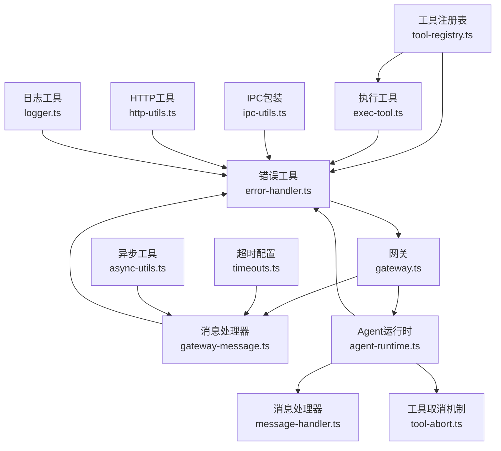
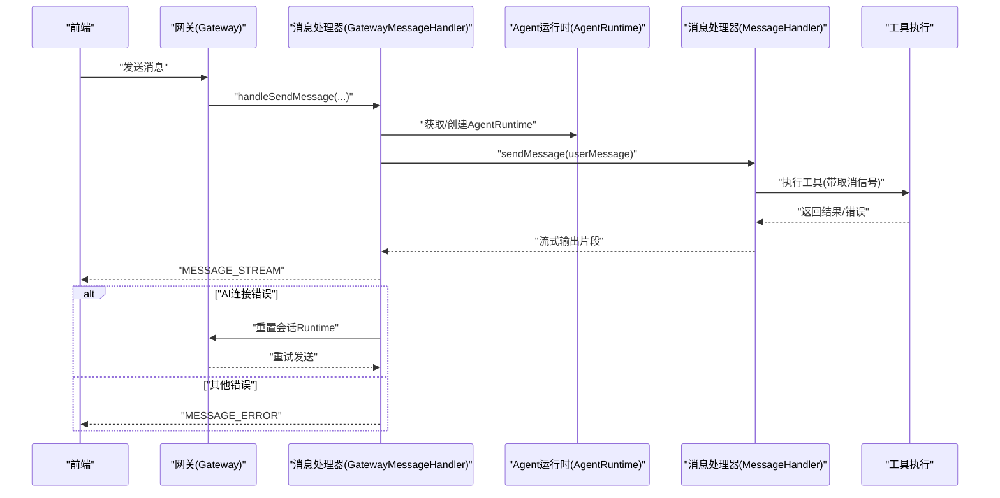
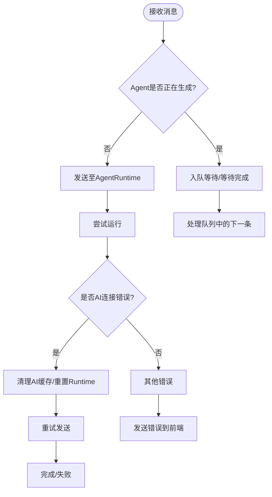
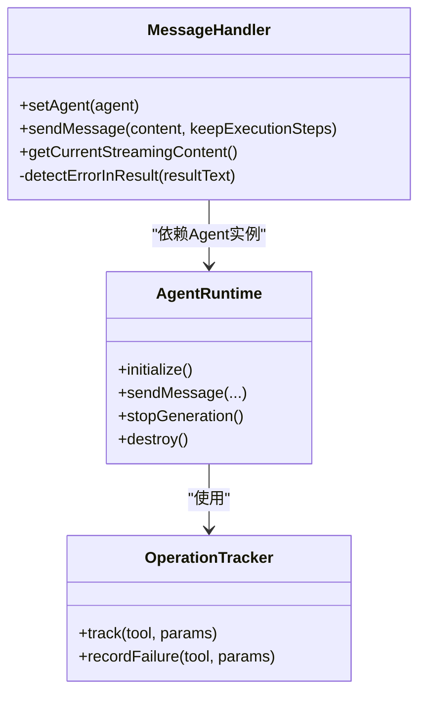
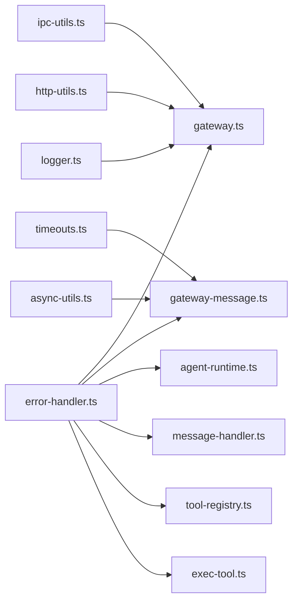

# 错误处理

<cite>
**本文档引用的文件**
- [src/shared/utils/error-handler.ts](file://src/shared/utils/error-handler.ts)
- [src/main/gateway.ts](file://src/main/gateway.ts)
- [src/main/gateway-message.ts](file://src/main/gateway-message.ts)
- [src/main/gateway-tab.ts](file://src/main/gateway-tab.ts)
- [src/main/agent-runtime/agent-runtime.ts](file://src/main/agent-runtime/agent-runtime.ts)
- [src/main/agent-runtime/message-handler.ts](file://src/main/agent-runtime/message-handler.ts)
- [src/main/tools/registry/tool-registry.ts](file://src/main/tools/registry/tool-registry.ts)
- [src/main/tools/exec-tool.ts](file://src/main/tools/exec-tool.ts)
- [src/main/tools/tool-abort.ts](file://src/main/tools/tool-abort.ts)
- [src/main/tools/handlers/handler-utils.ts](file://src/main/tools/handlers/handler-utils.ts)
- [src/shared/utils/ipc-utils.ts](file://src/shared/utils/ipc-utils.ts)
- [src/shared/utils/http-utils.ts](file://src/shared/utils/http-utils.ts)
- [src/shared/utils/logger.ts](file://src/shared/utils/logger.ts)
- [src/main/config/timeouts.ts](file://src/main/config/timeouts.ts)
- [src/shared/utils/async-utils.ts](file://src/shared/utils/async-utils.ts)
</cite>

## 目录
1. [简介](#简介)
2. [项目结构](#项目结构)
3. [核心组件](#核心组件)
4. [架构总览](#架构总览)
5. [详细组件分析](#详细组件分析)
6. [依赖关系分析](#依赖关系分析)
7. [性能考量](#性能考量)
8. [故障排查指南](#故障排查指南)
9. [结论](#结论)
10. [附录](#附录)

## 简介
本指南系统性阐述 DeepBot 的全局错误处理机制，覆盖错误捕获、分类、记录与恢复策略。内容涵盖系统级错误、工具执行错误、网络错误与配置错误的差异化处理；提供最佳实践（如 try-catch 模式、错误信息格式化与用户友好提示）；并结合 Gateway 的消息处理、工具注册与执行过程中的异常处理进行深入剖析。同时给出具体代码示例路径、调试技巧与常见错误场景的解决方案与预防措施。

## 项目结构
DeepBot 的错误处理体系围绕以下层次展开：
- 统一错误工具层：提供错误提取、类型判断、日志记录与响应封装。
- 网关与消息层：负责消息路由、队列与流式输出，包含自动恢复与错误降级。
- Agent 运行时层：管理 Agent 生命周期、工具执行与取消机制。
- 工具与注册层：工具加载、安全检查与执行错误检测。
- 通用工具层：IPC 包装、HTTP 请求、日志与异步工具。

图表来源
- [src/shared/utils/error-handler.ts:1-51](file://src/shared/utils/error-handler.ts#L1-L51)
- [src/main/gateway.ts:1-772](file://src/main/gateway.ts#L1-L772)
- [src/main/gateway-message.ts:1-525](file://src/main/gateway-message.ts#L1-L525)
- [src/main/agent-runtime/agent-runtime.ts:1-909](file://src/main/agent-runtime/agent-runtime.ts#L1-L909)
- [src/main/agent-runtime/message-handler.ts:1-752](file://src/main/agent-runtime/message-handler.ts#L1-L752)
- [src/main/tools/registry/tool-registry.ts:1-328](file://src/main/tools/registry/tool-registry.ts#L1-L328)
- [src/main/tools/exec-tool.ts:1-529](file://src/main/tools/exec-tool.ts#L1-L529)
- [src/main/tools/tool-abort.ts:1-427](file://src/main/tools/tool-abort.ts#L1-L427)
- [src/shared/utils/ipc-utils.ts:1-58](file://src/shared/utils/ipc-utils.ts#L1-L58)
- [src/shared/utils/http-utils.ts:1-260](file://src/shared/utils/http-utils.ts#L1-L260)
- [src/shared/utils/logger.ts:1-174](file://src/shared/utils/logger.ts#L1-L174)
- [src/main/config/timeouts.ts:1-28](file://src/main/config/timeouts.ts#L1-L28)
- [src/shared/utils/async-utils.ts:1-41](file://src/shared/utils/async-utils.ts#L1-L41)

章节来源
- [src/shared/utils/error-handler.ts:1-51](file://src/shared/utils/error-handler.ts#L1-L51)
- [src/main/gateway.ts:1-772](file://src/main/gateway.ts#L1-L772)
- [src/main/gateway-message.ts:1-525](file://src/main/gateway-message.ts#L1-L525)
- [src/main/agent-runtime/agent-runtime.ts:1-909](file://src/main/agent-runtime/agent-runtime.ts#L1-L909)
- [src/main/agent-runtime/message-handler.ts:1-752](file://src/main/agent-runtime/message-handler.ts#L1-L752)
- [src/main/tools/registry/tool-registry.ts:1-328](file://src/main/tools/registry/tool-registry.ts#L1-L328)
- [src/main/tools/exec-tool.ts:1-529](file://src/main/tools/exec-tool.ts#L1-L529)
- [src/main/tools/tool-abort.ts:1-427](file://src/main/tools/tool-abort.ts#L1-L427)
- [src/shared/utils/ipc-utils.ts:1-58](file://src/shared/utils/ipc-utils.ts#L1-L58)
- [src/shared/utils/http-utils.ts:1-260](file://src/shared/utils/http-utils.ts#L1-L260)
- [src/shared/utils/logger.ts:1-174](file://src/shared/utils/logger.ts#L1-L174)
- [src/main/config/timeouts.ts:1-28](file://src/main/config/timeouts.ts#L1-L28)
- [src/shared/utils/async-utils.ts:1-41](file://src/shared/utils/async-utils.ts#L1-L41)

## 核心组件
- 统一错误工具：提供 getErrorMessage、isAbortError、logError、createErrorResponse 等通用能力，贯穿各模块。
- 网关与消息处理器：负责消息队列、流式输出、AI 连接错误自动恢复与错误降级。
- Agent 运行时与消息处理器：管理 Agent 生命周期、工具执行、取消与错误检测。
- 工具注册与执行：工具加载、安全检查、阻塞命令拦截与执行结果错误判定。
- IPC 与 HTTP 工具：统一包装错误，保障前后端交互稳定。
- 日志与超时：提供结构化日志与超时控制，支撑可观测性与稳定性。

章节来源
- [src/shared/utils/error-handler.ts:1-51](file://src/shared/utils/error-handler.ts#L1-L51)
- [src/main/gateway-message.ts:1-525](file://src/main/gateway-message.ts#L1-L525)
- [src/main/agent-runtime/agent-runtime.ts:1-909](file://src/main/agent-runtime/agent-runtime.ts#L1-L909)
- [src/main/agent-runtime/message-handler.ts:1-752](file://src/main/agent-runtime/message-handler.ts#L1-L752)
- [src/main/tools/registry/tool-registry.ts:1-328](file://src/main/tools/registry/tool-registry.ts#L1-L328)
- [src/main/tools/exec-tool.ts:1-529](file://src/main/tools/exec-tool.ts#L1-L529)
- [src/shared/utils/ipc-utils.ts:1-58](file://src/shared/utils/ipc-utils.ts#L1-L58)
- [src/shared/utils/http-utils.ts:1-260](file://src/shared/utils/http-utils.ts#L1-L260)
- [src/shared/utils/logger.ts:1-174](file://src/shared/utils/logger.ts#L1-L174)
- [src/main/config/timeouts.ts:1-28](file://src/main/config/timeouts.ts#L1-L28)

## 架构总览
下图展示错误处理在系统中的流转路径：从消息进入网关，到 Agent 运行时处理，再到工具执行与结果判定，最终通过消息处理器与前端通信，并在必要时进行自动恢复与错误降级。

图表来源
- [src/main/gateway.ts:1-772](file://src/main/gateway.ts#L1-L772)
- [src/main/gateway-message.ts:1-525](file://src/main/gateway-message.ts#L1-L525)
- [src/main/agent-runtime/agent-runtime.ts:1-909](file://src/main/agent-runtime/agent-runtime.ts#L1-L909)
- [src/main/agent-runtime/message-handler.ts:1-752](file://src/main/agent-runtime/message-handler.ts#L1-L752)

## 详细组件分析

### 统一错误工具与日志
- 错误提取与类型判断：getErrorMessage、isAbortError、isCancelError 提供标准化错误信息与类型识别。
- 日志记录：logError 提供模块化错误日志；logger.ts 提供结构化日志与文件落盘能力。
- 响应封装：createErrorResponse 统一错误响应格式，便于前端展示。

图表来源
- [src/shared/utils/error-handler.ts:1-51](file://src/shared/utils/error-handler.ts#L1-L51)
- [src/shared/utils/logger.ts:1-174](file://src/shared/utils/logger.ts#L1-L174)

章节来源
- [src/shared/utils/error-handler.ts:1-51](file://src/shared/utils/error-handler.ts#L1-L51)
- [src/shared/utils/logger.ts:1-174](file://src/shared/utils/logger.ts#L1-L174)

### 网关与消息处理错误
- 消息队列与并发控制：当 Agent 正在生成时，普通 Tab 将消息入队，定时任务 Tab 等待上一次执行完成。
- AI 连接错误自动恢复：检测超时、连接失败等错误，清理 AI 缓存并重置当前会话 Runtime，再重试。
- 错误降级与用户提示：对网络/超时/连接错误提供用户可理解的提示与建议操作。
- 执行步骤与流式输出：实时发送执行步骤，确保前端感知工具执行状态。

图表来源
- [src/main/gateway-message.ts:1-525](file://src/main/gateway-message.ts#L1-L525)
- [src/main/gateway.ts:1-772](file://src/main/gateway.ts#L1-L772)

章节来源
- [src/main/gateway-message.ts:1-525](file://src/main/gateway-message.ts#L1-L525)
- [src/main/gateway.ts:1-772](file://src/main/gateway.ts#L1-L772)

### Agent 运行时与消息处理器
- Agent 状态检查与修复：检测卡住的 streaming 状态并强制重置，避免状态残留。
- 工具取消与重复检测：通过 AbortController 与 OperationTracker 实现工具取消与重复操作防护。
- 错误检测：对工具结果进行错误模式匹配，识别安全检查失败、权限错误、命令退出码等。

图表来源
- [src/main/agent-runtime/message-handler.ts:1-752](file://src/main/agent-runtime/message-handler.ts#L1-L752)
- [src/main/agent-runtime/agent-runtime.ts:1-909](file://src/main/agent-runtime/agent-runtime.ts#L1-L909)
- [src/main/tools/tool-abort.ts:1-427](file://src/main/tools/tool-abort.ts#L1-L427)

章节来源
- [src/main/agent-runtime/message-handler.ts:1-752](file://src/main/agent-runtime/message-handler.ts#L1-L752)
- [src/main/agent-runtime/agent-runtime.ts:1-909](file://src/main/agent-runtime/agent-runtime.ts#L1-L909)
- [src/main/tools/tool-abort.ts:1-427](file://src/main/tools/tool-abort.ts#L1-L427)

### 工具注册与执行错误
- 工具加载：扫描目录、动态导入、插件注册、禁用状态处理与错误回退。
- 执行安全：危险命令拦截、路径安全检查、阻塞命令检测、环境变量注入与编码处理。
- 执行结果错误判定：对 bash 工具的错误内容进行模式匹配，识别非零退出码与异常堆栈。

图表来源
- [src/main/tools/registry/tool-registry.ts:1-328](file://src/main/tools/registry/tool-registry.ts#L1-L328)
- [src/main/tools/exec-tool.ts:1-529](file://src/main/tools/exec-tool.ts#L1-L529)
- [src/main/tools/tool-abort.ts:1-427](file://src/main/tools/tool-abort.ts#L1-L427)

章节来源
- [src/main/tools/registry/tool-registry.ts:1-328](file://src/main/tools/registry/tool-registry.ts#L1-L328)
- [src/main/tools/exec-tool.ts:1-529](file://src/main/tools/exec-tool.ts#L1-L529)
- [src/main/tools/tool-abort.ts:1-427](file://src/main/tools/tool-abort.ts#L1-L427)

### IPC 与 HTTP 错误处理
- IPC 包装：wrapIpcHandler 统一捕获异常并返回 success/error 结构，避免前端处理分散。
- HTTP 工具：httpRequest/httpGet/httpPost 等封装超时、取消与错误信息，downloadFile 提供下载失败的结构化处理。

章节来源
- [src/shared/utils/ipc-utils.ts:1-58](file://src/shared/utils/ipc-utils.ts#L1-L58)
- [src/shared/utils/http-utils.ts:1-260](file://src/shared/utils/http-utils.ts#L1-L260)

## 依赖关系分析
- 组件耦合：Gateway 依赖 GatewayMessageHandler 与 AgentRuntime；AgentRuntime 依赖 MessageHandler 与工具取消机制；工具注册与执行依赖错误工具与安全检查。
- 外部依赖：IPC、HTTP、日志、超时配置与异步工具为通用基础设施，被各模块广泛使用。
- 循环依赖：当前设计通过模块间清晰职责划分避免循环依赖。

图表来源
- [src/shared/utils/error-handler.ts:1-51](file://src/shared/utils/error-handler.ts#L1-L51)
- [src/main/gateway.ts:1-772](file://src/main/gateway.ts#L1-L772)
- [src/main/gateway-message.ts:1-525](file://src/main/gateway-message.ts#L1-L525)
- [src/main/agent-runtime/agent-runtime.ts:1-909](file://src/main/agent-runtime/agent-runtime.ts#L1-L909)
- [src/main/agent-runtime/message-handler.ts:1-752](file://src/main/agent-runtime/message-handler.ts#L1-L752)
- [src/main/tools/registry/tool-registry.ts:1-328](file://src/main/tools/registry/tool-registry.ts#L1-L328)
- [src/main/tools/exec-tool.ts:1-529](file://src/main/tools/exec-tool.ts#L1-L529)
- [src/shared/utils/ipc-utils.ts:1-58](file://src/shared/utils/ipc-utils.ts#L1-L58)
- [src/shared/utils/http-utils.ts:1-260](file://src/shared/utils/http-utils.ts#L1-L260)
- [src/shared/utils/logger.ts:1-174](file://src/shared/utils/logger.ts#L1-L174)
- [src/main/config/timeouts.ts:1-28](file://src/main/config/timeouts.ts#L1-L28)
- [src/shared/utils/async-utils.ts:1-41](file://src/shared/utils/async-utils.ts#L1-L41)

## 性能考量
- 超时与取消：TIMEOUTS 提供软超时机制，配合 AbortSignal 降低阻塞风险；withTimeout 提供竞速超时封装。
- 队列与等待：消息队列避免并发冲突，waitUntil 提供可控等待与进度回调，减少忙轮询。
- 日志与文件落盘：logger.ts 支持文件日志，但需注意 IO 影响，建议按需开启。

章节来源
- [src/main/config/timeouts.ts:1-28](file://src/main/config/timeouts.ts#L1-L28)
- [src/shared/utils/async-utils.ts:1-41](file://src/shared/utils/async-utils.ts#L1-L41)
- [src/shared/utils/logger.ts:1-174](file://src/shared/utils/logger.ts#L1-L174)

## 故障排查指南
- 常见错误类型与定位
  - 系统级错误：权限不足、命令未找到、文件不存在等，可通过错误模式匹配快速识别。
  - 工具执行错误：非零退出码、异常堆栈、安全检查失败，结合工具结果与日志定位。
  - 网络错误：超时、连接被拒、Fetch 失败，优先检查网络与代理配置。
  - 配置错误：模型配置、工作目录、连接器配置变更后需重新加载。
- 自动恢复策略
  - AI 连接错误：清理 AI 缓存、重置当前会话 Runtime、重试发送。
  - Agent 状态异常：强制停止生成、重置 Agent 实例、重新初始化。
- 调试技巧
  - 启用文件日志：使用 createLogger 并 setFileLogging(true) 记录详细日志。
  - 使用 wrapIpcHandler 与 httpUtils 统一错误输出，便于前端展示。
  - 在工具执行前检查 AbortSignal，及时响应用户停止。

章节来源
- [src/main/gateway-message.ts:1-525](file://src/main/gateway-message.ts#L1-L525)
- [src/main/agent-runtime/message-handler.ts:700-752](file://src/main/agent-runtime/message-handler.ts#L700-L752)
- [src/main/tools/exec-tool.ts:1-529](file://src/main/tools/exec-tool.ts#L1-L529)
- [src/shared/utils/ipc-utils.ts:1-58](file://src/shared/utils/ipc-utils.ts#L1-L58)
- [src/shared/utils/http-utils.ts:1-260](file://src/shared/utils/http-utils.ts#L1-L260)
- [src/shared/utils/logger.ts:1-174](file://src/shared/utils/logger.ts#L1-L174)

## 结论
DeepBot 的错误处理体系以“统一工具 + 分层处理 + 自动恢复”为核心，既保证了系统的稳定性与可观测性，又提供了良好的用户体验。通过标准化的错误提取、类型识别与日志记录，以及针对 AI 连接、工具执行与网络请求的差异化恢复策略，系统能够在复杂场景下保持可靠运行。建议在新增模块时遵循统一错误处理规范，确保一致性与可维护性。

## 附录
- 最佳实践清单
  - 使用 getErrorMessage 统一提取错误信息，避免直接打印对象。
  - 对关键路径使用 try-catch，结合 isAbortError 与 isCancelError 进行分支处理。
  - 在工具执行前注入 AbortSignal，支持用户即时停止。
  - 对网络请求与 IPC 调用使用封装工具，统一错误响应结构。
  - 对 AI 连接错误采用“清理缓存 + 重置 Runtime + 重试”的三段式恢复。
  - 启用文件日志并设置合理级别，便于生产环境排障。
- 常见错误场景与解决方案
  - AI 连接超时：清理缓存、重置会话、重试；若失败，向用户提示网络/配置问题。
  - 工具执行失败：检查参数、权限与路径；对阻塞命令给出替代建议。
  - 网络不可达：检查代理、DNS 与防火墙；提供重试策略与降级提示。
  - 配置变更：触发相应 reload 流程，避免状态不一致。