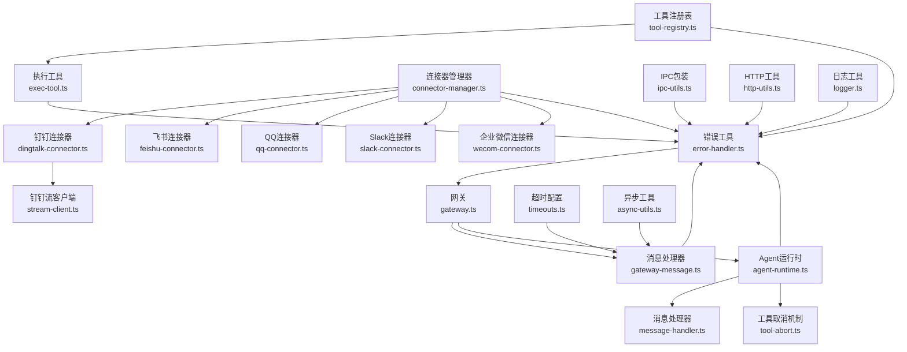
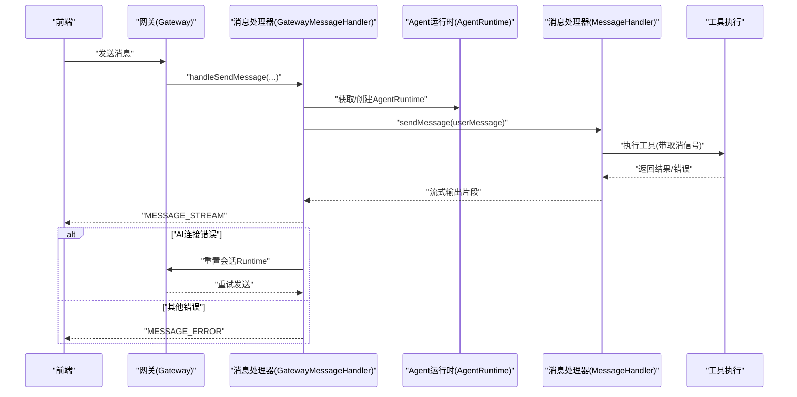
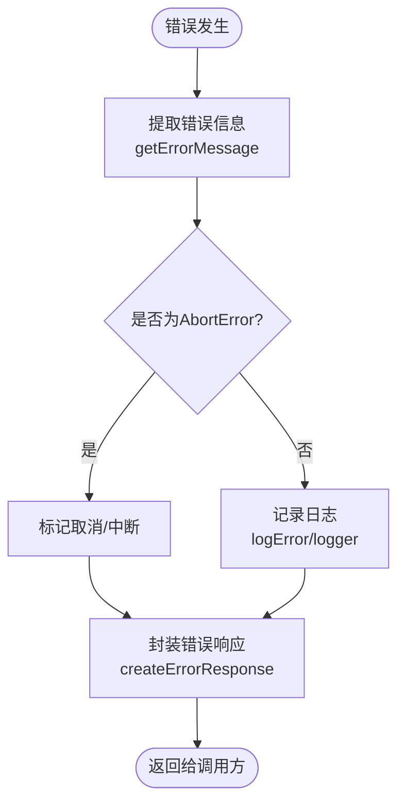
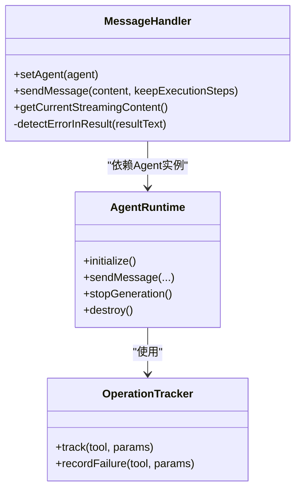
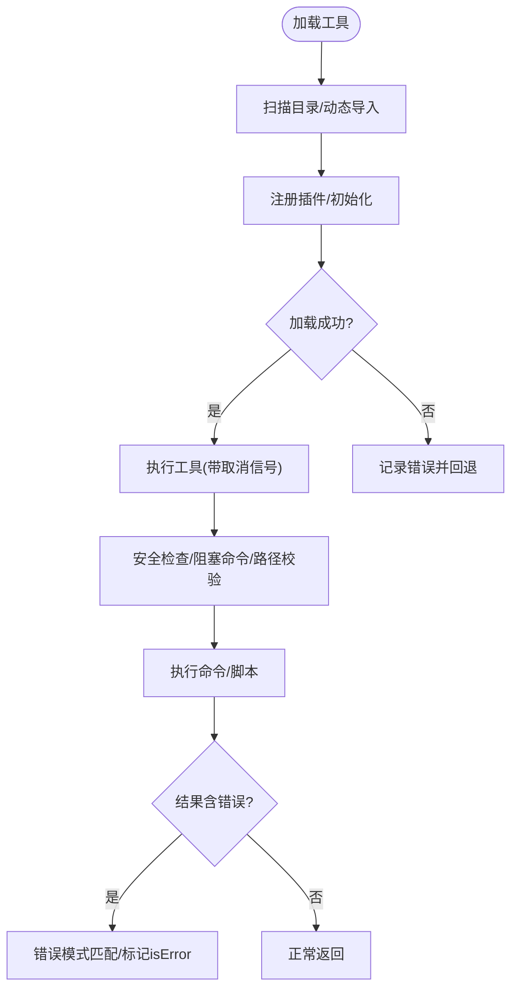
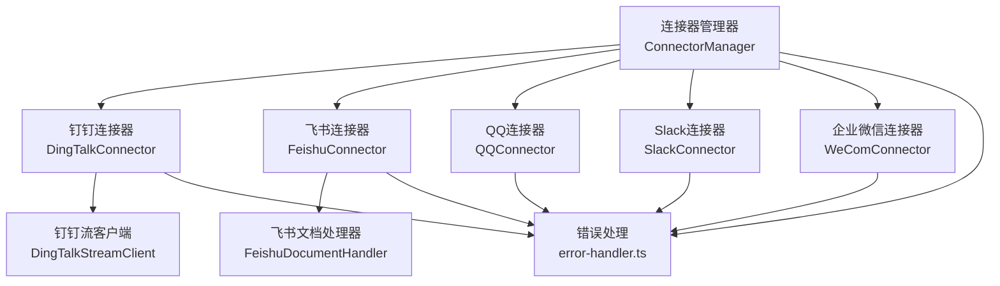
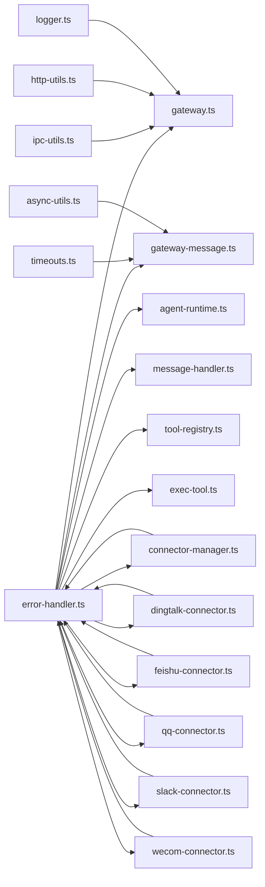

# 错误处理

<cite>
**本文档引用的文件**
- [src/shared/utils/error-handler.ts](file://src/shared/utils/error-handler.ts)
- [src/main/gateway.ts](file://src/main/gateway.ts)
- [src/main/gateway-message.ts](file://src/main/gateway-message.ts)
- [src/main/gateway-tab.ts](file://src/main/gateway-tab.ts)
- [src/main/agent-runtime/agent-runtime.ts](file://src/main/agent-runtime/agent-runtime.ts)
- [src/main/agent-runtime/message-handler.ts](file://src/main/agent-runtime/message-handler.ts)
- [src/main/tools/registry/tool-registry.ts](file://src/main/tools/registry/tool-registry.ts)
- [src/main/tools/exec-tool.ts](file://src/main/tools/exec-tool.ts)
- [src/main/tools/tool-abort.ts](file://src/main/tools/tool-abort.ts)
- [src/main/tools/handlers/handler-utils.ts](file://src/main/tools/handlers/handler-utils.ts)
- [src/shared/utils/ipc-utils.ts](file://src/shared/utils/ipc-utils.ts)
- [src/shared/utils/http-utils.ts](file://src/shared/utils/http-utils.ts)
- [src/shared/utils/logger.ts](file://src/shared/utils/logger.ts)
- [src/main/config/timeouts.ts](file://src/main/config/timeouts.ts)
- [src/shared/utils/async-utils.ts](file://src/shared/utils/async-utils.ts)
- [src/main/connectors/connector-manager.ts](file://src/main/connectors/connector-manager.ts)
- [src/main/connectors/dingtalk/dingtalk-connector.ts](file://src/main/connectors/dingtalk/dingtalk-connector.ts)
- [src/main/connectors/feishu/feishu-connector.ts](file://src/main/connectors/feishu/feishu-connector.ts)
- [src/main/connectors/qq/qq-connector.ts](file://src/main/connectors/qq/qq-connector.ts)
- [src/main/connectors/slack/slack-connector.ts](file://src/main/connectors/slack/slack-connector.ts)
- [src/main/connectors/wecom/wecom-connector.ts](file://src/main/connectors/wecom/wecom-connector.ts)
- [src/main/connectors/dingtalk/stream-client.ts](file://src/main/connectors/dingtalk/stream-client.ts)
</cite>

## 更新摘要
**变更内容**
- 新增连接器错误处理重大改进章节，涵盖所有主要连接器的全面错误处理机制
- 更新连接器架构图，展示新的错误处理流程
- 新增连接器错误处理最佳实践和调试技巧
- 扩展故障排查指南，包含连接器特有的错误场景

## 目录
1. [简介](#简介)
2. [项目结构](#项目结构)
3. [核心组件](#核心组件)
4. [架构总览](#架构总览)
5. [详细组件分析](#详细组件分析)
6. [连接器错误处理重大改进](#连接器错误处理重大改进)
7. [依赖关系分析](#依赖关系分析)
8. [性能考量](#性能考量)
9. [故障排查指南](#故障排查指南)
10. [结论](#结论)
11. [附录](#附录)

## 简介
本指南系统性阐述 DeepBot 的全局错误处理机制，覆盖错误捕获、分类、记录与恢复策略。内容涵盖系统级错误、工具执行错误、网络错误与配置错误的差异化处理；提供最佳实践（如 try-catch 模式、错误信息格式化与用户友好提示）；并结合 Gateway 的消息处理、工具注册与执行过程中的异常处理进行深入剖析。特别关注连接器错误处理的重大改进，所有主要连接器都增加了全面的错误处理机制，包括 try-catch 块、详细错误事件注册和增强的调试信息。

## 项目结构
DeepBot 的错误处理体系围绕以下层次展开：
- 统一错误工具层：提供错误提取、类型判断、日志记录与响应封装。
- 网关与消息层：负责消息路由、队列与流式输出，包含自动恢复与错误降级。
- Agent 运行时层：管理 Agent 生命周期、工具执行与取消机制。
- 工具与注册层：工具加载、安全检查与执行错误检测。
- 连接器系统层：所有主要连接器都实现了全面的错误处理机制。
- 通用工具层：IPC 包装、HTTP 请求、日志与异步工具。

**图表来源**
- [src/shared/utils/error-handler.ts:1-51](file://src/shared/utils/error-handler.ts#L1-L51)
- [src/main/gateway.ts:1-772](file://src/main/gateway.ts#L1-L772)
- [src/main/gateway-message.ts:1-525](file://src/main/gateway-message.ts#L1-L525)
- [src/main/agent-runtime/agent-runtime.ts:1-909](file://src/main/agent-runtime/agent-runtime.ts#L1-L909)
- [src/main/agent-runtime/message-handler.ts:1-752](file://src/main/agent-runtime/message-handler.ts#L1-L752)
- [src/main/tools/registry/tool-registry.ts:1-328](file://src/main/tools/registry/tool-registry.ts#L1-L328)
- [src/main/tools/exec-tool.ts:1-529](file://src/main/tools/exec-tool.ts#L1-L529)
- [src/main/tools/tool-abort.ts:1-427](file://src/main/tools/tool-abort.ts#L1-L427)
- [src/main/connectors/connector-manager.ts:1-379](file://src/main/connectors/connector-manager.ts#L1-L379)
- [src/main/connectors/dingtalk/dingtalk-connector.ts:1-471](file://src/main/connectors/dingtalk/dingtalk-connector.ts#L1-L471)
- [src/main/connectors/feishu/feishu-connector.ts:1-994](file://src/main/connectors/feishu/feishu-connector.ts#L1-L994)
- [src/main/connectors/qq/qq-connector.ts:1-849](file://src/main/connectors/qq/qq-connector.ts#L1-L849)
- [src/main/connectors/slack/slack-connector.ts:1-718](file://src/main/connectors/slack/slack-connector.ts#L1-L718)
- [src/main/connectors/wecom/wecom-connector.ts:1-750](file://src/main/connectors/wecom/wecom-connector.ts#L1-L750)
- [src/main/connectors/dingtalk/stream-client.ts:1-494](file://src/main/connectors/dingtalk/stream-client.ts#L1-L494)

**章节来源**
- [src/shared/utils/error-handler.ts:1-51](file://src/shared/utils/error-handler.ts#L1-L51)
- [src/main/gateway.ts:1-772](file://src/main/gateway.ts#L1-L772)
- [src/main/gateway-message.ts:1-525](file://src/main/gateway-message.ts#L1-L525)
- [src/main/agent-runtime/agent-runtime.ts:1-909](file://src/main/agent-runtime/agent-runtime.ts#L1-L909)
- [src/main/agent-runtime/message-handler.ts:1-752](file://src/main/agent-runtime/message-handler.ts#L1-L752)
- [src/main/tools/registry/tool-registry.ts:1-328](file://src/main/tools/registry/tool-registry.ts#L1-L328)
- [src/main/tools/exec-tool.ts:1-529](file://src/main/tools/exec-tool.ts#L1-L529)
- [src/main/tools/tool-abort.ts:1-427](file://src/main/tools/tool-abort.ts#L1-L427)
- [src/main/connectors/connector-manager.ts:1-379](file://src/main/connectors/connector-manager.ts#L1-L379)
- [src/main/connectors/dingtalk/dingtalk-connector.ts:1-471](file://src/main/connectors/dingtalk/dingtalk-connector.ts#L1-L471)
- [src/main/connectors/feishu/feishu-connector.ts:1-994](file://src/main/connectors/feishu/feishu-connector.ts#L1-L994)
- [src/main/connectors/qq/qq-connector.ts:1-849](file://src/main/connectors/qq/qq-connector.ts#L1-L849)
- [src/main/connectors/slack/slack-connector.ts:1-718](file://src/main/connectors/slack/slack-connector.ts#L1-L718)
- [src/main/connectors/wecom/wecom-connector.ts:1-750](file://src/main/connectors/wecom/wecom-connector.ts#L1-L750)
- [src/main/connectors/dingtalk/stream-client.ts:1-494](file://src/main/connectors/dingtalk/stream-client.ts#L1-L494)

## 核心组件
- 统一错误工具：提供 getErrorMessage、isAbortError、logError、createErrorResponse 等通用能力，贯穿各模块。
- 网关与消息处理器：负责消息队列、流式输出、AI 连接错误自动恢复与错误降级。
- Agent 运行时与消息处理器：管理 Agent 生命周期、工具执行、取消与错误检测。
- 工具注册与执行：工具加载、安全检查、阻塞命令拦截与执行结果错误判定。
- 连接器系统：所有主要连接器都实现了全面的错误处理机制，包括 try-catch 块、详细错误事件注册和增强的调试信息。
- IPC 与 HTTP 工具：统一包装错误，保障前后端交互稳定。
- 日志与超时：提供结构化日志与超时控制，支撑可观测性与稳定性。

**章节来源**
- [src/shared/utils/error-handler.ts:1-51](file://src/shared/utils/error-handler.ts#L1-L51)
- [src/main/gateway-message.ts:1-525](file://src/main/gateway-message.ts#L1-L525)
- [src/main/agent-runtime/agent-runtime.ts:1-909](file://src/main/agent-runtime/agent-runtime.ts#L1-L909)
- [src/main/agent-runtime/message-handler.ts:1-752](file://src/main/agent-runtime/message-handler.ts#L1-L752)
- [src/main/tools/registry/tool-registry.ts:1-328](file://src/main/tools/registry/tool-registry.ts#L1-L328)
- [src/main/tools/exec-tool.ts:1-529](file://src/main/tools/exec-tool.ts#L1-L529)
- [src/shared/utils/ipc-utils.ts:1-58](file://src/shared/utils/ipc-utils.ts#L1-L58)
- [src/shared/utils/http-utils.ts:1-260](file://src/shared/utils/http-utils.ts#L1-L260)
- [src/shared/utils/logger.ts:1-174](file://src/shared/utils/logger.ts#L1-L174)
- [src/main/config/timeouts.ts:1-28](file://src/main/config/timeouts.ts#L1-L28)

## 架构总览
下图展示错误处理在系统中的流转路径：从消息进入网关，到 Agent 运行时处理，再到工具执行与结果判定，最终通过消息处理器与前端通信，并在必要时进行自动恢复与错误降级。

**图表来源**
- [src/main/gateway.ts:1-772](file://src/main/gateway.ts#L1-L772)
- [src/main/gateway-message.ts:1-525](file://src/main/gateway-message.ts#L1-L525)
- [src/main/agent-runtime/agent-runtime.ts:1-909](file://src/main/agent-runtime/agent-runtime.ts#L1-L909)
- [src/main/agent-runtime/message-handler.ts:1-752](file://src/main/agent-runtime/message-handler.ts#L1-L752)

## 详细组件分析

### 统一错误工具与日志
- 错误提取与类型判断：getErrorMessage、isAbortError、isCancelError 提供标准化错误信息与类型识别。
- 日志记录：logError 提供模块化错误日志；logger.ts 提供结构化日志与文件落盘能力。
- 响应封装：createErrorResponse 统一错误响应格式，便于前端展示。

**图表来源**
- [src/shared/utils/error-handler.ts:1-51](file://src/shared/utils/error-handler.ts#L1-L51)
- [src/shared/utils/logger.ts:1-174](file://src/shared/utils/logger.ts#L1-L174)

**章节来源**
- [src/shared/utils/error-handler.ts:1-51](file://src/shared/utils/error-handler.ts#L1-L51)
- [src/shared/utils/logger.ts:1-174](file://src/shared/utils/logger.ts#L1-L174)

### 网关与消息处理错误
- 消息队列与并发控制：当 Agent 正在生成时，普通 Tab 将消息入队，定时任务 Tab 等待上一次执行完成。
- AI 连接错误自动恢复：检测超时、连接失败等错误，清理 AI 缓存并重置当前会话 Runtime，再重试。
- 错误降级与用户提示：对网络/超时/连接错误提供用户可理解的提示与建议操作。
- 执行步骤与流式输出：实时发送执行步骤，确保前端感知工具执行状态。

**图表来源**
- [src/main/gateway-message.ts:1-525](file://src/main/gateway-message.ts#L1-L525)
- [src/main/gateway.ts:1-772](file://src/main/gateway.ts#L1-L772)

**章节来源**
- [src/main/gateway-message.ts:1-525](file://src/main/gateway-message.ts#L1-L525)
- [src/main/gateway.ts:1-772](file://src/main/gateway.ts#L1-L772)

### Agent 运行时与消息处理器
- Agent 状态检查与修复：检测卡住的 streaming 状态并强制重置，避免状态残留。
- 工具取消与重复检测：通过 AbortController 与 OperationTracker 实现工具取消与重复操作防护。
- 错误检测：对工具结果进行错误模式匹配，识别安全检查失败、权限错误、命令退出码等。

**图表来源**
- [src/main/agent-runtime/message-handler.ts:1-752](file://src/main/agent-runtime/message-handler.ts#L1-L752)
- [src/main/agent-runtime/agent-runtime.ts:1-909](file://src/main/agent-runtime/agent-runtime.ts#L1-L909)
- [src/main/tools/tool-abort.ts:1-427](file://src/main/tools/tool-abort.ts#L1-L427)

**章节来源**
- [src/main/agent-runtime/message-handler.ts:1-752](file://src/main/agent-runtime/message-handler.ts#L1-L752)
- [src/main/agent-runtime/agent-runtime.ts:1-909](file://src/main/agent-runtime/agent-runtime.ts#L1-L909)
- [src/main/tools/tool-abort.ts:1-427](file://src/main/tools/tool-abort.ts#L1-L427)

### 工具注册与执行错误
- 工具加载：扫描目录、动态导入、插件注册、禁用状态处理与错误回退。
- 执行安全：危险命令拦截、路径安全检查、阻塞命令检测、环境变量注入与编码处理。
- 执行结果错误判定：对 bash 工具的错误内容进行模式匹配，识别非零退出码与异常堆栈。

**图表来源**
- [src/main/tools/registry/tool-registry.ts:1-328](file://src/main/tools/registry/tool-registry.ts#L1-L328)
- [src/main/tools/exec-tool.ts:1-529](file://src/main/tools/exec-tool.ts#L1-L529)
- [src/main/tools/tool-abort.ts:1-427](file://src/main/tools/tool-abort.ts#L1-L427)

**章节来源**
- [src/main/tools/registry/tool-registry.ts:1-328](file://src/main/tools/registry/tool-registry.ts#L1-L328)
- [src/main/tools/exec-tool.ts:1-529](file://src/main/tools/exec-tool.ts#L1-L529)
- [src/main/tools/tool-abort.ts:1-427](file://src/main/tools/tool-abort.ts#L1-L427)

### IPC 与 HTTP 错误处理
- IPC 包装：wrapIpcHandler 统一捕获异常并返回 success/error 结构，避免前端处理分散。
- HTTP 工具：httpRequest/httpGet/httpPost 等封装超时、取消与错误信息，downloadFile 提供下载失败的结构化处理。

**章节来源**
- [src/shared/utils/ipc-utils.ts:1-58](file://src/shared/utils/ipc-utils.ts#L1-L58)
- [src/shared/utils/http-utils.ts:1-260](file://src/shared/utils/http-utils.ts#L1-L260)

## 连接器错误处理重大改进

### 连接器系统架构
DeepBot 的连接器系统经过重大改进，所有主要连接器都实现了全面的错误处理机制。连接器管理器负责协调各个连接器的生命周期和错误处理。

**图表来源**
- [src/main/connectors/connector-manager.ts:1-379](file://src/main/connectors/connector-manager.ts#L1-L379)
- [src/main/connectors/dingtalk/dingtalk-connector.ts:1-471](file://src/main/connectors/dingtalk/dingtalk-connector.ts#L1-L471)
- [src/main/connectors/feishu/feishu-connector.ts:1-994](file://src/main/connectors/feishu/feishu-connector.ts#L1-L994)
- [src/main/connectors/qq/qq-connector.ts:1-849](file://src/main/connectors/qq/qq-connector.ts#L1-L849)
- [src/main/connectors/slack/slack-connector.ts:1-718](file://src/main/connectors/slack/slack-connector.ts#L1-L718)
- [src/main/connectors/wecom/wecom-connector.ts:1-750](file://src/main/connectors/wecom/wecom-connector.ts#L1-L750)
- [src/main/connectors/dingtalk/stream-client.ts:1-494](file://src/main/connectors/dingtalk/stream-client.ts#L1-L494)

### 钉钉连接器错误处理
钉钉连接器实现了最完整的错误处理机制，包括：

- **启动阶段错误处理**：完整的 try-catch 包装，错误信息详细记录
- **消息处理错误处理**：消息解析、去重、安全检查的完整错误捕获
- **流客户端错误处理**：WebSocket 连接、认证、消息传输的全面错误处理
- **媒体文件处理错误处理**：图片、文件上传的详细错误信息

**章节来源**
- [src/main/connectors/dingtalk/dingtalk-connector.ts:85-123](file://src/main/connectors/dingtalk/dingtalk-connector.ts#L85-L123)
- [src/main/connectors/dingtalk/dingtalk-connector.ts:171-270](file://src/main/connectors/dingtalk/dingtalk-connector.ts#L171-L270)
- [src/main/connectors/dingtalk/stream-client.ts:56-72](file://src/main/connectors/dingtalk/stream-client.ts#L56-L72)

### 飞书连接器错误处理
飞书连接器实现了全面的错误处理机制：

- **SDK 集成错误处理**：使用官方 Node.js SDK 的完整错误处理
- **WebSocket 连接错误处理**：长连接的建立、维护、重连的错误处理
- **消息下载错误处理**：图片、文件下载的详细错误信息
- **用户信息获取错误处理**：用户信息缓存和降级处理
- **文档处理错误处理**：飞书文档读取的完整错误处理

**章节来源**
- [src/main/connectors/feishu/feishu-connector.ts:103-150](file://src/main/connectors/feishu/feishu-connector.ts#L103-L150)
- [src/main/connectors/feishu/feishu-connector.ts:267-286](file://src/main/connectors/feishu/feishu-connector.ts#L267-L286)
- [src/main/connectors/feishu/feishu-connector.ts:368-577](file://src/main/connectors/feishu/feishu-connector.ts#L368-L577)

### QQ 连接器错误处理
QQ 连接器实现了完整的错误处理机制：

- **WebSocket 客户端错误处理**：自定义 WebSocket 客户端的完整错误处理
- **Access Token 管理错误处理**：令牌获取、缓存、过期处理的错误处理
- **消息处理错误处理**：群聊、私聊、单聊消息的完整错误处理
- **API 调用错误处理**：消息发送、图片上传、文件上传的详细错误处理

**章节来源**
- [src/main/connectors/qq/qq-connector.ts:86-124](file://src/main/connectors/qq/qq-connector.ts#L86-L124)
- [src/main/connectors/qq/qq-connector.ts:192-213](file://src/main/connectors/qq/qq-connector.ts#L192-L213)
- [src/main/connectors/qq/qq-connector.ts:401-561](file://src/main/connectors/qq/qq-connector.ts#L401-L561)

### Slack 连接器错误处理
Slack 连接器实现了全面的错误处理机制：

- **Socket Mode 客户端错误处理**：自定义 Socket Mode 客户端的完整错误处理
- **用户信息缓存错误处理**：用户信息获取和缓存的错误处理
- **消息处理错误处理**：不同类型消息的完整错误处理
- **API 调用错误处理**：消息发送、文件上传的详细错误处理

**章节来源**
- [src/main/connectors/slack/slack-connector.ts:85-124](file://src/main/connectors/slack/slack-connector.ts#L85-L124)
- [src/main/connectors/slack/slack-connector.ts:158-181](file://src/main/connectors/slack/slack-connector.ts#L158-L181)
- [src/main/connectors/slack/slack-connector.ts:380-492](file://src/main/connectors/slack/slack-connector.ts#L380-L492)

### 企业微信连接器错误处理
企业微信连接器实现了完整的错误处理机制：

- **WebSocket 客户端错误处理**：自定义 WebSocket 客户端的完整错误处理
- **Access Token 管理错误处理**：令牌获取、缓存、过期处理的错误处理
- **消息处理错误处理**：智能机器人消息的完整错误处理
- **API 调用错误处理**：消息发送、图片上传、文件上传的详细错误处理

**章节来源**
- [src/main/connectors/wecom/wecom-connector.ts:87-127](file://src/main/connectors/wecom/wecom-connector.ts#L87-L127)
- [src/main/connectors/wecom/wecom-connector.ts:186-273](file://src/main/connectors/wecom/wecom-connector.ts#L186-L273)
- [src/main/connectors/wecom/wecom-connector.ts:320-532](file://src/main/connectors/wecom/wecom-connector.ts#L320-L532)

### 连接器管理器错误处理
连接器管理器实现了统一的错误处理机制：

- **连接器启动错误处理**：配置加载、验证、初始化、启动的完整错误处理
- **消息转发错误处理**：外部消息到内部消息转换的错误处理
- **消息发送错误处理**：内部消息到外部消息发送的完整错误处理
- **健康检查错误处理**：连接器健康状态检查的错误处理

**章节来源**
- [src/main/connectors/connector-manager.ts:45-81](file://src/main/connectors/connector-manager.ts#L45-L81)
- [src/main/connectors/connector-manager.ts:130-168](file://src/main/connectors/connector-manager.ts#L130-L168)
- [src/main/connectors/connector-manager.ts:178-207](file://src/main/connectors/connector-manager.ts#L178-L207)
- [src/main/connectors/connector-manager.ts:341-358](file://src/main/connectors/connector-manager.ts#L341-L358)

## 依赖关系分析
- 组件耦合：Gateway 依赖 GatewayMessageHandler 与 AgentRuntime；AgentRuntime 依赖 MessageHandler 与工具取消机制；工具注册与执行依赖错误工具与安全检查；连接器系统依赖连接器管理器与统一错误处理工具。
- 外部依赖：IPC、HTTP、日志、超时配置与异步工具为通用基础设施，被各模块广泛使用。
- 循环依赖：当前设计通过模块间清晰职责划分避免循环依赖。

**图表来源**
- [src/shared/utils/error-handler.ts:1-51](file://src/shared/utils/error-handler.ts#L1-L51)
- [src/main/gateway.ts:1-772](file://src/main/gateway.ts#L1-L772)
- [src/main/gateway-message.ts:1-525](file://src/main/gateway-message.ts#L1-L525)
- [src/main/agent-runtime/agent-runtime.ts:1-909](file://src/main/agent-runtime/agent-runtime.ts#L1-L909)
- [src/main/agent-runtime/message-handler.ts:1-752](file://src/main/agent-runtime/message-handler.ts#L1-L752)
- [src/main/tools/registry/tool-registry.ts:1-328](file://src/main/tools/registry/tool-registry.ts#L1-L328)
- [src/main/tools/exec-tool.ts:1-529](file://src/main/tools/exec-tool.ts#L1-L529)
- [src/shared/utils/ipc-utils.ts:1-58](file://src/shared/utils/ipc-utils.ts#L1-L58)
- [src/shared/utils/http-utils.ts:1-260](file://src/shared/utils/http-utils.ts#L1-L260)
- [src/shared/utils/logger.ts:1-174](file://src/shared/utils/logger.ts#L1-L174)
- [src/main/config/timeouts.ts:1-28](file://src/main/config/timeouts.ts#L1-L28)
- [src/shared/utils/async-utils.ts:1-41](file://src/shared/utils/async-utils.ts#L1-L41)
- [src/main/connectors/connector-manager.ts:1-379](file://src/main/connectors/connector-manager.ts#L1-L379)
- [src/main/connectors/dingtalk/dingtalk-connector.ts:1-471](file://src/main/connectors/dingtalk/dingtalk-connector.ts#L1-L471)
- [src/main/connectors/feishu/feishu-connector.ts:1-994](file://src/main/connectors/feishu/feishu-connector.ts#L1-L994)
- [src/main/connectors/qq/qq-connector.ts:1-849](file://src/main/connectors/qq/qq-connector.ts#L1-L849)
- [src/main/connectors/slack/slack-connector.ts:1-718](file://src/main/connectors/slack/slack-connector.ts#L1-L718)
- [src/main/connectors/wecom/wecom-connector.ts:1-750](file://src/main/connectors/wecom/wecom-connector.ts#L1-L750)

## 性能考量
- 超时与取消：TIMEOUTS 提供软超时机制，配合 AbortSignal 降低阻塞风险；withTimeout 提供竞速超时封装。
- 队列与等待：消息队列避免并发冲突，waitUntil 提供可控等待与进度回调，减少忙轮询。
- 日志与文件落盘：logger.ts 支持文件日志，但需注意 IO 影响，建议按需开启。
- 连接器优化：各连接器实现了连接池、重连机制、心跳检测等性能优化措施。

**章节来源**
- [src/main/config/timeouts.ts:1-28](file://src/main/config/timeouts.ts#L1-L28)
- [src/shared/utils/async-utils.ts:1-41](file://src/shared/utils/async-utils.ts#L1-L41)
- [src/shared/utils/logger.ts:1-174](file://src/shared/utils/logger.ts#L1-L174)

## 故障排查指南
- 常见错误类型与定位
  - 系统级错误：权限不足、命令未找到、文件不存在等，可通过错误模式匹配快速识别。
  - 工具执行错误：非零退出码、异常堆栈、安全检查失败，结合工具结果与日志定位。
  - 网络错误：超时、连接被拒、Fetch 失败，优先检查网络与代理配置。
  - 配置错误：模型配置、工作目录、连接器配置变更后需重新加载。
  - 连接器错误：各连接器特有的认证失败、API 调用错误、连接断开等问题。
- 自动恢复策略
  - AI 连接错误：清理 AI 缓存、重置当前会话 Runtime、重试发送。
  - Agent 状态异常：强制停止生成、重置 Agent 实例、重新初始化。
  - 连接器错误：连接器管理器负责自动重连和错误恢复。
- 调试技巧
  - 启用文件日志：使用 createLogger 并 setFileLogging(true) 记录详细日志。
  - 使用 wrapIpcHandler 与 httpUtils 统一错误输出，便于前端展示。
  - 在工具执行前检查 AbortSignal，及时响应用户停止。
  - 各连接器都提供了详细的控制台日志输出，便于问题诊断。

**章节来源**
- [src/main/gateway-message.ts:1-525](file://src/main/gateway-message.ts#L1-L525)
- [src/main/agent-runtime/message-handler.ts:700-752](file://src/main/agent-runtime/message-handler.ts#L700-L752)
- [src/main/tools/exec-tool.ts:1-529](file://src/main/tools/exec-tool.ts#L1-L529)
- [src/shared/utils/ipc-utils.ts:1-58](file://src/shared/utils/ipc-utils.ts#L1-L58)
- [src/shared/utils/http-utils.ts:1-260](file://src/shared/utils/http-utils.ts#L1-L260)
- [src/shared/utils/logger.ts:1-174](file://src/shared/utils/logger.ts#L1-L174)

## 结论
DeepBot 的错误处理体系以"统一工具 + 分层处理 + 自动恢复"为核心，既保证了系统的稳定性与可观测性，又提供了良好的用户体验。通过标准化的错误提取、类型识别与日志记录，以及针对 AI 连接、工具执行与网络请求的差异化恢复策略，系统能够在复杂场景下保持可靠运行。

**连接器错误处理的重大改进**进一步增强了系统的健壮性。所有主要连接器都实现了全面的错误处理机制，包括：

- **统一的 try-catch 模式**：每个关键操作都包含完整的错误捕获
- **详细的错误事件注册**：连接器客户端会发出详细的错误事件供上层处理
- **增强的调试信息**：每个错误都包含详细的上下文信息和调试日志
- **自动重连机制**：网络错误时自动重连，提高系统可用性
- **优雅降级处理**：部分功能失败时提供降级方案，保证核心功能正常运行

建议在新增模块时遵循统一错误处理规范，确保一致性与可维护性。

## 附录
- 最佳实践清单
  - 使用 getErrorMessage 统一提取错误信息，避免直接打印对象。
  - 对关键路径使用 try-catch，结合 isAbortError 与 isCancelError 进行分支处理。
  - 在工具执行前注入 AbortSignal，支持用户即时停止。
  - 对网络请求与 IPC 调用使用封装工具，统一错误响应结构。
  - 对 AI 连接错误采用"清理缓存 + 重置 Runtime + 重试"的三段式恢复。
  - 启用文件日志并设置合理级别，便于生产环境排障。
  - 连接器开发遵循统一的错误处理模式，确保一致性。
- 常见错误场景与解决方案
  - AI 连接超时：清理缓存、重置会话、重试；若失败，向用户提示网络/配置问题。
  - 工具执行失败：检查参数、权限与路径；对阻塞命令给出替代建议。
  - 网络不可达：检查代理、DNS 与防火墙；提供重试策略与降级提示。
  - 配置变更：触发相应 reload 流程，避免状态不一致。
  - 连接器认证失败：检查凭证有效性，重新获取令牌。
  - 连接器 API 调用失败：检查权限配置，查看详细错误信息。
  - 连接器连接断开：触发自动重连，检查网络状况。