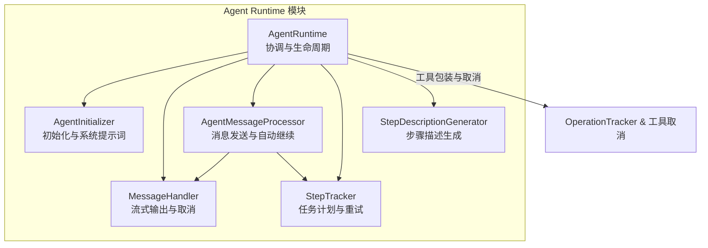
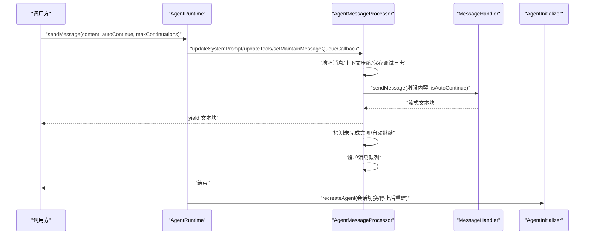
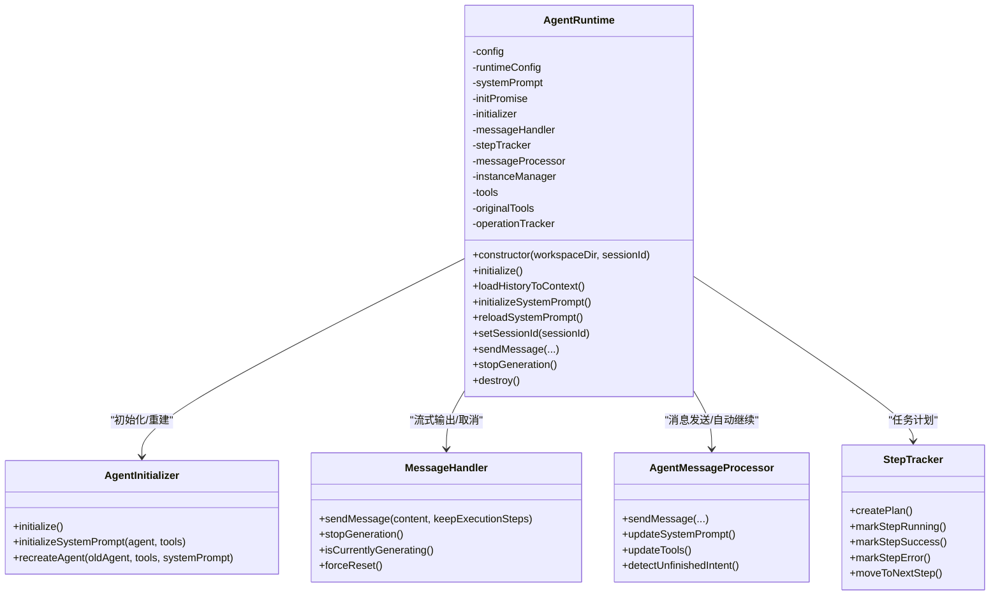
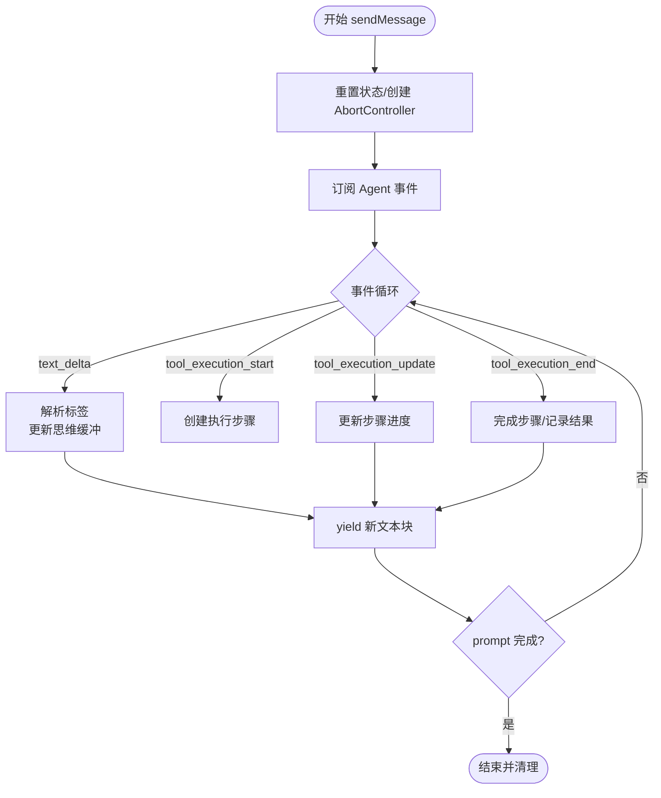
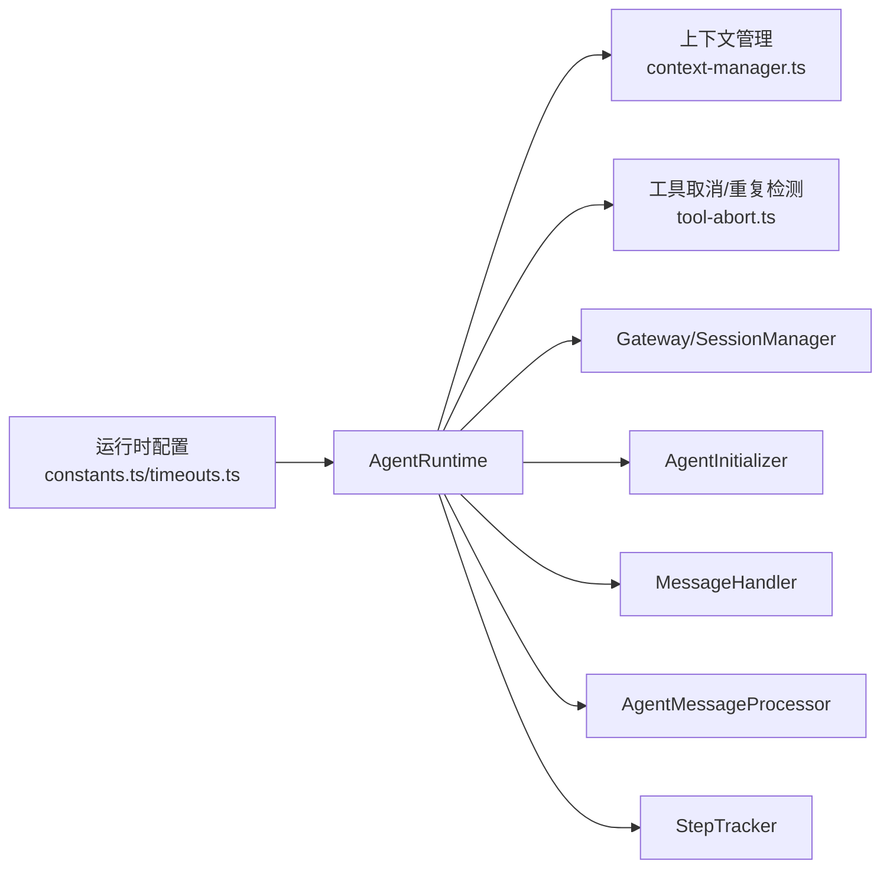

# Agent Runtime 运行时系统

<cite>
**本文引用的文件**
- [agent-runtime.ts](file://src/main/agent-runtime/agent-runtime.ts)
- [types.ts](file://src/main/agent-runtime/types.ts)
- [agent-initializer.ts](file://src/main/agent-runtime/agent-initializer.ts)
- [message-handler.ts](file://src/main/agent-runtime/message-handler.ts)
- [agent-message-processor.ts](file://src/main/agent-runtime/agent-message-processor.ts)
- [step-tracker.ts](file://src/main/agent-runtime/step-tracker.ts)
- [step-description-generator.ts](file://src/main/agent-runtime/step-description-generator.ts)
- [index.ts](file://src/main/agent-runtime/index.ts)
- [constants.ts](file://src/main/config/constants.ts)
- [timeouts.ts](file://src/main/config/timeouts.ts)
- [context-manager.ts](file://src/main/context/context-manager.ts)
- [tool-abort.ts](file://src/main/tools/tool-abort.ts)
</cite>

## 目录
1. [简介](#简介)
2. [项目结构](#项目结构)
3. [核心组件](#核心组件)
4. [架构总览](#架构总览)
5. [详细组件分析](#详细组件分析)
6. [依赖关系分析](#依赖关系分析)
7. [性能考量](#性能考量)
8. [故障排查指南](#故障排查指南)
9. [结论](#结论)
10. [附录](#附录)

## 简介
本文件面向 史丽慧小助理 Agent Runtime 运行时系统，提供从架构设计到实现细节的全面技术文档。重点覆盖：
- Agent Runtime 的执行环境设计与生命周期管理
- 消息处理流程与流式输出机制
- 步骤跟踪与任务计划管理
- Agent 初始化、消息处理器、步骤描述生成器的工作原理
- 运行时配置选项、执行上下文管理、内存与上下文压缩策略
- 工具系统集成与取消机制、与 Gateway 的会话交互
- 性能监控、错误处理与调试技巧

## 项目结构
Agent Runtime 模块位于 src/main/agent-runtime，采用“职责分离 + 模块化”的组织方式：
- agent-runtime.ts：运行时协调者，负责生命周期、工具包装、上下文加载与系统提示词初始化
- agent-initializer.ts：Agent 初始化器，负责加载工具、构建系统提示词、重建 Agent 实例
- message-handler.ts：消息处理器，负责流式输出、生成控制、执行步骤收集与取消
- agent-message-processor.ts：消息发送与处理协调器，负责自动继续、上下文压缩、重复检测与调试日志
- step-tracker.ts：步骤跟踪器，负责任务计划、重试与完成状态检测
- step-description-generator.ts：步骤描述生成器，将工具调用转换为人类可读描述
- types.ts：运行时配置与状态类型定义
- index.ts：模块导出入口

图表来源
- [agent-runtime.ts:27-188](file://src/main/agent-runtime/agent-runtime.ts#L27-L188)
- [agent-initializer.ts:17-71](file://src/main/agent-runtime/agent-initializer.ts#L17-L71)
- [message-handler.ts:16-58](file://src/main/agent-runtime/message-handler.ts#L16-L58)
- [agent-message-processor.ts:20-45](file://src/main/agent-runtime/agent-message-processor.ts#L20-L45)
- [step-tracker.ts:34-65](file://src/main/agent-runtime/step-tracker.ts#L34-L65)
- [step-description-generator.ts:14-46](file://src/main/agent-runtime/step-description-generator.ts#L14-L46)
- [tool-abort.ts:149-271](file://src/main/tools/tool-abort.ts#L149-L271)

章节来源
- [agent-runtime.ts:1-188](file://src/main/agent-runtime/agent-runtime.ts#L1-L188)
- [index.ts:7-12](file://src/main/agent-runtime/index.ts#L7-L12)

## 核心组件
- AgentRuntime：运行时协调者，负责初始化 Agent、加载工具、系统提示词、上下文压缩、消息队列维护、会话切换与销毁；对外提供流式消息发送接口
- AgentInitializer：负责动态加载工具、创建 Agent 实例、构建系统提示词、在会话切换时重建 Agent
- MessageHandler：负责与 Agent 事件流交互，实现流式输出、思维过程模拟、工具调用步骤收集、生成取消与状态重置
- AgentMessageProcessor：负责消息增强、上下文压缩、自动继续检测、重复消息与重复操作防护、调试日志与统计
- StepTracker：负责任务计划创建、执行、重试与完成状态推进
- StepDescriptionGenerator：将工具调用参数转换为人类可读描述
- OperationTracker 与工具取消：为工具添加 AbortSignal 支持与重复操作检测，防止重复执行与连续失败

章节来源
- [agent-runtime.ts:27-800](file://src/main/agent-runtime/agent-runtime.ts#L27-L800)
- [agent-initializer.ts:17-187](file://src/main/agent-runtime/agent-initializer.ts#L17-L187)
- [message-handler.ts:16-752](file://src/main/agent-runtime/message-handler.ts#L16-L752)
- [agent-message-processor.ts:20-549](file://src/main/agent-runtime/agent-message-processor.ts#L20-L549)
- [step-tracker.ts:34-199](file://src/main/agent-runtime/step-tracker.ts#L34-L199)
- [step-description-generator.ts:14-111](file://src/main/agent-runtime/step-description-generator.ts#L14-L111)
- [tool-abort.ts:149-427](file://src/main/tools/tool-abort.ts#L149-L427)

## 架构总览
Agent Runtime 的整体流程如下：
- 构造阶段：解析配置、推断上下文窗口、构建运行时配置、初始化模块
- 初始化阶段：加载工具、创建 Agent、包装工具（重复检测 + 取消支持）、加载历史上下文并压缩
- 消息发送阶段：增强用户消息、上下文压缩、触发 MessageHandler 流式输出、自动继续检测、维护消息队列
- 执行阶段：收集工具调用步骤、更新执行状态、必要时停止生成并重建 Agent

图表来源
- [agent-runtime.ts:661-688](file://src/main/agent-runtime/agent-runtime.ts#L661-L688)
- [agent-message-processor.ts:345-547](file://src/main/agent-runtime/agent-message-processor.ts#L345-L547)
- [message-handler.ts:114-587](file://src/main/agent-runtime/message-handler.ts#L114-L587)
- [agent-initializer.ts:148-179](file://src/main/agent-runtime/agent-initializer.ts#L148-L179)

## 详细组件分析

### AgentRuntime 类
职责与关键点：
- 配置与模型选择：根据 apiType 选择 OpenAI 或 Google GenAI 模型，推断上下文窗口并计算 maxTokens
- 初始化流程：异步初始化 Agent、加载工具、包装工具（重复检测 + Tab 名称注入）、加载历史上下文并压缩
- 系统提示词：延迟初始化，支持重新加载；与 AgentInitializer 协作构建
- 会话管理：setSessionId 时重建 Agent 并重新初始化系统提示词
- 消息发送：委托 AgentMessageProcessor，维护消息队列上限（10 轮用户对话）
- 生成控制：stopGeneration 时停止当前生成并重建 Agent，保证状态一致性
- 执行步骤与任务计划：通过 MessageHandler 与 StepTracker 提供回调接口

图表来源
- [agent-runtime.ts:27-800](file://src/main/agent-runtime/agent-runtime.ts#L27-L800)
- [agent-initializer.ts:17-187](file://src/main/agent-runtime/agent-initializer.ts#L17-L187)
- [message-handler.ts:16-752](file://src/main/agent-runtime/message-handler.ts#L16-L752)
- [agent-message-processor.ts:20-549](file://src/main/agent-runtime/agent-message-processor.ts#L20-L549)
- [step-tracker.ts:34-199](file://src/main/agent-runtime/step-tracker.ts#L34-L199)

章节来源
- [agent-runtime.ts:65-800](file://src/main/agent-runtime/agent-runtime.ts#L65-L800)

### AgentInitializer 类
职责与关键点：
- 动态加载工具并创建 Agent 实例，设置串行工具执行
- 构建系统提示词：从数据库读取工作区设置、加载上下文文件、构建运行时参数、汇总工具名称，最终设置到 Agent
- 会话切换时重建 Agent，保留消息历史并重新应用系统提示词

章节来源
- [agent-initializer.ts:42-187](file://src/main/agent-runtime/agent-initializer.ts#L42-L187)

### MessageHandler 类
职责与关键点：
- 流式输出：订阅 Agent 事件，解析 text_delta，模拟“思考”过程（基于文本标签）
- 工具调用追踪：收集 tool_execution_start/update/end 事件，生成执行步骤
- 取消与超时：AbortController 支持，超时保护，用户主动停止标记
- 状态重置：forceReset 解决卡死状态，stopGeneration 重置生成状态并递增 generationId

图表来源
- [message-handler.ts:114-587](file://src/main/agent-runtime/message-handler.ts#L114-L587)

章节来源
- [message-handler.ts:114-752](file://src/main/agent-runtime/message-handler.ts#L114-L752)

### AgentMessageProcessor 类
职责与关键点：
- 消息增强：在非自动继续时为用户消息添加强制工具执行指令
- 上下文压缩：调用上下文管理器进行工具结果裁剪与历史消息裁剪
- 自动继续检测：基于响应内容与工具调用情况，使用 AI 辅助判断是否需要继续
- 调试日志：保存 captured-prompt 用于调试，统计消息轮数、Token 使用与上下文使用率
- 重复消息与重复操作：删除重复用户消息，使用 OperationTracker 防止重复执行与连续失败

章节来源
- [agent-message-processor.ts:345-549](file://src/main/agent-runtime/agent-message-processor.ts#L345-L549)

### StepTracker 类
职责与关键点：
- 任务计划：创建计划、开始执行、推进步骤、记录状态与错误
- 重试逻辑：记录失败次数，超过阈值后标记失败并停止
- 回调通知：变更时通知上层组件

章节来源
- [step-tracker.ts:34-199](file://src/main/agent-runtime/step-tracker.ts#L34-L199)

### StepDescriptionGenerator 类
职责与关键点：
- 将工具名称与参数映射为人类可读描述，覆盖常见工具（浏览器、文件读写、命令执行、日历等）

章节来源
- [step-description-generator.ts:14-111](file://src/main/agent-runtime/step-description-generator.ts#L14-L111)

## 依赖关系分析
- 运行时配置与超时：运行时根据配置推断模型上下文窗口与 maxTokens；超时配置集中管理，用于长任务保护
- 上下文管理：上下文压缩统一入口，先裁剪工具结果，再裁剪历史消息，避免超出上下文窗口
- 工具系统：工具包装链路：原始工具 → 重复检测 → 取消支持 → Tab 名称注入（cross_tab_call）
- 与 Gateway 的会话交互：运行时通过 Gateway 获取 SessionManager，加载历史消息并维护消息队列

图表来源
- [constants.ts:4-25](file://src/main/config/constants.ts#L4-L25)
- [timeouts.ts:9-53](file://src/main/config/timeouts.ts#L9-L53)
- [context-manager.ts:100-303](file://src/main/context/context-manager.ts#L100-L303)
- [tool-abort.ts:101-144](file://src/main/tools/tool-abort.ts#L101-L144)
- [agent-runtime.ts:236-308](file://src/main/agent-runtime/agent-runtime.ts#L236-L308)

章节来源
- [constants.ts:4-25](file://src/main/config/constants.ts#L4-L25)
- [timeouts.ts:9-78](file://src/main/config/timeouts.ts#L9-L78)
- [context-manager.ts:100-366](file://src/main/context/context-manager.ts#L100-L366)
- [tool-abort.ts:101-427](file://src/main/tools/tool-abort.ts#L101-L427)
- [agent-runtime.ts:236-308](file://src/main/agent-runtime/agent-runtime.ts#L236-L308)

## 性能考量
- 上下文窗口与 Token 估算：运行时根据模型上下文窗口与消息内容估算 Token 使用，避免溢出；上下文管理器在使用率超过阈值时进行裁剪
- 流式输出与超时：MessageHandler 使用 AbortController 与超时保护，避免长时间阻塞；支持用户主动停止
- 工具执行串行：初始化时设置串行执行，降低并发依赖问题
- 重复检测与失败抑制：OperationTracker 防止重复操作与连续失败导致的资源浪费
- 调试日志与统计：保存 captured-prompt，统计消息轮数与 Token 使用，辅助定位性能瓶颈

章节来源
- [agent-runtime.ts:68-164](file://src/main/agent-runtime/agent-runtime.ts#L68-L164)
- [context-manager.ts:100-303](file://src/main/context/context-manager.ts#L100-L303)
- [message-handler.ts:388-539](file://src/main/agent-runtime/message-handler.ts#L388-L539)
- [tool-abort.ts:149-271](file://src/main/tools/tool-abort.ts#L149-L271)

## 故障排查指南
- 生成卡住或状态异常：调用 stopGeneration 或 forceReset，必要时重建 Agent 实例
- 空响应或 API 配置错误：检查 API Key、Base URL、模型 ID；查看 captured-prompt 调试文件
- 重复执行与连续失败：查看 OperationTracker 统计，调整工具参数或更换方法
- 上下文溢出：启用上下文压缩，检查 Token 使用率与消息轮数
- 会话切换异常：setSessionId 后重新初始化系统提示词并重建 Agent

章节来源
- [agent-runtime.ts:537-751](file://src/main/agent-runtime/agent-runtime.ts#L537-L751)
- [message-handler.ts:592-751](file://src/main/agent-runtime/message-handler.ts#L592-L751)
- [tool-abort.ts:149-427](file://src/main/tools/tool-abort.ts#L149-L427)
- [context-manager.ts:100-303](file://src/main/context/context-manager.ts#L100-L303)

## 结论
Agent Runtime 通过模块化设计实现了对 Agent 生命周期、消息处理、上下文管理与工具系统的统一协调。其核心优势在于：
- 明确的职责边界与清晰的控制流
- 完备的流式输出与取消机制
- 智能的上下文压缩与重复检测
- 可扩展的任务计划与步骤跟踪
- 丰富的调试与统计能力

这些特性共同构成了稳定、可维护且高性能的 Agent 运行时基础。

## 附录

### 运行时配置选项
- 模型配置：apiType、modelId、modelName、providerName、baseUrl、contextWindow、maxTokens
- 会话与工作区：workspaceDir、sessionId、maxConcurrentSubAgents
- 超时与等待：消息超时、浏览器超时、HTTP 请求超时、会话清理与归档间隔

章节来源
- [agent-runtime.ts:101-153](file://src/main/agent-runtime/agent-runtime.ts#L101-L153)
- [timeouts.ts:9-78](file://src/main/config/timeouts.ts#L9-L78)
- [constants.ts:4-25](file://src/main/config/constants.ts#L4-L25)

### 执行上下文管理
- 上下文压缩策略：先裁剪工具结果，再裁剪历史消息，保留固定开销（系统提示词 + 工具定义）
- Token 估算：按字符数估算，4 字符 ≈ 1 Token
- 使用率阈值：软裁剪 70%，硬裁剪 85%

章节来源
- [context-manager.ts:100-303](file://src/main/context/context-manager.ts#L100-L303)

### 内存管理策略
- 消息队列上限：维护最近 10 轮用户对话
- 工具结果裁剪：减少冗余内容占用
- 历史消息裁剪：按比例丢弃旧消息，控制上下文大小

章节来源
- [agent-runtime.ts:392-423](file://src/main/agent-runtime/agent-runtime.ts#L392-L423)
- [context-manager.ts:222-273](file://src/main/context/context-manager.ts#L222-L273)

### 代码示例（路径指引）
- 创建 AgentRuntime 实例与发送消息
  - [示例：构造与初始化:65-188](file://src/main/agent-runtime/agent-runtime.ts#L65-L188)
  - [示例：sendMessage 流式输出:661-688](file://src/main/agent-runtime/agent-runtime.ts#L661-L688)
- 会话切换与系统提示词重新加载
  - [示例：setSessionId:571-606](file://src/main/agent-runtime/agent-runtime.ts#L571-L606)
  - [示例：reloadSystemPrompt:516-532](file://src/main/agent-runtime/agent-runtime.ts#L516-L532)
- 步骤跟踪与任务计划
  - [示例：setTaskPlanCallback:777-786](file://src/main/agent-runtime/agent-runtime.ts#L777-L786)
  - [示例：StepTracker 使用:48-166](file://src/main/agent-runtime/step-tracker.ts#L48-L166)
- 工具系统集成与取消
  - [示例：wrapToolWithAbortSignal:101-144](file://src/main/tools/tool-abort.ts#L101-L144)
  - [示例：wrapToolWithDuplicateDetection:280-318](file://src/main/tools/tool-abort.ts#L280-L318)
- 步骤描述生成
  - [示例：generateStepDescription:14-46](file://src/main/agent-runtime/step-description-generator.ts#L14-L46)