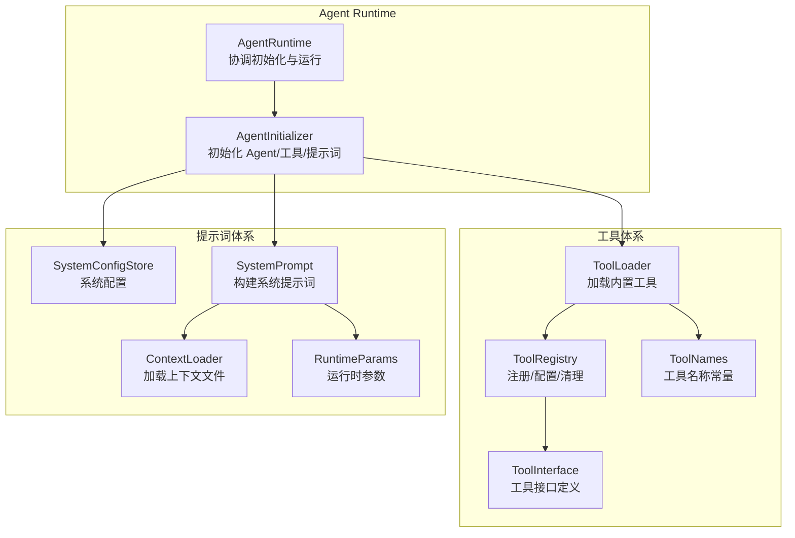
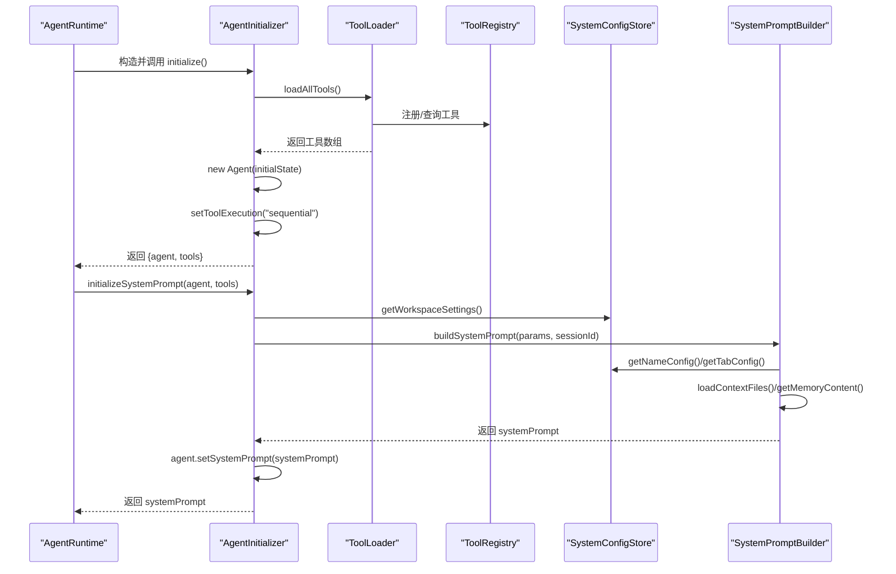
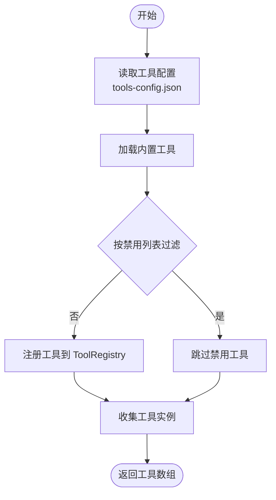
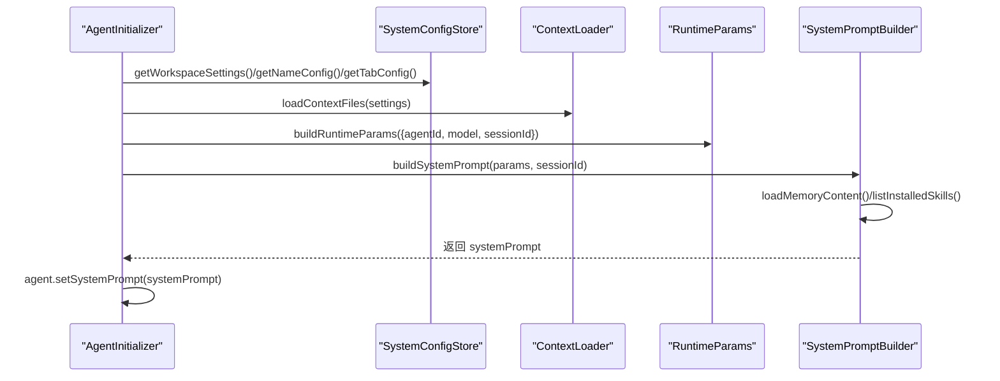
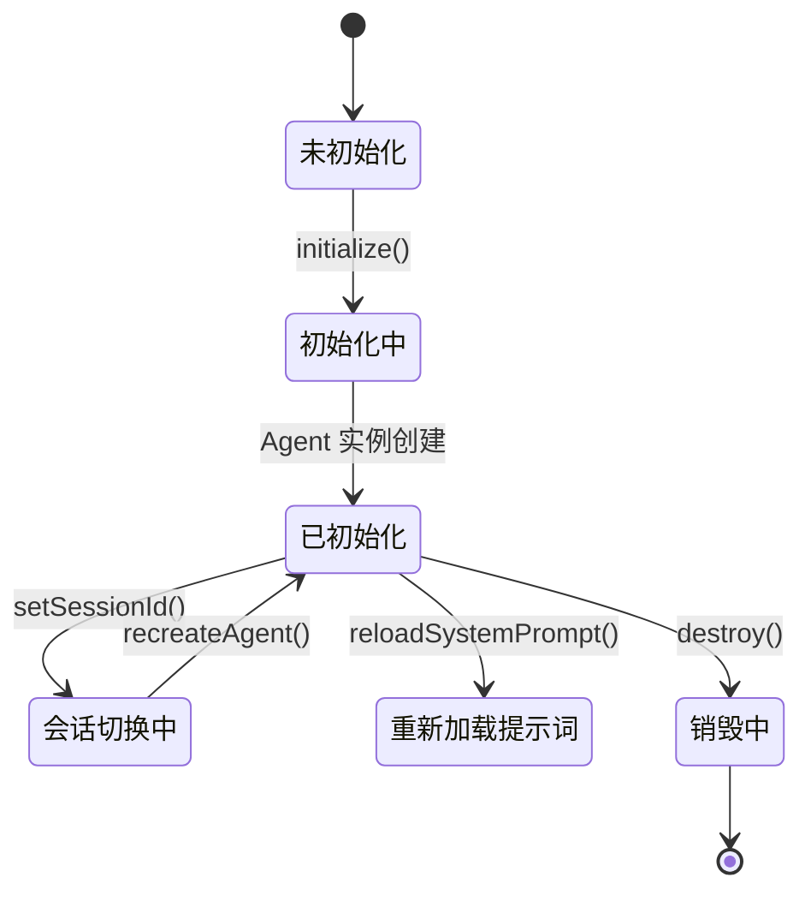
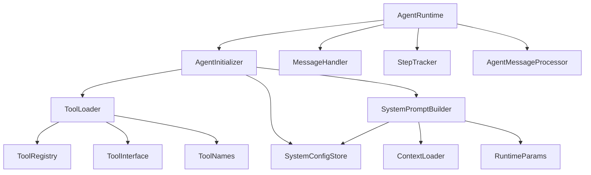

# Agent 初始化器

<cite>
**本文引用的文件**
- [agent-initializer.ts](file://src/main/agent-runtime/agent-initializer.ts)
- [agent-runtime.ts](file://src/main/agent-runtime/agent-runtime.ts)
- [types.ts](file://src/main/agent-runtime/types.ts)
- [tool-loader.ts](file://src/main/tools/registry/tool-loader.ts)
- [tool-registry.ts](file://src/main/tools/registry/tool-registry.ts)
- [tool-interface.ts](file://src/main/tools/registry/tool-interface.ts)
- [system-config-store.ts](file://src/main/database/system-config-store.ts)
- [system-prompt.ts](file://src/main/prompts/system-prompt.ts)
- [context-loader.ts](file://src/main/prompts/context-loader.ts)
- [runtime-params.ts](file://src/main/prompts/runtime-params.ts)
- [tool-names.ts](file://src/main/tools/tool-names.ts)
- [index.ts](file://src/main/agent-runtime/index.ts)
- [AGENT.md](file://dist-electron/main/prompts/templates/AGENT.md)
- [TOOLS.md](file://dist-electron/main/prompts/templates/TOOLS.md)
</cite>

## 目录
1. [简介](#简介)
2. [项目结构](#项目结构)
3. [核心组件](#核心组件)
4. [架构总览](#架构总览)
5. [详细组件分析](#详细组件分析)
6. [依赖分析](#依赖分析)
7. [性能考量](#性能考量)
8. [故障排除指南](#故障排除指南)
9. [结论](#结论)
10. [附录](#附录)

## 简介
本文件面向 Agent 初始化器模块，系统性阐述 AgentInitializer 类的初始化流程、Agent 实例创建过程、工具加载机制、系统提示词初始化、Agent 状态管理与资源清理机制。文档还提供初始化参数验证、Agent 配置构建、工具注册过程的深入分析，并结合与 Agent 核心库的集成方式、配置文件处理、错误恢复策略，给出性能优化、内存管理最佳实践与故障排除指南。

## 项目结构
Agent 初始化器位于主进程的 agent-runtime 子模块，围绕 Agent 的生命周期管理协调工具加载、系统提示词构建与运行时状态维护。其关键协作模块包括：
- 工具体系：ToolLoader 负责加载内置工具，ToolRegistry 负责工具注册与配置管理
- 提示词体系：SystemConfigStore 提供系统配置，SystemPromptBuilder 构建系统提示词，ContextLoader 加载上下文文件，RuntimeParams 提供运行时信息
- 运行时集成：AgentRuntime 协调初始化器、消息处理、历史加载与状态恢复



图表来源
- [agent-runtime.ts:166-184](file://src/main/agent-runtime/agent-runtime.ts#L166-L184)
- [agent-initializer.ts:42-71](file://src/main/agent-runtime/agent-initializer.ts#L42-L71)
- [tool-loader.ts:57-71](file://src/main/tools/registry/tool-loader.ts#L57-L71)
- [tool-registry.ts:36-55](file://src/main/tools/registry/tool-registry.ts#L36-L55)
- [system-config-store.ts:37-70](file://src/main/database/system-config-store.ts#L37-L70)
- [system-prompt.ts:25-125](file://src/main/prompts/system-prompt.ts#L25-L125)
- [context-loader.ts:135-157](file://src/main/prompts/context-loader.ts#L135-L157)
- [runtime-params.ts:21-42](file://src/main/prompts/runtime-params.ts#L21-L42)
- [tool-interface.ts:101-134](file://src/main/tools/registry/tool-interface.ts#L101-L134)
- [tool-names.ts:8-94](file://src/main/tools/tool-names.ts#L8-L94)

章节来源
- [agent-runtime.ts:166-184](file://src/main/agent-runtime/agent-runtime.ts#L166-L184)
- [agent-initializer.ts:42-71](file://src/main/agent-runtime/agent-initializer.ts#L42-L71)
- [tool-loader.ts:57-71](file://src/main/tools/registry/tool-loader.ts#L57-L71)
- [system-config-store.ts:37-70](file://src/main/database/system-config-store.ts#L37-L70)
- [system-prompt.ts:25-125](file://src/main/prompts/system-prompt.ts#L25-L125)
- [context-loader.ts:135-157](file://src/main/prompts/context-loader.ts#L135-L157)
- [runtime-params.ts:21-42](file://src/main/prompts/runtime-params.ts#L21-L42)
- [tool-registry.ts:36-55](file://src/main/tools/registry/tool-registry.ts#L36-L55)
- [tool-interface.ts:101-134](file://src/main/tools/registry/tool-interface.ts#L101-L134)
- [tool-names.ts:8-94](file://src/main/tools/tool-names.ts#L8-L94)

## 核心组件
- AgentInitializer：负责初始化 Agent、加载工具、构建系统提示词、重建 Agent 实例与资源清理
- ToolLoader：集中加载内置工具，读取工具配置，按启用/禁用策略返回工具数组
- ToolRegistry：工具注册与配置管理，提供工具查询、清理与 UI 展示
- SystemConfigStore：系统配置持久化与读取，提供工作区设置、模型配置、工具禁用列表等
- SystemPromptBuilder：整合身份信息、工作目录、时间信息、上下文文件、核心记忆、运行时信息与 Skills，构建完整系统提示词
- AgentRuntime：协调初始化器、消息处理、历史加载、状态恢复与销毁

章节来源
- [agent-initializer.ts:17-71](file://src/main/agent-runtime/agent-initializer.ts#L17-L71)
- [tool-loader.ts:57-71](file://src/main/tools/registry/tool-loader.ts#L57-L71)
- [tool-registry.ts:36-55](file://src/main/tools/registry/tool-registry.ts#L36-L55)
- [system-config-store.ts:37-70](file://src/main/database/system-config-store.ts#L37-L70)
- [system-prompt.ts:25-125](file://src/main/prompts/system-prompt.ts#L25-L125)
- [agent-runtime.ts:166-184](file://src/main/agent-runtime/agent-runtime.ts#L166-L184)

## 架构总览
Agent 初始化器采用“延迟加载 + 异步初始化”的策略，避免阻塞主流程。初始化顺序如下：
1) 构造 AgentInitializer，注入工作区目录、会话 ID、模型与 API Key
2) initialize() 异步加载工具，创建 Agent 实例并设置串行工具执行
3) initializeSystemPrompt() 构建系统提示词并设置到 Agent
4) AgentRuntime 在初始化完成后加载历史消息、维护消息队列、提供状态检查与恢复



图表来源
- [agent-runtime.ts:193-229](file://src/main/agent-runtime/agent-runtime.ts#L193-L229)
- [agent-initializer.ts:42-71](file://src/main/agent-runtime/agent-initializer.ts#L42-L71)
- [agent-initializer.ts:88-138](file://src/main/agent-runtime/agent-initializer.ts#L88-L138)
- [tool-loader.ts:57-71](file://src/main/tools/registry/tool-loader.ts#L57-L71)
- [tool-registry.ts:36-55](file://src/main/tools/registry/tool-registry.ts#L36-L55)
- [system-config-store.ts:341-347](file://src/main/database/system-config-store.ts#L341-L347)
- [system-prompt.ts:25-125](file://src/main/prompts/system-prompt.ts#L25-L125)

章节来源
- [agent-runtime.ts:193-229](file://src/main/agent-runtime/agent-runtime.ts#L193-L229)
- [agent-initializer.ts:42-71](file://src/main/agent-runtime/agent-initializer.ts#L42-L71)
- [agent-initializer.ts:88-138](file://src/main/agent-runtime/agent-initializer.ts#L88-L138)
- [tool-loader.ts:57-71](file://src/main/tools/registry/tool-loader.ts#L57-L71)
- [system-config-store.ts:341-347](file://src/main/database/system-config-store.ts#L341-L347)
- [system-prompt.ts:25-125](file://src/main/prompts/system-prompt.ts#L25-L125)

## 详细组件分析

### AgentInitializer 类分析
- 职责：初始化 Agent、加载工具、构建系统提示词、重建 Agent 实例、资源清理
- 关键方法：
  - initialize()：动态导入核心库，加载工具，创建 Agent 实例，设置串行工具执行
  - initializeSystemPrompt()：从配置读取工作区设置，加载上下文文件，构建运行时参数，聚合工具名称，构建系统提示词并设置到 Agent；失败时回退到最小提示词
  - recreateAgent()：在旧 Agent 历史消息基础上重建新实例，保持系统提示词与工具配置
  - cleanup()：预留资源清理入口
- 参数与状态：
  - 构造参数：工作区目录、会话 ID、模型、API Key
  - 内部状态：SystemConfigStore 单例实例
  - 返回：Agent 实例与工具数组

```mermaid
classDiagram
class AgentInitializer {
-workspaceDir : string
-sessionId : string
-model : Model
-apiKey : string
-configStore : SystemConfigStore
+constructor(workspaceDir, sessionId, model, apiKey)
+initialize() Promise~{agent, tools}~
+initializeSystemPrompt(agent, tools) Promise~string~
+recreateAgent(oldAgent, tools, systemPrompt) Promise~Agent~
+cleanup() Promise~void~
-loadTools() Promise~any[]~
}
class ToolLoader {
+loadAllTools(configStore) Promise~AgentTool[]~
-loadBuiltinTools(configStore) Promise~AgentTool[]~
-loadToolConfigs() void
}
class SystemConfigStore {
+getInstance() SystemConfigStore
+getWorkspaceSettings() WorkspaceSettings
+getNameConfig() NameConfig
+getTabConfig(tabId) TabConfig
+getDisabledTools() string[]
}
class SystemPromptBuilder {
+buildSystemPrompt(params, sessionId) Promise~string~
}
AgentInitializer --> ToolLoader : "加载工具"
AgentInitializer --> SystemConfigStore : "读取配置"
AgentInitializer --> SystemPromptBuilder : "构建提示词"
```

图表来源
- [agent-initializer.ts:17-187](file://src/main/agent-runtime/agent-initializer.ts#L17-L187)
- [tool-loader.ts:40-71](file://src/main/tools/registry/tool-loader.ts#L40-L71)
- [system-config-store.ts:65-70](file://src/main/database/system-config-store.ts#L65-L70)
- [system-prompt.ts:25-125](file://src/main/prompts/system-prompt.ts#L25-L125)

章节来源
- [agent-initializer.ts:17-187](file://src/main/agent-runtime/agent-initializer.ts#L17-L187)

### 工具加载机制
- ToolLoader.loadAllTools()：加载工具配置（tools-config.json），加载内置工具，按禁用列表过滤，返回工具数组
- ToolLoader.loadBuiltinTools()：按工具类型逐一加载，支持异步返回 Promise；对部分工具按开关过滤
- ToolRegistry：注册工具插件、保存工具实例、管理工具配置、提供清理与 UI 展示
- 工具接口与命名：ToolInterface 定义工具元数据、创建选项、清理与验证；ToolNames 统一管理工具名称常量



图表来源
- [tool-loader.ts:57-71](file://src/main/tools/registry/tool-loader.ts#L57-L71)
- [tool-loader.ts:109-301](file://src/main/tools/registry/tool-loader.ts#L109-L301)
- [tool-registry.ts:36-55](file://src/main/tools/registry/tool-registry.ts#L36-L55)
- [tool-interface.ts:101-134](file://src/main/tools/registry/tool-interface.ts#L101-L134)
- [tool-names.ts:8-94](file://src/main/tools/tool-names.ts#L8-L94)

章节来源
- [tool-loader.ts:57-71](file://src/main/tools/registry/tool-loader.ts#L57-L71)
- [tool-loader.ts:109-301](file://src/main/tools/registry/tool-loader.ts#L109-L301)
- [tool-registry.ts:36-55](file://src/main/tools/registry/tool-registry.ts#L36-L55)
- [tool-interface.ts:101-134](file://src/main/tools/registry/tool-interface.ts#L101-L134)
- [tool-names.ts:8-94](file://src/main/tools/tool-names.ts#L8-L94)

### 系统提示词初始化
- SystemPromptBuilder.buildSystemPrompt()：按顺序构建提示词片段
  - 身份信息：从 SystemConfigStore 读取 Agent 名称与用户称呼，支持按会话覆盖
  - 工作目录：从工作区设置读取脚本、图片、记忆、Skill 目录
  - 时间信息：从 RuntimeParams 获取用户时区与当前时间
  - 上下文文件：从 templates 目录加载 AGENT.md、TOOLS.md、CUSTOM-TOOLS.md、MEMORY-TRIGGER.md，支持截断
  - 核心记忆：从 memory 工具加载记忆内容
  - 运行时信息：模型、会话、操作系统、Node 版本等
  - Skills：从数据库列出已安装的 Skills
- AgentInitializer.initializeSystemPrompt()：组装参数并调用 SystemPromptBuilder，失败时回退到最小提示词



图表来源
- [agent-initializer.ts:88-138](file://src/main/agent-runtime/agent-initializer.ts#L88-L138)
- [system-config-store.ts:341-347](file://src/main/database/system-config-store.ts#L341-L347)
- [context-loader.ts:135-157](file://src/main/prompts/context-loader.ts#L135-L157)
- [runtime-params.ts:21-42](file://src/main/prompts/runtime-params.ts#L21-L42)
- [system-prompt.ts:25-125](file://src/main/prompts/system-prompt.ts#L25-L125)

章节来源
- [agent-initializer.ts:88-138](file://src/main/agent-runtime/agent-initializer.ts#L88-L138)
- [system-prompt.ts:25-125](file://src/main/prompts/system-prompt.ts#L25-L125)
- [context-loader.ts:135-157](file://src/main/prompts/context-loader.ts#L135-L157)
- [runtime-params.ts:21-42](file://src/main/prompts/runtime-params.ts#L21-L42)
- [system-config-store.ts:341-347](file://src/main/database/system-config-store.ts#L341-L347)

### Agent 状态管理与重建
- AgentRuntime.initialize()：初始化 Agent，包装工具（重复检测、跨 Tab 名称注入），加载历史消息并压缩上下文，异步初始化系统提示词
- AgentRuntime.reloadSystemPrompt()：清空提示词并重新初始化
- AgentRuntime.setSessionId()：切换会话 ID，重建 Agent 实例并重新初始化系统提示词
- AgentRuntime.destroy()：强制停止生成、重置 Agent 状态、调用初始化器清理资源
- AgentInitializer.recreateAgent()：在旧消息历史基础上重建新实例，保持系统提示词与工具配置



图表来源
- [agent-runtime.ts:193-229](file://src/main/agent-runtime/agent-runtime.ts#L193-L229)
- [agent-runtime.ts:516-532](file://src/main/agent-runtime/agent-runtime.ts#L516-L532)
- [agent-runtime.ts:567-564](file://src/main/agent-runtime/agent-runtime.ts#L567-L564)
- [agent-runtime.ts:571-606](file://src/main/agent-runtime/agent-runtime.ts#L571-L606)
- [agent-initializer.ts:148-179](file://src/main/agent-runtime/agent-initializer.ts#L148-L179)

章节来源
- [agent-runtime.ts:193-229](file://src/main/agent-runtime/agent-runtime.ts#L193-L229)
- [agent-runtime.ts:516-532](file://src/main/agent-runtime/agent-runtime.ts#L516-L532)
- [agent-runtime.ts:567-564](file://src/main/agent-runtime/agent-runtime.ts#L567-L564)
- [agent-runtime.ts:571-606](file://src/main/agent-runtime/agent-runtime.ts#L571-L606)
- [agent-initializer.ts:148-179](file://src/main/agent-runtime/agent-initializer.ts#L148-L179)

### 配置文件处理与错误恢复
- 工具配置：ToolLoader.loadToolConfigs() 从用户目录与工作区目录读取 tools-config.json，解析 JSON 并写入 ToolRegistry
- 系统配置：SystemConfigStore 提供工作区设置、模型配置、工具禁用列表、Tab 配置等，支持迁移与增补字段
- 错误恢复：SystemPromptBuilder 在加载记忆或 Skills 失败时记录警告并继续；AgentInitializer.initializeSystemPrompt() 在构建失败时回退到最小提示词

章节来源
- [tool-loader.ts:77-99](file://src/main/tools/registry/tool-loader.ts#L77-L99)
- [system-config-store.ts:230-315](file://src/main/database/system-config-store.ts#L230-L315)
- [system-prompt.ts:94-96](file://src/main/prompts/system-prompt.ts#L94-L96)
- [agent-initializer.ts:129-137](file://src/main/agent-runtime/agent-initializer.ts#L129-L137)

## 依赖分析
- 模块耦合
  - AgentInitializer 依赖 ToolLoader、SystemConfigStore、SystemPromptBuilder
  - ToolLoader 依赖 ToolRegistry、ToolInterface、ToolNames
  - SystemPromptBuilder 依赖 SystemConfigStore、ContextLoader、RuntimeParams
  - AgentRuntime 协调 AgentInitializer、MessageHandler、StepTracker、AgentMessageProcessor
- 外部依赖
  - pi-agent-core：动态导入以创建 Agent 实例
  - pi-ai：模型配置与上下文窗口推断
  - SQLite：SystemConfigStore 持久化配置



图表来源
- [agent-initializer.ts:7-12](file://src/main/agent-runtime/agent-initializer.ts#L7-L12)
- [tool-loader.ts:8-15](file://src/main/tools/registry/tool-loader.ts#L8-L15)
- [tool-registry.ts:27-31](file://src/main/tools/registry/tool-registry.ts#L27-L31)
- [system-config-store.ts:11-24](file://src/main/database/system-config-store.ts#L11-L24)
- [system-prompt.ts:10-16](file://src/main/prompts/system-prompt.ts#L10-L16)
- [agent-runtime.ts:11-22](file://src/main/agent-runtime/agent-runtime.ts#L11-L22)

章节来源
- [agent-initializer.ts:7-12](file://src/main/agent-runtime/agent-initializer.ts#L7-L12)
- [tool-loader.ts:8-15](file://src/main/tools/registry/tool-loader.ts#L8-L15)
- [tool-registry.ts:27-31](file://src/main/tools/registry/tool-registry.ts#L27-L31)
- [system-config-store.ts:11-24](file://src/main/database/system-config-store.ts#L11-L24)
- [system-prompt.ts:10-16](file://src/main/prompts/system-prompt.ts#L10-L16)
- [agent-runtime.ts:11-22](file://src/main/agent-runtime/agent-runtime.ts#L11-L22)

## 性能考量
- 工具加载
  - 串行执行工具调用：AgentInitializer.setToolExecution('sequential') 避免并发依赖问题
  - 工具配置缓存：ToolLoader 读取 tools-config.json 后写入 ToolRegistry，减少重复 IO
- 提示词构建
  - 上下文文件截断：ContextLoader 对大文件进行头部/尾部截断，控制提示词长度
  - 运行时信息最小化：RuntimeParams 仅包含必要字段，避免冗余
- 历史消息压缩
  - AgentRuntime.loadHistoryToContext() 与 manageContext() 结合，维持消息轮次上限并压缩 Token
- 模型上下文窗口
  - 从 SystemConfigStore 读取或推断上下文窗口，合理设置 maxTokens，平衡生成质量与成本

章节来源
- [agent-initializer.ts:68-68](file://src/main/agent-runtime/agent-initializer.ts#L68-L68)
- [tool-loader.ts:77-99](file://src/main/tools/registry/tool-loader.ts#L77-L99)
- [context-loader.ts:55-90](file://src/main/prompts/context-loader.ts#L55-L90)
- [runtime-params.ts:21-42](file://src/main/prompts/runtime-params.ts#L21-L42)
- [agent-runtime.ts:218-308](file://src/main/agent-runtime/agent-runtime.ts#L218-L308)

## 故障排除指南
- Agent 未初始化
  - 现象：AgentRuntime.ensureAgentReady() 抛出“Agent 未初始化”
  - 排查：确认 AgentRuntime 构造后初始化流程已执行；检查 initialize() Promise 是否完成
- 系统提示词初始化失败
  - 现象：initializeSystemPrompt() 抛错或超时
  - 排查：检查 SystemPromptBuilder 的依赖（配置、上下文文件、记忆）；回退到最小提示词
- 工具加载异常
  - 现象：ToolLoader 加载失败或工具未启用
  - 排查：检查 tools-config.json 格式与权限；确认 ToolRegistry 的禁用列表与工具元数据
- 历史消息加载失败
  - 现象：loadHistoryToContext() 记录警告并继续
  - 排查：确认 SessionManager 初始化与会话存在；检查消息格式转换逻辑
- 资源清理
  - 现象：destroy() 后状态残留
  - 排查：确保清理 Agent 状态、停止生成、调用初始化器 cleanup()

章节来源
- [agent-runtime.ts:430-456](file://src/main/agent-runtime/agent-runtime.ts#L430-L456)
- [agent-runtime.ts:461-509](file://src/main/agent-runtime/agent-runtime.ts#L461-L509)
- [tool-loader.ts:296-299](file://src/main/tools/registry/tool-loader.ts#L296-L299)
- [agent-runtime.ts:236-308](file://src/main/agent-runtime/agent-runtime.ts#L236-L308)
- [agent-initializer.ts:129-137](file://src/main/agent-runtime/agent-initializer.ts#L129-L137)
- [agent-runtime.ts:537-564](file://src/main/agent-runtime/agent-runtime.ts#L537-L564)

## 结论
Agent 初始化器模块通过“延迟加载 + 异步初始化”策略，实现了工具与提示词的可控构建，配合 AgentRuntime 的状态管理与历史压缩，确保了 Agent 的稳定运行。工具加载与配置管理、系统提示词构建与错误回退、会话切换与重建、资源清理与销毁，共同构成了完整的生命周期管理闭环。建议在生产环境中持续监控提示词长度、工具加载耗时与历史消息压缩效果，以获得最佳性能与用户体验。

## 附录
- 初始化参数与配置要点
  - 工作区目录：必须提供且不使用默认值
  - 会话 ID：支持动态切换，重建 Agent 实例
  - 模型配置：从 SystemConfigStore 读取或推断上下文窗口
  - API Key：通过 AgentInitializer 注入到 Agent
- 常用模板与上下文
  - AGENT.md：系统提示词主体与工具使用规则
  - TOOLS.md：工具使用指南与环境配置建议
  - CUSTOM-TOOLS.md、MEMORY-TRIGGER.md：扩展与记忆触发上下文

章节来源
- [agent-runtime.ts:65-164](file://src/main/agent-runtime/agent-runtime.ts#L65-L164)
- [agent-initializer.ts:24-35](file://src/main/agent-runtime/agent-initializer.ts#L24-L35)
- [AGENT.md:1-967](file://dist-electron/main/prompts/templates/AGENT.md#L1-L967)
- [TOOLS.md:1-800](file://dist-electron/main/prompts/templates/TOOLS.md#L1-L800)