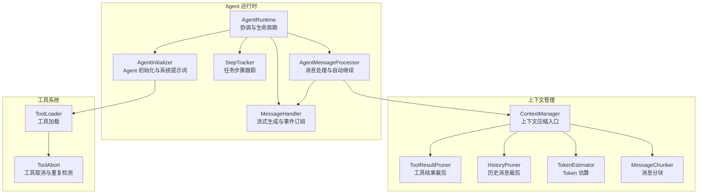
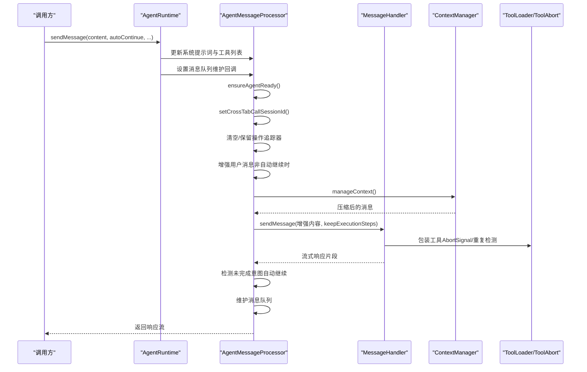
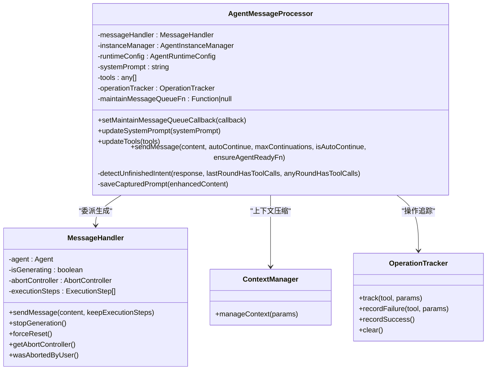
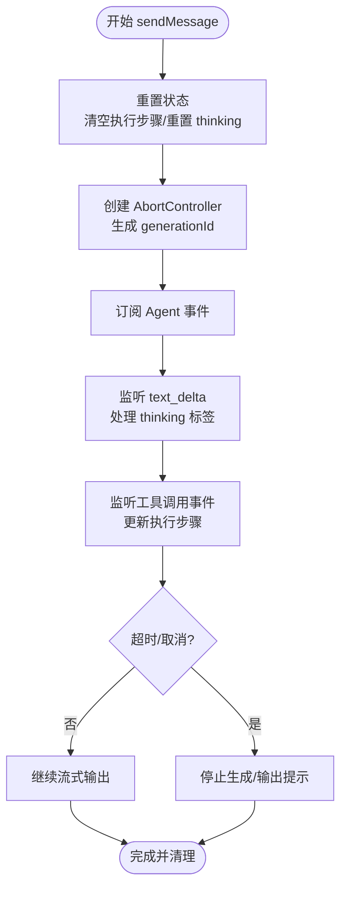
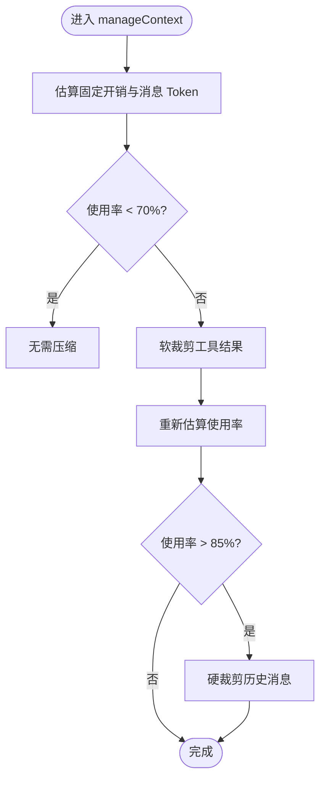
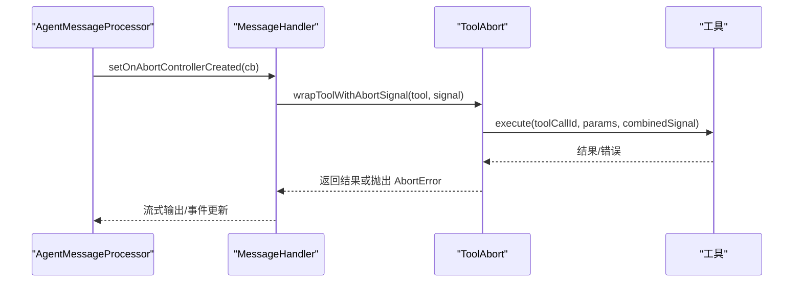
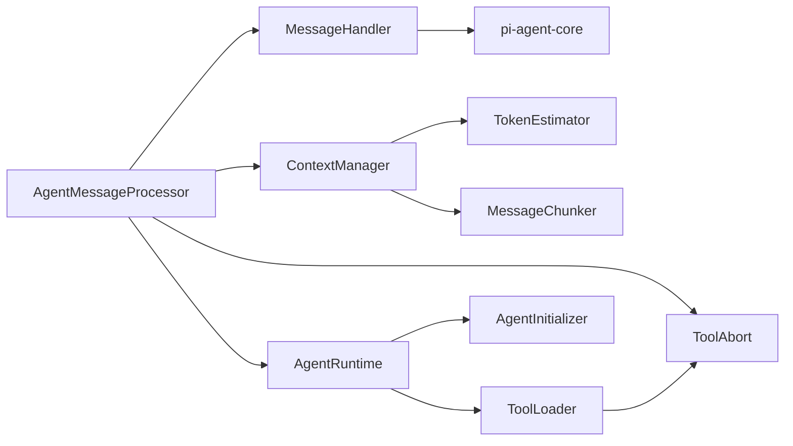

# Agent 消息处理器

<cite>
**本文引用的文件**
- [agent-message-processor.ts](file://src/main/agent-runtime/agent-message-processor.ts)
- [agent-runtime.ts](file://src/main/agent-runtime/agent-runtime.ts)
- [message-handler.ts](file://src/main/agent-runtime/message-handler.ts)
- [types.ts](file://src/main/agent-runtime/types.ts)
- [context-manager.ts](file://src/main/context/context-manager.ts)
- [history-pruner.ts](file://src/main/context/history-pruner.ts)
- [tool-result-pruner.ts](file://src/main/context/tool-result-pruner.ts)
- [tool-abort.ts](file://src/main/tools/tool-abort.ts)
- [agent-initializer.ts](file://src/main/agent-runtime/agent-initializer.ts)
- [step-tracker.ts](file://src/main/agent-runtime/step-tracker.ts)
- [token-estimator.ts](file://src/main/utils/token-estimator.ts)
- [message-chunker.ts](file://src/main/utils/message-chunker.ts)
- [tool-loader.ts](file://src/main/tools/registry/tool-loader.ts)
</cite>

## 目录
1. [简介](#简介)
2. [项目结构](#项目结构)
3. [核心组件](#核心组件)
4. [架构总览](#架构总览)
5. [详细组件分析](#详细组件分析)
6. [依赖关系分析](#依赖关系分析)
7. [性能考量](#性能考量)
8. [故障排查指南](#故障排查指南)
9. [结论](#结论)
10. [附录](#附录)

## 简介
本技术文档围绕 Agent 消息处理器（AgentMessageProcessor）展开，系统性阐述其消息处理流程、工具调用管理、上下文维护机制，以及与 AgentRuntime 的协作方式。文档重点覆盖：
- 消息预处理与增强
- 工具执行编排与取消机制
- 响应生成与流式输出
- 消息队列维护、上下文压缩、历史消息管理
- 复杂消息处理、工具调用管理、消息历史维护
- 与 AgentRuntime 的异步协作、错误恢复策略
- 性能优化、并发控制、调试与监控方法

## 项目结构
Agent 消息处理相关模块位于 src/main/agent-runtime 与 src/main/context 下，配合工具系统与上下文估算工具，形成完整的消息处理链路。

图表来源
- [agent-runtime.ts:1-909](file://src/main/agent-runtime/agent-runtime.ts#L1-909)
- [agent-message-processor.ts:1-549](file://src/main/agent-runtime/agent-message-processor.ts#L1-549)
- [message-handler.ts:1-752](file://src/main/agent-runtime/message-handler.ts#L1-752)
- [context-manager.ts:1-366](file://src/main/context/context-manager.ts#L1-366)
- [tool-result-pruner.ts:1-448](file://src/main/context/tool-result-pruner.ts#L1-448)
- [history-pruner.ts:1-299](file://src/main/context/history-pruner.ts#L1-299)
- [token-estimator.ts:1-195](file://src/main/utils/token-estimator.ts#L1-195)
- [message-chunker.ts:1-215](file://src/main/utils/message-chunker.ts#L1-215)
- [tool-loader.ts:1-312](file://src/main/tools/registry/tool-loader.ts#L1-312)
- [tool-abort.ts:1-427](file://src/main/tools/tool-abort.ts#L1-427)

章节来源
- [agent-runtime.ts:1-909](file://src/main/agent-runtime/agent-runtime.ts#L1-909)
- [agent-message-processor.ts:1-549](file://src/main/agent-runtime/agent-message-processor.ts#L1-549)
- [message-handler.ts:1-752](file://src/main/agent-runtime/message-handler.ts#L1-752)
- [context-manager.ts:1-366](file://src/main/context/context-manager.ts#L1-366)

## 核心组件
- AgentMessageProcessor：负责消息发送、自动继续检测、上下文压缩、消息队列维护、调试提示词保存等。
- MessageHandler：负责与 Agent 核心交互，流式输出响应、事件订阅、工具调用跟踪、超时与取消控制。
- AgentRuntime：协调各模块、管理 Agent 生命周期、提供统一对外接口、维护消息队列、加载历史上下文。
- ContextManager：上下文压缩统一入口，结合工具结果裁剪与历史消息裁剪，保障上下文不超限。
- ToolAbort：为工具添加 AbortSignal 支持与重复检测，确保并发安全与稳定性。
- ToolLoader：加载内置工具，动态读取工具配置，构建工具集合。
- TokenEstimator 与 MessageChunker：提供 Token 估算与消息分块能力，支撑上下文压缩策略。

章节来源
- [agent-message-processor.ts:20-45](file://src/main/agent-runtime/agent-message-processor.ts#L20-45)
- [message-handler.ts:16-35](file://src/main/agent-runtime/message-handler.ts#L16-35)
- [agent-runtime.ts:27-58](file://src/main/agent-runtime/agent-runtime.ts#L27-58)
- [context-manager.ts:100-303](file://src/main/context/context-manager.ts#L100-303)
- [tool-abort.ts:101-144](file://src/main/tools/tool-abort.ts#L101-144)
- [tool-loader.ts:57-71](file://src/main/tools/registry/tool-loader.ts#L57-71)
- [token-estimator.ts:23-154](file://src/main/utils/token-estimator.ts#L23-154)
- [message-chunker.ts:33-73](file://src/main/utils/message-chunker.ts#L33-73)

## 架构总览
AgentMessageProcessor 作为消息处理的核心编排者，向上承接 AgentRuntime 的 sendMessage 请求，向下委派给 MessageHandler 完成实际的流式生成与事件订阅；在消息发送前后，结合 ContextManager 进行上下文压缩与历史裁剪，确保模型上下文不超限；同时通过 ToolAbort 为工具执行提供取消与重复检测能力，保障执行安全与稳定性。

图表来源
- [agent-runtime.ts:661-688](file://src/main/agent-runtime/agent-runtime.ts#L661-688)
- [agent-message-processor.ts:345-547](file://src/main/agent-runtime/agent-message-processor.ts#L345-547)
- [message-handler.ts:114-587](file://src/main/agent-runtime/message-handler.ts#L114-587)
- [context-manager.ts:100-303](file://src/main/context/context-manager.ts#L100-303)
- [tool-abort.ts:101-144](file://src/main/tools/tool-abort.ts#L101-144)

## 详细组件分析

### AgentMessageProcessor 组件分析
- 职责与边界
  - 消息发送与预处理：增强用户消息、去重、设置会话 ID、清理操作追踪器。
  - 上下文管理：调用 ContextManager 进行上下文压缩，确保消息数量与 Token 使用率在合理范围内。
  - 自动继续检测：通过 detectUnfinishedIntent 判断是否需要继续执行，支持“假执行”检测与 AI 辅助判断。
  - 调试与可观测性：保存 captured-prompt 用于调试，统计上下文使用情况。
  - 消息队列维护：通过回调委托给 AgentRuntime 维护消息轮次上限。
- 关键流程
  - ensureAgentReady：检查并修复 Agent 状态，避免卡在 streaming 或生成状态。
  - sendMessage：异步生成器，逐块产出响应；在非自动继续时增强用户消息；在自动继续时仅保留工具追踪器。
  - detectUnfinishedIntent：综合工具调用状态与响应内容，判断是否需要继续；支持“假执行”关键词检测与 AI 判断。
  - saveCapturedPrompt：保存最终发送给 AI 的完整上下文，便于调试与审计。
- 与 MessageHandler 的协作
  - 通过 setOnAbortControllerCreated 将 AbortController 传递给外部，以便工具包装。
  - 通过 setMaintainMessageQueueCallback 将消息队列维护委托给 AgentRuntime。
- 与 AgentRuntime 的协作
  - 更新系统提示词与工具列表，设置消息队列维护回调。
  - 在 sendMessage 前后进行状态检查与上下文压缩。
- 错误处理与恢复
  - 捕获空响应、用户停止、AI 调用异常；在用户停止时优雅退出，避免继续执行。
  - 通过 ensureAgentReady 与 forceReset 重置异常状态，避免状态残留。

图表来源
- [agent-message-processor.ts:20-45](file://src/main/agent-runtime/agent-message-processor.ts#L20-45)
- [message-handler.ts:16-35](file://src/main/agent-runtime/message-handler.ts#L16-35)
- [context-manager.ts:100-303](file://src/main/context/context-manager.ts#L100-303)
- [tool-abort.ts:149-271](file://src/main/tools/tool-abort.ts#L149-271)

章节来源
- [agent-message-processor.ts:20-547](file://src/main/agent-runtime/agent-message-processor.ts#L20-547)
- [message-handler.ts:114-587](file://src/main/agent-runtime/message-handler.ts#L114-587)
- [context-manager.ts:100-303](file://src/main/context/context-manager.ts#L100-303)
- [tool-abort.ts:149-271](file://src/main/tools/tool-abort.ts#L149-271)

### MessageHandler 组件分析
- 职责与边界
  - 与 Agent 核心交互，订阅事件，实现流式输出 text_delta。
  - 管理 thinking 状态（文本解析模拟），收集工具调用事件，更新执行步骤。
  - 超时保护与取消控制，支持用户主动停止生成。
  - 提供 AbortController 创建回调，便于外部包装工具。
- 关键流程
  - sendMessage：创建 AbortController，订阅 Agent 事件，流式输出响应；支持超时与取消。
  - thinking 状态机：解析文本中的 thinking 标签，分离主消息流与 thinking 内容。
  - 工具调用事件：tool_execution_start/update/end，更新执行步骤状态与结果。
  - 停止生成：触发 AbortController，尝试调用 Agent.abort，递增 generationId，清理状态。
- 错误处理
  - 检测 AbortError 与“already processing”等并发错误，避免重复执行。
  - 提供 forceReset 强制重置状态，解决异常卡住问题。

图表来源
- [message-handler.ts:114-587](file://src/main/agent-runtime/message-handler.ts#L114-587)

章节来源
- [message-handler.ts:16-751](file://src/main/agent-runtime/message-handler.ts#L16-751)

### 上下文管理与压缩
- ContextManager：统一入口，先软裁剪工具结果，再硬裁剪历史消息，确保上下文使用率不超过阈值。
- ToolResultPruner：对工具结果进行软裁剪（保留头尾）与硬清除（占位符），保护最后 N 个 assistant 消息。
- HistoryPruner：按上下文份额裁剪历史消息，支持分块丢弃与智能保护策略。
- TokenEstimator 与 MessageChunker：提供 Token 估算与消息分块，支撑上下文压缩决策。

图表来源
- [context-manager.ts:100-303](file://src/main/context/context-manager.ts#L100-303)
- [tool-result-pruner.ts:249-447](file://src/main/context/tool-result-pruner.ts#L249-447)
- [history-pruner.ts:46-88](file://src/main/context/history-pruner.ts#L46-88)
- [token-estimator.ts:103-154](file://src/main/utils/token-estimator.ts#L103-154)
- [message-chunker.ts:33-73](file://src/main/utils/message-chunker.ts#L33-73)

章节来源
- [context-manager.ts:100-303](file://src/main/context/context-manager.ts#L100-303)
- [tool-result-pruner.ts:249-447](file://src/main/context/tool-result-pruner.ts#L249-447)
- [history-pruner.ts:46-88](file://src/main/context/history-pruner.ts#L46-88)
- [token-estimator.ts:103-154](file://src/main/utils/token-estimator.ts#L103-154)
- [message-chunker.ts:33-73](file://src/main/utils/message-chunker.ts#L33-73)

### 工具调用管理与取消机制
- ToolAbort：为工具添加 AbortSignal 支持，合并外部信号与工具自身信号，在执行前后检查取消状态。
- 重复检测：OperationTracker 记录操作与失败次数，限制重复执行与连续失败次数，必要时停止任务。
- AgentRuntime：在初始化时包装工具，注入 Tab 名称（cross_tab_call），并在停止生成时重建 Agent 实例。

图表来源
- [agent-message-processor.ts:442-451](file://src/main/agent-runtime/agent-message-processor.ts#L442-451)
- [message-handler.ts:136-139](file://src/main/agent-runtime/message-handler.ts#L136-139)
- [tool-abort.ts:101-144](file://src/main/tools/tool-abort.ts#L101-144)

章节来源
- [tool-abort.ts:101-144](file://src/main/tools/tool-abort.ts#L101-144)
- [tool-abort.ts:280-426](file://src/main/tools/tool-abort.ts#L280-426)
- [agent-runtime.ts:693-726](file://src/main/agent-runtime/agent-runtime.ts#L693-726)

### 与 AgentRuntime 的协作
- AgentRuntime 负责：
  - 初始化 Agent 与工具，加载系统提示词与历史消息。
  - 维护消息队列（最多 10 轮用户对话），确保上下文不超限。
  - 提供 sendMessage 委托，更新 AgentMessageProcessor 的依赖与回调。
  - 停止生成时重建 Agent 实例，解决“already processing”问题。
- 协作要点：
  - AgentRuntime.initialize 中包装工具（重复检测 + Tab 名称注入）。
  - AgentRuntime.loadHistoryToContext 将历史消息转换为 Agent 消息格式并压缩。
  - AgentRuntime.maintainMessageQueue 保证消息轮次上限。

章节来源
- [agent-runtime.ts:193-229](file://src/main/agent-runtime/agent-runtime.ts#L193-229)
- [agent-runtime.ts:236-308](file://src/main/agent-runtime/agent-runtime.ts#L236-308)
- [agent-runtime.ts:392-423](file://src/main/agent-runtime/agent-runtime.ts#L392-423)
- [agent-runtime.ts:661-688](file://src/main/agent-runtime/agent-runtime.ts#L661-688)
- [agent-runtime.ts:731-744](file://src/main/agent-runtime/agent-runtime.ts#L731-744)

## 依赖关系分析
- 组件耦合
  - AgentMessageProcessor 依赖 MessageHandler、ContextManager、ToolAbort、AgentRuntime 的回调。
  - MessageHandler 依赖 Agent 核心事件模型与工具执行接口。
  - ContextManager 依赖 TokenEstimator 与 MessageChunker。
  - AgentRuntime 依赖 AgentInitializer、ToolLoader、ToolAbort。
- 外部依赖
  - pi-agent-core：Agent 核心事件与消息模型。
  - pi-ai：模型配置与上下文窗口。
  - Node.js：AbortController、文件系统、路径等。

图表来源
- [agent-message-processor.ts:11-15](file://src/main/agent-runtime/agent-message-processor.ts#L11-15)
- [message-handler.ts:7-11](file://src/main/agent-runtime/message-handler.ts#L7-11)
- [context-manager.ts:8-22](file://src/main/context/context-manager.ts#L8-22)
- [agent-runtime.ts:11-22](file://src/main/agent-runtime/agent-runtime.ts#L11-22)
- [tool-loader.ts:8-15](file://src/main/tools/registry/tool-loader.ts#L8-15)
- [tool-abort.ts:10-22](file://src/main/tools/tool-abort.ts#L10-22)

章节来源
- [agent-message-processor.ts:11-15](file://src/main/agent-runtime/agent-message-processor.ts#L11-15)
- [message-handler.ts:7-11](file://src/main/agent-runtime/message-handler.ts#L7-11)
- [context-manager.ts:8-22](file://src/main/context/context-manager.ts#L8-22)
- [agent-runtime.ts:11-22](file://src/main/agent-runtime/agent-runtime.ts#L11-22)
- [tool-loader.ts:8-15](file://src/main/tools/registry/tool-loader.ts#L8-15)
- [tool-abort.ts:10-22](file://src/main/tools/tool-abort.ts#L10-22)

## 性能考量
- 上下文压缩策略
  - 先软裁剪工具结果（保留头尾），再硬裁剪历史消息，避免频繁全量压缩。
  - 保护最后 N 个 assistant 消息，确保推理与工具调用上下文完整性。
- Token 估算与分块
  - 使用字符数估算 Token，平均 4 字符 ≈ 1 Token；图片约 2000 Token。
  - 按 token 份额分块，支持丢弃最旧块，平衡压缩效率与上下文完整性。
- 流式输出与超时控制
  - MessageHandler 采用 50ms 轮询检查与 30 秒超时保护，避免长时间阻塞。
  - 通过 AbortController 实现快速取消，释放资源。
- 并发控制
  - AgentRuntime 设置工具串行执行，避免并发工具调用导致的依赖冲突。
  - OperationTracker 限制重复操作与连续失败次数，降低无效重试成本。

章节来源
- [context-manager.ts:221-273](file://src/main/context/context-manager.ts#L221-273)
- [tool-result-pruner.ts:249-447](file://src/main/context/tool-result-pruner.ts#L249-447)
- [history-pruner.ts:46-88](file://src/main/context/history-pruner.ts#L46-88)
- [token-estimator.ts:13-15](file://src/main/utils/token-estimator.ts#L13-15)
- [message-chunker.ts:33-73](file://src/main/utils/message-chunker.ts#L33-73)
- [message-handler.ts:389-523](file://src/main/agent-runtime/message-handler.ts#L389-523)
- [agent-runtime.ts:67-68](file://src/main/agent-runtime/agent-runtime.ts#L67-68)

## 故障排查指南
- 常见问题与定位
  - 空响应：检查 AI 配置与网络，MessageHandler 在空响应时抛出错误。
  - 用户停止：检测 wasAbortedByUser，自动结束执行，避免继续。
  - “already processing”：AgentRuntime 停止生成后重建 Agent 实例，解决并发冲突。
  - 上下文超限：通过 ContextManager 自动软裁剪与硬裁剪，必要时减少历史轮次。
- 调试手段
  - captured-prompt：保存最终发送给 AI 的完整上下文，便于复盘。
  - 执行步骤回调：通过 setExecutionStepCallback 获取工具执行进度。
  - 强制重置：MessageHandler.forceReset 与 AgentRuntime.destroy 清理状态。
- 监控指标
  - 上下文使用率、Token 统计、消息轮次、工具调用次数、执行耗时。

章节来源
- [agent-message-processor.ts:461-482](file://src/main/agent-runtime/agent-message-processor.ts#L461-482)
- [message-handler.ts:592-624](file://src/main/agent-runtime/message-handler.ts#L592-624)
- [agent-runtime.ts:537-564](file://src/main/agent-runtime/agent-runtime.ts#L537-564)
- [context-manager.ts:216-285](file://src/main/context/context-manager.ts#L216-285)

## 结论
AgentMessageProcessor 通过与 MessageHandler、ContextManager、ToolAbort 等模块的紧密协作，实现了高效、稳定、可观测的消息处理与工具执行编排。其自动继续检测、上下文压缩、取消与重复检测机制，有效提升了复杂任务的执行成功率与用户体验。配合 AgentRuntime 的生命周期管理与历史上下文加载，整体系统具备良好的扩展性与鲁棒性。

## 附录
- 代码示例路径（不展示具体代码内容）
  - 复杂消息处理：[agent-message-processor.ts:345-547](file://src/main/agent-runtime/agent-message-processor.ts#L345-547)
  - 工具调用管理：[message-handler.ts:114-587](file://src/main/agent-runtime/message-handler.ts#L114-587)、[tool-abort.ts:101-144](file://src/main/tools/tool-abort.ts#L101-144)
  - 上下文压缩：[context-manager.ts:100-303](file://src/main/context/context-manager.ts#L100-303)、[tool-result-pruner.ts:249-447](file://src/main/context/tool-result-pruner.ts#L249-447)、[history-pruner.ts:46-88](file://src/main/context/history-pruner.ts#L46-88)
  - 消息队列维护：[agent-runtime.ts:392-423](file://src/main/agent-runtime/agent-runtime.ts#L392-423)
  - 异步处理与错误恢复：[agent-runtime.ts:731-744](file://src/main/agent-runtime/agent-runtime.ts#L731-744)、[message-handler.ts:592-624](file://src/main/agent-runtime/message-handler.ts#L592-624)