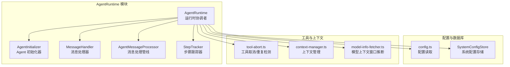
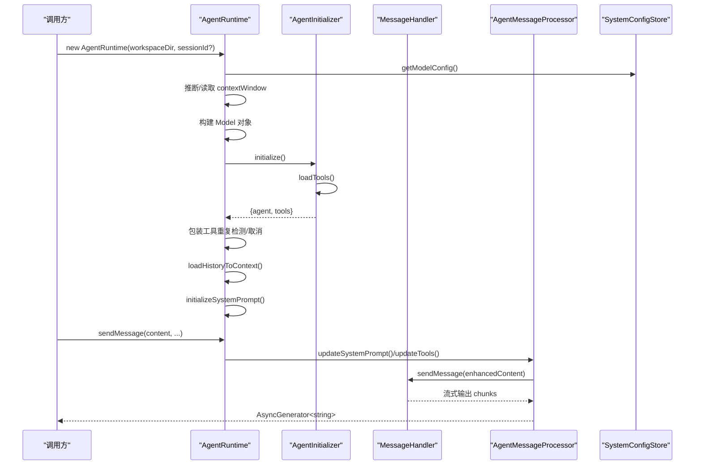
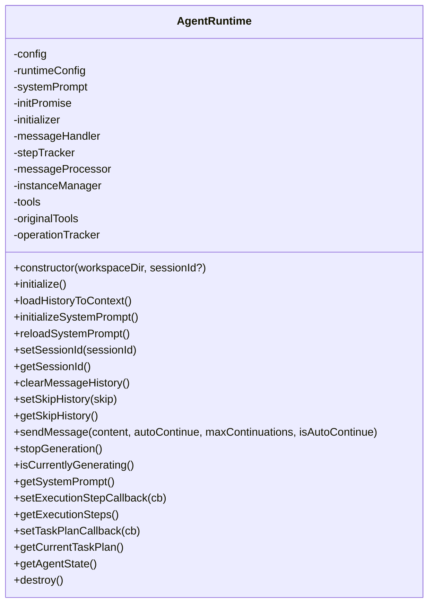
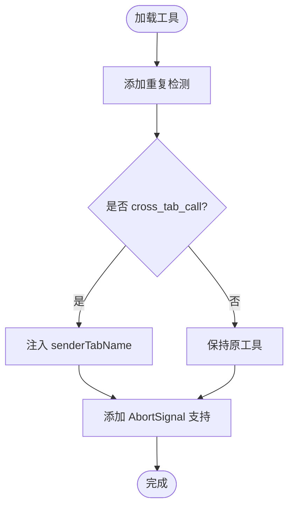
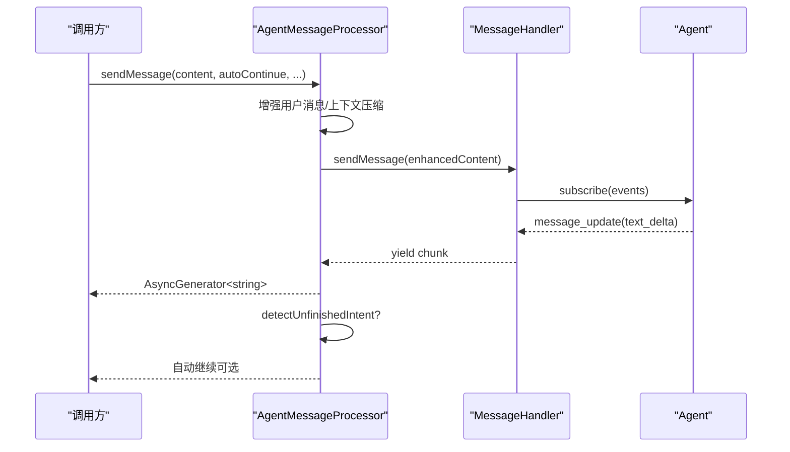
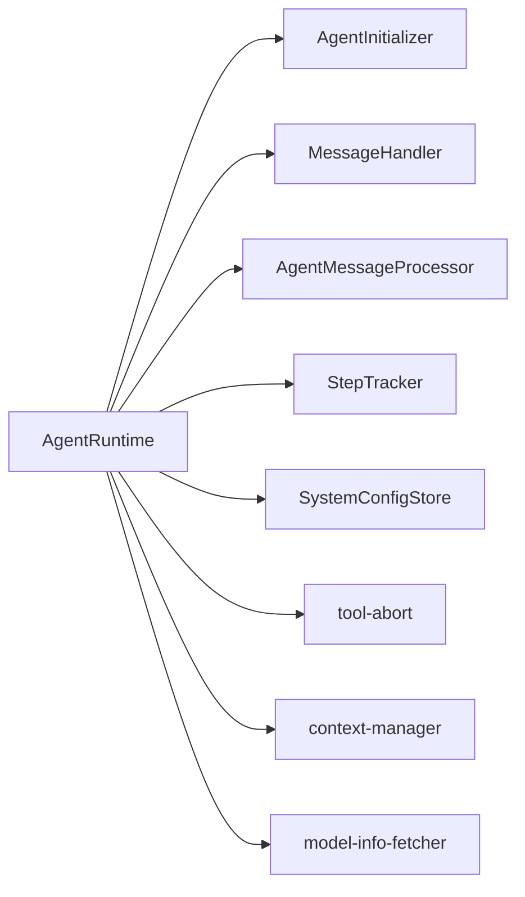

# AgentRuntime 核心类

<cite>
**本文引用的文件**
- [agent-runtime.ts](file://src/main/agent-runtime/agent-runtime.ts)
- [types.ts](file://src/main/agent-runtime/types.ts)
- [agent-initializer.ts](file://src/main/agent-runtime/agent-initializer.ts)
- [message-handler.ts](file://src/main/agent-runtime/message-handler.ts)
- [agent-message-processor.ts](file://src/main/agent-runtime/agent-message-processor.ts)
- [step-tracker.ts](file://src/main/agent-runtime/step-tracker.ts)
- [step-description-generator.ts](file://src/main/agent-runtime/step-description-generator.ts)
- [system-config-store.ts](file://src/main/database/system-config-store.ts)
- [config.ts](file://src/main/config.ts)
- [tool-abort.ts](file://src/main/tools/tool-abort.ts)
- [context-manager.ts](file://src/main/context/context-manager.ts)
- [model-info-fetcher.ts](file://src/main/utils/model-info-fetcher.ts)
- [index.ts](file://src/main/agent-runtime/index.ts)
</cite>

## 目录
1. [简介](#简介)
2. [项目结构](#项目结构)
3. [核心组件](#核心组件)
4. [架构总览](#架构总览)
5. [详细组件分析](#详细组件分析)
6. [依赖关系分析](#依赖关系分析)
7. [性能考量](#性能考量)
8. [故障排查指南](#故障排查指南)
9. [结论](#结论)
10. [附录](#附录)

## 简介
本文件面向开发者与高级用户，系统性阐述 AgentRuntime 核心类的设计架构、构造与初始化流程、运行时配置管理、模型对象创建与 API 类型适配、Agent 实例管理、工具列表缓存与重复检测机制、与数据库的交互方式、上下文窗口计算逻辑、模型配置加载过程、性能优化建议、错误处理策略与调试技巧。文档以循序渐进的方式呈现，既适合初学者快速上手，也能满足资深工程师的深度需求。

## 项目结构
AgentRuntime 所属模块位于 src/main/agent-runtime，围绕“运行时协调者”的职责，聚合了初始化器、消息处理器、步骤跟踪器、工具取消与重复检测等子系统；同时通过 SystemConfigStore 与数据库交互，结合上下文管理器进行上下文压缩与令牌估算。

图表来源
- [agent-runtime.ts:1-188](file://src/main/agent-runtime/agent-runtime.ts#L1-L188)
- [agent-initializer.ts:1-188](file://src/main/agent-runtime/agent-initializer.ts#L1-L188)
- [message-handler.ts:1-752](file://src/main/agent-runtime/message-handler.ts#L1-L752)
- [agent-message-processor.ts:1-549](file://src/main/agent-runtime/agent-message-processor.ts#L1-L549)
- [step-tracker.ts:1-199](file://src/main/agent-runtime/step-tracker.ts#L1-L199)
- [config.ts:1-108](file://src/main/config.ts#L1-L108)
- [system-config-store.ts:1-576](file://src/main/database/system-config-store.ts#L1-L576)
- [tool-abort.ts:1-427](file://src/main/tools/tool-abort.ts#L1-L427)
- [context-manager.ts:1-366](file://src/main/context/context-manager.ts#L1-L366)
- [model-info-fetcher.ts:1-84](file://src/main/utils/model-info-fetcher.ts#L1-L84)

章节来源
- [agent-runtime.ts:1-188](file://src/main/agent-runtime/agent-runtime.ts#L1-L188)
- [index.ts:1-13](file://src/main/agent-runtime/index.ts#L1-L13)

## 核心组件
- AgentRuntime：运行时协调者，负责初始化、生命周期管理、消息发送与流式输出、会话切换、系统提示词重载、销毁等。
- AgentInitializer：负责创建 Agent 实例、加载工具、构建系统提示词。
- MessageHandler：负责消息发送、流式输出、生成控制、执行步骤收集、超时与取消处理。
- AgentMessageProcessor：负责消息发送逻辑、消息队列维护、未完成意图检测与自动继续、上下文管理集成。
- StepTracker：任务计划与步骤跟踪，支持重试与状态推进。
- SystemConfigStore：SQLite 持久化配置中心，提供模型、工作区、工具、连接器等配置读取与迁移。
- tool-abort：工具取消信号封装、重复检测与失败统计。
- context-manager：上下文压缩与令牌估算，历史消息与工具结果裁剪。
- model-info-fetcher：基于模型 ID 的上下文窗口推断。

章节来源
- [types.ts:1-40](file://src/main/agent-runtime/types.ts#L1-L40)
- [agent-initializer.ts:1-188](file://src/main/agent-runtime/agent-initializer.ts#L1-L188)
- [message-handler.ts:1-752](file://src/main/agent-runtime/message-handler.ts#L1-L752)
- [agent-message-processor.ts:1-549](file://src/main/agent-runtime/agent-message-processor.ts#L1-L549)
- [step-tracker.ts:1-199](file://src/main/agent-runtime/step-tracker.ts#L1-L199)
- [system-config-store.ts:1-576](file://src/main/database/system-config-store.ts#L1-L576)
- [tool-abort.ts:1-427](file://src/main/tools/tool-abort.ts#L1-L427)
- [context-manager.ts:1-366](file://src/main/context/context-manager.ts#L1-L366)
- [model-info-fetcher.ts:1-84](file://src/main/utils/model-info-fetcher.ts#L1-L84)

## 架构总览
AgentRuntime 采用“分层解耦 + 模块化协作”的设计：
- 构造阶段：读取系统配置，从数据库或环境变量获取模型配置，推断上下文窗口，创建模型对象，构建运行时配置。
- 初始化阶段：异步初始化 Agent、加载工具、构建系统提示词，加载历史消息到上下文并压缩，设置 MessageHandler 依赖。
- 运行阶段：通过 AgentMessageProcessor 调用 MessageHandler，实现流式输出、自动继续、上下文压缩、重复检测与取消控制。
- 终止阶段：销毁时重置 Agent 状态、停止生成、清理资源。

图表来源
- [agent-runtime.ts:65-188](file://src/main/agent-runtime/agent-runtime.ts#L65-L188)
- [agent-initializer.ts:42-71](file://src/main/agent-runtime/agent-initializer.ts#L42-L71)
- [agent-message-processor.ts:345-547](file://src/main/agent-runtime/agent-message-processor.ts#L345-L547)
- [message-handler.ts:114-587](file://src/main/agent-runtime/message-handler.ts#L114-L587)
- [system-config-store.ts:383-393](file://src/main/database/system-config-store.ts#L383-L393)

## 详细组件分析

### AgentRuntime 设计与初始化流程
- 构造函数参数
  - workspaceDir：工作区目录路径（必须显式提供，不使用默认值）
  - sessionId：会话 ID（可选，默认为 'default'）
- 初始化流程
  - 从 SystemConfigStore 读取模型配置（含 contextWindow），若缺失则通过模型 ID 推断
  - 根据 apiType 创建 Model 对象（OpenAI 兼容或 Google Generative AI）
  - 构建运行时配置（包含 workspaceDir、sessionId、model、apiKey、baseUrl、maxConcurrentSubAgents）
  - 异步初始化 Agent（AgentInitializer.initialize），加载工具并构建系统提示词
  - 加载历史消息到 Agent 上下文并压缩
  - 初始化 MessageHandler、StepTracker、AgentMessageProcessor
  - 异步初始化系统提示词（防重复初始化）

图表来源
- [agent-runtime.ts:27-800](file://src/main/agent-runtime/agent-runtime.ts#L27-L800)

章节来源
- [agent-runtime.ts:65-188](file://src/main/agent-runtime/agent-runtime.ts#L65-L188)
- [types.ts:11-18](file://src/main/agent-runtime/types.ts#L11-L18)

### 运行时配置管理与模型对象创建
- 配置来源优先级：数据库模型配置 > 环境变量 > 抛错
- 上下文窗口获取顺序：数据库 > 模型 ID 推断 > 默认值
- 模型对象创建：根据 apiType 选择不同模型类型，填充 input、reasoning、contextWindow、maxTokens、cost 等字段
- 运行时配置：包含 workspaceDir、sessionId、model、apiKey、baseUrl、maxConcurrentSubAgents

章节来源
- [config.ts:38-83](file://src/main/config.ts#L38-L83)
- [system-config-store.ts:383-393](file://src/main/database/system-config-store.ts#L383-L393)
- [model-info-fetcher.ts:13-83](file://src/main/utils/model-info-fetcher.ts#L13-L83)
- [agent-runtime.ts:68-153](file://src/main/agent-runtime/agent-runtime.ts#L68-L153)

### API 类型适配机制
- OpenAI 兼容：input 支持 text，contextWindow、maxTokens 基于配置推断
- Google Generative AI：input 支持 text/image，contextWindow、maxTokens 基于配置推断
- 通过 apiType 切换模型类型，保证与底层 pi-ai 适配

章节来源
- [agent-runtime.ts:101-143](file://src/main/agent-runtime/agent-runtime.ts#L101-L143)

### Agent 实例管理与工具列表缓存
- Agent 实例管理：AgentInstanceManager 维护 agent 引用，支持 recreateAgent 重建
- 工具列表缓存：tools（带重复检测与取消支持）、originalTools（原始工具列表）
- 工具包装策略：
  - 为所有工具添加重复检测（OperationTracker）
  - 为 cross_tab_call 工具再包装注入 senderTabName
  - 为工具添加 AbortSignal 支持（wrapToolWithAbortSignal）

图表来源
- [agent-runtime.ts:196-213](file://src/main/agent-runtime/agent-runtime.ts#L196-L213)
- [agent-initializer.ts:76-79](file://src/main/agent-runtime/agent-initializer.ts#L76-L79)
- [tool-abort.ts:101-144](file://src/main/tools/tool-abort.ts#L101-L144)

章节来源
- [agent-runtime.ts:196-213](file://src/main/agent-runtime/agent-runtime.ts#L196-L213)
- [agent-initializer.ts:76-79](file://src/main/agent-runtime/agent-initializer.ts#L76-L79)
- [tool-abort.ts:149-271](file://src/main/tools/tool-abort.ts#L149-L271)

### 重复检测机制
- OperationTracker 维护操作计数与连续失败计数
- 重复阈值：默认最多允许重复 2 次（共 3 次执行）
- 连续失败阈值：超过 5 次连续失败，停止任务
- 特殊处理：
  - 浏览器工具：按 action+时间戳生成唯一键，允许重复执行
  - read/bash 工具：仅基于关键参数（路径/命令）生成唯一键
- wrapToolWithDuplicateDetection 在执行前后检查并记录状态

章节来源
- [tool-abort.ts:149-271](file://src/main/tools/tool-abort.ts#L149-L271)
- [tool-abort.ts:280-426](file://src/main/tools/tool-abort.ts#L280-L426)

### 与数据库的交互方式
- SystemConfigStore 单例访问，提供：
  - 模型配置读取与上下文窗口更新
  - 工作区设置、工具配置、连接器配置、Tab 配置等
- AgentRuntime 在构造时读取模型配置，初始化时加载历史消息，支持重载系统提示词时刷新

章节来源
- [system-config-store.ts:383-393](file://src/main/database/system-config-store.ts#L383-L393)
- [agent-runtime.ts:68-86](file://src/main/agent-runtime/agent-runtime.ts#L68-L86)
- [agent-runtime.ts:516-531](file://src/main/agent-runtime/agent-runtime.ts#L516-L531)

### 上下文窗口计算逻辑与上下文压缩
- 上下文窗口来源：数据库 > 模型 ID 推断 > 默认值
- 上下文压缩策略：
  - 使用率 < 70%：不压缩
  - 使用率 70%-85%：裁剪工具结果
  - 使用率 > 85%：裁剪历史消息
- 固定开销：系统提示词 + 工具定义字符数估算
- 与 context-manager 集成：在 AgentMessageProcessor 中调用 manageContext，支持统计与调试输出

章节来源
- [context-manager.ts:100-303](file://src/main/context/context-manager.ts#L100-L303)
- [agent-message-processor.ts:401-423](file://src/main/agent-runtime/agent-message-processor.ts#L401-L423)
- [agent-runtime.ts:282-299](file://src/main/agent-runtime/agent-runtime.ts#L282-L299)

### 模型配置加载过程
- 优先从 SystemConfigStore 读取 model_config，包含 provider_type、provider_id、provider_name、base_url、model_id、model_name、model_id_2、api_key、context_window、last_fetched
- 若数据库缺失，回退到环境变量（AI_API_KEY、AI_BASE_URL、AI_MODEL_ID 等）
- 未配置时抛出错误，提示用户在系统设置中配置

章节来源
- [config.ts:38-83](file://src/main/config.ts#L38-L83)
- [system-config-store.ts:104-119](file://src/main/database/system-config-store.ts#L104-L119)

### 会话管理与历史消息加载
- setSessionId：切换会话时重建 Agent，重新初始化系统提示词
- loadHistoryToContext：从 Gateway 的 SessionManager 加载最近 10 轮对话，转换为 Agent 消息格式，压缩后注入 Agent.state.messages
- maintainMessageQueue：维护消息队列不超过 10 轮用户对话

章节来源
- [agent-runtime.ts:571-606](file://src/main/agent-runtime/agent-runtime.ts#L571-L606)
- [agent-runtime.ts:236-308](file://src/main/agent-runtime/agent-runtime.ts#L236-L308)
- [agent-runtime.ts:392-423](file://src/main/agent-runtime/agent-runtime.ts#L392-L423)

### 流式输出与自动继续机制
- MessageHandler.sendMessage：订阅 Agent 事件，实现流式输出，支持 Thinking 模拟、工具调用事件收集、超时与取消
- AgentMessageProcessor.sendMessage：增强用户消息、上下文压缩、保存 captured-prompt、检测未完成意图并自动继续
- detectUnfinishedIntent：综合“最后轮次工具调用”“全程工具调用”“AI 判断”三维度决定是否继续

图表来源
- [agent-message-processor.ts:345-547](file://src/main/agent-runtime/agent-message-processor.ts#L345-L547)
- [message-handler.ts:114-587](file://src/main/agent-runtime/message-handler.ts#L114-L587)

章节来源
- [message-handler.ts:114-587](file://src/main/agent-runtime/message-handler.ts#L114-L587)
- [agent-message-processor.ts:87-170](file://src/main/agent-runtime/agent-message-processor.ts#L87-L170)

### 错误处理与调试技巧
- 错误分类：
  - 用户主动停止：AbortError，MessageHandler.wasAbortedByUser 标识
  - “already processing”并发错误：通过 generationId 与 AbortController 协同规避
  - 空响应：抛出明确错误，提示 API 配置或网络问题
- 调试手段：
  - captured-prompt 保存：记录系统提示词、工具、消息、统计信息
  - 详细的日志输出：上下文使用率、压缩统计、生成耗时、工具调用详情
  - 强制重置：MessageHandler.forceReset 与 AgentRuntime.ensureAgentReady

章节来源
- [message-handler.ts:589-751](file://src/main/agent-runtime/message-handler.ts#L589-L751)
- [agent-message-processor.ts:179-340](file://src/main/agent-runtime/agent-message-processor.ts#L179-L340)
- [agent-runtime.ts:430-456](file://src/main/agent-runtime/agent-runtime.ts#L430-L456)

## 依赖关系分析
- AgentRuntime 依赖：
  - AgentInitializer：创建 Agent、加载工具、构建系统提示词
  - MessageHandler：消息发送、流式输出、生成控制
  - AgentMessageProcessor：消息处理管线、自动继续、上下文管理
  - StepTracker：任务计划与步骤跟踪
  - SystemConfigStore：模型与工作区配置
  - tool-abort：工具取消与重复检测
  - context-manager：上下文压缩
  - model-info-fetcher：模型上下文窗口推断

图表来源
- [agent-runtime.ts:166-184](file://src/main/agent-runtime/agent-runtime.ts#L166-L184)
- [agent-initializer.ts:17-35](file://src/main/agent-runtime/agent-initializer.ts#L17-L35)
- [message-handler.ts:16-35](file://src/main/agent-runtime/message-handler.ts#L16-L35)
- [agent-message-processor.ts:20-45](file://src/main/agent-runtime/agent-message-processor.ts#L20-L45)
- [step-tracker.ts:34-64](file://src/main/agent-runtime/step-tracker.ts#L34-L64)
- [system-config-store.ts:37-70](file://src/main/database/system-config-store.ts#L37-L70)
- [tool-abort.ts:8-22](file://src/main/tools/tool-abort.ts#L8-L22)
- [context-manager.ts:8-23](file://src/main/context/context-manager.ts#L8-L23)
- [model-info-fetcher.ts:7-12](file://src/main/utils/model-info-fetcher.ts#L7-L12)

章节来源
- [agent-runtime.ts:166-184](file://src/main/agent-runtime/agent-runtime.ts#L166-L184)

## 性能考量
- 上下文窗口与 maxTokens：合理设置 maxTokens（通常为 contextWindow 的 1/2 左右），避免频繁压缩
- 工具执行串行：AgentInitializer.setToolExecution('sequential')，降低并发冲突与资源竞争
- 重复检测与失败统计：避免无效重试，提升整体吞吐
- 上下文压缩阈值：70%/85% 的软裁剪与硬裁剪策略平衡性能与准确性
- 流式输出与超时：MessageHandler 的超时与进度监控，避免长时间阻塞

[本节为通用指导，无需特定文件引用]

## 故障排查指南
- 模型未配置：检查 SystemConfigStore 与环境变量，确保 AI_API_KEY、AI_BASE_URL、AI_MODEL_ID 填写
- 空响应：检查 API 端点、密钥有效性、网络连通性
- 生成卡住：使用 stopGeneration 或 forceReset，必要时重建 Agent 实例
- 重复执行被阻止：查看 OperationTracker 统计，调整操作参数或改用不同方法
- 上下文溢出：启用上下文压缩，检查 captured-prompt 统计信息

章节来源
- [config.ts:68-82](file://src/main/config.ts#L68-L82)
- [message-handler.ts:592-624](file://src/main/agent-runtime/message-handler.ts#L592-L624)
- [tool-abort.ts:163-202](file://src/main/tools/tool-abort.ts#L163-L202)
- [agent-message-processor.ts:179-340](file://src/main/agent-runtime/agent-message-processor.ts#L179-L340)

## 结论
AgentRuntime 通过清晰的模块划分与完善的生命周期管理，实现了从配置加载、Agent 初始化、工具包装、上下文压缩到流式输出与自动继续的完整链路。其重复检测、取消控制与上下文压缩策略有效提升了稳定性与性能。配合 SystemConfigStore 与工具链生态，能够满足复杂桌面 AI 助手的运行需求。

[本节为总结性内容，无需特定文件引用]

## 附录

### 如何创建 AgentRuntime 实例
- 示例路径：[构造函数与初始化:65-188](file://src/main/agent-runtime/agent-runtime.ts#L65-L188)
- 关键步骤：
  - 提供工作区目录（必填）
  - 可选会话 ID（默认 'default'）
  - 等待 initPromise 完成后再进行消息发送

章节来源
- [agent-runtime.ts:65-188](file://src/main/agent-runtime/agent-runtime.ts#L65-L188)

### 配置工作区目录与会话 ID
- 工作区目录：runtimeConfig.workspaceDir
- 会话 ID：runtimeConfig.sessionId，可通过 setSessionId 切换
- 示例路径：[setSessionId 与 getSessionId:571-613](file://src/main/agent-runtime/agent-runtime.ts#L571-L613)

章节来源
- [agent-runtime.ts:571-613](file://src/main/agent-runtime/agent-runtime.ts#L571-L613)

### 与数据库交互要点
- 读取模型配置：SystemConfigStore.getInstance().getModelConfig()
- 更新上下文窗口：SystemConfigStore.updateModelContextWindow()
- 示例路径：[模型配置读取与更新:383-393](file://src/main/database/system-config-store.ts#L383-L393)

章节来源
- [system-config-store.ts:383-393](file://src/main/database/system-config-store.ts#L383-L393)

### 上下文窗口计算与压缩
- 上下文窗口来源：数据库 > 模型 ID 推断 > 默认值
- 压缩策略：70% 软裁剪（工具结果），85% 硬裁剪（历史消息）
- 示例路径：[上下文管理:100-303](file://src/main/context/context-manager.ts#L100-L303)

章节来源
- [context-manager.ts:100-303](file://src/main/context/context-manager.ts#L100-L303)
- [model-info-fetcher.ts:13-83](file://src/main/utils/model-info-fetcher.ts#L13-L83)

### 模型配置加载过程
- 优先级：数据库 > 环境变量 > 抛错
- 示例路径：[配置读取:38-83](file://src/main/config.ts#L38-L83)

章节来源
- [config.ts:38-83](file://src/main/config.ts#L38-L83)

### 性能优化建议
- 合理设置 maxTokens，避免频繁压缩
- 使用工具串行执行，减少并发冲突
- 启用上下文压缩，控制历史消息长度
- 使用 captured-prompt 定位高 token 场景

章节来源
- [agent-runtime.ts:105-105](file://src/main/agent-runtime/agent-runtime.ts#L105-L105)
- [agent-initializer.ts:68-68](file://src/main/agent-runtime/agent-initializer.ts#L68-L68)
- [context-manager.ts:191-273](file://src/main/context/context-manager.ts#L191-L273)

### 错误处理策略
- 用户停止：AbortError 标识，MessageHandler.wasAbortedByUser
- 并发错误："already processing"，通过 generationId 与 AbortController 协同规避
- 空响应：抛出明确错误，提示 API 配置或网络问题
- 失败停止：连续失败超过阈值，停止任务并给出建议

章节来源
- [message-handler.ts:589-751](file://src/main/agent-runtime/message-handler.ts#L589-L751)
- [tool-abort.ts:187-202](file://src/main/tools/tool-abort.ts#L187-L202)

### 调试技巧
- captured-prompt：保存系统提示词、工具、消息与统计，定位高 token 场景
- 日志输出：上下文使用率、压缩统计、生成耗时、工具调用详情
- 强制重置：MessageHandler.forceReset 与 AgentRuntime.ensureAgentReady

章节来源
- [agent-message-processor.ts:179-340](file://src/main/agent-runtime/agent-message-processor.ts#L179-L340)
- [agent-runtime.ts:430-456](file://src/main/agent-runtime/agent-runtime.ts#L430-L456)