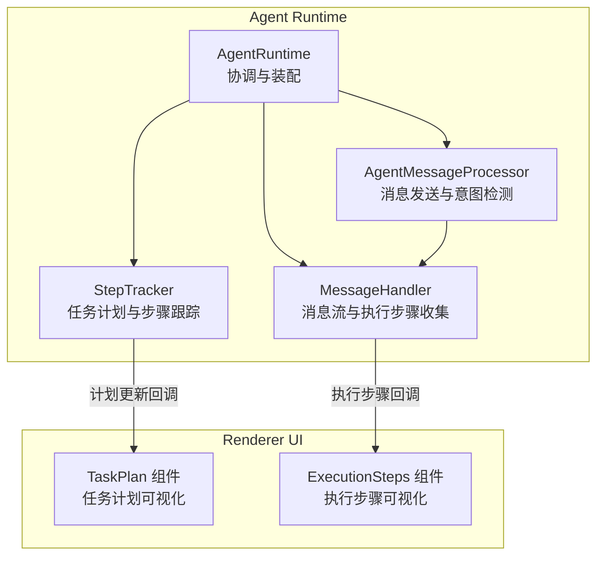
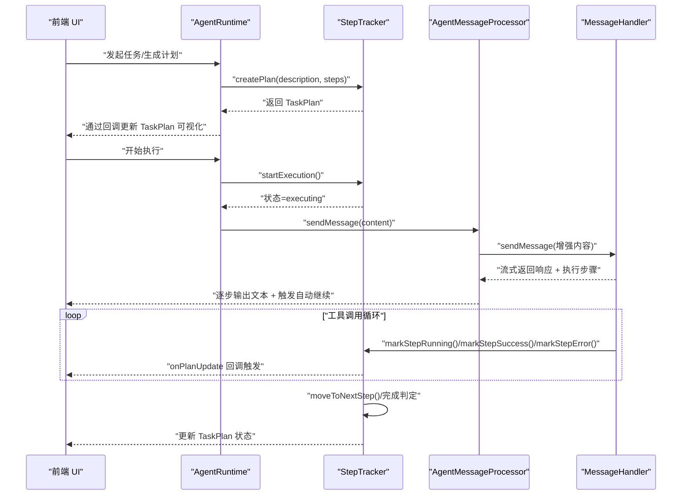
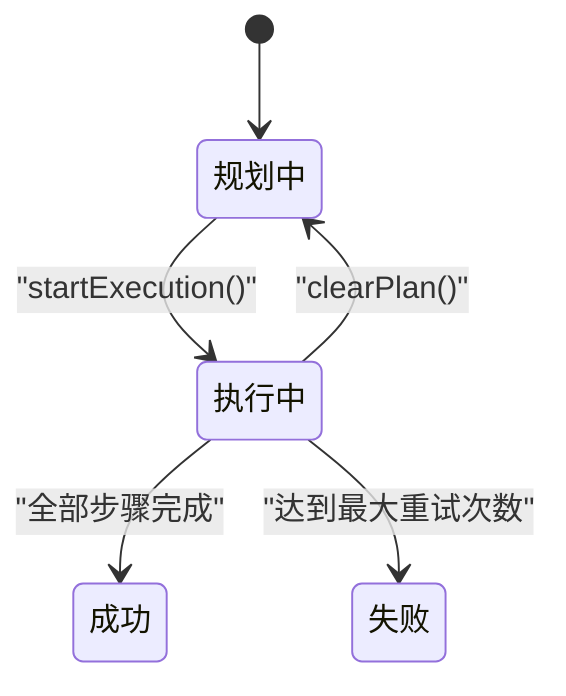
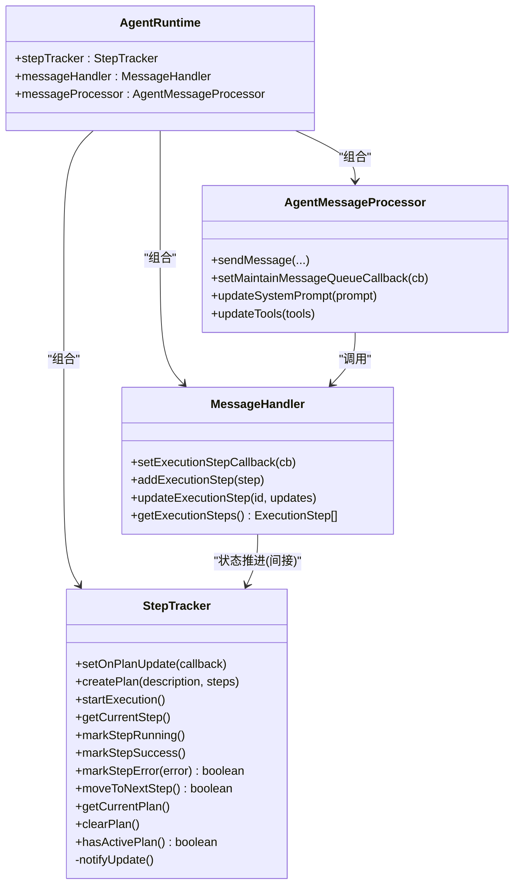

# 步骤跟踪器

<cite>
**本文引用的文件**
- [src/main/agent-runtime/step-tracker.ts](file://src/main/agent-runtime/step-tracker.ts)
- [src/main/agent-runtime/step-description-generator.ts](file://src/main/agent-runtime/step-description-generator.ts)
- [src/main/agent-runtime/message-handler.ts](file://src/main/agent-runtime/message-handler.ts)
- [src/main/agent-runtime/agent-message-processor.ts](file://src/main/agent-runtime/agent-message-processor.ts)
- [src/main/agent-runtime/agent-runtime.ts](file://src/main/agent-runtime/agent-runtime.ts)
- [src/types/message.ts](file://src/types/message.ts)
- [src/renderer/components/ExecutionSteps.tsx](file://src/renderer/components/ExecutionSteps.tsx)
- [src/renderer/components/TaskPlan.tsx](file://src/renderer/components/TaskPlan.tsx)
</cite>

## 目录
1. [简介](#简介)
2. [项目结构](#项目结构)
3. [核心组件](#核心组件)
4. [架构总览](#架构总览)
5. [详细组件分析](#详细组件分析)
6. [依赖关系分析](#依赖关系分析)
7. [性能考量](#性能考量)
8. [故障排查指南](#故障排查指南)
9. [结论](#结论)
10. [附录](#附录)

## 简介
本技术文档围绕“步骤跟踪器”模块展开，系统性阐述 StepTracker 类在任务计划跟踪、执行步骤管理、进度监控方面的职责与实现；深入分析步骤描述生成器、任务分解逻辑、状态更新流程；记录步骤数据结构、计划更新回调、执行历史记录；并结合消息处理器与渲染组件，解释与消息流的协作方式、步骤可视化、性能监控指标，最后提供优化建议、状态同步与调试分析方法。

## 项目结构
步骤跟踪器位于主进程 Agent Runtime 子系统内，与消息处理器、执行步骤收集器、UI 渲染组件协同工作，形成“计划生成—执行跟踪—状态回传—可视化”的闭环。

图表来源
- [src/main/agent-runtime/agent-runtime.ts:173-184](file://src/main/agent-runtime/agent-runtime.ts#L173-L184)
- [src/main/agent-runtime/step-tracker.ts:34-65](file://src/main/agent-runtime/step-tracker.ts#L34-L65)
- [src/main/agent-runtime/message-handler.ts:16-58](file://src/main/agent-runtime/message-handler.ts#L16-L58)
- [src/main/agent-runtime/agent-message-processor.ts:20-45](file://src/main/agent-runtime/agent-message-processor.ts#L20-L45)
- [src/renderer/components/TaskPlan.tsx:12-105](file://src/renderer/components/TaskPlan.tsx#L12-L105)
- [src/renderer/components/ExecutionSteps.tsx:12-121](file://src/renderer/components/ExecutionSteps.tsx#L12-L121)

章节来源
- [src/main/agent-runtime/agent-runtime.ts:165-188](file://src/main/agent-runtime/agent-runtime.ts#L165-L188)

## 核心组件
- StepTracker：负责任务计划生命周期管理、步骤状态推进、重试与失败判定、计划更新通知。
- Step Description Generator：根据工具名称与参数生成人类可读的步骤描述。
- MessageHandler：在消息流中收集执行步骤，维护执行历史，支持流式输出与取消。
- AgentMessageProcessor：负责消息发送、工具调用检测、自动继续逻辑、上下文压缩与调试提示词保存。
- Renderer Components：TaskPlan 与 ExecutionSteps，分别用于展示任务计划与执行步骤的可视化界面。

章节来源
- [src/main/agent-runtime/step-tracker.ts:34-198](file://src/main/agent-runtime/step-tracker.ts#L34-L198)
- [src/main/agent-runtime/step-description-generator.ts:14-46](file://src/main/agent-runtime/step-description-generator.ts#L14-L46)
- [src/main/agent-runtime/message-handler.ts:16-82](file://src/main/agent-runtime/message-handler.ts#L16-L82)
- [src/main/agent-runtime/agent-message-processor.ts:20-66](file://src/main/agent-runtime/agent-message-processor.ts#L20-L66)
- [src/renderer/components/TaskPlan.tsx:12-105](file://src/renderer/components/TaskPlan.tsx#L12-L105)
- [src/renderer/components/ExecutionSteps.tsx:12-121](file://src/renderer/components/ExecutionSteps.tsx#L12-L121)

## 架构总览
步骤跟踪器与消息处理器的协作流程如下：

图表来源
- [src/main/agent-runtime/agent-runtime.ts:173-184](file://src/main/agent-runtime/agent-runtime.ts#L173-L184)
- [src/main/agent-runtime/step-tracker.ts:48-166](file://src/main/agent-runtime/step-tracker.ts#L48-L166)
- [src/main/agent-runtime/agent-message-processor.ts:345-547](file://src/main/agent-runtime/agent-message-processor.ts#L345-L547)
- [src/main/agent-runtime/message-handler.ts:114-587](file://src/main/agent-runtime/message-handler.ts#L114-L587)

## 详细组件分析

### StepTracker 类
职责与能力
- 计划生命周期：创建计划、开始执行、清空计划、判断是否有活动计划。
- 步骤管理：获取当前步骤、移动到下一步、重试与失败判定。
- 状态推进：标记步骤为运行中/成功/失败，记录起止时间与错误信息。
- 回调通知：通过 setOnPlanUpdate 回调向 UI 或上层模块推送计划变更。

关键数据结构
- TaskPlan：包含计划 ID、描述、步骤数组、当前步骤索引、整体状态。
- TaskStep：包含步骤 ID、描述、状态、重试计数与上限、错误信息、起止时间。

状态机与流程

图表来源
- [src/main/agent-runtime/step-tracker.ts:23-29](file://src/main/agent-runtime/step-tracker.ts#L23-L29)
- [src/main/agent-runtime/step-tracker.ts:70-166](file://src/main/agent-runtime/step-tracker.ts#L70-L166)

章节来源
- [src/main/agent-runtime/step-tracker.ts:34-198](file://src/main/agent-runtime/step-tracker.ts#L34-L198)

### 步骤描述生成器
职责
- 将工具名称与参数映射为人类可读的步骤描述，覆盖常见工具（浏览器、文件读写、命令执行、日历等）。

实现要点
- 针对不同工具采用分支策略，对命令与浏览器操作进行截断与简化，保证可读性。
- 默认兜底策略，避免因参数异常导致描述缺失。

章节来源
- [src/main/agent-runtime/step-description-generator.ts:14-46](file://src/main/agent-runtime/step-description-generator.ts#L14-L46)
- [src/main/agent-runtime/step-description-generator.ts:54-110](file://src/main/agent-runtime/step-description-generator.ts#L54-L110)

### 执行步骤收集与可视化
MessageHandler 的作用
- 在消息流中收集执行步骤，维护执行历史数组，支持运行中/成功/失败状态切换与持续时间计算。
- 通过 setExecutionStepCallback 将执行步骤实时回传给上层。

渲染组件
- ExecutionSteps：展示每个工具调用的参数、结果与耗时，支持展开查看。
- TaskPlan：展示任务计划的步骤列表、当前步骤高亮、重试次数与错误信息。

章节来源
- [src/main/agent-runtime/message-handler.ts:63-82](file://src/main/agent-runtime/message-handler.ts#L63-L82)
- [src/main/agent-runtime/message-handler.ts:649-652](file://src/main/agent-runtime/message-handler.ts#L649-L652)
- [src/renderer/components/ExecutionSteps.tsx:12-121](file://src/renderer/components/ExecutionSteps.tsx#L12-L121)
- [src/renderer/components/TaskPlan.tsx:12-105](file://src/renderer/components/TaskPlan.tsx#L12-L105)

### 任务分解与状态更新流程
AgentRuntime 与 StepTracker 的集成
- AgentRuntime 在初始化时创建 StepTracker，并通过 setOnPlanUpdate 注册回调，以便在计划状态变化时更新 UI。
- 通过 AgentMessageProcessor 的 sendMessage 流程，结合 MessageHandler 的工具调用事件，驱动 StepTracker 的步骤状态推进。

章节来源
- [src/main/agent-runtime/agent-runtime.ts:173-184](file://src/main/agent-runtime/agent-runtime.ts#L173-L184)
- [src/main/agent-runtime/agent-runtime.ts:777-784](file://src/main/agent-runtime/agent-runtime.ts#L777-L784)

### 与消息处理器的协作
AgentMessageProcessor 的关键点
- detectUnfinishedIntent：检测是否需要自动继续，避免“仅意图未执行”的假象。
- saveCapturedPrompt：保存调试用的完整提示词，便于分析上下文与 Token 使用。
- sendMessage：作为异步生成器，逐块输出文本，同时维护工具调用与消息队列。

MessageHandler 的关键点
- 通过事件流收集工具调用的开始/更新/结束，动态构建 ExecutionStep 并上报。
- 支持 AbortController，实现用户主动停止与工具级取消。

章节来源
- [src/main/agent-runtime/agent-message-processor.ts:87-170](file://src/main/agent-runtime/agent-message-processor.ts#L87-L170)
- [src/main/agent-runtime/agent-message-processor.ts:179-340](file://src/main/agent-runtime/agent-message-processor.ts#L179-L340)
- [src/main/agent-runtime/agent-message-processor.ts:345-547](file://src/main/agent-runtime/agent-message-processor.ts#L345-L547)
- [src/main/agent-runtime/message-handler.ts:167-364](file://src/main/agent-runtime/message-handler.ts#L167-L364)
- [src/main/agent-runtime/message-handler.ts:442-451](file://src/main/agent-runtime/message-handler.ts#L442-L451)
- [src/main/agent-runtime/message-handler.ts:592-624](file://src/main/agent-runtime/message-handler.ts#L592-L624)

## 依赖关系分析
StepTracker 与各模块的耦合关系如下：

图表来源
- [src/main/agent-runtime/agent-runtime.ts:36-38](file://src/main/agent-runtime/agent-runtime.ts#L36-L38)
- [src/main/agent-runtime/agent-runtime.ts:173-184](file://src/main/agent-runtime/agent-runtime.ts#L173-L184)
- [src/main/agent-runtime/step-tracker.ts:34-65](file://src/main/agent-runtime/step-tracker.ts#L34-L65)
- [src/main/agent-runtime/message-handler.ts:16-58](file://src/main/agent-runtime/message-handler.ts#L16-L58)
- [src/main/agent-runtime/agent-message-processor.ts:20-45](file://src/main/agent-runtime/agent-message-processor.ts#L20-L45)

章节来源
- [src/main/agent-runtime/agent-runtime.ts:165-188](file://src/main/agent-runtime/agent-runtime.ts#L165-L188)

## 性能考量
- 上下文与 Token 管理：AgentMessageProcessor 在发送前进行上下文压缩与统计，有助于控制成本与延迟。
- 流式输出与超时保护：MessageHandler 在生成过程中定期检查超时与取消信号，避免长时间占用。
- 执行步骤聚合：ExecutionSteps 仅展示必要信息，避免大段结果在 UI 层频繁重绘。
- 重试策略：StepTracker 的最大重试次数限制可避免无限循环，提升稳定性。

## 故障排查指南
- 无活动计划：当调用 startExecution 且当前无计划时会抛出错误，需先调用 createPlan。
- 空响应：若 AI 返回空响应，需检查 API 配置与网络连接。
- 用户停止：MessageHandler.wasAbortedByUser 可用于判断是否由用户主动停止。
- 调试提示词：saveCapturedPrompt 会将最终发送的系统提示词、工具与消息保存至调试目录，便于分析上下文与 Token 使用。
- 错误检测：MessageHandler.detectErrorInResult 基于模式匹配识别常见错误，辅助快速定位问题。

章节来源
- [src/main/agent-runtime/step-tracker.ts:70-77](file://src/main/agent-runtime/step-tracker.ts#L70-L77)
- [src/main/agent-runtime/agent-message-processor.ts:464-467](file://src/main/agent-runtime/agent-message-processor.ts#L464-L467)
- [src/main/agent-runtime/agent-message-processor.ts:179-340](file://src/main/agent-runtime/agent-message-processor.ts#L179-L340)
- [src/main/agent-runtime/message-handler.ts:703-743](file://src/main/agent-runtime/message-handler.ts#L703-L743)
- [src/main/agent-runtime/message-handler.ts:643-645](file://src/main/agent-runtime/message-handler.ts#L643-L645)

## 结论
StepTracker 通过清晰的状态机与回调机制，将任务计划与执行步骤紧密衔接；配合 MessageHandler 的事件驱动与 AgentMessageProcessor 的智能继续逻辑，实现了稳定、可观测的任务执行链路。结合 UI 组件的可视化展示，开发者可以高效地跟踪与调试任务执行过程。

## 附录

### 数据模型与类型
- TaskPlan / TaskStep：任务计划与步骤的数据结构，包含状态、时间戳、重试与错误信息。
- ExecutionStep：工具执行步骤，包含工具名、参数、结果、状态与耗时。

章节来源
- [src/main/agent-runtime/step-tracker.ts:12-29](file://src/main/agent-runtime/step-tracker.ts#L12-L29)
- [src/types/message.ts:15-25](file://src/types/message.ts#L15-L25)

### 代码示例（以路径代替代码片段）
- 如何创建并启动任务计划
  - [src/main/agent-runtime/step-tracker.ts:48-65](file://src/main/agent-runtime/step-tracker.ts#L48-L65)
  - [src/main/agent-runtime/step-tracker.ts:70-77](file://src/main/agent-runtime/step-tracker.ts#L70-L77)
- 如何跟踪执行步骤
  - [src/main/agent-runtime/message-handler.ts:283-323](file://src/main/agent-runtime/message-handler.ts#L283-L323)
  - [src/main/agent-runtime/step-tracker.ts:94-113](file://src/main/agent-runtime/step-tracker.ts#L94-L113)
- 如何生成步骤描述
  - [src/main/agent-runtime/step-description-generator.ts:14-46](file://src/main/agent-runtime/step-description-generator.ts#L14-L46)
- 如何更新任务计划状态
  - [src/main/agent-runtime/step-tracker.ts:118-145](file://src/main/agent-runtime/step-tracker.ts#L118-L145)
  - [src/main/agent-runtime/step-tracker.ts:150-166](file://src/main/agent-runtime/step-tracker.ts#L150-L166)
- 如何与消息处理器协作
  - [src/main/agent-runtime/agent-message-processor.ts:345-547](file://src/main/agent-runtime/agent-message-processor.ts#L345-L547)
  - [src/main/agent-runtime/message-handler.ts:114-587](file://src/main/agent-runtime/message-handler.ts#L114-L587)
- 如何可视化步骤
  - [src/renderer/components/ExecutionSteps.tsx:12-121](file://src/renderer/components/ExecutionSteps.tsx#L12-L121)
  - [src/renderer/components/TaskPlan.tsx:12-105](file://src/renderer/components/TaskPlan.tsx#L12-L105)