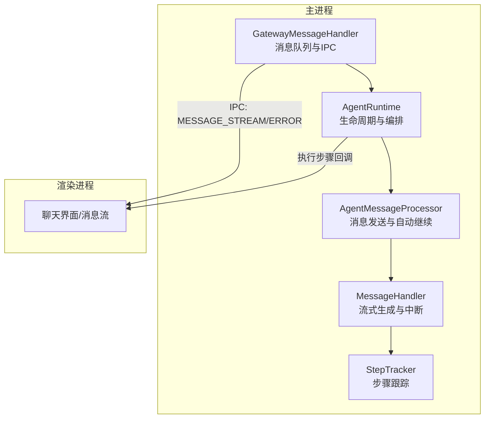
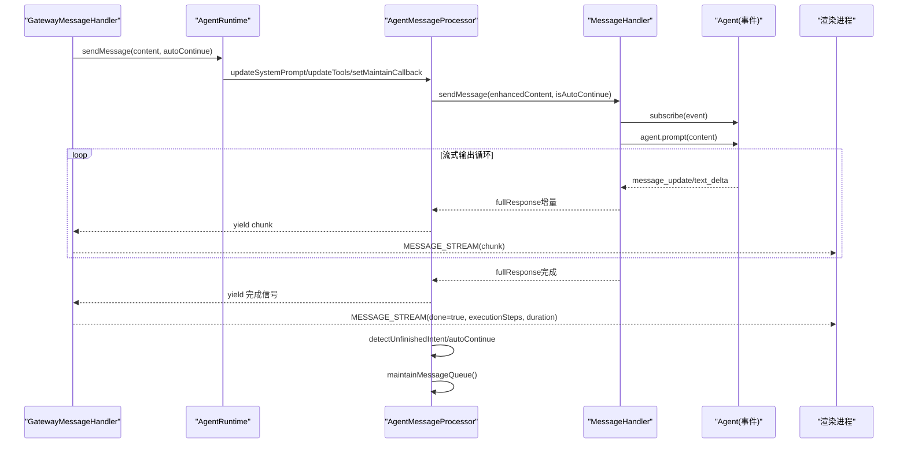
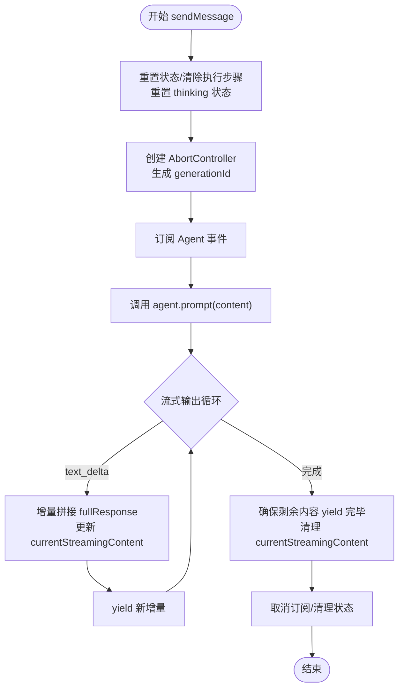
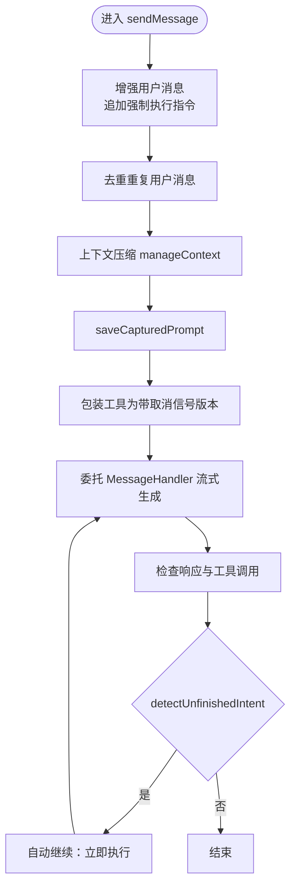
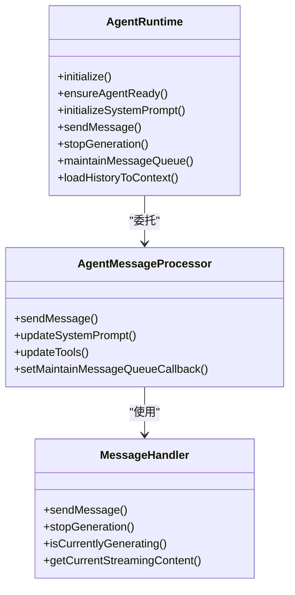
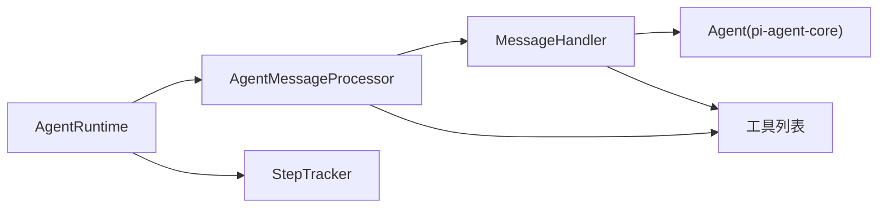

# 消息处理器

<cite>
**本文引用的文件**
- [message-handler.ts](file://src/main/agent-runtime/message-handler.ts)
- [agent-message-processor.ts](file://src/main/agent-runtime/agent-message-processor.ts)
- [agent-runtime.ts](file://src/main/agent-runtime/agent-runtime.ts)
- [types.ts](file://src/main/agent-runtime/types.ts)
- [step-tracker.ts](file://src/main/agent-runtime/step-tracker.ts)
- [gateway-message.ts](file://src/main/gateway-message.ts)
</cite>

## 目录
1. [简介](#简介)
2. [项目结构](#项目结构)
3. [核心组件](#核心组件)
4. [架构总览](#架构总览)
5. [详细组件分析](#详细组件分析)
6. [依赖关系分析](#依赖关系分析)
7. [性能考量](#性能考量)
8. [故障排查指南](#故障排查指南)
9. [结论](#结论)
10. [附录](#附录)

## 简介
本文件面向“消息处理器”模块，系统性阐述 MessageHandler 的消息处理机制、流式响应处理、生成状态管理；深入分析消息队列管理、生成控制逻辑、中断处理机制；记录消息格式转换、内容拼接、错误处理流程；并结合 Agent 的交互方式、流式输出处理、内存优化策略，提供性能优化、并发控制、调试与监控方法。文档同时给出关键流程的可视化图示与代码片段路径，帮助读者快速定位实现细节。

## 项目结构
消息处理器位于主进程的 agent-runtime 子系统中，围绕 MessageHandler、AgentMessageProcessor、AgentRuntime 三大类协作，配合 StepTracker 提供执行步骤跟踪，GatewayMessageHandler 在主进程侧协调消息队列与前端通信。

图表来源
- [gateway-message.ts:400-525](file://src/main/gateway-message.ts#L400-L525)
- [agent-runtime.ts:650-688](file://src/main/agent-runtime/agent-runtime.ts#L650-L688)
- [agent-message-processor.ts:342-547](file://src/main/agent-runtime/agent-message-processor.ts#L342-L547)
- [message-handler.ts:107-587](file://src/main/agent-runtime/message-handler.ts#L107-L587)
- [step-tracker.ts:34-199](file://src/main/agent-runtime/step-tracker.ts#L34-L199)

章节来源
- [agent-runtime.ts:1-188](file://src/main/agent-runtime/agent-runtime.ts#L1-L188)
- [agent-message-processor.ts:1-67](file://src/main/agent-runtime/agent-message-processor.ts#L1-L67)
- [message-handler.ts:1-35](file://src/main/agent-runtime/message-handler.ts#L1-L35)

## 核心组件
- MessageHandler：负责与 Agent 事件订阅、流式输出、生成状态管理、中断与超时控制、执行步骤收集与更新、思维过程（thinking）解析与展示。
- AgentMessageProcessor：负责消息增强、上下文压缩、自动继续检测、工具包装与取消信号注入、消息队列维护与调试信息保存。
- AgentRuntime：负责 Agent 生命周期、系统提示词初始化、工具包装（重复检测、跨标签调用注入）、消息历史加载与队列维护、对外统一接口。
- StepTracker：提供任务计划与步骤的创建、执行、重试与完成状态管理。
- GatewayMessageHandler：在主进程侧协调消息队列、流式输出到前端、错误处理与自动恢复。

章节来源
- [message-handler.ts:16-751](file://src/main/agent-runtime/message-handler.ts#L16-L751)
- [agent-message-processor.ts:20-547](file://src/main/agent-runtime/agent-message-processor.ts#L20-L547)
- [agent-runtime.ts:27-811](file://src/main/agent-runtime/agent-runtime.ts#L27-L811)
- [step-tracker.ts:34-199](file://src/main/agent-runtime/step-tracker.ts#L34-L199)
- [gateway-message.ts:400-525](file://src/main/gateway-message.ts#L400-L525)

## 架构总览
消息从主进程 GatewayMessageHandler 接收，经 AgentRuntime 编排，交由 AgentMessageProcessor 做增强与上下文处理，再由 MessageHandler 与 Agent 事件系统交互，实现流式输出与执行步骤跟踪，最终通过 IPC 将流式块发送至渲染进程。

图表来源
- [gateway-message.ts:415-441](file://src/main/gateway-message.ts#L415-L441)
- [agent-runtime.ts:661-687](file://src/main/agent-runtime/agent-runtime.ts#L661-L687)
- [agent-message-processor.ts:342-547](file://src/main/agent-runtime/agent-message-processor.ts#L342-L547)
- [message-handler.ts:114-587](file://src/main/agent-runtime/message-handler.ts#L114-L587)

## 详细组件分析

### MessageHandler：消息处理与流式响应
- 生成状态管理
  - isGenerating：标记是否正在生成，防止并发冲突。
  - currentGenerationId：生成版本号，废弃旧生成，保证幂等。
  - AbortController：统一中断入口，支持用户主动停止与 Agent.abort()。
  - userAborted：区分用户主动停止与异常中断。
- 流式响应处理
  - 通过 agent.subscribe 订阅事件，解析 message_update 中的 text_delta，进行增量拼接与 yield。
  - currentStreamingContent：记录当前正在流式输出的内容，便于外部查询。
- 思维过程（thinking）解析
  - 通过文本解析模拟 thinking 开始/结束，维护 thinkingBuffer，实时更新执行步骤。
  - 完成 thinking 后，将其结果写入当前工具步骤并清空缓冲。
- 执行步骤收集与更新
  - 订阅 tool_execution_start/update/end 事件，创建/更新/结束执行步骤，支持错误检测与结果提取。
- 生成控制与中断
  - stopGeneration：触发 AbortController.abort()，调用 Agent.abort()，递增 generationId 废弃旧生成，清理状态。
  - 超时保护：基于 TIMEOUTS.AGENT_MESSAGE_TIMEOUT 的总超时控制。
- 错误处理
  - 捕获 AbortError、并发 already processing 等特殊错误，优雅降级或返回提示。
  - detectErrorInResult：基于多类正则模式识别工具执行错误，避免误报。
- 内容拼接与格式转换
  - extractResultText：从工具结果中抽取文本，兼容 content 数组与 JSON 序列化。
  - removeThinkingContent：在自动继续检测前移除 thinking 标签，避免误判。

图表来源
- [message-handler.ts:114-587](file://src/main/agent-runtime/message-handler.ts#L114-L587)

章节来源
- [message-handler.ts:16-751](file://src/main/agent-runtime/message-handler.ts#L16-L751)

### AgentMessageProcessor：消息发送与自动继续
- 消息增强与上下文管理
  - 为非自动继续消息追加强制工具执行指令，避免历史任务延续。
  - 去重重复用户消息，避免上下文污染。
  - 调用 manageContext 压缩历史消息，降低 token 使用。
- 工具包装与取消支持
  - 在 AbortController 创建回调中，将工具列表包装为带取消信号的版本，确保工具可中断。
- 自动继续检测
  - detectUnfinishedIntent：综合“最后轮次工具调用”“全程工具调用”“响应关键词”“AI 判断”等策略，决定是否自动继续。
  - 使用 callAI 对响应尾部进行二分类判断，保守策略下失败默认不继续。
- 调试与统计
  - saveCapturedPrompt：保存最终发送给 AI 的完整 prompt（含系统提示词、工具、消息历史、新消息），并统计 token 使用率。
- 消息队列维护
  - maintainMessageQueue：限制历史消息轮次，确保上下文窗口稳定。

图表来源
- [agent-message-processor.ts:342-547](file://src/main/agent-runtime/agent-message-processor.ts#L342-L547)

章节来源
- [agent-message-processor.ts:20-547](file://src/main/agent-runtime/agent-message-processor.ts#L20-L547)

### AgentRuntime：生命周期与对外接口
- 生命周期与状态检查
  - ensureAgentReady：确保 Agent 初始化完成，修复卡住的 streaming 状态与 MessageHandler 的生成状态。
  - forceReset：在异常状态下强制重置 MessageHandler，避免状态残留。
- 系统提示词与工具管理
  - initializeSystemPrompt：异步初始化系统提示词，支持等待与超时。
  - 工具包装：重复检测与跨标签调用注入，保障安全性与一致性。
- 消息历史与队列
  - loadHistoryToContext：从会话加载最近对话并压缩，维持消息轮次上限。
  - maintainMessageQueue：删除最老轮次，确保上下文稳定。
- 对外接口
  - sendMessage：委托 AgentMessageProcessor，设置维护消息队列回调，动态更新系统提示词与工具列表。
  - stopGeneration：停止当前生成并重建 Agent 实例，解决“already processing”问题。

图表来源
- [agent-runtime.ts:193-229](file://src/main/agent-runtime/agent-runtime.ts#L193-L229)
- [agent-runtime.ts:658-687](file://src/main/agent-runtime/agent-runtime.ts#L658-L687)
- [agent-message-processor.ts:342-547](file://src/main/agent-runtime/agent-message-processor.ts#L342-L547)
- [message-handler.ts:114-587](file://src/main/agent-runtime/message-handler.ts#L114-L587)

章节来源
- [agent-runtime.ts:27-811](file://src/main/agent-runtime/agent-runtime.ts#L27-L811)

### StepTracker：执行步骤跟踪
- 任务计划与步骤
  - createPlan/startExecution/markStepRunning/markStepSuccess/markStepError/moveToNextStep
  - 支持重试计数与最大重试阈值，失败后可选择重试或终止。
- 与 MessageHandler 的集成
  - MessageHandler 将执行步骤实时更新回调传递给 AgentRuntime，再由 AgentRuntime 传递给渲染进程，实现前端实时展示。

章节来源
- [step-tracker.ts:34-199](file://src/main/agent-runtime/step-tracker.ts#L34-L199)
- [message-handler.ts:63-82](file://src/main/agent-runtime/message-handler.ts#L63-L82)
- [agent-runtime.ts:760-772](file://src/main/agent-runtime/agent-runtime.ts#L760-L772)

### 与 Agent 的交互方式
- 事件驱动：MessageHandler 通过 agent.subscribe 订阅事件，解析 text_delta、tool_execution_*、turn_* 等事件，实现流式输出与步骤跟踪。
- 工具包装：在 AbortController 创建回调中，将工具列表包装为带取消信号的版本，确保工具可中断。
- 状态同步：MessageHandler 的执行步骤通过回调实时回传，前端即时渲染。

章节来源
- [message-handler.ts:167-364](file://src/main/agent-runtime/message-handler.ts#L167-L364)
- [agent-message-processor.ts:442-451](file://src/main/agent-runtime/agent-message-processor.ts#L442-L451)

### 流式输出处理与内存优化
- 流式输出
  - 通过 AsyncGenerator 逐步 yield 新增量，避免一次性拼接造成内存峰值。
  - currentStreamingContent 仅保存最新响应，便于外部查询当前流式内容。
- 内存优化
  - 流式输出循环采用 Promise.race 控制检查频率，避免高频轮询。
  - detectUnfinishedIntent 仅对响应尾部进行判断，减少不必要的 AI 调用。
  - 上下文压缩与消息轮次限制，降低历史消息占用。

章节来源
- [message-handler.ts:472-535](file://src/main/agent-runtime/message-handler.ts#L472-L535)
- [agent-message-processor.ts:120-170](file://src/main/agent-runtime/agent-message-processor.ts#L120-L170)
- [agent-runtime.ts:282-299](file://src/main/agent-runtime/agent-runtime.ts#L282-L299)

### 消息格式转换与内容拼接
- 文本解析与 thinking 处理
  - 通过文本解析模拟 thinking 开始/结束，分离 thinking 前后内容，分别进入主消息流与缓冲区。
- 工具结果提取
  - extractResultText：从工具结果中抽取文本，兼容 content 数组与 JSON 序列化。
- 响应清理
  - removeThinkingContent：移除 thinking 标签，避免影响自动继续判断。

章节来源
- [message-handler.ts:194-266](file://src/main/agent-runtime/message-handler.ts#L194-L266)
- [message-handler.ts:657-675](file://src/main/agent-runtime/message-handler.ts#L657-L675)
- [agent-message-processor.ts:69-82](file://src/main/agent-runtime/agent-message-processor.ts#L69-L82)

### 错误处理流程
- 中断与超时
  - 用户停止：触发 AbortController.abort()，yield “已停止”提示。
  - 超时：基于总超时控制，强制停止并提示。
- 并发与异常
  - detectErrorInResult：识别工具执行错误，标记步骤为 error。
  - forceReset：在异常状态下强制重置 MessageHandler，避免状态残留。
- 主进程错误传播
  - GatewayMessageHandler：捕获异常并通过 IPC 发送 MESSAGE_ERROR，支持自动恢复与重试。

章节来源
- [message-handler.ts:539-567](file://src/main/agent-runtime/message-handler.ts#L539-L567)
- [message-handler.ts:702-743](file://src/main/agent-runtime/message-handler.ts#L702-L743)
- [agent-runtime.ts:537-564](file://src/main/agent-runtime/agent-runtime.ts#L537-L564)
- [gateway-message.ts:469-473](file://src/main/gateway-message.ts#L469-L473)

## 依赖关系分析
- 模块耦合
  - AgentRuntime 作为编排者，依赖 AgentMessageProcessor 与 MessageHandler。
  - AgentMessageProcessor 依赖 MessageHandler 与工具包装能力。
  - MessageHandler 依赖 Agent 事件系统与工具取消信号。
- 外部依赖
  - pi-agent-core：Agent 事件与状态。
  - pi-ai：模型配置与上下文窗口。
  - 工具链：工具包装（重复检测、跨标签调用注入）。

图表来源
- [agent-runtime.ts:166-184](file://src/main/agent-runtime/agent-runtime.ts#L166-L184)
- [agent-message-processor.ts:31-45](file://src/main/agent-runtime/agent-message-processor.ts#L31-L45)
- [message-handler.ts:16-35](file://src/main/agent-runtime/message-handler.ts#L16-L35)

章节来源
- [types.ts:11-39](file://src/main/agent-runtime/types.ts#L11-L39)
- [agent-runtime.ts:166-184](file://src/main/agent-runtime/agent-runtime.ts#L166-L184)

## 性能考量
- 流式输出与内存
  - 采用增量拼接与 yield，避免一次性拼接造成内存峰值。
  - 流式输出循环使用 Promise.race 控制检查频率，避免高频轮询。
- 上下文压缩
  - 使用 manageContext 压缩历史消息，降低 token 使用率，提升吞吐。
- 自动继续策略
  - detectUnfinishedIntent 仅对响应尾部进行判断，减少不必要的 AI 调用。
- 并发控制
  - isGenerating 与 generationId 防止并发生成，避免“already processing”错误。
- 超时与恢复
  - 总超时控制与自动恢复机制，提升稳定性。

[本节为通用性能指导，不直接分析具体文件]

## 故障排查指南
- 常见问题
  - 生成卡住：检查 Agent.state.isStreaming 与 MessageHandler.isCurrentlyGenerating，必要时调用 forceReset 或 stopGeneration。
  - 响应为空：检查 agent.prompt() 返回与最后一条消息内容类型，必要时清理缓存并重试。
  - 工具执行错误：通过 detectErrorInResult 识别，查看执行步骤错误字段，定位工具参数与环境。
- 日志与调试
  - MessageHandler 与 AgentMessageProcessor 输出大量调试日志，便于定位事件流与工具调用。
  - saveCapturedPrompt 保存最终发送给 AI 的完整 prompt，可用于复现与分析。
- 自动恢复
  - GatewayMessageHandler 在连接异常时清理缓存、重置状态并重试，失败后向前端发送用户可读错误信息。

章节来源
- [agent-runtime.ts:440-456](file://src/main/agent-runtime/agent-runtime.ts#L440-L456)
- [message-handler.ts:424-445](file://src/main/agent-runtime/message-handler.ts#L424-L445)
- [gateway-message.ts:336-360](file://src/main/gateway-message.ts#L336-L360)

## 结论
消息处理器模块通过事件驱动与流式输出实现了高效、可控的 AI 响应生成，结合执行步骤跟踪与自动继续检测，提升了任务完成度与用户体验。通过 AbortController、generationId、上下文压缩与自动恢复机制，系统在并发、中断与异常场景下具备良好的鲁棒性。建议在生产环境中启用上下文压缩、合理设置超时与自动继续阈值，并利用 saveCapturedPrompt 与日志进行持续优化与问题定位。

[本节为总结性内容，不直接分析具体文件]

## 附录
- 关键流程代码片段路径
  - 流式生成与中断：[sendMessage:114-587](file://src/main/agent-runtime/message-handler.ts#L114-L587)
  - 自动继续检测：[detectUnfinishedIntent:87-170](file://src/main/agent-runtime/agent-message-processor.ts#L87-L170)
  - 工具包装与取消注入：[setOnAbortControllerCreated:442-451](file://src/main/agent-runtime/agent-message-processor.ts#L442-L451)
  - 执行步骤更新回调：[setExecutionStepCallback:763-765](file://src/main/agent-runtime/agent-runtime.ts#L763-L765)
  - 保存调试 prompt：[saveCapturedPrompt:179-340](file://src/main/agent-runtime/agent-message-processor.ts#L179-L340)
  - 主进程流式输出：[sendStreamChunk:478-500](file://src/main/gateway-message.ts#L478-L500)