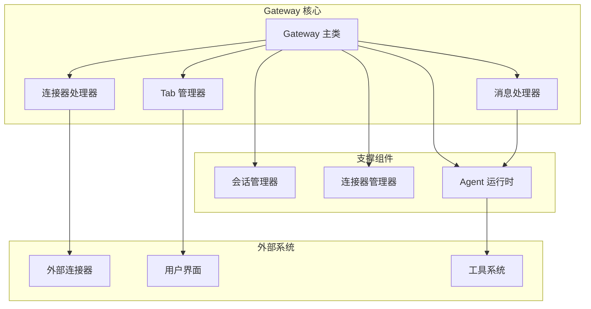
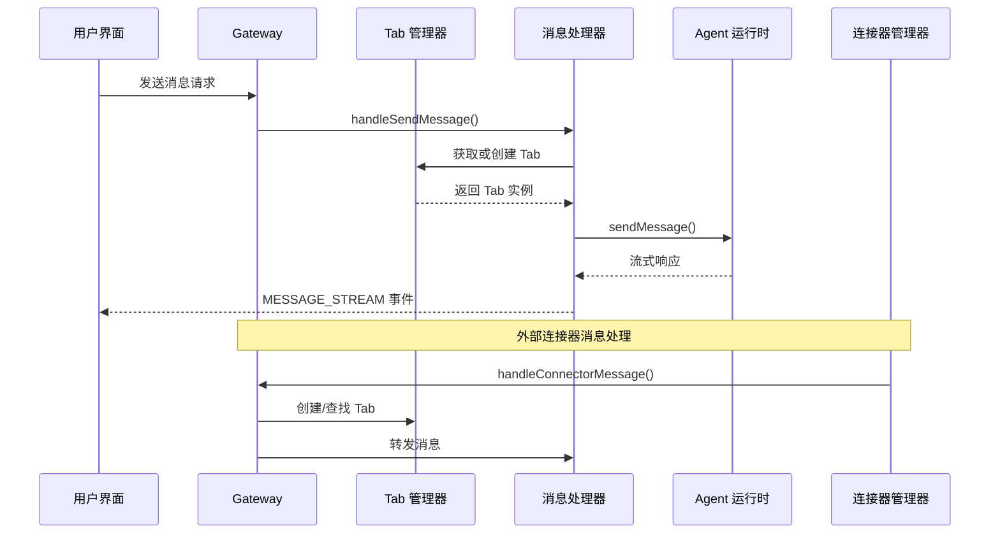
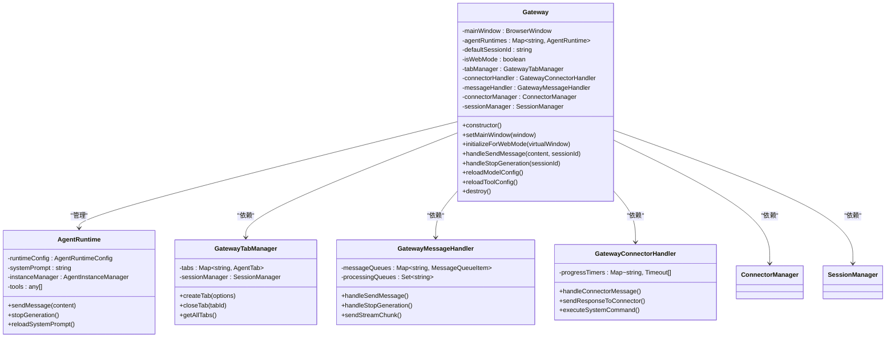
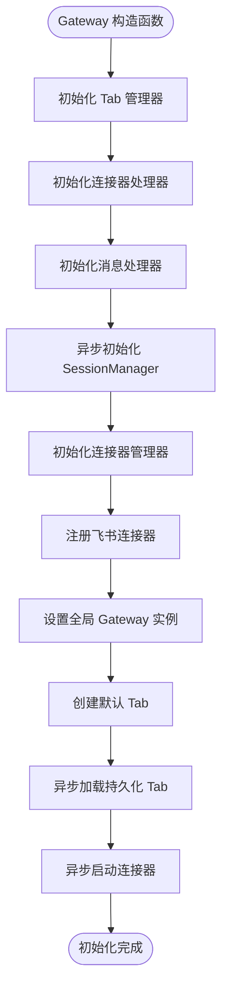
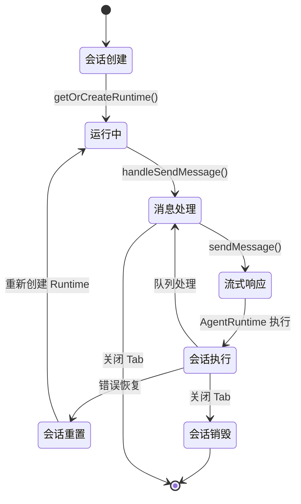
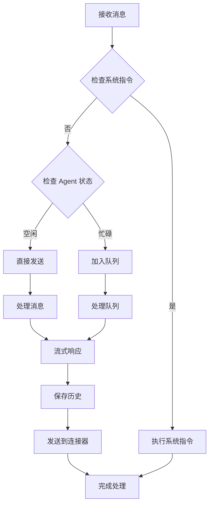
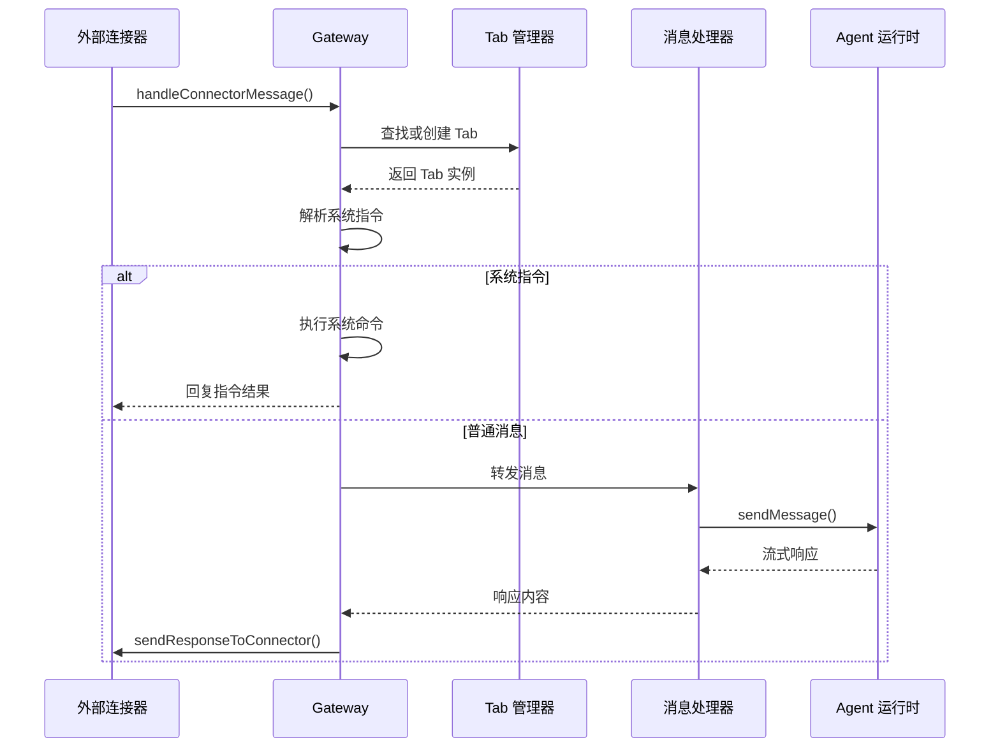
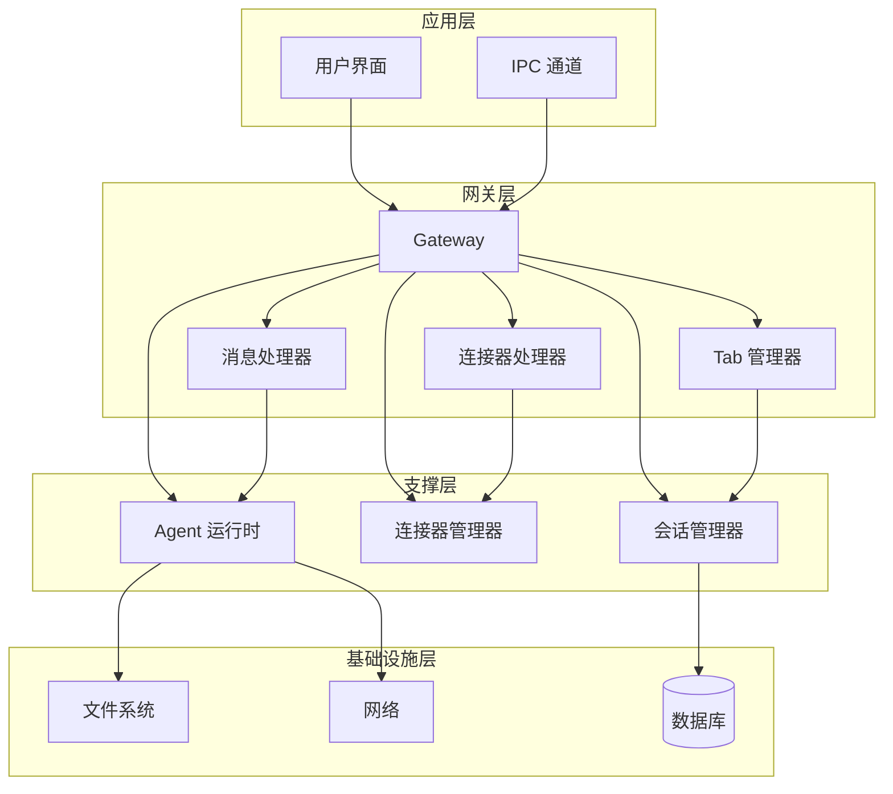

# Gateway 网关系统

<cite>
**本文档引用的文件**
- [gateway.ts](file://src/main/gateway.ts)
- [gateway-connector.ts](file://src/main/gateway-connector.ts)
- [gateway-tab.ts](file://src/main/gateway-tab.ts)
- [gateway-message.ts](file://src/main/gateway-message.ts)
- [session-manager.ts](file://src/main/session/session-manager.ts)
- [connector-manager.ts](file://src/main/connectors/connector-manager.ts)
- [agent-runtime.ts](file://src/main/agent-runtime/agent-runtime.ts)
- [index.ts](file://src/main/index.ts)
- [connector.ts](file://src/types/connector.ts)
- [ipc.ts](file://src/types/ipc.ts)
- [README.md](file://README.md)
</cite>

## 目录
1. [简介](#简介)
2. [项目结构](#项目结构)
3. [核心组件](#核心组件)
4. [架构概览](#架构概览)
5. [详细组件分析](#详细组件分析)
6. [依赖关系分析](#依赖关系分析)
7. [性能考虑](#性能考虑)
8. [故障排除指南](#故障排除指南)
9. [结论](#结论)

## 简介

DeepBot Gateway 网关系统是 DeepBot AI 助手的核心枢纽，负责管理多会话生命周期、路由消息到 Agent Runtime、处理流式响应以及管理连接器系统。该系统采用模块化架构设计，支持每个 Tab 对应一个独立的 Agent Runtime 实例，实现了真正的多 Agent 协作模式。

Gateway 系统的核心职责包括：
- 会话生命周期管理（每个 Tab 一个会话）
- 消息路由和分发
- 流式响应处理
- 连接器集成和消息桥接
- 跨 Tab 消息路由
- 系统提示词动态管理

## 项目结构

Gateway 系统位于 DeepBot 项目的主进程代码中，采用清晰的模块化组织：

**图表来源**
- [gateway.ts:29-114](file://src/main/gateway.ts#L29-L114)
- [gateway-tab.ts:26-61](file://src/main/gateway-tab.ts#L26-L61)
- [gateway-message.ts:31-64](file://src/main/gateway-message.ts#L31-L64)

**章节来源**
- [gateway.ts:1-114](file://src/main/gateway.ts#L1-L114)
- [README.md:128-182](file://README.md#L128-L182)

## 核心组件

### Gateway 主类

Gateway 是整个系统的核心控制器，负责协调各个组件的协作关系。其主要特点包括：

- **会话管理**：维护每个 Tab 对应的 AgentRuntime 实例映射
- **依赖注入**：统一管理各处理器的依赖关系
- **生命周期控制**：管理 AgentRuntime 的创建、销毁和重置
- **配置管理**：处理模型配置、工具配置的重新加载

### Tab 管理器

负责管理所有 Tab 的生命周期，包括创建、关闭、持久化和历史加载。每个 Tab 都有独立的状态和消息历史。

### 消息处理器

专门处理用户消息的发送和接收，支持消息队列、流式响应和错误处理机制。

### 连接器处理器

处理来自外部连接器（如飞书）的消息，支持系统指令解析、消息队列和进度提醒功能。

**章节来源**
- [gateway.ts:29-114](file://src/main/gateway.ts#L29-L114)
- [gateway-tab.ts:26-61](file://src/main/gateway-tab.ts#L26-L61)
- [gateway-message.ts:31-64](file://src/main/gateway-message.ts#L31-L64)

## 架构概览

Gateway 系统采用分层架构设计，实现了高度解耦和模块化：

**图表来源**
- [gateway.ts:455-466](file://src/main/gateway.ts#L455-L466)
- [gateway-message.ts:76-160](file://src/main/gateway-message.ts#L76-L160)
- [gateway-connector.ts:100-296](file://src/main/gateway-connector.ts#L100-L296)

**章节来源**
- [gateway.ts:455-523](file://src/main/gateway.ts#L455-L523)
- [gateway-connector.ts:100-296](file://src/main/gateway-connector.ts#L100-L296)

## 详细组件分析

### Gateway 类实现详解

Gateway 类是整个系统的核心控制器，采用了工厂模式和依赖注入的设计模式：

**图表来源**
- [gateway.ts:29-114](file://src/main/gateway.ts#L29-L114)
- [agent-runtime.ts:27-800](file://src/main/agent-runtime/agent-runtime.ts#L27-L800)
- [gateway-tab.ts:26-796](file://src/main/gateway-tab.ts#L26-L796)
- [gateway-message.ts:31-525](file://src/main/gateway-message.ts#L31-L525)
- [gateway-connector.ts:44-813](file://src/main/gateway-connector.ts#L44-L813)

#### 初始化流程

Gateway 的初始化过程体现了延迟加载和异步处理的设计理念：

**图表来源**
- [gateway.ts:53-114](file://src/main/gateway.ts#L53-L114)
- [gateway.ts:129-185](file://src/main/gateway.ts#L129-L185)

**章节来源**
- [gateway.ts:53-114](file://src/main/gateway.ts#L53-L114)
- [gateway.ts:129-185](file://src/main/gateway.ts#L129-L185)

### 会话管理机制

Gateway 采用每个 Tab 一个会话的设计模式，实现了真正的多会话并发处理：

**图表来源**
- [gateway.ts:430-450](file://src/main/gateway.ts#L430-L450)
- [gateway.ts:503-514](file://src/main/gateway.ts#L503-L514)

#### 会话生命周期管理

会话管理涉及多个层面的生命周期控制：

1. **创建阶段**：通过 `getOrCreateRuntime()` 方法创建新的 AgentRuntime 实例
2. **执行阶段**：处理用户消息，支持流式响应和队列管理
3. **重置阶段**：在错误发生时自动重置 AgentRuntime
4. **销毁阶段**：清理资源和内存

**章节来源**
- [gateway.ts:430-514](file://src/main/gateway.ts#L430-L514)

### 消息路由处理流程

消息处理流程体现了 Gateway 的核心功能，支持多种消息类型和处理模式：

**图表来源**
- [gateway-message.ts:76-160](file://src/main/gateway-message.ts#L76-L160)
- [gateway-message.ts:376-473](file://src/main/gateway-message.ts#L376-L473)

**章节来源**
- [gateway-message.ts:76-160](file://src/main/gateway-message.ts#L76-L160)
- [gateway-message.ts:376-473](file://src/main/gateway-message.ts#L376-L473)

### 连接器集成机制

Gateway 通过连接器处理器实现了对外部系统的无缝集成：

**图表来源**
- [gateway-connector.ts:100-296](file://src/main/gateway-connector.ts#L100-L296)
- [gateway-connector.ts:428-483](file://src/main/gateway-connector.ts#L428-L483)

**章节来源**
- [gateway-connector.ts:100-296](file://src/main/gateway-connector.ts#L100-L296)
- [gateway-connector.ts:428-483](file://src/main/gateway-connector.ts#L428-L483)

## 依赖关系分析

Gateway 系统的依赖关系体现了清晰的分层架构：

**图表来源**
- [gateway.ts:29-114](file://src/main/gateway.ts#L29-L114)
- [connector-manager.ts:21-379](file://src/main/connectors/connector-manager.ts#L21-L379)

**章节来源**
- [gateway.ts:29-114](file://src/main/gateway.ts#L29-L114)
- [connector-manager.ts:21-379](file://src/main/connectors/connector-manager.ts#L21-L379)

### 组件耦合度分析

Gateway 系统在设计上实现了低耦合高内聚的特点：

- **Gateway 与组件**：通过依赖注入实现松耦合
- **组件间通信**：通过回调函数和事件机制
- **外部依赖**：通过接口抽象实现可替换性

## 性能考虑

### 内存管理

Gateway 系统采用了多项内存管理策略：

1. **延迟加载**：SessionManager 和连接器在需要时才初始化
2. **按需创建**：AgentRuntime 实例只在需要时创建
3. **资源清理**：Tab 关闭时自动清理相关资源

### 并发处理

系统支持多会话并发处理，通过以下机制保证性能：

1. **消息队列**：避免同时处理多个消息
2. **流式响应**：实时传输响应内容
3. **异步操作**：非阻塞的文件和网络操作

### 缓存策略

- **AI 连接缓存**：减少重复的连接建立
- **工具列表缓存**：避免重复的工具加载
- **系统提示词缓存**：动态更新但避免重复计算

## 故障排除指南

### 常见问题及解决方案

#### Agent 运行时异常

**症状**：Agent 运行时卡住或状态异常

**解决方案**：
1. 检查 Agent 状态：`isCurrentlyGenerating()`
2. 强制停止生成：`stopGeneration()`
3. 重置 Agent 实例
4. 清理状态残留

#### 消息处理超时

**症状**：消息长时间无响应

**解决方案**：
1. 检查网络连接
2. 验证 AI API 配置
3. 查看错误日志
4. 重试消息处理

#### 连接器问题

**症状**：外部连接器无法正常工作

**解决方案**：
1. 检查连接器配置
2. 验证认证信息
3. 查看健康检查状态
4. 重新启动连接器

**章节来源**
- [gateway.ts:537-564](file://src/main/gateway.ts#L537-L564)
- [gateway-message.ts:246-283](file://src/main/gateway-message.ts#L246-L283)
- [gateway-connector.ts:341-358](file://src/main/gateway-connector.ts#L341-L358)

## 结论

DeepBot Gateway 网关系统通过精心设计的架构实现了高效的多会话管理和消息路由功能。系统采用模块化设计，每个组件职责明确，通过依赖注入和回调机制实现了松耦合的架构。

关键优势包括：
- **可扩展性**：支持新的连接器和工具集成
- **稳定性**：完善的错误处理和自动恢复机制
- **性能**：流式响应和异步处理提升用户体验
- **安全性**：严格的路径白名单和权限控制

该系统为 DeepBot 的多 Agent 协作提供了坚实的基础，支持复杂的业务场景和企业级应用需求。