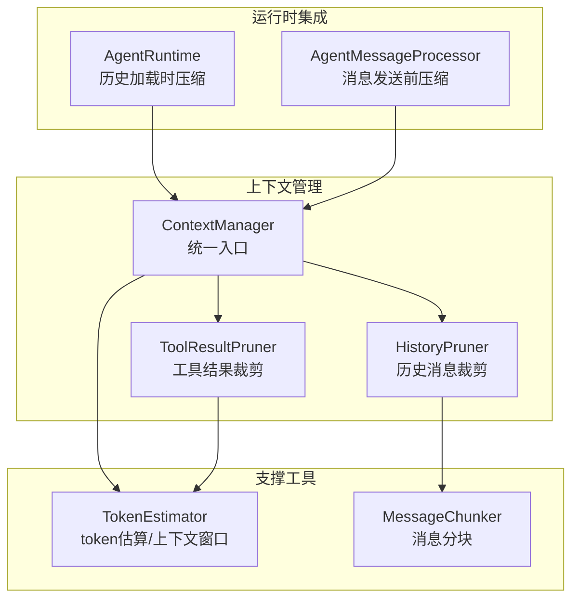
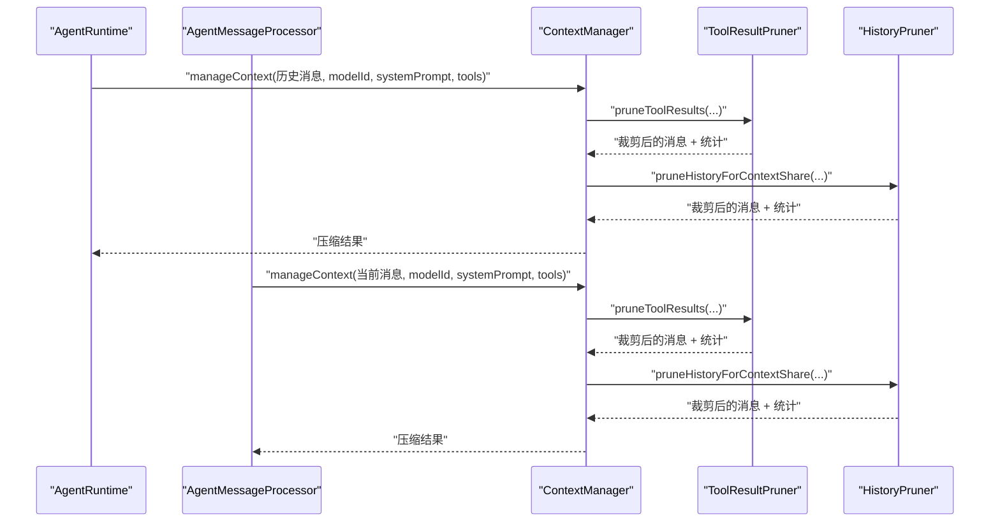
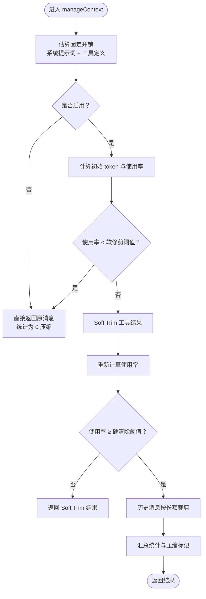
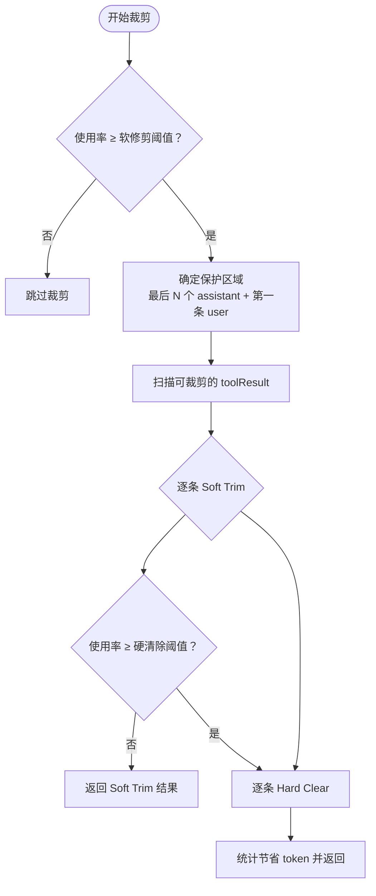
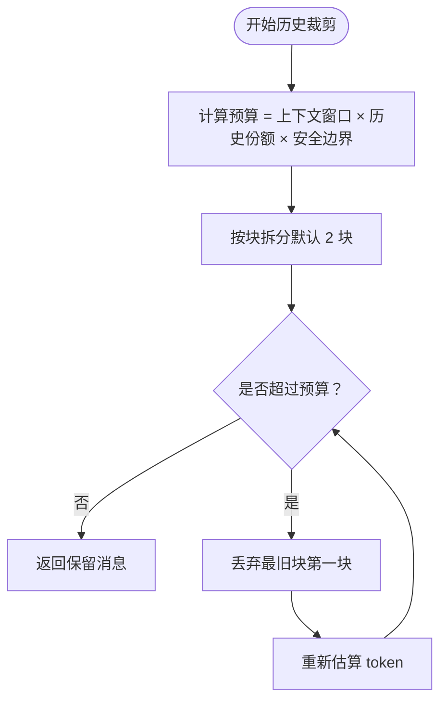
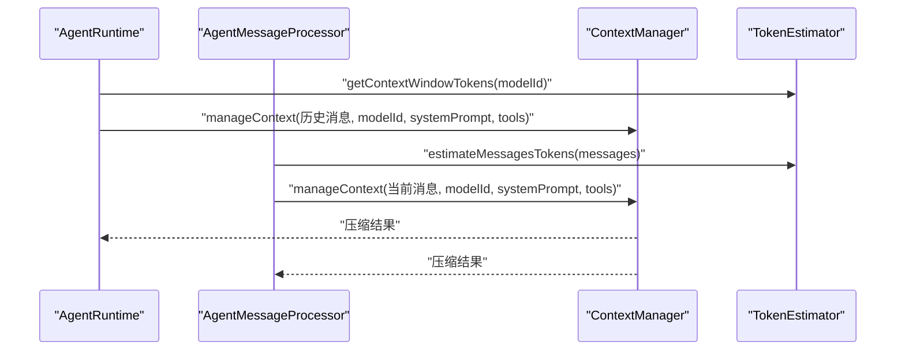
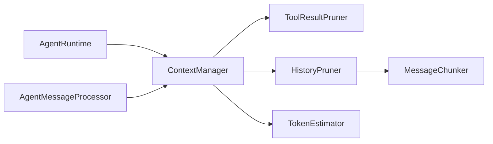

# 上下文管理系统

<cite>
**本文引用的文件**
- [context-manager.ts](file://src/main/context/context-manager.ts)
- [history-pruner.ts](file://src/main/context/history-pruner.ts)
- [tool-result-pruner.ts](file://src/main/context/tool-result-pruner.ts)
- [agent-runtime.ts](file://src/main/agent-runtime/agent-runtime.ts)
- [agent-message-processor.ts](file://src/main/agent-runtime/agent-message-processor.ts)
- [token-estimator.ts](file://src/main/utils/token-estimator.ts)
- [message-chunker.ts](file://src/main/utils/message-chunker.ts)
</cite>

## 目录
1. [简介](#简介)
2. [项目结构](#项目结构)
3. [核心组件](#核心组件)
4. [架构概览](#架构概览)
5. [详细组件分析](#详细组件分析)
6. [依赖关系分析](#依赖关系分析)
7. [性能考量](#性能考量)
8. [故障排查指南](#故障排查指南)
9. [结论](#结论)
10. [附录](#附录)

## 简介
本文件面向 史丽慧小助理 的上下文管理系统，系统性阐述上下文管理器的设计理念、历史修剪机制、工具结果修剪策略，并深入解析 ContextManager 类的实现细节（上下文状态维护、消息历史管理、内存优化策略）。文档还记录历史修剪器与工具结果修剪器的工作原理（修剪规则、阈值配置、清理策略），并提供配置与使用示例、与 Agent Runtime 的集成方式、性能影响评估以及优化建议与最佳实践。

## 项目结构
上下文管理相关代码位于 src/main/context 目录，核心文件如下：
- context-manager.ts：上下文管理器入口，负责统一协调工具结果裁剪与历史消息裁剪
- history-pruner.ts：历史消息裁剪器，支持按上下文份额、token 限制、智能保护等策略
- tool-result-pruner.ts：工具结果裁剪器，支持 Soft Trim 与 Hard Clear 两级策略

此外，上下文管理器与 Agent Runtime 的消息处理链路紧密集成，涉及：
- agent-runtime.ts：会话加载历史消息时调用上下文压缩
- agent-message-processor.ts：每次消息发送前调用上下文压缩
- token-estimator.ts：token 估算与上下文窗口查询
- message-chunker.ts：消息分块工具，用于历史裁剪的分块策略

图表来源
- [context-manager.ts:100-303](file://src/main/context/context-manager.ts#L100-L303)
- [history-pruner.ts:46-88](file://src/main/context/history-pruner.ts#L46-L88)
- [tool-result-pruner.ts:249-447](file://src/main/context/tool-result-pruner.ts#L249-L447)
- [agent-runtime.ts:281-299](file://src/main/agent-runtime/agent-runtime.ts#L281-L299)
- [agent-message-processor.ts:401-423](file://src/main/agent-runtime/agent-message-processor.ts#L401-L423)
- [token-estimator.ts:103-140](file://src/main/utils/token-estimator.ts#L103-L140)
- [message-chunker.ts:33-73](file://src/main/utils/message-chunker.ts#L33-L73)

章节来源
- [context-manager.ts:1-366](file://src/main/context/context-manager.ts#L1-L366)
- [history-pruner.ts:1-299](file://src/main/context/history-pruner.ts#L1-L299)
- [tool-result-pruner.ts:1-448](file://src/main/context/tool-result-pruner.ts#L1-L448)
- [agent-runtime.ts:236-308](file://src/main/agent-runtime/agent-runtime.ts#L236-L308)
- [agent-message-processor.ts:401-423](file://src/main/agent-runtime/agent-message-processor.ts#L401-L423)
- [token-estimator.ts:1-195](file://src/main/utils/token-estimator.ts#L1-L195)
- [message-chunker.ts:1-215](file://src/main/utils/message-chunker.ts#L1-L215)

## 核心组件
- 上下文管理器（ContextManager）
  - 统一入口，负责：
    - 估算上下文使用率（含系统提示词与工具定义的固定开销）
    - Soft Trim（工具结果头尾保留）与 Hard Clear（完全替换占位符）两级裁剪
    - 历史消息按上下文份额裁剪（分块丢弃最旧部分）
    - 输出压缩统计与是否压缩标记
- 工具结果裁剪器（ToolResultPruner）
  - 保护最后 N 个 assistant 消息，避免裁剪关键推理上下文
  - Soft Trim：对文本型工具结果保留头尾若干字符并附加说明
  - Hard Clear：对超阈值文本型工具结果替换为占位符
- 历史消息裁剪器（HistoryPruner）
  - 按上下文份额预算裁剪（默认最多保留历史占 50%）
  - 支持分块策略（默认 2 块），丢弃最旧块
  - 提供简单裁剪（直接丢弃最旧 N 条）、按 token 限制裁剪、智能裁剪（保护首条 user 与最后 N 条）

章节来源
- [context-manager.ts:27-87](file://src/main/context/context-manager.ts#L27-L87)
- [tool-result-pruner.ts:13-34](file://src/main/context/tool-result-pruner.ts#L13-L34)
- [history-pruner.ts:24-33](file://src/main/context/history-pruner.ts#L24-L33)

## 架构概览
上下文管理器在 Agent Runtime 的两个关键节点被调用：
- 历史加载：从会话加载最近对话后，调用 manageContext 进行压缩
- 消息发送：每次发送用户消息前，调用 manageContext 进行压缩

图表来源
- [agent-runtime.ts:281-299](file://src/main/agent-runtime/agent-runtime.ts#L281-L299)
- [agent-message-processor.ts:401-423](file://src/main/agent-runtime/agent-message-processor.ts#L401-L423)
- [context-manager.ts:100-303](file://src/main/context/context-manager.ts#L100-L303)
- [tool-result-pruner.ts:249-447](file://src/main/context/tool-result-pruner.ts#L249-L447)
- [history-pruner.ts:46-88](file://src/main/context/history-pruner.ts#L46-L88)

## 详细组件分析

### ContextManager 设计与实现
- 配置与默认值
  - enabled：是否启用上下文管理
  - pruning：工具结果裁剪配置（软修剪阈值、硬清除阈值、头尾字符、占位符、保护 assistant 数、最小可裁剪字符）
  - compaction：历史消息压缩配置（最大历史份额、预留 token）
- 固定开销估算
  - 系统提示词字符数估算
  - 工具定义字符数估算（名称、标签、描述、参数 JSON）
- 压缩流程
  - 若使用率低于软修剪阈值（默认 70%），不处理
  - 否则先进行工具结果 Soft Trim，再根据剩余使用率决定是否进行历史消息裁剪（硬清除阈值默认 85%）
  - 历史裁剪按上下文份额预算（默认 50%），分块丢弃最旧部分
- 统计输出
  - 压缩前后消息数、token 数、使用率
  - 工具结果裁剪统计（Soft、Hard、节省 token）
  - 历史裁剪统计（丢弃消息数、丢弃 token）
  - 总节省 token、上下文窗口

图表来源
- [context-manager.ts:100-303](file://src/main/context/context-manager.ts#L100-L303)

章节来源
- [context-manager.ts:27-46](file://src/main/context/context-manager.ts#L27-L46)
- [context-manager.ts:100-303](file://src/main/context/context-manager.ts#L100-L303)

### 工具结果裁剪器（ToolResultPruner）
- 保护策略
  - 保护最后 N 个 assistant 消息（默认 1），避免裁剪关键推理上下文
  - 保护第一条 user 消息（任务起始）
- Soft Trim
  - 仅对文本型工具结果生效（跳过含图片的结果）
  - 保留头尾若干字符，中间用省略号替代，并附加说明
  - 最小可裁剪字符阈值（默认 1000）
- Hard Clear
  - 对超过阈值的文本型工具结果替换为占位符
- 两阶段执行
  - 先 Soft Trim，再根据使用率决定是否继续 Hard Clear
  - 每一步都统计节省的 token 数

图表来源
- [tool-result-pruner.ts:249-447](file://src/main/context/tool-result-pruner.ts#L249-L447)

章节来源
- [tool-result-pruner.ts:13-34](file://src/main/context/tool-result-pruner.ts#L13-L34)
- [tool-result-pruner.ts:249-447](file://src/main/context/tool-result-pruner.ts#L249-L447)

### 历史消息裁剪器（HistoryPruner）
- 按上下文份额裁剪
  - 预算 = 上下文窗口 × 历史份额 × 安全边界（默认 1.2）
  - 分块策略：默认 2 块，丢弃最旧块（第一块）
- 简单裁剪
  - 直接丢弃最旧的 N 条消息
- 按 token 限制裁剪
  - 从后往前保留，直到达到 token 限制
- 智能裁剪
  - 保护第一条 user 消息与最后 N 条消息，中间消息按剩余预算选择性保留

图表来源
- [history-pruner.ts:46-88](file://src/main/context/history-pruner.ts#L46-L88)
- [message-chunker.ts:33-73](file://src/main/utils/message-chunker.ts#L33-L73)

章节来源
- [history-pruner.ts:46-88](file://src/main/context/history-pruner.ts#L46-L88)
- [history-pruner.ts:97-125](file://src/main/context/history-pruner.ts#L97-L125)
- [history-pruner.ts:136-180](file://src/main/context/history-pruner.ts#L136-L180)
- [history-pruner.ts:195-298](file://src/main/context/history-pruner.ts#L195-L298)
- [message-chunker.ts:33-73](file://src/main/utils/message-chunker.ts#L33-L73)

### 与 Agent Runtime 的集成
- 历史加载阶段
  - AgentRuntime 在加载最近对话后，调用 manageContext 对历史消息进行压缩
- 消息发送阶段
  - AgentMessageProcessor 在每次发送用户消息前，调用 manageContext 对当前上下文进行压缩
- 上下文窗口与 token 估算
  - 通过 token-estimator 获取上下文窗口与估算 token 数，确保压缩决策基于准确的上下文使用率

图表来源
- [agent-runtime.ts:281-299](file://src/main/agent-runtime/agent-runtime.ts#L281-L299)
- [agent-message-processor.ts:401-423](file://src/main/agent-runtime/agent-message-processor.ts#L401-L423)
- [token-estimator.ts:103-140](file://src/main/utils/token-estimator.ts#L103-L140)

章节来源
- [agent-runtime.ts:236-308](file://src/main/agent-runtime/agent-runtime.ts#L236-L308)
- [agent-message-processor.ts:401-423](file://src/main/agent-runtime/agent-message-processor.ts#L401-L423)
- [token-estimator.ts:103-140](file://src/main/utils/token-estimator.ts#L103-L140)

## 依赖关系分析
- ContextManager 依赖
  - token-estimator：估算消息 token、上下文窗口、使用率
  - tool-result-pruner：工具结果 Soft Trim/Hard Clear
  - history-pruner：历史消息按份额裁剪
- 历史裁剪器依赖
  - message-chunker：按 token 份额分块
- 运行时集成
  - AgentRuntime：历史加载后压缩
  - AgentMessageProcessor：消息发送前压缩

图表来源
- [context-manager.ts:8-22](file://src/main/context/context-manager.ts#L8-L22)
- [history-pruner.ts:7-9](file://src/main/context/history-pruner.ts#L7-L9)
- [tool-result-pruner.ts:7-8](file://src/main/context/tool-result-pruner.ts#L7-L8)
- [message-chunker.ts:7-8](file://src/main/utils/message-chunker.ts#L7-L8)
- [agent-runtime.ts:281-299](file://src/main/agent-runtime/agent-runtime.ts#L281-L299)
- [agent-message-processor.ts:401-423](file://src/main/agent-runtime/agent-message-processor.ts#L401-L423)

章节来源
- [context-manager.ts:8-22](file://src/main/context/context-manager.ts#L8-L22)
- [history-pruner.ts:7-9](file://src/main/context/history-pruner.ts#L7-L9)
- [tool-result-pruner.ts:7-8](file://src/main/context/tool-result-pruner.ts#L7-L8)
- [message-chunker.ts:7-8](file://src/main/utils/message-chunker.ts#L7-L8)
- [agent-runtime.ts:281-299](file://src/main/agent-runtime/agent-runtime.ts#L281-L299)
- [agent-message-processor.ts:401-423](file://src/main/agent-runtime/agent-message-processor.ts#L401-L423)

## 性能考量
- Token 估算与上下文窗口
  - 估算采用字符数与平均 token 比例，图片按固定估算；上下文窗口优先来自数据库配置，否则按模型 ID 推断
- 压缩策略的代价
  - Soft Trim：对文本进行字符串拼接与截取，成本较低
  - Hard Clear：替换为占位符，成本极低
  - 历史裁剪：分块与 token 估算，成本与消息数量和分块数相关
- 阈值与安全边界
  - 软修剪阈值 70%、硬清除阈值 85%，配合 20% 安全边界，避免频繁裁剪
- 保护策略
  - 保护最后 N 个 assistant 消息与第一条 user 消息，减少重复推理导致的性能浪费
- 运行时集成点
  - 历史加载与消息发送前两次压缩，确保上下文稳定在安全范围内

[本节为通用性能讨论，不直接分析具体文件]

## 故障排查指南
- 压缩未生效
  - 检查上下文使用率是否低于软修剪阈值（默认 70%）
  - 确认系统提示词与工具定义是否正确传入
- 历史消息被过度裁剪
  - 调整历史份额预算（默认 50%）与分块数（默认 2）
  - 使用智能裁剪保护策略，确保关键消息不被裁剪
- 工具结果未被裁剪
  - 检查工具结果是否包含图片（图片结果会被跳过）
  - 调整最小可裁剪字符阈值（默认 1000）
- 性能问题
  - 减少工具结果长度或数量
  - 适当提高软修剪阈值，减少 Soft Trim 次数
  - 控制消息轮次，避免过多历史消息

章节来源
- [context-manager.ts:191-214](file://src/main/context/context-manager.ts#L191-L214)
- [history-pruner.ts:46-88](file://src/main/context/history-pruner.ts#L46-L88)
- [tool-result-pruner.ts:249-447](file://src/main/context/tool-result-pruner.ts#L249-L447)

## 结论
上下文管理系统通过 ContextManager 将工具结果裁剪与历史消息裁剪有机结合，形成“软修剪—硬清除—历史份额裁剪”的三级压缩策略。该策略在保证推理质量的前提下，有效控制上下文规模，提升系统稳定性与性能。与 Agent Runtime 的集成确保在历史加载与消息发送两个关键节点都能及时压缩上下文，避免越界。通过合理配置阈值与保护策略，可在不同场景下取得最佳平衡。

[本节为总结性内容，不直接分析具体文件]

## 附录

### 配置与使用示例（路径指引）
- 上下文管理器默认配置
  - [默认配置定义:39-46](file://src/main/context/context-manager.ts#L39-L46)
- 工具结果裁剪默认配置
  - [默认裁剪配置:26-34](file://src/main/context/tool-result-pruner.ts#L26-L34)
- 历史消息裁剪默认配置
  - [历史裁剪参数:52-53](file://src/main/context/history-pruner.ts#L52-L53)
- 上下文窗口与 token 估算
  - [上下文窗口查询:121-140](file://src/main/utils/token-estimator.ts#L121-L140)
  - [消息 token 估算:103-107](file://src/main/utils/token-estimator.ts#L103-L107)
- 消息分块工具
  - [按 token 份额分块:33-73](file://src/main/utils/message-chunker.ts#L33-L73)

### 代码示例（路径指引）
- 在 AgentRuntime 历史加载后调用上下文压缩
  - [历史加载压缩调用:281-299](file://src/main/agent-runtime/agent-runtime.ts#L281-L299)
- 在 AgentMessageProcessor 消息发送前调用上下文压缩
  - [消息发送压缩调用:401-423](file://src/main/agent-runtime/agent-message-processor.ts#L401-L423)
- 获取压缩建议与是否需要压缩
  - [压缩建议:329-365](file://src/main/context/context-manager.ts#L329-L365)
  - [是否需要压缩:313-320](file://src/main/context/context-manager.ts#L313-L320)

### 最佳实践与优化建议
- 阈值调优
  - 根据模型上下文窗口与任务复杂度调整软修剪阈值（默认 70%）与硬清除阈值（默认 85%）
- 历史份额与分块
  - 历史份额预算默认 50%，安全边界 20%；可根据对话轮次调整分块数（默认 2）
- 保护策略
  - 适当增加保护的 assistant 消息数量，避免关键推理被裁剪
- 工具结果优化
  - 控制工具结果长度，减少 Soft Trim 次数
  - 对图片类工具结果，考虑改用摘要或链接，避免占用大量 token
- 运行时集成
  - 在历史加载与消息发送前均进行压缩，确保上下文稳定

[本节为通用指导，不直接分析具体文件]