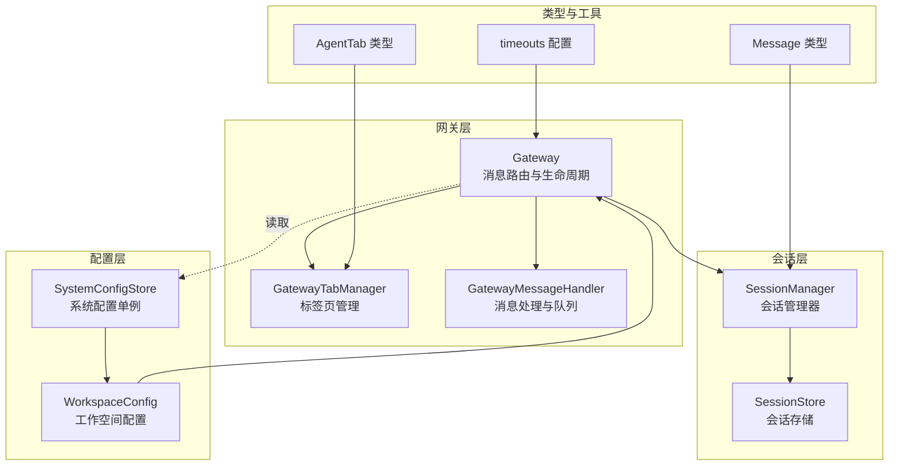
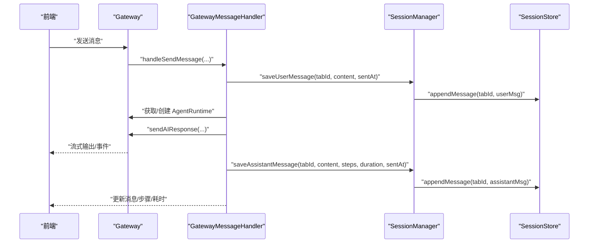
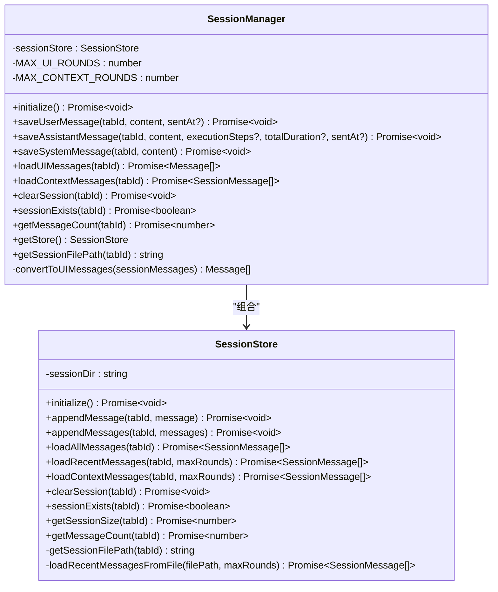
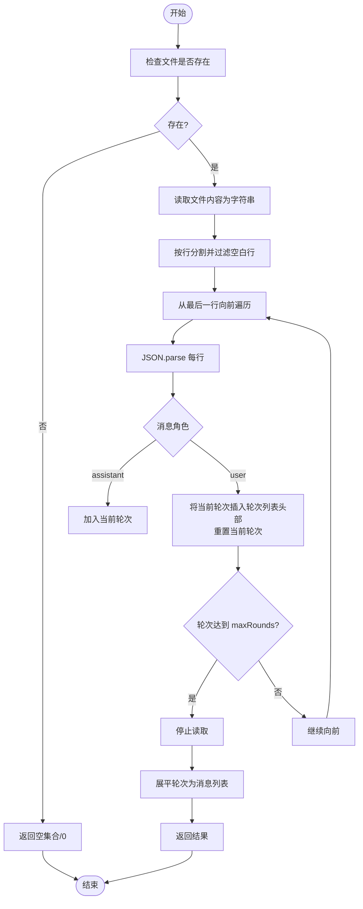
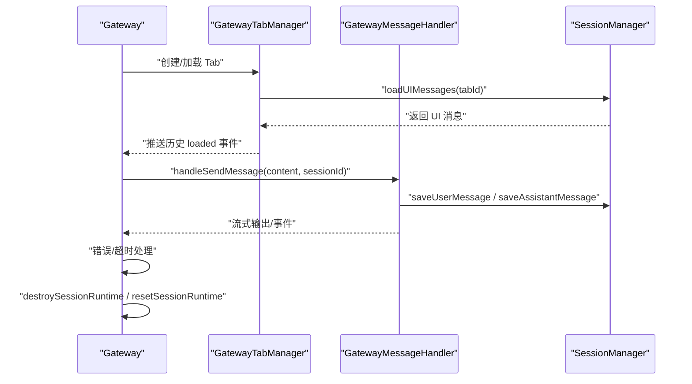
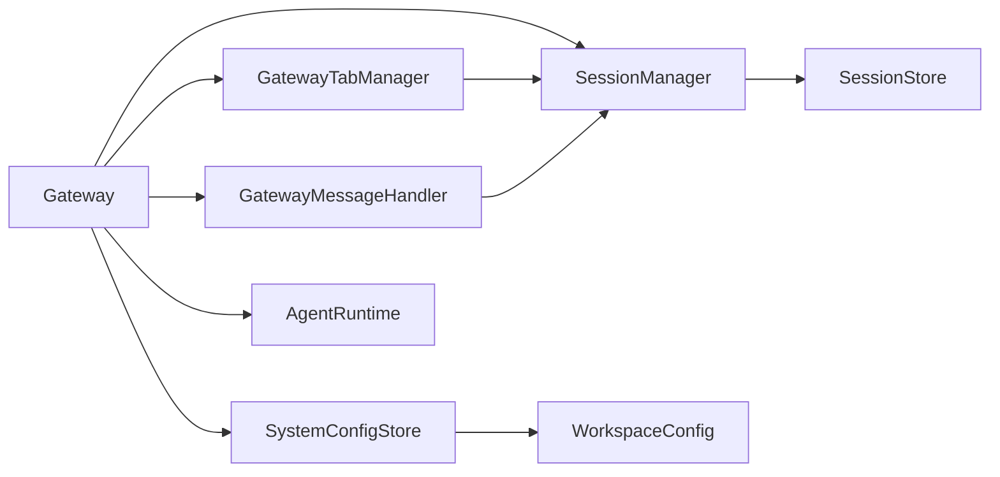
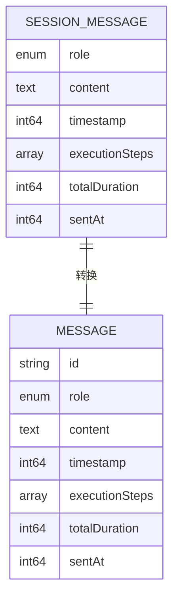

# 会话管理系统

<cite>
**本文引用的文件**
- [src/main/session/session-manager.ts](file://src/main/session/session-manager.ts)
- [src/main/session/session-store.ts](file://src/main/session/session-store.ts)
- [src/main/session/index.ts](file://src/main/session/index.ts)
- [src/main/gateway.ts](file://src/main/gateway.ts)
- [src/main/gateway-tab.ts](file://src/main/gateway-tab.ts)
- [src/main/gateway-message.ts](file://src/main/gateway-message.ts)
- [src/main/database/system-config-store.ts](file://src/main/database/system-config-store.ts)
- [src/main/database/workspace-config.ts](file://src/main/database/workspace-config.ts)
- [src/types/message.ts](file://src/types/message.ts)
- [src/types/agent-tab.ts](file://src/types/agent-tab.ts)
- [src/main/config/timeouts.ts](file://src/main/config/timeouts.ts)
</cite>

## 目录
1. [简介](#简介)
2. [项目结构](#项目结构)
3. [核心组件](#核心组件)
4. [架构总览](#架构总览)
5. [详细组件分析](#详细组件分析)
6. [依赖分析](#依赖分析)
7. [性能考量](#性能考量)
8. [故障排查指南](#故障排查指南)
9. [结论](#结论)
10. [附录](#附录)

## 简介
本文件面向 史丽慧小助理 的会话管理系统，围绕 SessionManager 与 SessionStore 的架构设计、会话存储机制、生命周期管理策略进行深入技术说明。文档覆盖会话创建、状态维护、资源清理流程；记录会话存储的数据结构、持久化策略与并发访问控制；提供会话状态管理、过期处理与恢复的实践建议；解释会话系统与 Gateway、标签页管理的协作关系，并给出性能优化、故障恢复与安全配置指南。

## 项目结构
会话管理相关代码位于 src/main/session，配合 Gateway、GatewayTab、GatewayMessage 等模块协同工作，系统配置通过 SystemConfigStore 与 WorkspaceConfig 提供会话目录等关键参数。

图表来源
- [src/main/session/session-manager.ts:17-193](file://src/main/session/session-manager.ts#L17-L193)
- [src/main/session/session-store.ts:46-321](file://src/main/session/session-store.ts#L46-L321)
- [src/main/gateway.ts:29-147](file://src/main/gateway.ts#L29-L147)
- [src/main/gateway-tab.ts:26-796](file://src/main/gateway-tab.ts#L26-L796)
- [src/main/gateway-message.ts:31-200](file://src/main/gateway-message.ts#L31-L200)
- [src/main/database/system-config-store.ts:37-70](file://src/main/database/system-config-store.ts#L37-L70)
- [src/main/database/workspace-config.ts:17-89](file://src/main/database/workspace-config.ts#L17-L89)
- [src/types/message.ts:49-70](file://src/types/message.ts#L49-L70)
- [src/types/agent-tab.ts:23-46](file://src/types/agent-tab.ts#L23-L46)
- [src/main/config/timeouts.ts:44-53](file://src/main/config/timeouts.ts#L44-L53)

章节来源
- [src/main/session/session-manager.ts:1-195](file://src/main/session/session-manager.ts#L1-L195)
- [src/main/session/session-store.ts:1-323](file://src/main/session/session-store.ts#L1-L323)
- [src/main/gateway.ts:1-772](file://src/main/gateway.ts#L1-L772)
- [src/main/gateway-tab.ts:1-796](file://src/main/gateway-tab.ts#L1-L796)
- [src/main/gateway-message.ts:1-525](file://src/main/gateway-message.ts#L1-L525)
- [src/main/database/system-config-store.ts:1-200](file://src/main/database/system-config-store.ts#L1-L200)
- [src/main/database/workspace-config.ts:1-219](file://src/main/database/workspace-config.ts#L1-L219)
- [src/types/message.ts:1-80](file://src/types/message.ts#L1-L80)
- [src/types/agent-tab.ts:1-87](file://src/types/agent-tab.ts#L1-L87)
- [src/main/config/timeouts.ts:1-53](file://src/main/config/timeouts.ts#L1-L53)

## 核心组件
- SessionManager：封装对 SessionStore 的高层操作，提供用户消息、AI 响应、系统消息的保存，以及 UI 显示与 Agent 上下文的消息加载接口；负责将底层 SessionMessage 转换为 UI Message。
- SessionStore：负责每个 Tab 的对话历史持久化（JSONL 格式），提供追加、批量追加、最近消息加载、清空、存在性检查、文件大小与消息计数查询等能力；采用倒序读取优化最近消息加载性能。
- Gateway：会话生命周期与消息路由的核心协调者，负责初始化 SessionManager、注入依赖、管理 AgentRuntime、处理消息队列与流式输出、重置与销毁会话运行时。
- GatewayTabManager：标签页生命周期管理，负责 Tab 创建、关闭、持久化、历史加载与欢迎消息策略，与 SessionManager 协作恢复会话历史。
- GatewayMessageHandler：消息处理与队列管理，负责命令识别、消息入队、AI 响应流式输出、错误恢复与自动重置。
- SystemConfigStore/WorkspaceConfig：提供会话目录等工作空间配置，Gateway 在初始化时读取并驱动 SessionManager。

章节来源
- [src/main/session/session-manager.ts:17-193](file://src/main/session/session-manager.ts#L17-L193)
- [src/main/session/session-store.ts:46-321](file://src/main/session/session-store.ts#L46-L321)
- [src/main/gateway.ts:29-147](file://src/main/gateway.ts#L29-L147)
- [src/main/gateway-tab.ts:26-796](file://src/main/gateway-tab.ts#L26-L796)
- [src/main/gateway-message.ts:31-200](file://src/main/gateway-message.ts#L31-L200)
- [src/main/database/system-config-store.ts:37-70](file://src/main/database/system-config-store.ts#L37-L70)
- [src/main/database/workspace-config.ts:17-89](file://src/main/database/workspace-config.ts#L17-L89)

## 架构总览
会话系统采用“分层解耦”设计：
- 会话存储层：以 JSONL 文本行形式按 Tab 分割存储，保证简单可靠与高吞吐。
- 会话管理层：对存储层进行语义抽象，提供消息转换、UI/上下文加载等接口。
- 网关层：编排会话生命周期、消息路由、运行时管理与错误恢复。
- 配置层：集中管理会话目录等关键参数，支持动态重载。

图表来源
- [src/main/gateway.ts:455-466](file://src/main/gateway.ts#L455-L466)
- [src/main/gateway-message.ts:76-160](file://src/main/gateway-message.ts#L76-L160)
- [src/main/session/session-manager.ts:38-98](file://src/main/session/session-manager.ts#L38-L98)
- [src/main/session/session-store.ts:75-100](file://src/main/session/session-store.ts#L75-L100)

## 详细组件分析

### SessionManager 类实现
职责与接口要点：
- 初始化：委托 SessionStore 初始化会话目录。
- 消息保存：
  - 用户消息：保存 role=user、content、timestamp、sentAt。
  - AI 响应：保存 role=assistant、content、timestamp、executionSteps、totalDuration、sentAt。
  - 系统消息：保存 role=system、content、timestamp。
- 消息加载：
  - UI 显示：加载最近 maxRounds=100 轮消息，转换为 UI Message（过滤系统指令/提示）。
  - Agent 上下文：加载最近 maxRounds=10 轮消息，用于上下文窗口。
- 资源管理：清空会话、存在性检查、消息计数查询、获取底层 SessionStore 实例、构造会话文件路径。

图表来源
- [src/main/session/session-manager.ts:17-193](file://src/main/session/session-manager.ts#L17-L193)
- [src/main/session/session-store.ts:46-321](file://src/main/session/session-store.ts#L46-L321)

章节来源
- [src/main/session/session-manager.ts:17-193](file://src/main/session/session-manager.ts#L17-L193)
- [src/main/session/session-store.ts:46-321](file://src/main/session/session-store.ts#L46-L321)

### SessionStore 数据结构与持久化策略
- 数据结构：SessionMessage，包含 role、content、timestamp、可选 executionSteps、totalDuration、sentAt。
- 持久化格式：每个 Tab 一个 .jsonl 文件，每行一条 JSON 对象，文本编码为 UTF-8。
- 关键能力：
  - 追加与批量追加：使用 fs.appendFile 写入。
  - 最近消息加载：倒序读取文件，自末尾向前解析，按 user+assistant 轮次聚合，达到 maxRounds 后停止，避免全文件扫描。
  - 清空与存在性：通过 fs.access 与 fs.unlink 实现。
  - 计数与大小：通过 fs.stat 与行数统计实现。

图表来源
- [src/main/session/session-store.ts:179-217](file://src/main/session/session-store.ts#L179-L217)

章节来源
- [src/main/session/session-store.ts:19-41](file://src/main/session/session-store.ts#L19-L41)
- [src/main/session/session-store.ts:146-217](file://src/main/session/session-store.ts#L146-L217)
- [src/main/session/session-store.ts:230-247](file://src/main/session/session-store.ts#L230-L247)
- [src/main/session/session-store.ts:252-267](file://src/main/session/session-store.ts#L252-L267)
- [src/main/session/session-store.ts:272-280](file://src/main/session/session-store.ts#L272-L280)
- [src/main/session/session-store.ts:285-293](file://src/main/session/session-store.ts#L285-L293)
- [src/main/session/session-store.ts:300-320](file://src/main/session/session-store.ts#L300-L320)

### 会话生命周期管理策略
- 创建：Gateway 在首次使用某 sessionId 时通过 getOrCreateRuntime 创建对应 AgentRuntime；SessionManager 与 SessionStore 通过工作空间配置中的 sessionDir 管理会话文件。
- 加载：GatewayTabManager 在 Tab 激活或恢复时调用 SessionManager.loadUIMessages 加载历史；默认 Tab 在欢迎消息策略下决定是否发送欢迎内容。
- 运行时重置：Gateway 提供延迟重置机制，结合 GatewayMessageHandler 的错误恢复，必要时销毁并重建 AgentRuntime。
- 清理：关闭 Tab 时销毁对应 AgentRuntime、删除 Tab 的 memory 文件，并清空会话文件；支持清空指定会话。

图表来源
- [src/main/gateway-tab.ts:394-417](file://src/main/gateway-tab.ts#L394-L417)
- [src/main/gateway-message.ts:76-160](file://src/main/gateway-message.ts#L76-L160)
- [src/main/gateway.ts:503-557](file://src/main/gateway.ts#L503-L557)

章节来源
- [src/main/gateway.ts:430-450](file://src/main/gateway.ts#L430-L450)
- [src/main/gateway.ts:503-557](file://src/main/gateway.ts#L503-L557)
- [src/main/gateway-tab.ts:394-417](file://src/main/gateway-tab.ts#L394-L417)
- [src/main/gateway-tab.ts:687-761](file://src/main/gateway-tab.ts#L687-L761)
- [src/main/gateway-message.ts:76-160](file://src/main/gateway-message.ts#L76-L160)

### 与 Gateway 的协作关系
- 依赖注入：Gateway 在初始化阶段读取 SystemConfigStore 的工作空间配置，创建 SessionManager 并将其注入到 Tab 管理器、消息处理器与连接器处理器。
- 会话目录动态重载：Gateway 提供 reloadSessionManager，重新初始化 SessionManager 并更新各处理器依赖。
- 运行时生命周期：Gateway 统一管理 AgentRuntime 的创建、销毁与重置，确保会话状态一致性。

章节来源
- [src/main/gateway.ts:129-147](file://src/main/gateway.ts#L129-L147)
- [src/main/gateway.ts:269-281](file://src/main/gateway.ts#L269-L281)
- [src/main/gateway.ts:430-450](file://src/main/gateway.ts#L430-L450)
- [src/main/gateway.ts:503-557](file://src/main/gateway.ts#L503-L557)

### 与标签页管理的集成
- Tab 创建：GatewayTabManager 生成唯一 tabId，根据类型与持久化策略决定是否写入数据库与创建 memory 文件；持久化 Tab 的历史在后台异步加载。
- 历史加载：Tab 激活或恢复时，Tab 管理器调用 SessionManager.loadUIMessages，将消息推送到前端。
- 关闭清理：关闭 Tab 时销毁 AgentRuntime、删除 memory 文件，并清空会话文件，同时从数据库删除持久化配置。

章节来源
- [src/main/gateway-tab.ts:492-611](file://src/main/gateway-tab.ts#L492-L611)
- [src/main/gateway-tab.ts:687-761](file://src/main/gateway-tab.ts#L687-L761)
- [src/main/gateway-tab.ts:394-417](file://src/main/gateway-tab.ts#L394-L417)

### 会话状态管理、过期与恢复
- 状态管理：SessionManager 负责消息的保存与加载；SessionStore 提供文件级存在性与计数能力；Gateway 通过 AgentRuntime 管理运行时状态。
- 过期策略：系统配置中定义了会话清理超时、归档间隔与扫描周期，Gateway 在合适时机触发清理与重载。
- 恢复流程：重启或刷新后，GatewayTabManager 通过 SessionManager.loadUIMessages 恢复历史；欢迎消息策略在无有效历史时触发。

章节来源
- [src/main/config/timeouts.ts:44-53](file://src/main/config/timeouts.ts#L44-L53)
- [src/main/gateway-tab.ts:137-183](file://src/main/gateway-tab.ts#L137-L183)
- [src/main/gateway-tab.ts:218-235](file://src/main/gateway-tab.ts#L218-L235)

## 依赖分析
- SessionManager 依赖 SessionStore 与错误处理工具。
- SessionStore 依赖文件系统、路径工具与目录创建工具。
- Gateway 依赖 SystemConfigStore、AgentRuntime、GatewayTabManager、GatewayMessageHandler、ConnectorManager 等。
- GatewayTabManager 依赖 SystemConfigStore、SessionManager、IPC 工具与数据库。
- GatewayMessageHandler 依赖 SessionManager、AgentRuntime 与错误处理工具。
- 配置层通过 SystemConfigStore 单例提供全局配置，Gateway 在初始化时读取并驱动 SessionManager。

图表来源
- [src/main/session/session-manager.ts:10-12](file://src/main/session/session-manager.ts#L10-L12)
- [src/main/session/session-store.ts:10-14](file://src/main/session/session-store.ts#L10-L14)
- [src/main/gateway.ts:24-27](file://src/main/gateway.ts#L24-L27)
- [src/main/gateway-tab.ts:20-21](file://src/main/gateway-tab.ts#L20-L21)
- [src/main/gateway-message.ts:18-18](file://src/main/gateway-message.ts#L18-L18)
- [src/main/database/system-config-store.ts:37-70](file://src/main/database/system-config-store.ts#L37-L70)
- [src/main/database/workspace-config.ts:51-89](file://src/main/database/workspace-config.ts#L51-L89)

章节来源
- [src/main/session/session-manager.ts:10-12](file://src/main/session/session-manager.ts#L10-L12)
- [src/main/session/session-store.ts:10-14](file://src/main/session/session-store.ts#L10-L14)
- [src/main/gateway.ts:24-27](file://src/main/gateway.ts#L24-L27)
- [src/main/gateway-tab.ts:20-21](file://src/main/gateway-tab.ts#L20-L21)
- [src/main/gateway-message.ts:18-18](file://src/main/gateway-message.ts#L18-L18)
- [src/main/database/system-config-store.ts:37-70](file://src/main/database/system-config-store.ts#L37-L70)
- [src/main/database/workspace-config.ts:51-89](file://src/main/database/workspace-config.ts#L51-L89)

## 性能考量
- 倒序读取优化：SessionStore 在加载最近消息时从文件末尾开始解析，遇到足够轮次即停止，避免全文件扫描。
- 行数统计优化：getMessageCount 仅统计行数而不解析 JSON，降低 IO 成本。
- 批量写入：appendMessages 支持批量追加，减少多次写入开销。
- 目录懒初始化：SessionStore.initialize 在首次使用时创建会话目录，避免不必要的初始化。
- 运行时重置延迟：Gateway 提供延迟重置，避免频繁销毁/重建带来的抖动。

章节来源
- [src/main/session/session-store.ts:146-165](file://src/main/session/session-store.ts#L146-L165)
- [src/main/session/session-store.ts:179-217](file://src/main/session/session-store.ts#L179-L217)
- [src/main/session/session-store.ts:230-247](file://src/main/session/session-store.ts#L230-L247)
- [src/main/session/session-store.ts:300-320](file://src/main/session/session-store.ts#L300-L320)
- [src/main/gateway.ts:239-245](file://src/main/gateway.ts#L239-L245)

## 故障排查指南
- 初始化失败：检查 SystemConfigStore 与 WorkspaceConfig 的 sessionDir 是否可写；确认 Gateway 初始化 SessionManager 的超时配置。
- 加载失败：查看 SessionStore.loadRecentMessages 的错误日志，确认文件存在性与权限；检查 JSONL 行是否完整。
- 写入失败：检查磁盘空间与权限；确认 SessionStore.appendMessage 的异常处理与重试策略。
- 运行时异常：GatewayMessageHandler 会在 AI 连接错误时尝试自动恢复，必要时调用 resetSessionRuntime；检查 AgentRuntime 的 destroy 与 recreate 流程。
- 欢迎消息未触发：确认 SessionManager.loadUIMessages 返回的历史是否为空或仅含系统消息；检查 Web 模式下的特殊分支。

章节来源
- [src/main/gateway.ts:129-147](file://src/main/gateway.ts#L129-L147)
- [src/main/gateway.ts:269-281](file://src/main/gateway.ts#L269-L281)
- [src/main/gateway-message.ts:142-160](file://src/main/gateway-message.ts#L142-L160)
- [src/main/gateway.ts:528-557](file://src/main/gateway.ts#L528-L557)
- [src/main/gateway-tab.ts:137-183](file://src/main/gateway-tab.ts#L137-L183)

## 结论
史丽慧小助理 的会话管理系统以 SessionManager/SessionStore 为核心，采用 JSONL 文件按 Tab 存储对话历史，结合 Gateway 的生命周期编排与 GatewayTab/GatewayMessage 的协同，实现了稳定、可扩展且高性能的会话管理。通过倒序读取、行数统计等优化手段，系统在大数据量场景下仍能保持良好性能；通过配置驱动与动态重载，满足不同部署环境的需求。

## 附录

### 会话数据模型

图表来源
- [src/main/session/session-store.ts:19-41](file://src/main/session/session-store.ts#L19-L41)
- [src/types/message.ts:49-70](file://src/types/message.ts#L49-L70)

### 会话目录配置与重载
- 会话目录来源：SystemConfigStore + WorkspaceConfig；Gateway 在初始化时读取并创建 SessionManager。
- 重载流程：Gateway.reloadSessionManager 重新初始化 SessionManager，并更新各处理器依赖。

章节来源
- [src/main/database/system-config-store.ts:37-70](file://src/main/database/system-config-store.ts#L37-L70)
- [src/main/database/workspace-config.ts:51-89](file://src/main/database/workspace-config.ts#L51-L89)
- [src/main/gateway.ts:129-147](file://src/main/gateway.ts#L129-L147)
- [src/main/gateway.ts:269-281](file://src/main/gateway.ts#L269-L281)