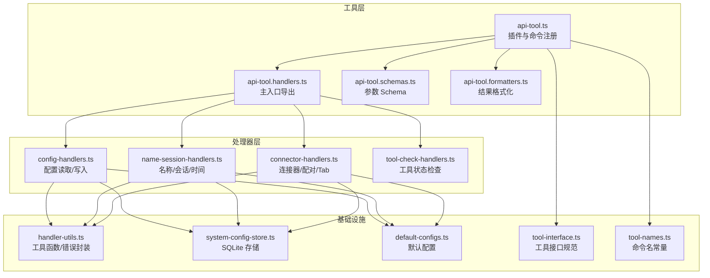
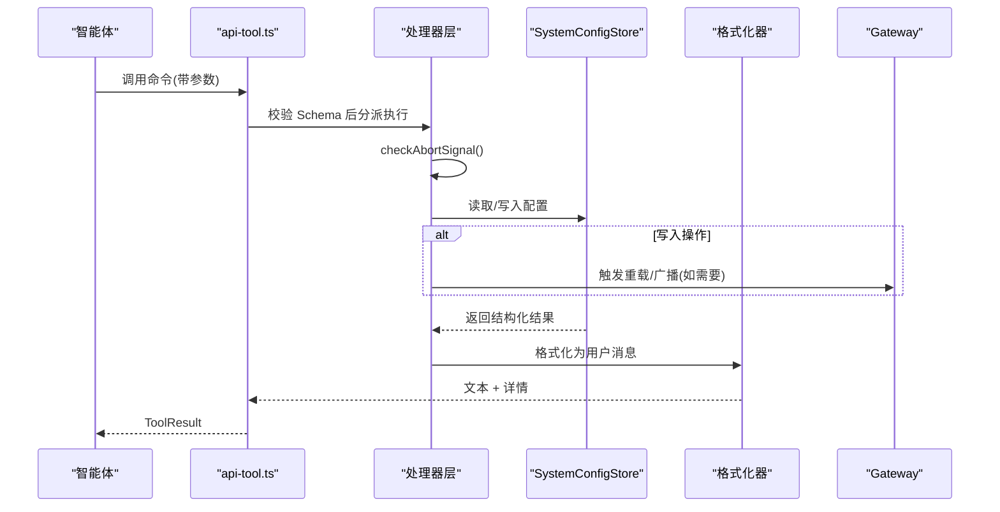
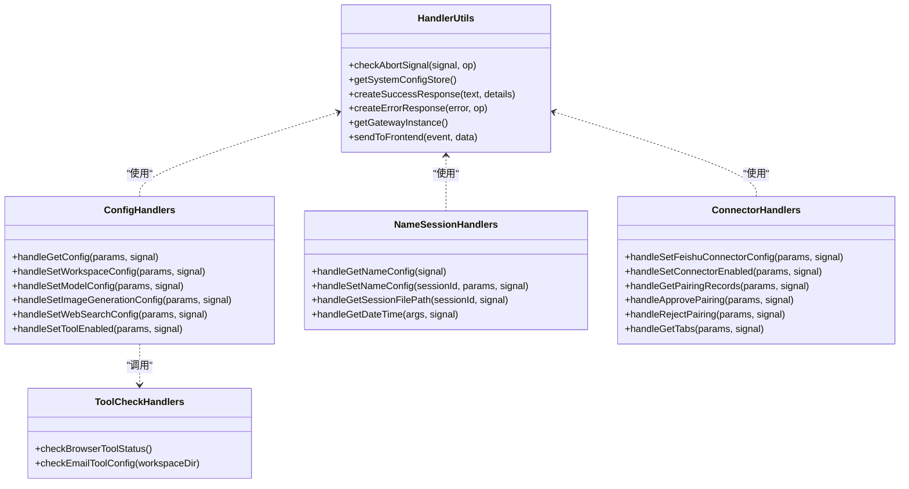
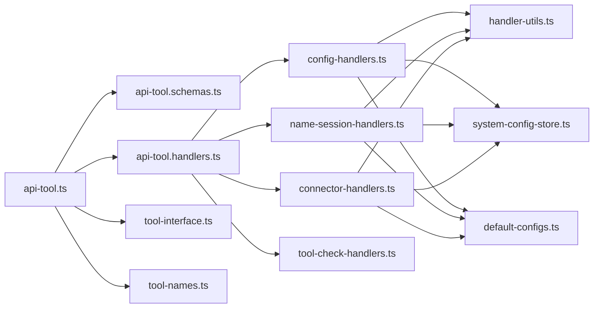

# API 工具系统

<cite>
**本文引用的文件**
- [api-tool.ts](file://src/main/tools/api-tool.ts)
- [api-tool.handlers.ts](file://src/main/tools/api-tool.handlers.ts)
- [api-tool.formatters.ts](file://src/main/tools/api-tool.formatters.ts)
- [api-tool.schemas.ts](file://src/main/tools/api-tool.schemas.ts)
- [config-handlers.ts](file://src/main/tools/handlers/config-handlers.ts)
- [connector-handlers.ts](file://src/main/tools/handlers/connector-handlers.ts)
- [name-session-handlers.ts](file://src/main/tools/handlers/name-session-handlers.ts)
- [tool-check-handlers.ts](file://src/main/tools/handlers/tool-check-handlers.ts)
- [handler-utils.ts](file://src/main/tools/handlers/handler-utils.ts)
- [tool-interface.ts](file://src/main/tools/registry/tool-interface.ts)
- [tool-names.ts](file://src/main/tools/tool-names.ts)
- [default-configs.ts](file://src/shared/config/default-configs.ts)
- [system-config-store.ts](file://src/main/database/system-config-store.ts)
- [tab-config.ts](file://src/main/database/tab-config.ts)
</cite>

## 目录
1. [简介](#简介)
2. [项目结构](#项目结构)
3. [核心组件](#核心组件)
4. [架构总览](#架构总览)
5. [详细组件分析](#详细组件分析)
6. [依赖关系分析](#依赖关系分析)
7. [性能考量](#性能考量)
8. [故障排查指南](#故障排查指南)
9. [结论](#结论)
10. [附录](#附录)

## 简介
本文件为 DeepBot API 工具系统的技术文档，聚焦于“系统配置访问”能力，涵盖 HTTP 请求处理、响应格式化、错误处理、模式验证与安全限制等核心机制。系统通过统一的工具插件接口暴露一组受控的系统配置读取与更新能力，确保在保证安全的前提下，允许智能体在受限范围内进行配置变更，并即时反馈结果。

## 项目结构
API 工具系统位于主进程工具目录，采用“插件 + 分层处理器 + 格式化器 + Schema 验证”的模块化设计：
- 插件入口：定义工具元数据、命令名与执行器
- 处理器层：按功能拆分（配置、名称/会话、连接器、工具检查）
- 格式化器：将结构化结果转为用户可读的消息
- Schema：基于 TypeBox 的参数校验
- 存储层：SystemConfigStore 提供 SQLite 持久化
- 工具接口：统一的 ToolPlugin 规范

图表来源
- [api-tool.ts:1-220](file://src/main/tools/api-tool.ts#L1-L220)
- [api-tool.handlers.ts:1-44](file://src/main/tools/api-tool.handlers.ts#L1-L44)
- [api-tool.schemas.ts:1-258](file://src/main/tools/api-tool.schemas.ts#L1-L258)
- [api-tool.formatters.ts:1-437](file://src/main/tools/api-tool.formatters.ts#L1-L437)
- [config-handlers.ts:1-322](file://src/main/tools/handlers/config-handlers.ts#L1-L322)
- [name-session-handlers.ts:1-361](file://src/main/tools/handlers/name-session-handlers.ts#L1-L361)
- [connector-handlers.ts:1-337](file://src/main/tools/handlers/connector-handlers.ts#L1-L337)
- [tool-check-handlers.ts:1-113](file://src/main/tools/handlers/tool-check-handlers.ts#L1-L113)
- [handler-utils.ts:1-90](file://src/main/tools/handlers/handler-utils.ts#L1-L90)
- [system-config-store.ts:1-200](file://src/main/database/system-config-store.ts#L1-L200)
- [default-configs.ts:1-133](file://src/shared/config/default-configs.ts#L1-L133)
- [tool-interface.ts:1-152](file://src/main/tools/registry/tool-interface.ts#L1-L152)
- [tool-names.ts:1-106](file://src/main/tools/tool-names.ts#L1-L106)

章节来源
- [api-tool.ts:1-220](file://src/main/tools/api-tool.ts#L1-L220)
- [api-tool.handlers.ts:1-44](file://src/main/tools/api-tool.handlers.ts#L1-L44)
- [api-tool.schemas.ts:1-258](file://src/main/tools/api-tool.schemas.ts#L1-L258)
- [api-tool.formatters.ts:1-437](file://src/main/tools/api-tool.formatters.ts#L1-L437)
- [config-handlers.ts:1-322](file://src/main/tools/handlers/config-handlers.ts#L1-L322)
- [name-session-handlers.ts:1-361](file://src/main/tools/handlers/name-session-handlers.ts#L1-L361)
- [connector-handlers.ts:1-337](file://src/main/tools/handlers/connector-handlers.ts#L1-L337)
- [tool-check-handlers.ts:1-113](file://src/main/tools/handlers/tool-check-handlers.ts#L1-L113)
- [handler-utils.ts:1-90](file://src/main/tools/handlers/handler-utils.ts#L1-L90)
- [system-config-store.ts:1-200](file://src/main/database/system-config-store.ts#L1-L200)
- [default-configs.ts:1-133](file://src/shared/config/default-configs.ts#L1-L133)
- [tool-interface.ts:1-152](file://src/main/tools/registry/tool-interface.ts#L1-L152)
- [tool-names.ts:1-106](file://src/main/tools/tool-names.ts#L1-L106)

## 核心组件
- 工具插件与命令注册：在插件入口集中声明工具元数据与所有可用命令，绑定对应的 Schema 与执行器。
- 处理器层：按功能域拆分，统一通过工具函数进行错误处理、AbortSignal 检查、存储访问与 Gateway 交互。
- Schema 验证：使用 TypeBox 定义严格的参数约束，覆盖枚举、可选字段、长度限制、正则表达式等。
- 结果格式化：将结构化数据转换为人类可读的消息，包含统计、分组、状态提示等。
- 存储与默认配置：SystemConfigStore 提供 SQLite 持久化，配合 default-configs 提供默认值与提供商预设。
- 安全与限制：只读查询与受控写入，写入需用户确认（通过交互流程体现），部分写入仅在重启后生效。

章节来源
- [api-tool.ts:25-220](file://src/main/tools/api-tool.ts#L25-L220)
- [api-tool.schemas.ts:7-258](file://src/main/tools/api-tool.schemas.ts#L7-L258)
- [api-tool.formatters.ts:1-437](file://src/main/tools/api-tool.formatters.ts#L1-L437)
- [config-handlers.ts:28-322](file://src/main/tools/handlers/config-handlers.ts#L28-L322)
- [name-session-handlers.ts:24-361](file://src/main/tools/handlers/name-session-handlers.ts#L24-L361)
- [connector-handlers.ts:23-337](file://src/main/tools/handlers/connector-handlers.ts#L23-L337)
- [handler-utils.ts:23-90](file://src/main/tools/handlers/handler-utils.ts#L23-L90)
- [system-config-store.ts:37-200](file://src/main/database/system-config-store.ts#L37-L200)
- [default-configs.ts:103-133](file://src/shared/config/default-configs.ts#L103-L133)

## 架构总览
API 工具系统遵循“插件注册—参数校验—处理器—存储—格式化—响应”的标准流水线，同时在关键节点进行安全与一致性控制。

图表来源
- [api-tool.ts:48-215](file://src/main/tools/api-tool.ts#L48-L215)
- [config-handlers.ts:32-83](file://src/main/tools/handlers/config-handlers.ts#L32-L83)
- [name-session-handlers.ts:27-45](file://src/main/tools/handlers/name-session-handlers.ts#L27-L45)
- [connector-handlers.ts:127-173](file://src/main/tools/handlers/connector-handlers.ts#L127-L173)
- [handler-utils.ts:26-64](file://src/main/tools/handlers/handler-utils.ts#L26-L64)
- [system-config-store.ts:65-77](file://src/main/database/system-config-store.ts#L65-L77)
- [api-tool.formatters.ts:10-121](file://src/main/tools/api-tool.formatters.ts#L10-L121)

## 详细组件分析

### 插件与命令注册（api-tool.ts）
- 元数据：包含 id、name、version、description、category、tags 等
- 命令清单：覆盖配置读取、模型/工具/连接器配置更新、名称/会话/时间、配对管理、Tab 查询等
- 执行器绑定：每个命令绑定对应处理器，参数使用对应 Schema 校验
- 会话隔离：通过 sessionId 区分主 Tab 与非主 Tab，影响名称更新的范围与行为

章节来源
- [api-tool.ts:25-220](file://src/main/tools/api-tool.ts#L25-L220)
- [tool-names.ts:8-94](file://src/main/tools/tool-names.ts#L8-L94)

### 参数 Schema（api-tool.schemas.ts）
- 配置读取：支持 workspace、model、image-generation、web-search、all
- 工作目录：支持多目录字段，可选择性更新
- 模型配置：提供多种提供商类型、API 地址、模型 ID、上下文窗口等
- 工具启用/禁用：针对内置工具（图片生成、Web 搜索、浏览器、日历）
- 连接器配置：飞书 App ID/Secret，可选启用
- 名称配置：智能体名称与用户称呼（长度限制）
- 日期时间：多种格式与可选时区
- 配对管理：配对码格式校验、用户 ID 校验

章节来源
- [api-tool.schemas.ts:12-258](file://src/main/tools/api-tool.schemas.ts#L12-L258)

### 处理器层（handlers）
- 统一工具函数：checkAbortSignal、createSuccessResponse、createErrorResponse、getSystemConfigStore、getGatewayInstance、sendToFrontend
- 配置处理器：获取/设置工作目录、模型、图片生成、Web 搜索、工具启用/禁用
- 名称/会话处理器：获取/设置名称、获取会话文件路径、获取日期时间
- 连接器处理器：设置飞书配置、启用/禁用连接器、获取配对记录、审核/拒绝配对、获取 Tab 列表
- 工具检查：浏览器工具状态检查

图表来源
- [handler-utils.ts:23-90](file://src/main/tools/handlers/handler-utils.ts#L23-L90)
- [config-handlers.ts:32-322](file://src/main/tools/handlers/config-handlers.ts#L32-L322)
- [name-session-handlers.ts:27-361](file://src/main/tools/handlers/name-session-handlers.ts#L27-L361)
- [connector-handlers.ts:26-337](file://src/main/tools/handlers/connector-handlers.ts#L26-L337)
- [tool-check-handlers.ts:11-113](file://src/main/tools/handlers/tool-check-handlers.ts#L11-L113)

章节来源
- [handler-utils.ts:23-90](file://src/main/tools/handlers/handler-utils.ts#L23-L90)
- [config-handlers.ts:32-322](file://src/main/tools/handlers/config-handlers.ts#L32-L322)
- [name-session-handlers.ts:27-361](file://src/main/tools/handlers/name-session-handlers.ts#L27-L361)
- [connector-handlers.ts:26-337](file://src/main/tools/handlers/connector-handlers.ts#L26-L337)
- [tool-check-handlers.ts:11-113](file://src/main/tools/handlers/tool-check-handlers.ts#L11-L113)

### 结果格式化（api-tool.formatters.ts）
- 配置查询：按类别输出工作目录、模型、工具、连接器、浏览器状态等
- 配置更新：逐项列出变更内容，并提示生效时机
- 名称配置：区分全局与局部更新的影响范围
- 连接器：显示启用状态、App ID/Secret 配置情况
- 配对管理：统计与分组展示，含管理员标识、时间信息
- Tab 列表：标题、类型、连接器、chat_id、群名称等

章节来源
- [api-tool.formatters.ts:10-437](file://src/main/tools/api-tool.formatters.ts#L10-L437)

### 存储与默认配置（system-config-store.ts, default-configs.ts）
- SystemConfigStore：单例、SQLite 持久化、表结构初始化与迁移、各配置模块 CRUD
- 默认配置：提供模型、图片生成、Web 搜索的默认值与提供商预设，合并策略中优先使用用户输入

章节来源
- [system-config-store.ts:37-200](file://src/main/database/system-config-store.ts#L37-L200)
- [default-configs.ts:103-133](file://src/shared/config/default-configs.ts#L103-L133)

### 工具接口与命令常量（tool-interface.ts, tool-names.ts）
- ToolPlugin：统一的工具接口规范，便于扩展与加载
- TOOL_NAMES：集中管理命令名常量，避免硬编码

章节来源
- [tool-interface.ts:101-152](file://src/main/tools/registry/tool-interface.ts#L101-L152)
- [tool-names.ts:8-94](file://src/main/tools/tool-names.ts#L8-L94)

## 依赖关系分析
- 插件入口依赖 Schema 与处理器；处理器依赖工具函数、存储与 Gateway；格式化器依赖处理器返回的数据结构
- 配置更新可能触发 Gateway 重载或连接器启停，注意幂等与异常恢复
- 名称更新在主 Tab 与非主 Tab 行为不同，涉及前端事件推送与系统提示词重载

图表来源
- [api-tool.ts:19-21](file://src/main/tools/api-tool.ts#L19-L21)
- [api-tool.schemas.ts:7](file://src/main/tools/api-tool.schemas.ts#L7)
- [api-tool.handlers.ts:16-41](file://src/main/tools/api-tool.handlers.ts#L16-L41)
- [config-handlers.ts:6-21](file://src/main/tools/handlers/config-handlers.ts#L6-L21)
- [name-session-handlers.ts:6-16](file://src/main/tools/handlers/name-session-handlers.ts#L6-L16)
- [connector-handlers.ts:6-15](file://src/main/tools/handlers/connector-handlers.ts#L6-L15)
- [tool-check-handlers.ts:6](file://src/main/tools/handlers/tool-check-handlers.ts#L6)
- [handler-utils.ts:6-9](file://src/main/tools/handlers/handler-utils.ts#L6-L9)
- [system-config-store.ts:11-33](file://src/main/database/system-config-store.ts#L11-L33)
- [default-configs.ts:8-133](file://src/shared/config/default-configs.ts#L8-L133)
- [tool-interface.ts:28-152](file://src/main/tools/registry/tool-interface.ts#L28-L152)
- [tool-names.ts:8-94](file://src/main/tools/tool-names.ts#L8-L94)

## 性能考量
- 异步与并发：处理器均采用异步实现，避免阻塞主线程
- 数据库访问：SystemConfigStore 使用 WAL 模式提升并发读写性能
- 缓存与重载：配置更新后按需触发 Gateway 重载，减少不必要的重启
- 序列化与传输：ToolResult 采用统一结构，便于前端渲染与日志追踪

## 故障排查指南
- 常见错误类型
  - 参数校验失败：检查 Schema 定义与调用参数
  - AbortSignal 被取消：确认调用方是否主动中止
  - 存储访问异常：检查 SQLite 文件权限与路径
  - Gateway 未初始化：确认应用启动流程与实例状态
- 定位步骤
  - 查看处理器日志与错误封装返回
  - 核对 SystemConfigStore 表结构与迁移记录
  - 验证连接器配置与启用状态
  - 检查浏览器工具安装路径与状态
- 建议
  - 在开发环境开启详细日志
  - 对批量更新操作使用事务封装
  - 对外部依赖（如连接器）增加超时与重试

章节来源
- [handler-utils.ts:55-64](file://src/main/tools/handlers/handler-utils.ts#L55-L64)
- [system-config-store.ts:82-200](file://src/main/database/system-config-store.ts#L82-L200)
- [tool-check-handlers.ts:11-51](file://src/main/tools/handlers/tool-check-handlers.ts#L11-L51)

## 结论
API 工具系统通过清晰的分层与严格的参数校验，提供了安全可控的系统配置访问能力。其模块化设计便于扩展与维护，统一的错误处理与格式化机制提升了可观测性与用户体验。建议在生产环境中结合监控与日志体系，持续优化性能与稳定性。

## 附录

### 使用示例与调用方法
- 获取系统配置
  - 命令：api_get_config
  - 参数：configType ∈ {workspace, model, image-generation, web-search, all}
  - 返回：格式化后的配置摘要与结构化详情
- 设置模型配置
  - 命令：api_set_model_config
  - 参数：providerType/providerId/providerName/baseUrl/modelId/modelId2/apiKey/contextWindow
  - 返回：更新摘要与新配置详情
- 设置图片生成工具配置
  - 命令：api_set_image_generation_config
  - 参数：model/apiUrl/apiKey
  - 返回：更新摘要与新配置详情
- 设置 Web 搜索工具配置
  - 命令：api_set_web_search_config
  - 参数：provider/qwen|gemini, model/apiUrl/apiKey
  - 返回：更新摘要与新配置详情
- 启用/禁用内置工具
  - 命令：api_set_tool_enabled
  - 参数：toolName ∈ {image_generation, web_search, browser, calendar_get_events, calendar_create_event}, enabled:boolean
  - 返回：提示信息与工具状态
- 设置飞书连接器配置
  - 命令：api_set_feishu_connector_config
  - 参数：appId/appSecret/enabled?
  - 返回：配置摘要与启用状态
- 启用/禁用连接器
  - 命令：api_set_connector_enabled
  - 参数：connectorId='feishu', enabled:boolean
  - 返回：连接器启停结果与状态
- 获取配对记录
  - 命令：api_get_pairing_records
  - 参数：connectorId='feishu'?（可选）
  - 返回：统计与分组展示
- 审核/拒绝配对请求
  - 命令：api_approve_pairing 或 api_reject_pairing
  - 参数：approve: pairingCode, reject: connectorId='feishu', userId
  - 返回：审核/拒绝结果与提示
- 获取 Tab 列表
  - 命令：api_get_tabs
  - 参数：groupNameQuery?（可选，模糊匹配群名称）
  - 返回：Tab 列表与格式化摘要
- 获取/设置名称配置
  - 命令：api_get_name 或 api_set_name
  - 参数：get: 无；set: agentName(≤10)/userName(≤10)，非主 Tab 仅允许设置 agentName
  - 返回：名称查询/更新摘要与影响范围
- 获取会话文件路径
  - 命令：api_get_session_file_path
  - 参数：无
  - 返回：当前 Tab 的会话文件路径
- 获取日期时间
  - 命令：api_get_datetime
  - 参数：format ∈ {full, date, time, datetime, iso, timestamp}, timezone?
  - 返回：格式化时间与详细信息

章节来源
- [api-tool.ts:44-216](file://src/main/tools/api-tool.ts#L44-L216)
- [api-tool.schemas.ts:12-258](file://src/main/tools/api-tool.schemas.ts#L12-L258)
- [tool-names.ts:46-61](file://src/main/tools/tool-names.ts#L46-L61)

### 数据格式规范
- ToolResult 结构
  - content: 文本块数组，每项包含 type='text' 与 text
  - details: 成功/失败标志与具体详情
  - isError?: 错误标志
- 配置存储键值
  - 工作目录：workspaceDir/scriptDir/skillDirs/defaultSkillDir/imageDir/memoryDir/sessionDir
  - 模型：providerType/providerId/providerName/baseUrl/modelId/modelId2/apiKey/contextWindow/lastFetched
  - 工具：image-generation/web-search 的 provider/model/apiUrl/apiKey
  - 连接器：feishu 的 appId/appSecret/enabled/created_at/updated_at
  - 名称：agentName/userName
  - 工具禁用：tool_name
- 响应消息
  - 统一以“✅/❌ + 内容”开头，必要时附加“⚠️ 注意”提示

章节来源
- [handler-utils.ts:11-15](file://src/main/tools/handlers/handler-utils.ts#L11-L15)
- [system-config-store.ts:96-200](file://src/main/database/system-config-store.ts#L96-L200)
- [api-tool.formatters.ts:10-437](file://src/main/tools/api-tool.formatters.ts#L10-L437)

### 安全性考虑
- 只读与写入分离：查询为只读，写入需用户确认（通过交互流程体现）
- 写入范围控制：名称更新在主 Tab 生效范围更广，非主 Tab 仅影响当前会话
- 生效时机：部分配置（如工作目录、模型）在新会话或重启后生效，避免中断当前任务
- 连接器启停：启用/禁用连接器时需先配置，且启停过程具备异常回退提示

章节来源
- [api-tool.ts:11-14](file://src/main/tools/api-tool.ts#L11-L14)
- [name-session-handlers.ts:56-233](file://src/main/tools/handlers/name-session-handlers.ts#L56-L233)
- [connector-handlers.ts:64-120](file://src/main/tools/handlers/connector-handlers.ts#L64-L120)
- [config-handlers.ts:250-280](file://src/main/tools/handlers/config-handlers.ts#L250-L280)

### 调试技巧
- 开启日志：处理器内使用统一 Logger，便于定位问题
- 参数校验：利用 Schema 定义快速发现调用错误
- 存储检查：直接查询 SQLite 表结构与数据，核对迁移是否成功
- 前端联动：名称更新会推送事件到前端，可用于验证实时同步

章节来源
- [handler-utils.ts:19](file://src/main/tools/handlers/handler-utils.ts#L19)
- [system-config-store.ts:82-200](file://src/main/database/system-config-store.ts#L82-L200)
- [name-session-handlers.ts:138-153](file://src/main/tools/handlers/name-session-handlers.ts#L138-L153)