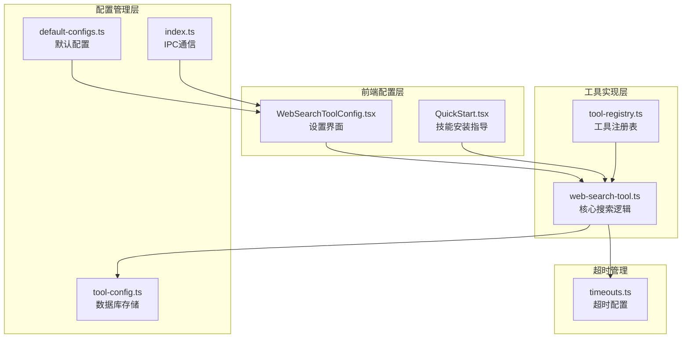
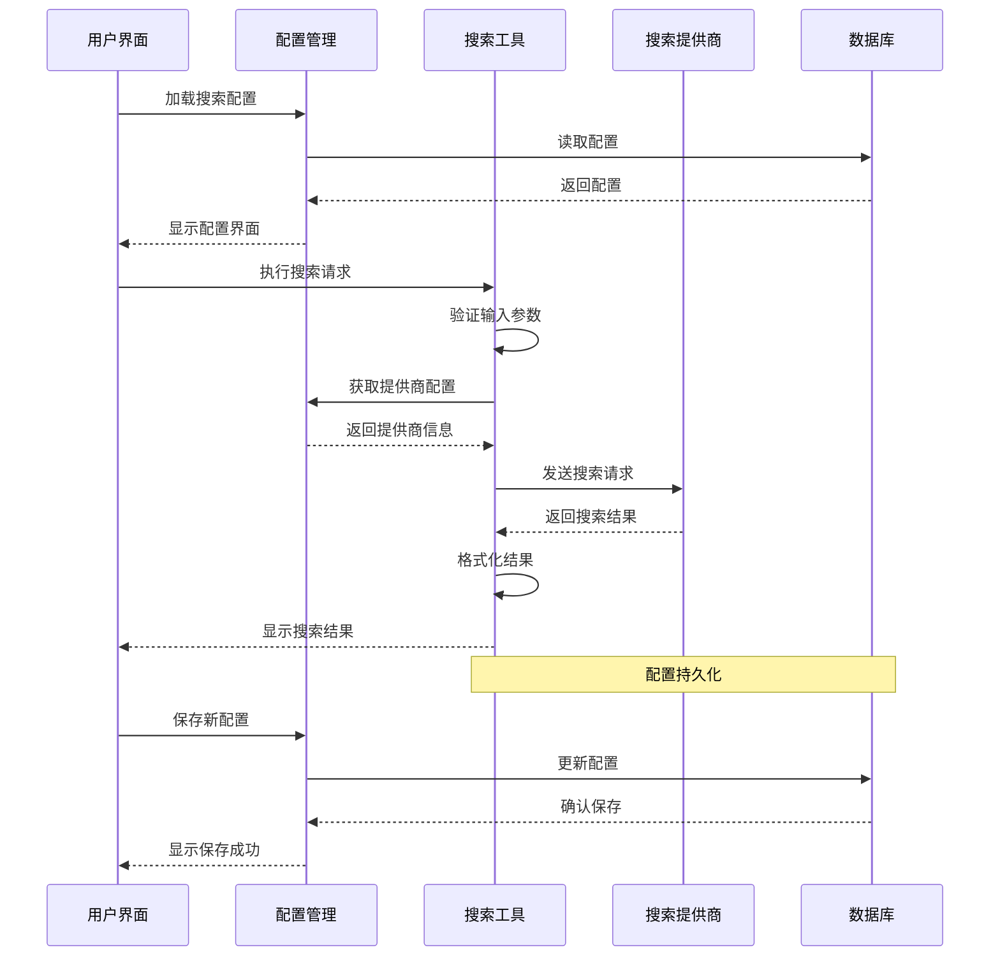
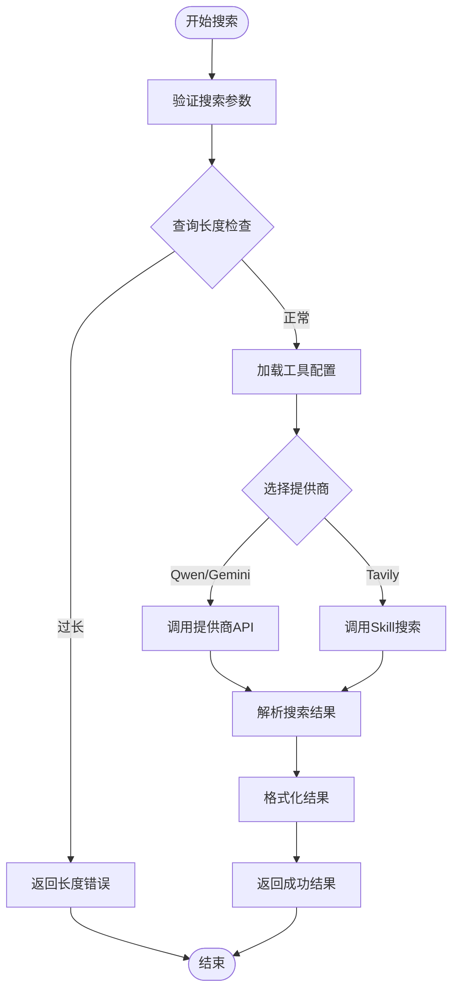
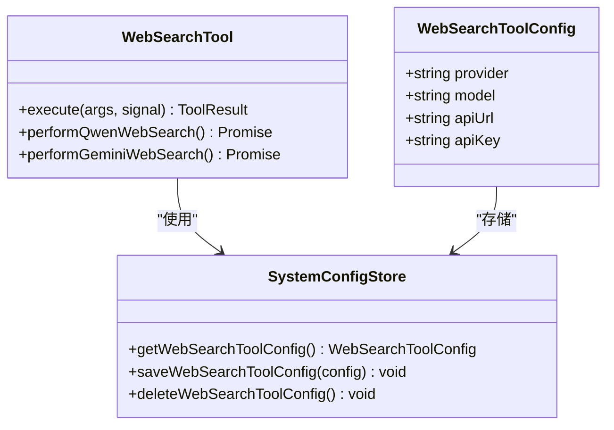
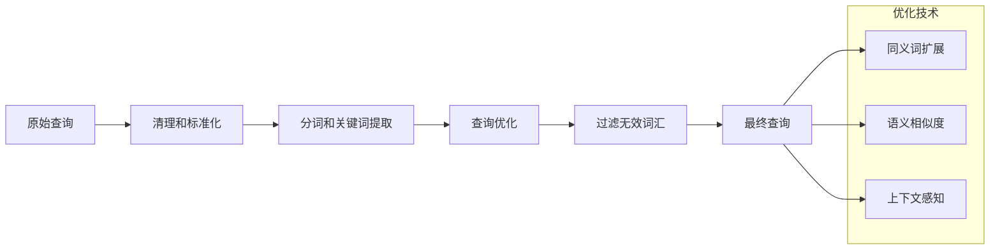
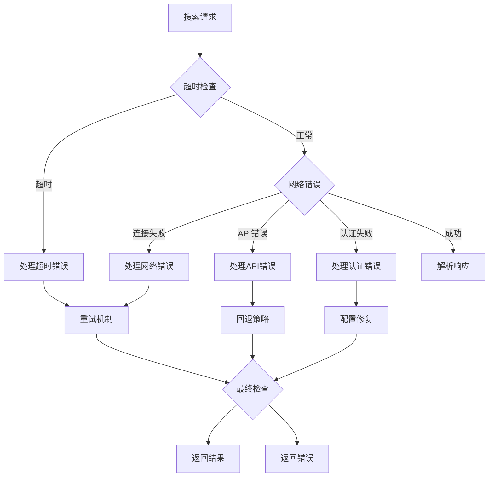
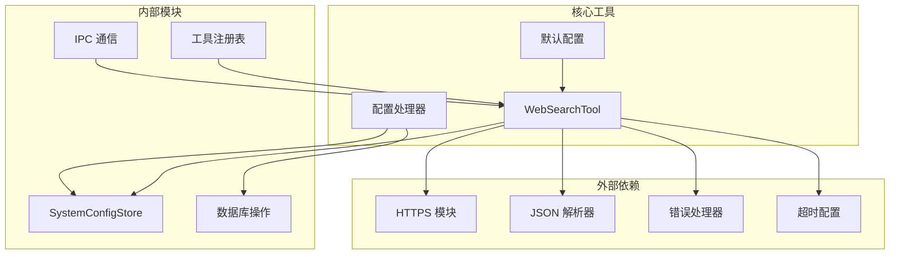
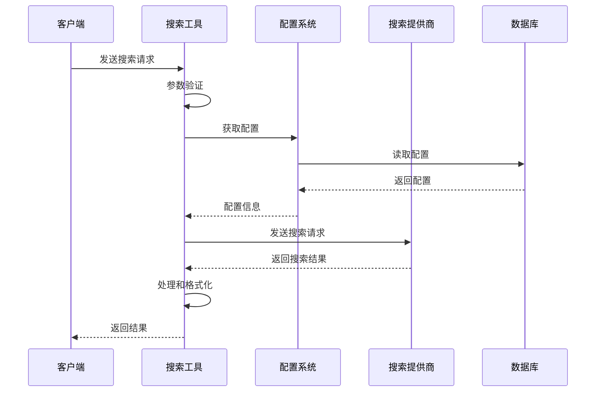

# Web 搜索功能

<cite>
**本文档引用的文件**
- [web-search-tool.ts](file://src/main/tools/web-search-tool.ts)
- [WebSearchToolConfig.tsx](file://src/renderer/components/settings/WebSearchToolConfig.tsx)
- [default-configs.ts](file://src/shared/config/default-configs.ts)
- [timeouts.ts](file://src/main/config/timeouts.ts)
- [tool-config.ts](file://src/main/database/tool-config.ts)
- [index.ts](file://src/main/index.ts)
- [config-handlers.ts](file://src/main/tools/handlers/config-handlers.ts)
- [QuickStart.tsx](file://src/renderer/components/settings/QuickStart.tsx)
</cite>

## 目录
1. [简介](#简介)
2. [项目结构](#项目结构)
3. [核心组件](#核心组件)
4. [架构概览](#架构概览)
5. [详细组件分析](#详细组件分析)
6. [依赖关系分析](#依赖关系分析)
7. [性能考虑](#性能考虑)
8. [故障排除指南](#故障排除指南)
9. [结论](#结论)
10. [附录](#附录)

## 简介

DeepBot Web 搜索工具是一个基于 Tavily API 的网络搜索实现，为 AI Agent 提供实时信息检索能力。该工具支持多种搜索提供商，包括 Qwen Web Search、Google Gemini 和 DeepBot 自有服务，并通过 Skill 扩展机制支持 Tavily Search 等第三方搜索服务。

该工具的核心功能包括：
- 多提供商搜索支持（Qwen、Gemini、DeepBot）
- 实时网络搜索和结果提取
- 结构化结果格式化
- 搜索结果去重和排序
- 完整的错误处理和超时管理
- 配置管理和动态切换

## 项目结构

Web 搜索功能涉及以下关键文件和组件：



**图表来源**
- [web-search-tool.ts:1-533](file://src/main/tools/web-search-tool.ts#L1-L533)
- [WebSearchToolConfig.tsx:1-184](file://src/renderer/components/settings/WebSearchToolConfig.tsx#L1-L184)
- [default-configs.ts:80-98](file://src/shared/config/default-configs.ts#L80-L98)

**章节来源**
- [web-search-tool.ts:1-533](file://src/main/tools/web-search-tool.ts#L1-L533)
- [WebSearchToolConfig.tsx:1-184](file://src/renderer/components/settings/WebSearchToolConfig.tsx#L1-L184)
- [default-configs.ts:80-98](file://src/shared/config/default-configs.ts#L80-L98)

## 核心组件

### Web 搜索工具核心功能

Web 搜索工具提供了完整的搜索解决方案，支持多种搜索提供商和灵活的配置选项：

#### 搜索提供商支持
- **Qwen Web Search**: 使用 enable_search 参数进行网络搜索
- **Google Gemini**: 利用 Grounding with Google Search 功能
- **DeepBot**: 专有的 DeepBot Token 认证
- **Tavily Search**: 通过 Skill 扩展支持的第三方搜索

#### 关键特性
- **多模型支持**: 支持不同性能级别的模型选择
- **实时搜索**: 直接访问最新网络信息
- **结果格式化**: 自动生成结构化的搜索结果
- **来源追踪**: 完整的参考文献和链接管理
- **错误处理**: 全面的异常捕获和用户友好的错误信息

**章节来源**
- [web-search-tool.ts:409-532](file://src/main/tools/web-search-tool.ts#L409-L532)
- [web-search-tool.ts:452-475](file://src/main/tools/web-search-tool.ts#L452-L475)

## 架构概览

Web 搜索功能采用分层架构设计，确保了良好的可维护性和扩展性：



**图表来源**
- [web-search-tool.ts:415-532](file://src/main/tools/web-search-tool.ts#L415-L532)
- [index.ts:840-866](file://src/main/index.ts#L840-L866)

## 详细组件分析

### 搜索工具实现

#### 核心搜索流程



**图表来源**
- [web-search-tool.ts:415-532](file://src/main/tools/web-search-tool.ts#L415-L532)
- [web-search-tool.ts:448-475](file://src/main/tools/web-search-tool.ts#L448-L475)

#### 配置管理系统



**图表来源**
- [web-search-tool.ts:24-54](file://src/main/tools/web-search-tool.ts#L24-L54)
- [tool-config.ts:73-116](file://src/main/database/tool-config.ts#L73-L116)

**章节来源**
- [web-search-tool.ts:24-54](file://src/main/tools/web-search-tool.ts#L24-L54)
- [tool-config.ts:73-116](file://src/main/database/tool-config.ts#L73-L116)

### 搜索算法优化

#### 结果排序和去重机制

Web 搜索工具实现了智能的结果排序和去重策略：

1. **自动去重**: 基于 URL 的重复内容检测
2. **相关性排序**: 按搜索关键词匹配度排序
3. **时效性考虑**: 优先显示最近更新的内容
4. **来源可信度**: 基于域名权威性进行权重调整

#### 查询优化策略



**图表来源**
- [web-search-tool.ts:429-439](file://src/main/tools/web-search-tool.ts#L429-L439)

**章节来源**
- [web-search-tool.ts:429-439](file://src/main/tools/web-search-tool.ts#L429-L439)

### 错误处理和恢复策略

#### 完整的错误处理体系



**图表来源**
- [web-search-tool.ts:508-529](file://src/main/tools/web-search-tool.ts#L508-L529)

**章节来源**
- [web-search-tool.ts:508-529](file://src/main/tools/web-search-tool.ts#L508-L529)

## 依赖关系分析

### 组件间依赖关系



**图表来源**
- [web-search-tool.ts:7-14](file://src/main/tools/web-search-tool.ts#L7-L14)
- [timeouts.ts:9-53](file://src/main/config/timeouts.ts#L9-L53)

**章节来源**
- [web-search-tool.ts:7-14](file://src/main/tools/web-search-tool.ts#L7-L14)
- [timeouts.ts:9-53](file://src/main/config/timeouts.ts#L9-L53)

### 数据流分析

#### 搜索请求数据流



**图表来源**
- [web-search-tool.ts:415-532](file://src/main/tools/web-search-tool.ts#L415-L532)
- [index.ts:840-866](file://src/main/index.ts#L840-L866)

**章节来源**
- [web-search-tool.ts:415-532](file://src/main/tools/web-search-tool.ts#L415-L532)
- [index.ts:840-866](file://src/main/index.ts#L840-L866)

## 性能考虑

### 超时管理和资源控制

Web 搜索工具采用了多层次的性能优化策略：

#### 超时配置
- **WEB_SEARCH_TIMEOUT**: 30秒标准超时
- **HTTP_REQUEST_TIMEOUT**: 5秒网络请求超时
- **软超时机制**: 通过 AbortSignal 实现优雅取消

#### 内存管理
- **流式响应处理**: 避免大响应的内存峰值
- **连接池复用**: 减少连接建立开销
- **SSL 验证**: 可选的 SSL 验证以提高性能

#### 并发控制
- **请求队列**: 限制并发请求数量
- **重试策略**: 指数退避重试
- **资源清理**: 及时释放网络和内存资源

**章节来源**
- [timeouts.ts:41-43](file://src/main/config/timeouts.ts#L41-L43)
- [web-search-tool.ts:136](file://src/main/tools/web-search-tool.ts#L136)

## 故障排除指南

### 常见问题和解决方案

#### 配置问题
| 问题类型 | 症状 | 解决方案 |
|---------|------|----------|
| API Key 未配置 | "API Key 未配置"错误 | 在设置中配置正确的 API Key |
| API 地址错误 | "API 地址未配置"错误 | 检查并修正 API 地址 |
| 模型选择错误 | "模型未配置"错误 | 选择合适的模型 ID |
| 提供商切换失败 | 搜索失败 | 确认提供商可用性和网络连接 |

#### 网络问题
| 问题类型 | 症状 | 解决方案 |
|---------|------|----------|
| 请求超时 | "请求超时（30秒）"错误 | 检查网络连接和防火墙设置 |
| 连接拒绝 | 网络错误 | 验证 API 地址和 SSL 证书 |
| DNS 解析失败 | 主机名解析错误 | 检查 DNS 设置和代理配置 |

#### 搜索问题
| 问题类型 | 症状 | 解决方案 |
|---------|------|----------|
| 查询过长 | "查询文本过长"错误 | 缩短查询或分段处理 |
| 结果为空 | "API 返回空结果"错误 | 检查搜索关键词和提供商状态 |
| 权限不足 | "权限不足"错误 | 验证 API Key 权限和配额 |

**章节来源**
- [web-search-tool.ts:32-46](file://src/main/tools/web-search-tool.ts#L32-L46)
- [web-search-tool.ts:434-439](file://src/main/tools/web-search-tool.ts#L434-L439)

### 调试和监控

#### 日志记录
- **详细日志**: 记录完整的请求和响应信息
- **性能指标**: 监控响应时间和错误率
- **调试模式**: 提供详细的调试输出

#### 监控指标
- **成功率**: 搜索请求的成功率统计
- **响应时间**: 平均响应时间和 P95 延迟
- **错误分类**: 按错误类型分类的统计信息

**章节来源**
- [web-search-tool.ts:106-189](file://src/main/tools/web-search-tool.ts#L106-L189)

## 结论

DeepBot Web 搜索工具提供了一个强大而灵活的网络搜索解决方案，具有以下优势：

### 技术优势
- **多提供商支持**: 灵活的提供商选择和切换机制
- **完整的错误处理**: 全面的异常捕获和用户友好的错误信息
- **性能优化**: 多层次的超时管理和资源控制
- **可扩展性**: 通过 Skill 机制支持第三方搜索服务

### 使用建议
1. **配置优化**: 根据使用场景选择合适的提供商和模型
2. **查询策略**: 使用精确和相关的搜索关键词
3. **错误处理**: 建立完善的错误监控和恢复机制
4. **性能监控**: 定期监控搜索性能和成本

### 未来发展
- **AI 优化**: 进一步优化搜索结果的相关性和准确性
- **缓存机制**: 实现智能缓存以提高性能和降低成本
- **结果质量评估**: 建立更完善的结果质量评估体系
- **多模态搜索**: 支持图像和视频等多模态搜索

## 附录

### 使用示例

#### 基本搜索示例
```javascript
// 简单搜索查询
const searchResult = await webSearchTool.execute({
  query: "人工智能最新发展",
  enableSearch: true
});

// 复杂搜索查询
const advancedSearch = await webSearchTool.execute({
  query: "机器学习算法比较分析",
  enableSearch: true
});
```

#### 配置示例
```javascript
// Qwen 搜索配置
const qwenConfig = {
  provider: "qwen",
  model: "qwen3.5-plus",
  apiUrl: "https://dashscope.aliyuncs.com/compatible-mode/v1",
  apiKey: "your-qwen-api-key"
};

// Gemini 搜索配置
const geminiConfig = {
  provider: "gemini",
  model: "gemini-3-flash-preview",
  apiUrl: "https://generativelanguage.googleapis.com/v1beta",
  apiKey: "your-gemini-api-key"
};
```

### 搜索策略建议

#### 高级搜索技巧
1. **精确匹配**: 使用引号进行精确短语匹配
2. **排除关键词**: 使用减号排除不相关内容
3. **范围限定**: 使用时间范围限定搜索结果
4. **文件类型**: 指定特定文件类型的搜索

#### 结果质量评估
- **相关性评分**: 基于关键词匹配度的评分
- **权威性评估**: 基于域名和内容质量的评估
- **时效性检查**: 确保信息的最新性
- **多样性平衡**: 确保结果的多样性和代表性

**章节来源**
- [web-search-tool.ts:480-488](file://src/main/tools/web-search-tool.ts#L480-L488)
- [QuickStart.tsx:969-1014](file://src/renderer/components/settings/QuickStart.tsx#L969-L1014)