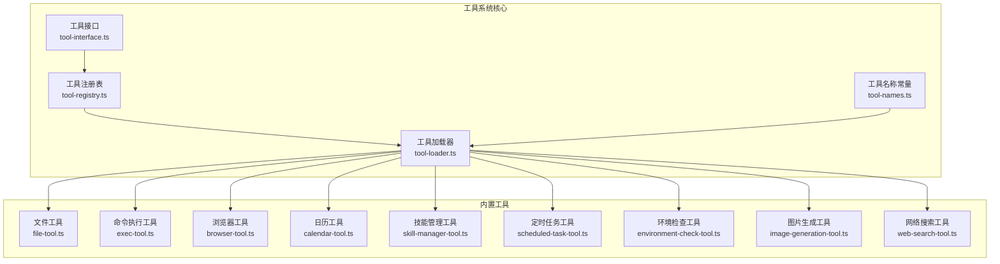
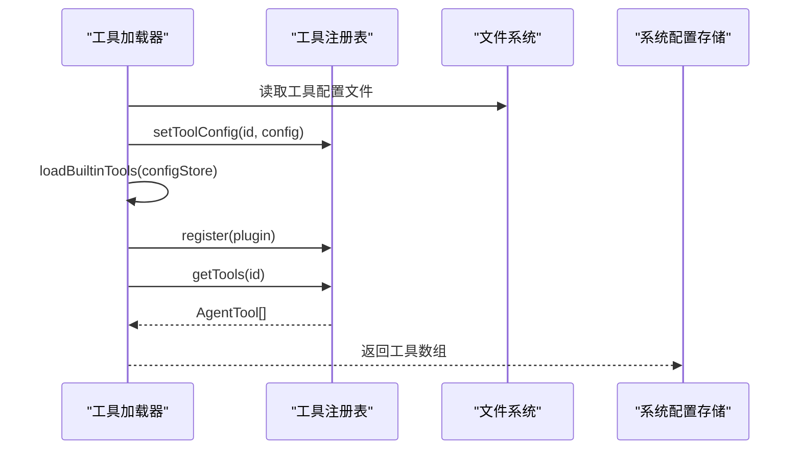
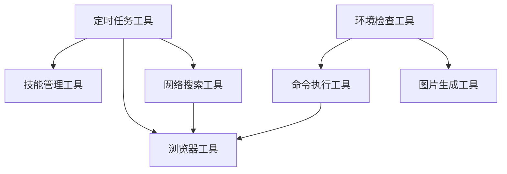

# 内置工具概览

<cite>
**本文档引用的文件**
- [tool-registry.ts](file://src/main/tools/registry/tool-registry.ts)
- [tool-interface.ts](file://src/main/tools/registry/tool-interface.ts)
- [tool-loader.ts](file://src/main/tools/registry/tool-loader.ts)
- [tool-names.ts](file://src/main/tools/tool-names.ts)
- [file-tool.ts](file://src/main/tools/file-tool.ts)
- [exec-tool.ts](file://src/main/tools/exec-tool.ts)
- [browser-tool.ts](file://src/main/tools/browser-tool.ts)
- [calendar-tool.ts](file://src/main/tools/calendar-tool.ts)
- [skill-manager-tool.ts](file://src/main/tools/skill-manager-tool.ts)
- [scheduled-task-tool.ts](file://src/main/tools/scheduled-task-tool.ts)
- [environment-check-tool.ts](file://src/main/tools/environment-check-tool.ts)
- [image-generation-tool.ts](file://src/main/tools/image-generation-tool.ts)
- [web-search-tool.ts](file://src/main/tools/web-search-tool.ts)
</cite>

## 目录
1. [简介](#简介)
2. [项目结构](#项目结构)
3. [核心组件](#核心组件)
4. [架构总览](#架构总览)
5. [详细组件分析](#详细组件分析)
6. [依赖关系分析](#依赖关系分析)
7. [性能考量](#性能考量)
8. [故障排查指南](#故障排查指南)
9. [结论](#结论)
10. [附录](#附录)

## 简介
本文件为 DeepBot 内置工具的全面概览，面向使用者与开发者，提供工具分类、功能特点、适用场景、基本属性（名称、描述、版本、状态、类别）、工具间协作模式、选择指南、使用示例、最佳实践、性能对比与安全限制等。DeepBot 的工具体系基于统一的工具接口与注册表机制，所有内置工具位于 `src/main/tools/` 目录，并通过工具加载器集中加载与配置。

## 项目结构
DeepBot 的工具系统采用“插件式”设计，核心由以下模块构成：
- 工具接口与元数据：定义工具的标准结构、元数据、配置与生命周期钩子
- 工具注册表：负责工具的注册、查询、配置与清理
- 工具加载器：集中加载内置工具，读取用户配置，按开关与策略组装工具集合
- 工具实现：各功能工具（文件、命令执行、浏览器、日历、技能管理、定时任务、环境检查、图片生成、网络搜索等）

**图表来源**
- [tool-interface.ts:1-152](file://src/main/tools/registry/tool-interface.ts#L1-L152)
- [tool-registry.ts:1-328](file://src/main/tools/registry/tool-registry.ts#L1-L328)
- [tool-loader.ts:1-312](file://src/main/tools/registry/tool-loader.ts#L1-L312)
- [tool-names.ts:1-106](file://src/main/tools/tool-names.ts#L1-L106)

**章节来源**
- [tool-registry.ts:1-328](file://src/main/tools/registry/tool-registry.ts#L1-L328)
- [tool-loader.ts:1-312](file://src/main/tools/registry/tool-loader.ts#L1-L312)
- [tool-names.ts:1-106](file://src/main/tools/tool-names.ts#L1-L106)

## 核心组件
- 工具接口与元数据
  - ToolMetadata：工具元数据，包含 id、name、description、version、category、tags、requiresConfig 等
  - ToolConfig：工具配置，包含 enabled 与 config
  - ToolPlugin：工具插件接口，定义 create、validateConfig、initialize、cleanup 等生命周期方法
  - ToolLoadResult：工具加载结果，包含插件、工具实例、状态与错误信息
- 工具注册表
  - 提供注册、查询、配置管理、清理、UI 展示列表等能力
  - 支持从目录加载（历史遗留）与集中加载（当前）
- 工具加载器
  - 读取用户工具配置，按开关与策略加载内置工具
  - 统一注入 workspaceDir、sessionId、configStore 等上下文
  - 支持禁用工具列表与按名称过滤

**章节来源**
- [tool-interface.ts:1-152](file://src/main/tools/registry/tool-interface.ts#L1-L152)
- [tool-registry.ts:1-328](file://src/main/tools/registry/tool-registry.ts#L1-L328)
- [tool-loader.ts:1-312](file://src/main/tools/registry/tool-loader.ts#L1-L312)

## 架构总览
工具加载与运行的关键流程如下：

**图表来源**
- [tool-loader.ts:57-71](file://src/main/tools/registry/tool-loader.ts#L57-L71)
- [tool-registry.ts:46-55](file://src/main/tools/registry/tool-registry.ts#L46-L55)
- [tool-registry.ts:237-249](file://src/main/tools/registry/tool-registry.ts#L237-L249)

## 详细组件分析

### 工具分类与基本信息
以下为 DeepBot 内置工具的分类、功能特点与适用场景概览（名称、描述、版本、状态、类别）：

- 文件工具（file-tool）
  - 名称：file_read / file_write / file_edit
  - 描述：读取、写入、编辑文件；带路径安全检查与返回结果优化
  - 版本：随实现版本
  - 状态：启用
  - 类别：file
  - 适用场景：工作区文件读写、代码片段编辑、日志读取

- 命令执行工具（exec-tool）
  - 名称：bash
  - 描述：执行 shell 命令；统一超时、危险命令拦截、路径安全检查、输出截断
  - 版本：随实现版本
  - 状态：启用
  - 类别：system
  - 适用场景：脚本执行、系统运维、构建任务

- 浏览器工具（browser-tool）
  - 名称：browser
  - 描述：基于 agent-browser 的浏览器自动化；支持打开网页、快照、点击、填写、截图、标签页管理
  - 版本：2.0.0
  - 状态：启用
  - 类别：system
  - 适用场景：网页自动化、数据采集、界面交互

- 日历工具（calendar-tool）
  - 名称：calendar_get_events / calendar_create_event
  - 描述：macOS 日历事件读取与创建；依赖 Automation 权限
  - 版本：随实现版本
  - 状态：按平台启用
  - 类别：system
  - 适用场景：日程同步、会议安排

- 技能管理工具（skill-manager-tool）
  - 名称：skill_manager
  - 描述：搜索、安装、管理 DeepBot Skills；支持启用/禁用、环境变量配置
  - 版本：随实现版本
  - 状态：启用
  - 类别：custom
  - 适用场景：扩展工具生态、第三方能力接入

- 定时任务工具（scheduled-task-tool）
  - 名称：scheduled_task
  - 描述：创建、管理、执行定时任务；支持一次性、间隔、Cron；查看历史
  - 版本：随实现版本
  - 状态：启用
  - 类别：system
  - 适用场景：周期性任务、报表生成、监控告警

- 环境检查工具（environment-check-tool）
  - 名称：environment_check
  - 描述：检查系统环境依赖（如 Python），并保存状态
  - 版本：随实现版本
  - 状态：启用
  - 类别：system
  - 适用场景：依赖前置检查、环境诊断

- 图片生成工具（image-generation-tool）
  - 名称：image_generation
  - 描述：多提供商图片生成与解析；支持 Gemini/Qwen；可选参考图
  - 版本：随实现版本
  - 状态：启用
  - 类别：ai
  - 适用场景：创意设计、图像理解、内容生成

- 网络搜索工具（web-search-tool）
  - 名称：web_search
  - 描述：多提供商网络搜索；支持 Qwen（enable_search）与 Gemini（Grounding）
  - 版本：随实现版本
  - 状态：启用
  - 类别：network
  - 适用场景：实时信息检索、问答、知识获取

**章节来源**
- [file-tool.ts:1-219](file://src/main/tools/file-tool.ts#L1-L219)
- [exec-tool.ts:1-529](file://src/main/tools/exec-tool.ts#L1-L529)
- [browser-tool.ts:1-976](file://src/main/tools/browser-tool.ts#L1-L976)
- [calendar-tool.ts:1-452](file://src/main/tools/calendar-tool.ts#L1-L452)
- [skill-manager-tool.ts:1-8](file://src/main/tools/skill-manager-tool.ts#L1-L8)
- [scheduled-task-tool.ts:1-628](file://src/main/tools/scheduled-task-tool.ts#L1-L628)
- [environment-check-tool.ts:1-318](file://src/main/tools/environment-check-tool.ts#L1-L318)
- [image-generation-tool.ts:1-364](file://src/main/tools/image-generation-tool.ts#L1-L364)
- [web-search-tool.ts:1-533](file://src/main/tools/web-search-tool.ts#L1-L533)

### 工具关系与协作模式
- 工具加载与装配
  - 工具加载器集中导入并创建各工具实例，按开关与策略过滤
  - 工具注册表统一管理插件与实例，提供查询与配置接口
- 工具间协作
  - 浏览器工具与网络搜索工具可配合使用：先搜索获取信息，再用浏览器抓取细节
  - 定时任务工具与技能管理工具结合：通过技能扩展更多能力，定时任务驱动执行
  - 环境检查工具为命令执行与图片生成等工具提供前置保障
- 执行顺序与依赖
  - 环境检查 → 命令执行/图片生成 → 浏览器抓取 → 定时任务编排 → 技能扩展

**图表来源**
- [tool-loader.ts:116-300](file://src/main/tools/registry/tool-loader.ts#L116-L300)
- [browser-tool.ts:1-976](file://src/main/tools/browser-tool.ts#L1-L976)
- [web-search-tool.ts:1-533](file://src/main/tools/web-search-tool.ts#L1-L533)
- [scheduled-task-tool.ts:1-628](file://src/main/tools/scheduled-task-tool.ts#L1-L628)
- [skill-manager-tool.ts:1-8](file://src/main/tools/skill-manager-tool.ts#L1-L8)

### 工具选择指南
- 需要文件读写与编辑：优先使用文件工具，注意路径安全
- 需要系统命令执行：使用命令执行工具，关注超时与危险命令拦截
- 需要网页自动化：使用浏览器工具，遵循快照与元素定位规范
- 需要日程管理：使用日历工具（macOS），确保 Automation 权限
- 需要周期性任务：使用定时任务工具，结合技能扩展复杂流程
- 需要环境诊断：使用环境检查工具，确保依赖可用
- 需要图片生成/解析：使用图片生成工具，按提供商选择
- 需要网络搜索：使用网络搜索工具，按场景选择提供商

**章节来源**
- [tool-loader.ts:116-300](file://src/main/tools/registry/tool-loader.ts#L116-L300)
- [browser-tool.ts:1-976](file://src/main/tools/browser-tool.ts#L1-L976)
- [calendar-tool.ts:1-452](file://src/main/tools/calendar-tool.ts#L1-L452)
- [scheduled-task-tool.ts:1-628](file://src/main/tools/scheduled-task-tool.ts#L1-L628)
- [environment-check-tool.ts:1-318](file://src/main/tools/environment-check-tool.ts#L1-L318)
- [image-generation-tool.ts:1-364](file://src/main/tools/image-generation-tool.ts#L1-L364)
- [web-search-tool.ts:1-533](file://src/main/tools/web-search-tool.ts#L1-L533)

### 工具使用示例与最佳实践
- 文件工具
  - 读取：先读取再处理，避免重复读取
  - 写入：确保工作区目录存在，注意路径安全
- 命令执行工具
  - 使用统一超时，避免长时间阻塞
  - 危险命令自动拦截，必要时使用阻塞命令检查提示
- 浏览器工具
  - 执行页面变更后立即快照，使用 @ref 定位元素
  - 标签页管理分步执行，先新建再打开
- 日历工具
  - macOS 平台专用，确保 Automation 权限
- 技能管理工具
  - 通过 find/install/list 管理技能，set-env/get-env 配置环境变量
- 定时任务工具
  - 合理设置调度类型与最大执行次数，定期查看历史
- 环境检查工具
  - 检查前刷新环境变量缓存，确保 PATH 正确
- 图片生成工具
  - 按提供商选择模型，合理设置宽高比与分辨率
- 网络搜索工具
  - 控制查询长度，避免超时与空回答

**章节来源**
- [file-tool.ts:1-219](file://src/main/tools/file-tool.ts#L1-L219)
- [exec-tool.ts:1-529](file://src/main/tools/exec-tool.ts#L1-L529)
- [browser-tool.ts:1-976](file://src/main/tools/browser-tool.ts#L1-L976)
- [calendar-tool.ts:1-452](file://src/main/tools/calendar-tool.ts#L1-L452)
- [skill-manager-tool.ts:1-8](file://src/main/tools/skill-manager-tool.ts#L1-L8)
- [scheduled-task-tool.ts:1-628](file://src/main/tools/scheduled-task-tool.ts#L1-L628)
- [environment-check-tool.ts:1-318](file://src/main/tools/environment-check-tool.ts#L1-L318)
- [image-generation-tool.ts:1-364](file://src/main/tools/image-generation-tool.ts#L1-L364)
- [web-search-tool.ts:1-533](file://src/main/tools/web-search-tool.ts#L1-L533)

### 性能对比分析
- 命令执行工具 vs 网络搜索工具
  - 命令执行工具：超时可控，适合本地任务；输出截断避免大文本传输
  - 网络搜索工具：受 API 延迟与限流影响，建议缩短查询长度与分段处理
- 浏览器工具 vs 日历工具
  - 浏览器工具：启动成本较高，建议复用会话；快照与交互元素解析耗时
  - 日历工具：AppleScript 调用延迟低，但 macOS 专属
- 图片生成工具
  - Gemini/Qwen 提供商差异明显，建议根据场景选择模型与分辨率
- 定时任务工具
  - SQLite 存储，任务数量有限制；建议合理规划任务数量与调度策略

**章节来源**
- [exec-tool.ts:1-529](file://src/main/tools/exec-tool.ts#L1-L529)
- [web-search-tool.ts:1-533](file://src/main/tools/web-search-tool.ts#L1-L533)
- [browser-tool.ts:1-976](file://src/main/tools/browser-tool.ts#L1-L976)
- [calendar-tool.ts:1-452](file://src/main/tools/calendar-tool.ts#L1-L452)
- [image-generation-tool.ts:1-364](file://src/main/tools/image-generation-tool.ts#L1-L364)
- [scheduled-task-tool.ts:1-628](file://src/main/tools/scheduled-task-tool.ts#L1-L628)

### 配置选项、限制条件与安全考虑
- 工具配置
  - 工具配置文件位置：用户主目录与工作区目录的 tools-config.json
  - 注册表支持按 id 设置/获取工具配置，支持启用/禁用与参数配置
- 限制条件
  - 日历工具仅支持 macOS
  - 浏览器工具在 Docker 模式下使用 headless Chromium
  - 定时任务数量上限为 10 个
  - 网络搜索查询长度限制约 10K 字符
- 安全考虑
  - 文件工具：路径白名单与安全检查，避免越权访问
  - 命令执行工具：危险命令黑名单与路径安全检查，阻塞命令拦截
  - 浏览器工具：@ref 系统定位，避免猜测元素引用
  - 环境检查工具：刷新 PATH 缓存，保险机制添加 Python 路径

**章节来源**
- [tool-loader.ts:77-99](file://src/main/tools/registry/tool-loader.ts#L77-L99)
- [calendar-tool.ts:9-16](file://src/main/tools/calendar-tool.ts#L9-L16)
- [browser-tool.ts:217-298](file://src/main/tools/browser-tool.ts#L217-L298)
- [scheduled-task-tool.ts:51-52](file://src/main/tools/scheduled-task-tool.ts#L51-L52)
- [web-search-tool.ts:72-73](file://src/main/tools/web-search-tool.ts#L72-L73)
- [file-tool.ts:160-176](file://src/main/tools/file-tool.ts#L160-L176)
- [exec-tool.ts:326-335](file://src/main/tools/exec-tool.ts#L326-L335)
- [browser-tool.ts:101-104](file://src/main/tools/browser-tool.ts#L101-L104)
- [environment-check-tool.ts:127-150](file://src/main/tools/environment-check-tool.ts#L127-L150)

## 依赖关系分析
工具间的耦合与依赖关系如下：

**图表来源**
- [tool-loader.ts:116-300](file://src/main/tools/registry/tool-loader.ts#L116-L300)
- [tool-registry.ts:46-55](file://src/main/tools/registry/tool-registry.ts#L46-L55)

**章节来源**
- [tool-loader.ts:1-312](file://src/main/tools/registry/tool-loader.ts#L1-L312)
- [tool-registry.ts:1-328](file://src/main/tools/registry/tool-registry.ts#L1-L328)

## 性能考量
- 工具加载
  - 工具加载器集中导入与按需过滤，减少不必要的实例化
- I/O 与网络
  - 文件工具对图片 base64 数据进行过滤，避免大对象传输
  - 网络搜索工具设置超时与查询长度限制，提升稳定性
- 资源管理
  - 工具注册表提供清理接口，避免资源泄漏
  - 定时任务工具限制任务数量，防止资源耗尽

**章节来源**
- [file-tool.ts:82-138](file://src/main/tools/file-tool.ts#L82-L138)
- [web-search-tool.ts:136-168](file://src/main/tools/web-search-tool.ts#L136-L168)
- [tool-registry.ts:254-271](file://src/main/tools/registry/tool-registry.ts#L254-L271)
- [scheduled-task-tool.ts:187-191](file://src/main/tools/scheduled-task-tool.ts#L187-L191)

## 故障排查指南
- 工具加载失败
  - 检查 tools-config.json 格式与权限
  - 查看注册表日志与错误信息
- 命令执行失败
  - 检查危险命令拦截与路径安全检查
  - 确认超时设置与阻塞命令提示
- 浏览器工具连接失败
  - Docker 模式下确认 Playwright 安装与端口开放
  - 非 Docker 模式确认 Chrome 启动与用户数据目录
- 日历工具权限问题
  - macOS 平台确认 Automation 权限
- 环境检查失败
  - 刷新环境变量缓存，确认 PATH 合并正确
- 图片生成/网络搜索失败
  - 检查 API Key、地址与模型配置
  - 控制查询长度与网络连通性

**章节来源**
- [tool-loader.ts:77-99](file://src/main/tools/registry/tool-loader.ts#L77-L99)
- [exec-tool.ts:326-335](file://src/main/tools/exec-tool.ts#L326-L335)
- [browser-tool.ts:256-360](file://src/main/tools/browser-tool.ts#L256-L360)
- [calendar-tool.ts:74-85](file://src/main/tools/calendar-tool.ts#L74-L85)
- [environment-check-tool.ts:127-150](file://src/main/tools/environment-check-tool.ts#L127-L150)
- [image-generation-tool.ts:34-67](file://src/main/tools/image-generation-tool.ts#L34-L67)
- [web-search-tool.ts:32-54](file://src/main/tools/web-search-tool.ts#L32-L54)

## 结论
DeepBot 的内置工具体系通过统一接口与注册表机制实现了高度模块化与可扩展性。工具加载器负责装配与配置，各类工具覆盖文件、系统、网络、AI、定制等多个领域，满足从日常运维到复杂业务流程的多样化需求。建议在使用前明确工具特性与限制，结合场景选择合适的工具组合，并遵循安全与性能最佳实践。

## 附录
- 工具名称常量集中管理，避免硬编码与命名冲突
- 工具接口定义清晰，便于扩展与维护
- 工具注册表提供 UI 展示列表，支持分类与状态展示

**章节来源**
- [tool-names.ts:1-106](file://src/main/tools/tool-names.ts#L1-L106)
- [tool-interface.ts:1-152](file://src/main/tools/registry/tool-interface.ts#L1-L152)
- [tool-registry.ts:278-309](file://src/main/tools/registry/tool-registry.ts#L278-L309)