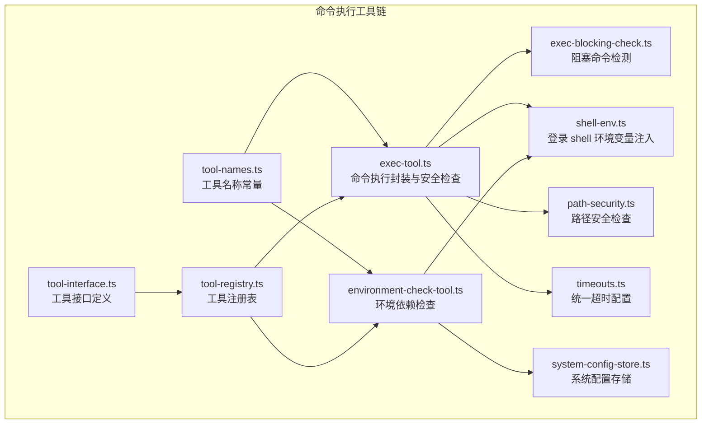
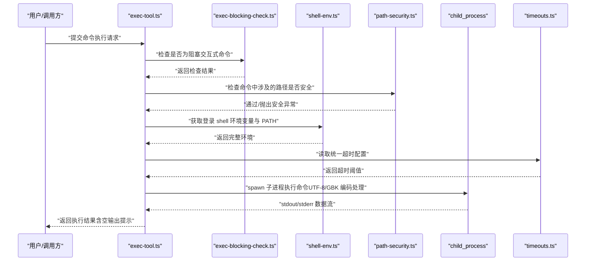
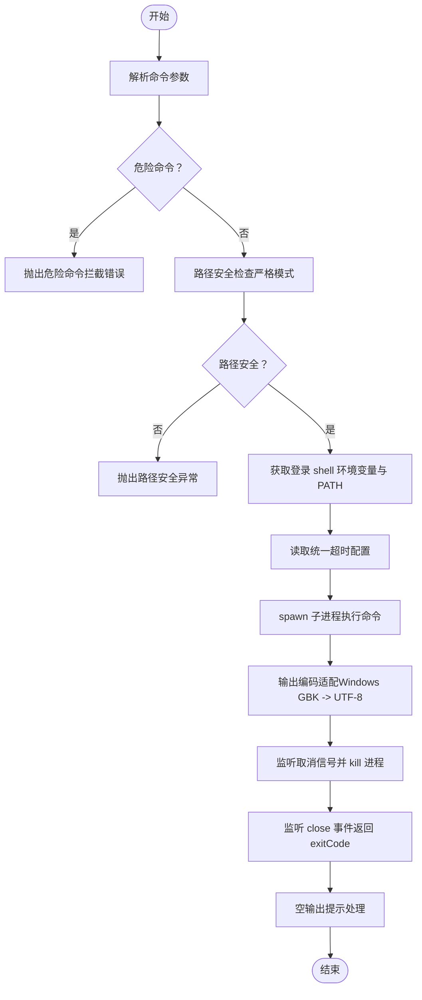
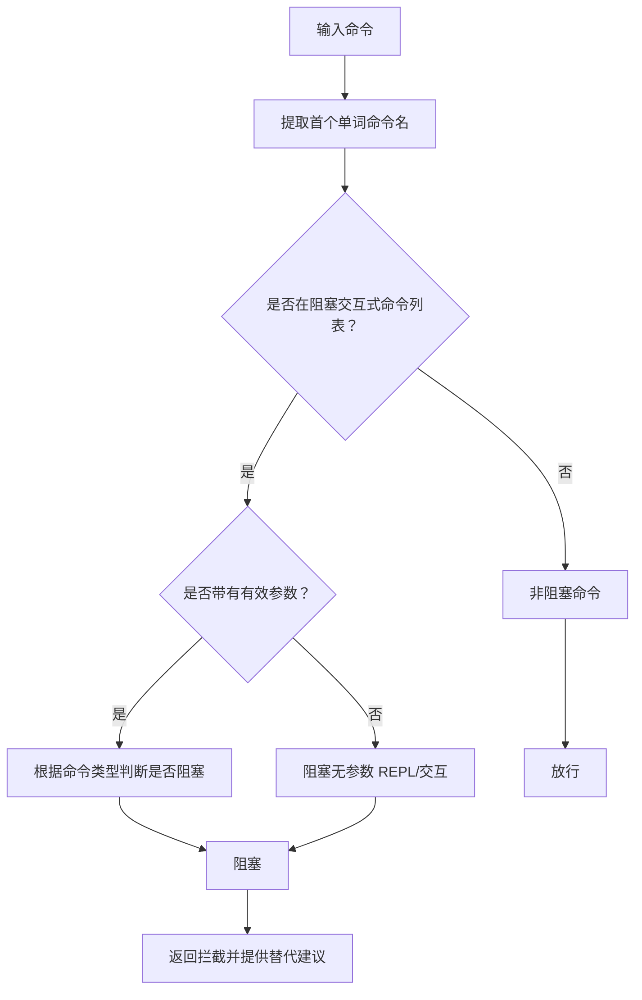
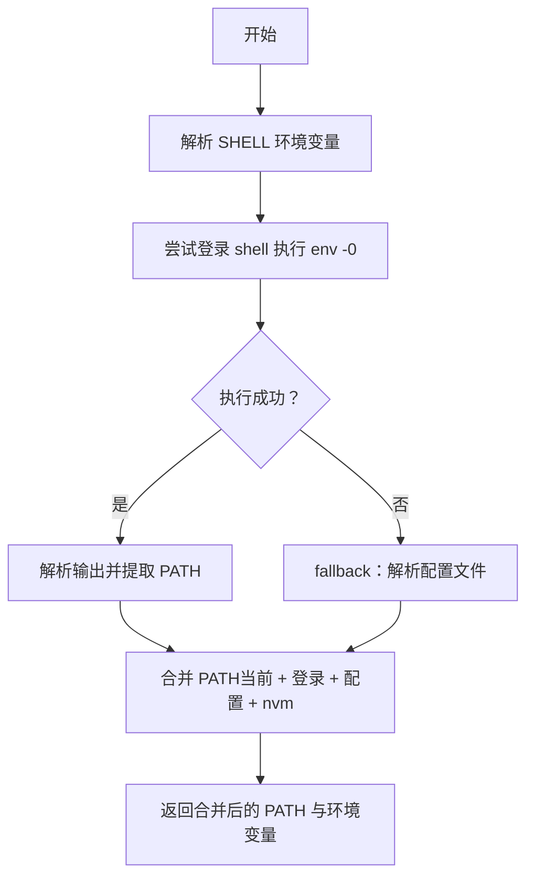
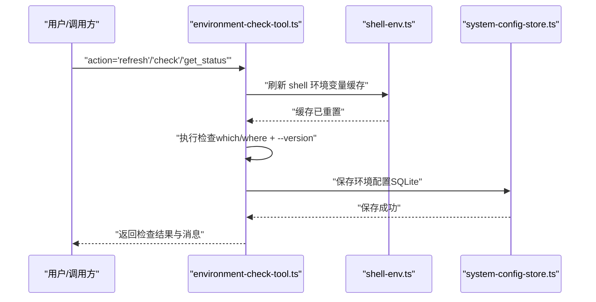
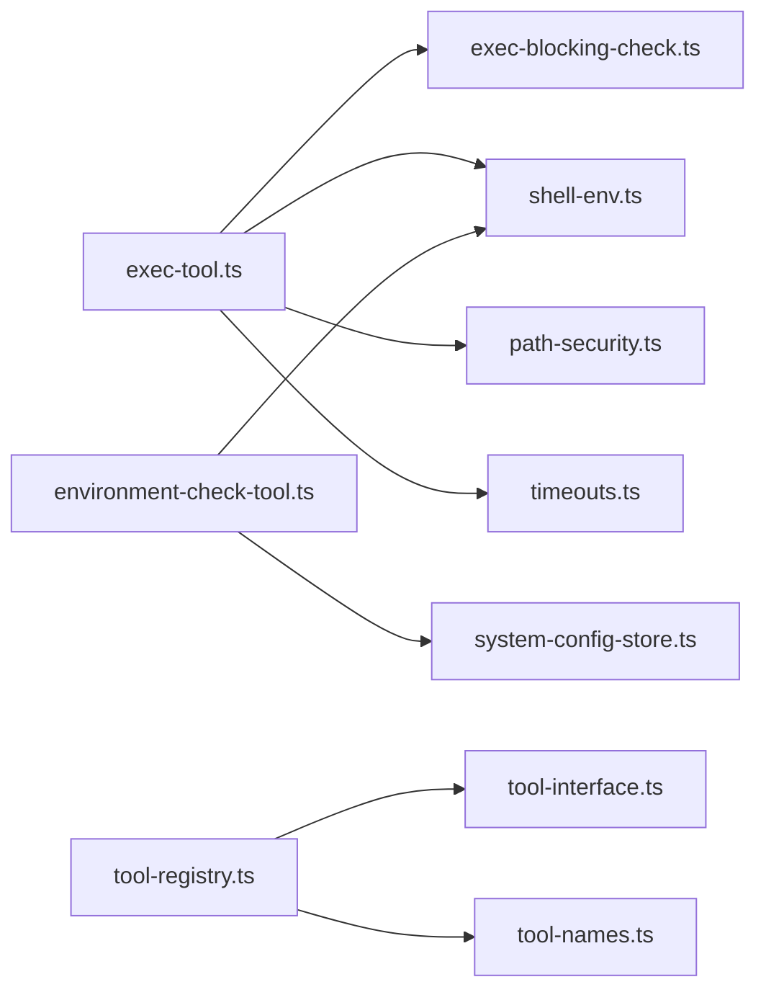

# 命令执行工具

<cite>
**本文引用的文件**
- [command-tool.ts](file://src/main/tools/command-tool.ts)
- [exec-tool.ts](file://src/main/tools/exec-tool.ts)
- [environment-check-tool.ts](file://src/main/tools/environment-check-tool.ts)
- [exec-blocking-check.ts](file://src/main/tools/exec-blocking-check.ts)
- [shell-env.ts](file://src/main/tools/shell-env.ts)
- [tool-names.ts](file://src/main/tools/tool-names.ts)
- [timeouts.ts](file://src/main/config/timeouts.ts)
- [path-security.ts](file://src/main/utils/path-security.ts)
- [tool-interface.ts](file://src/main/tools/registry/tool-interface.ts)
- [tool-registry.ts](file://src/main/tools/registry/tool-registry.ts)
- [system-config-store.ts](file://src/main/database/system-config-store.ts)
- [README.md](file://README.md)
</cite>

## 目录
1. [简介](#简介)
2. [项目结构](#项目结构)
3. [核心组件](#核心组件)
4. [架构总览](#架构总览)
5. [详细组件分析](#详细组件分析)
6. [依赖关系分析](#依赖关系分析)
7. [性能考量](#性能考量)
8. [故障排查指南](#故障排查指南)
9. [结论](#结论)
10. [附录](#附录)

## 简介
本文件面向 史丽慧小助理 的命令执行工具链，系统性阐述命令行执行工具的实现机制、参数处理、输出捕获、安全验证与阻塞检查的工作原理，并提供最佳实践、安全限制、错误处理策略、使用示例与性能优化建议。读者可据此理解命令执行工具如何在受控环境中安全、稳定地执行系统命令，以及如何通过环境检查与路径安全策略保障系统安全。

## 项目结构
命令执行工具相关的核心文件主要集中在 src/main/tools 目录，围绕“命令执行工具”、“阻塞命令检查”、“环境变量注入”、“路径安全检查”、“工具注册与命名”、“超时配置”等模块协同工作。

图表来源
- [exec-tool.ts:1-529](file://src/main/tools/exec-tool.ts#L1-L529)
- [exec-blocking-check.ts:1-130](file://src/main/tools/exec-blocking-check.ts#L1-L130)
- [shell-env.ts:1-417](file://src/main/tools/shell-env.ts#L1-L417)
- [environment-check-tool.ts:1-318](file://src/main/tools/environment-check-tool.ts#L1-L318)
- [path-security.ts:1-118](file://src/main/utils/path-security.ts#L1-L118)
- [timeouts.ts:1-78](file://src/main/config/timeouts.ts#L1-L78)
- [tool-names.ts:1-106](file://src/main/tools/tool-names.ts#L1-L106)
- [tool-interface.ts:1-152](file://src/main/tools/registry/tool-interface.ts#L1-L152)
- [tool-registry.ts:1-328](file://src/main/tools/registry/tool-registry.ts#L1-L328)
- [system-config-store.ts:1-200](file://src/main/database/system-config-store.ts#L1-L200)

章节来源
- [exec-tool.ts:1-529](file://src/main/tools/exec-tool.ts#L1-L529)
- [environment-check-tool.ts:1-318](file://src/main/tools/environment-check-tool.ts#L1-L318)
- [shell-env.ts:1-417](file://src/main/tools/shell-env.ts#L1-L417)
- [path-security.ts:1-118](file://src/main/utils/path-security.ts#L1-L118)
- [timeouts.ts:1-78](file://src/main/config/timeouts.ts#L1-L78)
- [tool-names.ts:1-106](file://src/main/tools/tool-names.ts#L1-L106)
- [tool-interface.ts:1-152](file://src/main/tools/registry/tool-interface.ts#L1-L152)
- [tool-registry.ts:1-328](file://src/main/tools/registry/tool-registry.ts#L1-L328)
- [system-config-store.ts:1-200](file://src/main/database/system-config-store.ts#L1-L200)

## 核心组件
- 命令执行工具（exec-tool.ts）：封装底层命令执行，统一超时、危险命令拦截、路径安全检查、输出处理与环境变量注入。
- 阻塞命令检查（exec-blocking-check.ts）：识别并拦截会阻塞的交互式命令，提供替代建议。
- 环境变量注入（shell-env.ts）：从登录 shell 获取完整 PATH 与环境变量，解决 Electron 主进程环境变量不完整问题，并支持缓存与刷新。
- 环境检查工具（environment-check-tool.ts）：检查系统依赖（如 Python），将结果持久化至系统配置存储。
- 路径安全检查（path-security.ts）：基于白名单与工作空间隔离，限制命令涉及的文件路径访问范围。
- 工具命名与注册（tool-names.ts、tool-interface.ts、tool-registry.ts）：统一工具名称、接口规范与注册流程。
- 超时配置（timeouts.ts）：集中管理各类超时阈值，确保命令执行具备可控的“软超时”。

章节来源
- [exec-tool.ts:1-529](file://src/main/tools/exec-tool.ts#L1-L529)
- [exec-blocking-check.ts:1-130](file://src/main/tools/exec-blocking-check.ts#L1-L130)
- [shell-env.ts:1-417](file://src/main/tools/shell-env.ts#L1-L417)
- [environment-check-tool.ts:1-318](file://src/main/tools/environment-check-tool.ts#L1-L318)
- [path-security.ts:1-118](file://src/main/utils/path-security.ts#L1-L118)
- [tool-names.ts:1-106](file://src/main/tools/tool-names.ts#L1-L106)
- [tool-interface.ts:1-152](file://src/main/tools/registry/tool-interface.ts#L1-L152)
- [tool-registry.ts:1-328](file://src/main/tools/registry/tool-registry.ts#L1-L328)
- [timeouts.ts:1-78](file://src/main/config/timeouts.ts#L1-L78)

## 架构总览
命令执行工具链通过“安全前置检查 + 环境注入 + 执行封装 + 输出处理”的方式，形成闭环的安全执行通道。关键流程如下：
- 输入参数校验与 Schema 校验
- 危险命令黑名单与模式匹配
- 路径安全检查（严格模式）
- 登录 shell 环境变量注入与 PATH 合并
- 统一超时控制与取消信号处理
- 输出编码适配与空输出提示
- 阻塞命令拦截与替代建议

图表来源
- [exec-tool.ts:392-528](file://src/main/tools/exec-tool.ts#L392-L528)
- [exec-blocking-check.ts:44-95](file://src/main/tools/exec-blocking-check.ts#L44-L95)
- [shell-env.ts:355-416](file://src/main/tools/shell-env.ts#L355-L416)
- [path-security.ts:88-281](file://src/main/tools/exec-tool.ts#L88-L281)
- [timeouts.ts:36](file://src/main/config/timeouts.ts#L36)

章节来源
- [exec-tool.ts:392-528](file://src/main/tools/exec-tool.ts#L392-L528)
- [exec-blocking-check.ts:44-95](file://src/main/tools/exec-blocking-check.ts#L44-L95)
- [shell-env.ts:355-416](file://src/main/tools/shell-env.ts#L355-L416)
- [path-security.ts:88-281](file://src/main/tools/exec-tool.ts#L88-L281)
- [timeouts.ts:36](file://src/main/config/timeouts.ts#L36)

## 详细组件分析

### 命令执行工具（exec-tool.ts）
职责与能力
- 统一超时控制（EXEC_TOOL_TIMEOUT）
- 危险命令拦截（黑名单 + 正则模式）
- 路径安全检查（严格模式，覆盖 cd、文件操作、重定向、脚本执行等场景）
- 环境变量注入（从登录 shell 获取完整 PATH 与变量，支持 /reload-env 刷新）
- 输出处理（空输出提示、Windows 中文编码适配）
- 阻塞命令拦截（交互式命令拦截与替代建议）

关键实现要点
- 使用动态 import 加载外部 ESM 模块，避免编译器限制
- 在 operations.exec 中实现命令执行：工作目录安全检查、阻塞命令拦截、路径安全检查、环境变量注入、超时控制、输出编码转换、取消信号处理
- 包装安全检查与 PATH 处理，统一处理空输出提示

图表来源
- [exec-tool.ts:392-528](file://src/main/tools/exec-tool.ts#L392-L528)
- [exec-tool.ts:317-376](file://src/main/tools/exec-tool.ts#L317-L376)
- [exec-tool.ts:88-281](file://src/main/tools/exec-tool.ts#L88-L281)
- [shell-env.ts:355-416](file://src/main/tools/shell-env.ts#L355-L416)
- [timeouts.ts:36](file://src/main/config/timeouts.ts#L36)

章节来源
- [exec-tool.ts:1-529](file://src/main/tools/exec-tool.ts#L1-L529)

### 阻塞命令检查（exec-blocking-check.ts）
职责
- 检测并拦截会阻塞的交互式命令（如 vim、vi、nano、less、more、top、htop、ssh、telnet、ftp、mysql、psql、python、node、irb、ipython 等）
- 提供友好的错误提示与替代方案

实现细节
- 纯交互式命令列表（会阻塞等待用户输入）
- 特殊处理：编辑器 + 文件名、监控工具、REPL（无参数）、远程连接
- 提供替代建议（如使用 cat/head/tail 查看文件；使用脚本执行替代 REPL）

图表来源
- [exec-blocking-check.ts:44-95](file://src/main/tools/exec-blocking-check.ts#L44-L95)
- [exec-blocking-check.ts:103-129](file://src/main/tools/exec-blocking-check.ts#L103-L129)

章节来源
- [exec-blocking-check.ts:1-130](file://src/main/tools/exec-blocking-check.ts#L1-L130)

### 环境变量注入（shell-env.ts）
职责
- 从登录 shell 获取完整 PATH 与环境变量，解决 Electron 主进程环境变量不完整问题（macOS Dock 启动时不加载 .zshrc）
- 支持缓存与刷新（/reload-env）
- 合并 PATH：当前 PATH + 登录 shell PATH + 配置文件 PATH + nvm PATH
- 降级策略：shell 执行失败时，解析配置文件补充环境变量

实现细节
- 解析 shell env -0 输出（\0 分隔的 KEY=VALUE）
- 从多个 shell 配置文件提取 export 变量与 PATH
- 检测 nvm 并追加其 Node.js bin 路径
- 合并去重保序，确保 PATH 顺序正确
- 缓存机制避免重复执行 shell

图表来源
- [shell-env.ts:284-327](file://src/main/tools/shell-env.ts#L284-L327)
- [shell-env.ts:355-416](file://src/main/tools/shell-env.ts#L355-L416)
- [shell-env.ts:236-277](file://src/main/tools/shell-env.ts#L236-L277)

章节来源
- [shell-env.ts:1-417](file://src/main/tools/shell-env.ts#L1-L417)

### 环境检查工具（environment-check-tool.ts）
职责
- 检查系统环境依赖（如 Python），支持 python3 与 python 两种命令
- 将检查结果保存到系统配置存储（SQLite）
- 支持刷新环境变量缓存（/reload-env）

实现细节
- 使用 which/where 与 --version 获取命令路径与版本
- 合并 PATH 并在必要时将 Python 目录追加到 PATH
- 输出最终 PATH 状态（长度、路径数量、前若干路径）
- 提供 refresh/check/get_status 三种操作

图表来源
- [environment-check-tool.ts:118-315](file://src/main/tools/environment-check-tool.ts#L118-L315)
- [shell-env.ts:332-336](file://src/main/tools/shell-env.ts#L332-L336)
- [system-config-store.ts:84-94](file://src/main/database/system-config-store.ts#L84-L94)

章节来源
- [environment-check-tool.ts:1-318](file://src/main/tools/environment-check-tool.ts#L1-L318)

### 路径安全检查（path-security.ts）
职责
- 统一管理文件路径的安全检查，确保只能访问配置的目录
- 在 Docker 模式下跳过路径检查（容器内目录已固定）
- 提供路径展开、规范化、白名单匹配与断言

实现细节
- 获取允许访问的所有目录（工作空间、脚本、Skill、图片、记忆、会话等）
- 展开 ~ 为主目录，规范化路径，确保目录路径以分隔符结尾避免部分匹配
- 断言路径不在允许范围则抛出详细错误信息（包含允许目录列表与请求路径）

章节来源
- [path-security.ts:1-118](file://src/main/utils/path-security.ts#L1-L118)

### 工具命名与注册（tool-names.ts、tool-interface.ts、tool-registry.ts）
职责
- 统一管理工具名称常量，避免硬编码
- 定义工具接口规范（metadata、create、validateConfig、initialize、cleanup）
- 工具注册表负责插件注册、加载、配置管理与清理

实现细节
- 工具接口支持异步 create，返回 AgentTool 或数组
- 注册表支持从目录加载工具（历史遗留），当前主要通过显式导入加载
- 提供工具列表查询与配置读写

章节来源
- [tool-names.ts:1-106](file://src/main/tools/tool-names.ts#L1-L106)
- [tool-interface.ts:1-152](file://src/main/tools/registry/tool-interface.ts#L1-L152)
- [tool-registry.ts:1-328](file://src/main/tools/registry/tool-registry.ts#L1-L328)

### 超时配置（timeouts.ts）
职责
- 集中管理各类超时阈值，命令执行工具使用 EXEC_TOOL_TIMEOUT
- 主 Agent 与子 Agent 使用“软超时”机制（通过 AbortSignal），超时不会强制中断，而是通知工具可取消

实现细节
- 提供 loadTimeoutConfig 从环境变量加载超时配置
- EXEC_TOOL_TIMEOUT 默认 120 秒

章节来源
- [timeouts.ts:1-78](file://src/main/config/timeouts.ts#L1-L78)

## 依赖关系分析
命令执行工具链的依赖关系如下：
- exec-tool.ts 依赖：exec-blocking-check.ts（阻塞命令检查）、shell-env.ts（环境变量注入）、path-security.ts（路径安全）、timeouts.ts（超时配置）
- environment-check-tool.ts 依赖：shell-env.ts（刷新缓存）、system-config-store.ts（持久化）
- tool-registry.ts 依赖：tool-interface.ts（接口规范）、tool-names.ts（工具名称）

图表来源
- [exec-tool.ts:29-34](file://src/main/tools/exec-tool.ts#L29-L34)
- [environment-check-tool.ts:10-14](file://src/main/tools/environment-check-tool.ts#L10-L14)
- [tool-registry.ts:27-31](file://src/main/tools/registry/tool-registry.ts#L27-L31)

章节来源
- [exec-tool.ts:29-34](file://src/main/tools/exec-tool.ts#L29-L34)
- [environment-check-tool.ts:10-14](file://src/main/tools/environment-check-tool.ts#L10-L14)
- [tool-registry.ts:27-31](file://src/main/tools/registry/tool-registry.ts#L27-L31)

## 性能考量
- 超时控制：统一使用 EXEC_TOOL_TIMEOUT（120 秒），避免长时间阻塞；软超时通过 AbortSignal 通知工具可取消，提升响应性。
- 编码处理：Windows 下对 GBK 编码进行 UTF-8 转换，减少乱码与后续处理成本。
- 缓存机制：shell-env.ts 对登录 shell 环境变量与 PATH 进行缓存，避免重复执行 shell；支持 /reload-env 刷新。
- 输出处理：对空输出添加“命令执行成功（无输出）”提示，减少歧义。
- 路径检查：严格模式下的路径扫描与断言，避免误判与越权访问，提高安全性的同时保持合理性能。

章节来源
- [timeouts.ts:36](file://src/main/config/timeouts.ts#L36)
- [exec-tool.ts:432-440](file://src/main/tools/exec-tool.ts#L432-L440)
- [shell-env.ts:16-18](file://src/main/tools/shell-env.ts#L16-L18)
- [exec-tool.ts:356-371](file://src/main/tools/exec-tool.ts#L356-L371)
- [path-security.ts:59-83](file://src/main/utils/path-security.ts#L59-L83)

## 故障排查指南
常见问题与处理
- 危险命令被拦截
  - 现象：执行报错“危险命令被拦截”
  - 原因：命令包含黑名单或危险模式
  - 处理：修改为非危险命令或使用替代方案
  - 参考：exec-tool.ts 中的危险命令列表与模式匹配
- 路径安全检查失败
  - 现象：报错“安全限制：只能访问配置的目录及其子目录内的文件”
  - 原因：命令涉及的路径不在允许范围内
  - 处理：将目标文件移动到允许目录，或在系统设置中配置工作目录
  - 参考：path-security.ts 的断言与允许目录列表
- 阻塞命令被拦截
  - 现象：报错“命令被拦截：... 是交互式命令，会阻塞等待用户输入”
  - 原因：命令会阻塞等待用户输入
  - 处理：使用非交互式命令替代（如 cat/head/tail 查看文件；脚本执行替代 REPL）
  - 参考：exec-blocking-check.ts 的拦截规则与替代建议
- 环境变量缺失
  - 现象：某些命令找不到（如 Python）
  - 原因：Electron 主进程环境变量不完整
  - 处理：执行“/reload-env”刷新缓存，或使用环境检查工具检查并刷新 PATH
  - 参考：shell-env.ts 的登录 shell 环境变量注入与缓存刷新
- 输出乱码（Windows）
  - 现象：中文输出乱码
  - 原因：Windows 默认编码为 GBK
  - 处理：工具自动进行 GBK -> UTF-8 转换；若 iconv-lite 不可用则回退处理
  - 参考：exec-tool.ts 的输出编码处理逻辑

章节来源
- [exec-tool.ts:327-335](file://src/main/tools/exec-tool.ts#L327-L335)
- [path-security.ts:91-117](file://src/main/utils/path-security.ts#L91-L117)
- [exec-blocking-check.ts:103-129](file://src/main/tools/exec-blocking-check.ts#L103-L129)
- [shell-env.ts:332-336](file://src/main/tools/shell-env.ts#L332-L336)
- [exec-tool.ts:466-476](file://src/main/tools/exec-tool.ts#L466-L476)

## 结论
史丽慧小助理 的命令执行工具链通过“安全前置检查 + 环境变量注入 + 统一超时 + 输出适配 + 阻塞命令拦截”的组合，实现了在受控环境中的安全、稳定与高效的命令执行。路径安全检查与工具注册体系进一步强化了系统的可维护性与扩展性。遵循本文提供的最佳实践与故障排查建议，可在保证安全的前提下充分发挥命令执行工具的能力。

## 附录
- 使用示例
  - 执行命令：通过 exec-tool.ts 创建的 bash 工具执行任意 shell 命令（需满足安全检查与超时限制）
  - 环境检查：通过 environment-check-tool.ts 检查 Python 等依赖，并将结果持久化
  - 刷新环境：通过 /reload-env 刷新 shell 环境变量缓存
- 配置选项
  - 超时：EXEC_TOOL_TIMEOUT（120 秒）
  - 危险命令黑名单与模式：见 exec-tool.ts
  - 允许访问目录：见 path-security.ts
- 最佳实践
  - 优先使用非交互式命令，避免阻塞
  - 严格遵守路径安全策略，仅在允许目录内操作
  - 合理设置超时，避免长时间占用
  - 定期刷新环境变量缓存，确保命令可用性

章节来源
- [README.md:24-34](file://README.md#L24-L34)
- [exec-tool.ts:392-528](file://src/main/tools/exec-tool.ts#L392-L528)
- [environment-check-tool.ts:118-315](file://src/main/tools/environment-check-tool.ts#L118-L315)
- [shell-env.ts:332-336](file://src/main/tools/shell-env.ts#L332-L336)
- [timeouts.ts:36](file://src/main/config/timeouts.ts#L36)