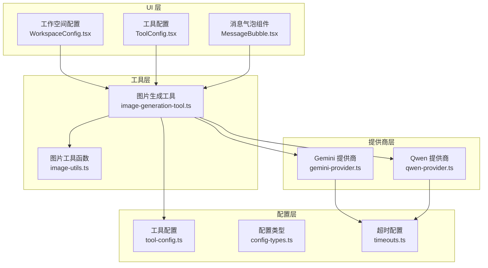
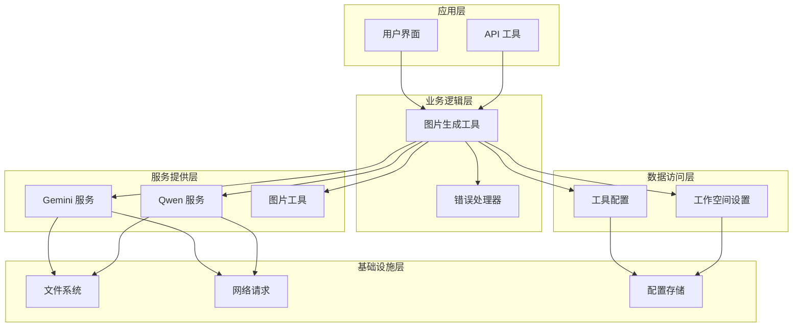
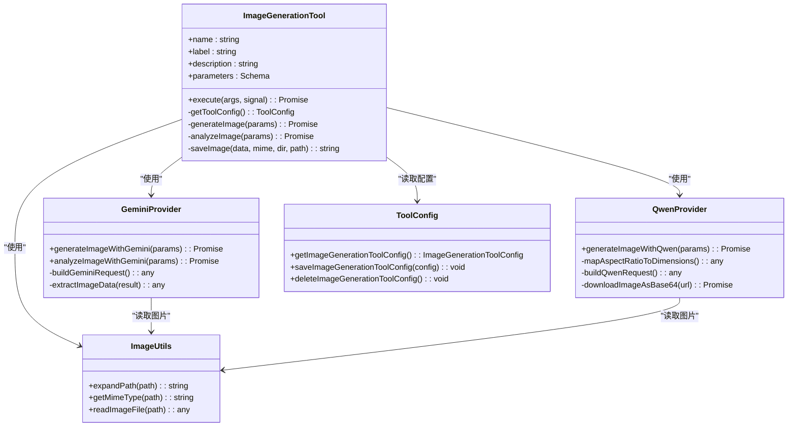
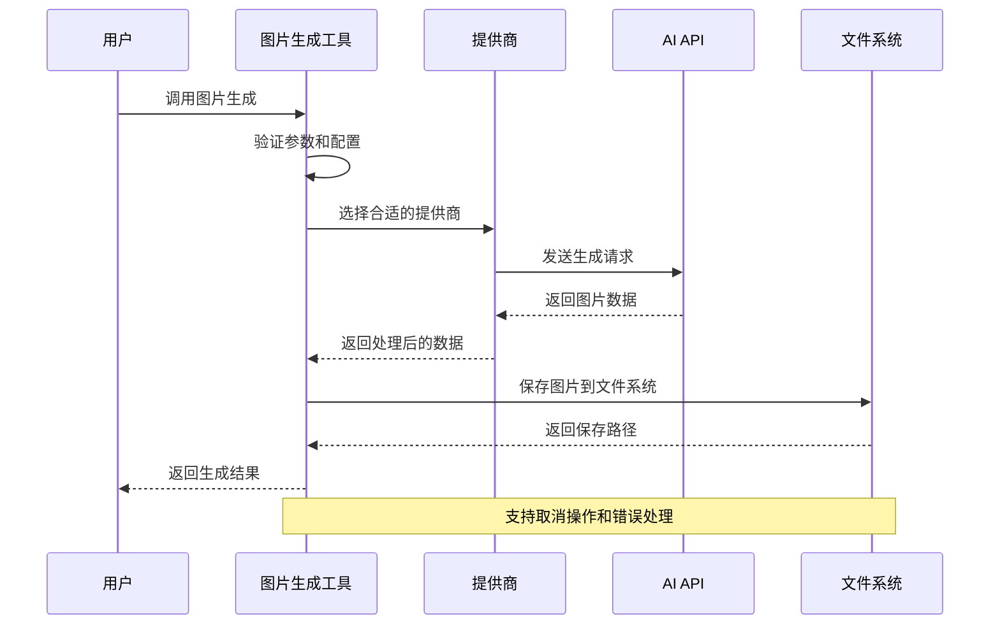
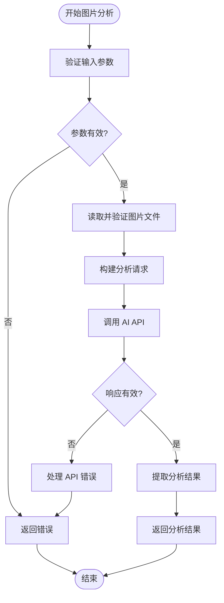
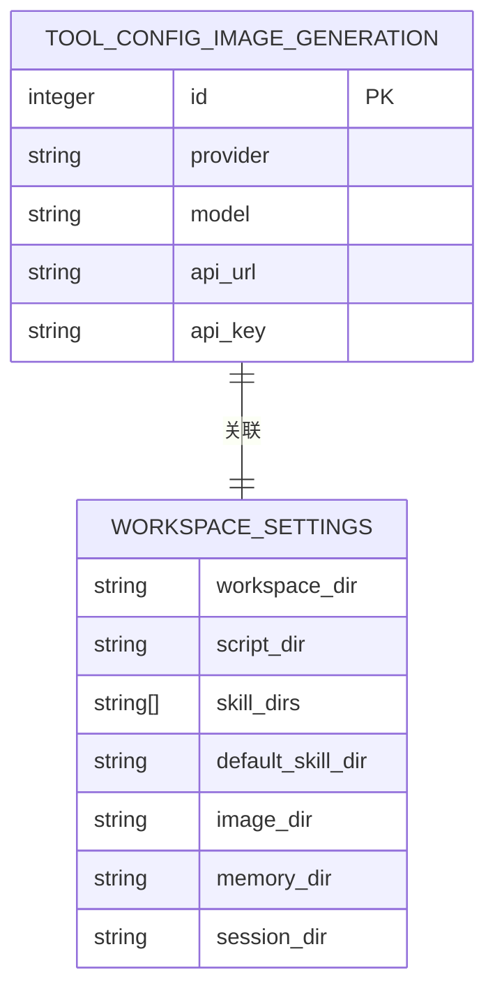
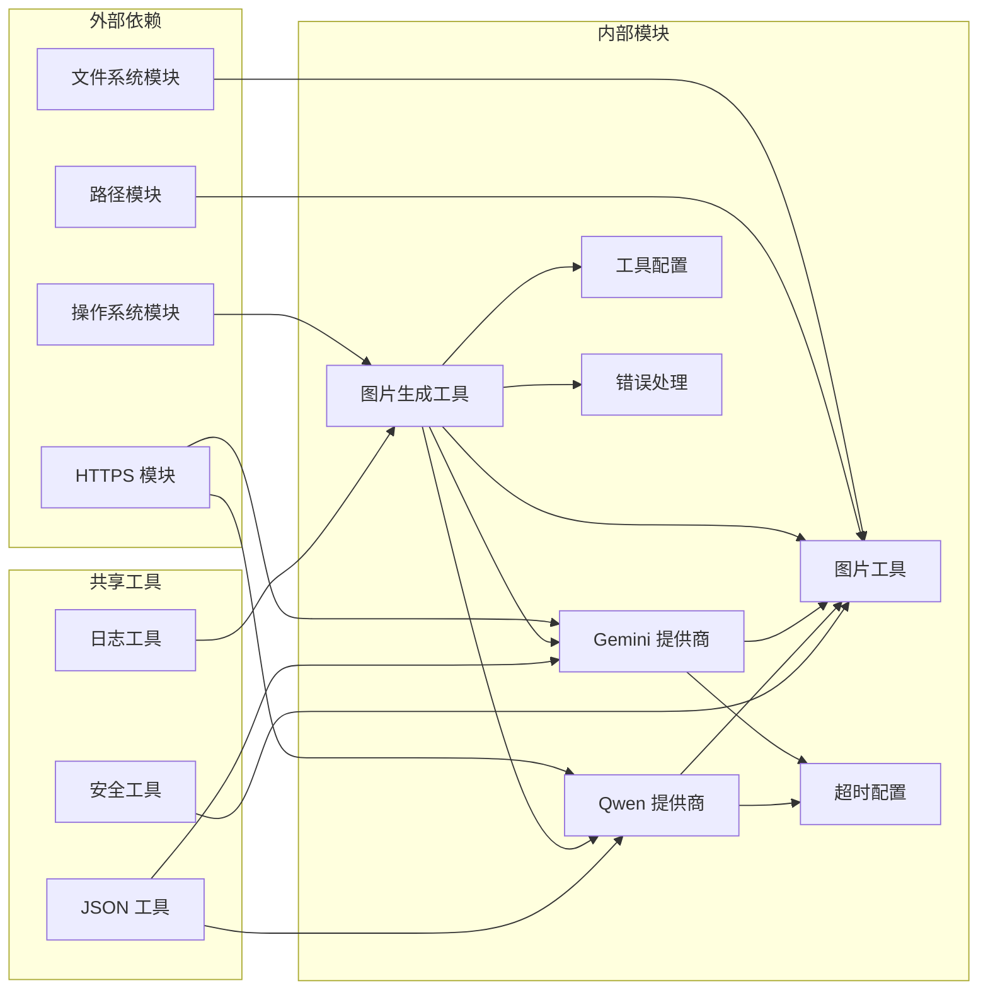

# 图片生成功能

<cite>
**本文档引用的文件**
- [src/main/tools/image-generation-tool.ts](file://src/main/tools/image-generation-tool.ts)
- [src/main/tools/providers/gemini-provider.ts](file://src/main/tools/providers/gemini-provider.ts)
- [src/main/tools/providers/qwen-provider.ts](file://src/main/tools/providers/qwen-provider.ts)
- [src/main/tools/providers/image-utils.ts](file://src/main/tools/providers/image-utils.ts)
- [src/main/database/tool-config.ts](file://src/main/database/tool-config.ts)
- [src/main/database/config-types.ts](file://src/main/database/config-types.ts)
- [src/main/config/timeouts.ts](file://src/main/config/timeouts.ts)
- [src/shared/utils/error-handler.ts](file://src/shared/utils/error-handler.ts)
- [src/main/tools/tool-names.ts](file://src/main/tools/tool-names.ts)
- [src/main/tools/api-tool.ts](file://src/main/tools/api-tool.ts)
- [src/renderer/components/settings/WorkspaceConfig.tsx](file://src/renderer/components/settings/WorkspaceConfig.tsx)
- [src/renderer/components/settings/ToolConfig.tsx](file://src/renderer/components/settings/ToolConfig.tsx)
- [src/renderer/components/MessageBubble.tsx](file://src/renderer/components/MessageBubble.tsx)
</cite>

## 目录
1. [简介](#简介)
2. [项目结构](#项目结构)
3. [核心组件](#核心组件)
4. [架构概览](#架构概览)
5. [详细组件分析](#详细组件分析)
6. [依赖关系分析](#依赖关系分析)
7. [性能考虑](#性能考虑)
8. [故障排除指南](#故障排除指南)
9. [结论](#结论)
10. [附录](#附录)

## 简介

DeepBot 的图片生成功能是一个强大的多提供商图像生成工具，支持基于 Gemini 和 Qwen 模型的图片生成服务。该功能提供了完整的图像生成、风格控制、尺寸调整等特性，包括：

- **多模型支持**：Gemini 3 Pro Image 和 Qwen-Image 系列模型
- **智能风格控制**：支持参考图片进行风格迁移和控制
- **灵活的尺寸调整**：支持多种宽高比和分辨率配置
- **安全的文件处理**：内置路径安全检查和文件验证
- **完善的错误处理**：支持取消操作和超时处理
- **用户友好的配置界面**：提供直观的设置和管理界面

## 项目结构

图片生成功能主要分布在以下目录结构中：



**图表来源**
- [src/main/tools/image-generation-tool.ts:1-364](file://src/main/tools/image-generation-tool.ts#L1-L364)
- [src/main/tools/providers/gemini-provider.ts:1-409](file://src/main/tools/providers/gemini-provider.ts#L1-L409)
- [src/main/tools/providers/qwen-provider.ts:1-310](file://src/main/tools/providers/qwen-provider.ts#L1-L310)

**章节来源**
- [src/main/tools/image-generation-tool.ts:1-364](file://src/main/tools/image-generation-tool.ts#L1-L364)
- [src/main/tools/providers/gemini-provider.ts:1-409](file://src/main/tools/providers/gemini-provider.ts#L1-L409)
- [src/main/tools/providers/qwen-provider.ts:1-310](file://src/main/tools/providers/qwen-provider.ts#L1-L310)

## 核心组件

### 图片生成工具主控制器

图片生成工具是整个功能的核心控制器，负责协调各个组件的工作。它提供了统一的接口来处理图片生成和分析请求。

**主要功能特性：**
- **多提供商支持**：自动识别并调用相应的提供商实现
- **参数验证**：严格的输入参数验证和类型检查
- **错误处理**：完整的异常捕获和错误信息处理
- **日志记录**：详细的执行过程日志记录
- **取消支持**：完整的 AbortSignal 支持

### Gemini 提供商实现

Gemini 提供商实现了 Google 的 Gemini 3 Pro Image 模型，提供了高级的图像生成和分析能力。

**关键特性：**
- **多模态支持**：同时支持图片和文本输出
- **风格控制**：通过参考图片实现精确的风格控制
- **高级配置**：支持温度、topK、topP 等高级参数
- **实时进度**：详细的下载进度监控

### Qwen 提供商实现

Qwen 提供商实现了阿里云的 Qwen-Image 系列模型，提供了高性能的图像生成服务。

**关键特性：**
- **多尺寸支持**：支持多种预定义的图像尺寸
- **参考图片**：支持单张参考图片进行风格迁移
- **同步 API**：使用高效的同步请求处理
- **智能下载**：自动处理 URL 和 Base64 格式的图片数据

**章节来源**
- [src/main/tools/image-generation-tool.ts:183-364](file://src/main/tools/image-generation-tool.ts#L183-L364)
- [src/main/tools/providers/gemini-provider.ts:21-255](file://src/main/tools/providers/gemini-provider.ts#L21-L255)
- [src/main/tools/providers/qwen-provider.ts:25-234](file://src/main/tools/providers/qwen-provider.ts#L25-L234)

## 架构概览

图片生成功能采用分层架构设计，确保了良好的模块化和可维护性：



**图表来源**
- [src/main/tools/image-generation-tool.ts:183-364](file://src/main/tools/image-generation-tool.ts#L183-L364)
- [src/main/tools/providers/gemini-provider.ts:1-409](file://src/main/tools/providers/gemini-provider.ts#L1-L409)
- [src/main/tools/providers/qwen-provider.ts:1-310](file://src/main/tools/providers/qwen-provider.ts#L1-L310)

## 详细组件分析

### 图片生成工具类图



**图表来源**
- [src/main/tools/image-generation-tool.ts:183-364](file://src/main/tools/image-generation-tool.ts#L183-L364)
- [src/main/tools/providers/gemini-provider.ts:21-255](file://src/main/tools/providers/gemini-provider.ts#L21-L255)
- [src/main/tools/providers/qwen-provider.ts:25-234](file://src/main/tools/providers/qwen-provider.ts#L25-L234)
- [src/main/tools/providers/image-utils.ts:1-84](file://src/main/tools/providers/image-utils.ts#L1-L84)
- [src/main/database/tool-config.ts:13-55](file://src/main/database/tool-config.ts#L13-L55)

### 图片生成流程序列图



**图表来源**
- [src/main/tools/image-generation-tool.ts:286-308](file://src/main/tools/image-generation-tool.ts#L286-L308)
- [src/main/tools/providers/gemini-provider.ts:130-208](file://src/main/tools/providers/gemini-provider.ts#L130-L208)
- [src/main/tools/providers/qwen-provider.ts:123-187](file://src/main/tools/providers/qwen-provider.ts#L123-L187)

### 图片分析流程流程图



**图表来源**
- [src/main/tools/image-generation-tool.ts:218-262](file://src/main/tools/image-generation-tool.ts#L218-L262)
- [src/main/tools/providers/gemini-provider.ts:258-409](file://src/main/tools/providers/gemini-provider.ts#L258-L409)

**章节来源**
- [src/main/tools/image-generation-tool.ts:114-178](file://src/main/tools/image-generation-tool.ts#L114-L178)
- [src/main/tools/providers/gemini-provider.ts:18-409](file://src/main/tools/providers/gemini-provider.ts#L18-L409)
- [src/main/tools/providers/qwen-provider.ts:22-310](file://src/main/tools/providers/qwen-provider.ts#L22-L310)

### 配置管理系统

图片生成功能的配置管理采用了 SQLite 数据库存储，提供了灵活的配置管理能力：



**图表来源**
- [src/main/database/tool-config.ts:13-55](file://src/main/database/tool-config.ts#L13-L55)
- [src/main/database/config-types.ts:21-29](file://src/main/database/config-types.ts#L21-L29)

**章节来源**
- [src/main/database/tool-config.ts:1-128](file://src/main/database/tool-config.ts#L1-L128)
- [src/main/database/config-types.ts:48-67](file://src/main/database/config-types.ts#L48-L67)

## 依赖关系分析

图片生成功能的依赖关系展现了清晰的分层架构：



**图表来源**
- [src/main/tools/image-generation-tool.ts:9-21](file://src/main/tools/image-generation-tool.ts#L9-L21)
- [src/main/tools/providers/gemini-provider.ts:7-11](file://src/main/tools/providers/gemini-provider.ts#L7-L11)
- [src/main/tools/providers/qwen-provider.ts:11-15](file://src/main/tools/providers/qwen-provider.ts#L11-L15)

**章节来源**
- [src/main/tools/image-generation-tool.ts:1-364](file://src/main/tools/image-generation-tool.ts#L1-L364)
- [src/main/tools/providers/gemini-provider.ts:1-409](file://src/main/tools/providers/gemini-provider.ts#L1-L409)
- [src/main/tools/providers/qwen-provider.ts:1-310](file://src/main/tools/providers/qwen-provider.ts#L1-L310)

## 性能考虑

### 超时管理和取消支持

图片生成功能实现了完善的超时管理和取消支持机制：

- **软超时机制**：使用 AbortSignal 实现优雅的取消操作
- **多级超时**：针对不同操作设置适当的超时时间
- **资源清理**：确保在取消时正确释放网络连接和文件句柄

### 缓存策略

虽然图片生成功能本身不实现复杂的缓存机制，但通过以下方式优化性能：

- **文件系统缓存**：利用操作系统的文件系统缓存
- **连接复用**：复用 HTTPS 连接减少握手开销
- **批量处理**：支持批量生成多个图片

### 错误恢复

系统实现了多层次的错误恢复机制：

- **网络重试**：对于临时网络错误提供重试机会
- **降级处理**：在部分功能不可用时提供降级方案
- **状态恢复**：确保操作中断后能够正确恢复状态

**章节来源**
- [src/main/config/timeouts.ts:38-39](file://src/main/config/timeouts.ts#L38-L39)
- [src/shared/utils/error-handler.ts:1-51](file://src/shared/utils/error-handler.ts#L1-L51)

## 故障排除指南

### 常见问题和解决方案

#### API 配置问题
- **症状**：工具无法初始化或抛出配置错误
- **原因**：缺少必要的 API Key 或 API 地址
- **解决**：检查系统设置中的工具配置，确保所有必需字段都已正确填写

#### 网络连接问题
- **症状**：请求超时或连接失败
- **原因**：网络不稳定或代理设置问题
- **解决**：检查网络连接，验证代理设置，适当增加超时时间

#### 文件权限问题
- **症状**：无法读取参考图片或保存生成的图片
- **原因**：文件路径不正确或权限不足
- **解决**：验证文件路径的有效性，检查文件权限设置

#### 内存不足问题
- **症状**：大尺寸图片生成时出现内存溢出
- **原因**：图片尺寸过大或系统内存不足
- **解决**：降低图片分辨率或尺寸，释放系统内存

### 调试技巧

#### 日志分析
系统提供了详细的日志记录，包括：
- API 请求和响应的详细信息
- 文件操作的执行过程
- 错误发生的具体位置和原因

#### 性能监控
- 监控 API 响应时间
- 跟踪文件下载进度
- 分析内存使用情况

**章节来源**
- [src/main/tools/image-generation-tool.ts:340-364](file://src/main/tools/image-generation-tool.ts#L340-L364)
- [src/shared/utils/error-handler.ts:39-51](file://src/shared/utils/error-handler.ts#L39-L51)

## 结论

DeepBot 的图片生成功能通过精心设计的架构和实现，提供了强大而灵活的图像生成能力。其主要优势包括：

1. **多提供商支持**：同时支持 Gemini 和 Qwen 两大主流 AI 模型
2. **灵活的配置管理**：通过 SQLite 数据库实现灵活的配置存储
3. **完善的安全机制**：内置路径安全检查和文件验证
4. **优秀的用户体验**：提供直观的配置界面和详细的反馈信息
5. **可靠的错误处理**：实现多层次的错误捕获和恢复机制

该功能为用户提供了从简单图片生成到复杂风格控制的完整解决方案，适用于各种应用场景，从个人创作到商业应用都能满足需求。

## 附录

### 使用示例

#### 基本图片生成
```javascript
// 简单的图片生成请求
{
  "action": "generate",
  "prompt": "美丽的风景画，夕阳西下",
  "aspectRatio": "16:9",
  "resolution": "2K"
}
```

#### 风格控制生成
```javascript
// 使用参考图片进行风格控制
{
  "action": "generate",
  "prompt": "现代城市夜景",
  "referenceImages": ["~/images/style-reference.jpg"],
  "aspectRatio": "4:3",
  "resolution": "1K"
}
```

#### 图片分析
```javascript
// 分析现有图片的内容和风格
{
  "action": "analyze",
  "imagePath": "~/images/target-image.jpg",
  "analysisPrompt": "请分析图片中的主要元素和艺术风格"
}
```

### 配置选项说明

#### 工具配置参数
- **provider**: AI 模型提供商（'gemini' 或 'qwen'）
- **model**: 具体的模型名称
- **apiUrl**: API 服务地址
- **apiKey**: 认证密钥

#### 图片生成参数
- **action**: 操作类型（'generate' 或 'analyze'）
- **prompt**: 图片生成的描述性文本
- **aspectRatio**: 图片宽高比（支持多种标准比例）
- **resolution**: 图片分辨率（1K/2K/4K）
- **referenceImages**: 参考图片路径数组（最多5张）

### 最佳实践建议

1. **合理设置分辨率**：根据用途选择合适的分辨率，平衡质量和性能
2. **优化提示词**：提供详细而具体的描述性文本
3. **使用参考图片**：通过参考图片实现精确的风格控制
4. **监控资源使用**：注意内存和磁盘空间的使用情况
5. **定期更新配置**：及时更新 API 密钥和模型版本