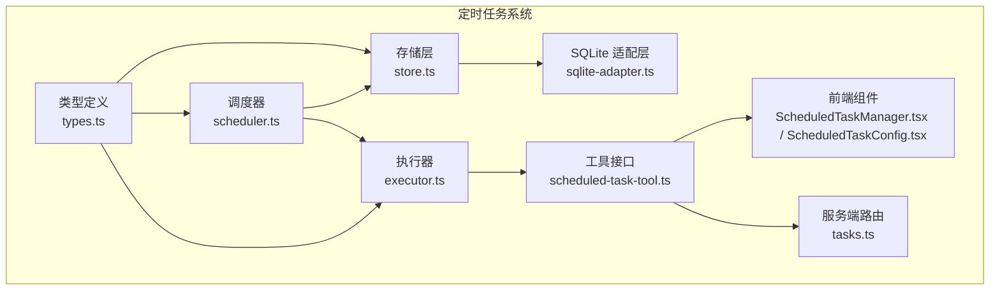
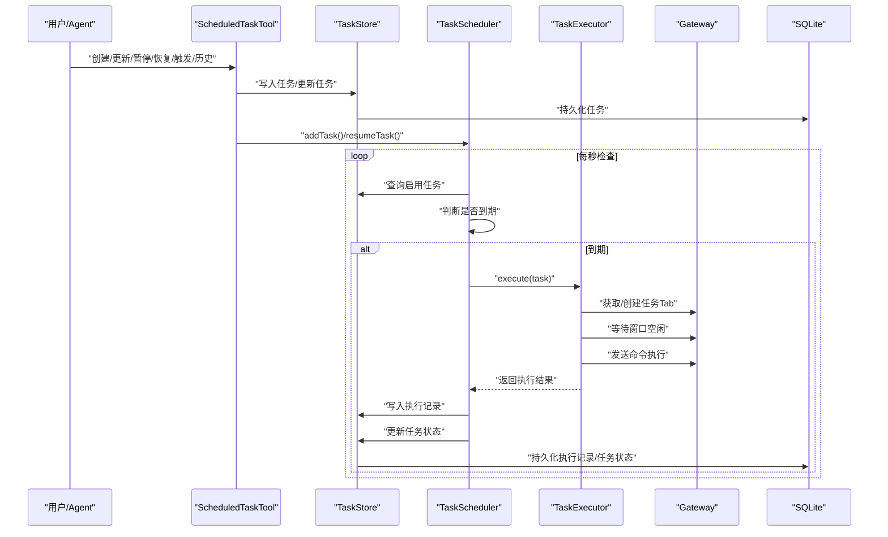
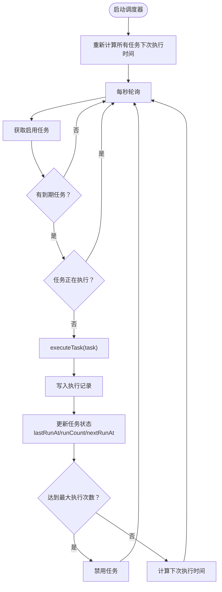
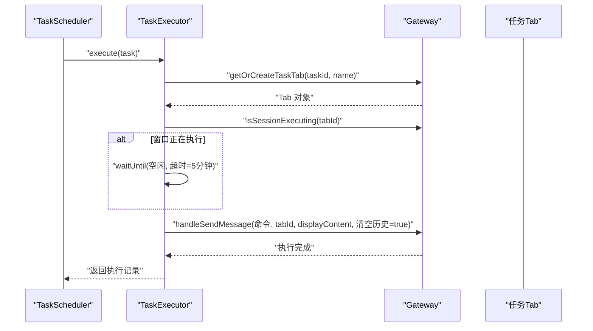
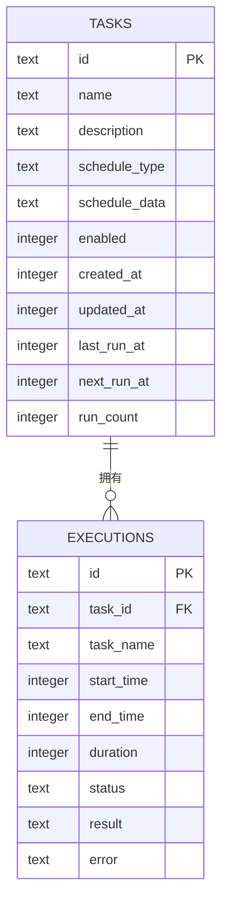
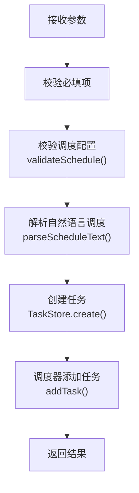
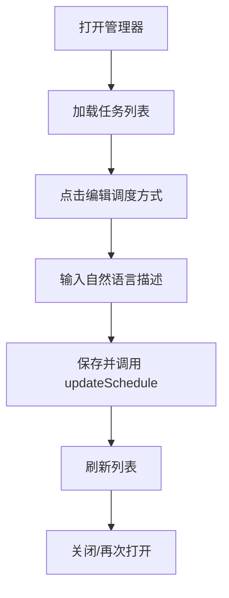
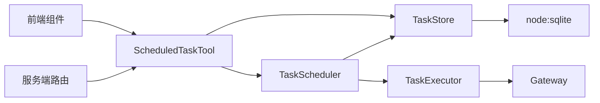

# 定时任务工具

<cite>
**本文档引用的文件**
- [index.ts](file://src/main/scheduled-tasks/index.ts)
- [scheduler.ts](file://src/main/scheduled-tasks/scheduler.ts)
- [executor.ts](file://src/main/scheduled-tasks/executor.ts)
- [store.ts](file://src/main/scheduled-tasks/store.ts)
- [types.ts](file://src/main/scheduled-tasks/types.ts)
- [scheduled-task-tool.ts](file://src/main/tools/scheduled-task-tool.ts)
- [ScheduledTaskManager.tsx](file://src/renderer/components/ScheduledTaskManager.tsx)
- [ScheduledTaskConfig.tsx](file://src/renderer/components/settings/ScheduledTaskConfig.tsx)
- [tasks.ts](file://src/server/routes/tasks.ts)
- [sqlite-adapter.ts](file://src/shared/utils/sqlite-adapter.ts)
</cite>

## 目录
1. [简介](#简介)
2. [项目结构](#项目结构)
3. [核心组件](#核心组件)
4. [架构总览](#架构总览)
5. [详细组件分析](#详细组件分析)
6. [依赖关系分析](#依赖关系分析)
7. [性能考量](#性能考量)
8. [故障排查指南](#故障排查指南)
9. [结论](#结论)
10. [附录](#附录)

## 简介
本文件为 史丽慧小助理 定时任务工具的全面技术文档，围绕基于 Cron 表达式的任务调度实现进行深入解析。内容涵盖任务创建、执行监控、历史记录、Cron 表达式解析、任务队列管理、执行状态跟踪、失败处理与重试策略、性能监控与优化建议等。文档同时提供使用示例、表达式编写指南与任务管理策略，并包含常见问题的排查方法。

## 项目结构
定时任务系统位于主进程模块 src/main/scheduled-tasks 下，采用分层设计：
- 类型定义层：统一的任务与调度类型规范
- 存储层：基于 SQLite 的持久化存储与查询
- 执行器层：负责在专用 Tab 中执行任务
- 调度器层：定时检查与触发任务
- 工具层：对外暴露的 Agent 工具接口
- 前端组件：可视化管理界面
- 服务端路由：Web API 接入

**图表来源**
- [types.ts:1-86](file://src/main/scheduled-tasks/types.ts#L1-L86)
- [store.ts:1-364](file://src/main/scheduled-tasks/store.ts#L1-L364)
- [executor.ts:1-170](file://src/main/scheduled-tasks/executor.ts#L1-L170)
- [scheduler.ts:1-322](file://src/main/scheduled-tasks/scheduler.ts#L1-L322)
- [scheduled-task-tool.ts:1-628](file://src/main/tools/scheduled-task-tool.ts#L1-L628)
- [ScheduledTaskManager.tsx:1-571](file://src/renderer/components/ScheduledTaskManager.tsx#L1-L571)
- [ScheduledTaskConfig.tsx:1-358](file://src/renderer/components/settings/ScheduledTaskConfig.tsx#L1-L358)
- [tasks.ts:1-33](file://src/server/routes/tasks.ts#L1-L33)
- [sqlite-adapter.ts:1-62](file://src/shared/utils/sqlite-adapter.ts#L1-L62)

**章节来源**
- [index.ts:1-9](file://src/main/scheduled-tasks/index.ts#L1-L9)
- [types.ts:1-86](file://src/main/scheduled-tasks/types.ts#L1-L86)

## 核心组件
- 类型定义：统一的任务、调度配置、执行记录与过滤器的接口规范，确保各层数据一致性。
- 存储层：封装 SQLite 数据库访问，提供任务与执行记录的增删改查、索引与清理。
- 执行器：在专用 Tab 中执行任务，支持等待窗口空闲、构建任务命令、记录执行结果与错误。
- 调度器：按秒级轮询检查任务到期情况，支持一次性、周期性与 Cron 三种调度类型，自动更新下次执行时间与执行计数。
- 工具接口：对外提供 Agent 工具，支持创建、列表、更新、暂停/恢复、手动触发、查看历史等操作。
- 前端组件：提供可视化的任务管理界面，支持编辑任务内容、调度方式、暂停/恢复、立即执行与删除。
- 服务端路由：提供 Web API，转发请求至工具接口。

**章节来源**
- [types.ts:1-86](file://src/main/scheduled-tasks/types.ts#L1-L86)
- [store.ts:1-364](file://src/main/scheduled-tasks/store.ts#L1-L364)
- [executor.ts:1-170](file://src/main/scheduled-tasks/executor.ts#L1-L170)
- [scheduler.ts:1-322](file://src/main/scheduled-tasks/scheduler.ts#L1-L322)
- [scheduled-task-tool.ts:1-628](file://src/main/tools/scheduled-task-tool.ts#L1-L628)
- [ScheduledTaskManager.tsx:1-571](file://src/renderer/components/ScheduledTaskManager.tsx#L1-L571)
- [ScheduledTaskConfig.tsx:1-358](file://src/renderer/components/settings/ScheduledTaskConfig.tsx#L1-L358)
- [tasks.ts:1-33](file://src/server/routes/tasks.ts#L1-L33)

## 架构总览
定时任务系统的运行流程如下：
- 工具接口接收外部请求（Agent 或 Web），校验参数并调用存储层创建/更新任务。
- 调度器启动后，按秒轮询检查启用任务的到期时间，触发执行器执行任务。
- 执行器在专用 Tab 中执行任务，等待窗口空闲后发送命令，记录执行结果。
- 执行完成后，调度器更新任务状态（上次执行时间、下次执行时间、执行次数），必要时禁用任务。
- 存储层持久化任务与执行记录，支持历史查询与定期清理。

**图表来源**
- [scheduled-task-tool.ts:171-494](file://src/main/tools/scheduled-task-tool.ts#L171-L494)
- [store.ts:133-230](file://src/main/scheduled-tasks/store.ts#L133-L230)
- [scheduler.ts:131-240](file://src/main/scheduled-tasks/scheduler.ts#L131-L240)
- [executor.ts:21-153](file://src/main/scheduled-tasks/executor.ts#L21-L153)
- [sqlite-adapter.ts:14-62](file://src/shared/utils/sqlite-adapter.ts#L14-L62)

## 详细组件分析

### 调度器（TaskScheduler）
- 职责：启动/停止调度器、添加/删除/暂停/恢复任务、手动触发任务、按秒轮询检查到期任务并执行。
- 关键机制：
  - 每秒轮询：通过定时器检查启用任务的 nextRunAt。
  - 并发控制：使用 Set 标记正在执行的任务 ID，避免并发重复执行。
  - 状态更新：执行完成后更新 lastRunAt、runCount，并根据 maxRuns 自动禁用任务；一次性任务执行后自动禁用。
  - Cron 解析：使用 cron 库解析表达式，支持时区配置。
  - 间隔保护：周期性任务最小间隔为 10 秒，低于阈值自动调整。
- 执行流程图：

**图表来源**
- [scheduler.ts:29-240](file://src/main/scheduled-tasks/scheduler.ts#L29-L240)

**章节来源**
- [scheduler.ts:12-322](file://src/main/scheduled-tasks/scheduler.ts#L12-L322)

### 执行器（TaskExecutor）
- 职责：在专用 Tab 中执行任务，等待窗口空闲，发送命令执行，记录执行结果与错误。
- 关键机制：
  - 专用 Tab：通过 Gateway 获取或创建任务专属 Tab，复用同一 Tab。
  - 等待空闲：使用等待工具等待窗口空闲，超时时间为 5 分钟。
  - 命令构建：为 AI 提供明确的“定时任务执行”前缀，避免歧义。
  - 结果记录：返回执行记录对象，包含开始/结束时间、耗时、状态、结果或错误。
- 执行序列图：

**图表来源**
- [executor.ts:86-153](file://src/main/scheduled-tasks/executor.ts#L86-L153)

**章节来源**
- [executor.ts:17-170](file://src/main/scheduled-tasks/executor.ts#L17-L170)

### 存储层（TaskStore）
- 职责：任务与执行记录的持久化存储，提供 CRUD、列表、历史查询与清理。
- 数据库设计：
  - 任务表：id、name、description、schedule_type、schedule_data、enabled、created_at、updated_at、last_run_at、next_run_at、run_count。
  - 执行记录表：id、task_id、task_name、start_time、end_time、duration、status、result、error。
  - 索引：tasks.enabled、tasks.next_run_at、executions.task_id。
- 关键能力：
  - 单例模式：保证全局唯一数据库连接。
  - WAL 模式：提升并发写入性能。
  - 清理策略：按天数清理过期执行记录，默认 30 天。
- 数据模型图：

**图表来源**
- [store.ts:88-128](file://src/main/scheduled-tasks/store.ts#L88-L128)

**章节来源**
- [store.ts:23-364](file://src/main/scheduled-tasks/store.ts#L23-L364)
- [sqlite-adapter.ts:14-62](file://src/shared/utils/sqlite-adapter.ts#L14-L62)

### 工具接口（ScheduledTaskTool）
- 职责：对外提供 Agent 工具，支持创建、列表、更新、暂停/恢复、手动触发、查看历史等操作。
- 关键机制：
  - 参数校验：对调度配置进行严格校验，支持 Cron 表达式格式简单校验与最小间隔保护。
  - 自然语言解析：支持“每隔X秒/分钟/小时”、“每天X点”、“Cron表达式：...”等自然语言描述，自动解析为调度配置。
  - 任务数量限制：最多允许创建 10 个定时任务。
  - 异步启动：调度器异步启动，带重试机制，避免阻塞初始化。
- 操作流程（以创建任务为例）：

**图表来源**
- [scheduled-task-tool.ts:180-220](file://src/main/tools/scheduled-task-tool.ts#L180-L220)
- [scheduled-task-tool.ts:499-538](file://src/main/tools/scheduled-task-tool.ts#L499-L538)
- [scheduled-task-tool.ts:550-615](file://src/main/tools/scheduled-task-tool.ts#L550-L615)

**章节来源**
- [scheduled-task-tool.ts:128-494](file://src/main/tools/scheduled-task-tool.ts#L128-L494)

### 前端组件（ScheduledTaskManager / ScheduledTaskConfig）
- 职责：提供可视化的任务管理界面，支持编辑任务内容、调度方式、暂停/恢复、立即执行与删除。
- 关键机制：
  - 列表加载：通过 API 调用工具接口获取任务列表。
  - 编辑与保存：支持编辑任务描述与调度方式，保存时调用工具接口更新。
  - 状态切换：暂停/恢复任务，立即执行任务。
  - 刷新策略：仅在有启用任务时按 30 秒刷新，降低前端压力。
- 界面交互流程（编辑调度方式）：

**图表来源**
- [ScheduledTaskManager.tsx:108-147](file://src/renderer/components/ScheduledTaskManager.tsx#L108-L147)
- [ScheduledTaskConfig.tsx:82-124](file://src/renderer/components/settings/ScheduledTaskConfig.tsx#L82-L124)

**章节来源**
- [ScheduledTaskManager.tsx:41-571](file://src/renderer/components/ScheduledTaskManager.tsx#L41-L571)
- [ScheduledTaskConfig.tsx:36-358](file://src/renderer/components/settings/ScheduledTaskConfig.tsx#L36-L358)

### 服务端路由（tasks.ts）
- 职责：提供 Web API，接收请求并转发至工具接口，返回统一响应。
- 关键机制：
  - POST /api/tasks：接收任务操作请求，调用 gatewayAdapter.scheduledTask()。
  - 错误处理：捕获异常并返回标准错误信息。

**章节来源**
- [tasks.ts:9-33](file://src/server/routes/tasks.ts#L9-L33)

## 依赖关系分析
- 组件耦合：
  - 调度器依赖存储层与执行器，形成“调度-执行-存储”的闭环。
  - 工具接口依赖存储层与调度器，向外部提供统一入口。
  - 前端组件与服务端路由通过 API 间接依赖工具接口。
- 外部依赖：
  - cron 库：用于 Cron 表达式解析与下一次执行时间计算。
  - node:sqlite：作为 SQLite 适配层，提供与 better-sqlite3 兼容的 API。
- 循环依赖：
  - 未发现循环依赖，模块职责清晰，接口边界明确。

**图表来源**
- [scheduled-task-tool.ts:101-119](file://src/main/tools/scheduled-task-tool.ts#L101-L119)
- [scheduler.ts:21-24](file://src/main/scheduled-tasks/scheduler.ts#L21-L24)
- [executor.ts:10-15](file://src/main/scheduled-tasks/executor.ts#L10-L15)
- [store.ts:6-14](file://src/main/scheduled-tasks/store.ts#L6-L14)
- [tasks.ts:9-27](file://src/server/routes/tasks.ts#L9-L27)

**章节来源**
- [scheduler.ts:7-10](file://src/main/scheduled-tasks/scheduler.ts#L7-L10)
- [executor.ts:7-11](file://src/main/scheduled-tasks/executor.ts#L7-L11)
- [store.ts:7-14](file://src/main/scheduled-tasks/store.ts#L7-L14)
- [sqlite-adapter.ts:8-19](file://src/shared/utils/sqlite-adapter.ts#L8-L19)

## 性能考量
- 轮询频率：调度器每秒轮询一次，适合中小规模任务；若任务量较大，可考虑优化为事件驱动或更高效的调度算法。
- 并发控制：通过 Set 标记正在执行的任务，避免重复执行；执行器等待窗口空闲最多 5 分钟，防止死锁。
- 数据库性能：
  - 使用 WAL 模式提升写入吞吐。
  - 为 tasks.enabled 与 tasks.next_run_at 建立索引，加速查询。
  - 定期清理过期执行记录，默认保留 30 天，避免表膨胀。
- 任务数量限制：最多 10 个任务，避免资源过度占用。
- 前端刷新策略：仅在有启用任务时按 30 秒刷新，降低网络与渲染压力。

[本节为通用性能指导，无需特定文件来源]

## 故障排查指南
- Cron 表达式无效：
  - 现象：调度器日志报错“Invalid cron expression”，任务未被计算下次执行时间。
  - 处理：检查表达式格式，确保字段数量正确；必要时指定时区。
  - 参考：[scheduler.ts:284-296](file://src/main/scheduled-tasks/scheduler.ts#L284-L296)
- 任务未执行：
  - 现象：任务到期但未执行。
  - 排查：确认任务处于启用状态；检查调度器是否正常运行；查看执行器等待窗口空闲是否超时。
  - 参考：[scheduler.ts:131-151](file://src/main/scheduled-tasks/scheduler.ts#L131-L151)，[executor.ts:97-129](file://src/main/scheduled-tasks/executor.ts#L97-L129)
- 执行记录缺失：
  - 现象：历史记录为空或不完整。
  - 排查：确认执行器返回的执行记录已写入；检查数据库连接与 WAL 文件状态；定期清理策略是否过短。
  - 参考：[store.ts:278-297](file://src/main/scheduled-tasks/store.ts#L278-L297)，[store.ts:328-337](file://src/main/scheduled-tasks/store.ts#L328-L337)
- 任务被意外禁用：
  - 现象：达到最大执行次数后任务自动禁用。
  - 处理：检查 schedule.maxRuns 配置；如需继续执行，更新任务配置或删除 maxRuns。
  - 参考：[scheduler.ts:198-212](file://src/main/scheduled-tasks/scheduler.ts#L198-L212)
- 前端无法加载任务：
  - 现象：管理器显示“加载中”或空列表。
  - 排查：确认服务端路由可用；检查工具接口返回；查看浏览器网络面板。
  - 参考：[ScheduledTaskManager.tsx:51-66](file://src/renderer/components/ScheduledTaskManager.tsx#L51-L66)，[tasks.ts:16-27](file://src/server/routes/tasks.ts#L16-L27)

**章节来源**
- [scheduler.ts:284-296](file://src/main/scheduled-tasks/scheduler.ts#L284-L296)
- [executor.ts:97-129](file://src/main/scheduled-tasks/executor.ts#L97-L129)
- [store.ts:278-297](file://src/main/scheduled-tasks/store.ts#L278-L297)
- [store.ts:328-337](file://src/main/scheduled-tasks/store.ts#L328-L337)
- [ScheduledTaskManager.tsx:51-66](file://src/renderer/components/ScheduledTaskManager.tsx#L51-L66)
- [tasks.ts:16-27](file://src/server/routes/tasks.ts#L16-L27)

## 结论
史丽慧小助理 的定时任务工具通过清晰的分层设计与完善的生命周期管理，实现了对一次性、周期性与 Cron 表达式任务的稳定调度。其核心优势包括：
- 明确的类型约束与存储模型，确保数据一致性。
- 周期性与 Cron 调度的灵活支持，满足多样场景。
- 专用 Tab 执行与并发控制，保障执行稳定性。
- 丰富的前端管理界面与 Web API，便于用户与系统集成。
建议在生产环境中结合业务规模评估轮询频率与数据库清理策略，并持续监控执行记录与错误日志，以确保系统长期稳定运行。

[本节为总结性内容，无需特定文件来源]

## 附录

### 使用示例与最佳实践
- 创建一次性任务：通过工具接口传入 schedule.type='once' 与 executeAt 时间戳。
- 创建周期性任务：传入 schedule.type='interval' 与 intervalMs（最小 10 秒）。
- 创建 Cron 任务：传入 schedule.type='cron' 与 cronExpr，可选 timezone。
- 自然语言调度：使用 updateSchedule 操作，输入如“每隔10秒”、“每天早上9点”、“Cron表达式：0 9 * * *”等。
- 任务管理策略：
  - 控制任务数量（最多 10 个）。
  - 合理设置 maxRuns，避免无限执行。
  - 使用暂停/恢复功能临时停止任务。
  - 定期清理历史记录，保持数据库健康。

**章节来源**
- [scheduled-task-tool.ts:180-220](file://src/main/tools/scheduled-task-tool.ts#L180-L220)
- [scheduled-task-tool.ts:365-403](file://src/main/tools/scheduled-task-tool.ts#L365-L403)
- [scheduled-task-tool.ts:550-615](file://src/main/tools/scheduled-task-tool.ts#L550-L615)

### Cron 表达式编写指南
- 字段顺序：秒 分 时 日 月 周（可选年份字段）。
- 常用模式：
  - 每天固定时间：0 9 * * *（每天 9:00）
  - 每隔固定分钟：*/5 * * * *（每 5 分钟）
  - 工作日：0 9 * * 1-5（周一到周五 9:00）
  - 每周固定某天：0 9 * * 1（每周一 9:00）
- 时区：默认 Asia/Shanghai，可通过 timezone 指定。
- 校验：工具接口对表达式格式进行简单校验，复杂错误由调度器捕获。

**章节来源**
- [scheduled-task-tool.ts:524-533](file://src/main/tools/scheduled-task-tool.ts#L524-L533)
- [scheduler.ts:284-296](file://src/main/scheduled-tasks/scheduler.ts#L284-L296)

### 执行状态跟踪与历史记录
- 执行记录字段：id、taskId、taskName、startTime、endTime、duration、status、result、error。
- 历史查询：支持按任务 ID 查询最近 N 条记录，默认 10 条。
- 清理策略：按天数清理过期记录，默认 30 天。

**章节来源**
- [types.ts:45-55](file://src/main/scheduled-tasks/types.ts#L45-L55)
- [store.ts:302-323](file://src/main/scheduled-tasks/store.ts#L302-L323)
- [store.ts:328-337](file://src/main/scheduled-tasks/store.ts#L328-L337)