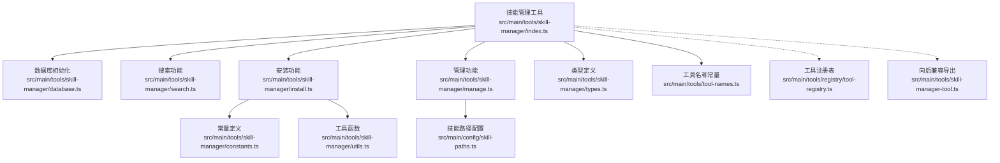
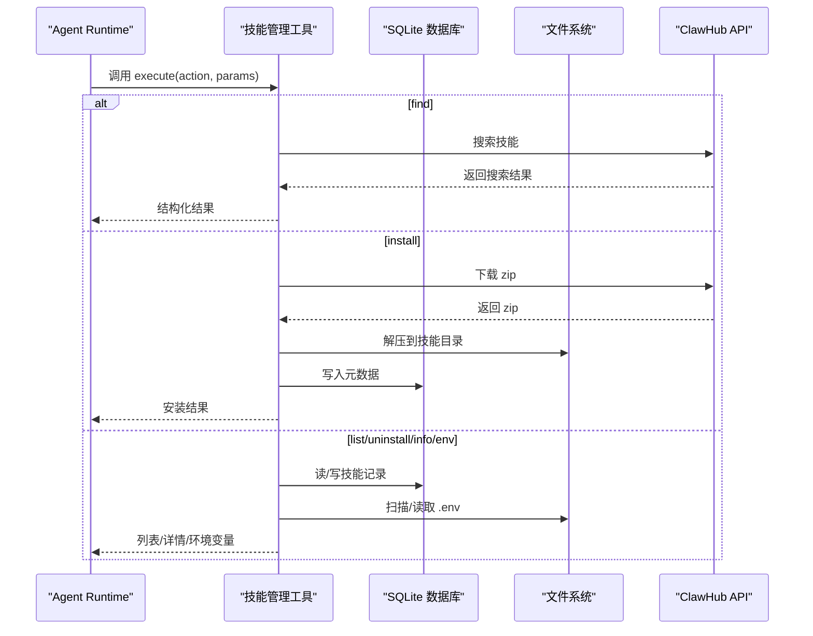
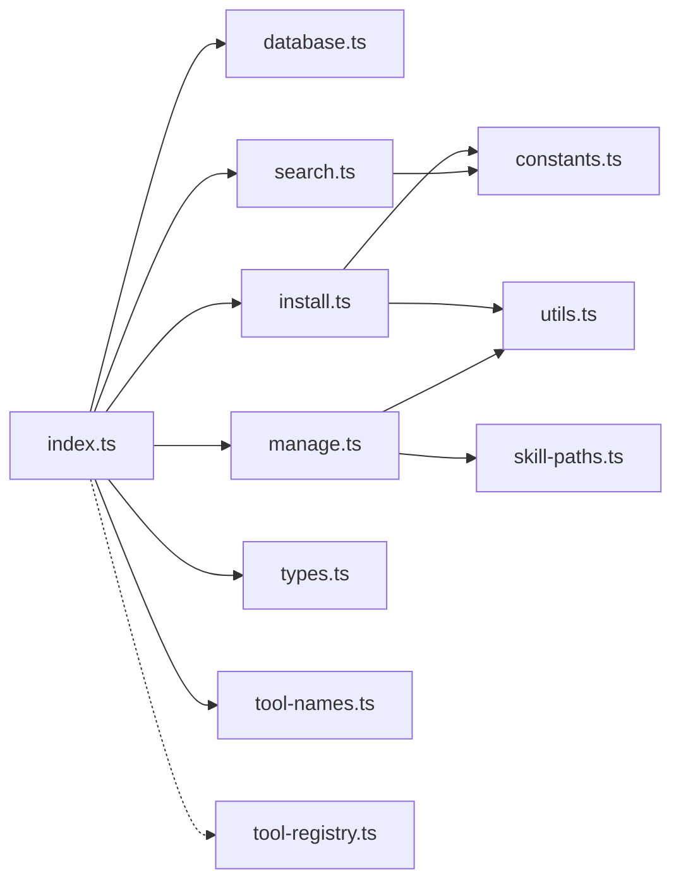
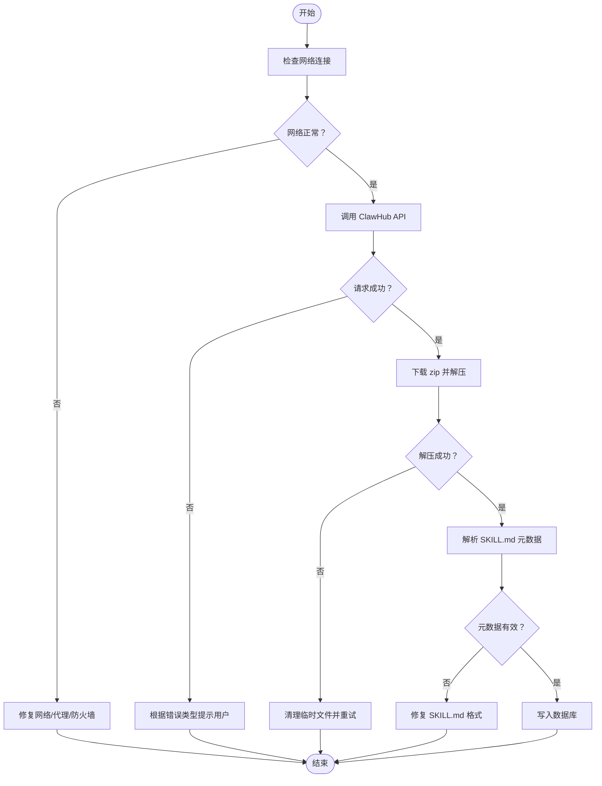

# 技能管理工具

<cite>
**本文引用的文件**
- [src/main/tools/skill-manager/index.ts](file://src/main/tools/skill-manager/index.ts)
- [src/main/tools/skill-manager/manage.ts](file://src/main/tools/skill-manager/manage.ts)
- [src/main/tools/skill-manager/install.ts](file://src/main/tools/skill-manager/install.ts)
- [src/main/tools/skill-manager/search.ts](file://src/main/tools/skill-manager/search.ts)
- [src/main/tools/skill-manager/types.ts](file://src/main/tools/skill-manager/types.ts)
- [src/main/tools/skill-manager/constants.ts](file://src/main/tools/skill-manager/constants.ts)
- [src/main/tools/skill-manager/utils.ts](file://src/main/tools/skill-manager/utils.ts)
- [src/main/tools/skill-manager/database.ts](file://src/main/tools/skill-manager/database.ts)
- [src/main/config/skill-paths.ts](file://src/main/config/skill-paths.ts)
- [src/main/tools/tool-names.ts](file://src/main/tools/tool-names.ts)
- [src/main/tools/registry/tool-registry.ts](file://src/main/tools/registry/tool-registry.ts)
- [src/main/tools/skill-manager-tool.ts](file://src/main/tools/skill-manager-tool.ts)
- [README.md](file://README.md)
- [node_modules/agent-browser/skills/agent-browser/SKILL.md](file://node_modules/agent-browser/skills/agent-browser/SKILL.md)
- [node_modules/agent-browser/skills/dogfood/SKILL.md](file://node_modules/agent-browser/skills/dogfood/SKILL.md)
</cite>

## 目录
1. [简介](#简介)
2. [项目结构](#项目结构)
3. [核心组件](#核心组件)
4. [架构总览](#架构总览)
5. [详细组件分析](#详细组件分析)
6. [依赖关系分析](#依赖关系分析)
7. [性能考虑](#性能考虑)
8. [故障排查指南](#故障排查指南)
9. [结论](#结论)
10. [附录](#附录)

## 简介
本文件为 史丽慧小助理 技能管理工具的功能文档，围绕基于 Skills 的复杂功能组合实现，系统阐述技能的安装、卸载、搜索、管理、环境变量配置等能力，并解释技能包结构、依赖管理与版本控制等技术细节。文档同时提供使用示例、技能开发指南、安装配置方法，以及冲突处理、性能优化与错误诊断建议。

## 项目结构
技能管理工具位于主进程工具体系中，采用模块化设计，核心入口为技能管理工具，配合数据库、路径配置、工具注册表等基础设施协同工作。

图表来源
- [src/main/tools/skill-manager/index.ts:1-180](file://src/main/tools/skill-manager/index.ts#L1-L180)
- [src/main/tools/skill-manager/database.ts:1-41](file://src/main/tools/skill-manager/database.ts#L1-L41)
- [src/main/tools/skill-manager/search.ts:1-81](file://src/main/tools/skill-manager/search.ts#L1-L81)
- [src/main/tools/skill-manager/install.ts:1-150](file://src/main/tools/skill-manager/install.ts#L1-L150)
- [src/main/tools/skill-manager/manage.ts:1-281](file://src/main/tools/skill-manager/manage.ts#L1-L281)
- [src/main/config/skill-paths.ts:1-69](file://src/main/config/skill-paths.ts#L1-L69)
- [src/main/tools/skill-manager/constants.ts:1-35](file://src/main/tools/skill-manager/constants.ts#L1-L35)
- [src/main/tools/skill-manager/utils.ts:1-92](file://src/main/tools/skill-manager/utils.ts#L1-L92)
- [src/main/tools/skill-manager/types.ts:1-84](file://src/main/tools/skill-manager/types.ts#L1-L84)
- [src/main/tools/tool-names.ts:1-106](file://src/main/tools/tool-names.ts#L1-L106)
- [src/main/tools/registry/tool-registry.ts:1-328](file://src/main/tools/registry/tool-registry.ts#L1-L328)
- [src/main/tools/skill-manager-tool.ts:1-8](file://src/main/tools/skill-manager-tool.ts#L1-L8)

章节来源
- [src/main/tools/skill-manager/index.ts:1-180](file://src/main/tools/skill-manager/index.ts#L1-L180)
- [src/main/tools/skill-manager/database.ts:1-41](file://src/main/tools/skill-manager/database.ts#L1-L41)
- [src/main/tools/skill-manager/search.ts:1-81](file://src/main/tools/skill-manager/search.ts#L1-L81)
- [src/main/tools/skill-manager/install.ts:1-150](file://src/main/tools/skill-manager/install.ts#L1-L150)
- [src/main/tools/skill-manager/manage.ts:1-281](file://src/main/tools/skill-manager/manage.ts#L1-L281)
- [src/main/config/skill-paths.ts:1-69](file://src/main/config/skill-paths.ts#L1-L69)
- [src/main/tools/skill-manager/constants.ts:1-35](file://src/main/tools/skill-manager/constants.ts#L1-L35)
- [src/main/tools/skill-manager/utils.ts:1-92](file://src/main/tools/skill-manager/utils.ts#L1-L92)
- [src/main/tools/skill-manager/types.ts:1-84](file://src/main/tools/skill-manager/types.ts#L1-L84)
- [src/main/tools/tool-names.ts:1-106](file://src/main/tools/tool-names.ts#L1-L106)
- [src/main/tools/registry/tool-registry.ts:1-328](file://src/main/tools/registry/tool-registry.ts#L1-L328)
- [src/main/tools/skill-manager-tool.ts:1-8](file://src/main/tools/skill-manager-tool.ts#L1-L8)

## 核心组件
- 技能管理工具入口：负责声明工具名称、描述、参数校验与执行分发，调用搜索、安装、管理等子功能。
- 数据库层：维护技能元数据、启用状态、使用计数、安装时间等信息。
- 路径配置：统一管理技能目录，支持默认路径与多路径配置。
- 搜索与安装：对接 ClawHub API，实现技能检索与 zip 包下载解压。
- 管理功能：列举、卸载、详情查看、环境变量读写与合并。
- 工具注册与兼容：通过工具注册表与名称常量统一管理工具生命周期与命名规范。

章节来源
- [src/main/tools/skill-manager/index.ts:27-179](file://src/main/tools/skill-manager/index.ts#L27-L179)
- [src/main/tools/skill-manager/database.ts:13-40](file://src/main/tools/skill-manager/database.ts#L13-L40)
- [src/main/config/skill-paths.ts:16-69](file://src/main/config/skill-paths.ts#L16-L69)
- [src/main/tools/skill-manager/search.ts:29-80](file://src/main/tools/skill-manager/search.ts#L29-L80)
- [src/main/tools/skill-manager/install.ts:22-80](file://src/main/tools/skill-manager/install.ts#L22-L80)
- [src/main/tools/skill-manager/manage.ts:17-281](file://src/main/tools/skill-manager/manage.ts#L17-L281)
- [src/main/tools/tool-names.ts:8-94](file://src/main/tools/tool-names.ts#L8-L94)
- [src/main/tools/registry/tool-registry.ts:36-327](file://src/main/tools/registry/tool-registry.ts#L36-L327)

## 架构总览
技能管理工具在 Agent Runtime 中以工具形式提供，通过统一的参数与返回结构与上层编排交互；其内部通过数据库持久化技能状态，通过路径配置与文件系统扫描识别已安装技能，通过 HTTP 工具与第三方 API 完成搜索与下载。

图表来源
- [src/main/tools/skill-manager/index.ts:78-177](file://src/main/tools/skill-manager/index.ts#L78-L177)
- [src/main/tools/skill-manager/search.ts:29-80](file://src/main/tools/skill-manager/search.ts#L29-L80)
- [src/main/tools/skill-manager/install.ts:85-149](file://src/main/tools/skill-manager/install.ts#L85-L149)
- [src/main/tools/skill-manager/manage.ts:17-281](file://src/main/tools/skill-manager/manage.ts#L17-L281)
- [src/main/tools/skill-manager/database.ts:13-40](file://src/main/tools/skill-manager/database.ts#L13-L40)

## 详细组件分析

### 技能管理工具入口
- 职责：声明工具元信息、参数校验、动作分发、错误处理与结果封装。
- 关键点：
  - 参数类型定义涵盖 find、install、list、enable、disable、uninstall、info、get-env、set-env。
  - 执行流程根据 action 分支调用对应功能模块。
  - 异常统一捕获并通过标准化错误响应返回。

章节来源
- [src/main/tools/skill-manager/index.ts:27-179](file://src/main/tools/skill-manager/index.ts#L27-L179)

### 搜索功能（ClawHub）
- 职责：基于关键词调用 ClawHub 搜索 API，返回技能摘要列表。
- 关键点：
  - 请求超时与网络异常处理，区分不同错误类型给出用户提示。
  - 结果映射为统一的搜索结果结构，包含名称、展示名、描述、版本、作者、星数、下载量、最后更新时间等。

章节来源
- [src/main/tools/skill-manager/search.ts:29-80](file://src/main/tools/skill-manager/search.ts#L29-L80)

### 安装功能（zip 下载与解压）
- 职责：从 ClawHub 下载 zip 包并解压到技能目录，解析元数据写入数据库。
- 关键点：
  - 防重复安装检查。
  - 临时文件与解压目录清理，跨平台解压策略。
  - zip 内目录结构兼容（含 slug-version 子目录）。
  - 成功后返回安装路径与依赖信息。

章节来源
- [src/main/tools/skill-manager/install.ts:22-80](file://src/main/tools/skill-manager/install.ts#L22-L80)
- [src/main/tools/skill-manager/install.ts:85-149](file://src/main/tools/skill-manager/install.ts#L85-L149)

### 管理功能（列表、卸载、详情、环境变量）
- 列举已安装技能：扫描所有技能路径，识别包含 SKILL.md 的目录，合并数据库记录与文件系统信息，支持按启用状态过滤与排序。
- 卸载技能：删除数据库记录与文件系统目录。
- 详情查看：读取 SKILL.md 元数据与 README，扫描 scripts/references/assets 目录。
- 环境变量：支持读取/写入 .env 文件，提供合并读取能力，兼容 export 语法与注释行。

章节来源
- [src/main/tools/skill-manager/manage.ts:17-118](file://src/main/tools/skill-manager/manage.ts#L17-L118)
- [src/main/tools/skill-manager/manage.ts:123-150](file://src/main/tools/skill-manager/manage.ts#L123-L150)
- [src/main/tools/skill-manager/manage.ts:229-281](file://src/main/tools/skill-manager/manage.ts#L229-L281)
- [src/main/tools/skill-manager/manage.ts:155-188](file://src/main/tools/skill-manager/manage.ts#L155-L188)
- [src/main/tools/skill-manager/manage.ts:193-226](file://src/main/tools/skill-manager/manage.ts#L193-L226)

### 数据库与索引
- 表结构：skills 表包含唯一 name、版本、启用状态、安装时间、最近使用时间、使用计数、仓库地址、元数据 JSON。
- 索引：按 name 与 enabled 建立索引，提升查询效率。
- 初始化：确保数据库目录存在并创建表。

章节来源
- [src/main/tools/skill-manager/database.ts:13-40](file://src/main/tools/skill-manager/database.ts#L13-L40)

### 技能路径配置
- 默认路径与多路径：从系统配置读取默认技能目录与技能目录集合，支持动态增删改。
- 路径展开：统一将 ~ 展开为真实用户目录，保证跨平台一致性。

章节来源
- [src/main/config/skill-paths.ts:16-69](file://src/main/config/skill-paths.ts#L16-L69)

### 技能包结构与元数据
- 必需文件：SKILL.md（包含 YAML frontmatter，定义 name、description、version、author、repository、tags、requires 等）。
- 推荐结构：scripts、references、assets 等子目录组织资源。
- 元数据解析：提取 frontmatter 字段，校验必要字段，解析依赖与标签。

章节来源
- [src/main/tools/skill-manager/utils.ts:28-80](file://src/main/tools/skill-manager/utils.ts#L28-L80)
- [node_modules/agent-browser/skills/agent-browser/SKILL.md:1-501](file://node_modules/agent-browser/skills/agent-browser/SKILL.md#L1-L501)
- [node_modules/agent-browser/skills/dogfood/SKILL.md:1-217](file://node_modules/agent-browser/skills/dogfood/SKILL.md#L1-L217)

### 类型定义
- 搜索结果、已安装技能、安装结果、技能详情、元数据等类型，统一约束数据结构与字段含义。

章节来源
- [src/main/tools/skill-manager/types.ts:8-84](file://src/main/tools/skill-manager/types.ts#L8-L84)

### 工具注册与兼容
- 工具名称常量：集中管理工具标识，避免硬编码。
- 工具注册表：负责工具插件注册、加载、配置与清理，提供工具列表查询。
- 向后兼容导出：技能管理工具的导出适配当前实现位置。

章节来源
- [src/main/tools/tool-names.ts:8-94](file://src/main/tools/tool-names.ts#L8-L94)
- [src/main/tools/registry/tool-registry.ts:36-327](file://src/main/tools/registry/tool-registry.ts#L36-L327)
- [src/main/tools/skill-manager-tool.ts:7](file://src/main/tools/skill-manager-tool.ts#L7)

## 依赖关系分析
- 外部依赖：ClawHub 搜索与下载 API、adm-zip 解压库、SQLite 数据库适配器。
- 内部依赖：工具名称常量、路径配置、HTTP 工具、文件系统工具、JSON/文本工具。
- 耦合度：工具入口低耦合，各功能模块职责清晰；数据库与文件系统为关键共享资源。

图表来源
- [src/main/tools/skill-manager/index.ts:18-22](file://src/main/tools/skill-manager/index.ts#L18-L22)
- [src/main/tools/skill-manager/install.ts:13-15](file://src/main/tools/skill-manager/install.ts#L13-L15)
- [src/main/tools/skill-manager/manage.ts:9-12](file://src/main/tools/skill-manager/manage.ts#L9-L12)
- [src/main/tools/skill-manager/search.ts:8](file://src/main/tools/skill-manager/search.ts#L8)

章节来源
- [src/main/tools/skill-manager/index.ts:18-22](file://src/main/tools/skill-manager/index.ts#L18-L22)
- [src/main/tools/skill-manager/install.ts:13-15](file://src/main/tools/skill-manager/install.ts#L13-L15)
- [src/main/tools/skill-manager/manage.ts:9-12](file://src/main/tools/skill-manager/manage.ts#L9-L12)
- [src/main/tools/skill-manager/search.ts:8](file://src/main/tools/skill-manager/search.ts#L8)

## 性能考虑
- I/O 优化
  - 扫描技能目录时按需读取，避免递归遍历深层子目录。
  - 解压前创建临时目录，完成后统一清理，减少磁盘碎片。
- 查询优化
  - SQLite 表建立索引，优先按 name 与 enabled 过滤。
  - 列表时先聚合再排序，减少不必要的对象构造。
- 网络优化
  - 搜索与下载设置合理超时，避免阻塞主线程。
  - 下载完成后立即清理临时文件，降低磁盘占用。
- 并发与稳定性
  - 安装流程串行化，避免并发写入导致的文件系统冲突。
  - 环境变量缓存失效策略，确保下次执行生效。

## 故障排查指南
- 网络连接问题
  - 现象：搜索/下载失败，提示无法连接 ClawHub。
  - 排查：检查代理、防火墙、DNS；确认 API 地址可达。
  - 处理：在网络恢复后重试，必要时更换网络环境。
- 权限与路径问题
  - 现象：无法写入技能目录或数据库文件。
  - 排查：确认用户权限与目录存在性；检查路径配置是否正确展开。
  - 处理：修正权限或路径配置，确保目录可读写。
- ZIP 解压失败
  - 现象：下载成功但解压报错或空目录。
  - 排查：检查 zip 完整性与目标目录权限；确认 adm-zip 可用。
  - 处理：重新下载并解压，或手动解压后迁移至目标目录。
- 元数据缺失
  - 现象：SKILL.md 缺失 frontmatter 或关键字段。
  - 排查：核对 SKILL.md 格式与字段完整性。
  - 处理：补充缺失字段或修复格式。
- 环境变量未生效
  - 现象：设置 .env 后命令执行仍读取旧值。
  - 排查：确认缓存重置触发与下次执行时机。
  - 处理：等待缓存刷新或重启相关服务。

章节来源
- [src/main/tools/skill-manager/search.ts:65-79](file://src/main/tools/skill-manager/search.ts#L65-L79)
- [src/main/tools/skill-manager/install.ts:92-112](file://src/main/tools/skill-manager/install.ts#L92-L112)
- [src/main/tools/skill-manager/utils.ts:38-80](file://src/main/tools/skill-manager/utils.ts#L38-L80)
- [src/main/tools/skill-manager/manage.ts:146](file://src/main/tools/skill-manager/manage.ts#L146)

## 结论
技能管理工具通过清晰的模块划分与完善的基础设施，实现了从搜索、安装到管理的完整闭环。其以 SKILL.md 为标准的技能包结构与元数据解析，确保了技能的可发现性与可维护性；数据库与路径配置提供了稳定的持久化与可扩展性。结合本文提供的使用示例、开发指南与故障排查建议，用户可高效地在 史丽慧小助理 中集成与管理复杂功能组合。

## 附录

### 使用示例
- 查找可安装的技能：传入 action 为 find 与 query 关键词。
- 安装技能：传入 action 为 install 与技能 slug。
- 列出技能：传入 action 为 list，可选 enabled 过滤。
- 启用/禁用：传入 action 为 enable/disable 与技能 name。
- 卸载技能：传入 action 为 uninstall 与技能 name。
- 查看详情：传入 action 为 info 与技能 name。
- 环境变量：传入 action 为 get-env 或 set-env，分别读取与写入 .env。

章节来源
- [src/main/tools/skill-manager/index.ts:49-58](file://src/main/tools/skill-manager/index.ts#L49-L58)
- [src/main/tools/skill-manager/index.ts:84-152](file://src/main/tools/skill-manager/index.ts#L84-L152)

### 技能开发指南
- 目录结构：至少包含 SKILL.md 与功能脚本目录（scripts）、参考文档（references）、资源（assets）。
- 元数据规范：frontmatter 必须包含 name、description；可选 version、author、repository、tags、requires。
- 依赖声明：在 requires 中声明所需工具与系统依赖，便于安装时校验。
- 环境变量：通过 .env 文件提供配置项，支持 export 语法与注释行。

章节来源
- [src/main/tools/skill-manager/utils.ts:28-80](file://src/main/tools/skill-manager/utils.ts#L28-L80)
- [node_modules/agent-browser/skills/agent-browser/SKILL.md:1-501](file://node_modules/agent-browser/skills/agent-browser/SKILL.md#L1-L501)
- [node_modules/agent-browser/skills/dogfood/SKILL.md:1-217](file://node_modules/agent-browser/skills/dogfood/SKILL.md#L1-L217)

### 安装与配置
- 默认技能目录：从系统配置读取，默认位于用户目录下的隐藏目录。
- 多路径配置：支持在工作区设置多个技能目录，便于团队共享与隔离。
- Docker 模式：数据库与数据目录挂载至容器内，确保持久化。

章节来源
- [src/main/config/skill-paths.ts:16-69](file://src/main/config/skill-paths.ts#L16-L69)
- [src/main/tools/skill-manager/constants.ts:19-21](file://src/main/tools/skill-manager/constants.ts#L19-L21)

### 冲突处理
- 重复安装：安装前检查数据库是否存在记录，避免重复写入。
- 路径冲突：多路径扫描时以首个匹配为准，卸载与读取遵循同一规则。
- 版本与依赖：安装后记录版本与依赖，后续升级与回滚可依据元数据进行判断。

章节来源
- [src/main/tools/skill-manager/install.ts:30-33](file://src/main/tools/skill-manager/install.ts#L30-L33)
- [src/main/tools/skill-manager/manage.ts:134-147](file://src/main/tools/skill-manager/manage.ts#L134-L147)

### 错误诊断流程

图表来源
- [src/main/tools/skill-manager/search.ts:65-79](file://src/main/tools/skill-manager/search.ts#L65-L79)
- [src/main/tools/skill-manager/install.ts:92-112](file://src/main/tools/skill-manager/install.ts#L92-L112)
- [src/main/tools/skill-manager/utils.ts:38-80](file://src/main/tools/skill-manager/utils.ts#L38-L80)