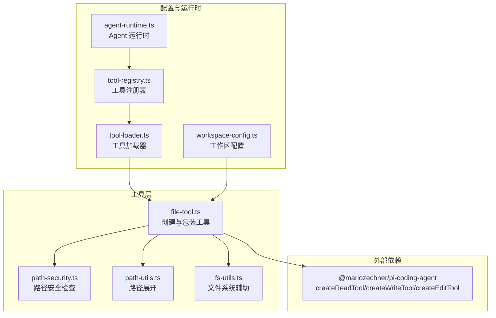
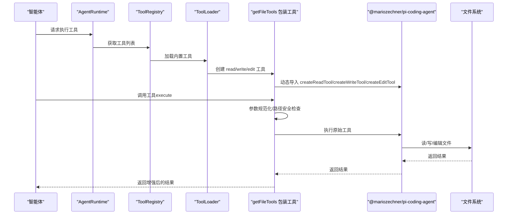
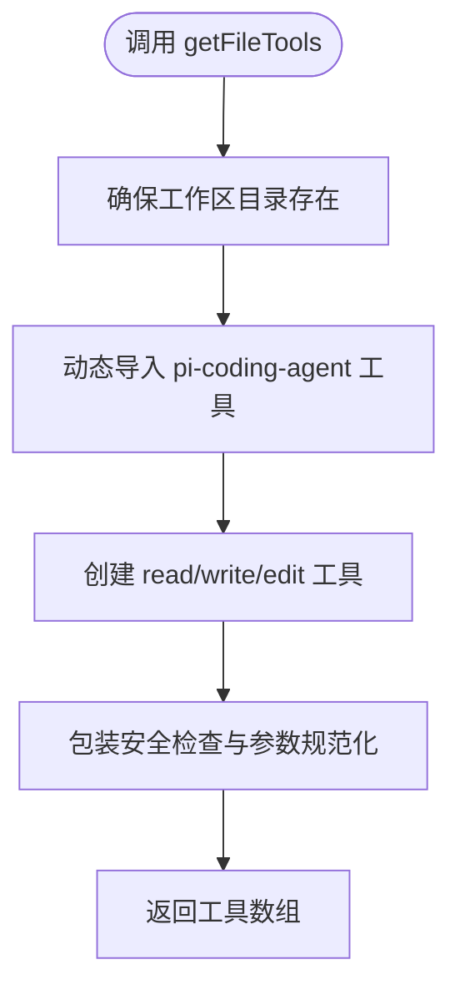
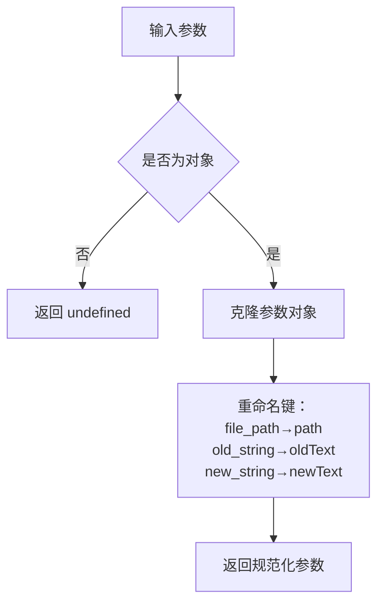
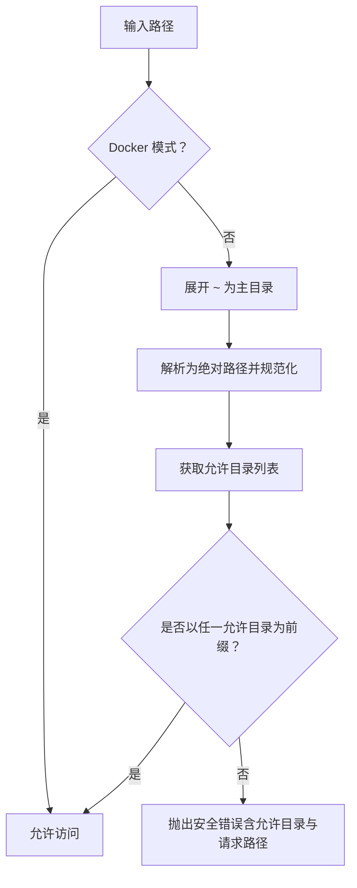
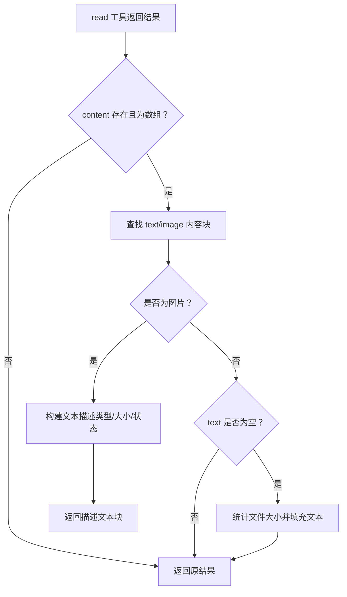
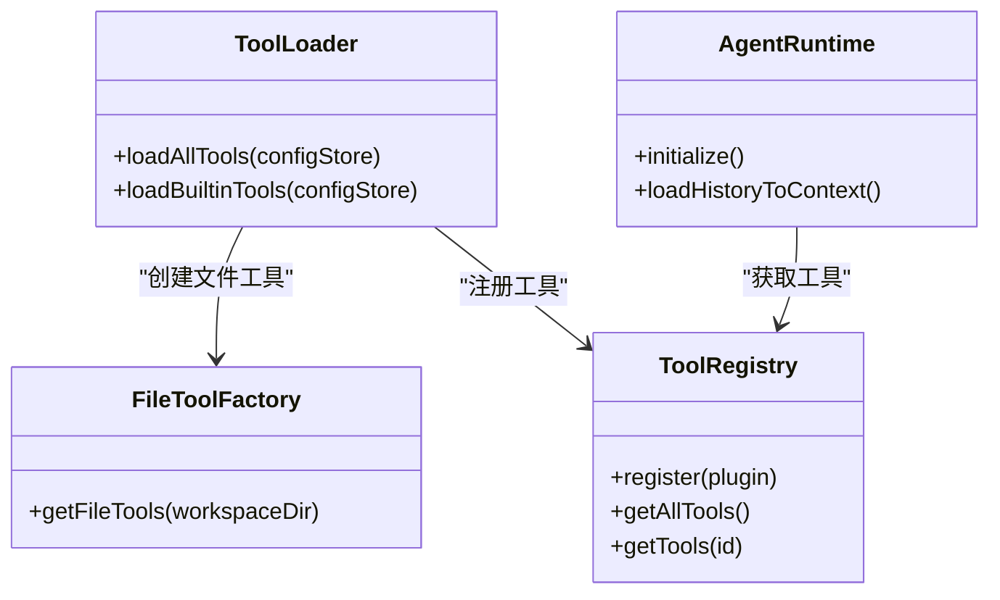
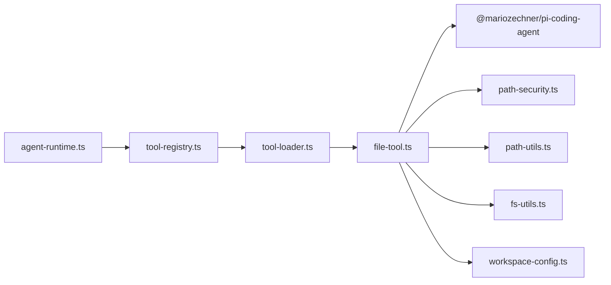

# 文件操作工具

<cite>
**本文档引用的文件**
- [file-tool.ts](file://src/main/tools/file-tool.ts)
- [path-security.ts](file://src/main/utils/path-security.ts)
- [fs-utils.ts](file://src/shared/utils/fs-utils.ts)
- [path-utils.ts](file://src/shared/utils/path-utils.ts)
- [workspace-config.ts](file://src/main/database/workspace-config.ts)
- [tool-loader.ts](file://src/main/tools/registry/tool-loader.ts)
- [tool-registry.ts](file://src/main/tools/registry/tool-registry.ts)
- [agent-runtime.ts](file://src/main/agent-runtime/agent-runtime.ts)
- [TOOLS.md](file://src/main/prompts/templates/TOOLS.md)
</cite>

## 目录
1. [简介](#简介)
2. [项目结构](#项目结构)
3. [核心组件](#核心组件)
4. [架构总览](#架构总览)
5. [详细组件分析](#详细组件分析)
6. [依赖关系分析](#依赖关系分析)
7. [性能考虑](#性能考虑)
8. [故障排除指南](#故障排除指南)
9. [结论](#结论)
10. [附录](#附录)

## 简介
本文件操作工具为 DeepBot 提供三类核心能力：
- 文件读取（read）
- 文件写入（write）
- 文件编辑（edit）

工具基于外部库 pi-coding-agent 提供的基础能力，结合 DeepBot 的安全策略与参数规范化，形成统一、可控、易用的文件操作接口。本文档将深入解释实现原理、使用方法、路径安全检查机制、参数规范化处理、内容过滤、错误处理与性能优化，并说明与 Agent 运行时及工作区目录管理的集成方式。

## 项目结构
文件操作工具位于主进程工具层，采用“外部能力 + 内部包装”的设计：
- 外部能力来源：pi-coding-agent（ESM 动态导入）
- 安全与参数处理：DeepBot 自身的安全检查、路径展开、参数规范化、返回结果增强
- 工具注册与加载：通过工具加载器与注册表统一注入到 Agent 运行时

图表来源
- [file-tool.ts:193-218](file://src/main/tools/file-tool.ts#L193-L218)
- [path-security.ts:29-83](file://src/main/utils/path-security.ts#L29-L83)
- [path-utils.ts:21-33](file://src/shared/utils/path-utils.ts#L21-L33)
- [fs-utils.ts:19-26](file://src/shared/utils/fs-utils.ts#L19-L26)
- [workspace-config.ts:17-46](file://src/main/database/workspace-config.ts#L17-L46)
- [tool-loader.ts:118-119](file://src/main/tools/registry/tool-loader.ts#L118-L119)
- [tool-registry.ts:36-55](file://src/main/tools/registry/tool-registry.ts#L36-L55)
- [agent-runtime.ts:196-213](file://src/main/agent-runtime/agent-runtime.ts#L196-L213)

章节来源
- [file-tool.ts:193-218](file://src/main/tools/file-tool.ts#L193-L218)
- [tool-loader.ts:118-119](file://src/main/tools/registry/tool-loader.ts#L118-L119)
- [tool-registry.ts:36-55](file://src/main/tools/registry/tool-registry.ts#L36-L55)
- [agent-runtime.ts:196-213](file://src/main/agent-runtime/agent-runtime.ts#L196-L213)

## 核心组件
- 文件工具工厂（getFileTools）：创建并包装 read/write/edit 三个工具，统一注入安全检查与参数规范化。
- 路径安全检查（assertPathAllowed/isPathAllowed）：限定工具仅能访问工作区、脚本、Skill、图片、记忆、会话等受控目录。
- 参数规范化（normalizeToolParams）：兼容 Claude 风格参数（file_path/old_string/new_string）与 pi-coding-agent 风格（path/oldText/newText）。
- 返回结果增强（improveReadResult）：对图片文件移除 base64 数据，对空文件提供明确提示。
- 工作区配置（getDefaultWorkspaceSettings/getWorkspaceSettings）：根据 Docker/Electron 模式返回默认路径集合。
- 工具注册与加载（ToolLoader/ToolRegistry）：将文件工具注入 Agent 运行时，供智能体调用。

章节来源
- [file-tool.ts:42-69](file://src/main/tools/file-tool.ts#L42-L69)
- [file-tool.ts:82-138](file://src/main/tools/file-tool.ts#L82-L138)
- [path-security.ts:59-117](file://src/main/utils/path-security.ts#L59-L117)
- [workspace-config.ts:17-46](file://src/main/database/workspace-config.ts#L17-L46)
- [tool-loader.ts:118-119](file://src/main/tools/registry/tool-loader.ts#L118-L119)
- [tool-registry.ts:36-55](file://src/main/tools/registry/tool-registry.ts#L36-L55)

## 架构总览
文件工具的调用链路如下：

图表来源
- [agent-runtime.ts:196-213](file://src/main/agent-runtime/agent-runtime.ts#L196-L213)
- [tool-loader.ts:118-119](file://src/main/tools/registry/tool-loader.ts#L118-L119)
- [file-tool.ts:193-218](file://src/main/tools/file-tool.ts#L193-L218)
- [file-tool.ts:148-177](file://src/main/tools/file-tool.ts#L148-L177)

## 详细组件分析

### 文件工具工厂与包装器
- 工具创建：动态导入 pi-coding-agent 的 createReadTool/createWriteTool/createEditTool，并绑定工作区目录。
- 安全包装：在 execute 中先进行参数规范化，再进行路径安全检查；对 read 工具额外增强返回结果。
- 工作区准备：确保工作区目录存在，不存在则自动创建。

图表来源
- [file-tool.ts:193-218](file://src/main/tools/file-tool.ts#L193-L218)
- [fs-utils.ts:19-26](file://src/shared/utils/fs-utils.ts#L19-L26)

章节来源
- [file-tool.ts:193-218](file://src/main/tools/file-tool.ts#L193-L218)
- [fs-utils.ts:19-26](file://src/shared/utils/fs-utils.ts#L19-L26)

### 参数规范化处理
- 兼容性：将 Claude 风格的 file_path/old_string/new_string 转换为 pi-coding-agent 风格的 path/oldText/newText。
- 规范化逻辑：在包装器的 execute 中先进行规范化，再传给底层工具。

图表来源
- [file-tool.ts:42-69](file://src/main/tools/file-tool.ts#L42-L69)

章节来源
- [file-tool.ts:42-69](file://src/main/tools/file-tool.ts#L42-L69)

### 路径安全检查机制
- 允许目录：工作区目录、脚本目录、Skill 目录列表、图片目录、记忆目录、会话目录。
- 检查流程：Docker 模式跳过检查；展开 ~；解析为绝对路径并规范化；与允许目录逐一比较，要求完整前缀匹配。
- 断言行为：若路径越权，抛出包含允许目录与请求路径的详细错误信息。

图表来源
- [path-security.ts:59-117](file://src/main/utils/path-security.ts#L59-L117)
- [workspace-config.ts:29-44](file://src/main/database/workspace-config.ts#L29-L44)

章节来源
- [path-security.ts:59-117](file://src/main/utils/path-security.ts#L59-L117)
- [workspace-config.ts:29-44](file://src/main/database/workspace-config.ts#L29-L44)

### 返回结果增强（read 工具）
- 图片文件：移除 base64 数据，仅返回文本描述（包含类型、大小、状态等），避免向 AI 传递大体积数据。
- 空文件：当文本块为空时，补充“文件存在但内容为空”的提示，并报告字节数。
- 其他情况：保持原样返回。

图表来源
- [file-tool.ts:82-138](file://src/main/tools/file-tool.ts#L82-L138)

章节来源
- [file-tool.ts:82-138](file://src/main/tools/file-tool.ts#L82-L138)

### 工具注册与运行时集成
- 工具加载：ToolLoader 在加载内置工具时调用 getFileTools，得到三个安全包装后的工具。
- 注册表：ToolRegistry 统一注册与管理工具，供 AgentRuntime 使用。
- 运行时：AgentRuntime 初始化时加载工具并进行重复检测包装，最终将工具注入到智能体上下文中。

图表来源
- [tool-loader.ts:118-119](file://src/main/tools/registry/tool-loader.ts#L118-L119)
- [tool-registry.ts:36-55](file://src/main/tools/registry/tool-registry.ts#L36-L55)
- [agent-runtime.ts:196-213](file://src/main/agent-runtime/agent-runtime.ts#L196-L213)
- [file-tool.ts:193-218](file://src/main/tools/file-tool.ts#L193-L218)

章节来源
- [tool-loader.ts:118-119](file://src/main/tools/registry/tool-loader.ts#L118-L119)
- [tool-registry.ts:36-55](file://src/main/tools/registry/tool-registry.ts#L36-L55)
- [agent-runtime.ts:196-213](file://src/main/agent-runtime/agent-runtime.ts#L196-L213)

## 依赖关系分析
- 外部依赖：@mariozechner/pi-coding-agent（提供 read/write/edit 的底层实现）
- 内部依赖：
  - 路径安全：path-security.ts
  - 路径展开：path-utils.ts
  - 文件系统辅助：fs-utils.ts
  - 工作区配置：workspace-config.ts
  - 工具注册与加载：tool-loader.ts、tool-registry.ts
  - 运行时集成：agent-runtime.ts

图表来源
- [file-tool.ts:24-29](file://src/main/tools/file-tool.ts#L24-L29)
- [tool-loader.ts:18-35](file://src/main/tools/registry/tool-loader.ts#L18-L35)
- [tool-registry.ts:27-31](file://src/main/tools/registry/tool-registry.ts#L27-L31)
- [agent-runtime.ts:13-21](file://src/main/agent-runtime/agent-runtime.ts#L13-L21)

章节来源
- [file-tool.ts:24-29](file://src/main/tools/file-tool.ts#L24-L29)
- [tool-loader.ts:18-35](file://src/main/tools/registry/tool-loader.ts#L18-L35)
- [tool-registry.ts:27-31](file://src/main/tools/registry/tool-registry.ts#L27-L31)
- [agent-runtime.ts:13-21](file://src/main/agent-runtime/agent-runtime.ts#L13-L21)

## 性能考虑
- 动态导入：使用 eval 绕过 TypeScript 编译器进行 ESM 动态导入，减少打包复杂度，但需注意安全与兼容性。
- I/O 优化：
  - 读取图片时移除 base64 数据，避免向 AI 传递大体积数据，降低上下文开销。
  - 空文件场景直接返回简短描述，减少不必要的文本处理。
- 目录预创建：在工具创建前确保工作区目录存在，避免首次调用时的阻塞。
- 路径规范化：统一解析为绝对路径并规范化，减少路径拼接错误带来的额外 I/O。

章节来源
- [file-tool.ts:199-201](file://src/main/tools/file-tool.ts#L199-L201)
- [file-tool.ts:82-138](file://src/main/tools/file-tool.ts#L82-L138)
- [fs-utils.ts:19-26](file://src/shared/utils/fs-utils.ts#L19-L26)
- [path-security.ts:66-68](file://src/main/utils/path-security.ts#L66-L68)

## 故障排除指南
- 路径越权错误
  - 现象：抛出“只能访问配置的目录及其子目录内的文件”错误。
  - 排查：确认请求路径是否在允许目录列表中；检查 Docker 模式下的特殊处理；核对 ~ 展开与绝对路径解析。
  - 参考：[path-security.ts:91-117](file://src/main/utils/path-security.ts#L91-L117)
- 文件不存在或为空
  - 现象：read 返回“文件不存在/内容为空”的提示。
  - 排查：确认路径是否正确；检查文件权限；查看文件大小。
  - 参考：[file-tool.ts:122-135](file://src/main/tools/file-tool.ts#L122-L135)
- 参数不兼容
  - 现象：底层工具报错或行为异常。
  - 排查：确保使用 path/oldText/newText（或等价的 file_path/old_string/new_string）作为参数。
  - 参考：[file-tool.ts:42-69](file://src/main/tools/file-tool.ts#L42-L69)
- 工具未加载
  - 现象：Agent 无法调用 file_read/file_write/file_edit。
  - 排查：确认 ToolLoader 已调用 getFileTools；检查 ToolRegistry 是否注册成功；确认 AgentRuntime 已加载工具。
  - 参考：[tool-loader.ts:118-119](file://src/main/tools/registry/tool-loader.ts#L118-L119)，[tool-registry.ts:36-55](file://src/main/tools/registry/tool-registry.ts#L36-L55)，[agent-runtime.ts:196-213](file://src/main/agent-runtime/agent-runtime.ts#L196-L213)

章节来源
- [path-security.ts:91-117](file://src/main/utils/path-security.ts#L91-L117)
- [file-tool.ts:42-69](file://src/main/tools/file-tool.ts#L42-L69)
- [tool-loader.ts:118-119](file://src/main/tools/registry/tool-loader.ts#L118-L119)
- [tool-registry.ts:36-55](file://src/main/tools/registry/tool-registry.ts#L36-L55)
- [agent-runtime.ts:196-213](file://src/main/agent-runtime/agent-runtime.ts#L196-L213)

## 结论
DeepBot 的文件操作工具通过“外部能力 + 内部包装”的方式，在保证安全性的同时提供了简洁一致的 API。其关键优势包括：
- 统一的安全边界与路径检查
- 参数风格兼容与返回结果优化
- 与 Agent 运行时无缝集成
- 易于扩展与维护的模块化设计

## 附录

### 使用示例
- 读取文件：使用 file_read，指定 path。
- 写入文件：使用 file_write，指定 path 与 content。
- 编辑文件：使用 file_edit，指定 path、old_string/new_string 或等价参数。

参考示例与权限规则见：
- [TOOLS.md:851-874](file://src/main/prompts/templates/TOOLS.md#L851-L874)
- [TOOLS.md:876-879](file://src/main/prompts/templates/TOOLS.md#L876-L879)

章节来源
- [TOOLS.md:851-874](file://src/main/prompts/templates/TOOLS.md#L851-L874)
- [TOOLS.md:876-879](file://src/main/prompts/templates/TOOLS.md#L876-L879)