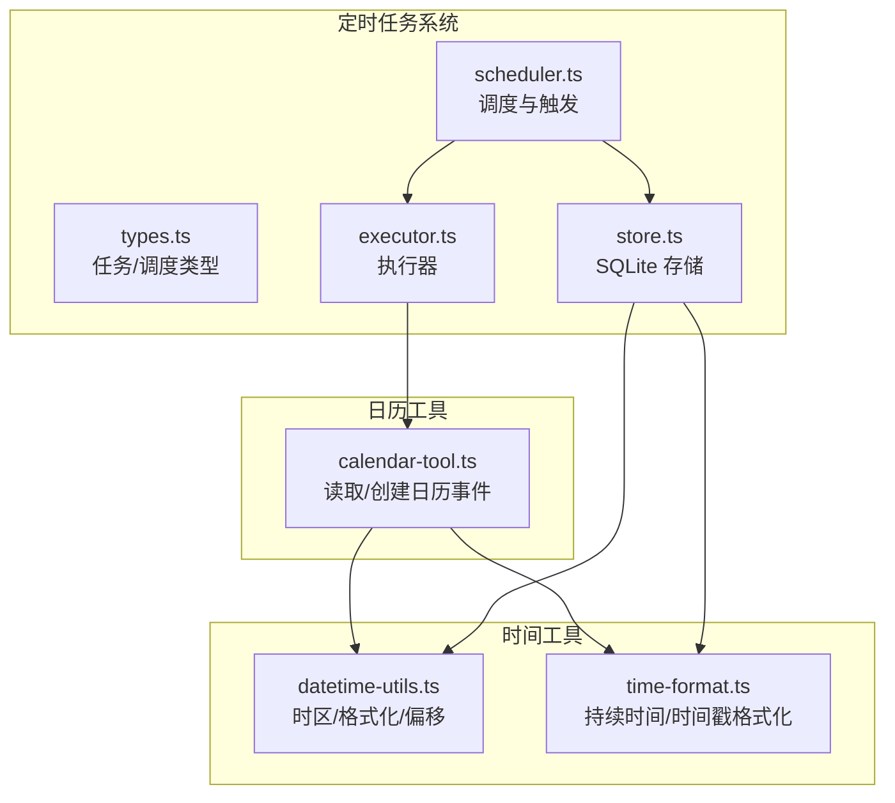
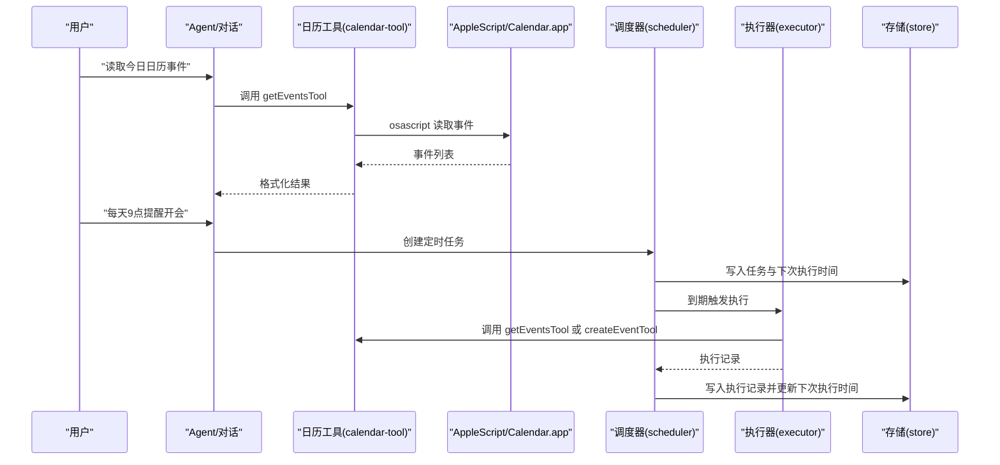
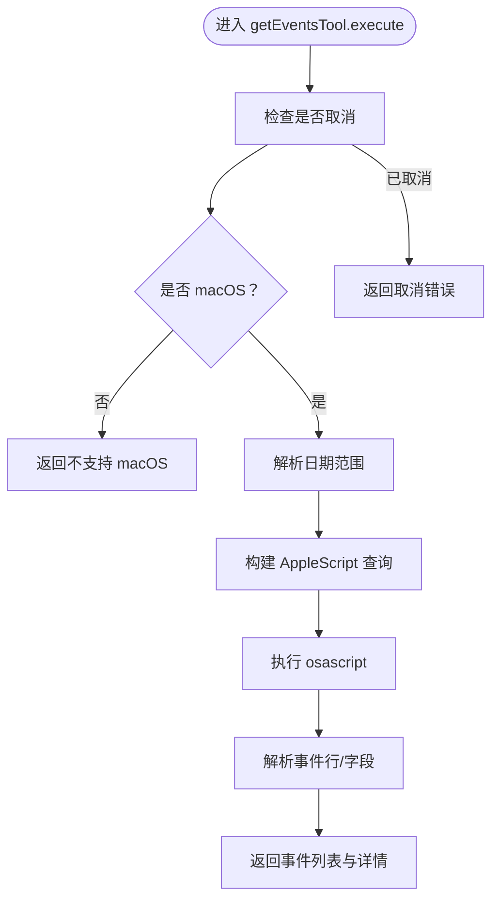
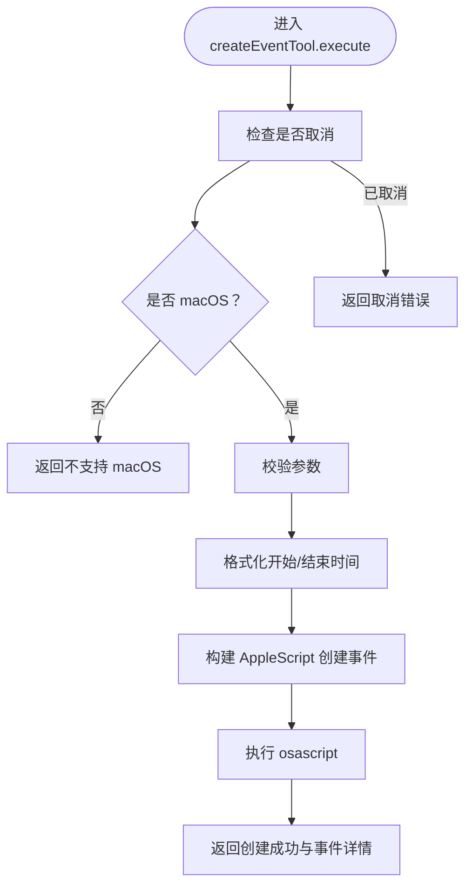
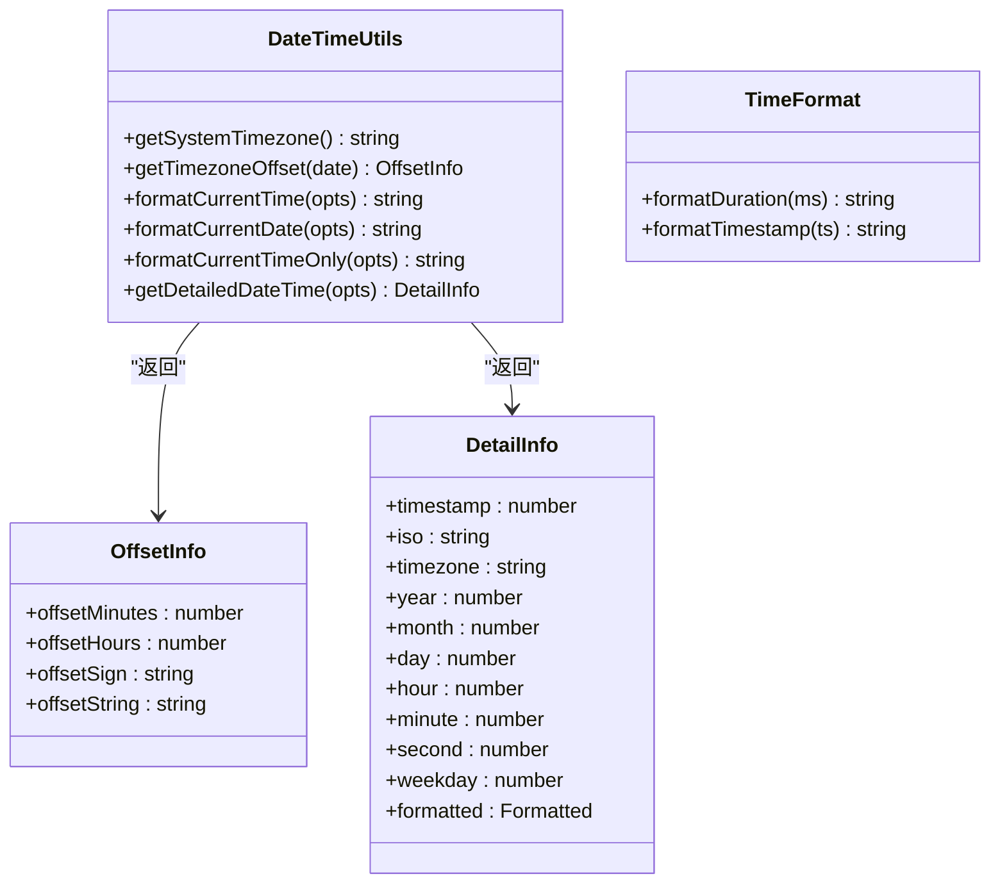
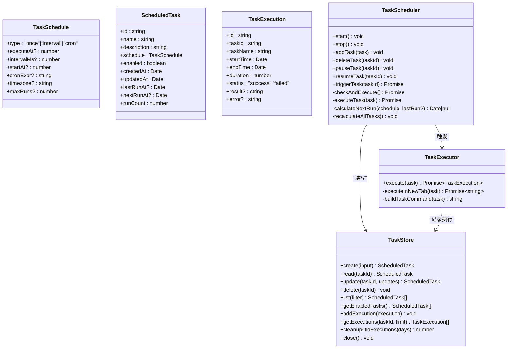
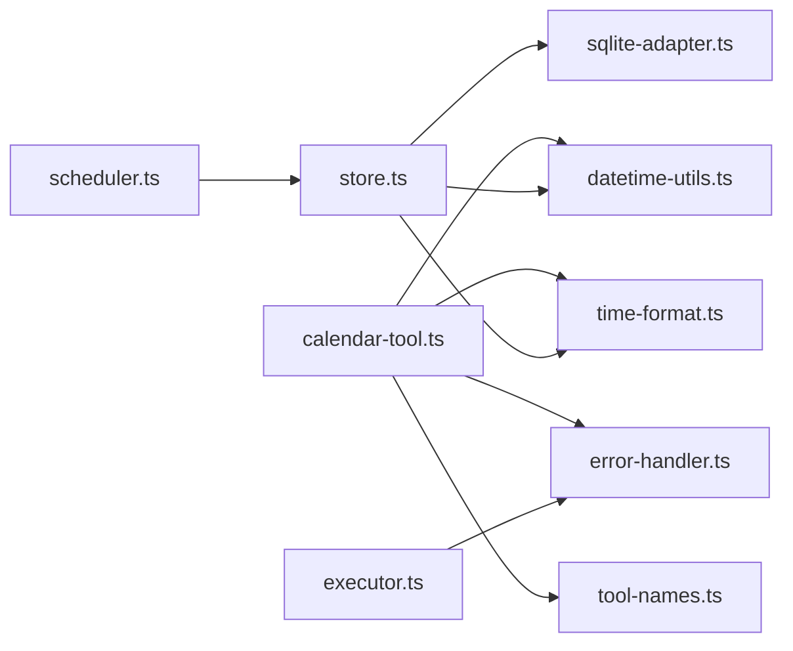

# 日历管理工具

<cite>
**本文引用的文件**
- [src/main/tools/calendar-tool.ts](file://src/main/tools/calendar-tool.ts)
- [src/shared/utils/datetime-utils.ts](file://src/shared/utils/datetime-utils.ts)
- [src/shared/utils/time-format.ts](file://src/shared/utils/time-format.ts)
- [src/main/scheduled-tasks/types.ts](file://src/main/scheduled-tasks/types.ts)
- [src/main/scheduled-tasks/store.ts](file://src/main/scheduled-tasks/store.ts)
- [src/main/scheduled-tasks/scheduler.ts](file://src/main/scheduled-tasks/scheduler.ts)
- [src/main/scheduled-tasks/executor.ts](file://src/main/scheduled-tasks/executor.ts)
- [src/shared/utils/error-handler.ts](file://src/shared/utils/error-handler.ts)
- [src/shared/utils/validation.ts](file://src/shared/utils/validation.ts)
- [src/shared/utils/sqlite-adapter.ts](file://src/shared/utils/sqlite-adapter.ts)
- [src/main/tools/tool-names.ts](file://src/main/tools/tool-names.ts)
</cite>

## 目录
1. [简介](#简介)
2. [项目结构](#项目结构)
3. [核心组件](#核心组件)
4. [架构总览](#架构总览)
5. [详细组件分析](#详细组件分析)
6. [依赖关系分析](#依赖关系分析)
7. [性能考量](#性能考量)
8. [故障排查指南](#故障排查指南)
9. [结论](#结论)
10. [附录](#附录)

## 简介
本文件为 史丽慧小助理 日历管理工具的功能文档，聚焦以下能力：
- 时间计算与日期解析：支持自然语言日期（today、tomorrow、this week）、日期范围解析、ISO 格式标准化
- 日期格式化：统一的本地化时间格式化、时区偏移计算、人类可读的持续时间与时间戳格式化
- 日程提醒与集成：基于定时任务系统实现“日程提醒”场景，结合 AppleScript 与 macOS Calendar 应用进行事件读取与创建
- 时区管理：系统时区获取、时区偏移换算、Cron 调度时区支持
- 数据持久化：SQLite 存储定时任务与执行记录，支持索引优化与 WAL 模式
- 错误处理：统一错误提取、Abort/取消错误识别、权限与平台检测

## 项目结构
日历管理相关代码主要分布在如下模块：
- 日历工具：封装 AppleScript 与 macOS Calendar 的交互，提供读取事件与创建事件两个 Agent 工具
- 时间工具：提供系统时区、格式化、时区偏移、持续时间与时间戳格式化
- 定时任务系统：类型定义、存储（SQLite）、调度器（Cron/间隔/一次性）、执行器（新建 Tab 执行）

**图表来源**
- [src/main/tools/calendar-tool.ts:1-452](file://src/main/tools/calendar-tool.ts#L1-L452)
- [src/shared/utils/datetime-utils.ts:1-179](file://src/shared/utils/datetime-utils.ts#L1-L179)
- [src/shared/utils/time-format.ts:1-73](file://src/shared/utils/time-format.ts#L1-L73)
- [src/main/scheduled-tasks/types.ts:1-86](file://src/main/scheduled-tasks/types.ts#L1-L86)
- [src/main/scheduled-tasks/store.ts:1-364](file://src/main/scheduled-tasks/store.ts#L1-L364)
- [src/main/scheduled-tasks/scheduler.ts:1-322](file://src/main/scheduled-tasks/scheduler.ts#L1-L322)
- [src/main/scheduled-tasks/executor.ts:1-170](file://src/main/scheduled-tasks/executor.ts#L1-L170)

**章节来源**
- [src/main/tools/calendar-tool.ts:1-452](file://src/main/tools/calendar-tool.ts#L1-L452)
- [src/shared/utils/datetime-utils.ts:1-179](file://src/shared/utils/datetime-utils.ts#L1-L179)
- [src/shared/utils/time-format.ts:1-73](file://src/shared/utils/time-format.ts#L1-L73)
- [src/main/scheduled-tasks/types.ts:1-86](file://src/main/scheduled-tasks/types.ts#L1-L86)
- [src/main/scheduled-tasks/store.ts:1-364](file://src/main/scheduled-tasks/store.ts#L1-L364)
- [src/main/scheduled-tasks/scheduler.ts:1-322](file://src/main/scheduled-tasks/scheduler.ts#L1-L322)
- [src/main/scheduled-tasks/executor.ts:1-170](file://src/main/scheduled-tasks/executor.ts#L1-L170)

## 核心组件
- 日历工具（macOS 专用）
  - 读取日历事件：支持自然语言日期与日期范围，按日历名称过滤
  - 创建日历事件：支持标题、起止时间、地点、备注、目标日历
  - 平台与权限：仅 macOS；需授予 Automation 权限以控制 Calendar.app
- 时间工具
  - 时区：获取系统时区、计算时区偏移
  - 格式化：当前时间/日期/时间仅、详细日期时间信息
  - 持续时间与时间戳：人类可读格式
- 定时任务系统
  - 任务类型：一次性、间隔、Cron
  - 存储：SQLite（WAL 模式、索引）
  - 调度：每秒轮询检查到期任务
  - 执行：在独立 Tab 中执行，避免并发冲突

**章节来源**
- [src/main/tools/calendar-tool.ts:164-298](file://src/main/tools/calendar-tool.ts#L164-L298)
- [src/main/tools/calendar-tool.ts:303-433](file://src/main/tools/calendar-tool.ts#L303-L433)
- [src/shared/utils/datetime-utils.ts:12-179](file://src/shared/utils/datetime-utils.ts#L12-L179)
- [src/shared/utils/time-format.ts:16-72](file://src/shared/utils/time-format.ts#L16-L72)
- [src/main/scheduled-tasks/types.ts:8-40](file://src/main/scheduled-tasks/types.ts#L8-L40)
- [src/main/scheduled-tasks/store.ts:23-128](file://src/main/scheduled-tasks/store.ts#L23-L128)
- [src/main/scheduled-tasks/scheduler.ts:12-62](file://src/main/scheduled-tasks/scheduler.ts#L12-L62)

## 架构总览
日历工具通过 AppleScript 与 macOS Calendar 交互；定时任务系统负责触发与执行；时间工具提供统一的时间与格式化能力。

**图表来源**
- [src/main/tools/calendar-tool.ts:164-298](file://src/main/tools/calendar-tool.ts#L164-L298)
- [src/main/scheduled-tasks/scheduler.ts:131-240](file://src/main/scheduled-tasks/scheduler.ts#L131-L240)
- [src/main/scheduled-tasks/executor.ts:21-153](file://src/main/scheduled-tasks/executor.ts#L21-L153)
- [src/main/scheduled-tasks/store.ts:133-230](file://src/main/scheduled-tasks/store.ts#L133-L230)

## 详细组件分析

### 日历工具（calendar-tool）
职责与能力
- 读取日历事件：解析自然语言日期与日期范围，构建 AppleScript 查询，返回事件列表
- 创建日历事件：校验参数，格式化时间，构建 AppleScript 创建事件脚本
- 平台与权限：仅 macOS；权限不足时抛出明确指引
- 取消与错误：支持 AbortSignal；捕获错误并返回统一格式

关键流程图（读取事件）

**图表来源**
- [src/main/tools/calendar-tool.ts:177-296](file://src/main/tools/calendar-tool.ts#L177-L296)

关键流程图（创建事件）

**图表来源**
- [src/main/tools/calendar-tool.ts:328-432](file://src/main/tools/calendar-tool.ts#L328-L432)

使用示例（路径参考）
- 读取今日事件：[调用 getEventsTool:164-298](file://src/main/tools/calendar-tool.ts#L164-L298)
- 创建会议事件：[调用 createEventTool:303-433](file://src/main/tools/calendar-tool.ts#L303-L433)
- 自然语言日期解析：[parseDateRange:114-159](file://src/main/tools/calendar-tool.ts#L114-L159)
- AppleScript 执行：[runAppleScript:59-86](file://src/main/tools/calendar-tool.ts#L59-L86)

**章节来源**
- [src/main/tools/calendar-tool.ts:1-452](file://src/main/tools/calendar-tool.ts#L1-L452)
- [src/main/tools/tool-names.ts:23-26](file://src/main/tools/tool-names.ts#L23-L26)

### 时间工具（datetime-utils 与 time-format）
- 系统时区：获取系统时区，降级到默认时区
- 时区偏移：计算分钟偏移、符号与字符串形式
- 格式化：当前时间/日期/时间仅、详细日期时间信息（含本地化）
- 持续时间：毫秒转人类可读（秒/分/时）
- 时间戳：毫秒时间戳格式化为 YYYY-MM-DD HH:mm:ss

**图表来源**
- [src/shared/utils/datetime-utils.ts:12-179](file://src/shared/utils/datetime-utils.ts#L12-L179)
- [src/shared/utils/time-format.ts:16-72](file://src/shared/utils/time-format.ts#L16-L72)

**章节来源**
- [src/shared/utils/datetime-utils.ts:1-179](file://src/shared/utils/datetime-utils.ts#L1-L179)
- [src/shared/utils/time-format.ts:1-73](file://src/shared/utils/time-format.ts#L1-L73)

### 定时任务系统（types/store/scheduler/executor）
- 类型定义：任务、调度配置、执行记录、过滤器
- 存储：SQLite（WAL 模式、索引），持久化任务与执行记录
- 调度：一次性、间隔、Cron；每秒轮询；最小间隔保护；Cron 时区支持
- 执行：在独立 Tab 执行，避免并发；记录执行时长、状态与错误

**图表来源**
- [src/main/scheduled-tasks/types.ts:8-85](file://src/main/scheduled-tasks/types.ts#L8-L85)
- [src/main/scheduled-tasks/store.ts:23-364](file://src/main/scheduled-tasks/store.ts#L23-L364)
- [src/main/scheduled-tasks/scheduler.ts:12-322](file://src/main/scheduled-tasks/scheduler.ts#L12-L322)
- [src/main/scheduled-tasks/executor.ts:17-170](file://src/main/scheduled-tasks/executor.ts#L17-L170)

**章节来源**
- [src/main/scheduled-tasks/types.ts:1-86](file://src/main/scheduled-tasks/types.ts#L1-L86)
- [src/main/scheduled-tasks/store.ts:1-364](file://src/main/scheduled-tasks/store.ts#L1-L364)
- [src/main/scheduled-tasks/scheduler.ts:1-322](file://src/main/scheduled-tasks/scheduler.ts#L1-L322)
- [src/main/scheduled-tasks/executor.ts:1-170](file://src/main/scheduled-tasks/executor.ts#L1-L170)

## 依赖关系分析
- 日历工具依赖
  - 平台检测与 AppleScript 执行
  - 参数校验与错误处理
  - 工具名称常量
- 时间工具被多处使用：日历工具、定时任务系统
- 定时任务系统依赖 SQLite 适配层、Cron、异步工具

**图表来源**
- [src/main/tools/calendar-tool.ts:24-31](file://src/main/tools/calendar-tool.ts#L24-L31)
- [src/main/scheduled-tasks/scheduler.ts:7-11](file://src/main/scheduled-tasks/scheduler.ts#L7-L11)
- [src/main/scheduled-tasks/executor.ts:7-9](file://src/main/scheduled-tasks/executor.ts#L7-L9)
- [src/main/scheduled-tasks/store.ts:7-14](file://src/main/scheduled-tasks/store.ts#L7-L14)
- [src/shared/utils/sqlite-adapter.ts:8-9](file://src/shared/utils/sqlite-adapter.ts#L8-L9)

**章节来源**
- [src/main/tools/calendar-tool.ts:24-31](file://src/main/tools/calendar-tool.ts#L24-L31)
- [src/shared/utils/error-handler.ts:1-50](file://src/shared/utils/error-handler.ts#L1-L50)
- [src/main/tools/tool-names.ts:8-94](file://src/main/tools/tool-names.ts#L8-L94)
- [src/shared/utils/sqlite-adapter.ts:1-102](file://src/shared/utils/sqlite-adapter.ts#L1-L102)

## 性能考量
- 轮询频率：调度器每秒检查一次，平衡实时性与 CPU 占用
- 最小间隔保护：防止过短间隔导致频繁触发
- SQLite WAL：提升并发写入性能，配合索引优化查询
- AppleScript：单次调用，避免频繁往返；注意 macOS 权限与可用性
- 执行并发：执行器使用独立 Tab，避免任务间互相阻塞

[本节为通用性能建议，无需特定文件引用]

## 故障排查指南
常见问题与定位
- 平台不支持
  - 现象：返回不支持 macOS
  - 排查：确认运行环境为 macOS
  - 参考：[平台检测:49-51](file://src/main/tools/calendar-tool.ts#L49-L51)
- 权限不足
  - 现象：AppleScript 报错包含 not allowed 或 permission
  - 排查：系统偏好设置 > 安全性与隐私 > 隐私 > 自动化，允许 史丽慧小助理 控制 Calendar.app
  - 参考：[权限错误处理:72-85](file://src/main/tools/calendar-tool.ts#L72-L85)
- 日期范围解析异常
  - 现象：解析失败或边界时间不正确
  - 排查：确认输入格式（today/tomorrow/this week/ISO/范围）
  - 参考：[日期范围解析:114-159](file://src/main/tools/calendar-tool.ts#L114-L159)
- 定时任务未触发
  - 现象：任务未执行或未更新下次执行时间
  - 排查：检查调度器是否启动、任务是否启用、Cron 表达式是否有效、时区设置
  - 参考：[调度器启动与检查:29-62](file://src/main/scheduled-tasks/scheduler.ts#L29-L62)，[Cron 计算:282-297](file://src/main/scheduled-tasks/scheduler.ts#L282-L297)
- 执行记录缺失
  - 现象：执行历史为空或不完整
  - 排查：确认存储初始化、索引存在、清理策略
  - 参考：[存储初始化与索引:88-128](file://src/main/scheduled-tasks/store.ts#L88-L128)，[清理旧记录:328-337](file://src/main/scheduled-tasks/store.ts#L328-L337)
- 取消与中断
  - 现象：工具执行被取消
  - 排查：检查 AbortSignal，区分取消与异常
  - 参考：[错误类型判断:25-27](file://src/shared/utils/error-handler.ts#L25-L27)，[参数校验:8-13](file://src/shared/utils/validation.ts#L8-L13)

**章节来源**
- [src/main/tools/calendar-tool.ts:49-86](file://src/main/tools/calendar-tool.ts#L49-L86)
- [src/main/scheduled-tasks/scheduler.ts:29-62](file://src/main/scheduled-tasks/scheduler.ts#L29-L62)
- [src/main/scheduled-tasks/store.ts:88-128](file://src/main/scheduled-tasks/store.ts#L88-L128)
- [src/shared/utils/error-handler.ts:1-50](file://src/shared/utils/error-handler.ts#L1-L50)
- [src/shared/utils/validation.ts:1-73](file://src/shared/utils/validation.ts#L1-L73)

## 结论
史丽慧小助理 日历管理工具通过 AppleScript 与 macOS Calendar 深度集成，提供读取与创建日历事件的能力，并结合统一的时间工具与定时任务系统，形成“日程提醒”的完整闭环。其设计强调：
- 明确的平台与权限约束
- 可读性强的日期解析与格式化
- 稳健的定时任务调度与执行
- 完善的错误处理与可观测性

## 附录

### 时间格式化选项
- 时区与时区偏移
  - 获取系统时区：[getSystemTimezone:12-19](file://src/shared/utils/datetime-utils.ts#L12-L19)
  - 计算时区偏移：[getTimezoneOffset:27-40](file://src/shared/utils/datetime-utils.ts#L27-L40)
- 本地化格式化
  - 当前时间：[formatCurrentTime:62-85](file://src/shared/utils/datetime-utils.ts#L62-L85)
  - 仅日期：[formatCurrentDate:93-118](file://src/shared/utils/datetime-utils.ts#L93-L118)
  - 仅时间：[formatCurrentTimeOnly:126-147](file://src/shared/utils/datetime-utils.ts#L126-L147)
  - 详细信息：[getDetailedDateTime:155-179](file://src/shared/utils/datetime-utils.ts#L155-L179)
- 人类可读格式
  - 持续时间：[formatDuration:16-50](file://src/shared/utils/time-format.ts#L16-L50)
  - 时间戳：[formatTimestamp:61-72](file://src/shared/utils/time-format.ts#L61-L72)

**章节来源**
- [src/shared/utils/datetime-utils.ts:1-179](file://src/shared/utils/datetime-utils.ts#L1-L179)
- [src/shared/utils/time-format.ts:1-73](file://src/shared/utils/time-format.ts#L1-L73)

### 日程提醒策略
- 自然语言到时间范围
  - today/tomorrow/this week/具体日期/日期范围
  - 参考：[parseDateRange:114-159](file://src/main/tools/calendar-tool.ts#L114-L159)
- 定时任务触发
  - 一次性/间隔/Cron；最小间隔保护；Cron 时区
  - 参考：[calculateNextRun:245-302](file://src/main/scheduled-tasks/scheduler.ts#L245-L302)
- 执行隔离
  - 独立 Tab 执行，避免并发冲突
  - 参考：[executeInNewTab:86-153](file://src/main/scheduled-tasks/executor.ts#L86-L153)

**章节来源**
- [src/main/tools/calendar-tool.ts:114-159](file://src/main/tools/calendar-tool.ts#L114-L159)
- [src/main/scheduled-tasks/scheduler.ts:245-302](file://src/main/scheduled-tasks/scheduler.ts#L245-L302)
- [src/main/scheduled-tasks/executor.ts:86-153](file://src/main/scheduled-tasks/executor.ts#L86-L153)

### 数据持久化与清理
- SQLite 适配层
  - 兼容 better-sqlite3 API，支持 PRAGMA、事务、关闭
  - 参考：[sqlite-adapter:14-70](file://src/shared/utils/sqlite-adapter.ts#L14-L70)
- 任务与执行记录
  - 任务表与执行表、索引、清理策略
  - 参考：[store 初始化与方法:88-337](file://src/main/scheduled-tasks/store.ts#L88-L337)

**章节来源**
- [src/shared/utils/sqlite-adapter.ts:1-102](file://src/shared/utils/sqlite-adapter.ts#L1-L102)
- [src/main/scheduled-tasks/store.ts:88-337](file://src/main/scheduled-tasks/store.ts#L88-L337)