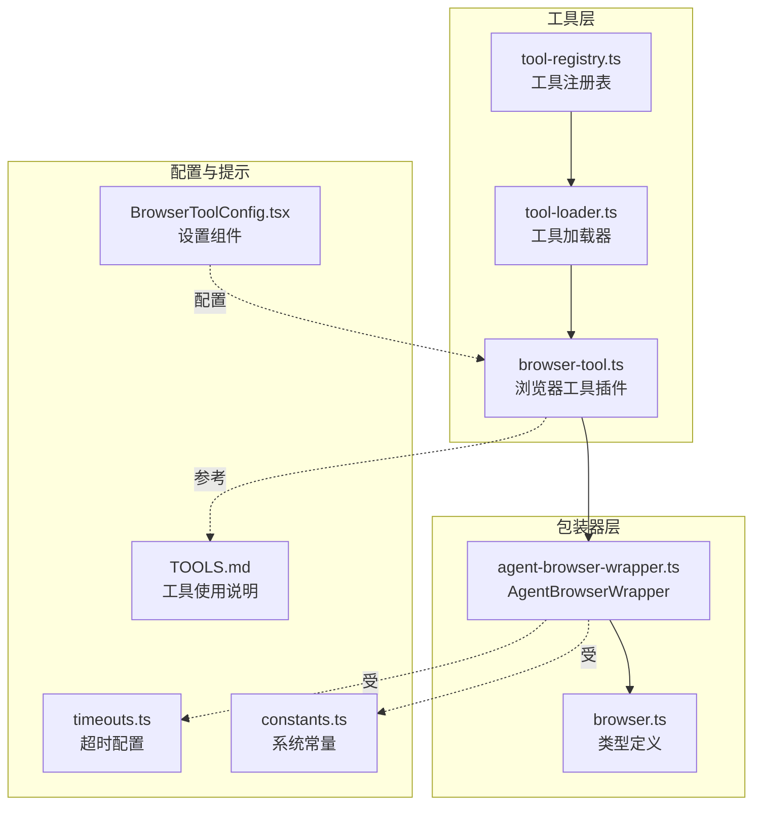
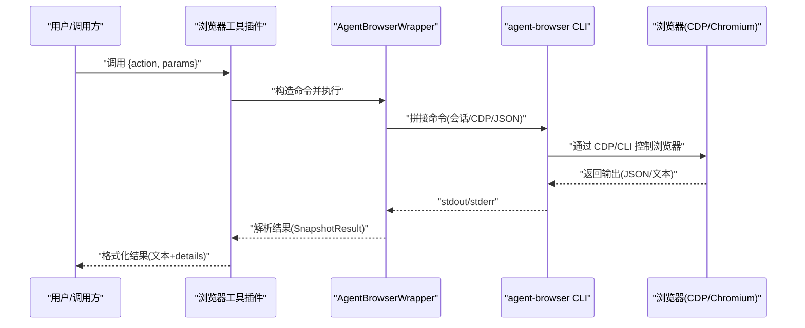
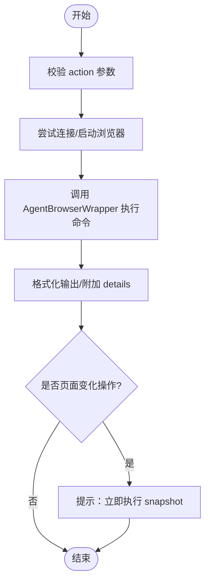
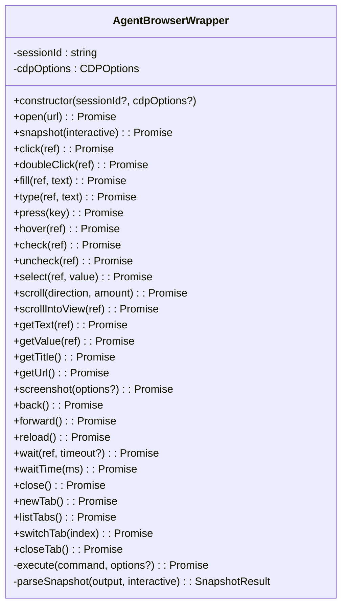
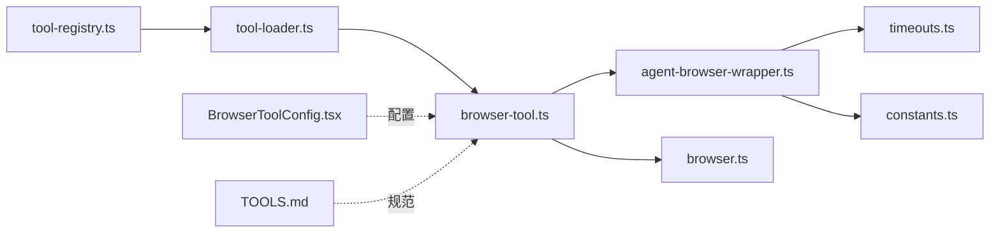

# 浏览器自动化工具

<cite>
**本文引用的文件**
- [browser-tool.ts](file://src/main/tools/browser-tool.ts)
- [agent-browser-wrapper.ts](file://src/main/browser/agent-browser-wrapper.ts)
- [browser.ts](file://src/types/browser.ts)
- [timeouts.ts](file://src/main/config/timeouts.ts)
- [constants.ts](file://src/main/config/constants.ts)
- [BrowserToolConfig.tsx](file://src/renderer/components/settings/BrowserToolConfig.tsx)
- [tool-loader.ts](file://src/main/tools/registry/tool-loader.ts)
- [tool-registry.ts](file://src/main/tools/registry/tool-registry.ts)
- [TOOLS.md](file://dist-electron/main/prompts/templates/TOOLS.md)
- [README.md](file://README.md)
</cite>

## 目录
1. [简介](#简介)
2. [项目结构](#项目结构)
3. [核心组件](#核心组件)
4. [架构总览](#架构总览)
5. [详细组件分析](#详细组件分析)
6. [依赖关系分析](#依赖关系分析)
7. [性能考量](#性能考量)
8. [故障排除指南](#故障排除指南)
9. [结论](#结论)
10. [附录](#附录)

## 简介
本指南面向使用 史丽慧小助理 的浏览器自动化能力的用户与开发者，围绕基于 Playwright 的网页操作展开，涵盖页面导航、元素交互、截图生成、内容提取等核心功能，以及浏览器配置、代理与用户代理管理等技术细节。文档同时提供典型使用场景、最佳实践与性能优化建议，并附带常见问题与故障排除指引。

## 项目结构
史丽慧小助理 的浏览器自动化能力由“工具层”和“包装器层”组成：
- 工具层：对外暴露统一的浏览器工具接口，负责参数校验、动作编排、错误处理与结果格式化。
- 包装器层：封装底层 agent-browser CLI 调用，负责命令执行、输出解析、CDP 连接与超时控制。

图表来源
- [browser-tool.ts:171-213](file://src/main/tools/browser-tool.ts#L171-L213)
- [agent-browser-wrapper.ts:70-77](file://src/main/browser/agent-browser-wrapper.ts#L70-L77)
- [browser.ts:1-102](file://src/types/browser.ts#L1-L102)
- [tool-loader.ts:109-140](file://src/main/tools/registry/tool-loader.ts#L109-L140)
- [tool-registry.ts:36-55](file://src/main/tools/registry/tool-registry.ts#L36-L55)
- [TOOLS.md:164-280](file://dist-electron/main/prompts/templates/TOOLS.md#L164-L280)
- [BrowserToolConfig.tsx:13-181](file://src/renderer/components/settings/BrowserToolConfig.tsx#L13-L181)
- [timeouts.ts:9-53](file://src/main/config/timeouts.ts#L9-L53)
- [constants.ts:4-26](file://src/main/config/constants.ts#L4-L26)

章节来源
- [browser-tool.ts:171-213](file://src/main/tools/browser-tool.ts#L171-L213)
- [agent-browser-wrapper.ts:70-77](file://src/main/browser/agent-browser-wrapper.ts#L70-L77)
- [browser.ts:1-102](file://src/types/browser.ts#L1-L102)
- [tool-loader.ts:109-140](file://src/main/tools/registry/tool-loader.ts#L109-L140)
- [tool-registry.ts:36-55](file://src/main/tools/registry/tool-registry.ts#L36-L55)
- [TOOLS.md:164-280](file://dist-electron/main/prompts/templates/TOOLS.md#L164-L280)
- [BrowserToolConfig.tsx:13-181](file://src/renderer/components/settings/BrowserToolConfig.tsx#L13-L181)
- [timeouts.ts:9-53](file://src/main/config/timeouts.ts#L9-L53)
- [constants.ts:4-26](file://src/main/config/constants.ts#L4-L26)

## 核心组件
- 浏览器工具插件：定义动作集合、参数 Schema、执行流程与错误处理，负责在不同运行环境下自动启动/连接浏览器，并将用户意图转化为 agent-browser CLI 命令。
- AgentBrowserWrapper：封装 agent-browser CLI 的调用与解析，支持 CDP 连接、会话标识、超时控制与输出解析。
- 类型定义：统一快照、标签页、截图、导航等结果的数据结构，保证工具层与包装器层之间的契约稳定。
- 工具加载与注册：通过工具加载器与注册表集中管理工具生命周期与配置。
- 配置与提示：系统提示词模板提供浏览器工具的使用规范与最佳实践；设置组件提供一键启动与 Docker 模式说明。

章节来源
- [browser-tool.ts:29-51](file://src/main/tools/browser-tool.ts#L29-L51)
- [agent-browser-wrapper.ts:25-42](file://src/main/browser/agent-browser-wrapper.ts#L25-L42)
- [browser.ts:9-101](file://src/types/browser.ts#L9-L101)
- [tool-loader.ts:109-140](file://src/main/tools/registry/tool-loader.ts#L109-L140)
- [tool-registry.ts:36-55](file://src/main/tools/registry/tool-registry.ts#L36-L55)
- [TOOLS.md:164-280](file://dist-electron/main/prompts/templates/TOOLS.md#L164-L280)
- [BrowserToolConfig.tsx:13-181](file://src/renderer/components/settings/BrowserToolConfig.tsx#L13-L181)

## 架构总览
浏览器自动化在 史丽慧小助理 中的工作流如下：
- 工具层接收用户参数，校验并选择对应动作。
- 包装器层根据运行环境决定连接方式：Docker 模式使用 Playwright 无头 Chromium，非 Docker 模式连接系统 Chrome（CDP）。
- 包装器层执行 agent-browser CLI 命令，解析输出并返回统一结构。
- 工具层格式化结果，补充细节与提示信息。

图表来源
- [browser-tool.ts:215-361](file://src/main/tools/browser-tool.ts#L215-L361)
- [agent-browser-wrapper.ts:121-221](file://src/main/browser/agent-browser-wrapper.ts#L121-L221)
- [agent-browser-wrapper.ts:237-243](file://src/main/browser/agent-browser-wrapper.ts#L237-L243)

章节来源
- [browser-tool.ts:215-361](file://src/main/tools/browser-tool.ts#L215-L361)
- [agent-browser-wrapper.ts:121-221](file://src/main/browser/agent-browser-wrapper.ts#L121-L221)
- [agent-browser-wrapper.ts:237-243](file://src/main/browser/agent-browser-wrapper.ts#L237-L243)

## 详细组件分析

### 浏览器工具插件（browser-tool.ts）
- 动作集合：open、snapshot、click、dblclick、fill、type、press、hover、check、uncheck、select、scroll、scrollintoview、get、screenshot、back、forward、reload、wait、tab、close。
- 参数校验：基于 TypeBox Schema，对 action、ref、text、key、interactive、getType、direction、amount、screenshotPath、fullPage、waitTimeout、tabAction、tabIndex 等进行约束。
- 执行流程：
  - 自动探测运行环境（Docker/非 Docker），必要时启动浏览器（Playwright 或系统 Chrome）。
  - 通过 AgentBrowserWrapper 执行对应命令。
  - 对 snapshot 强制使用非交互模式以获取完整文本与可交互元素列表。
  - 对页面变化类操作（open/click/press/back/forward/reload/tab）提示必须立即 snapshot。
- 错误处理：捕获连接失败、启动失败、参数缺失、超时等异常，返回可读错误信息与 details。

图表来源
- [browser-tool.ts:364-800](file://src/main/tools/browser-tool.ts#L364-L800)
- [browser-tool.ts:387-467](file://src/main/tools/browser-tool.ts#L387-L467)

章节来源
- [browser-tool.ts:29-51](file://src/main/tools/browser-tool.ts#L29-L51)
- [browser-tool.ts:71-166](file://src/main/tools/browser-tool.ts#L71-L166)
- [browser-tool.ts:215-361](file://src/main/tools/browser-tool.ts#L215-L361)
- [browser-tool.ts:364-800](file://src/main/tools/browser-tool.ts#L364-L800)

### AgentBrowserWrapper（agent-browser-wrapper.ts）
- 职责：封装 agent-browser CLI 调用，提供类型安全接口，处理命令执行、输出解析、CDP 连接与超时控制。
- 关键能力：
  - 自动定位 agent-browser 可执行文件（开发/生产/打包环境适配）。
  - 支持会话标识、CDP 端口或 WebSocket URL、JSON 输出标志。
  - 统一环境变量注入（NODE、PATH），保障 Electron 环境下的 Node 可用。
  - 超时控制：基于 TIMEOUTS 配置，最大缓冲区限制。
  - 输出解析：将 snapshot 输出解析为标题、URL、可交互元素列表与原始文本。
- 命令集：open、snapshot、click、doubleClick、fill、type、press、hover、check、uncheck、select、scroll、scrollIntoView、getText、getValue、getTitle、getUrl、screenshot、back、forward、reload、wait、waitTime、close、newTab、listTabs、switchTab、closeTab。

图表来源
- [agent-browser-wrapper.ts:70-516](file://src/main/browser/agent-browser-wrapper.ts#L70-L516)

章节来源
- [agent-browser-wrapper.ts:70-516](file://src/main/browser/agent-browser-wrapper.ts#L70-L516)

### 类型定义（browser.ts）
- 浏览器状态：包含运行状态、CDP 准备、PID、端口、URL、用户资料、无头模式等。
- 标签页：目标 ID、标题、URL、类型等。
- 快照结果：AI 格式与 ARIA 格式两种，统一为联合类型。
- 截图结果：路径与类型。
- PDF 导出结果：路径。
- 控制台消息：类型、文本、时间戳。
- 导航结果：目标 ID、URL。

章节来源
- [browser.ts:9-101](file://src/types/browser.ts#L9-L101)

### 工具加载与注册（tool-loader.ts、tool-registry.ts）
- 工具加载器：集中导入与加载内置工具，按配置启用/禁用，支持动态读取工具配置。
- 工具注册表：维护插件注册、工具实例、配置与清理流程，提供 UI 展示列表。

章节来源
- [tool-loader.ts:109-140](file://src/main/tools/registry/tool-loader.ts#L109-L140)
- [tool-registry.ts:36-55](file://src/main/tools/registry/tool-registry.ts#L36-L55)

### 配置与提示（TOOLS.md、BrowserToolConfig.tsx）
- TOOLS.md：提供浏览器工具的使用规范、@ref 系统说明、多标签页使用场景、注意事项与示例。
- BrowserToolConfig.tsx：提供一键启动 Chrome（端口 9222）、Docker 模式安装说明与特性说明。

章节来源
- [TOOLS.md:164-280](file://dist-electron/main/prompts/templates/TOOLS.md#L164-L280)
- [BrowserToolConfig.tsx:13-181](file://src/renderer/components/settings/BrowserToolConfig.tsx#L13-L181)

## 依赖关系分析
- 工具层依赖包装器层与类型定义，通过统一的 SnapshotResult 与命令接口进行交互。
- 包装器层依赖超时配置与系统常量，确保命令执行的稳定性与可预测性。
- 工具加载器与注册表负责工具生命周期管理，确保浏览器工具在运行时可用。

图表来源
- [browser-tool.ts:171-213](file://src/main/tools/browser-tool.ts#L171-L213)
- [agent-browser-wrapper.ts:70-77](file://src/main/browser/agent-browser-wrapper.ts#L70-L77)
- [browser.ts:1-102](file://src/types/browser.ts#L1-L102)
- [tool-loader.ts:109-140](file://src/main/tools/registry/tool-loader.ts#L109-L140)
- [tool-registry.ts:36-55](file://src/main/tools/registry/tool-registry.ts#L36-L55)
- [BrowserToolConfig.tsx:13-181](file://src/renderer/components/settings/BrowserToolConfig.tsx#L13-L181)
- [timeouts.ts:9-53](file://src/main/config/timeouts.ts#L9-L53)
- [constants.ts:4-26](file://src/main/config/constants.ts#L4-L26)
- [TOOLS.md:164-280](file://dist-electron/main/prompts/templates/TOOLS.md#L164-L280)

章节来源
- [browser-tool.ts:171-213](file://src/main/tools/browser-tool.ts#L171-L213)
- [agent-browser-wrapper.ts:70-77](file://src/main/browser/agent-browser-wrapper.ts#L70-L77)
- [browser.ts:1-102](file://src/types/browser.ts#L1-L102)
- [tool-loader.ts:109-140](file://src/main/tools/registry/tool-loader.ts#L109-L140)
- [tool-registry.ts:36-55](file://src/main/tools/registry/tool-registry.ts#L36-L55)
- [BrowserToolConfig.tsx:13-181](file://src/renderer/components/settings/BrowserToolConfig.tsx#L13-L181)
- [timeouts.ts:9-53](file://src/main/config/timeouts.ts#L9-L53)
- [constants.ts:4-26](file://src/main/config/constants.ts#L4-L26)
- [TOOLS.md:164-280](file://dist-electron/main/prompts/templates/TOOLS.md#L164-L280)

## 性能考量
- 超时与缓冲：包装器层使用 TIMEOUTS 中的浏览器相关超时配置，避免长时间阻塞；同时设置最大输出缓冲区，防止内存膨胀。
- 命令执行环境：在生产环境中注入 NODE 与 PATH，确保 Electron 环境下的 Node 可用，减少启动失败与重试成本。
- 快照策略：snapshot 默认交互模式为 true，但在浏览器工具中强制使用非交互模式以获取完整文本与可交互元素列表，提升信息密度与准确性。
- 等待与重试：工具层对页面变化后提示立即 snapshot，减少无效等待；系统常量提供最大重试次数与延迟，平衡稳定性与性能。

章节来源
- [agent-browser-wrapper.ts:197-221](file://src/main/browser/agent-browser-wrapper.ts#L197-L221)
- [timeouts.ts:14-26](file://src/main/config/timeouts.ts#L14-L26)
- [constants.ts:10-12](file://src/main/config/constants.ts#L10-L12)
- [browser-tool.ts:387-467](file://src/main/tools/browser-tool.ts#L387-L467)

## 故障排除指南
- 无法连接到 Chrome（非 Docker 模式）
  - 现象：连接失败，提示需要手动启动 Chrome。
  - 处理：使用设置组件一键启动或手动启动 Chrome（端口 9222），确保端口未被占用。
  - 参考：设置组件提供各平台启动命令与注意事项。
- Docker 模式启动失败
  - 现象：Playwright Chromium 未安装或启动超时。
  - 处理：在容器内执行安装命令，等待启动完成；确认 PLAYWRIGHT_CACHE_DIR 持久化。
  - 参考：设置组件提供安装与特性说明。
- snapshot 为空或内容加载中
  - 现象：snapshot 返回空内容或提示仍在加载。
  - 处理：等待数秒后重试，或使用 wait 操作；确保页面已渲染完成。
- 页面变化后未执行 snapshot
  - 现象：点击/导航后行为异常或元素定位失效。
  - 处理：每次页面变化后立即执行 snapshot，获取新的 @ref 列表。
- 截图路径问题
  - 现象：截图保存路径无效或权限不足。
  - 处理：使用 expandUserPath 支持 ~ 符号；确保路径存在且可写。

章节来源
- [BrowserToolConfig.tsx:13-181](file://src/renderer/components/settings/BrowserToolConfig.tsx#L13-L181)
- [browser-tool.ts:364-800](file://src/main/tools/browser-tool.ts#L364-L800)
- [agent-browser-wrapper.ts:197-221](file://src/main/browser/agent-browser-wrapper.ts#L197-L221)

## 结论
史丽慧小助理 的浏览器自动化工具通过“工具层 + 包装器层”的清晰分层，实现了对 Playwright/Chrome 的稳定控制与统一抽象。借助 @ref 系统与 snapshot 机制，用户可以以最小心智负担完成复杂的网页操作与内容提取。配合完善的超时与错误处理、Docker 与系统双模式支持，该工具在开发与生产环境中均具备良好的可用性与可维护性。

## 附录

### 使用场景与最佳实践
- 基础浏览与交互
  - 打开页面 → snapshot → 使用 @ref 点击/填写 → 页面变化后立即 snapshot。
- 多标签页并行
  - 新标签页打开多个目标页面，对比内容或并行处理。
- 截图与内容提取
  - 使用 snapshot 获取完整文本与可交互元素，结合截图保存关键画面。
- 等待与重试
  - 对动态页面使用 wait 操作，确保元素出现；对不稳定网络使用系统常量中的重试策略。

章节来源
- [TOOLS.md:164-280](file://dist-electron/main/prompts/templates/TOOLS.md#L164-L280)
- [browser-tool.ts:387-467](file://src/main/tools/browser-tool.ts#L387-L467)

### 技术细节与配置
- CDP 连接
  - 非 Docker：通过端口 9222 连接系统 Chrome。
  - Docker：自动启动 Playwright 无头 Chromium，绑定端口 9222。
- 用户代理与代理
  - 当前实现未显式暴露用户代理与代理设置参数；如需定制，可在系统 Chrome 启动参数中配置或通过环境变量注入。
- 超时与缓冲
  - 使用 TIMEOUTS 中的浏览器相关超时配置；包装器层设置最大输出缓冲区。

章节来源
- [browser-tool.ts:215-361](file://src/main/tools/browser-tool.ts#L215-L361)
- [agent-browser-wrapper.ts:197-221](file://src/main/browser/agent-browser-wrapper.ts#L197-L221)
- [timeouts.ts:14-26](file://src/main/config/timeouts.ts#L14-L26)