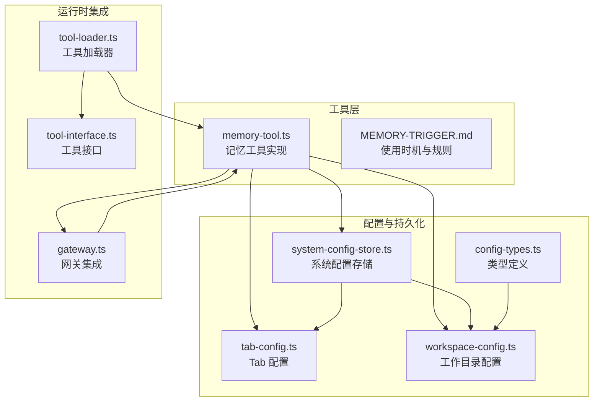
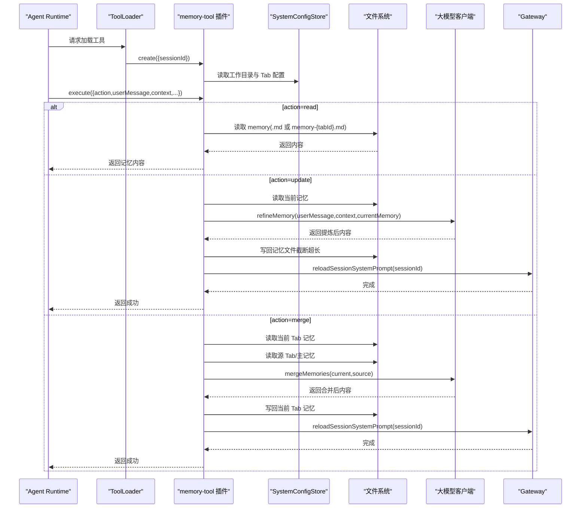
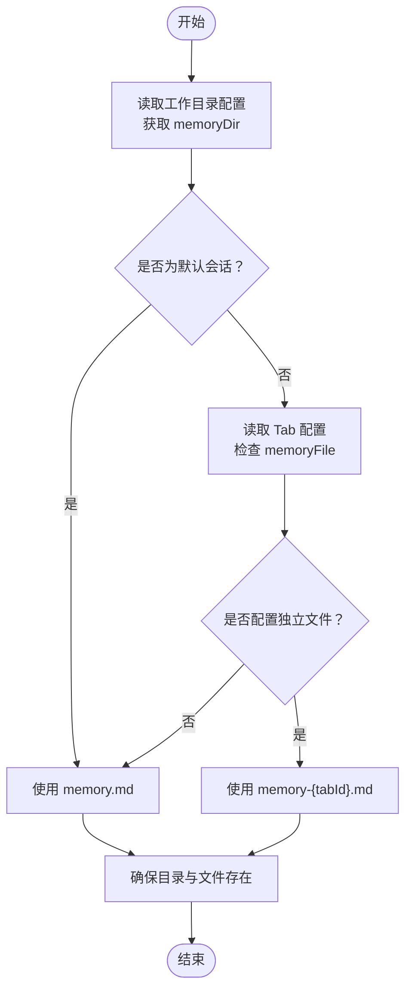
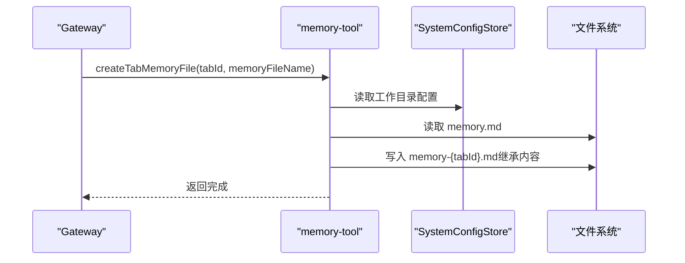
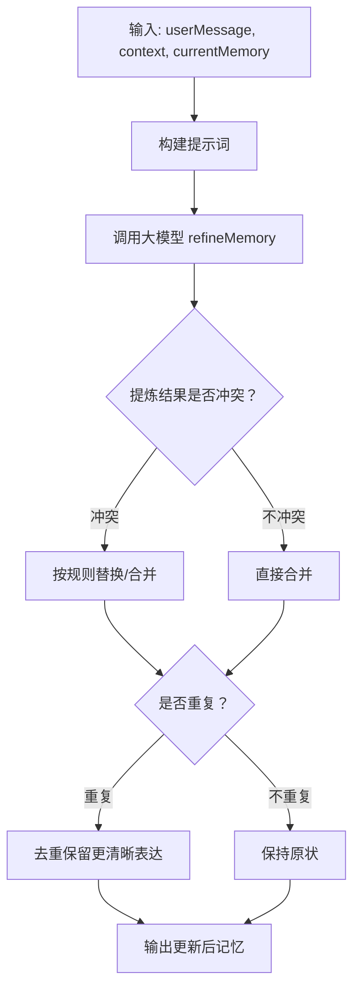
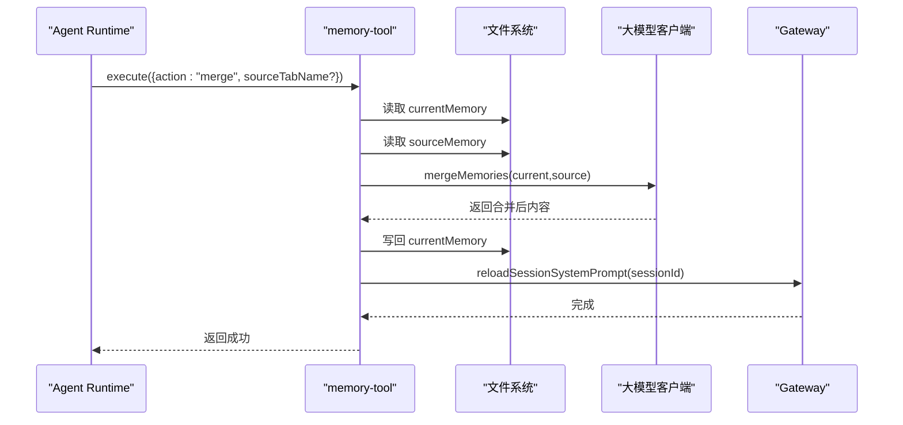
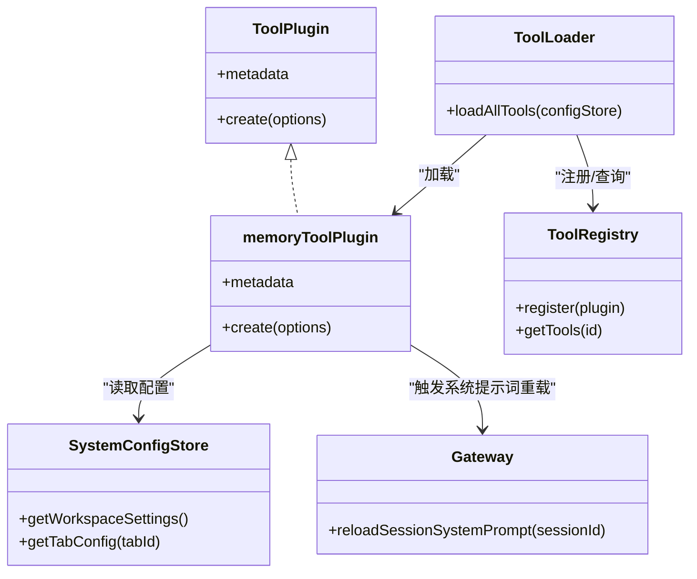

# 记忆管理工具

<cite>
**本文引用的文件**
- [memory-tool.ts](file://src/main/tools/memory-tool.ts)
- [MEMORY-TRIGGER.md](file://src/main/prompts/templates/MEMORY-TRIGGER.md)
- [system-config-store.ts](file://src/main/database/system-config-store.ts)
- [tab-config.ts](file://src/main/database/tab-config.ts)
- [workspace-config.ts](file://src/main/database/workspace-config.ts)
- [gateway.ts](file://src/main/gateway.ts)
- [tool-interface.ts](file://src/main/tools/registry/tool-interface.ts)
- [tool-loader.ts](file://src/main/tools/registry/tool-loader.ts)
- [config-types.ts](file://src/main/database/config-types.ts)
</cite>

## 目录
1. [简介](#简介)
2. [项目结构](#项目结构)
3. [核心组件](#核心组件)
4. [架构总览](#架构总览)
5. [详细组件分析](#详细组件分析)
6. [依赖关系分析](#依赖关系分析)
7. [性能考量](#性能考量)
8. [故障排查指南](#故障排查指南)
9. [结论](#结论)
10. [附录](#附录)

## 简介
本文件面向 DeepBot 记忆管理工具，系统性阐述其功能设计与实现原理，包括：
- 全局记忆存储与独立记忆管理
- 记忆更新机制（基于大模型提炼与分类）
- 记忆数据结构与存储策略
- 检索与合并算法
- 使用示例、记忆组织方式与数据持久化策略
- 清理机制、性能优化与错误处理

目标读者既包括需要快速上手使用的开发者，也包括希望深入理解实现细节的技术人员。

## 项目结构
记忆管理工具位于主进程工具模块中，围绕以下关键文件协同工作：
- 记忆工具实现：src/main/tools/memory-tool.ts
- 使用时机与规则：src/main/prompts/templates/MEMORY-TRIGGER.md
- 配置与持久化：src/main/database/system-config-store.ts、src/main/database/tab-config.ts、src/main/database/workspace-config.ts
- 工具注册与加载：src/main/tools/registry/tool-interface.ts、src/main/tools/registry/tool-loader.ts
- 网关集成：src/main/gateway.ts

**图表来源**
- [memory-tool.ts:1-870](file://src/main/tools/memory-tool.ts#L1-L870)
- [MEMORY-TRIGGER.md:1-302](file://src/main/prompts/templates/MEMORY-TRIGGER.md#L1-L302)
- [system-config-store.ts:1-576](file://src/main/database/system-config-store.ts#L1-L576)
- [tab-config.ts:1-218](file://src/main/database/tab-config.ts#L1-L218)
- [workspace-config.ts:1-219](file://src/main/database/workspace-config.ts#L1-L219)
- [gateway.ts:1-200](file://src/main/gateway.ts#L1-L200)
- [tool-loader.ts:1-312](file://src/main/tools/registry/tool-loader.ts#L1-L312)
- [tool-interface.ts:1-152](file://src/main/tools/registry/tool-interface.ts#L1-L152)
- [config-types.ts:1-67](file://src/main/database/config-types.ts#L1-L67)

**章节来源**
- [memory-tool.ts:1-870](file://src/main/tools/memory-tool.ts#L1-L870)
- [system-config-store.ts:1-576](file://src/main/database/system-config-store.ts#L1-L576)
- [workspace-config.ts:1-219](file://src/main/database/workspace-config.ts#L1-L219)
- [tab-config.ts:1-218](file://src/main/database/tab-config.ts#L1-L218)
- [gateway.ts:1-200](file://src/main/gateway.ts#L1-L200)
- [tool-loader.ts:1-312](file://src/main/tools/registry/tool-loader.ts#L1-L312)
- [tool-interface.ts:1-152](file://src/main/tools/registry/tool-interface.ts#L1-L152)
- [config-types.ts:1-67](file://src/main/database/config-types.ts#L1-L67)

## 核心组件
- 记忆工具插件：提供 read/update/merge 三种操作，支持全局 memory.md 与各 Tab 独立 memory 文件。
- 配置存储：通过 SystemConfigStore 统一管理工作目录与各配置表，含 Tab 配置与工作目录配置。
- 网关集成：Gateway 在初始化时向记忆工具注入自身实例，以便在合并后触发系统提示词重新加载。
- 工具注册与加载：ToolLoader 负责加载内置工具（含记忆工具），ToolRegistry 提供注册与查询能力。

**章节来源**
- [memory-tool.ts:408-787](file://src/main/tools/memory-tool.ts#L408-L787)
- [system-config-store.ts:37-566](file://src/main/database/system-config-store.ts#L37-L566)
- [tab-config.ts:46-218](file://src/main/database/tab-config.ts#L46-L218)
- [workspace-config.ts:17-89](file://src/main/database/workspace-config.ts#L17-L89)
- [gateway.ts:103-106](file://src/main/gateway.ts#L103-L106)
- [tool-loader.ts:109-301](file://src/main/tools/registry/tool-loader.ts#L109-L301)
- [tool-interface.ts:101-134](file://src/main/tools/registry/tool-interface.ts#L101-L134)

## 架构总览
记忆工具的执行路径如下：
- 工具加载：ToolLoader 在会话创建时加载 memory-tool 插件。
- 会话绑定：Gateway 将自身实例注入 memory-tool，用于在更新后触发系统提示词重新加载。
- 记忆读写：根据 sessionId 与 Tab 配置，确定使用 memory.md 或独立 memory-{tabId}.md。
- AI 合成：通过大模型对记忆进行提炼、分类与去重；合并时解决冲突并保持结构完整性。
- 持久化：写回文件系统，受最大长度限制；超长自动截断。

**图表来源**
- [tool-loader.ts:179-195](file://src/main/tools/registry/tool-loader.ts#L179-L195)
- [memory-tool.ts:481-783](file://src/main/tools/memory-tool.ts#L481-L783)
- [system-config-store.ts:467-495](file://src/main/database/system-config-store.ts#L467-L495)
- [workspace-config.ts:51-89](file://src/main/database/workspace-config.ts#L51-L89)
- [gateway.ts:103-106](file://src/main/gateway.ts#L103-L106)

**章节来源**
- [tool-loader.ts:109-301](file://src/main/tools/registry/tool-loader.ts#L109-L301)
- [memory-tool.ts:481-783](file://src/main/tools/memory-tool.ts#L481-L783)
- [system-config-store.ts:467-495](file://src/main/database/system-config-store.ts#L467-L495)
- [workspace-config.ts:51-89](file://src/main/database/workspace-config.ts#L51-L89)
- [gateway.ts:103-106](file://src/main/gateway.ts#L103-L106)

## 详细组件分析

### 记忆数据结构与存储策略
- 文件结构：Markdown 文档，分为“角色”“用户习惯”“错误总结”“备忘事项”四个分区，便于分类与检索。
- 存储位置：
  - 全局记忆：memory.md（默认）
  - 独立记忆：memory-{tabId}.md（当 Tab 配置中设置了 memoryFile）
- 目录来源：工作目录配置中的 memoryDir，支持默认路径与 Docker 模式下的固定路径。
- 长度限制：单文件最大字符数限制，超限自动截断，确保稳定性与性能。

**图表来源**
- [memory-tool.ts:146-164](file://src/main/tools/memory-tool.ts#L146-L164)
- [workspace-config.ts:51-89](file://src/main/database/workspace-config.ts#L51-L89)
- [tab-config.ts:98-110](file://src/main/database/tab-config.ts#L98-L110)

**章节来源**
- [memory-tool.ts:33-58](file://src/main/tools/memory-tool.ts#L33-L58)
- [memory-tool.ts:146-164](file://src/main/tools/memory-tool.ts#L146-L164)
- [workspace-config.ts:17-89](file://src/main/database/workspace-config.ts#L17-L89)
- [tab-config.ts:12-41](file://src/main/database/tab-config.ts#L12-L41)

### 独立记忆管理
- 为新 Tab 创建独立记忆文件：继承主 memory 内容，便于在多会话间隔离记忆。
- 删除 Tab 独立记忆文件：支持按需清理，避免磁盘冗余。
- Tab 配置持久化：通过 agent_tabs 表记录 memory_file、标题、类型等信息。

**图表来源**
- [memory-tool.ts:114-138](file://src/main/tools/memory-tool.ts#L114-L138)
- [system-config-store.ts:467-495](file://src/main/database/system-config-store.ts#L467-L495)

**章节来源**
- [memory-tool.ts:114-138](file://src/main/tools/memory-tool.ts#L114-L138)
- [memory-tool.ts:826-869](file://src/main/tools/memory-tool.ts#L826-L869)
- [tab-config.ts:46-93](file://src/main/database/tab-config.ts#L46-L93)

### 记忆更新机制（提炼与分类）
- 输入：用户消息与执行上下文（可选）。
- 处理：
  - 调用大模型提炼关键信息，控制每条记忆长度上限。
  - 自动分类到“角色”“用户习惯”“错误总结”“备忘事项”。
  - 去重与冲突处理：若与现有信息冲突，依据最新信息决定保留；重复项仅保留一条。
- 输出：更新后的完整记忆文件，写回对应文件。

**图表来源**
- [memory-tool.ts:311-401](file://src/main/tools/memory-tool.ts#L311-L401)

**章节来源**
- [memory-tool.ts:311-401](file://src/main/tools/memory-tool.ts#L311-L401)

### 记忆合并机制（Tab 间与主记忆）
- 源选择：可指定源 Tab 名称，或默认使用主记忆（memory.md）。
- 冲突解决：当前 Tab 记忆优先级更高，优先保留当前 Tab 的信息。
- 去重与整理：合并后统一去重、分类整理，保持结构与长度限制。
- 后续动作：写回当前 Tab 记忆，并触发系统提示词重新加载。

**图表来源**
- [memory-tool.ts:521-621](file://src/main/tools/memory-tool.ts#L521-L621)

**章节来源**
- [memory-tool.ts:233-306](file://src/main/tools/memory-tool.ts#L233-L306)
- [memory-tool.ts:521-621](file://src/main/tools/memory-tool.ts#L521-L621)

### 使用示例与最佳实践
- 何时调用：
  - 需要长期记忆：角色、用户习惯、错误总结、备忘事项 → 使用 update
  - 查询记忆：使用 read
  - 临时信息：不调用工具
  - 名字相关：使用 api_set_name，不使用 memory
- 典型流程：
  - 设置角色：调用 update 并等待完成后再回复“已记住”
  - 表达偏好：调用 update
  - 询问记忆：调用 read
  - 合并记忆：调用 merge，指定源 Tab 或默认主记忆

**章节来源**
- [MEMORY-TRIGGER.md:145-302](file://src/main/prompts/templates/MEMORY-TRIGGER.md#L145-L302)

### 数据持久化策略
- 工作目录配置：memoryDir 由系统配置存储提供，支持默认路径与 Docker 固定路径。
- Tab 配置：记录每个 Tab 的 memory_file，实现独立记忆文件。
- 配置迁移：SystemConfigStore 在初始化时创建并迁移表结构，保证兼容性。

**章节来源**
- [workspace-config.ts:17-89](file://src/main/database/workspace-config.ts#L17-L89)
- [tab-config.ts:46-125](file://src/main/database/tab-config.ts#L46-L125)
- [system-config-store.ts:82-225](file://src/main/database/system-config-store.ts#L82-L225)

### 错误处理与取消机制
- 取消支持：execute 接收 AbortSignal，任一步骤检测到 aborted 即抛出 AbortError。
- 错误捕获：统一通过错误处理器获取可读错误信息，返回标准化错误响应。
- 文件异常：读取失败时返回默认模板，避免中断流程。

**章节来源**
- [memory-tool.ts:491-496](file://src/main/tools/memory-tool.ts#L491-L496)
- [memory-tool.ts:766-782](file://src/main/tools/memory-tool.ts#L766-L782)

## 依赖关系分析
- 工具接口：ToolPlugin 定义工具元数据与创建方法，memory-tool 实现该接口。
- 工具加载：ToolLoader 在会话创建时加载 memory-tool 插件，并将其注册到 ToolRegistry。
- 网关集成：Gateway 在构造函数中将自身实例注入 memory-tool，用于在更新后触发系统提示词重新加载。
- 配置依赖：memory-tool 依赖 SystemConfigStore 读取工作目录与 Tab 配置，依赖 workspace-config 与 tab-config 提供类型与持久化。

**图表来源**
- [tool-interface.ts:101-134](file://src/main/tools/registry/tool-interface.ts#L101-L134)
- [tool-loader.ts:109-301](file://src/main/tools/registry/tool-loader.ts#L109-L301)
- [system-config-store.ts:37-566](file://src/main/database/system-config-store.ts#L37-L566)
- [gateway.ts:103-106](file://src/main/gateway.ts#L103-L106)

**章节来源**
- [tool-interface.ts:101-134](file://src/main/tools/registry/tool-interface.ts#L101-L134)
- [tool-loader.ts:109-301](file://src/main/tools/registry/tool-loader.ts#L109-L301)
- [system-config-store.ts:37-566](file://src/main/database/system-config-store.ts#L37-L566)
- [gateway.ts:103-106](file://src/main/gateway.ts#L103-L106)

## 性能考量
- 大模型调用：
  - refineMemory 使用快速模型（useFastModel），maxTokens 适中，适合轻量级提炼。
  - mergeMemories 使用更强模型与更大输出空间，适合复杂合并与冲突解决。
- 文件 I/O：
  - 读写采用异步 fs/promises，避免阻塞主线程。
  - 写入前进行长度截断，防止超长文本导致内存与 IO 压力。
- 会话提示词重载：
  - 更新后仅重载相关 Tab 的系统提示词，减少不必要的重载次数。

**章节来源**
- [memory-tool.ts:294-299](file://src/main/tools/memory-tool.ts#L294-L299)
- [memory-tool.ts:389-394](file://src/main/tools/memory-tool.ts#L389-L394)
- [memory-tool.ts:734-745](file://src/main/tools/memory-tool.ts#L734-L745)

## 故障排查指南
- 记忆文件未创建或为空：
  - 检查 memoryDir 是否正确，确认 ensureMemoryFile 是否被调用。
  - 若读取失败，工具会回退到默认模板，确认文件权限与路径。
- 合并失败或冲突未解决：
  - 确认源 Tab 是否存在且配置了独立 memory 文件。
  - 检查大模型返回内容是否符合预期，必要时调整提示词。
- 更新后系统提示词未刷新：
  - 确认 Gateway 实例已注入 memory-tool，且 reloadSessionSystemPrompt 被调用。
- Docker 环境路径异常：
  - Docker 模式下 memoryDir 为固定路径，避免使用数据库配置覆盖。

**章节来源**
- [memory-tool.ts:170-186](file://src/main/tools/memory-tool.ts#L170-L186)
- [memory-tool.ts:532-556](file://src/main/tools/memory-tool.ts#L532-L556)
- [gateway.ts:103-106](file://src/main/gateway.ts#L103-L106)
- [workspace-config.ts:19-35](file://src/main/database/workspace-config.ts#L19-L35)

## 结论
DeepBot 记忆管理工具通过“全局记忆 + 独立记忆”的双层结构，结合大模型驱动的提炼、分类与去重机制，实现了稳定、可扩展的记忆管理能力。配合系统配置存储与网关集成，工具在多会话场景下具备良好的隔离性与一致性。遵循使用时机与规则，可有效避免误用与重复更新，提升整体交互质量与性能表现。

## 附录
- 记忆文件最大长度：20000 字符（写入时截断）
- 更新后系统提示词重载：仅针对当前 Tab 或默认 Tab
- 名字管理：严格禁止在 memory 中记录名字，应使用 api_set_name 工具

**章节来源**
- [memory-tool.ts:34](file://src/main/tools/memory-tool.ts#L34)
- [memory-tool.ts:473-477](file://src/main/tools/memory-tool.ts#L473-L477)
- [MEMORY-TRIGGER.md:293-301](file://src/main/prompts/templates/MEMORY-TRIGGER.md#L293-L301)