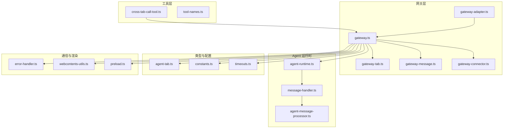
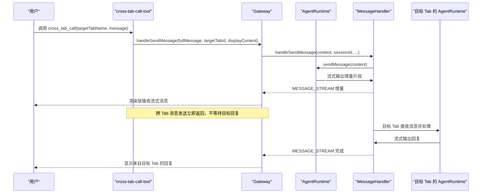
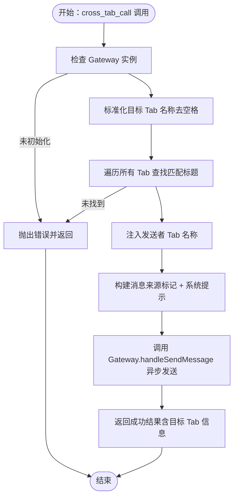
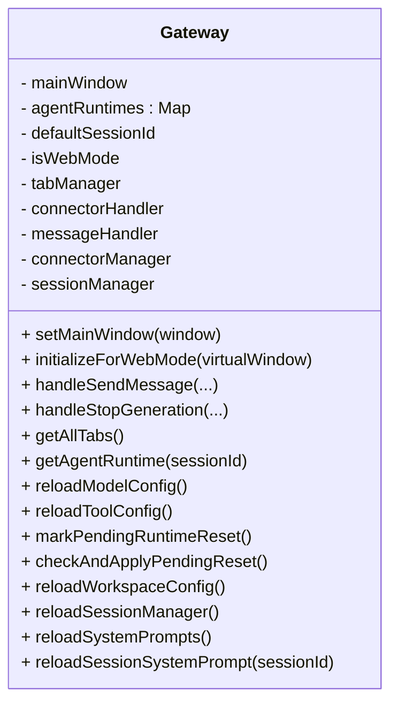
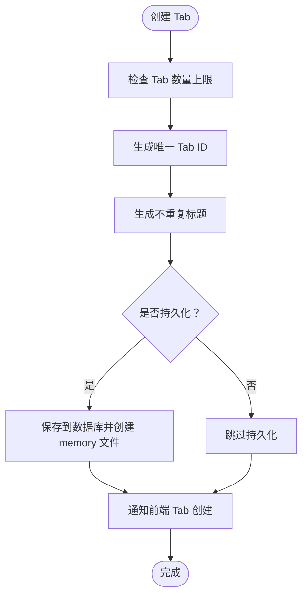
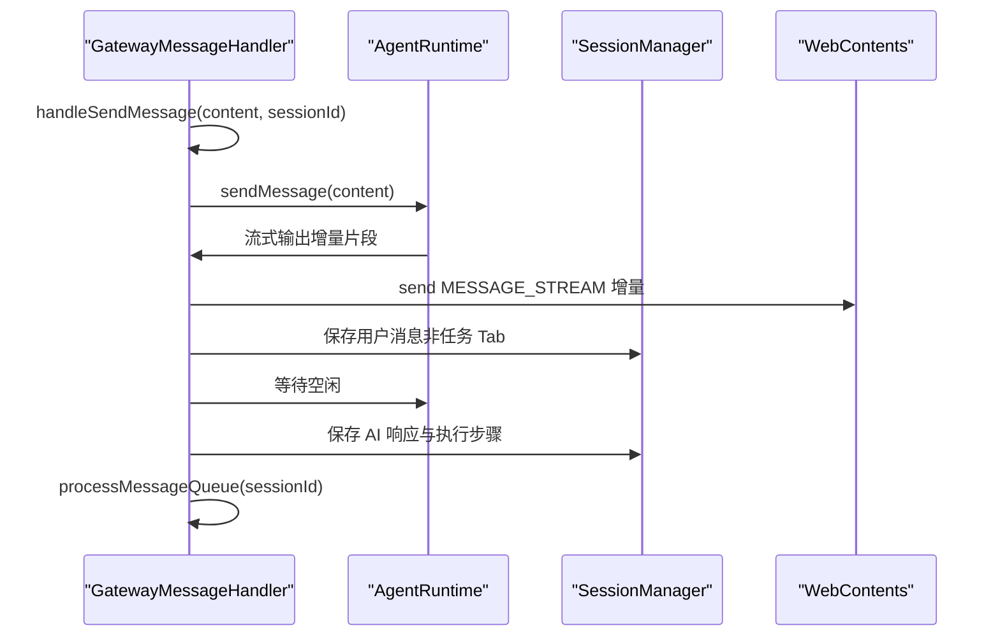
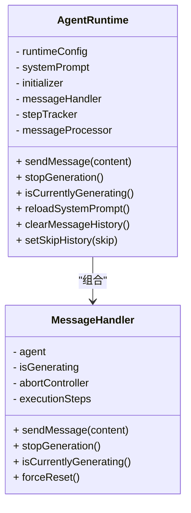
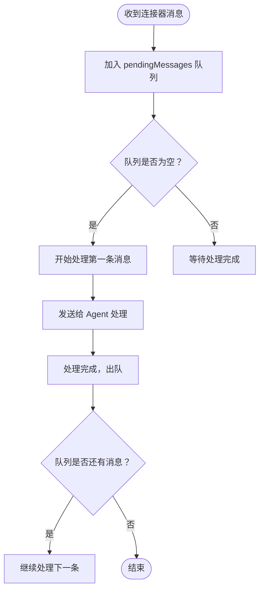
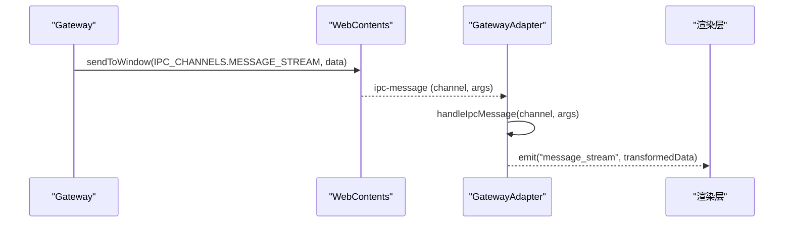
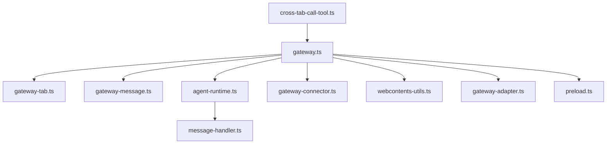

# 跨 Tab 通信工具

<cite>
**本文档引用的文件**
- [cross-tab-call-tool.ts](file://src/main/tools/cross-tab-call-tool.ts)
- [gateway.ts](file://src/main/gateway.ts)
- [gateway-tab.ts](file://src/main/gateway-tab.ts)
- [gateway-message.ts](file://src/main/gateway-message.ts)
- [agent-runtime.ts](file://src/main/agent-runtime/agent-runtime.ts)
- [message-handler.ts](file://src/main/agent-runtime/message-handler.ts)
- [agent-message-processor.ts](file://src/main/agent-runtime/agent-message-processor.ts)
- [agent-tab.ts](file://src/types/agent-tab.ts)
- [tool-names.ts](file://src/main/tools/tool-names.ts)
- [constants.ts](file://src/main/config/constants.ts)
- [timeouts.ts](file://src/main/config/timeouts.ts)
- [error-handler.ts](file://src/shared/utils/error-handler.ts)
- [webcontents-utils.ts](file://src/shared/utils/webcontents-utils.ts)
- [gateway-connector.ts](file://src/main/gateway-connector.ts)
- [gateway-adapter.ts](file://src/server/gateway-adapter.ts)
- [preload.ts](file://src/main/preload.ts)
- [TOOLS.md](file://src/main/prompts/templates/TOOLS.md)
</cite>

## 目录
1. [简介](#简介)
2. [项目结构](#项目结构)
3. [核心组件](#核心组件)
4. [架构总览](#架构总览)
5. [详细组件分析](#详细组件分析)
6. [依赖关系分析](#依赖关系分析)
7. [性能考虑](#性能考虑)
8. [故障排除指南](#故障排除指南)
9. [结论](#结论)
10. [附录](#附录)

## 简介
本文件面向 史丽慧小助理 的跨 Tab 通信工具，系统性阐述 Agent 间消息传递、多 Agent 协作、任务分发机制的实现原理。重点覆盖通信协议、消息路由、状态同步、错误处理与调试方法，并提供使用示例与性能优化策略，帮助开发者与使用者高效理解与运用跨 Tab 能力。

## 项目结构
跨 Tab 通信涉及以下关键模块：
- 工具层：cross-tab-call-tool 提供跨 Tab 消息发送能力
- 网关层：Gateway 负责会话管理、消息路由、Tab 生命周期与连接器集成
- Tab 管理：GatewayTabManager 管理 Tab 的创建、关闭、持久化与历史加载
- 消息处理：GatewayMessageHandler 负责消息队列、流式响应与错误恢复
- Agent 运行时：AgentRuntime 与 MessageHandler 负责消息处理、工具执行与流式输出
- 类型与常量：agent-tab 定义 Tab 数据结构；constants、timeouts 提供配置
- 通信桥接：gateway-connector、gateway-adapter、preload 提供连接器与渲染层通信

**图表来源**
- [cross-tab-call-tool.ts:1-166](file://src/main/tools/cross-tab-call-tool.ts#L1-L166)
- [gateway.ts:1-796](file://src/main/gateway.ts#L1-L796)
- [gateway-tab.ts:1-796](file://src/main/gateway-tab.ts#L1-L796)
- [gateway-message.ts:1-525](file://src/main/gateway-message.ts#L1-L525)
- [agent-runtime.ts:1-909](file://src/main/agent-runtime/agent-runtime.ts#L1-L909)
- [message-handler.ts:1-752](file://src/main/agent-runtime/message-handler.ts#L1-L752)
- [agent-message-processor.ts:1-70](file://src/main/agent-runtime/agent-message-processor.ts#L1-L70)
- [agent-tab.ts:1-87](file://src/types/agent-tab.ts#L1-L87)
- [tool-names.ts:1-106](file://src/main/tools/tool-names.ts#L1-L106)
- [constants.ts:1-26](file://src/main/config/constants.ts#L1-L26)
- [timeouts.ts:1-78](file://src/main/config/timeouts.ts#L1-L78)
- [error-handler.ts:1-51](file://src/shared/utils/error-handler.ts#L1-L51)
- [webcontents-utils.ts:1-144](file://src/shared/utils/webcontents-utils.ts#L1-L144)
- [gateway-connector.ts:255-446](file://src/main/gateway-connector.ts#L255-L446)
- [gateway-adapter.ts:45-88](file://src/server/gateway-adapter.ts#L45-L88)
- [preload.ts:251-286](file://src/main/preload.ts#L251-L286)

**章节来源**
- [cross-tab-call-tool.ts:1-166](file://src/main/tools/cross-tab-call-tool.ts#L1-L166)
- [gateway.ts:1-796](file://src/main/gateway.ts#L1-L796)
- [gateway-tab.ts:1-796](file://src/main/gateway-tab.ts#L1-L796)
- [gateway-message.ts:1-525](file://src/main/gateway-message.ts#L1-L525)
- [agent-runtime.ts:1-909](file://src/main/agent-runtime/agent-runtime.ts#L1-L909)
- [message-handler.ts:1-752](file://src/main/agent-runtime/message-handler.ts#L1-L752)
- [agent-message-processor.ts:1-70](file://src/main/agent-runtime/agent-message-processor.ts#L1-L70)
- [agent-tab.ts:1-87](file://src/types/agent-tab.ts#L1-L87)
- [tool-names.ts:1-106](file://src/main/tools/tool-names.ts#L1-L106)
- [constants.ts:1-26](file://src/main/config/constants.ts#L1-L26)
- [timeouts.ts:1-78](file://src/main/config/timeouts.ts#L1-L78)
- [error-handler.ts:1-51](file://src/shared/utils/error-handler.ts#L1-L51)
- [webcontents-utils.ts:1-144](file://src/shared/utils/webcontents-utils.ts#L1-L144)
- [gateway-connector.ts:255-446](file://src/main/gateway-connector.ts#L255-L446)
- [gateway-adapter.ts:45-88](file://src/server/gateway-adapter.ts#L45-L88)
- [preload.ts:251-286](file://src/main/preload.ts#L251-L286)

## 核心组件
- 跨 Tab 调用工具：负责解析目标 Tab、注入发送者 Tab 名称、构建消息并调用 Gateway 发送
- Gateway：全局协调者，管理 Tab、会话、消息路由、连接器与运行时生命周期
- Tab 管理器：创建/关闭/持久化 Tab，加载历史，维护活动状态
- 消息处理器：队列化消息、流式输出、错误恢复、连接器响应
- Agent 运行时与消息处理器：执行工具、流式输出、执行步骤追踪、超时与取消
- 类型与配置：Tab 数据结构、常量与超时配置
- 通信桥接：连接器消息队列、WebSocket 适配器、IPC 通道

**章节来源**
- [cross-tab-call-tool.ts:1-166](file://src/main/tools/cross-tab-call-tool.ts#L1-L166)
- [gateway.ts:1-796](file://src/main/gateway.ts#L1-L796)
- [gateway-tab.ts:1-796](file://src/main/gateway-tab.ts#L1-L796)
- [gateway-message.ts:1-525](file://src/main/gateway-message.ts#L1-L525)
- [agent-runtime.ts:1-909](file://src/main/agent-runtime/agent-runtime.ts#L1-L909)
- [message-handler.ts:1-752](file://src/main/agent-runtime/message-handler.ts#L1-L752)
- [agent-tab.ts:1-87](file://src/types/agent-tab.ts#L1-L87)
- [constants.ts:1-26](file://src/main/config/constants.ts#L1-L26)
- [timeouts.ts:1-78](file://src/main/config/timeouts.ts#L1-L78)

## 架构总览
跨 Tab 通信采用“工具触发—网关路由—运行时处理—消息流式输出”的链路，结合消息队列与错误恢复机制，确保多 Agent 场景下的可靠协作。

**图表来源**
- [cross-tab-call-tool.ts:69-165](file://src/main/tools/cross-tab-call-tool.ts#L69-L165)
- [gateway.ts:476-490](file://src/main/gateway.ts#L476-L490)
- [gateway-message.ts:76-160](file://src/main/gateway-message.ts#L76-L160)
- [agent-runtime.ts:661-688](file://src/main/agent-runtime/agent-runtime.ts#L661-L688)
- [message-handler.ts:114-587](file://src/main/agent-runtime/message-handler.ts#L114-L587)

**章节来源**
- [cross-tab-call-tool.ts:1-166](file://src/main/tools/cross-tab-call-tool.ts#L1-L166)
- [gateway.ts:1-796](file://src/main/gateway.ts#L1-L796)
- [gateway-message.ts:1-525](file://src/main/gateway-message.ts#L1-L525)
- [agent-runtime.ts:1-909](file://src/main/agent-runtime/agent-runtime.ts#L1-L909)
- [message-handler.ts:1-752](file://src/main/agent-runtime/message-handler.ts#L1-L752)

## 详细组件分析

### 跨 Tab 调用工具（cross-tab-call-tool）
- 功能职责：解析目标 Tab、注入发送者 Tab 名称、构建消息并调用 Gateway 发送
- 关键点：
  - 目标 Tab 查找：忽略空格后匹配 Tab 标题
  - 发送者名称注入：由 AgentRuntime 注入，保证消息来源可追溯
  - 消息构建：附加来源标记与系统提示，明确“除非明确要求回复，否则不回复”
  - 异步发送：调用 Gateway.handleSendMessage 后立即返回，不阻塞
  - 错误处理：统一通过 getErrorMessage 输出友好错误

**图表来源**
- [cross-tab-call-tool.ts:69-165](file://src/main/tools/cross-tab-call-tool.ts#L69-L165)

**章节来源**
- [cross-tab-call-tool.ts:1-166](file://src/main/tools/cross-tab-call-tool.ts#L1-L166)
- [tool-names.ts:83-84](file://src/main/tools/tool-names.ts#L83-L84)

### Gateway（会话与消息路由）
- 职责：管理 Tab、会话、消息路由、连接器与运行时生命周期
- 关键点：
  - 依赖注入：为各处理器设置依赖（Tab、消息、连接器）
  - 会话管理：按 sessionId 管理 AgentRuntime，支持重置与延迟重置
  - 消息路由：handleSendMessage 代理到消息处理器
  - 连接器集成：注册多种连接器，支持外部消息进入与响应
  - 初始化：设置全局 Gateway 实例，传递给工具与连接器

**图表来源**
- [gateway.ts:33-772](file://src/main/gateway.ts#L33-L772)

**章节来源**
- [gateway.ts:1-796](file://src/main/gateway.ts#L1-L796)

### Tab 管理（GatewayTabManager）
- 职责：Tab 生命周期管理、持久化、历史加载、欢迎消息、任务专属 Tab
- 关键点：
  - 创建/关闭 Tab：支持持久化与内存 Tab，自动维护 memory 文件
  - 历史加载：按需加载 UI 历史，支持 Web 模式空历史事件
  - 任务 Tab：锁定任务 Tab，暂停任务时自动处理
  - 欢迎消息：根据配置与历史决定是否发送

**图表来源**
- [gateway-tab.ts:491-611](file://src/main/gateway-tab.ts#L491-L611)

**章节来源**
- [gateway-tab.ts:1-796](file://src/main/gateway-tab.ts#L1-L796)
- [agent-tab.ts:1-87](file://src/types/agent-tab.ts#L1-L87)

### 消息处理与队列（GatewayMessageHandler）
- 职责：消息队列、流式输出、错误恢复、连接器响应
- 关键点：
  - 队列机制：普通 Tab 正在生成时将消息入队，任务 Tab 等待完成
  - 流式输出：实时发送 MESSAGE_STREAM，支持执行步骤更新
  - 错误恢复：检测 AI 连接错误与 Agent 状态异常，自动重置并重试
  - 连接器响应：将 AI 响应发送回连接器（如飞书）

**图表来源**
- [gateway-message.ts:76-160](file://src/main/gateway-message.ts#L76-L160)
- [gateway-message.ts:288-371](file://src/main/gateway-message.ts#L288-L371)
- [gateway-message.ts:375-473](file://src/main/gateway-message.ts#L375-L473)

**章节来源**
- [gateway-message.ts:1-525](file://src/main/gateway-message.ts#L1-L525)

### Agent 运行时与消息处理器
- AgentRuntime：初始化工具、注入 senderTabName、维护消息队列、提供流式输出
- MessageHandler：事件驱动的流式输出、执行步骤追踪、超时与取消、强制重置

**图表来源**
- [agent-runtime.ts:27-800](file://src/main/agent-runtime/agent-runtime.ts#L27-L800)
- [message-handler.ts:16-752](file://src/main/agent-runtime/message-handler.ts#L16-L752)

**章节来源**
- [agent-runtime.ts:1-909](file://src/main/agent-runtime/agent-runtime.ts#L1-L909)
- [message-handler.ts:1-752](file://src/main/agent-runtime/message-handler.ts#L1-L752)

### 连接器消息队列（GatewayConnector）
- 职责：连接器消息入队、顺序处理、进度提醒、响应发送
- 关键点：
  - pendingMessages 队列：按消息顺序处理
  - 进度提醒：定时器避免长时间无反馈
  - 响应发送：将 AI 响应发送回连接器

**图表来源**
- [gateway-connector.ts:255-446](file://src/main/gateway-connector.ts#L255-L446)

**章节来源**
- [gateway-connector.ts:255-446](file://src/main/gateway-connector.ts#L255-L446)

### 通信桥接与渲染层
- WebContents 工具：统一发送消息到窗口或内容
- GatewayAdapter：将 IPC 消息转换为 WebSocket 事件
- Preload：监听 Tab 事件与清空聊天指令

**图表来源**
- [webcontents-utils.ts:50-61](file://src/shared/utils/webcontents-utils.ts#L50-L61)
- [gateway-adapter.ts:70-88](file://src/server/gateway-adapter.ts#L70-L88)
- [preload.ts:251-286](file://src/main/preload.ts#L251-L286)

**章节来源**
- [webcontents-utils.ts:1-144](file://src/shared/utils/webcontents-utils.ts#L1-L144)
- [gateway-adapter.ts:45-88](file://src/server/gateway-adapter.ts#L45-L88)
- [preload.ts:251-286](file://src/main/preload.ts#L251-L286)

## 依赖关系分析
- 工具依赖 Gateway：cross-tab-call-tool 通过 setGatewayForCrossTabCallTool 注入 Gateway 实例
- Gateway 依赖各处理器：Tab、消息、连接器、会话管理
- AgentRuntime 依赖 MessageHandler：工具执行与流式输出
- 渲染层依赖 WebContents 工具：统一消息发送
- 连接器依赖 Gateway：消息入队与响应发送

**图表来源**
- [cross-tab-call-tool.ts:22-29](file://src/main/tools/cross-tab-call-tool.ts#L22-L29)
- [gateway.ts:119-122](file://src/main/gateway.ts#L119-L122)
- [gateway.ts:36-39](file://src/main/gateway.ts#L36-L39)
- [webcontents-utils.ts:50-61](file://src/shared/utils/webcontents-utils.ts#L50-L61)
- [gateway-adapter.ts:70-88](file://src/server/gateway-adapter.ts#L70-L88)
- [preload.ts:251-286](file://src/main/preload.ts#L251-L286)

**章节来源**
- [cross-tab-call-tool.ts:1-166](file://src/main/tools/cross-tab-call-tool.ts#L1-L166)
- [gateway.ts:1-796](file://src/main/gateway.ts#L1-L796)
- [webcontents-utils.ts:1-144](file://src/shared/utils/webcontents-utils.ts#L1-L144)
- [gateway-adapter.ts:45-88](file://src/server/gateway-adapter.ts#L45-L88)
- [preload.ts:251-286](file://src/main/preload.ts#L251-L286)

## 性能考虑
- 消息队列：普通 Tab 正在生成时入队，避免并发冲突；任务 Tab 等待完成，保障顺序一致性
- 流式输出：实时发送 MESSAGE_STREAM，降低感知延迟
- 超时与取消：使用 AbortController 与超时配置，防止长时间占用
- 历史压缩：加载历史时进行上下文压缩，控制 Token 使用
- 连接器队列：按消息顺序处理，避免并发竞争

[本节为通用性能讨论，不直接分析具体文件]

## 故障排除指南
- 跨 Tab 消息失败：
  - 目标 Tab 不存在：检查目标 Tab 名称与空格处理
  - Gateway 未初始化：确认 setGatewayForCrossTabCallTool 已调用
  - 工具被取消：检查 AbortSignal 状态
- Agent 卡住或状态异常：
  - 使用 MessageHandler.forceReset 强制重置
  - Gateway.markPendingRuntimeReset 延迟重置运行时
- 连接器消息堆积：
  - 检查 pendingMessages 队列长度与处理进度提醒定时器
- 渲染层无消息：
  - 检查 WebContents 发送与 GatewayAdapter 转换
  - 确认 preload 监听的 IPC 通道

**章节来源**
- [cross-tab-call-tool.ts:86-165](file://src/main/tools/cross-tab-call-tool.ts#L86-L165)
- [gateway-message.ts:230-283](file://src/main/gateway-message.ts#L230-L283)
- [message-handler.ts:682-698](file://src/main/agent-runtime/message-handler.ts#L682-L698)
- [gateway.ts:254-269](file://src/main/gateway.ts#L254-L269)
- [gateway-connector.ts:369-425](file://src/main/gateway-connector.ts#L369-L425)
- [webcontents-utils.ts:20-37](file://src/shared/utils/webcontents-utils.ts#L20-L37)
- [gateway-adapter.ts:70-88](file://src/server/gateway-adapter.ts#L70-L88)
- [preload.ts:251-286](file://src/main/preload.ts#L251-L286)

## 结论
跨 Tab 通信通过“工具—网关—运行时—消息处理器”的清晰分层，实现了异步双向协作、消息队列与流式输出、错误恢复与状态同步。配合连接器队列与 WebSocket 适配，史丽慧小助理 能在多 Agent 场景下稳定高效地完成任务分发与协同。

[本节为总结性内容，不直接分析具体文件]

## 附录

### 使用示例与协作模式
- 发送消息给其他 Agent：cross_tab_call(targetTabName, message)
- 请求协作：将任务委托给专门的 Agent
- 多 Agent 对话：不同 Agent 之间互相交流
- 回复消息：目标 Tab 使用 cross_tab_call 主动回复

参考示例与注意事项见工具模板文档。

**章节来源**
- [TOOLS.md:1186-1246](file://src/main/prompts/templates/TOOLS.md#L1186-L1246)

### 通信协议与消息路由
- 协议要点：
  - 跨 Tab 消息立即返回，不等待目标回复
  - 目标 Tab 正在处理时自动排队
  - 消息自动标记来源，系统提示明确“除非明确要求回复，否则不回复”
- 路由机制：
  - 工具层：cross-tab-call-tool 解析目标 Tab 并注入发送者名称
  - 网关层：Gateway.handleSendMessage 路由至消息处理器
  - 处理层：GatewayMessageHandler 队列化与流式输出
  - 渲染层：IPC 通道与 WebSocket 事件统一呈现

**章节来源**
- [cross-tab-call-tool.ts:93-124](file://src/main/tools/cross-tab-call-tool.ts#L93-L124)
- [gateway.ts:476-490](file://src/main/gateway.ts#L476-L490)
- [gateway-message.ts:76-160](file://src/main/gateway-message.ts#L76-L160)
- [gateway-adapter.ts:70-88](file://src/server/gateway-adapter.ts#L70-L88)

### 安全与错误处理
- 安全检查：工具执行中进行安全检查，错误结果会被识别并标记
- 错误处理：统一通过 getErrorMessage 输出；AI 连接错误自动恢复
- 取消与超时：AbortController 与超时配置保障资源回收

**章节来源**
- [error-handler.ts:1-51](file://src/shared/utils/error-handler.ts#L1-L51)
- [gateway-message.ts:230-283](file://src/main/gateway-message.ts#L230-L283)
- [timeouts.ts:9-53](file://src/main/config/timeouts.ts#L9-L53)