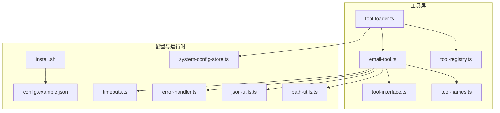
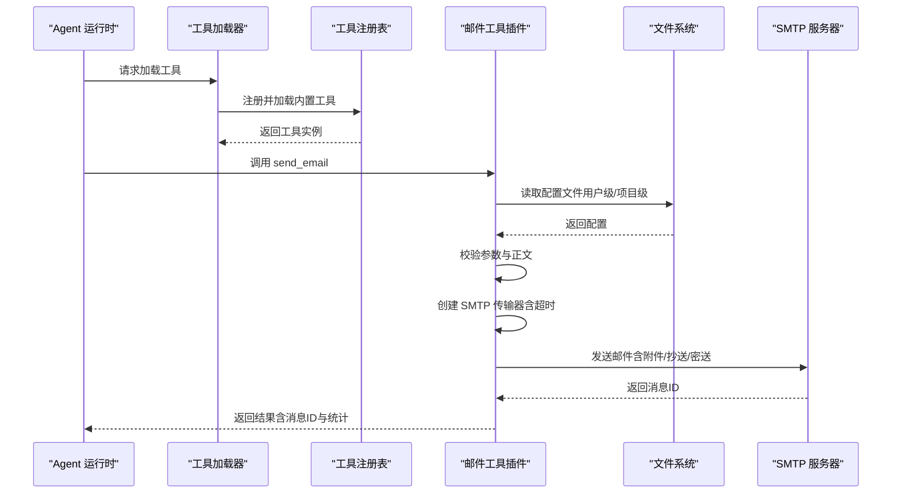
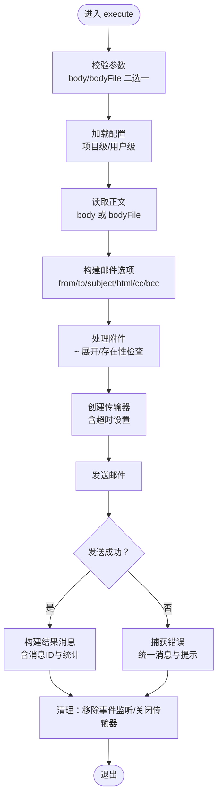
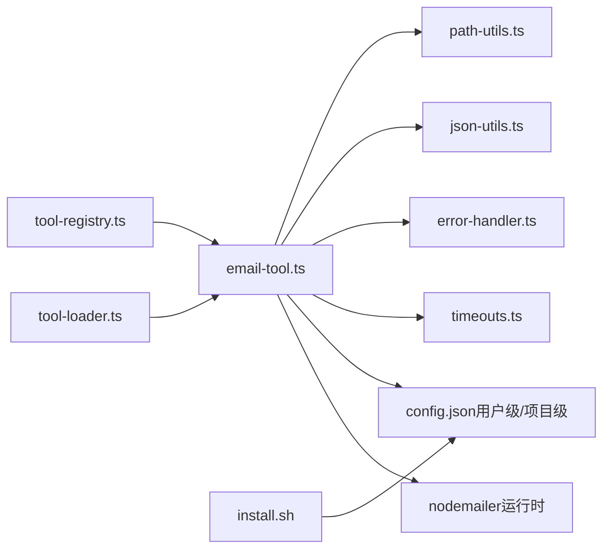

# 邮件通信工具

<cite>
**本文引用的文件**
- [email-tool.ts](file://src/main/tools/email-tool.ts)
- [README.md](file://src/main/tools/email-tool/README.md)
- [USAGE.md](file://src/main/tools/email-tool/USAGE.md)
- [config.example.json](file://src/main/tools/email-tool/config.example.json)
- [install.sh](file://src/main/tools/email-tool/install.sh)
- [tool-loader.ts](file://src/main/tools/registry/tool-loader.ts)
- [tool-registry.ts](file://src/main/tools/registry/tool-registry.ts)
- [tool-interface.ts](file://src/main/tools/registry/tool-interface.ts)
- [tool-names.ts](file://src/main/tools/tool-names.ts)
- [timeouts.ts](file://src/main/config/timeouts.ts)
- [error-handler.ts](file://src/shared/utils/error-handler.ts)
- [json-utils.ts](file://src/shared/utils/json-utils.ts)
- [path-utils.ts](file://src/shared/utils/path-utils.ts)
- [system-config-store.ts](file://src/main/database/system-config-store.ts)
</cite>

## 目录
1. [简介](#简介)
2. [项目结构](#项目结构)
3. [核心组件](#核心组件)
4. [架构总览](#架构总览)
5. [详细组件分析](#详细组件分析)
6. [依赖关系分析](#依赖关系分析)
7. [性能考虑](#性能考虑)
8. [故障排除指南](#故障排除指南)
9. [结论](#结论)
10. [附录](#附录)

## 简介
本指南面向 史丽慧小助理 的“邮件通信工具”，系统讲解如何通过 SMTP 发送邮件，涵盖配置文件格式、认证机制、附件处理、模板支持、错误处理与安全注意事项，并提供使用示例、最佳实践与性能优化建议。该工具采用“内置工具 + 外部依赖”的架构，依赖在运行时按需加载，避免打包进主应用，降低体积与耦合。

## 项目结构
邮件工具位于 src/main/tools/email-tool 目录，核心文件如下：
- email-tool.ts：工具实现（参数校验、配置加载、SMTP 发送、附件处理、取消信号支持）
- README.md：功能特性、安装与配置、常见问题、安全建议
- USAGE.md：快速开始、使用场景、常见问题、技术说明
- config.example.json：配置文件示例
- install.sh：依赖安装脚本（nodemailer）

工具注册与加载：
- tool-loader.ts：加载内置工具（含邮件工具），并按配置启用/禁用
- tool-registry.ts：工具注册表，管理插件注册、工具实例与配置
- tool-interface.ts：工具接口定义（ToolPlugin、ToolCreateOptions 等）
- tool-names.ts：统一工具名称常量（SEND_EMAIL）

系统超时与错误处理：
- timeouts.ts：超时配置（HTTP 请求、Agent 消息等），用于 SMTP 连接超时设置
- error-handler.ts：统一错误消息提取与错误类型判断
- json-utils.ts：安全 JSON 解析与序列化
- path-utils.ts：路径展开（支持 ~ 符号）

系统配置存储：
- system-config-store.ts：系统配置持久化（SQLite），包含工具禁用列表等

图表来源
- [email-tool.ts:1-405](file://src/main/tools/email-tool.ts#L1-L405)
- [tool-loader.ts:1-312](file://src/main/tools/registry/tool-loader.ts#L1-L312)
- [tool-registry.ts:1-328](file://src/main/tools/registry/tool-registry.ts#L1-L328)
- [tool-interface.ts:1-152](file://src/main/tools/registry/tool-interface.ts#L1-L152)
- [tool-names.ts:1-106](file://src/main/tools/tool-names.ts#L1-L106)
- [timeouts.ts:1-78](file://src/main/config/timeouts.ts#L1-L78)
- [error-handler.ts:1-51](file://src/shared/utils/error-handler.ts#L1-L51)
- [json-utils.ts:1-133](file://src/shared/utils/json-utils.ts#L1-L133)
- [path-utils.ts:1-48](file://src/shared/utils/path-utils.ts#L1-L48)
- [system-config-store.ts:1-576](file://src/main/database/system-config-store.ts#L1-L576)

章节来源
- [email-tool.ts:1-405](file://src/main/tools/email-tool.ts#L1-L405)
- [README.md:1-317](file://src/main/tools/email-tool/README.md#L1-L317)
- [USAGE.md:1-147](file://src/main/tools/email-tool/USAGE.md#L1-L147)
- [config.example.json:1-9](file://src/main/tools/email-tool/config.example.json#L1-L9)
- [install.sh:1-56](file://src/main/tools/email-tool/install.sh#L1-L56)
- [tool-loader.ts:1-312](file://src/main/tools/registry/tool-loader.ts#L1-L312)
- [tool-registry.ts:1-328](file://src/main/tools/registry/tool-registry.ts#L1-L328)
- [tool-interface.ts:1-152](file://src/main/tools/registry/tool-interface.ts#L1-L152)
- [tool-names.ts:1-106](file://src/main/tools/tool-names.ts#L1-L106)
- [timeouts.ts:1-78](file://src/main/config/timeouts.ts#L1-L78)
- [error-handler.ts:1-51](file://src/shared/utils/error-handler.ts#L1-L51)
- [json-utils.ts:1-133](file://src/shared/utils/json-utils.ts#L1-L133)
- [path-utils.ts:1-48](file://src/shared/utils/path-utils.ts#L1-L48)
- [system-config-store.ts:1-576](file://src/main/database/system-config-store.ts#L1-L576)

## 核心组件
- 邮件工具插件（ToolPlugin）：定义元数据、参数 Schema、执行逻辑（发送邮件、附件、抄送/密送、取消支持）
- 配置加载：支持项目级与用户级配置文件，字段校验与默认值设置
- 传输器创建：基于 nodemailer，配置 SSL/TLS、超时
- 参数校验与正文处理：支持 body 与 bodyFile 二选一；支持 HTML/纯文本；换行符处理
- 附件处理：支持 ~ 展开、存在性检查、basename 作为文件名
- 取消支持：监听 AbortSignal，必要时关闭传输器
- 错误处理：统一错误消息提取、常见错误提示（认证、超时、连接被拒绝）

章节来源
- [email-tool.ts:27-59](file://src/main/tools/email-tool.ts#L27-L59)
- [email-tool.ts:64-129](file://src/main/tools/email-tool.ts#L64-L129)
- [email-tool.ts:134-148](file://src/main/tools/email-tool.ts#L134-L148)
- [email-tool.ts:174-400](file://src/main/tools/email-tool.ts#L174-L400)
- [error-handler.ts:8-27](file://src/shared/utils/error-handler.ts#L8-L27)

## 架构总览
邮件工具属于 史丽慧小助理 的“内置工具”，通过工具注册表与加载器集成到 Agent 运行时。工具执行时从用户目录读取配置文件，按需安装外部依赖（nodemailer），并通过 SMTP 发送邮件。

图表来源
- [tool-loader.ts:109-301](file://src/main/tools/registry/tool-loader.ts#L109-L301)
- [tool-registry.ts:46-194](file://src/main/tools/registry/tool-registry.ts#L46-L194)
- [email-tool.ts:174-400](file://src/main/tools/email-tool.ts#L174-L400)

章节来源
- [tool-loader.ts:109-301](file://src/main/tools/registry/tool-loader.ts#L109-L301)
- [tool-registry.ts:46-194](file://src/main/tools/registry/tool-registry.ts#L46-L194)
- [email-tool.ts:174-400](file://src/main/tools/email-tool.ts#L174-L400)

## 详细组件分析

### 邮件工具插件（emailToolPlugin）
- 元数据：包含工具 ID、名称、描述、版本、分类、标签、是否需要配置
- 参数 Schema：to、subject、body/bodyFile 二选一、html、attachments、cc、bcc
- 执行流程：
  - 参数校验（body 与 bodyFile 互斥、必填项）
  - 配置加载（项目级优先于用户级）
  - 正文读取（支持 bodyFile 与 ~ 展开）
  - 传输器创建（host/port/secure/auth/超时）
  - 构建邮件选项（fromName、to、subject、text/html、cc/bcc）
  - 附件处理（逐个检查存在性、basename 作为文件名）
  - 取消支持（AbortSignal 监听，必要时关闭传输器）
  - 发送与结果构建（返回消息ID与统计信息）
  - 错误处理（统一错误消息与常见问题提示）

图表来源
- [email-tool.ts:174-400](file://src/main/tools/email-tool.ts#L174-L400)
- [timeouts.ts:28-30](file://src/main/config/timeouts.ts#L28-L30)

章节来源
- [email-tool.ts:153-404](file://src/main/tools/email-tool.ts#L153-L404)

### 配置加载与验证
- 配置文件查找顺序：项目级 > 用户级
- 字段校验：user/password/smtpServer 必填；smtpPort 默认 465；useSsl 默认 true
- 默认值与日志：加载成功后打印配置路径
- 未找到配置：抛出错误并提供配置示例与路径

章节来源
- [email-tool.ts:76-129](file://src/main/tools/email-tool.ts#L76-L129)

### 传输器创建与超时
- 使用 nodemailer 创建 SMTP 传输器
- 超时设置来自系统超时配置（HTTP_REQUEST_TIMEOUT）
- SSL/TLS：useSsl=true 时端口通常为 465；useSsl=false 时端口通常为 587

章节来源
- [email-tool.ts:134-148](file://src/main/tools/email-tool.ts#L134-L148)
- [timeouts.ts:28-30](file://src/main/config/timeouts.ts#L28-L30)

### 参数校验与正文处理
- 参数 Schema：明确各字段用途与可选性
- 正文处理：支持 body 与 bodyFile 二选一；支持 HTML/纯文本；对换行符进行转义处理

章节来源
- [email-tool.ts:27-59](file://src/main/tools/email-tool.ts#L27-L59)
- [email-tool.ts:210-236](file://src/main/tools/email-tool.ts#L210-L236)

### 附件处理
- 路径展开：支持 ~ 符号
- 存在性检查：不存在则跳过并记录警告
- 文件名：使用 basename 作为附件文件名

章节来源
- [email-tool.ts:274-293](file://src/main/tools/email-tool.ts#L274-L293)
- [path-utils.ts:21-33](file://src/shared/utils/path-utils.ts#L21-L33)

### 取消支持（AbortSignal）
- 监听取消事件，必要时关闭传输器
- 若发送过程中被取消，抛出 AbortError 并返回错误结果

章节来源
- [email-tool.ts:295-304](file://src/main/tools/email-tool.ts#L295-L304)
- [error-handler.ts:25-27](file://src/shared/utils/error-handler.ts#L25-L27)

### 错误处理与提示
- 统一错误消息提取
- 常见错误提示：
  - 认证失败：检查 SMTP 服务是否启用、密码是否为授权码
  - 连接超时：检查网络、服务器地址与端口、防火墙
  - 连接被拒绝：确认服务器地址与端口（通常 465 或 587）

章节来源
- [email-tool.ts:361-399](file://src/main/tools/email-tool.ts#L361-L399)
- [error-handler.ts:8-27](file://src/shared/utils/error-handler.ts#L8-L27)

### 工具注册与加载
- 工具加载器导入并加载邮件工具插件
- 工具注册表负责注册、查询、配置管理与清理
- 工具名称常量统一管理（SEND_EMAIL）

章节来源
- [tool-loader.ts:30-301](file://src/main/tools/registry/tool-loader.ts#L30-L301)
- [tool-registry.ts:46-310](file://src/main/tools/registry/tool-registry.ts#L46-L310)
- [tool-names.ts:42-44](file://src/main/tools/tool-names.ts#L42-L44)

## 依赖关系分析
- 邮件工具依赖 nodemailer（运行时按需安装）
- 配置文件位于用户目录（~/.slhbot/tools/email-tool/config.json）
- 依赖安装脚本支持 pnpm 与 npm
- 工具加载器与注册表负责工具生命周期管理
- 超时配置用于 SMTP 连接超时设置

图表来源
- [email-tool.ts:134-148](file://src/main/tools/email-tool.ts#L134-L148)
- [install.sh:1-56](file://src/main/tools/email-tool/install.sh#L1-56)
- [tool-loader.ts:30-301](file://src/main/tools/registry/tool-loader.ts#L30-L301)
- [tool-registry.ts:46-310](file://src/main/tools/registry/tool-registry.ts#L46-L310)
- [timeouts.ts:28-30](file://src/main/config/timeouts.ts#L28-L30)
- [error-handler.ts:8-27](file://src/shared/utils/error-handler.ts#L8-L27)
- [json-utils.ts:19-29](file://src/shared/utils/json-utils.ts#L19-L29)
- [path-utils.ts:21-33](file://src/shared/utils/path-utils.ts#L21-L33)

章节来源
- [email-tool.ts:134-148](file://src/main/tools/email-tool.ts#L134-L148)
- [install.sh:1-56](file://src/main/tools/email-tool/install.sh#L1-L56)
- [tool-loader.ts:30-301](file://src/main/tools/registry/tool-loader.ts#L30-L301)
- [tool-registry.ts:46-310](file://src/main/tools/registry/tool-registry.ts#L46-L310)
- [timeouts.ts:28-30](file://src/main/config/timeouts.ts#L28-L30)
- [error-handler.ts:8-27](file://src/shared/utils/error-handler.ts#L8-L27)
- [json-utils.ts:19-29](file://src/shared/utils/json-utils.ts#L19-L29)
- [path-utils.ts:21-33](file://src/shared/utils/path-utils.ts#L21-L33)

## 性能考虑
- 超时设置：SMTP 连接超时来自系统超时配置，避免长时间阻塞
- 取消支持：支持 AbortSignal，可在长任务中及时中断
- 附件处理：逐个检查存在性，避免无效附件导致失败
- 依赖按需安装：减少主应用体积与启动时间

章节来源
- [timeouts.ts:28-30](file://src/main/config/timeouts.ts#L28-L30)
- [email-tool.ts:295-304](file://src/main/tools/email-tool.ts#L295-L304)
- [email-tool.ts:274-293](file://src/main/tools/email-tool.ts#L274-L293)

## 故障排除指南
- 依赖未安装：运行安装脚本或手动安装 nodemailer
- 配置文件缺失：复制示例配置并编辑
- QQ 邮箱认证失败：使用授权码而非登录密码
- Gmail 认证失败：使用应用专用密码
- 连接超时：检查网络、服务器地址与端口、防火墙
- 连接被拒绝：确认服务器地址与端口（通常 465 或 587）

章节来源
- [USAGE.md:81-117](file://src/main/tools/email-tool/USAGE.md#L81-L117)
- [README.md:222-250](file://src/main/tools/email-tool/README.md#L222-L250)
- [email-tool.ts:361-399](file://src/main/tools/email-tool.ts#L361-L399)

## 结论
史丽慧小助理 的邮件通信工具通过清晰的参数 Schema、可靠的配置加载与验证、稳健的错误处理与取消支持，提供了跨平台、跨服务商的 SMTP 邮件发送能力。其“内置工具 + 外部依赖”的架构既保证了功能的完整性，又保持了应用的轻量化与灵活性。

## 附录

### 配置文件格式与示例
- 配置文件位置（优先级）：项目级 > 用户级
- 字段说明：user、password、smtpServer、smtpPort、useSsl、fromName
- 示例：参见配置示例文件

章节来源
- [README.md:68-79](file://src/main/tools/email-tool/README.md#L68-L79)
- [config.example.json:1-9](file://src/main/tools/email-tool/config.example.json#L1-L9)

### 常见邮件服务商配置要点
- QQ 邮箱：使用授权码
- Gmail：开启两步验证并使用应用专用密码
- 163 邮箱：使用授权码
- Outlook/Hotmail：端口 587，useSsl=false

章节来源
- [README.md:83-144](file://src/main/tools/email-tool/README.md#L83-L144)

### 安全建议
- 不在代码中硬编码密码
- 保护配置文件权限（600）
- 使用授权码而非登录密码
- 定期更换授权码
- 不要将配置文件提交到版本控制

章节来源
- [README.md:251-257](file://src/main/tools/email-tool/README.md#L251-L257)
- [USAGE.md:135-147](file://src/main/tools/email-tool/USAGE.md#L135-L147)

### 使用示例与场景
- 发送简单文本邮件
- 发送 HTML 邮件
- 发送带附件的邮件
- 发送带抄送的邮件

章节来源
- [USAGE.md:45-78](file://src/main/tools/email-tool/USAGE.md#L45-L78)
- [README.md:149-196](file://src/main/tools/email-tool/README.md#L149-L196)