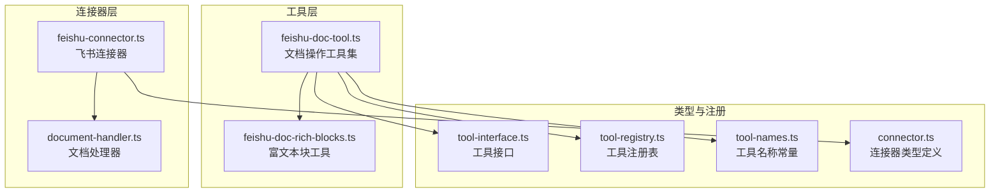
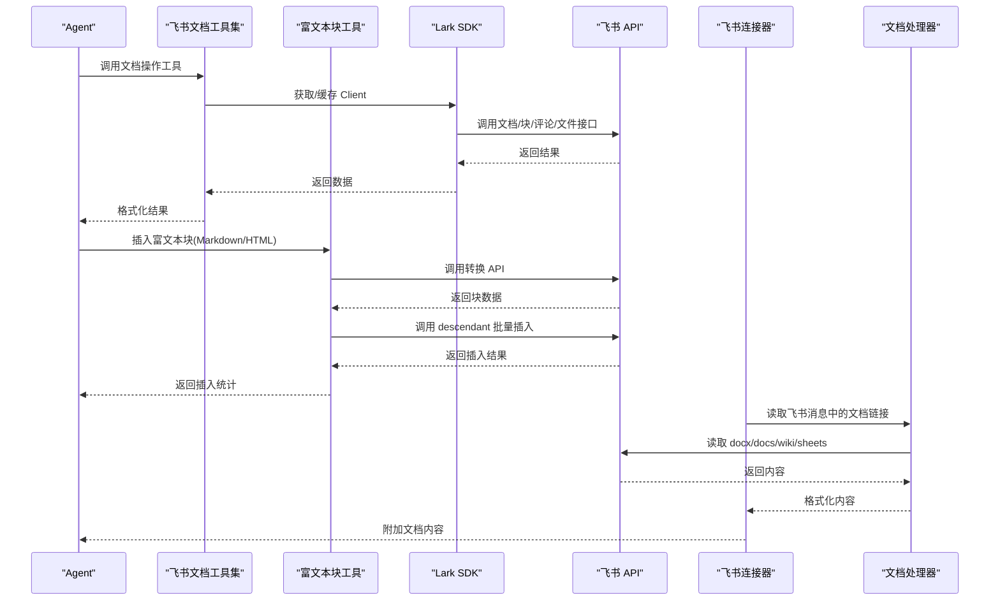
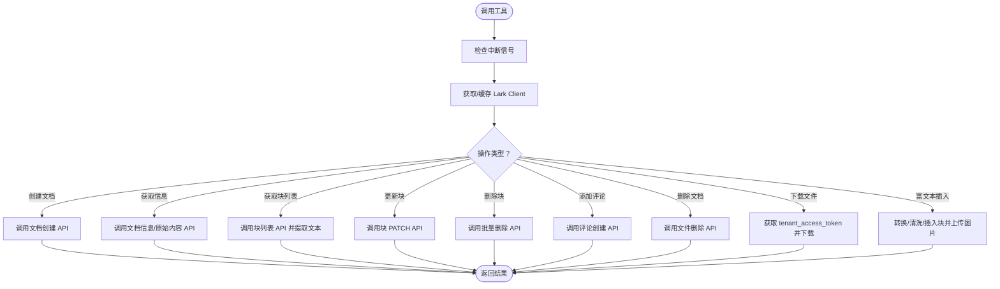
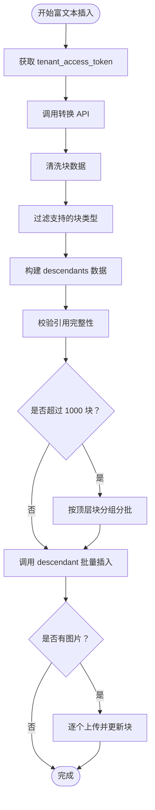
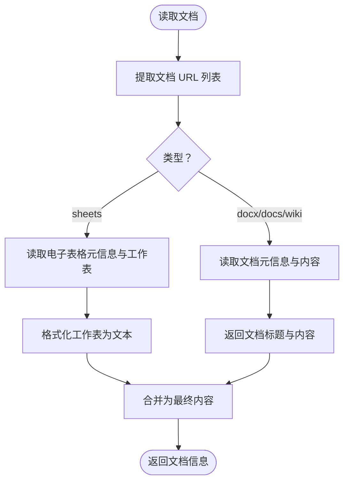
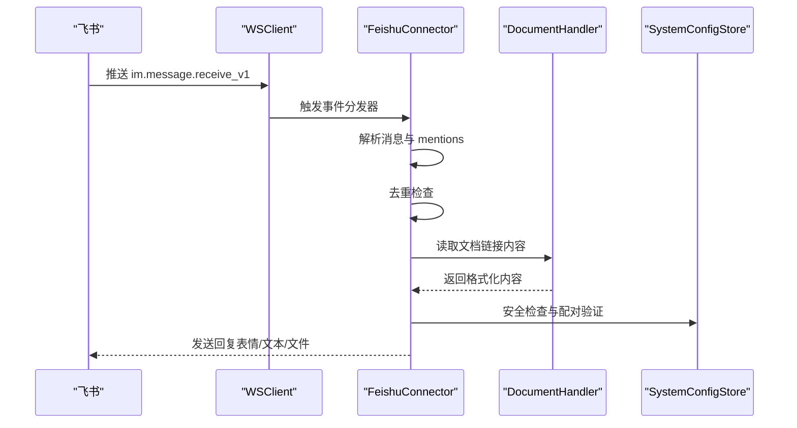
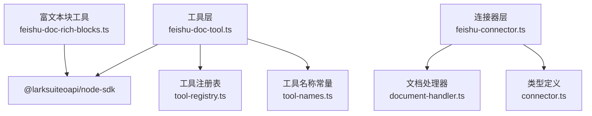

# 飞书文档工具

<cite>
**本文档引用的文件**
- [feishu-doc-tool.ts](file://src/main/tools/feishu-doc-tool.ts)
- [feishu-doc-rich-blocks.ts](file://src/main/tools/feishu-doc-rich-blocks.ts)
- [document-handler.ts](file://src/main/connectors/feishu/document-handler.ts)
- [feishu-connector.ts](file://src/main/connectors/feishu/feishu-connector.ts)
- [tool-interface.ts](file://src/main/tools/registry/tool-interface.ts)
- [tool-registry.ts](file://src/main/tools/registry/tool-registry.ts)
- [tool-names.ts](file://src/main/tools/tool-names.ts)
- [connector.ts](file://src/types/connector.ts)
- [飞书机器人配置指南.md](file://docs/飞书机器人配置指南.md)
- [README.md](file://README.md)
</cite>

## 目录
1. [简介](#简介)
2. [项目结构](#项目结构)
3. [核心组件](#核心组件)
4. [架构概览](#架构概览)
5. [详细组件分析](#详细组件分析)
6. [依赖关系分析](#依赖关系分析)
7. [性能考量](#性能考量)
8. [故障排查指南](#故障排查指南)
9. [结论](#结论)
10. [附录](#附录)

## 简介
本文件面向 DeepBot 飞书文档工具的功能文档，重点阐述飞书云文档操作能力，包括文档读取、编辑、协作者管理、内容同步、富文本块处理、文档结构解析、权限控制等技术细节，并提供使用示例、操作流程、集成配置方法以及错误处理、性能优化、兼容性考虑等内容。读者可据此快速理解并集成 DeepBot 的飞书文档能力。

## 项目结构
飞书文档工具由“工具层”和“连接器层”共同构成：
- 工具层：提供飞书文档操作的 Agent 工具集，包括创建、读取、块管理、评论、删除、下载云空间文件、富文本块插入等。
- 连接器层：负责从飞书消息中自动识别并读取飞书文档/电子表格内容，支持 docx/docs/wiki/sheets 等类型。

图表来源
- [feishu-doc-tool.ts:1-552](file://src/main/tools/feishu-doc-tool.ts#L1-L552)
- [feishu-doc-rich-blocks.ts:1-591](file://src/main/tools/feishu-doc-rich-blocks.ts#L1-L591)
- [document-handler.ts:1-369](file://src/main/connectors/feishu/document-handler.ts#L1-L369)
- [feishu-connector.ts:1-994](file://src/main/connectors/feishu/feishu-connector.ts#L1-L994)
- [tool-interface.ts:1-152](file://src/main/tools/registry/tool-interface.ts#L1-L152)
- [tool-registry.ts:1-328](file://src/main/tools/registry/tool-registry.ts#L1-L328)
- [tool-names.ts:1-106](file://src/main/tools/tool-names.ts#L1-L106)
- [connector.ts:1-387](file://src/types/connector.ts#L1-L387)

章节来源
- [feishu-doc-tool.ts:1-552](file://src/main/tools/feishu-doc-tool.ts#L1-L552)
- [feishu-doc-rich-blocks.ts:1-591](file://src/main/tools/feishu-doc-rich-blocks.ts#L1-L591)
- [document-handler.ts:1-369](file://src/main/connectors/feishu/document-handler.ts#L1-L369)
- [feishu-connector.ts:1-994](file://src/main/connectors/feishu/feishu-connector.ts#L1-L994)
- [tool-interface.ts:1-152](file://src/main/tools/registry/tool-interface.ts#L1-L152)
- [tool-registry.ts:1-328](file://src/main/tools/registry/tool-registry.ts#L1-L328)
- [tool-names.ts:1-106](file://src/main/tools/tool-names.ts#L1-L106)
- [connector.ts:1-387](file://src/types/connector.ts#L1-L387)

## 核心组件
- 飞书文档工具集（feishu-doc-tool.ts）：提供创建、读取、获取块列表、更新块、删除块、添加评论、删除文档、下载云空间文件、富文本块插入等能力。
- 富文本块工具（feishu-doc-rich-blocks.ts）：将 Markdown/HTML 转换为飞书文档块，清洗并校验块数据，批量插入嵌套块，处理图片上传。
- 文档处理器（document-handler.ts）：从飞书消息中提取文档链接，读取 docx/docs/wiki/sheets 内容，格式化输出。
- 飞书连接器（feishu-connector.ts）：接收飞书消息，自动检测并读取文档内容，处理图片/文件消息，实现配对授权与安全控制。
- 工具注册与接口（tool-interface.ts、tool-registry.ts、tool-names.ts）：定义工具接口、注册表、工具名称常量，支撑工具加载与管理。
- 类型定义（connector.ts）：定义连接器、飞书消息、配对记录等类型，保证类型安全。

章节来源
- [feishu-doc-tool.ts:159-552](file://src/main/tools/feishu-doc-tool.ts#L159-L552)
- [feishu-doc-rich-blocks.ts:375-591](file://src/main/tools/feishu-doc-rich-blocks.ts#L375-L591)
- [document-handler.ts:23-369](file://src/main/connectors/feishu/document-handler.ts#L23-L369)
- [feishu-connector.ts:28-994](file://src/main/connectors/feishu/feishu-connector.ts#L28-L994)
- [tool-interface.ts:101-152](file://src/main/tools/registry/tool-interface.ts#L101-L152)
- [tool-registry.ts:36-328](file://src/main/tools/registry/tool-registry.ts#L36-L328)
- [tool-names.ts:8-106](file://src/main/tools/tool-names.ts#L8-L106)
- [connector.ts:76-194](file://src/types/connector.ts#L76-L194)

## 架构概览
飞书文档工具的调用链路如下：
- 工具层通过 Lark SDK 与飞书 API 交互，支持缓存客户端、统一错误处理、中断信号检查。
- 富文本块工具通过 Markdown/HTML 转换 API 获取块数据，清洗后使用 descendant API 批量插入，支持图片上传。
- 连接器层在收到飞书消息时，自动提取文档链接并读取内容，附加到消息中供 Agent 分析。

图表来源
- [feishu-doc-tool.ts:89-114](file://src/main/tools/feishu-doc-tool.ts#L89-L114)
- [feishu-doc-tool.ts:183-212](file://src/main/tools/feishu-doc-tool.ts#L183-L212)
- [feishu-doc-tool.ts:342-359](file://src/main/tools/feishu-doc-tool.ts#L342-L359)
- [feishu-doc-tool.ts:379-392](file://src/main/tools/feishu-doc-tool.ts#L379-L392)
- [feishu-doc-tool.ts:409-434](file://src/main/tools/feishu-doc-tool.ts#L409-L434)
- [feishu-doc-tool.ts:450-462](file://src/main/tools/feishu-doc-tool.ts#L450-L462)
- [feishu-doc-tool.ts:477-537](file://src/main/tools/feishu-doc-tool.ts#L477-L537)
- [feishu-doc-rich-blocks.ts:405-586](file://src/main/tools/feishu-doc-rich-blocks.ts#L405-L586)
- [document-handler.ts:66-93](file://src/main/connectors/feishu/document-handler.ts#L66-L93)
- [document-handler.ts:98-166](file://src/main/connectors/feishu/document-handler.ts#L98-L166)
- [document-handler.ts:171-294](file://src/main/connectors/feishu/document-handler.ts#L171-L294)

章节来源
- [feishu-doc-tool.ts:89-114](file://src/main/tools/feishu-doc-tool.ts#L89-L114)
- [feishu-doc-tool.ts:183-212](file://src/main/tools/feishu-doc-tool.ts#L183-L212)
- [feishu-doc-tool.ts:342-359](file://src/main/tools/feishu-doc-tool.ts#L342-L359)
- [feishu-doc-tool.ts:379-392](file://src/main/tools/feishu-doc-tool.ts#L379-L392)
- [feishu-doc-tool.ts:409-434](file://src/main/tools/feishu-doc-tool.ts#L409-L434)
- [feishu-doc-tool.ts:450-462](file://src/main/tools/feishu-doc-tool.ts#L450-L462)
- [feishu-doc-tool.ts:477-537](file://src/main/tools/feishu-doc-tool.ts#L477-L537)
- [feishu-doc-rich-blocks.ts:405-586](file://src/main/tools/feishu-doc-rich-blocks.ts#L405-L586)
- [document-handler.ts:66-93](file://src/main/connectors/feishu/document-handler.ts#L66-L93)
- [document-handler.ts:98-166](file://src/main/connectors/feishu/document-handler.ts#L98-L166)
- [document-handler.ts:171-294](file://src/main/connectors/feishu/document-handler.ts#L171-L294)

## 详细组件分析

### 飞书文档工具集（feishu-doc-tool.ts）
- 功能清单
  - 创建文档：在飞书云空间创建新文档，并自动将发送者添加为协作者。
  - 获取文档信息：返回文档标题、版本、链接及内容预览。
  - 获取所有块：列出文档块列表，标注删除索引，便于后续更新/删除。
  - 更新块：更新指定块的文本内容。
  - 删除块：按父块子块索引范围删除块。
  - 添加评论：在文档中添加全文评论。
  - 删除文档：永久删除文档（不可恢复）。
  - 下载云空间文件：下载云空间中的文件（不支持 docx/sheet/bitable）。
  - 富文本块插入：将 Markdown/HTML 转换为块并批量插入，支持图片上传。
- 关键实现要点
  - 客户端缓存：基于 appId/appSecret 组合作为缓存键，配置变更时自动重建。
  - 统一错误处理：errResult 统一包装错误信息，便于 UI 展示。
  - 中断支持：checkAbort 支持用户取消操作。
  - 协作者管理：resolveMemberType 识别 open_id/user_id，addDocumentCollaborator 添加管理员权限。
  - 文档链接生成：docUrl 生成可访问链接。
  - 块文本提取：extractBlockText 统一从块数据中提取纯文本。
- 使用示例
  - 创建文档：传入标题与可选父文件夹 token。
  - 获取块列表：传入文档 ID，查看删除索引。
  - 更新块：传入文档 ID、块 ID、新内容。
  - 删除块：传入文档 ID、父块 ID（可选）、起止索引。
  - 添加评论：传入文档 ID、评论内容。
  - 删除文档：传入文档 ID。
  - 下载文件：传入 file_token 与可选文件名。
  - 富文本插入：传入文档 ID、内容、内容类型（markdown/html）、插入位置与父块 ID（可选）。

图表来源
- [feishu-doc-tool.ts:89-114](file://src/main/tools/feishu-doc-tool.ts#L89-L114)
- [feishu-doc-tool.ts:183-212](file://src/main/tools/feishu-doc-tool.ts#L183-L212)
- [feishu-doc-tool.ts:228-245](file://src/main/tools/feishu-doc-tool.ts#L228-L245)
- [feishu-doc-tool.ts:261-285](file://src/main/tools/feishu-doc-tool.ts#L261-L285)
- [feishu-doc-tool.ts:342-359](file://src/main/tools/feishu-doc-tool.ts#L342-L359)
- [feishu-doc-tool.ts:379-392](file://src/main/tools/feishu-doc-tool.ts#L379-L392)
- [feishu-doc-tool.ts:409-434](file://src/main/tools/feishu-doc-tool.ts#L409-L434)
- [feishu-doc-tool.ts:450-462](file://src/main/tools/feishu-doc-tool.ts#L450-L462)
- [feishu-doc-tool.ts:477-537](file://src/main/tools/feishu-doc-tool.ts#L477-L537)

章节来源
- [feishu-doc-tool.ts:89-114](file://src/main/tools/feishu-doc-tool.ts#L89-L114)
- [feishu-doc-tool.ts:183-212](file://src/main/tools/feishu-doc-tool.ts#L183-L212)
- [feishu-doc-tool.ts:228-245](file://src/main/tools/feishu-doc-tool.ts#L228-L245)
- [feishu-doc-tool.ts:261-285](file://src/main/tools/feishu-doc-tool.ts#L261-L285)
- [feishu-doc-tool.ts:342-359](file://src/main/tools/feishu-doc-tool.ts#L342-L359)
- [feishu-doc-tool.ts:379-392](file://src/main/tools/feishu-doc-tool.ts#L379-L392)
- [feishu-doc-tool.ts:409-434](file://src/main/tools/feishu-doc-tool.ts#L409-L434)
- [feishu-doc-tool.ts:450-462](file://src/main/tools/feishu-doc-tool.ts#L450-L462)
- [feishu-doc-tool.ts:477-537](file://src/main/tools/feishu-doc-tool.ts#L477-L537)

### 富文本块工具（feishu-doc-rich-blocks.ts）
- 功能清单
  - Markdown/HTML 转换：调用转换 API 获取块数据。
  - 块数据清洗：去除只读属性、修正字段名、统一内容结构、清理样式。
  - 嵌套块插入：使用 descendant API 批量插入，支持分批（上限 1000 块）。
  - 图片上传：下载图片并上传至 Image Block，再更新块内容。
- 关键实现要点
  - tenant_access_token 获取：通过 internal 接口获取。
  - 块清洗规则：针对表格、文本块、children_id 等字段进行修正。
  - 引用完整性校验：过滤孤儿块，确保 children 引用有效。
  - 分批插入：按顶层块分组，避免超过 API 限制。
  - 图片处理：下载图片、上传素材、更新块 token。
- 使用示例
  - 传入文档 ID、内容（Markdown/HTML）、内容类型、插入位置（0=开头，-1=末尾）、父块 ID（可选）。

图表来源
- [feishu-doc-rich-blocks.ts:31-42](file://src/main/tools/feishu-doc-rich-blocks.ts#L31-L42)
- [feishu-doc-rich-blocks.ts:201-238](file://src/main/tools/feishu-doc-rich-blocks.ts#L201-L238)
- [feishu-doc-rich-blocks.ts:52-191](file://src/main/tools/feishu-doc-rich-blocks.ts#L52-L191)
- [feishu-doc-rich-blocks.ts:444-498](file://src/main/tools/feishu-doc-rich-blocks.ts#L444-L498)
- [feishu-doc-rich-blocks.ts:504-552](file://src/main/tools/feishu-doc-rich-blocks.ts#L504-L552)
- [feishu-doc-rich-blocks.ts:557-567](file://src/main/tools/feishu-doc-rich-blocks.ts#L557-L567)

章节来源
- [feishu-doc-rich-blocks.ts:31-42](file://src/main/tools/feishu-doc-rich-blocks.ts#L31-L42)
- [feishu-doc-rich-blocks.ts:201-238](file://src/main/tools/feishu-doc-rich-blocks.ts#L201-L238)
- [feishu-doc-rich-blocks.ts:52-191](file://src/main/tools/feishu-doc-rich-blocks.ts#L52-L191)
- [feishu-doc-rich-blocks.ts:444-498](file://src/main/tools/feishu-doc-rich-blocks.ts#L444-L498)
- [feishu-doc-rich-blocks.ts:504-552](file://src/main/tools/feishu-doc-rich-blocks.ts#L504-L552)
- [feishu-doc-rich-blocks.ts:557-567](file://src/main/tools/feishu-doc-rich-blocks.ts#L557-L567)

### 文档处理器（document-handler.ts）
- 功能清单
  - URL 提取：支持 docx/docs/wiki/sheets 链接，兼容 Markdown 格式。
  - 文档读取：docx/docs/wiki 调用 docx API；sheets 调用 sheets API。
  - 内容格式化：docx/docs/wiki 返回纯文本内容；sheets 读取所有工作表并格式化为文本。
  - 批量读取与格式化输出：支持多链接批量读取并拼接输出。
- 关键实现要点
  - 权限提示：当 API 返回权限不足时，输出具体权限缺失提示。
  - 去重与容错：读取失败时返回 null，避免影响主流程。
  - 工作表读取：使用 batchGet 读取值并格式化为表格文本。

图表来源
- [document-handler.ts:40-45](file://src/main/connectors/feishu/document-handler.ts#L40-L45)
- [document-handler.ts:50-61](file://src/main/connectors/feishu/document-handler.ts#L50-L61)
- [document-handler.ts:66-93](file://src/main/connectors/feishu/document-handler.ts#L66-L93)
- [document-handler.ts:98-166](file://src/main/connectors/feishu/document-handler.ts#L98-L166)
- [document-handler.ts:171-294](file://src/main/connectors/feishu/document-handler.ts#L171-L294)

章节来源
- [document-handler.ts:40-45](file://src/main/connectors/feishu/document-handler.ts#L40-L45)
- [document-handler.ts:50-61](file://src/main/connectors/feishu/document-handler.ts#L50-L61)
- [document-handler.ts:66-93](file://src/main/connectors/feishu/document-handler.ts#L66-L93)
- [document-handler.ts:98-166](file://src/main/connectors/feishu/document-handler.ts#L98-L166)
- [document-handler.ts:171-294](file://src/main/connectors/feishu/document-handler.ts#L171-L294)

### 飞书连接器（feishu-connector.ts）
- 功能清单
  - WebSocket 长连接：监听 im.message.receive_v1 事件，异步处理消息。
  - 消息去重：基于 message_id 与内容窗口去重，防止重复响应。
  - 文档读取：自动检测消息中的文档链接并读取内容，附加到消息。
  - 图片/文件下载：下载用户发送的图片/文件到临时目录。
  - 用户名缓存：缓存用户 open_id 与真实姓名，减少 API 调用。
  - 配对授权：支持 Pairing 模式，管理员批准后方可使用。
  - 发送消息：支持文本、图片、文件发送，支持回复消息。
- 关键实现要点
  - 机器人 open_id 轮询：后台定时获取，避免阻塞启动。
  - 去重策略：消息 ID 去重 + 内容时间窗去重。
  - 安全检查：私聊未配对时发送配对码，支持自动批准首个用户。
  - 发送流程：reply API 与 create API 双通道，支持 open_id/chat_id。

图表来源
- [feishu-connector.ts:134-146](file://src/main/connectors/feishu/feishu-connector.ts#L134-L146)
- [feishu-connector.ts:368-577](file://src/main/connectors/feishu/feishu-connector.ts#L368-L577)
- [feishu-connector.ts:522-536](file://src/main/connectors/feishu/feishu-connector.ts#L522-L536)
- [feishu-connector.ts:959-991](file://src/main/connectors/feishu/feishu-connector.ts#L959-L991)

章节来源
- [feishu-connector.ts:134-146](file://src/main/connectors/feishu/feishu-connector.ts#L134-L146)
- [feishu-connector.ts:368-577](file://src/main/connectors/feishu/feishu-connector.ts#L368-L577)
- [feishu-connector.ts:522-536](file://src/main/connectors/feishu/feishu-connector.ts#L522-L536)
- [feishu-connector.ts:959-991](file://src/main/connectors/feishu/feishu-connector.ts#L959-L991)

### 工具注册与接口（tool-interface.ts、tool-registry.ts、tool-names.ts）
- 工具接口：定义 ToolPlugin、ToolMetadata、ToolConfig 等，约束工具实现。
- 工具注册表：集中管理工具插件与实例，支持加载、查询、清理。
- 工具名称常量：统一管理工具名称，避免硬编码。

章节来源
- [tool-interface.ts:101-152](file://src/main/tools/registry/tool-interface.ts#L101-L152)
- [tool-registry.ts:36-328](file://src/main/tools/registry/tool-registry.ts#L36-L328)
- [tool-names.ts:8-106](file://src/main/tools/tool-names.ts#L8-L106)

### 类型定义（connector.ts）
- 定义 Connector、FeishuConnectorConfig、FeishuIncomingMessage、PairingRecord 等类型，保证连接器与消息处理的类型安全。

章节来源
- [connector.ts:76-194](file://src/types/connector.ts#L76-L194)

## 依赖关系分析
- 工具层依赖 Lark SDK 与飞书 API，通过 getLarkClient 缓存客户端，避免重复初始化。
- 富文本块工具依赖转换 API、descendant API、图片上传 API，涉及 tenant_access_token 获取与分批插入。
- 连接器层依赖文档处理器，自动读取飞书消息中的文档链接并附加内容。
- 工具注册表与工具名称常量为工具加载与命名提供支撑。

图表来源
- [feishu-doc-tool.ts:106-113](file://src/main/tools/feishu-doc-tool.ts#L106-L113)
- [feishu-doc-tool.ts:171-551](file://src/main/tools/feishu-doc-tool.ts#L171-L551)
- [feishu-doc-rich-blocks.ts:31-42](file://src/main/tools/feishu-doc-rich-blocks.ts#L31-L42)
- [feishu-doc-rich-blocks.ts:251-291](file://src/main/tools/feishu-doc-rich-blocks.ts#L251-L291)
- [feishu-connector.ts:28-100](file://src/main/connectors/feishu/feishu-connector.ts#L28-L100)
- [document-handler.ts:23-28](file://src/main/connectors/feishu/document-handler.ts#L23-L28)
- [tool-registry.ts:36-55](file://src/main/tools/registry/tool-registry.ts#L36-L55)
- [tool-names.ts:8-94](file://src/main/tools/tool-names.ts#L8-L94)
- [connector.ts:76-146](file://src/types/connector.ts#L76-L146)

章节来源
- [feishu-doc-tool.ts:106-113](file://src/main/tools/feishu-doc-tool.ts#L106-L113)
- [feishu-doc-tool.ts:171-551](file://src/main/tools/feishu-doc-tool.ts#L171-L551)
- [feishu-doc-rich-blocks.ts:31-42](file://src/main/tools/feishu-doc-rich-blocks.ts#L31-L42)
- [feishu-doc-rich-blocks.ts:251-291](file://src/main/tools/feishu-doc-rich-blocks.ts#L251-L291)
- [feishu-connector.ts:28-100](file://src/main/connectors/feishu/feishu-connector.ts#L28-L100)
- [document-handler.ts:23-28](file://src/main/connectors/feishu/document-handler.ts#L23-L28)
- [tool-registry.ts:36-55](file://src/main/tools/registry/tool-registry.ts#L36-L55)
- [tool-names.ts:8-94](file://src/main/tools/tool-names.ts#L8-L94)
- [connector.ts:76-146](file://src/types/connector.ts#L76-L146)

## 性能考量
- 客户端缓存：基于 appId/appSecret 组合缓存 Lark Client，配置变更时自动重建，减少初始化开销。
- 批量插入：富文本块工具支持分批插入（每批不超过 1000 个块），避免 API 限制。
- 去重策略：消息去重与内容时间窗去重，降低重复处理与 API 调用。
- 图片上传：按需上传，失败时记录警告并继续流程，不影响整体性能。
- 异步处理：连接器在收到消息后立即返回响应，异步处理消息，提升吞吐量。

[本节为通用性能讨论，不直接分析具体文件]

## 故障排查指南
- 配置问题
  - 飞书连接器未配置：检查 appId/appSecret 是否正确设置。
  - 权限不足：根据错误码提示在飞书开放平台添加相应权限。
- 文档读取失败
  - docx/docs/wiki：检查 docx:document 权限与 drive:drive 权限。
  - sheets：检查 sheets:spreadsheet:readonly 权限与 drive:drive 权限。
- 富文本插入失败
  - 转换 API 失败：检查内容格式（Markdown/HTML）与 tenant_access_token。
  - descendant API 失败：检查块类型支持与引用完整性。
  - 图片上传失败：检查图片 URL 可访问性与上传权限。
- 连接器异常
  - WebSocket 未连接：检查事件订阅与回调配置。
  - 机器人 open_id 获取失败：检查内部定时轮询与网络连通性。
- 安全与配对
  - 私聊未配对：检查配对码生成与批准流程。
  - 群组消息未 @：确认群组消息策略与 mentions 识别。

章节来源
- [feishu-doc-tool.ts:94-97](file://src/main/tools/feishu-doc-tool.ts#L94-L97)
- [feishu-doc-tool.ts:121-128](file://src/main/tools/feishu-doc-tool.ts#L121-L128)
- [feishu-doc-tool.ts:198-202](file://src/main/tools/feishu-doc-tool.ts#L198-L202)
- [feishu-doc-tool.ts:228-245](file://src/main/tools/feishu-doc-tool.ts#L228-L245)
- [feishu-doc-tool.ts:409-434](file://src/main/tools/feishu-doc-tool.ts#L409-L434)
- [feishu-doc-tool.ts:450-462](file://src/main/tools/feishu-doc-tool.ts#L450-L462)
- [feishu-doc-tool.ts:477-537](file://src/main/tools/feishu-doc-tool.ts#L477-L537)
- [feishu-doc-rich-blocks.ts:222-230](file://src/main/tools/feishu-doc-rich-blocks.ts#L222-L230)
- [feishu-doc-rich-blocks.ts:280-288](file://src/main/tools/feishu-doc-rich-blocks.ts#L280-L288)
- [feishu-doc-rich-blocks.ts:327-342](file://src/main/tools/feishu-doc-rich-blocks.ts#L327-L342)
- [document-handler.ts:115-129](file://src/main/connectors/feishu/document-handler.ts#L115-L129)
- [document-handler.ts:196-202](file://src/main/connectors/feishu/document-handler.ts#L196-L202)
- [feishu-connector.ts:120-123](file://src/main/connectors/feishu/feishu-connector.ts#L120-L123)
- [feishu-connector.ts:190-233](file://src/main/connectors/feishu/feishu-connector.ts#L190-L233)
- [feishu-connector.ts:544-569](file://src/main/connectors/feishu/feishu-connector.ts#L544-L569)

## 结论
DeepBot 的飞书文档工具提供了从文档读取、编辑到富文本块插入的完整能力，配合连接器层的自动文档读取与安全控制，能够满足企业办公场景下的文档自动化需求。通过客户端缓存、批量插入、去重策略与配对授权等机制，系统在易用性与稳定性方面均具备良好表现。建议在生产环境中按需配置权限与安全策略，并结合富文本块工具实现复杂文档结构的自动化生成与维护。

[本节为总结性内容，不直接分析具体文件]

## 附录
- 集成配置
  - 在 DeepBot 中配置飞书连接器（App ID/App Secret/机器人名称），并在飞书开放平台配置事件订阅与权限。
  - 使用工具名称常量调用相应工具，如创建文档、获取块列表、富文本插入等。
- 使用示例
  - 创建文档：传入标题与可选父文件夹 token。
  - 获取块列表：传入文档 ID，查看删除索引。
  - 富文本插入：传入文档 ID、Markdown/HTML 内容、插入位置与父块 ID（可选）。
- 兼容性与注意事项
  - 富文本块工具不支持某些块类型（如 callout），转换后会过滤。
  - 云空间文件下载不支持 docx/sheet/bitable 类型。
  - 删除文档为不可恢复操作，需谨慎使用。

章节来源
- [飞书机器人配置指南.md:1-204](file://docs/飞书机器人配置指南.md#L1-L204)
- [README.md:251-281](file://README.md#L251-L281)
- [tool-names.ts:68-79](file://src/main/tools/tool-names.ts#L68-L79)
- [feishu-doc-tool.ts:477-537](file://src/main/tools/feishu-doc-tool.ts#L477-L537)
- [feishu-doc-rich-blocks.ts:444-442](file://src/main/tools/feishu-doc-rich-blocks.ts#L444-L442)