# 工具加载器

<cite>
**本文档引用的文件**
- [tool-loader.ts](file://src/main/tools/registry/tool-loader.ts)
- [tool-registry.ts](file://src/main/tools/registry/tool-registry.ts)
- [tool-interface.ts](file://src/main/tools/registry/tool-interface.ts)
- [index.ts](file://src/main/tools/registry/index.ts)
- [example-tool.ts](file://src/main/tools/registry/example-tool.ts)
- [file-tool.ts](file://src/main/tools/file-tool.ts)
- [exec-tool.ts](file://src/main/tools/exec-tool.ts)
- [browser-tool.ts](file://src/main/tools/browser-tool.ts)
- [calendar-tool.ts](file://src/main/tools/calendar-tool.ts)
- [email-tool.ts](file://src/main/tools/email-tool.ts)
- [api-tool.ts](file://src/main/tools/api-tool.ts)
- [web-search-tool.ts](file://src/main/tools/web-search-tool.ts)
- [web-fetch-tool.ts](file://src/main/tools/web-fetch-tool.ts)
- [tool-names.ts](file://src/main/tools/tool-names.ts)
</cite>

## 目录
1. [简介](#简介)
2. [项目结构](#项目结构)
3. [核心组件](#核心组件)
4. [架构总览](#架构总览)
5. [详细组件分析](#详细组件分析)
6. [依赖关系分析](#依赖关系分析)
7. [性能考虑](#性能考虑)
8. [故障排查指南](#故障排查指南)
9. [结论](#结论)
10. [附录](#附录)

## 简介
本文件面向 DeepBot 工具加载器的技术文档，系统阐述工具加载器的实现原理、动态模块导入、工具实例创建与初始化流程、工具发现机制与文件扫描策略、类型过滤规则、工具加载生命周期以及错误处理策略。同时提供标准工具文件结构与开发最佳实践，帮助开发者快速扩展与维护工具生态。

## 项目结构
DeepBot 的工具体系采用“内置工具 + 插件化加载”的架构设计，核心位于 src/main/tools/registry 目录，包含工具接口定义、注册表、加载器以及示例工具模板。工具实现分布在 src/main/tools/ 下的各个功能模块中，加载器负责在运行时将这些工具装配为 Agent 可用的实例集合。

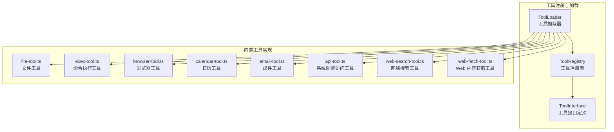

**图表来源**
- [tool-loader.ts:1-312](file://src/main/tools/registry/tool-loader.ts#L1-L312)
- [tool-registry.ts:1-328](file://src/main/tools/registry/tool-registry.ts#L1-L328)
- [tool-interface.ts:1-152](file://src/main/tools/registry/tool-interface.ts#L1-L152)

**章节来源**
- [tool-loader.ts:1-312](file://src/main/tools/registry/tool-loader.ts#L1-L312)
- [tool-registry.ts:1-328](file://src/main/tools/registry/tool-registry.ts#L1-L328)
- [tool-interface.ts:1-152](file://src/main/tools/registry/tool-interface.ts#L1-L152)

## 核心组件
- 工具接口与元数据：定义工具插件的元数据、创建选项、加载结果与生命周期钩子，确保工具实现的一致性与可扩展性。
- 工具注册表：集中管理工具插件的注册、查询、配置与清理，提供工具列表与状态展示能力。
- 工具加载器：负责加载内置工具、读取工具配置、创建工具实例、注册到注册表，并返回给 Agent Runtime。

关键职责与关系：
- ToolInterface：定义 ToolPlugin、ToolMetadata、ToolCreateOptions、ToolLoadResult 等契约。
- ToolRegistry：提供 register/loadFromDirectory/getAllTools/setToolConfig/cleanup 等能力。
- ToolLoader：聚合内置工具、读取 tools-config.json、按启用状态过滤、创建实例并返回 AgentTool[]。

**章节来源**
- [tool-interface.ts:1-152](file://src/main/tools/registry/tool-interface.ts#L1-L152)
- [tool-registry.ts:36-327](file://src/main/tools/registry/tool-registry.ts#L36-L327)
- [tool-loader.ts:40-311](file://src/main/tools/registry/tool-loader.ts#L40-L311)

## 架构总览
工具加载器的整体流程如下：

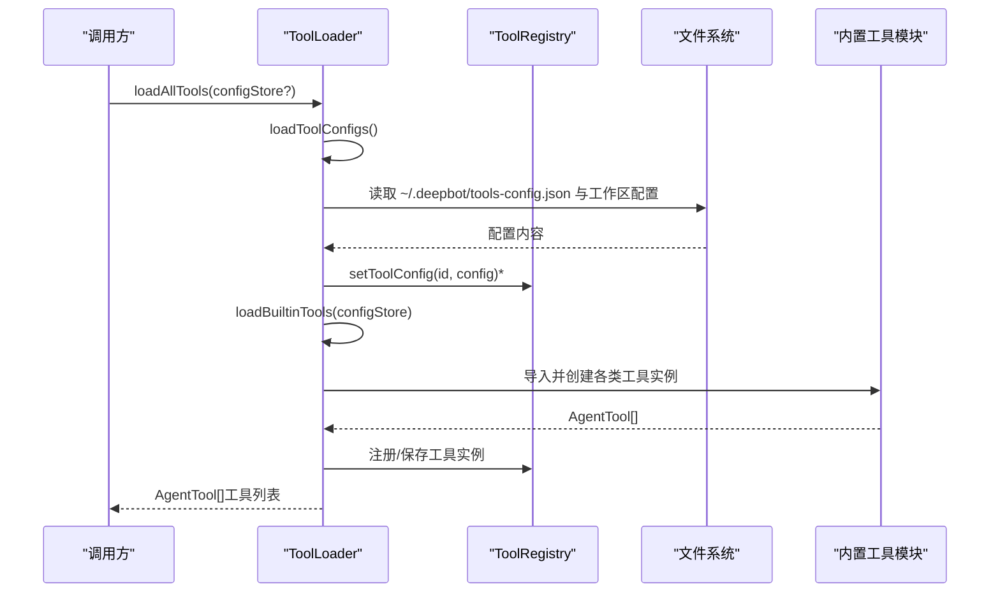

**图表来源**
- [tool-loader.ts:57-71](file://src/main/tools/registry/tool-loader.ts#L57-L71)
- [tool-loader.ts:77-99](file://src/main/tools/registry/tool-loader.ts#L77-L99)
- [tool-loader.ts:109-301](file://src/main/tools/registry/tool-loader.ts#L109-L301)
- [tool-registry.ts:46-194](file://src/main/tools/registry/tool-registry.ts#L46-L194)

## 详细组件分析

### 工具加载器（ToolLoader）
- 职责
  - 读取用户与工作区工具配置（tools-config.json）。
  - 聚合内置工具：文件、命令执行、浏览器、日历、技能管理、定时任务、环境检查、图片生成、Web 搜索、Web 内容获取、记忆、聊天、API、连接器、跨 Tab 调用、系统指令、飞书文档等。
  - 支持按启用状态过滤工具（基于配置与工具名称常量）。
  - 返回 AgentTool[] 供 Agent Runtime 使用。

- 关键流程
  - loadAllTools：统一入口，打印加载进度与结果。
  - loadToolConfigs：合并用户与工作区配置，逐条 setToolConfig。
  - loadBuiltinTools：逐一导入并创建工具实例，处理 Promise 返回值，按 isEnabled 过滤，最终收集到数组返回。

- 错误处理
  - 配置读取失败：捕获异常并记录错误日志。
  - 工具加载失败：捕获异常并记录错误日志，不影响其他工具加载。

- 性能与并发
  - 工具创建为同步/异步混合，按需 await。
  - 通过 isEnabled 快速过滤禁用工具，减少无效创建。

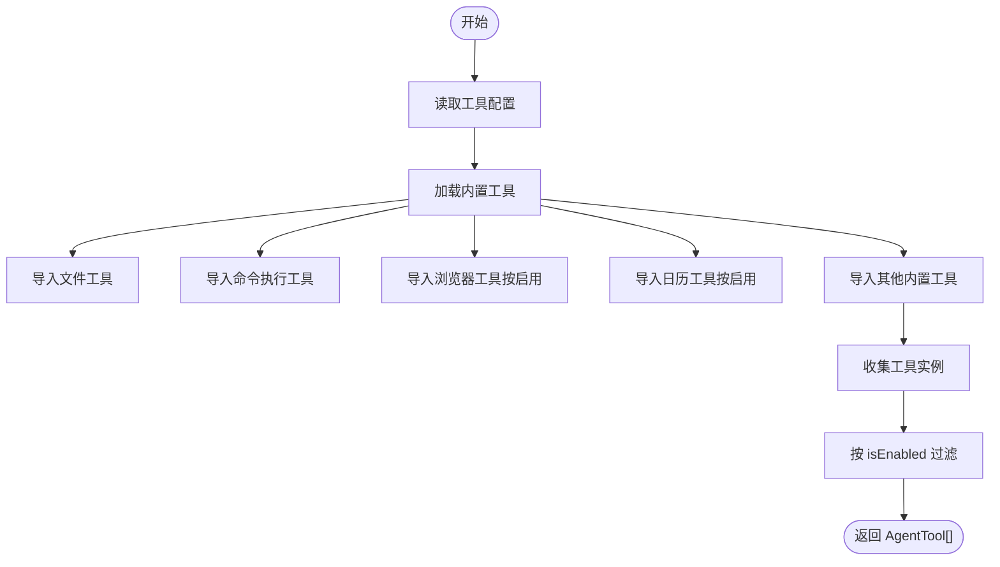

**图表来源**
- [tool-loader.ts:57-71](file://src/main/tools/registry/tool-loader.ts#L57-L71)
- [tool-loader.ts:109-301](file://src/main/tools/registry/tool-loader.ts#L109-L301)

**章节来源**
- [tool-loader.ts:40-311](file://src/main/tools/registry/tool-loader.ts#L40-L311)

### 工具注册表（ToolRegistry）
- 职责
  - 注册工具插件（register）。
  - 从目录动态加载工具（loadFromDirectory，当前架构下不再使用）。
  - 管理工具配置（setToolConfig/getToolConfig）。
  - 提供工具查询与清理（getAllTools/getPlugin/getTools/cleanup）。
  - 提供 UI 展示的工具列表（getToolList）。

- 关键点
  - loadFromDirectory：扫描目录、过滤文件类型与测试文件、动态 import、校验插件导出、注册并初始化、创建工具实例、保存到 loadedTools。
  - cleanup：遍历插件调用 cleanup，清理资源并清空内存映射。

- 历史说明
  - 当前架构下，工具主要通过 ToolLoader 显式导入与创建，loadFromDirectory 为历史遗留方法，不再使用。

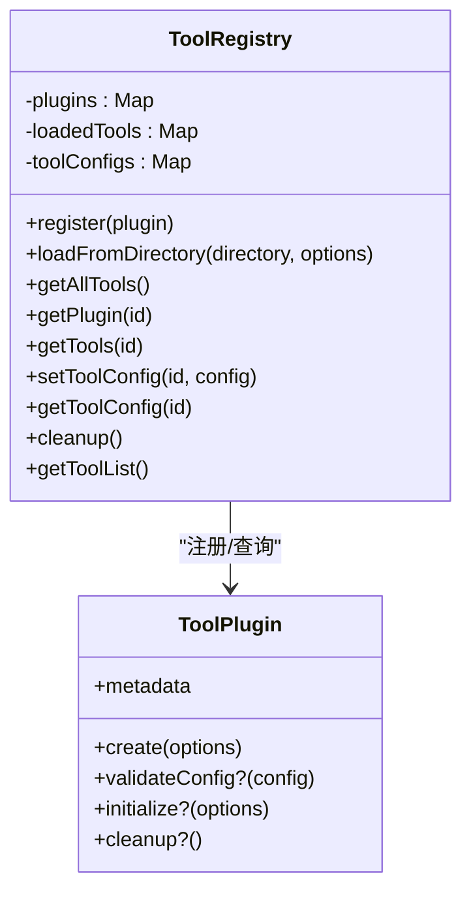

**图表来源**
- [tool-registry.ts:36-327](file://src/main/tools/registry/tool-registry.ts#L36-L327)
- [tool-interface.ts:101-134](file://src/main/tools/registry/tool-interface.ts#L101-L134)

**章节来源**
- [tool-registry.ts:36-327](file://src/main/tools/registry/tool-registry.ts#L36-L327)

### 工具接口与元数据（ToolInterface）
- ToolMetadata：定义工具的唯一 ID、名称、描述、版本、作者、分类、标签、是否需要配置、配置 Schema 等。
- ToolCreateOptions：提供 workspaceDir、sessionId、config、configStore、dependencies 等创建参数。
- ToolPlugin：定义 create、validateConfig、initialize、cleanup 等生命周期钩子。
- ToolLoadResult：封装插件、工具实例、状态与错误信息。

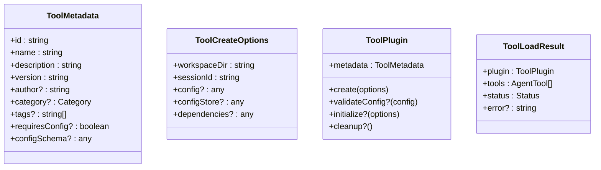

**图表来源**
- [tool-interface.ts:33-151](file://src/main/tools/registry/tool-interface.ts#L33-L151)

**章节来源**
- [tool-interface.ts:1-152](file://src/main/tools/registry/tool-interface.ts#L1-L152)

### 工具发现机制与文件扫描策略
- 当前架构下，工具发现与动态加载主要通过 ToolLoader 显式导入实现，而非目录扫描。
- ToolRegistry.loadFromDirectory 仍保留目录扫描能力，用于历史兼容或未来扩展，其策略如下：
  - 检查目录是否存在。
  - 遍历目录项，仅处理文件（不递归）。
  - 过滤非 TypeScript/JavaScript 文件与测试/类型定义文件。
  - 动态 import 模块，查找默认导出或 plugin/toolPlugin 字段。
  - 校验插件元数据与 create 方法，注册插件，按配置启用状态决定是否创建实例。
  - 初始化插件（initialize），创建工具实例（create），保存到 loadedTools。

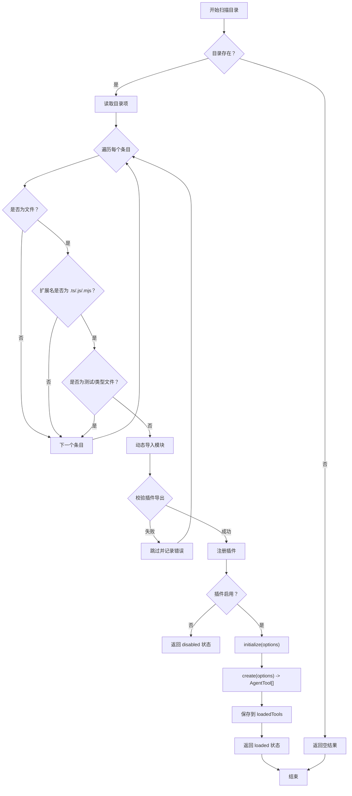

**图表来源**
- [tool-registry.ts:64-194](file://src/main/tools/registry/tool-registry.ts#L64-L194)

**章节来源**
- [tool-registry.ts:64-194](file://src/main/tools/registry/tool-registry.ts#L64-L194)

### 工具加载生命周期
- 配置阶段：ToolLoader 读取 tools-config.json，逐条 setToolConfig。
- 发现与导入：ToolLoader 显式导入内置工具模块。
- 实例创建：调用各工具的 create(options)，部分工具返回 Promise，需 await。
- 注册与过滤：根据 isEnabled 过滤禁用工具，注册到 ToolRegistry。
- 返回：返回 AgentTool[] 给 Agent Runtime。

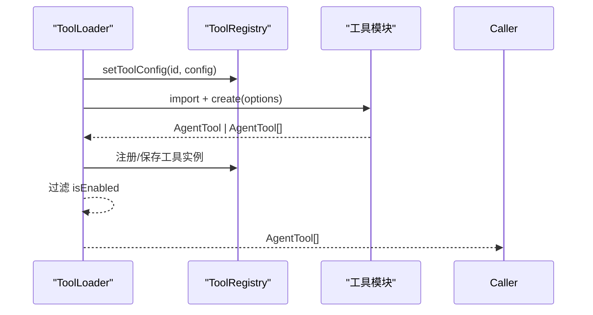

**图表来源**
- [tool-loader.ts:77-99](file://src/main/tools/registry/tool-loader.ts#L77-L99)
- [tool-loader.ts:109-301](file://src/main/tools/registry/tool-loader.ts#L109-L301)
- [tool-registry.ts:46-194](file://src/main/tools/registry/tool-registry.ts#L46-L194)

**章节来源**
- [tool-loader.ts:57-301](file://src/main/tools/registry/tool-loader.ts#L57-L301)
- [tool-registry.ts:46-194](file://src/main/tools/registry/tool-registry.ts#L46-L194)

### 典型工具实现与开发示例

#### 文件工具（file-tool）
- 职责：提供读、写、编辑文件的能力，封装安全检查与参数规范化。
- 安全与改进：normalizeToolParams、wrapToolWithSecurity、improveReadResult。
- 动态导入：使用 eval 绕过 TS 编译器动态 import pi-coding-agent。

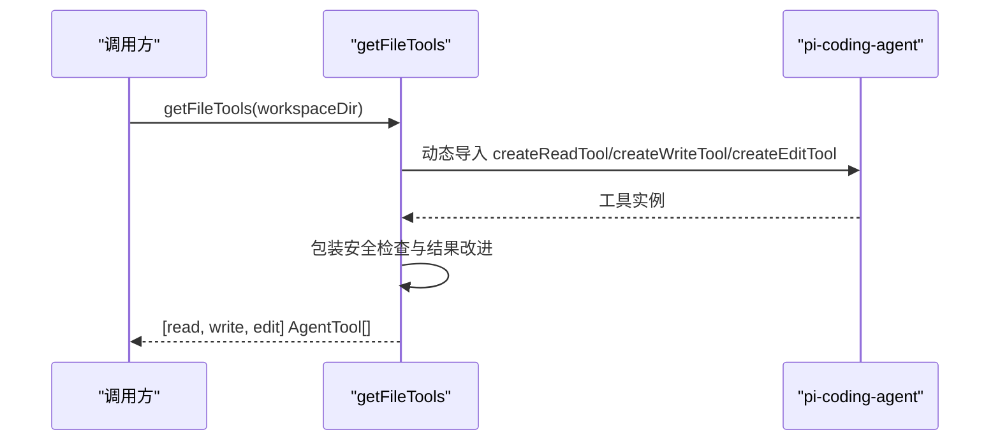

**图表来源**
- [file-tool.ts:193-218](file://src/main/tools/file-tool.ts#L193-L218)

**章节来源**
- [file-tool.ts:1-219](file://src/main/tools/file-tool.ts#L1-L219)

#### 命令执行工具（exec-tool）
- 职责：统一超时控制、危险命令拦截、路径安全检查、输出截断与编码处理。
- 安全要点：DANGEROUS_COMMANDS/DANGEROUS_PATTERNS、checkCommandPathSecurity、assertPathAllowed。
- 动态环境：getShellEnvFromLoginShell、Windows 中文编码处理（chcp 65001）。

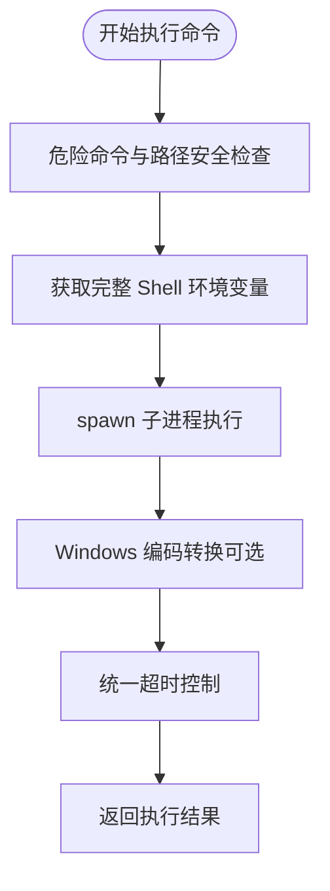

**图表来源**
- [exec-tool.ts:317-528](file://src/main/tools/exec-tool.ts#L317-L528)

**章节来源**
- [exec-tool.ts:1-529](file://src/main/tools/exec-tool.ts#L1-L529)

#### 浏览器工具（browser-tool）
- 职责：基于 agent-browser CLI 控制浏览器，支持打开网页、快照、点击、输入、截图、标签页管理等。
- Docker 与非 Docker 模式：自动启动 Playwright Chromium 或系统 Chrome。
- 元数据与参数：TOOL_NAMES、BrowserToolSchema、动作枚举与参数校验。

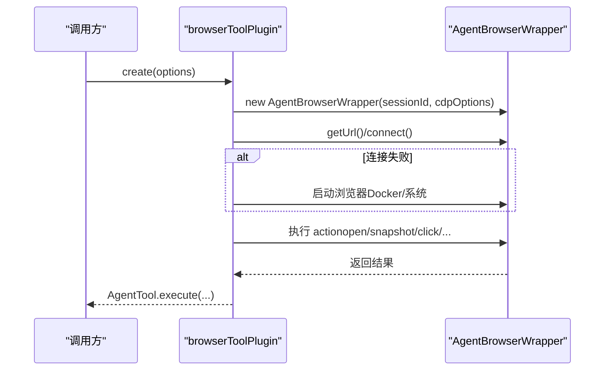

**图表来源**
- [browser-tool.ts:183-361](file://src/main/tools/browser-tool.ts#L183-L361)

**章节来源**
- [browser-tool.ts:1-976](file://src/main/tools/browser-tool.ts#L1-L976)

#### 日历工具（calendar-tool）
- 职责：macOS 平台的日历事件读取与创建，使用 AppleScript。
- 平台限制：仅 macOS，需要 Automation 权限。
- 参数与错误：parseDateRange、runAppleScript、权限错误提示。

**章节来源**
- [calendar-tool.ts:1-452](file://src/main/tools/calendar-tool.ts#L1-L452)

#### 邮件工具（email-tool）
- 职责：SMTP 发送邮件，支持纯文本/HTML、附件、抄送/密送。
- 配置：用户级与项目级配置文件优先级，动态加载与校验。
- 安全与超时：nodemailer 传输器超时设置，AbortSignal 监听。

**章节来源**
- [email-tool.ts:1-405](file://src/main/tools/email-tool.ts#L1-L405)

#### API 工具（api-tool）
- 职责：访问与设置系统配置，包括工作目录、模型、工具等。
- 安全限制：只读查询与受限写操作，部分接口已禁用（如工作目录设置）。
- 工具名称：TOOL_NAMES.API_* 常量统一管理。

**章节来源**
- [api-tool.ts:1-220](file://src/main/tools/api-tool.ts#L1-L220)

#### 网络搜索工具（web-search-tool）
- 职责：调用 Qwen/Gemini API 进行网络搜索，提取答案与来源。
- 配置：从 SystemConfigStore 读取 provider、apiKey、apiUrl、model。
- 超时与取消：HTTPS Agent、TIMEOUTS.WEB_SEARCH_TIMEOUT、AbortSignal。

**章节来源**
- [web-search-tool.ts:1-533](file://src/main/tools/web-search-tool.ts#L1-L533)

#### Web 内容获取工具（web-fetch-tool）
- 职责：从 URL 获取网页内容，使用 Readability 提取主要内容并转换为 Markdown。
- 安全防护：SSRF 防护（协议与内网检测）、HTML 清理、不可见字符过滤。
- 模式：full/truncated/selective，支持搜索短语。

**章节来源**
- [web-fetch-tool.ts:1-743](file://src/main/tools/web-fetch-tool.ts#L1-L743)

### 工具开发最佳实践与常见陷阱

- 导出规范
  - 默认导出 ToolPlugin，包含 metadata 与 create 方法。
  - 可选实现 validateConfig、initialize、cleanup 生命周期钩子。

- 元数据定义
  - 使用 TOOL_NAMES 常量统一命名，避免硬编码。
  - 提供清晰的 description、category、tags，便于 UI 展示与检索。

- 配置处理
  - 若需要配置文件，遵循用户级与项目级优先级策略。
  - 使用 safeJsonParse 与类型校验，提供默认值与错误提示。

- 安全与健壮性
  - 对外部调用（HTTP/子进程/文件系统）进行参数校验与超时控制。
  - 对路径与命令进行严格的安全检查，避免路径穿越与危险命令。
  - 对用户输入进行编码与不可见字符过滤，防止注入攻击。

- 可取消与可观测性
  - 在 execute 中检查 AbortSignal，及时中止长时间操作。
  - 记录关键日志，便于调试与审计。

- 常见陷阱
  - 忘记 await Promise 返回的工具实例。
  - 忽略配置文件缺失或格式错误导致的异常。
  - 未处理平台差异（如 Windows 中文编码）。
  - 未对输入进行 SSRF 与注入攻击防护。

**章节来源**
- [example-tool.ts:1-211](file://src/main/tools/registry/example-tool.ts#L1-L211)
- [tool-names.ts:8-94](file://src/main/tools/tool-names.ts#L8-L94)

## 依赖关系分析

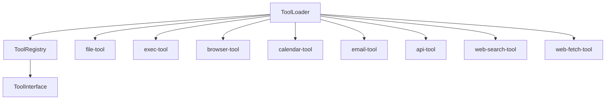

**图表来源**
- [tool-loader.ts:17-35](file://src/main/tools/registry/tool-loader.ts#L17-L35)
- [tool-registry.ts:27-31](file://src/main/tools/registry/tool-registry.ts#L27-L31)
- [index.ts:5-7](file://src/main/tools/registry/index.ts#L5-L7)

**章节来源**
- [tool-loader.ts:17-35](file://src/main/tools/registry/tool-loader.ts#L17-L35)
- [tool-registry.ts:27-31](file://src/main/tools/registry/tool-registry.ts#L27-L31)
- [index.ts:1-8](file://src/main/tools/registry/index.ts#L1-L8)

## 性能考虑
- 动态导入与依赖懒加载：部分工具（如 web-fetch-tool）采用动态 import，按需加载依赖，降低启动时内存占用。
- 超时控制：统一使用 TIMEOUTS 配置，避免长时间阻塞。
- 过滤禁用工具：通过 isEnabled 快速过滤，减少无效创建。
- 输出截断与内容清理：对大文本与 HTML 进行截断与清理，避免传递过多数据给 AI。

[本节为通用指导，无需特定文件引用]

## 故障排查指南
- 工具配置加载失败
  - 检查 ~/.deepbot/tools-config.json 与工作区配置文件格式与权限。
  - 查看控制台错误日志，定位解析失败原因。

- 工具创建异常
  - 检查工具 create 返回值类型（Promise 或直接实例），确保 ToolLoader 正确 await。
  - 查看工具内部错误日志与错误消息。

- 平台与权限问题
  - macOS 日历工具需 Automation 权限。
  - 浏览器工具需系统 Chrome 或 Playwright Chromium，检查端口与用户数据目录。
  - 邮件工具需正确的 SMTP 配置与授权码。

- 安全与超时
  - 命令执行工具拦截危险命令与路径，检查日志提示。
  - Web 工具设置合理超时，避免长时间等待。

**章节来源**
- [tool-loader.ts:77-99](file://src/main/tools/registry/tool-loader.ts#L77-L99)
- [calendar-tool.ts:59-86](file://src/main/tools/calendar-tool.ts#L59-L86)
- [browser-tool.ts:217-361](file://src/main/tools/browser-tool.ts#L217-L361)
- [email-tool.ts:76-129](file://src/main/tools/email-tool.ts#L76-L129)

## 结论
DeepBot 工具加载器采用“显式导入 + 注册表管理”的架构，结合工具接口与生命周期钩子，实现了稳定、可扩展与可维护的工具体系。通过配置驱动的启用/禁用机制、统一的超时与安全策略、以及完善的错误处理与可观测性，为 Agent Runtime 提供高质量的工具实例集合。开发者可依据工具接口与示例模板快速扩展新工具，并遵循最佳实践规避常见陷阱。

[本节为总结性内容，无需特定文件引用]

## 附录

### 工具名称常量（TOOL_NAMES）
- 统一管理所有工具名称，避免硬编码，便于过滤与 UI 展示。
- 包含核心工具、文件操作、技能管理、定时任务、日历、图片生成、Web 搜索、Web 内容获取、记忆、环境检查、邮件、API、连接器、飞书文档、AI 对话、跨 Tab 调用、系统指令等。

**章节来源**
- [tool-names.ts:8-94](file://src/main/tools/tool-names.ts#L8-L94)