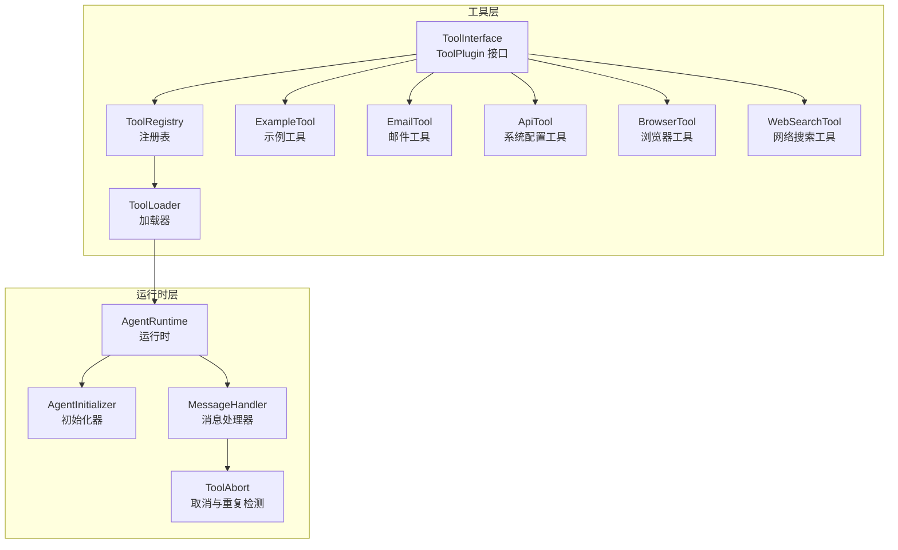
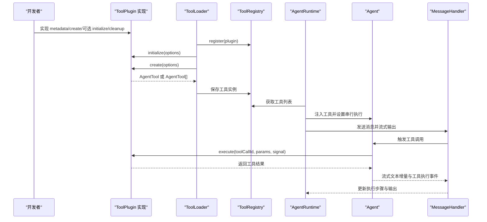
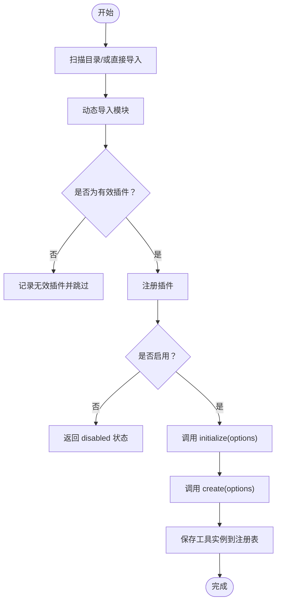
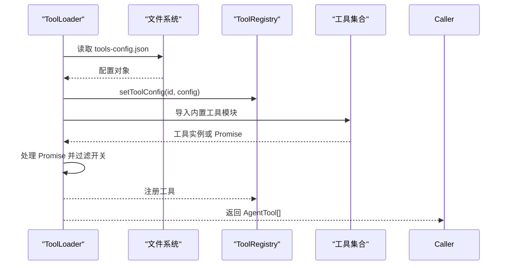
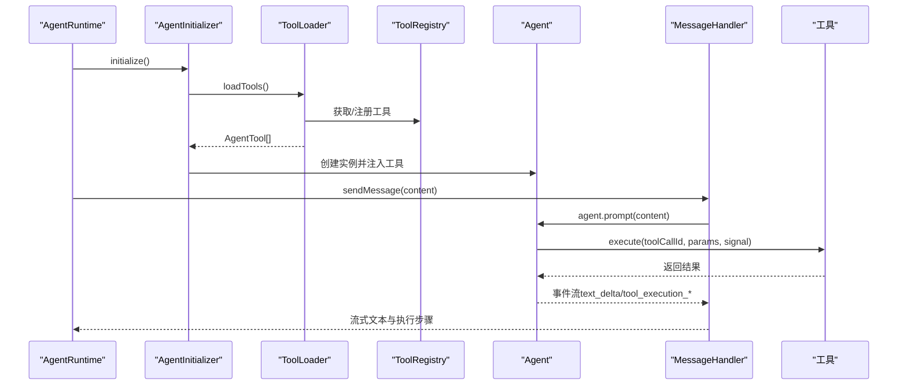
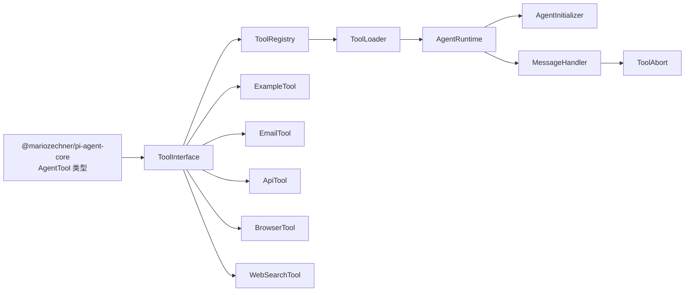

# 工具接口规范

<cite>
**本文档引用的文件**
- [tool-interface.ts](file://src/main/tools/registry/tool-interface.ts)
- [tool-registry.ts](file://src/main/tools/registry/tool-registry.ts)
- [tool-loader.ts](file://src/main/tools/registry/tool-loader.ts)
- [example-tool.ts](file://src/main/tools/registry/example-tool.ts)
- [email-tool.ts](file://src/main/tools/email-tool.ts)
- [api-tool.ts](file://src/main/tools/api-tool.ts)
- [browser-tool.ts](file://src/main/tools/browser-tool.ts)
- [web-search-tool.ts](file://src/main/tools/web-search-tool.ts)
- [agent-runtime.ts](file://src/main/agent-runtime/agent-runtime.ts)
- [agent-initializer.ts](file://src/main/agent-runtime/agent-initializer.ts)
- [message-handler.ts](file://src/main/agent-runtime/message-handler.ts)
- [tool-abort.ts](file://src/main/tools/tool-abort.ts)
- [tools.ts](file://src/types/tools.ts)
</cite>

## 目录
1. [简介](#简介)
2. [项目结构](#项目结构)
3. [核心组件](#核心组件)
4. [架构总览](#架构总览)
5. [详细组件分析](#详细组件分析)
6. [依赖关系分析](#依赖关系分析)
7. [性能考量](#性能考量)
8. [故障排除指南](#故障排除指南)
9. [结论](#结论)
10. [附录](#附录)

## 简介
本文件面向第三方开发者与集成者，系统化阐述 史丽慧小助理 工具接口规范（ToolPlugin）的设计理念、接口定义、生命周期方法、配置接口与扩展机制，并结合 Agent Runtime 的集成方式，给出参数传递、返回值处理、版本兼容性与向后兼容策略、最佳实践与安全注意事项。

## 项目结构
史丽慧小助理 的工具体系围绕“内置工具 + 注册表 + 加载器”的架构组织，工具实现遵循统一的 ToolPlugin 接口，通过 ToolLoader 在运行时集中加载，ToolRegistry 负责注册与管理，最终注入到 Agent Runtime 的 Agent 实例中供推理与执行。



图表来源
- [tool-interface.ts:101-134](file://src/main/tools/registry/tool-interface.ts#L101-L134)
- [tool-registry.ts:36-310](file://src/main/tools/registry/tool-registry.ts#L36-L310)
- [tool-loader.ts:40-311](file://src/main/tools/registry/tool-loader.ts#L40-L311)
- [agent-runtime.ts:27-188](file://src/main/agent-runtime/agent-runtime.ts#L27-L188)
- [agent-initializer.ts:17-71](file://src/main/agent-runtime/agent-initializer.ts#L17-L71)
- [message-handler.ts:16-587](file://src/main/agent-runtime/message-handler.ts#L16-L587)
- [tool-abort.ts:101-144](file://src/main/tools/tool-abort.ts#L101-L144)

章节来源
- [tool-interface.ts:1-152](file://src/main/tools/registry/tool-interface.ts#L1-L152)
- [tool-registry.ts:1-328](file://src/main/tools/registry/tool-registry.ts#L1-L328)
- [tool-loader.ts:1-312](file://src/main/tools/registry/tool-loader.ts#L1-L312)
- [agent-runtime.ts:1-909](file://src/main/agent-runtime/agent-runtime.ts#L1-L909)
- [agent-initializer.ts:1-188](file://src/main/agent-runtime/agent-initializer.ts#L1-L188)
- [message-handler.ts:1-752](file://src/main/agent-runtime/message-handler.ts#L1-L752)
- [tool-abort.ts:1-427](file://src/main/tools/tool-abort.ts#L1-L427)

## 核心组件
- ToolPlugin 接口：定义工具元数据、创建方法、可选的配置校验、初始化与清理生命周期。
- ToolRegistry：工具注册表，负责注册、加载、查询、配置管理与清理。
- ToolLoader：内置工具加载器，集中导入与加载工具，读取工具配置并注入到 Agent Runtime。
- Agent Runtime：协调各模块，管理 Agent 生命周期，注入工具并处理流式输出与执行步骤。
- 工具实现示例：示例工具、邮件工具、API 工具、浏览器工具、网络搜索工具等，体现参数 Schema、执行逻辑、取消与错误处理。

章节来源
- [tool-interface.ts:101-134](file://src/main/tools/registry/tool-interface.ts#L101-L134)
- [tool-registry.ts:36-310](file://src/main/tools/registry/tool-registry.ts#L36-L310)
- [tool-loader.ts:40-311](file://src/main/tools/registry/tool-loader.ts#L40-L311)
- [agent-runtime.ts:27-188](file://src/main/agent-runtime/agent-runtime.ts#L27-L188)

## 架构总览
工具接口规范与 Agent Runtime 的集成路径如下：



图表来源
- [tool-loader.ts:109-301](file://src/main/tools/registry/tool-loader.ts#L109-L301)
- [tool-registry.ts:137-194](file://src/main/tools/registry/tool-registry.ts#L137-L194)
- [agent-runtime.ts:193-229](file://src/main/agent-runtime/agent-runtime.ts#L193-L229)
- [agent-initializer.ts:42-71](file://src/main/agent-runtime/agent-initializer.ts#L42-L71)
- [message-handler.ts:114-587](file://src/main/agent-runtime/message-handler.ts#L114-L587)
- [tool-abort.ts:101-144](file://src/main/tools/tool-abort.ts#L101-L144)

## 详细组件分析

### ToolPlugin 接口设计与规范
- 元数据 metadata：包含工具唯一标识、显示名称、描述、版本、作者、分类、是否需要配置、配置 Schema、图标与标签等。
- 创建方法 create：根据 ToolCreateOptions 返回 AgentTool 或 AgentTool[]，并定义参数 Schema（TypeBox）。
- 可选方法：
  - validateConfig：对工具配置进行校验，返回 { valid, error? }。
  - initialize：在工具加载时初始化资源（如客户端、连接池）。
  - cleanup：在工具卸载时清理资源。
- ToolLoadResult：封装加载结果，包含 plugin、tools、status（loaded/disabled/error）、error。

```mermaid
classDiagram
class ToolPlugin {
+metadata : ToolMetadata
+create(options) : AgentTool | AgentTool[]
+validateConfig?(config) : {valid, error?}
+initialize?(options) : void | Promise<void>
+cleanup?() : void | Promise<void>
}
class ToolMetadata {
+id : string
+name : string
+description : string
+version : string
+author? : string
+category? : string
+requiresConfig? : boolean
+configSchema? : any
+icon? : string
+tags? : string[]
}
class ToolCreateOptions {
+workspaceDir : string
+sessionId : string
+config? : any
+configStore? : any
+dependencies? : any
}
class ToolLoadResult {
+plugin : ToolPlugin
+tools : AgentTool[]
+status : "loaded"|"disabled"|"error"
+error? : string
}
ToolPlugin --> ToolMetadata : "拥有"
ToolPlugin --> ToolCreateOptions : "创建时使用"
ToolRegistry --> ToolPlugin : "注册"
ToolRegistry --> ToolLoadResult : "返回"
```

图表来源
- [tool-interface.ts:33-63](file://src/main/tools/registry/tool-interface.ts#L33-L63)
- [tool-interface.ts:79-94](file://src/main/tools/registry/tool-interface.ts#L79-L94)
- [tool-interface.ts:101-134](file://src/main/tools/registry/tool-interface.ts#L101-L134)
- [tool-interface.ts:139-151](file://src/main/tools/registry/tool-interface.ts#L139-L151)

章节来源
- [tool-interface.ts:33-151](file://src/main/tools/registry/tool-interface.ts#L33-L151)

### ToolRegistry 注册表
- 职责：注册工具插件、从目录加载工具、管理工具配置、提供工具查询与清理。
- 关键能力：
  - register：覆盖同名工具时发出警告。
  - loadFromDirectory：扫描目录动态导入工具（历史遗留，当前不使用）。
  - loadToolFromPath：动态导入、注册、初始化、创建工具实例并缓存。
  - getToolList：提供 UI 展示的工具清单。
  - cleanup：遍历调用插件 cleanup 并清空缓存。



图表来源
- [tool-registry.ts:64-194](file://src/main/tools/registry/tool-registry.ts#L64-L194)

章节来源
- [tool-registry.ts:36-310](file://src/main/tools/registry/tool-registry.ts#L36-L310)

### ToolLoader 加载器
- 职责：集中导入内置工具，读取工具配置（tools-config.json），按开关过滤工具，调用工具 create 并返回 AgentTool[]。
- 关键流程：
  - loadToolConfigs：从用户目录与工作区读取工具配置。
  - loadBuiltinTools：逐一导入工具并处理 Promise 返回值，按开关过滤。
  - 返回工具数组给 Agent Runtime。



图表来源
- [tool-loader.ts:77-109](file://src/main/tools/registry/tool-loader.ts#L77-L109)
- [tool-loader.ts:109-301](file://src/main/tools/registry/tool-loader.ts#L109-L301)

章节来源
- [tool-loader.ts:40-311](file://src/main/tools/registry/tool-loader.ts#L40-L311)

### Agent Runtime 集成与执行链路
- AgentRuntime：初始化 Agent、加载工具、构建系统提示词、维护消息队列、流式输出与执行步骤。
- AgentInitializer：创建 Agent 实例并设置串行工具执行，注入工具列表。
- MessageHandler：订阅 Agent 事件，收集工具调用、进度与结果，支持 AbortSignal，提供流式输出。
- ToolAbort：为工具添加 AbortSignal 支持与重复检测，防止重复操作与连续失败。



图表来源
- [agent-runtime.ts:193-229](file://src/main/agent-runtime/agent-runtime.ts#L193-L229)
- [agent-initializer.ts:42-71](file://src/main/agent-runtime/agent-initializer.ts#L42-L71)
- [message-handler.ts:114-587](file://src/main/agent-runtime/message-handler.ts#L114-L587)
- [tool-abort.ts:101-144](file://src/main/tools/tool-abort.ts#L101-L144)

章节来源
- [agent-runtime.ts:27-800](file://src/main/agent-runtime/agent-runtime.ts#L27-L800)
- [agent-initializer.ts:17-71](file://src/main/agent-runtime/agent-initializer.ts#L17-L71)
- [message-handler.ts:16-587](file://src/main/agent-runtime/message-handler.ts#L16-L587)
- [tool-abort.ts:101-144](file://src/main/tools/tool-abort.ts#L101-L144)

### 工具实现示例与最佳实践

#### 示例工具（example-tool）
- 展示 ToolPlugin 的完整实现：metadata、create、validateConfig、initialize、cleanup。
- 参数使用 TypeBox Schema 定义，执行中检查 AbortSignal，返回标准化结果结构。

章节来源
- [example-tool.ts:73-211](file://src/main/tools/registry/example-tool.ts#L73-L211)

#### 邮件工具（email-tool）
- 需要配置：从用户目录或工作区读取配置文件，支持 SMTP/SSL、抄送/密送、附件、HTML/纯文本。
- 参数校验与错误提示友好，支持 AbortSignal，发送后清理传输器。
- 配置 Schema 与工具元数据清晰，便于 UI 展示与管理。

章节来源
- [email-tool.ts:153-405](file://src/main/tools/email-tool.ts#L153-L405)

#### API 工具（api-tool）
- 提供系统配置访问能力：工作目录、模型、工具配置等。
- 采用多工具聚合返回，每个子工具定义独立 Schema 与执行逻辑。
- 安全限制：只读查询与写操作需用户确认。

章节来源
- [api-tool.ts:25-220](file://src/main/tools/api-tool.ts#L25-L220)

#### 浏览器工具（browser-tool）
- 基于 agent-browser CLI，支持打开网页、快照、点击、填充、截图、标签页管理等。
- Docker 与非 Docker 模式分别处理浏览器启动与连接。
- 强制使用快照作为页面内容入口，严格遵循“操作后必须快照”的规则。

章节来源
- [browser-tool.ts:171-976](file://src/main/tools/browser-tool.ts#L171-L976)

#### 网络搜索工具（web-search-tool）
- 支持 Qwen 与 Gemini 两种提供商，根据配置选择调用方式。
- 对查询长度进行限制，避免超长输入导致 API 失败或超时。
- 返回结构包含答案与来源列表，便于展示与溯源。

章节来源
- [web-search-tool.ts:409-533](file://src/main/tools/web-search-tool.ts#L409-L533)

## 依赖关系分析
- ToolPlugin 依赖 AgentTool 类型（来自 pi-agent-core），工具返回值结构遵循统一约定。
- ToolLoader 依赖 ToolRegistry 与系统配置存储（SystemConfigStore），用于读取工具配置与开关。
- AgentRuntime 依赖 AgentInitializer 与 MessageHandler，后者依赖 ToolAbort 提供的取消与重复检测能力。
- 工具实现普遍使用 TypeBox 进行参数 Schema 定义，保证参数校验与文档生成。



图表来源
- [tool-interface.ts:28-29](file://src/main/tools/registry/tool-interface.ts#L28-L29)
- [tool-loader.ts:12-15](file://src/main/tools/registry/tool-loader.ts#L12-L15)
- [agent-runtime.ts:11-22](file://src/main/agent-runtime/agent-runtime.ts#L11-L22)
- [agent-initializer.ts:7-12](file://src/main/agent-runtime/agent-initializer.ts#L7-L12)
- [message-handler.ts:7-11](file://src/main/agent-runtime/message-handler.ts#L7-L11)
- [tool-abort.ts:10-22](file://src/main/tools/tool-abort.ts#L10-L22)

章节来源
- [tools.ts:5-27](file://src/types/tools.ts#L5-L27)

## 性能考量
- 工具串行执行：AgentInitializer 将工具执行模式设为串行，避免并发工具调用导致的资源竞争与状态冲突。
- 取消与超时：MessageHandler 对 Agent.prompt() 设置超时保护，工具执行中检查 AbortSignal，及时中断长时间运行的任务。
- 重复检测与失败上限：ToolAbort 的 OperationTracker 防止重复操作与连续失败导致的资源浪费。
- 上下文压缩：AgentRuntime 在加载历史消息时使用上下文压缩，控制消息轮次与 token 数量，提升推理效率。

章节来源
- [agent-initializer.ts:67-71](file://src/main/agent-runtime/agent-initializer.ts#L67-L71)
- [message-handler.ts:388-523](file://src/main/agent-runtime/message-handler.ts#L388-L523)
- [tool-abort.ts:149-271](file://src/main/tools/tool-abort.ts#L149-L271)
- [agent-runtime.ts:282-299](file://src/main/agent-runtime/agent-runtime.ts#L282-L299)

## 故障排除指南
- 工具加载失败：检查 ToolLoader 导入路径与工具 create 返回值类型，确保返回 AgentTool 或 AgentTool[]。
- 配置缺失：如邮件工具未找到配置文件，会抛出明确错误提示，指引创建用户级或项目级配置。
- 取消与中断：工具执行前/后检查 AbortSignal，若被取消抛出 AbortError；MessageHandler 支持用户主动停止并清理状态。
- 重复操作与连续失败：ToolAbort 会阻止重复操作并记录失败次数，超过阈值将强制停止任务。
- 网络搜索超时或返回空：检查查询长度限制与 API 配置，必要时缩短查询或分段处理。

章节来源
- [tool-loader.ts:296-299](file://src/main/tools/registry/tool-loader.ts#L296-L299)
- [email-tool.ts:114-129](file://src/main/tools/email-tool.ts#L114-L129)
- [tool-abort.ts:280-426](file://src/main/tools/tool-abort.ts#L280-L426)
- [web-search-tool.ts:433-439](file://src/main/tools/web-search-tool.ts#L433-L439)

## 结论
ToolPlugin 接口规范为 史丽慧小助理 工具生态提供了统一的抽象与契约，配合 ToolRegistry 与 ToolLoader 的注册与加载机制，以及 Agent Runtime 的集成与执行链路，实现了可扩展、可配置、可取消、可监控的工具体系。通过示例工具与典型实现（邮件、API、浏览器、网络搜索）展示了参数 Schema、配置管理、取消与错误处理的最佳实践。遵循本文档的规范与建议，可确保工具实现的稳定性、安全性与可维护性。

## 附录

### 版本兼容性与向后兼容策略
- 元数据 version 字段用于标识工具版本，建议遵循语义化版本控制。
- ToolPlugin 接口为稳定契约，新增可选方法（如 validateConfig、initialize、cleanup）不影响既有实现，保持向后兼容。
- ToolRegistry 与 ToolLoader 的行为变更需谨慎评估，避免破坏现有工具加载流程。
- 工具返回值结构遵循统一约定（content、details、isError），便于 Agent Runtime 与 UI 展示。

章节来源
- [tool-interface.ts:44](file://src/main/tools/registry/tool-interface.ts#L44)
- [tool-interface.ts:119-133](file://src/main/tools/registry/tool-interface.ts#L119-L133)
- [tools.ts:10-13](file://src/types/tools.ts#L10-L13)

### 扩展机制
- 插件化：实现 ToolPlugin 接口并注册到 ToolRegistry，即可被 ToolLoader 自动发现与加载。
- 配置扩展：通过 ToolMetadata.configSchema 定义配置 Schema，ToolLoader 读取 tools-config.json 生效。
- 动态依赖：工具可按需动态 require 外部依赖（如邮件工具使用 nodemailer），注意错误处理与安全限制。
- 多工具聚合：单个 ToolPlugin 可返回多个 AgentTool，实现功能组合（如 API 工具聚合多项配置操作）。

章节来源
- [tool-registry.ts:137-194](file://src/main/tools/registry/tool-registry.ts#L137-L194)
- [tool-loader.ts:109-301](file://src/main/tools/registry/tool-loader.ts#L109-L301)
- [email-tool.ts:153-405](file://src/main/tools/email-tool.ts#L153-L405)
- [api-tool.ts:25-220](file://src/main/tools/api-tool.ts#L25-L220)

### 接口实现示例路径
- 示例工具实现：[example-tool.ts:73-211](file://src/main/tools/registry/example-tool.ts#L73-L211)
- 邮件工具实现：[email-tool.ts:153-405](file://src/main/tools/email-tool.ts#L153-L405)
- API 工具实现：[api-tool.ts:25-220](file://src/main/tools/api-tool.ts#L25-L220)
- 浏览器工具实现：[browser-tool.ts:171-976](file://src/main/tools/browser-tool.ts#L171-L976)
- 网络搜索工具实现：[web-search-tool.ts:409-533](file://src/main/tools/web-search-tool.ts#L409-L533)

### 参数传递与返回值处理
- 参数传递：工具 execute 接收 toolCallId、params、signal，其中 params 由 ToolPlugin.parameters（TypeBox）约束。
- 返回值：统一为包含 content（文本数组）与 details（可选）的对象，错误时设置 isError 并返回错误信息。
- 取消机制：工具应在执行前/后检查 signal.aborted，必要时抛出 AbortError。

章节来源
- [tools.ts:10-21](file://src/types/tools.ts#L10-L21)
- [tool-abort.ts:31-45](file://src/main/tools/tool-abort.ts#L31-L45)
- [example-tool.ts:98-187](file://src/main/tools/registry/example-tool.ts#L98-L187)
- [email-tool.ts:174-400](file://src/main/tools/email-tool.ts#L174-L400)
- [browser-tool.ts:215-976](file://src/main/tools/browser-tool.ts#L215-L976)
- [web-search-tool.ts:415-532](file://src/main/tools/web-search-tool.ts#L415-L532)

### 最佳实践与安全注意事项
- 参数校验：使用 TypeBox 定义 Schema，确保输入合法与文档化。
- 取消支持：在关键 IO 操作前后检查 AbortSignal，及时响应用户停止。
- 错误处理：捕获并格式化错误信息，提供可读的错误提示与常见问题指引。
- 安全限制：避免执行高风险命令或访问敏感文件，必要时引入沙箱或权限控制。
- 配置管理：优先使用系统配置存储，避免硬编码敏感信息。

章节来源
- [example-tool.ts:49-70](file://src/main/tools/registry/example-tool.ts#L49-L70)
- [email-tool.ts:76-129](file://src/main/tools/email-tool.ts#L76-L129)
- [api-tool.ts:11-14](file://src/main/tools/api-tool.ts#L11-L14)
- [tool-abort.ts:101-144](file://src/main/tools/tool-abort.ts#L101-L144)