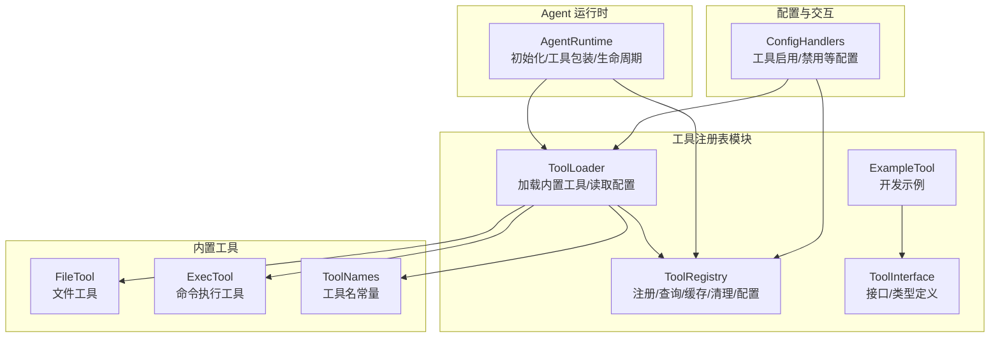
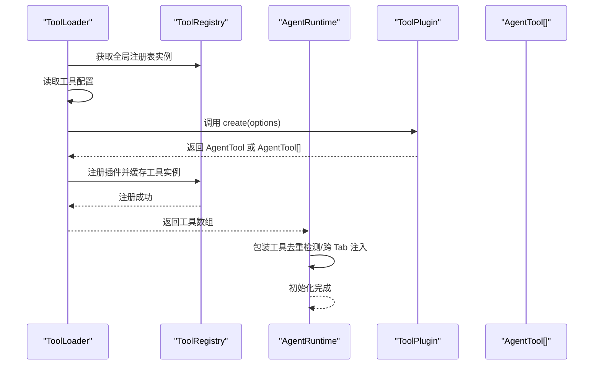
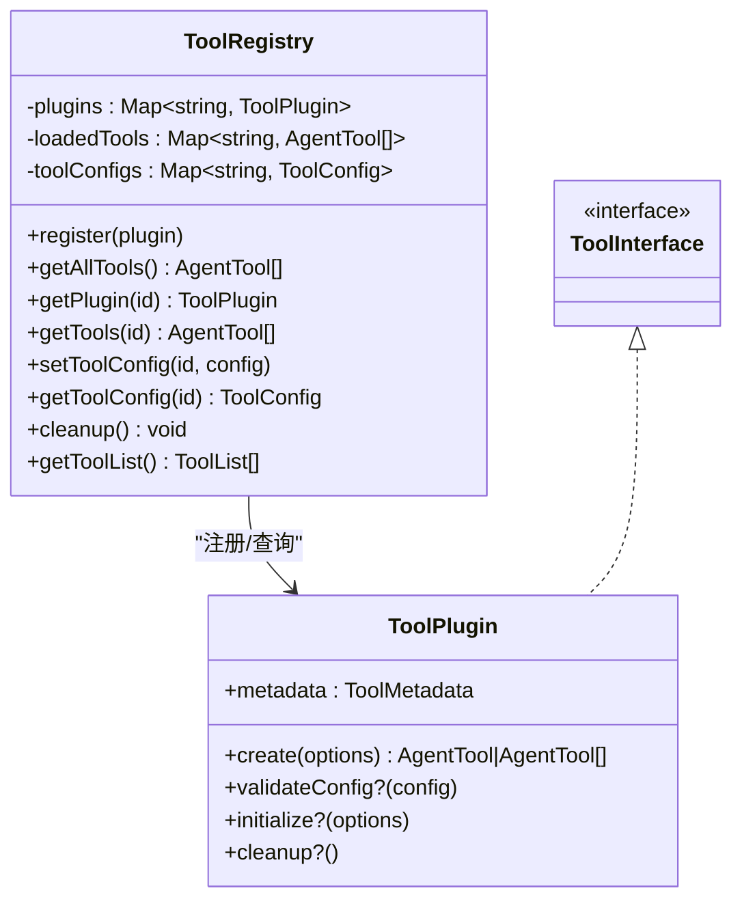
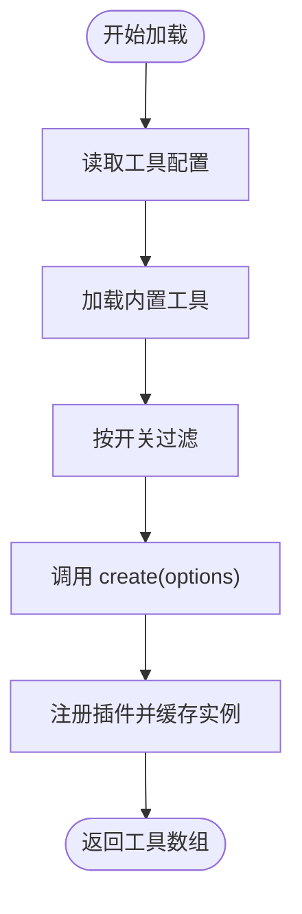
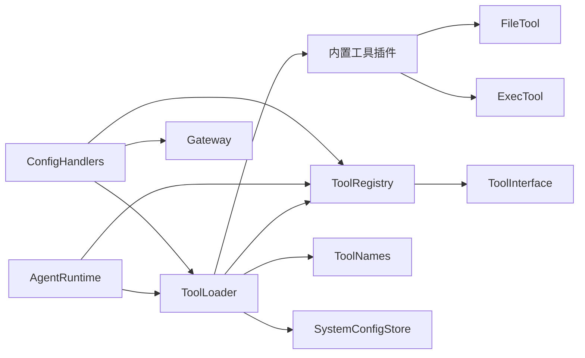

# 工具注册表核心

<cite>
**本文引用的文件**
- [tool-registry.ts](file://src/main/tools/registry/tool-registry.ts)
- [tool-loader.ts](file://src/main/tools/registry/tool-loader.ts)
- [tool-interface.ts](file://src/main/tools/registry/tool-interface.ts)
- [index.ts](file://src/main/tools/registry/index.ts)
- [example-tool.ts](file://src/main/tools/registry/example-tool.ts)
- [agent-runtime.ts](file://src/main/agent-runtime/agent-runtime.ts)
- [file-tool.ts](file://src/main/tools/file-tool.ts)
- [exec-tool.ts](file://src/main/tools/exec-tool.ts)
- [tool-names.ts](file://src/main/tools/tool-names.ts)
- [config-handlers.ts](file://src/main/tools/handlers/config-handlers.ts)
</cite>

## 目录
1. [简介](#简介)
2. [项目结构](#项目结构)
3. [核心组件](#核心组件)
4. [架构总览](#架构总览)
5. [详细组件分析](#详细组件分析)
6. [依赖关系分析](#依赖关系分析)
7. [性能考量](#性能考量)
8. [故障排查指南](#故障排查指南)
9. [结论](#结论)
10. [附录](#附录)

## 简介
本文件面向 史丽慧小助理 工具注册表核心组件，系统性阐述 ToolRegistry 的设计与实现，涵盖插件管理、工具实例缓存、配置管理、生命周期与清理、并发安全与性能优化，并给出使用示例与与其他系统组件的交互流程。目标读者既包括需要快速上手的开发者，也包括希望深入理解架构细节的高级用户。

## 项目结构
工具注册表相关代码集中在 src/main/tools/registry 目录，配合工具加载器、工具接口定义以及 Agent Runtime 的集成使用。关键文件职责如下：
- tool-registry.ts：工具注册表类，负责插件注册、工具实例缓存、配置管理、清理与工具列表导出。
- tool-loader.ts：工具加载器，负责加载内置工具、读取工具配置、创建工具实例并交由注册表管理。
- tool-interface.ts：工具接口与类型定义，规范 ToolPlugin、ToolConfig、ToolCreateOptions 等。
- index.ts：模块导出入口，统一导出接口与实现。
- example-tool.ts：工具开发示例，展示如何实现 ToolPlugin。
- agent-runtime.ts：Agent 运行时，负责初始化、工具包装与生命周期管理，间接使用注册表能力。
- file-tool.ts、exec-tool.ts：内置工具示例，体现工具加载与安全封装。
- tool-names.ts：工具名称常量，统一管理工具名，避免硬编码。
- config-handlers.ts：配置管理处理器，涉及工具启用/禁用等配置变更。

图表来源
- [tool-registry.ts:36-327](file://src/main/tools/registry/tool-registry.ts#L36-L327)
- [tool-loader.ts:40-311](file://src/main/tools/registry/tool-loader.ts#L40-L311)
- [tool-interface.ts:30-151](file://src/main/tools/registry/tool-interface.ts#L30-L151)
- [example-tool.ts:73-210](file://src/main/tools/registry/example-tool.ts#L73-L210)
- [agent-runtime.ts:193-229](file://src/main/agent-runtime/agent-runtime.ts#L193-L229)
- [file-tool.ts:193-200](file://src/main/tools/file-tool.ts#L193-L200)
- [exec-tool.ts:1-200](file://src/main/tools/exec-tool.ts#L1-L200)
- [tool-names.ts:8-94](file://src/main/tools/tool-names.ts#L8-L94)
- [config-handlers.ts:244-280](file://src/main/tools/handlers/config-handlers.ts#L244-L280)

章节来源
- [tool-registry.ts:1-328](file://src/main/tools/registry/tool-registry.ts#L1-L328)
- [tool-loader.ts:1-312](file://src/main/tools/registry/tool-loader.ts#L1-L312)
- [tool-interface.ts:1-152](file://src/main/tools/registry/tool-interface.ts#L1-L152)
- [index.ts:1-8](file://src/main/tools/registry/index.ts#L1-L8)

## 核心组件
- ToolRegistry：工具注册表，提供插件注册、工具实例缓存、配置管理、清理与工具列表导出；支持全局单例获取。
- ToolLoader：工具加载器，负责加载内置工具、读取工具配置、创建工具实例并交由注册表管理。
- ToolPlugin/ToolConfig/ToolCreateOptions：工具接口与类型定义，规范工具元数据、配置与创建选项。
- AgentRuntime：Agent 运行时，负责初始化、工具包装与生命周期管理，间接使用注册表能力。
- 内置工具：如文件工具、命令执行工具等，体现工具加载与安全封装。
- 工具名称常量：统一管理工具名，避免硬编码。
- 配置处理器：涉及工具启用/禁用等配置变更，影响工具加载与运行。

章节来源
- [tool-registry.ts:36-327](file://src/main/tools/registry/tool-registry.ts#L36-L327)
- [tool-loader.ts:40-311](file://src/main/tools/registry/tool-loader.ts#L40-L311)
- [tool-interface.ts:30-151](file://src/main/tools/registry/tool-interface.ts#L30-L151)
- [agent-runtime.ts:193-229](file://src/main/agent-runtime/agent-runtime.ts#L193-L229)
- [file-tool.ts:193-200](file://src/main/tools/file-tool.ts#L193-L200)
- [exec-tool.ts:1-200](file://src/main/tools/exec-tool.ts#L1-L200)
- [tool-names.ts:8-94](file://src/main/tools/tool-names.ts#L8-L94)
- [config-handlers.ts:244-280](file://src/main/tools/handlers/config-handlers.ts#L244-L280)

## 架构总览
ToolRegistry 与 ToolLoader 协同工作：ToolLoader 负责加载内置工具并创建实例，ToolRegistry 负责注册与缓存；AgentRuntime 在初始化阶段使用 ToolLoader 获取工具并进行包装，最终将工具注入到 Agent 中。

图表来源
- [tool-loader.ts:57-71](file://src/main/tools/registry/tool-loader.ts#L57-L71)
- [tool-loader.ts:109-301](file://src/main/tools/registry/tool-loader.ts#L109-L301)
- [tool-registry.ts:46-55](file://src/main/tools/registry/tool-registry.ts#L46-L55)
- [tool-registry.ts:180-189](file://src/main/tools/registry/tool-registry.ts#L180-L189)
- [agent-runtime.ts:193-229](file://src/main/agent-runtime/agent-runtime.ts#L193-L229)

## 详细组件分析

### ToolRegistry 类设计与实现
- 插件注册：register(plugin) 将 ToolPlugin 按 metadata.id 存入 Map，若重复注册会发出警告并覆盖。
- 工具实例缓存：loadedTools 以工具 ID 为键缓存 AgentTool[]，支持按 ID 查询。
- 配置管理：toolConfigs 以工具 ID 为键缓存 ToolConfig，支持 setToolConfig/getToolConfig。
- 目录加载（历史遗留）：loadFromDirectory() 支持从目录动态加载工具，当前架构下不再使用。
- 清理：cleanup() 调用插件 cleanup 并清空缓存，确保资源释放。
- 工具列表导出：getToolList() 用于 UI 展示，包含元数据与启用状态。

图表来源
- [tool-registry.ts:36-327](file://src/main/tools/registry/tool-registry.ts#L36-L327)
- [tool-interface.ts:101-134](file://src/main/tools/registry/tool-interface.ts#L101-L134)

章节来源
- [tool-registry.ts:36-327](file://src/main/tools/registry/tool-registry.ts#L36-L327)

### ToolLoader 类设计与实现
- 构造：持有 ToolRegistry 实例、工作目录与会话 ID。
- 加载流程：loadAllTools() 先读取工具配置，再加载内置工具，最后返回 AgentTool[]。
- 工具配置读取：loadToolConfigs() 从用户目录与工作区目录读取 tools-config.json，合并到注册表。
- 内置工具加载：loadBuiltinTools() 按工具类别与开关过滤加载，支持异步返回与 Promise 处理。
- 工具包装：AgentRuntime 在初始化时对工具进行去重检测与跨 Tab 名称注入包装。

图表来源
- [tool-loader.ts:57-71](file://src/main/tools/registry/tool-loader.ts#L57-L71)
- [tool-loader.ts:77-99](file://src/main/tools/registry/tool-loader.ts#L77-L99)
- [tool-loader.ts:109-301](file://src/main/tools/registry/tool-loader.ts#L109-L301)
- [tool-registry.ts:46-55](file://src/main/tools/registry/tool-registry.ts#L46-L55)
- [tool-registry.ts:180-189](file://src/main/tools/registry/tool-registry.ts#L180-L189)

章节来源
- [tool-loader.ts:40-311](file://src/main/tools/registry/tool-loader.ts#L40-L311)
- [agent-runtime.ts:193-229](file://src/main/agent-runtime/agent-runtime.ts#L193-L229)

### 工具接口与类型定义
- ToolMetadata：工具元数据，包含 id、name、description、version、category、tags 等。
- ToolConfig：工具配置，包含 enabled 与 config。
- ToolCreateOptions：工具创建选项，包含 workspaceDir、sessionId、config、configStore、dependencies。
- ToolPlugin：工具插件接口，包含 metadata、create、validateConfig、initialize、cleanup。
- ToolLoadResult：工具加载结果，包含 plugin、tools、status、error。

章节来源
- [tool-interface.ts:30-151](file://src/main/tools/registry/tool-interface.ts#L30-L151)

### 示例工具与开发指引
- example-tool.ts 展示了如何实现 ToolPlugin，包括元数据、参数 Schema、execute、validateConfig、initialize、cleanup。
- 开发步骤：复制示例文件、修改元数据与实现逻辑、在 ToolLoader 的 loadBuiltinTools() 中导入并加载、按需读取配置与动态依赖。

章节来源
- [example-tool.ts:73-210](file://src/main/tools/registry/example-tool.ts#L73-L210)

### AgentRuntime 与注册表的交互
- AgentRuntime 在 initialize() 中调用 ToolLoader.initialize() 获取工具，并对工具进行包装（去重检测、跨 Tab 名称注入），然后注入到 Agent。
- AgentRuntime 提供 destroy() 等生命周期方法，间接影响工具资源的释放与清理。

章节来源
- [agent-runtime.ts:193-229](file://src/main/agent-runtime/agent-runtime.ts#L193-L229)
- [agent-runtime.ts:537-564](file://src/main/agent-runtime/agent-runtime.ts#L537-L564)

### 内置工具与安全封装
- file-tool.ts：提供文件读取、写入、编辑工具，包含参数规范化与安全检查（路径白名单、空文件提示、图片 base64 过滤）。
- exec-tool.ts：提供命令执行工具，包含危险命令拦截、超时控制、路径安全检查与输出截断。

章节来源
- [file-tool.ts:42-177](file://src/main/tools/file-tool.ts#L42-L177)
- [exec-tool.ts:36-200](file://src/main/tools/exec-tool.ts#L36-L200)

### 工具名称常量与配置处理器
- tool-names.ts：统一管理工具名称常量，避免硬编码。
- config-handlers.ts：提供工具启用/禁用等配置变更处理，涉及延迟重置与 Gateway 重载。

章节来源
- [tool-names.ts:8-94](file://src/main/tools/tool-names.ts#L8-L94)
- [config-handlers.ts:244-280](file://src/main/tools/handlers/config-handlers.ts#L244-L280)

## 依赖关系分析
- ToolLoader 依赖 ToolRegistry（全局实例）、工具插件（如 browser、memory、api 等）、工具名称常量与配置存储。
- ToolRegistry 依赖 ToolPlugin、ToolConfig、ToolCreateOptions 与错误处理工具。
- AgentRuntime 依赖 ToolLoader 与 ToolRegistry，负责工具包装与生命周期管理。
- 内置工具依赖安全工具与路径工具，保障执行安全。
- 配置处理器依赖系统配置存储与 Gateway，影响工具加载与运行。

图表来源
- [tool-loader.ts:40-311](file://src/main/tools/registry/tool-loader.ts#L40-L311)
- [tool-registry.ts:36-327](file://src/main/tools/registry/tool-registry.ts#L36-L327)
- [tool-interface.ts:30-151](file://src/main/tools/registry/tool-interface.ts#L30-L151)
- [agent-runtime.ts:193-229](file://src/main/agent-runtime/agent-runtime.ts#L193-L229)
- [file-tool.ts:193-200](file://src/main/tools/file-tool.ts#L193-L200)
- [exec-tool.ts:1-200](file://src/main/tools/exec-tool.ts#L1-L200)
- [tool-names.ts:8-94](file://src/main/tools/tool-names.ts#L8-L94)
- [config-handlers.ts:244-280](file://src/main/tools/handlers/config-handlers.ts#L244-L280)

章节来源
- [tool-loader.ts:40-311](file://src/main/tools/registry/tool-loader.ts#L40-L311)
- [tool-registry.ts:36-327](file://src/main/tools/registry/tool-registry.ts#L36-L327)
- [agent-runtime.ts:193-229](file://src/main/agent-runtime/agent-runtime.ts#L193-L229)

## 性能考量
- 工具实例缓存：ToolRegistry 使用 Map 缓存工具实例，查询复杂度 O(1)，减少重复创建成本。
- 配置读取：ToolLoader 仅在启动时读取配置，避免频繁 IO。
- 工具包装：AgentRuntime 对工具进行去重检测与跨 Tab 注入包装，尽量在初始化阶段完成，避免运行时额外开销。
- 目录加载（历史遗留）：loadFromDirectory() 仅在需要动态加载时使用，当前架构下不建议使用，以免引入不必要的 IO 与解析开销。
- 资源清理：cleanup() 会在 AgentRuntime 销毁或重载时调用，确保插件资源释放，避免内存泄漏。

章节来源
- [tool-registry.ts:36-327](file://src/main/tools/registry/tool-registry.ts#L36-L327)
- [tool-loader.ts:77-99](file://src/main/tools/registry/tool-loader.ts#L77-L99)
- [agent-runtime.ts:537-564](file://src/main/agent-runtime/agent-runtime.ts#L537-L564)

## 故障排查指南
- 工具未加载：检查 ToolLoader 的 loadBuiltinTools() 是否正确导入与调用工具插件 create()，确认开关过滤逻辑与配置读取。
- 工具重复注册：ToolRegistry.register() 若检测到重复 ID 会发出警告并覆盖，检查工具元数据 id 是否冲突。
- 工具清理失败：ToolRegistry.cleanup() 会逐个调用插件 cleanup() 并捕获错误，查看日志定位具体插件。
- 配置变更未生效：配置处理器 handleSetToolEnabled() 会标记延迟重置，等待当前 Agent 执行完成后重载工具列表。
- 安全检查失败：内置工具的安全封装会抛出异常，检查路径白名单与危险命令拦截规则。

章节来源
- [tool-registry.ts:46-55](file://src/main/tools/registry/tool-registry.ts#L46-L55)
- [tool-registry.ts:254-271](file://src/main/tools/registry/tool-registry.ts#L254-L271)
- [config-handlers.ts:244-280](file://src/main/tools/handlers/config-handlers.ts#L244-L280)
- [file-tool.ts:160-177](file://src/main/tools/file-tool.ts#L160-L177)
- [exec-tool.ts:88-200](file://src/main/tools/exec-tool.ts#L88-L200)

## 结论
ToolRegistry 与 ToolLoader 构成了 史丽慧小助理 工具体系的核心基础设施：前者负责插件注册、实例缓存与配置管理，后者负责加载与装配。二者协同配合，结合 AgentRuntime 的工具包装与生命周期管理，形成稳定、可扩展的工具运行环境。通过全局单例注册表与明确的接口契约，开发者可以便捷地扩展新工具，同时保持系统的安全性与性能。

## 附录

### 使用示例（路径指引）
- 获取全局注册表实例：[getToolRegistry:322-327](file://src/main/tools/registry/tool-registry.ts#L322-L327)
- 注册工具插件：[register:46-55](file://src/main/tools/registry/tool-registry.ts#L46-L55)
- 设置工具配置：[setToolConfig:237-239](file://src/main/tools/registry/tool-registry.ts#L237-L239)
- 获取工具实例：[getTools:227-229](file://src/main/tools/registry/tool-registry.ts#L227-L229)
- 获取工具列表（UI）：[getToolList:278-309](file://src/main/tools/registry/tool-registry.ts#L278-L309)
- 加载内置工具：[loadAllTools:57-71](file://src/main/tools/registry/tool-loader.ts#L57-L71)
- 读取工具配置：[loadToolConfigs:77-99](file://src/main/tools/registry/tool-loader.ts#L77-L99)
- 内置工具加载（示例）：[loadBuiltinTools:109-301](file://src/main/tools/registry/tool-loader.ts#L109-L301)
- 示例工具实现：[plugin:73-210](file://src/main/tools/registry/example-tool.ts#L73-L210)
- 工具名称常量：[TOOL_NAMES:8-94](file://src/main/tools/tool-names.ts#L8-L94)
- 工具启用/禁用配置处理：[handleSetToolEnabled:250-280](file://src/main/tools/handlers/config-handlers.ts#L250-L280)