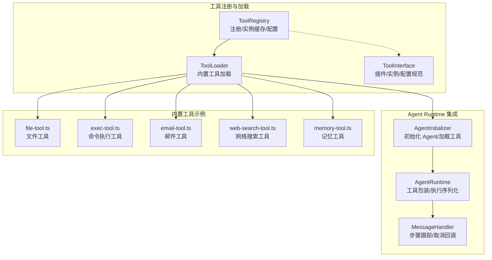
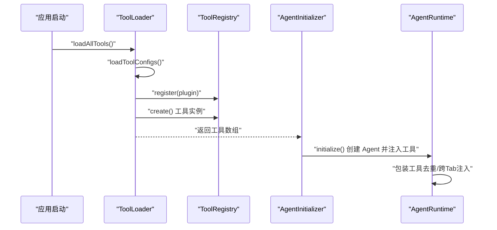
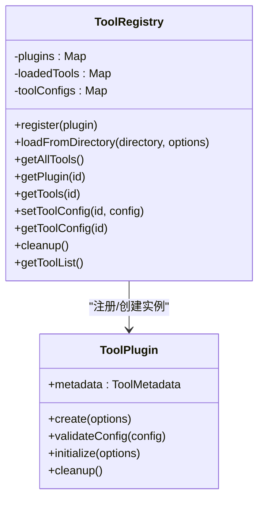
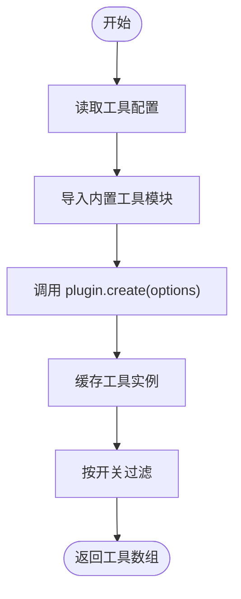
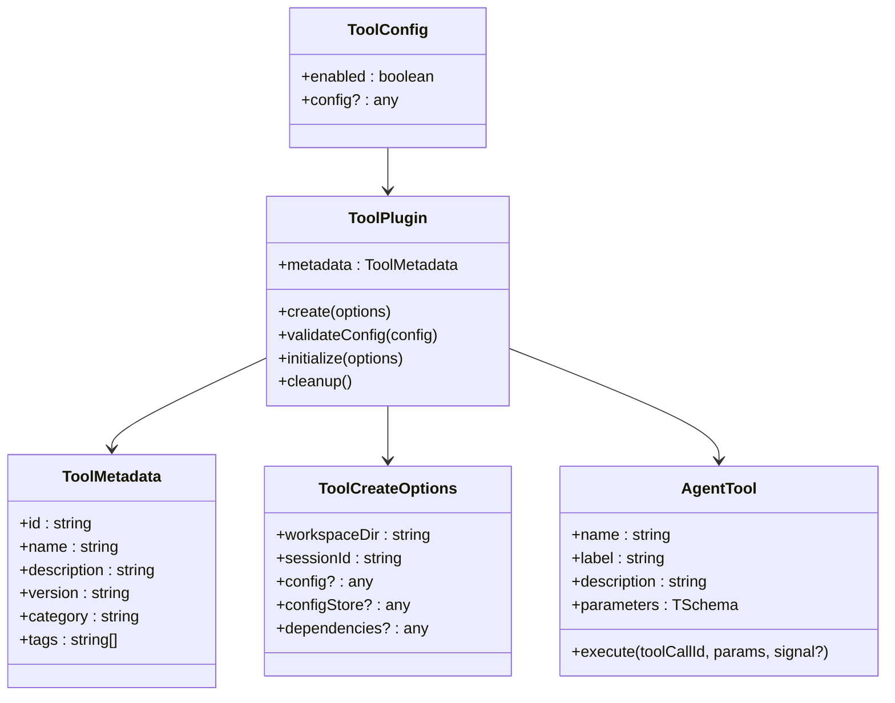
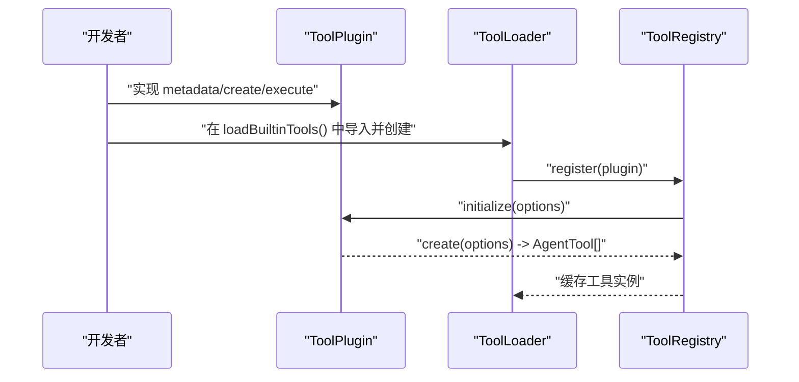
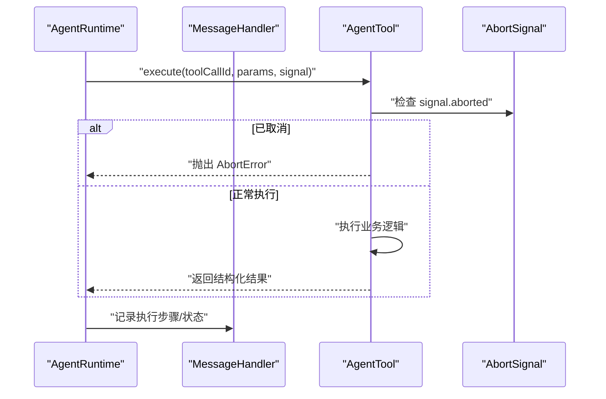
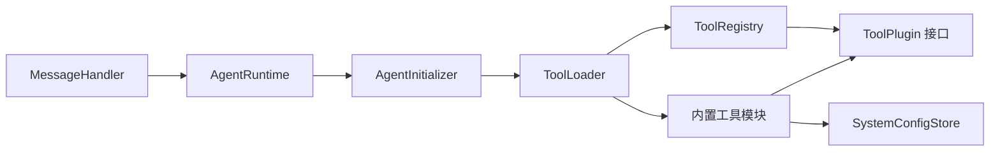

# 工具系统架构

<cite>
**本文引用的文件**
- [tool-registry.ts](file://src/main/tools/registry/tool-registry.ts)
- [tool-loader.ts](file://src/main/tools/registry/tool-loader.ts)
- [tool-interface.ts](file://src/main/tools/registry/tool-interface.ts)
- [example-tool.ts](file://src/main/tools/registry/example-tool.ts)
- [README.md](file://src/main/tools/registry/README.md)
- [index.ts](file://src/main/tools/registry/index.ts)
- [agent-initializer.ts](file://src/main/agent-runtime/agent-initializer.ts)
- [agent-runtime.ts](file://src/main/agent-runtime/agent-runtime.ts)
- [message-handler.ts](file://src/main/agent-runtime/message-handler.ts)
- [tool-abort.ts](file://src/main/tools/tool-abort.ts)
- [file-tool.ts](file://src/main/tools/file-tool.ts)
- [exec-tool.ts](file://src/main/tools/exec-tool.ts)
- [email-tool.ts](file://src/main/tools/email-tool.ts)
- [web-search-tool.ts](file://src/main/tools/web-search-tool.ts)
- [memory-tool.ts](file://src/main/tools/memory-tool.ts)
- [tool-config.ts](file://src/main/database/tool-config.ts)
- [tool-names.ts](file://src/main/tools/tool-names.ts)
- [tools.ts](file://src/types/tools.ts)
</cite>

## 目录
1. [简介](#简介)
2. [项目结构](#项目结构)
3. [核心组件](#核心组件)
4. [架构总览](#架构总览)
5. [详细组件分析](#详细组件分析)
6. [依赖关系分析](#依赖关系分析)
7. [性能考量](#性能考量)
8. [故障排除指南](#故障排除指南)
9. [结论](#结论)
10. [附录](#附录)

## 简介
本文件面向 DeepBot 工具系统的架构文档，重点阐述工具注册表的设计理念、工具加载机制与插件化扩展架构；深入解析 ToolRegistry 类的实现细节，包括工具发现、加载、初始化流程；记录工具接口规范、配置管理与依赖注入机制；提供开发与注册自定义工具的实践路径；解释工具与 Agent Runtime 的集成方式及工具执行的安全机制；并给出性能优化建议与故障排除指南。

## 项目结构
DeepBot 的工具系统采用“内置工具 + 显式加载”的架构，所有工具代码位于 src/main/tools/ 目录，通过 ToolLoader 在启动阶段集中加载，并交由 Agent Runtime 使用。工具注册表 ToolRegistry 负责管理插件注册、工具实例缓存与配置管理；工具接口定义在 tool-interface.ts 中，提供统一的 ToolPlugin 规范；示例工具 example-tool.ts 展示了完整的开发模板；工具开发指南 README.md 提供了从零到一的开发流程与最佳实践。

**图表来源**
- [tool-registry.ts:36-310](file://src/main/tools/registry/tool-registry.ts#L36-L310)
- [tool-loader.ts:40-311](file://src/main/tools/registry/tool-loader.ts#L40-L311)
- [tool-interface.ts:101-134](file://src/main/tools/registry/tool-interface.ts#L101-L134)
- [agent-initializer.ts:17-79](file://src/main/agent-runtime/agent-initializer.ts#L17-L79)
- [agent-runtime.ts:193-229](file://src/main/agent-runtime/agent-runtime.ts#L193-L229)
- [message-handler.ts:37-82](file://src/main/agent-runtime/message-handler.ts#L37-L82)
- [file-tool.ts:193-200](file://src/main/tools/file-tool.ts#L193-L200)
- [exec-tool.ts:317-346](file://src/main/tools/exec-tool.ts#L317-L346)
- [email-tool.ts:153-200](file://src/main/tools/email-tool.ts#L153-L200)
- [web-search-tool.ts:1-200](file://src/main/tools/web-search-tool.ts#L1-L200)
- [memory-tool.ts:1-200](file://src/main/tools/memory-tool.ts#L1-L200)

**章节来源**
- [tool-registry.ts:1-328](file://src/main/tools/registry/tool-registry.ts#L1-L328)
- [tool-loader.ts:1-312](file://src/main/tools/registry/tool-loader.ts#L1-L312)
- [tool-interface.ts:1-152](file://src/main/tools/registry/tool-interface.ts#L1-L152)
- [README.md:1-436](file://src/main/tools/registry/README.md#L1-L436)

## 核心组件
- 工具注册表 ToolRegistry：负责工具插件注册、工具实例缓存、工具配置管理、工具列表导出与清理。
- 工具加载器 ToolLoader：集中加载内置工具，读取用户/工作区工具配置，组装 Agent 可用的工具数组。
- 工具接口 ToolInterface：定义 ToolPlugin、ToolMetadata、ToolCreateOptions、ToolConfig、ToolLoadResult 等规范。
- Agent 集成：AgentInitializer 负责创建 Agent 并注入工具；AgentRuntime 对工具进行包装（去重检测、跨 Tab 注入等）。
- 工具实现样例：file-tool、exec-tool、email-tool、web-search-tool、memory-tool 等，展示参数校验、安全检查、取消机制与配置读取。

**章节来源**
- [tool-registry.ts:36-310](file://src/main/tools/registry/tool-registry.ts#L36-L310)
- [tool-loader.ts:40-311](file://src/main/tools/registry/tool-loader.ts#L40-L311)
- [tool-interface.ts:101-152](file://src/main/tools/registry/tool-interface.ts#L101-L152)
- [agent-initializer.ts:42-79](file://src/main/agent-runtime/agent-initializer.ts#L42-L79)
- [agent-runtime.ts:193-229](file://src/main/agent-runtime/agent-runtime.ts#L193-L229)

## 架构总览
工具系统采用“显式导入 + 注册表管理 + Agent 注入”的三层架构：
- 设计理念：所有工具均为内置工具，代码集中管理，配置与依赖按需放置在用户目录，确保可维护性与安全性。
- 工具加载流程：ToolLoader 在启动时读取工具配置，显式导入并创建各内置工具实例，注册到 ToolRegistry，最终返回给 AgentInitializer 注入 Agent。
- 插件化扩展：新增工具只需实现 ToolPlugin 接口并在 ToolLoader 的 loadBuiltinTools 中导入与创建即可。

**图表来源**
- [tool-loader.ts:57-71](file://src/main/tools/registry/tool-loader.ts#L57-L71)
- [tool-loader.ts:109-301](file://src/main/tools/registry/tool-loader.ts#L109-L301)
- [tool-registry.ts:46-55](file://src/main/tools/registry/tool-registry.ts#L46-L55)
- [tool-registry.ts:172-184](file://src/main/tools/registry/tool-registry.ts#L172-L184)
- [agent-initializer.ts:42-71](file://src/main/agent-runtime/agent-initializer.ts#L42-L71)
- [agent-runtime.ts:193-229](file://src/main/agent-runtime/agent-runtime.ts#L193-L229)

## 详细组件分析

### ToolRegistry：工具注册与生命周期管理
- 职责
  - 插件注册：register(plugin)，覆盖同名插件并记录日志。
  - 工具加载：loadFromDirectory()（历史遗留，当前不使用），loadToolFromPath() 动态导入、校验、初始化、创建实例并缓存。
  - 工具查询：getAllTools()/getPlugin()/getTools()。
  - 配置管理：setToolConfig()/getToolConfig()/getToolList()。
  - 生命周期：cleanup() 调用插件 cleanup 并清空缓存。
- 关键点
  - 支持插件 initialize()/cleanup() 生命周期钩子。
  - 工具配置支持启用/禁用与动态配置注入。
  - 提供 UI 友好的工具列表导出。

**图表来源**
- [tool-registry.ts:36-310](file://src/main/tools/registry/tool-registry.ts#L36-L310)
- [tool-interface.ts:101-134](file://src/main/tools/registry/tool-interface.ts#L101-L134)

**章节来源**
- [tool-registry.ts:36-310](file://src/main/tools/registry/tool-registry.ts#L36-L310)

### ToolLoader：内置工具加载与配置注入
- 职责
  - 读取用户/工作区工具配置（tools-config.json），注入 ToolRegistry。
  - 显式导入并创建内置工具（文件、执行、浏览器、日历、技能、定时任务、环境检查、图片生成、网络搜索、Web 获取、记忆、聊天、API、连接器、跨 Tab 调用、系统指令、飞书文档等）。
  - 按工具开关过滤（如 ENABLED/DISABLED），支持 Promise 返回的异步创建。
- 关键点
  - 配置优先级：工作区 > 用户目录。
  - 工具创建选项 ToolCreateOptions 提供 workspaceDir、sessionId、config、configStore、dependencies 等。

**图表来源**
- [tool-loader.ts:57-71](file://src/main/tools/registry/tool-loader.ts#L57-L71)
- [tool-loader.ts:77-99](file://src/main/tools/registry/tool-loader.ts#L77-L99)
- [tool-loader.ts:109-301](file://src/main/tools/registry/tool-loader.ts#L109-L301)

**章节来源**
- [tool-loader.ts:40-311](file://src/main/tools/registry/tool-loader.ts#L40-L311)

### 工具接口规范与类型系统
- ToolPlugin：统一的插件接口，包含 metadata、create、validateConfig、initialize、cleanup。
- ToolMetadata：工具元数据，含 id/name/description/version/author/category/tags 等。
- ToolCreateOptions：工具创建时的上下文参数，包含 workspaceDir、sessionId、config、configStore、dependencies。
- ToolConfig：工具启用与配置项。
- AgentTool：工具实例，包含 name/label/description/parameters/execute，execute 支持 AbortSignal。

**图表来源**
- [tool-interface.ts:33-134](file://src/main/tools/registry/tool-interface.ts#L33-L134)

**章节来源**
- [tool-interface.ts:1-152](file://src/main/tools/registry/tool-interface.ts#L1-L152)
- [tools.ts:10-26](file://src/types/tools.ts#L10-L26)

### 示例工具：开发与注册模板
- example-tool.ts 展示了：
  - 使用 TypeBox 定义参数 Schema。
  - 实现 ToolPlugin 的 metadata 与 create。
  - execute 中支持 AbortSignal、参数校验、错误处理与结构化返回。
  - 可选的 validateConfig、initialize、cleanup。
- 开发步骤（来自 README）：
  - 在 src/main/tools/ 创建工具文件（如 my-tool.ts）。
  - 实现 ToolPlugin 接口。
  - 在 tool-loader.ts 的 loadBuiltinTools() 中导入并加载。
  - 如需配置，在工具执行时从用户目录读取配置文件。
  - 如需外部依赖，使用动态 require 加载。

**图表来源**
- [example-tool.ts:73-211](file://src/main/tools/registry/example-tool.ts#L73-L211)
- [README.md:25-138](file://src/main/tools/registry/README.md#L25-L138)
- [tool-loader.ts:109-301](file://src/main/tools/registry/tool-loader.ts#L109-L301)
- [tool-registry.ts:168-184](file://src/main/tools/registry/tool-registry.ts#L168-L184)

**章节来源**
- [example-tool.ts:1-211](file://src/main/tools/registry/example-tool.ts#L1-L211)
- [README.md:1-436](file://src/main/tools/registry/README.md#L1-L436)

### Agent Runtime 集成与工具执行安全机制
- 集成流程
  - AgentInitializer.initialize() 创建 Agent 并注入工具。
  - AgentRuntime.initialize() 包装工具：重复调用检测、跨 Tab 名称注入、串行执行策略。
- 安全机制
  - 文件工具：路径白名单/黑名单检查、参数规范化、读取结果优化。
  - 命令执行：危险命令拦截、路径安全检查、超时控制、输出截断。
  - 取消机制：AbortSignal 支持，统一抛出 AbortError，MessageHandler 跟踪步骤与取消回调。
- 配置管理
  - 工具配置（如图片生成、Web 搜索）通过 SystemConfigStore 读取，工具执行时动态读取。
  - 工具开关与用户配置（tools-config.json）通过 ToolLoader 注入 ToolRegistry。

**图表来源**
- [agent-runtime.ts:193-229](file://src/main/agent-runtime/agent-runtime.ts#L193-L229)
- [message-handler.ts:37-82](file://src/main/agent-runtime/message-handler.ts#L37-L82)
- [tool-abort.ts:31-45](file://src/main/tools/tool-abort.ts#L31-L45)
- [file-tool.ts:148-177](file://src/main/tools/file-tool.ts#L148-L177)
- [exec-tool.ts:317-346](file://src/main/tools/exec-tool.ts#L317-L346)

**章节来源**
- [agent-initializer.ts:42-79](file://src/main/agent-runtime/agent-initializer.ts#L42-L79)
- [agent-runtime.ts:193-229](file://src/main/agent-runtime/agent-runtime.ts#L193-L229)
- [message-handler.ts:37-82](file://src/main/agent-runtime/message-handler.ts#L37-L82)
- [tool-abort.ts:1-45](file://src/main/tools/tool-abort.ts#L1-L45)
- [file-tool.ts:1-200](file://src/main/tools/file-tool.ts#L1-L200)
- [exec-tool.ts:1-200](file://src/main/tools/exec-tool.ts#L1-L200)

### 典型工具实现与最佳实践
- 文件工具（file-tool.ts）
  - 使用 pi-coding-agent 工具封装，添加路径安全检查与参数规范化。
  - 读取结果优化：对图片文件移除 base64 数据，对空文件给出明确提示。
- 命令执行工具（exec-tool.ts）
  - 危险命令黑名单与正则匹配，严格路径安全检查，动态环境变量注入，统一超时控制。
- 邮件工具（email-tool.ts）
  - 配置文件优先级：工作区 > 用户目录；动态加载 nodemailer；支持 HTML/附件/抄送/密送。
- 网络搜索工具（web-search-tool.ts）
  - 从 SystemConfigStore 读取配置；支持 AbortSignal；HTTPS 请求代理；超时控制。
- 记忆工具（memory-tool.ts）
  - 记忆文件模板与目录管理；支持主记忆与 Tab 独立记忆；与 Gateway 实例集成。

**章节来源**
- [file-tool.ts:1-200](file://src/main/tools/file-tool.ts#L1-L200)
- [exec-tool.ts:1-200](file://src/main/tools/exec-tool.ts#L1-L200)
- [email-tool.ts:1-200](file://src/main/tools/email-tool.ts#L1-L200)
- [web-search-tool.ts:1-200](file://src/main/tools/web-search-tool.ts#L1-L200)
- [memory-tool.ts:1-200](file://src/main/tools/memory-tool.ts#L1-L200)

## 依赖关系分析
- 模块耦合
  - ToolLoader 依赖 ToolRegistry 与工具模块；ToolRegistry 仅依赖 ToolPlugin 接口与错误处理工具。
  - AgentInitializer/AgentRuntime 依赖 ToolLoader 与 MessageHandler。
  - 工具实现依赖工具接口、配置存储与安全工具。
- 外部依赖
  - @mariozechner/pi-agent-core：AgentTool 类型与 Agent 实例。
  - @sinclair/typebox：参数 Schema 定义。
  - nodemailer：邮件工具外部依赖。
  - node:fs、node:path、node:http/https：系统与网络能力。
- 循环依赖
  - 未见直接循环依赖；工具与 Agent 的交互通过接口与回调解耦。

**图表来源**
- [tool-loader.ts:12-35](file://src/main/tools/registry/tool-loader.ts#L12-L35)
- [tool-registry.ts:30-31](file://src/main/tools/registry/tool-registry.ts#L30-L31)
- [agent-initializer.ts:9-12](file://src/main/agent-runtime/agent-initializer.ts#L9-L12)
- [agent-runtime.ts:193-229](file://src/main/agent-runtime/agent-runtime.ts#L193-L229)
- [message-handler.ts:37-82](file://src/main/agent-runtime/message-handler.ts#L37-L82)

**章节来源**
- [tool-loader.ts:1-312](file://src/main/tools/registry/tool-loader.ts#L1-L312)
- [tool-registry.ts:1-328](file://src/main/tools/registry/tool-registry.ts#L1-L328)
- [agent-initializer.ts:1-188](file://src/main/agent-runtime/agent-initializer.ts#L1-L188)
- [agent-runtime.ts:1-229](file://src/main/agent-runtime/agent-runtime.ts#L1-L229)
- [message-handler.ts:1-82](file://src/main/agent-runtime/message-handler.ts#L1-L82)

## 性能考量
- 工具加载
  - 显式导入与集中创建，避免动态 require 的性能波动；按需过滤工具开关，减少不必要的初始化。
- 工具执行
  - 串行执行策略降低并发冲突风险；对长耗时工具使用 AbortSignal 与超时控制。
  - 文件读取优化：对图片移除 base64 数据，避免向 LLM 传递大体量数据。
  - 命令执行：严格路径检查与超时控制，防止阻塞与资源滥用。
- 配置与缓存
  - 工具配置与工具实例缓存于 ToolRegistry，避免重复创建与 IO。
  - 工具开关与用户配置提前加载，减少运行时判断成本。

[本节为通用指导，无需具体文件分析]

## 故障排除指南
- 工具未加载
  - 检查是否在 ToolLoader 的 loadBuiltinTools() 中导入与创建。
  - 检查插件导出命名（如 myToolPlugin）与 ToolRegistry.register() 是否被调用。
  - 查看控制台日志与类型检查（pnpm run type-check）。
- 工具执行失败
  - 检查参数 Schema 与 execute 返回结构。
  - 使用 getErrorMessage() 统一错误处理，确保返回包含 details/isError。
- 配置文件未找到
  - 确认配置文件路径与 JSON 格式；提供友好的错误提示引导用户创建。
- 外部依赖加载失败
  - 确认依赖已安装至 ~/.deepbot/tools/<tool-name>/node_modules/。
  - 提供安装命令提示或自动安装脚本。
- 命令执行被拦截
  - 检查危险命令黑名单与路径白名单；必要时调整 PATH 或使用受控环境变量。
- 文件访问异常
  - 检查路径安全策略与参数规范化；确保工作区目录存在。

**章节来源**
- [README.md:397-424](file://src/main/tools/registry/README.md#L397-L424)
- [file-tool.ts:148-177](file://src/main/tools/file-tool.ts#L148-L177)
- [exec-tool.ts:317-346](file://src/main/tools/exec-tool.ts#L317-L346)
- [email-tool.ts:76-129](file://src/main/tools/email-tool.ts#L76-L129)

## 结论
DeepBot 的工具系统通过“内置工具 + 显式加载 + 注册表管理”的架构实现了高内聚、低耦合与强安全性的扩展能力。ToolRegistry 与 ToolLoader 提供了清晰的工具生命周期管理，Agent Runtime 的工具包装与取消机制保障了执行稳定性与可观测性。开发者可基于 ToolPlugin 接口快速扩展工具，配合配置与安全策略实现稳定可靠的自动化能力。

[本节为总结，无需具体文件分析]

## 附录
- 工具开发最佳实践
  - 使用 TypeScript 与 TypeBox Schema；提供详细描述帮助 AI 理解工具用途。
  - 支持 AbortSignal；统一错误处理；记录关键日志。
  - 配置文件置于用户目录；外部依赖使用动态加载；避免硬编码超时与开关。
  - 使用 TOOL_NAMES 常量与 TIMEOUTS 常量，保持一致性。
- 工具分类
  - file、network、system、ai、custom 等分类便于 UI 展示与管理。
- 相关文件索引
  - 工具注册表模块导出：index.ts
  - 工具配置管理：tool-config.ts
  - 工具名称常量：tool-names.ts
  - 工具类型定义：tools.ts

**章节来源**
- [index.ts:1-8](file://src/main/tools/registry/index.ts#L1-L8)
- [tool-config.ts:1-128](file://src/main/database/tool-config.ts#L1-L128)
- [tool-names.ts:1-106](file://src/main/tools/tool-names.ts#L1-L106)
- [tools.ts:1-26](file://src/types/tools.ts#L1-L26)