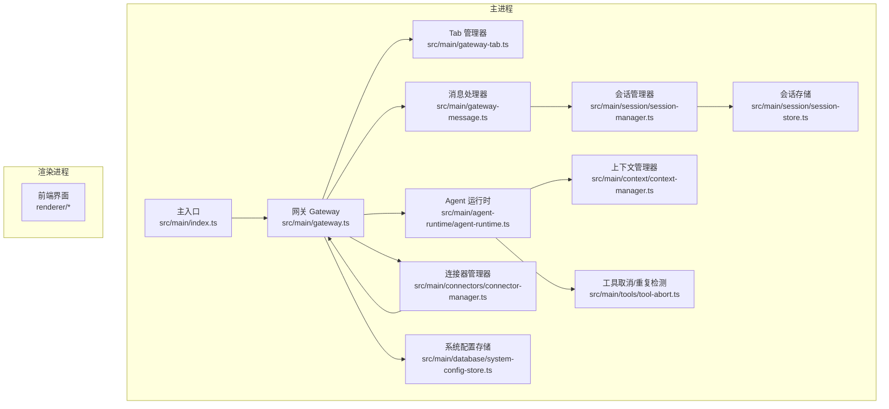
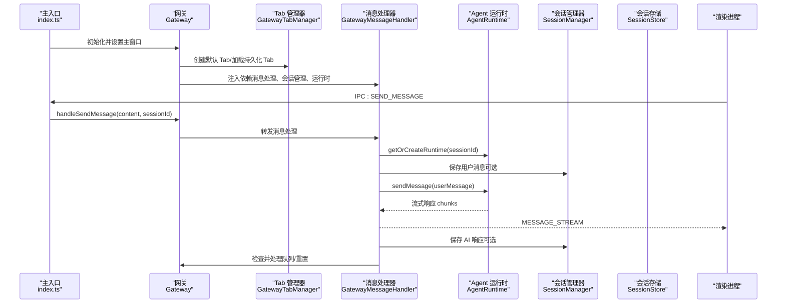
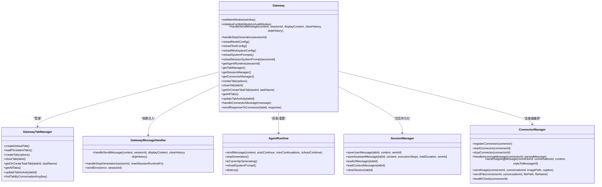
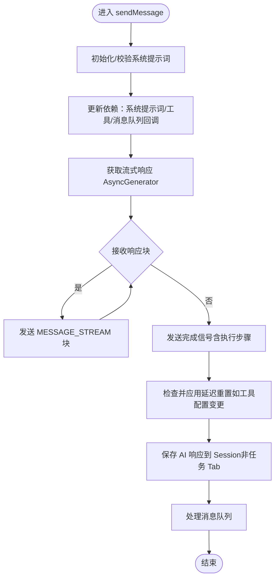
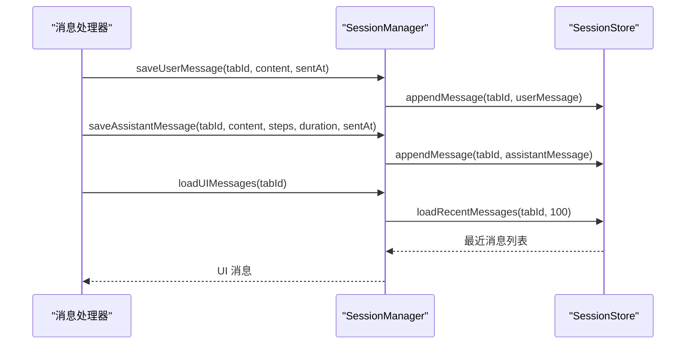
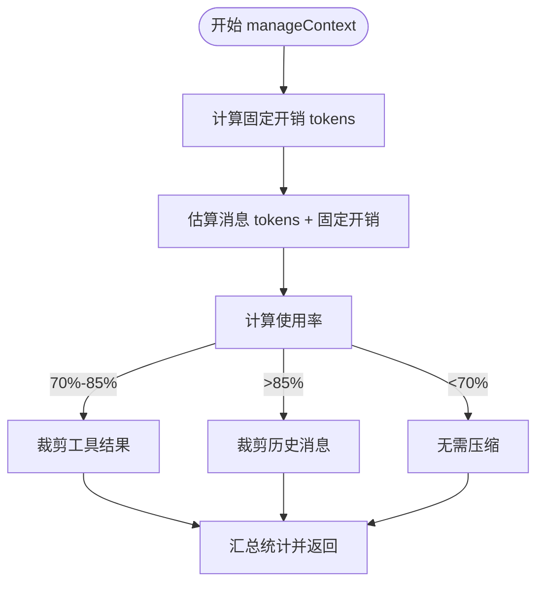
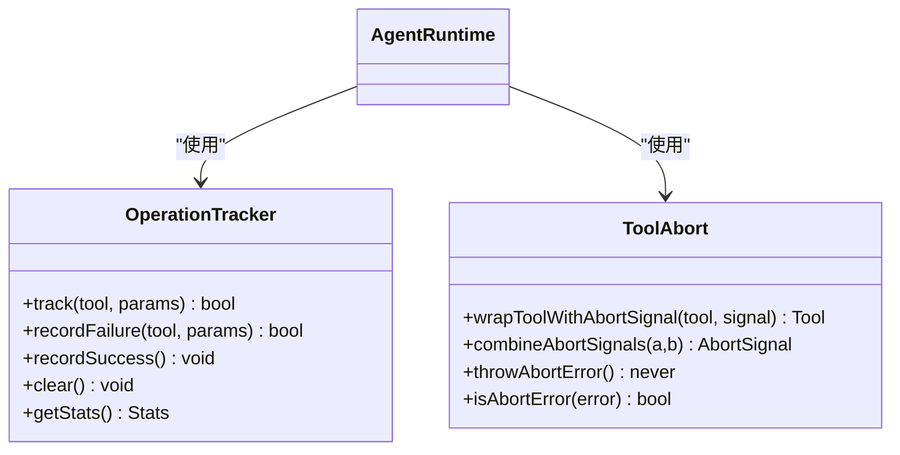
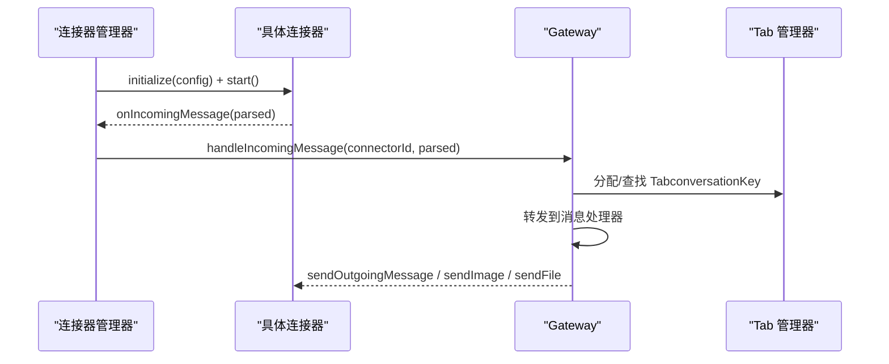
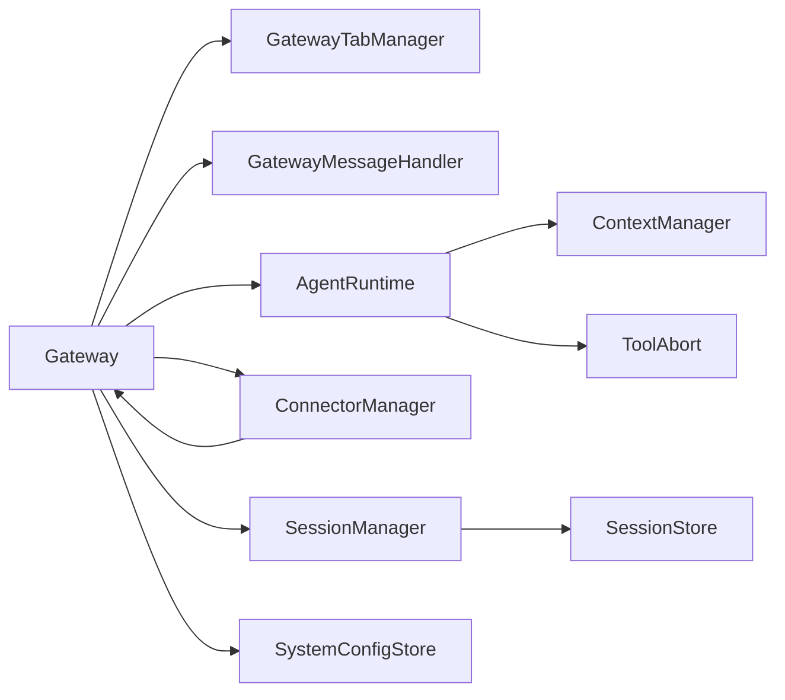

# 核心模块详解

<cite>
**本文档引用的文件**
- [src/main/index.ts](file://src/main/index.ts)
- [src/main/gateway.ts](file://src/main/gateway.ts)
- [src/main/agent-runtime/agent-runtime.ts](file://src/main/agent-runtime/agent-runtime.ts)
- [src/main/session/session-manager.ts](file://src/main/session/session-manager.ts)
- [src/main/session/session-store.ts](file://src/main/session/session-store.ts)
- [src/main/gateway-tab.ts](file://src/main/gateway-tab.ts)
- [src/main/gateway-message.ts](file://src/main/gateway-message.ts)
- [src/main/tools/tool-abort.ts](file://src/main/tools/tool-abort.ts)
- [src/main/context/context-manager.ts](file://src/main/context/context-manager.ts)
- [src/main/database/system-config-store.ts](file://src/main/database/system-config-store.ts)
- [src/main/connectors/connector-manager.ts](file://src/main/connectors/connector-manager.ts)
- [src/main/config.ts](file://src/main/config.ts)
- [src/main/tools/api-tool.ts](file://src/main/tools/api-tool.ts)
</cite>

## 目录
1. [简介](#简介)
2. [项目结构](#项目结构)
3. [核心组件](#核心组件)
4. [架构总览](#架构总览)
5. [详细组件分析](#详细组件分析)
6. [依赖分析](#依赖分析)
7. [性能考虑](#性能考虑)
8. [故障排除指南](#故障排除指南)
9. [结论](#结论)

## 简介
本文件面向 DeepBot 核心模块，系统性梳理主进程入口、网关（Gateway）、Agent 运行时、会话管理、上下文压缩、工具取消与重复检测、连接器管理等关键子系统。文档以“代码级”视角呈现模块职责、调用关系、接口契约与领域模型，并提供流程图与时序图帮助理解。同时给出配置项、参数与返回值说明、常见问题与解决方案，兼顾初学者与资深开发者。

## 项目结构
DeepBot 采用主进程-渲染进程分层架构，核心逻辑集中在主进程的网关与运行时模块，配合会话持久化、上下文压缩、工具安全机制与连接器生态，形成完整的对话与任务执行闭环。

**图表来源**
- [src/main/index.ts:1-800](file://src/main/index.ts#L1-L800)
- [src/main/gateway.ts:1-772](file://src/main/gateway.ts#L1-L772)
- [src/main/agent-runtime/agent-runtime.ts:1-800](file://src/main/agent-runtime/agent-runtime.ts#L1-L800)
- [src/main/session/session-manager.ts:1-195](file://src/main/session/session-manager.ts#L1-L195)
- [src/main/session/session-store.ts:1-323](file://src/main/session/session-store.ts#L1-L323)
- [src/main/gateway-tab.ts:1-796](file://src/main/gateway-tab.ts#L1-L796)
- [src/main/gateway-message.ts:1-525](file://src/main/gateway-message.ts#L1-L525)
- [src/main/connectors/connector-manager.ts:1-379](file://src/main/connectors/connector-manager.ts#L1-L379)
- [src/main/database/system-config-store.ts:1-576](file://src/main/database/system-config-store.ts#L1-L576)
- [src/main/context/context-manager.ts:1-366](file://src/main/context/context-manager.ts#L1-L366)
- [src/main/tools/tool-abort.ts:1-427](file://src/main/tools/tool-abort.ts#L1-L427)

**章节来源**
- [src/main/index.ts:1-800](file://src/main/index.ts#L1-L800)
- [src/main/gateway.ts:1-772](file://src/main/gateway.ts#L1-L772)

## 核心组件
- 主入口与生命周期：负责窗口创建、系统托盘、IPC 注册、Gateway 初始化与实例注入。
- 网关（Gateway）：统一调度会话、消息路由、运行时生命周期、连接器与 Tab 管理、配置重载。
- Agent 运行时（AgentRuntime）：封装 pi-agent-core，协调初始化、工具包装、上下文加载、消息流式输出、状态恢复。
- 会话管理（SessionManager/SessionStore）：JSONL 持久化、UI/上下文双通道加载、消息计数与清理。
- Tab 管理（GatewayTabManager）：Tab 生命周期、持久化、欢迎消息、历史加载、标题更新。
- 消息处理（GatewayMessageHandler）：命令预处理、队列与并发控制、流式响应、错误恢复、连接器回传。
- 上下文管理（ContextManager）：系统提示词与工具定义固定开销估算、工具结果裁剪、历史消息裁剪。
- 工具安全（ToolAbort/OperationTracker）：AbortSignal 合并、重复操作检测、连续失败阈值与自动停止。
- 连接器管理（ConnectorManager）：连接器注册、启停、外部消息转发、图片/文件发送、健康检查。
- 系统配置（SystemConfigStore）：SQLite 持久化，模型、工作目录、工具、连接器、Tab 等配置。

**章节来源**
- [src/main/gateway.ts:1-772](file://src/main/gateway.ts#L1-L772)
- [src/main/agent-runtime/agent-runtime.ts:1-800](file://src/main/agent-runtime/agent-runtime.ts#L1-L800)
- [src/main/session/session-manager.ts:1-195](file://src/main/session/session-manager.ts#L1-L195)
- [src/main/session/session-store.ts:1-323](file://src/main/session/session-store.ts#L1-L323)
- [src/main/gateway-tab.ts:1-796](file://src/main/gateway-tab.ts#L1-L796)
- [src/main/gateway-message.ts:1-525](file://src/main/gateway-message.ts#L1-L525)
- [src/main/context/context-manager.ts:1-366](file://src/main/context/context-manager.ts#L1-L366)
- [src/main/tools/tool-abort.ts:1-427](file://src/main/tools/tool-abort.ts#L1-L427)
- [src/main/connectors/connector-manager.ts:1-379](file://src/main/connectors/connector-manager.ts#L1-L379)
- [src/main/database/system-config-store.ts:1-576](file://src/main/database/system-config-store.ts#L1-L576)

## 架构总览
下图展示从主入口到渲染进程的关键交互路径，以及 Gateway 作为中枢的调度作用。

**图表来源**
- [src/main/index.ts:336-421](file://src/main/index.ts#L336-L421)
- [src/main/gateway.ts:455-466](file://src/main/gateway.ts#L455-L466)
- [src/main/gateway-message.ts:76-160](file://src/main/gateway-message.ts#L76-L160)
- [src/main/agent-runtime/agent-runtime.ts:661-688](file://src/main/agent-runtime/agent-runtime.ts#L661-L688)
- [src/main/session/session-manager.ts:38-85](file://src/main/session/session-manager.ts#L38-L85)

## 详细组件分析

### 网关（Gateway）组件
- 职责
  - 管理会话生命周期与消息路由
  - 管理多个 AgentRuntime 实例（每 Tab 一个）
  - 统一处理 Skill 管理、定时任务、环境检查、工作目录与模型配置重载
  - 管理连接器与消息处理器依赖注入
- 关键接口
  - handleSendMessage/content, handleStopGeneration/sessionId
  - reloadModelConfig/reloadToolConfig/reloadWorkspaceConfig/reloadSystemPrompts
  - getAgentRuntime(sessionId?), getTabManager/getSessionManager/getConnectorManager
  - createTab/closeTab/getOrCreateTaskTab/getAllTabs/updateTabActivity
  - handleConnectorMessage/sendResponseToConnector
- 依赖关系
  - 依赖 SystemConfigStore 获取工作目录与模型配置
  - 依赖 SessionManager/SessionStore 进行消息持久化
  - 依赖 AgentRuntime 执行推理与工具调用
  - 依赖 ConnectorManager 处理外部消息与回传

**图表来源**
- [src/main/gateway.ts:29-748](file://src/main/gateway.ts#L29-L748)
- [src/main/gateway-tab.ts:26-795](file://src/main/gateway-tab.ts#L26-L795)
- [src/main/gateway-message.ts:31-524](file://src/main/gateway-message.ts#L31-L524)
- [src/main/agent-runtime/agent-runtime.ts:27-800](file://src/main/agent-runtime/agent-runtime.ts#L27-L800)
- [src/main/session/session-manager.ts:17-194](file://src/main/session/session-manager.ts#L17-L194)
- [src/main/connectors/connector-manager.ts:21-378](file://src/main/connectors/connector-manager.ts#L21-L378)

**章节来源**
- [src/main/gateway.ts:1-772](file://src/main/gateway.ts#L1-L772)

### Agent 运行时（AgentRuntime）组件
- 职责
  - 依据配置创建/重建 Agent 实例
  - 包装工具：重复检测、跨 Tab 名称注入、AbortSignal 合并
  - 加载历史消息到上下文并进行压缩
  - 流式输出响应，维护执行步骤与任务计划
  - 提供停止生成、重置、销毁等生命周期控制
- 关键流程
  - 初始化：AgentInitializer + MessageHandler + StepTracker + AgentMessageProcessor
  - 历史加载：SessionManager.loadContextMessages → convert → manageContext
  - 消息发送：sendMessage → AgentMessageProcessor.sendMessage → 流式返回
  - 状态恢复：stopGeneration → 重新创建 Agent 实例

**图表来源**
- [src/main/agent-runtime/agent-runtime.ts:661-688](file://src/main/agent-runtime/agent-runtime.ts#L661-L688)
- [src/main/gateway-message.ts:416-473](file://src/main/gateway-message.ts#L416-L473)

**章节来源**
- [src/main/agent-runtime/agent-runtime.ts:1-800](file://src/main/agent-runtime/agent-runtime.ts#L1-L800)

### 会话管理（SessionManager/SessionStore）
- 职责
  - SessionStore：JSONL 文件持久化，支持最近 N 轮消息倒序读取、消息计数
  - SessionManager：封装 UI/上下文两套加载策略，提供消息保存与清理
- 性能特性
  - loadRecentMessages/loadContextMessages 采用倒序读取，避免全量解析
  - 通过消息计数与文件大小接口支持容量监控

**图表来源**
- [src/main/session/session-manager.ts:38-151](file://src/main/session/session-manager.ts#L38-L151)
- [src/main/session/session-store.ts:75-165](file://src/main/session/session-store.ts#L75-L165)

**章节来源**
- [src/main/session/session-manager.ts:1-195](file://src/main/session/session-manager.ts#L1-L195)
- [src/main/session/session-store.ts:1-323](file://src/main/session/session-store.ts#L1-L323)

### 上下文管理（ContextManager）
- 职责
  - 统一上下文压缩入口：估算固定开销（系统提示词+工具定义）+消息 tokens
  - 两阶段压缩：工具结果软裁剪（70%~85%）→ 历史消息硬裁剪（>85%）
  - 输出压缩统计与是否压缩标识
- 配置
  - enabled、pruning（softTrimRatio/hardClearRatio）、compaction（maxHistoryShare/reserveTokens）

**图表来源**
- [src/main/context/context-manager.ts:100-303](file://src/main/context/context-manager.ts#L100-L303)

**章节来源**
- [src/main/context/context-manager.ts:1-366](file://src/main/context/context-manager.ts#L1-L366)

### 工具取消与重复检测（ToolAbort/OperationTracker）
- 职责
  - ToolAbort：为工具 execute 添加 AbortSignal 支持，合并用户停止与工具自身信号
  - OperationTracker：重复操作检测（默认最多重复 2 次）、连续失败计数（默认 5 次）与自动停止
- 应用
  - AgentRuntime 初始化工具时统一包装，跨 Tab 调用注入 senderTabName

**图表来源**
- [src/main/tools/tool-abort.ts:149-426](file://src/main/tools/tool-abort.ts#L149-L426)
- [src/main/agent-runtime/agent-runtime.ts:203-213](file://src/main/agent-runtime/agent-runtime.ts#L203-L213)

**章节来源**
- [src/main/tools/tool-abort.ts:1-427](file://src/main/tools/tool-abort.ts#L1-L427)

### 连接器管理（ConnectorManager）
- 职责
  - 注册/启停连接器，加载配置并校验
  - 外部消息解析与转发至 Gateway
  - 发送文本/图片/文件到外部
  - 健康检查与配对批准通知
- 与 Gateway 的集成
  - Gateway 注册飞书连接器并注入实例
  - ConnectorManager 通过 Gateway 转发消息与回传响应

**图表来源**
- [src/main/connectors/connector-manager.ts:45-168](file://src/main/connectors/connector-manager.ts#L45-L168)
- [src/main/gateway.ts:72-98](file://src/main/gateway.ts#L72-L98)

**章节来源**
- [src/main/connectors/connector-manager.ts:1-379](file://src/main/connectors/connector-manager.ts#L1-L379)

### 系统配置存储（SystemConfigStore）
- 职责
  - SQLite 持久化：环境、工作目录、模型、工具、连接器、Tab、配对记录等
  - 提供统一的 CRUD 接口与数据库迁移
- 与 Gateway 的集成
  - Gateway 初始化 SessionManager 时读取工作目录
  - Gateway 重载工作目录配置时重新初始化 SessionManager

**章节来源**
- [src/main/database/system-config-store.ts:1-576](file://src/main/database/system-config-store.ts#L1-L576)
- [src/main/gateway.ts:129-147](file://src/main/gateway.ts#L129-L147)

### 主入口与 IPC（index.ts）
- 职责
  - 创建 BrowserWindow、系统托盘、菜单
  - 初始化 Gateway 并注入到各处理器
  - 注册 IPC 处理器：发送消息、停止生成、Skill 管理、定时任务、环境检查、工作目录配置读写、图片/文件上传等
- 关键 IPC
  - SEND_MESSAGE/STOP_GENERATION/SKILL_MANAGER/SCHEDULED_TASK/ENVIRONMENT_CHECK
  - GET_WORKSPACE_SETTINGS/GET_DEFAULT_WORKSPACE_SETTINGS/SAVE_WORKSPACE_SETTINGS
  - READ_IMAGE/UPLOAD_IMAGE/UPLOAD_FILE/DELETE_TEMP_FILE/OPEN_PATH/SELECT_FOLDER

**章节来源**
- [src/main/index.ts:336-770](file://src/main/index.ts#L336-L770)

## 依赖分析
- 模块耦合
  - Gateway 为核心中枢，高扇出依赖 Tab/Message/Connector/Runtime/Session/Config
  - AgentRuntime 依赖 Config/SystemConfigStore/ContextManager/ToolAbort
  - SessionManager/SessionStore 低耦合，仅通过路径约定交互
  - ConnectorManager 与 Gateway 双向协作，消息单向流入，回传双向
- 外部依赖
  - Electron 主进程 API（BrowserWindow、ipcMain、Menu、Tray、shell）
  - SQLite（持久化）
  - pi-agent-core（Agent 执行引擎）

**图表来源**
- [src/main/gateway.ts:1-772](file://src/main/gateway.ts#L1-L772)
- [src/main/agent-runtime/agent-runtime.ts:1-800](file://src/main/agent-runtime/agent-runtime.ts#L1-L800)
- [src/main/session/session-manager.ts:1-195](file://src/main/session/session-manager.ts#L1-L195)
- [src/main/session/session-store.ts:1-323](file://src/main/session/session-store.ts#L1-L323)
- [src/main/gateway-tab.ts:1-796](file://src/main/gateway-tab.ts#L1-L796)
- [src/main/gateway-message.ts:1-525](file://src/main/gateway-message.ts#L1-L525)
- [src/main/connectors/connector-manager.ts:1-379](file://src/main/connectors/connector-manager.ts#L1-L379)
- [src/main/context/context-manager.ts:1-366](file://src/main/context/context-manager.ts#L1-L366)
- [src/main/tools/tool-abort.ts:1-427](file://src/main/tools/tool-abort.ts#L1-L427)
- [src/main/database/system-config-store.ts:1-576](file://src/main/database/system-config-store.ts#L1-L576)

**章节来源**
- [src/main/gateway.ts:1-772](file://src/main/gateway.ts#L1-L772)

## 性能考虑
- IO 优化
  - SessionStore.loadRecentMessages/loadContextMessages 采用倒序读取，减少内存占用与解析成本
  - SessionStore.getMessageCount 仅统计行数，避免 JSON 解析
- 上下文压缩
  - ContextManager 分阶段压缩，先裁剪工具结果，再裁剪历史，降低 tokens 使用率
- 并发与队列
  - MessageHandler 对普通 Tab 使用队列串行化，定时任务 Tab 等待上一次执行完成
- 缓存与重用
  - AgentRuntime 重用工具列表（带重复检测包装），避免重复初始化
  - Gateway 重置运行时采用延迟策略，避免中断正在进行的任务

[本节为通用指导，无需特定文件引用]

## 故障排除指南
- 模型配置未设置
  - 现象：getConfig 抛出“模型未配置”
  - 处理：在系统设置中配置 AI 模型（API Key/Base URL/Model ID），或设置环境变量
  - 参考：[src/main/config.ts:38-83](file://src/main/config.ts#L38-L83)
- AI 连接错误（超时/网络）
  - 现象：消息处理捕获 AI 连接错误，尝试自动恢复（重置 Runtime、清理 AI 缓存）
  - 处理：检查网络、重新保存模型配置、必要时重启应用
  - 参考：[src/main/gateway-message.ts:246-283](file://src/main/gateway-message.ts#L246-L283)
- Agent 卡住（streaming 状态异常）
  - 现象：Agent 状态 isStreaming 残留或 MessageHandler 卡住
  - 处理：AgentRuntime.ensureAgentReady 中强制重置状态，必要时 stopGeneration + 重新创建实例
  - 参考：[src/main/agent-runtime/agent-runtime.ts:430-456](file://src/main/agent-runtime/agent-runtime.ts#L430-L456)
- 工具重复执行/连续失败
  - 现象：重复检测阻止、连续失败自动停止
  - 处理：调整工具参数或更换方法，避免重复操作
  - 参考：[src/main/tools/tool-abort.ts:149-426](file://src/main/tools/tool-abort.ts#L149-L426)
- 工作目录变更导致会话丢失
  - 现象：SessionManager 未初始化或找不到 session 文件
  - 处理：Gateway.reloadWorkspaceConfig 会重新初始化 SessionManager 并重置运行时
  - 参考：[src/main/gateway.ts:252-281](file://src/main/gateway.ts#L252-L281)
- 连接器未启用/配置无效
  - 现象：startConnector 抛出“配置不存在/无效”
  - 处理：在系统设置中启用并正确填写连接器配置
  - 参考：[src/main/connectors/connector-manager.ts:45-81](file://src/main/connectors/connector-manager.ts#L45-L81)

**章节来源**
- [src/main/config.ts:38-83](file://src/main/config.ts#L38-L83)
- [src/main/gateway-message.ts:246-283](file://src/main/gateway-message.ts#L246-L283)
- [src/main/agent-runtime/agent-runtime.ts:430-456](file://src/main/agent-runtime/agent-runtime.ts#L430-L456)
- [src/main/tools/tool-abort.ts:149-426](file://src/main/tools/tool-abort.ts#L149-L426)
- [src/main/gateway.ts:252-281](file://src/main/gateway.ts#L252-L281)
- [src/main/connectors/connector-manager.ts:45-81](file://src/main/connectors/connector-manager.ts#L45-L81)

## 结论
DeepBot 的核心以 Gateway 为中心，围绕会话、消息、运行时、上下文与连接器形成稳定闭环。通过工具安全机制、上下文压缩与队列化处理，系统在复杂任务场景下仍能保持可靠与高效。建议在生产环境中：
- 明确配置优先级（数据库 > 环境变量），并定期校验
- 合理设置上下文压缩阈值，平衡性能与上下文完整性
- 使用工具重复检测与连续失败阈值，提升稳定性
- 通过 ConnectorManager 的健康检查与配对记录，保障外部通讯质量

[本节为总结性内容，无需特定文件引用]