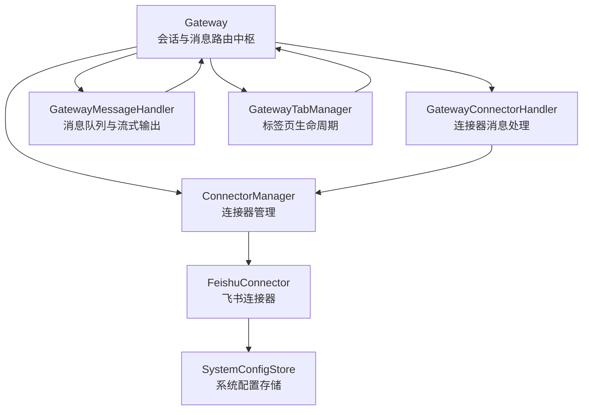
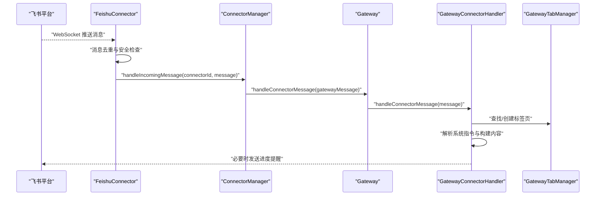
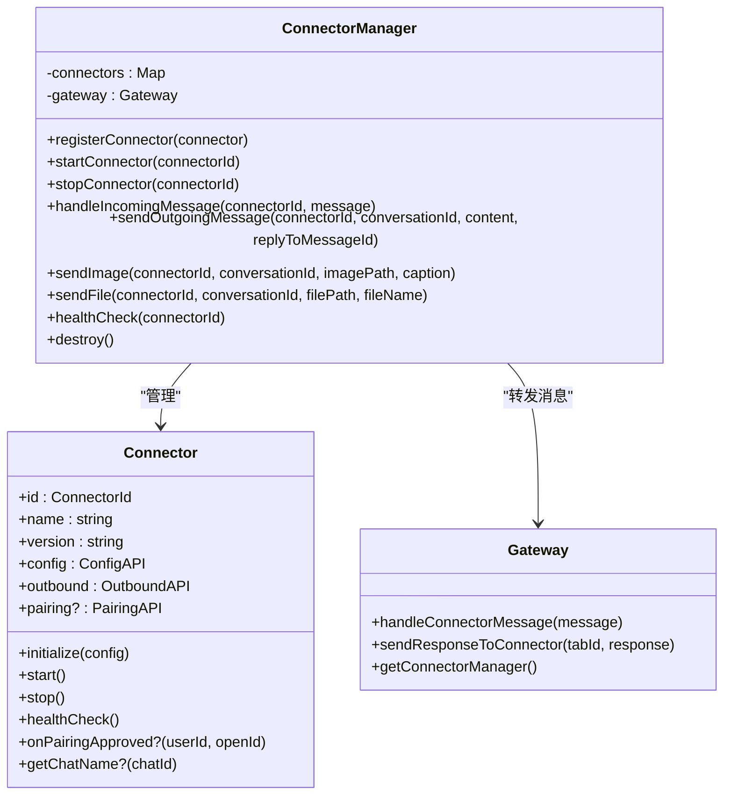
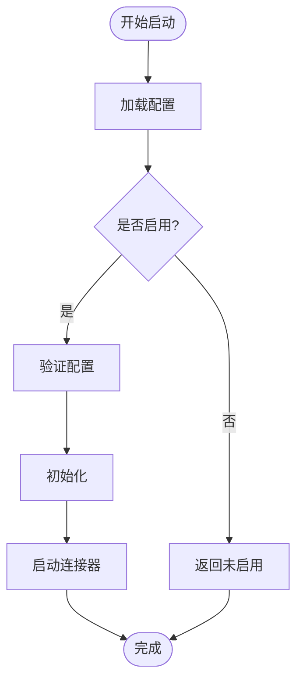
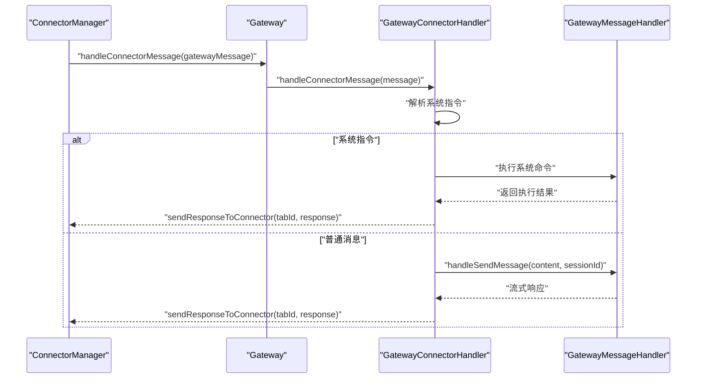
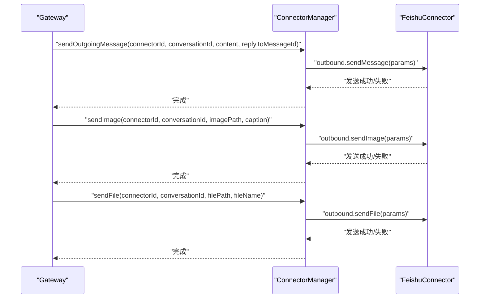
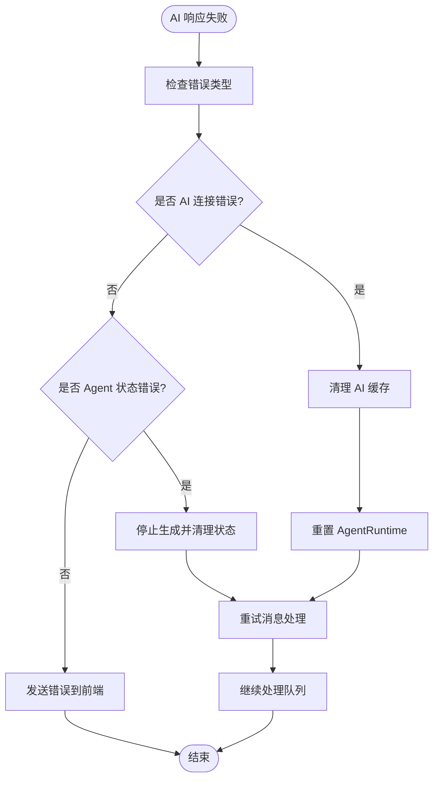
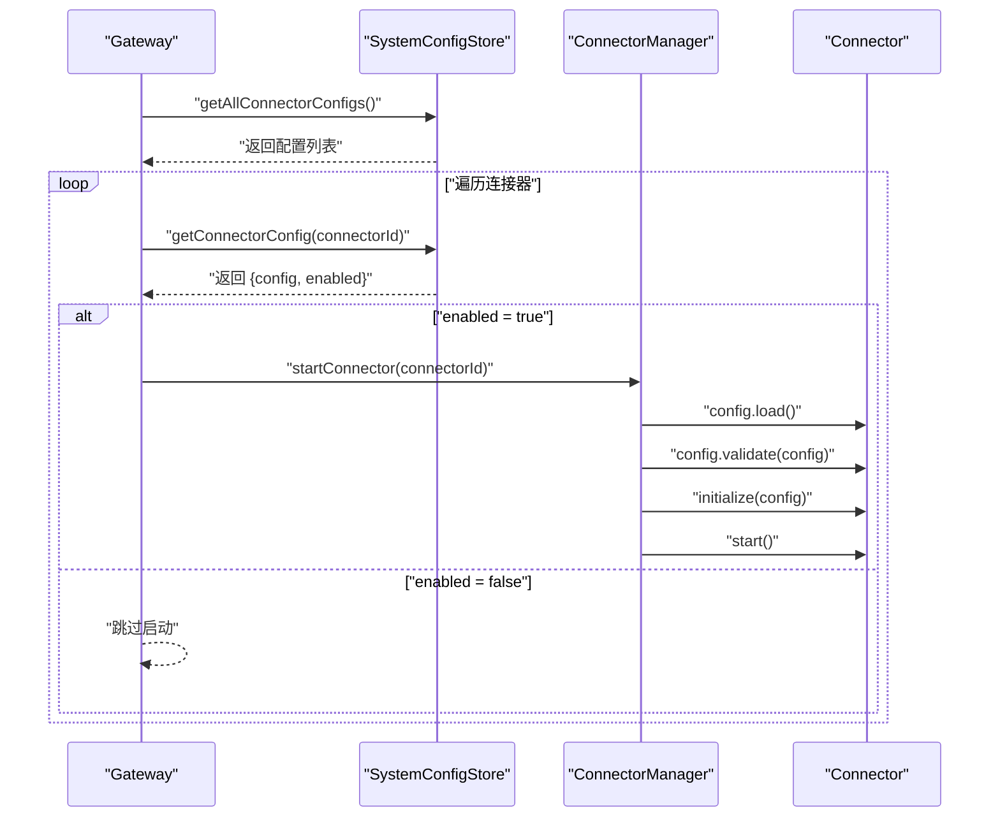
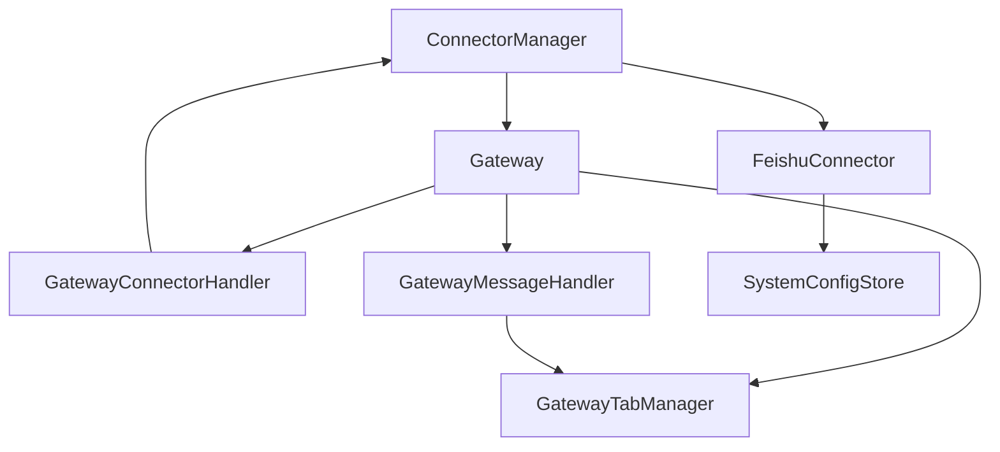

# 连接器管理器

<cite>
**本文档引用的文件**
- [connector-manager.ts](file://src/main/connectors/connector-manager.ts)
- [gateway.ts](file://src/main/gateway.ts)
- [gateway-connector.ts](file://src/main/gateway-connector.ts)
- [gateway-message.ts](file://src/main/gateway-message.ts)
- [gateway-tab.ts](file://src/main/gateway-tab.ts)
- [feishu-connector.ts](file://src/main/connectors/feishu/feishu-connector.ts)
- [document-handler.ts](file://src/main/connectors/feishu/document-handler.ts)
- [system-config-store.ts](file://src/main/database/system-config-store.ts)
- [connector-config.ts](file://src/main/database/connector-config.ts)
- [connector-handlers.ts](file://src/main/tools/handlers/connector-handlers.ts)
- [connector.ts](file://src/types/connector.ts)
</cite>

## 目录
1. [简介](#简介)
2. [项目结构](#项目结构)
3. [核心组件](#核心组件)
4. [架构概览](#架构概览)
5. [详细组件分析](#详细组件分析)
6. [依赖关系分析](#依赖关系分析)
7. [性能考虑](#性能考虑)
8. [故障排查指南](#故障排查指南)
9. [结论](#结论)
10. [附录](#附录)

## 简介
本文件为 史丽慧小助理 连接器管理器（ConnectorManager）的详细技术文档，重点阐述其核心架构设计与实现细节，包括：
- 连接器注册机制与生命周期管理
- 配置加载、验证与启动流程
- 消息路由处理机制（外部消息接收、转换为 Gateway 格式、转发到 Gateway）
- 消息发送功能（文本、图片、文件）
- 健康检查与错误恢复策略
- 使用示例与最佳实践

## 项目结构
连接器管理器位于主进程的连接器子系统中，与网关（Gateway）、消息处理器（GatewayMessageHandler）、标签页管理器（GatewayTabManager）以及数据库配置存储（SystemConfigStore）紧密协作。

**图表来源**
- [gateway.ts:33-138](file://src/main/gateway.ts#L33-L138)
- [connector-manager.ts:21-122](file://src/main/connectors/connector-manager.ts#L21-L122)
- [feishu-connector.ts:28-101](file://src/main/connectors/feishu/feishu-connector.ts#L28-L101)

**章节来源**
- [gateway.ts:33-138](file://src/main/gateway.ts#L33-L138)
- [connector-manager.ts:21-122](file://src/main/connectors/connector-manager.ts#L21-L122)

## 核心组件
- ConnectorManager：集中管理所有连接器实例，负责启动/停止、配置加载与验证、消息路由与发送、健康检查与销毁。
- Gateway：网关中枢，负责会话生命周期、消息路由、流式响应、连接器处理器与消息处理器的依赖注入与协调。
- GatewayConnectorHandler：处理来自连接器的消息，创建/更新标签页，解析系统指令，发送响应到连接器。
- GatewayMessageHandler：处理用户消息发送，管理消息队列，流式输出 AI 响应，错误处理与自动恢复。
- GatewayTabManager：管理标签页生命周期，持久化加载，欢迎消息与历史消息处理。
- FeishuConnector：飞书连接器实现，负责 WebSocket 长连接、消息去重、图片/文件下载、配对授权与安全检查。
- SystemConfigStore：系统配置存储，提供连接器配置、配对记录、工作目录等配置的持久化管理。

**章节来源**
- [connector-manager.ts:21-122](file://src/main/connectors/connector-manager.ts#L21-L122)
- [gateway.ts:33-138](file://src/main/gateway.ts#L33-L138)
- [gateway-connector.ts:44-88](file://src/main/gateway-connector.ts#L44-L88)
- [gateway-message.ts:31-64](file://src/main/gateway-message.ts#L31-L64)
- [gateway-tab.ts:26-61](file://src/main/gateway-tab.ts#L26-L61)
- [feishu-connector.ts:28-101](file://src/main/connectors/feishu/feishu-connector.ts#L28-L101)
- [system-config-store.ts:37-77](file://src/main/database/system-config-store.ts#L37-L77)

## 架构概览
连接器管理器采用“集中管理 + 分层处理”的架构：
- ConnectorManager 作为连接器生命周期与消息路由的中心，向上对接 Gateway，向下对接各连接器实现。
- Gateway 负责会话与消息的高层编排，将来自连接器的消息转交给 GatewayConnectorHandler，将用户消息转交给 GatewayMessageHandler。
- FeishuConnector 等连接器实现负责与外部平台的交互，包括消息接收、去重、下载媒体资源、配对授权与安全检查，并通过 ConnectorManager 将消息转发至 Gateway。

**图表来源**
- [feishu-connector.ts:368-577](file://src/main/connectors/feishu/feishu-connector.ts#L368-L577)
- [connector-manager.ts:130-168](file://src/main/connectors/connector-manager.ts#L130-L168)
- [gateway.ts:693-695](file://src/main/gateway.ts#L693-L695)
- [gateway-connector.ts:100-296](file://src/main/gateway-connector.ts#L100-L296)

**章节来源**
- [feishu-connector.ts:368-577](file://src/main/connectors/feishu/feishu-connector.ts#L368-L577)
- [connector-manager.ts:130-168](file://src/main/connectors/connector-manager.ts#L130-L168)
- [gateway.ts:693-695](file://src/main/gateway.ts#L693-L695)
- [gateway-connector.ts:100-296](file://src/main/gateway-connector.ts#L100-L296)

## 详细组件分析

### ConnectorManager 核心架构
- 注册机制：通过 registerConnector 将连接器实例注册到内存映射表，便于后续启动/停止与消息处理。
- 生命周期管理：startConnector/stopConnector 提供统一的启动与停止流程，包含配置加载、验证、初始化与启动/停止步骤。
- 消息路由：handleIncomingMessage 将外部消息转换为 GatewayMessage 格式并转发给 Gateway；sendOutgoingMessage/sendImage/sendFile 提供对外部的发送能力。
- 健康检查：healthCheck 调用连接器的健康检查接口，返回标准化状态。
- 销毁：destroy 逐个停止并清理所有连接器实例。

**图表来源**
- [connector-manager.ts:21-122](file://src/main/connectors/connector-manager.ts#L21-L122)
- [connector.ts:76-146](file://src/types/connector.ts#L76-L146)
- [gateway.ts:693-724](file://src/main/gateway.ts#L693-L724)

**章节来源**
- [connector-manager.ts:21-122](file://src/main/connectors/connector-manager.ts#L21-L122)
- [connector.ts:76-146](file://src/types/connector.ts#L76-L146)

### 启动/停止流程详解
- 启动流程（startConnector）：
  1) 从连接器实例获取配置（config.load）
  2) 检查 enabled 字段，未启用则直接返回
  3) 调用 config.validate 进行配置校验
  4) 调用 connector.initialize(config) 完成初始化
  5) 调用 connector.start() 启动连接器
- 停止流程（stopConnector）：
  1) 通过 connector.stop() 停止连接器
  2) 记录日志并抛出异常（如有）

**图表来源**
- [connector-manager.ts:45-81](file://src/main/connectors/connector-manager.ts#L45-L81)

**章节来源**
- [connector-manager.ts:45-81](file://src/main/connectors/connector-manager.ts#L45-L81)

### 消息路由处理机制
- 外部消息接收与转换：
  1) 连接器（如 FeishuConnector）接收外部平台消息
  2) 调用 ConnectorManager.handleIncomingMessage 将消息转换为 GatewayMessage 格式
  3) 通过 Gateway.handleConnectorMessage 转发至 GatewayConnectorHandler
- 系统指令解析与执行：
  1) GatewayConnectorHandler 解析消息内容，识别系统指令（如 /new、/memory、/history、/stop、/status）
  2) 对特殊指令（/status、/stop）直接执行并回复
  3) 其他指令通过 GatewayMessageHandler 执行并回传结果
- 发送响应到连接器：
  1) GatewayMessageHandler 将 AI 响应通过 GatewayConnectorHandler.sendResponseToConnector 发送到连接器
  2) ConnectorManager.sendOutgoingMessage 调用连接器的 outbound.sendMessage 实现发送

**图表来源**
- [connector-manager.ts:130-168](file://src/main/connectors/connector-manager.ts#L130-L168)
- [gateway.ts:693-705](file://src/main/gateway.ts#L693-L705)
- [gateway-connector.ts:98-296](file://src/main/gateway-connector.ts#L98-L296)
- [gateway-message.ts:76-160](file://src/main/gateway-message.ts#L76-L160)

**章节来源**
- [connector-manager.ts:130-168](file://src/main/connectors/connector-manager.ts#L130-L168)
- [gateway-connector.ts:98-296](file://src/main/gateway-connector.ts#L98-L296)
- [gateway-message.ts:76-160](file://src/main/gateway-message.ts#L76-L160)

### 消息发送功能（文本/图片/文件）
- 文本消息：ConnectorManager.sendOutgoingMessage 调用连接器的 outbound.sendMessage，支持 replyToMessageId 参数用于飞书回复。
- 图片消息：ConnectorManager.sendImage 调用连接器的 outbound.sendImage，内部通过 SDK 上传图片并发送，支持 caption 说明文字。
- 文件消息：ConnectorManager.sendFile 调用连接器的 outbound.sendFile，内部通过 SDK 上传文件并发送，支持 fileName 参数。

**图表来源**
- [connector-manager.ts:178-291](file://src/main/connectors/connector-manager.ts#L178-L291)
- [feishu-connector.ts:581-800](file://src/main/connectors/feishu/feishu-connector.ts#L581-L800)

**章节来源**
- [connector-manager.ts:178-291](file://src/main/connectors/connector-manager.ts#L178-L291)
- [feishu-connector.ts:581-800](file://src/main/connectors/feishu/feishu-connector.ts#L581-L800)

### 健康检查与错误恢复策略
- 健康检查：ConnectorManager.healthCheck 调用连接器的 healthCheck 接口，返回标准化状态。
- 错误恢复：
  - GatewayMessageHandler 对 AI 连接错误（超时、网络异常等）进行自动恢复，包括清理 AI 缓存、重置 AgentRuntime、重试消息处理。
  - GatewayConnectorHandler 对长时间无响应的连接器发送进度提醒，避免用户困惑。
  - GatewayTabManager 在关闭 Tab 时清理会话与内存文件，避免资源泄漏。

**图表来源**
- [gateway-message.ts:246-283](file://src/main/gateway-message.ts#L246-L283)
- [gateway-message.ts:332-371](file://src/main/gateway-message.ts#L332-L371)

**章节来源**
- [gateway-message.ts:246-283](file://src/main/gateway-message.ts#L246-L283)
- [gateway-message.ts:332-371](file://src/main/gateway-message.ts#L332-L371)

### 配置验证与启动流程
- 配置加载：连接器实现 config.load 从 SystemConfigStore 读取配置并合并 enabled 字段。
- 配置验证：连接器实现 config.validate 进行字段校验。
- 启动流程：Gateway.autoStartConnectors 遍历所有连接器，读取 SystemConfigStore 中的 enabled 状态，调用 ConnectorManager.startConnector 启动。

**图表来源**
- [gateway.ts:180-209](file://src/main/gateway.ts#L180-L209)
- [system-config-store.ts:449-463](file://src/main/database/system-config-store.ts#L449-L463)
- [connector-manager.ts:45-81](file://src/main/connectors/connector-manager.ts#L45-L81)

**章节来源**
- [gateway.ts:180-209](file://src/main/gateway.ts#L180-L209)
- [system-config-store.ts:449-463](file://src/main/database/system-config-store.ts#L449-L463)
- [connector-manager.ts:45-81](file://src/main/connectors/connector-manager.ts#L45-L81)

## 依赖关系分析
- ConnectorManager 依赖 Gateway 提供消息转发与标签页管理能力。
- FeishuConnector 依赖 SystemConfigStore 进行配置读取与配对记录管理。
- GatewayConnectorHandler 依赖 ConnectorManager 进行消息发送与配对广播。
- GatewayMessageHandler 依赖 GatewayTabManager 进行标签页生命周期管理与历史消息加载。
- Gateway 依赖 SystemConfigStore 进行工作目录与连接器配置的持久化。

**图表来源**
- [connector-manager.ts:21-122](file://src/main/connectors/connector-manager.ts#L21-L122)
- [gateway.ts:33-138](file://src/main/gateway.ts#L33-L138)
- [feishu-connector.ts:28-101](file://src/main/connectors/feishu/feishu-connector.ts#L28-L101)
- [system-config-store.ts:37-77](file://src/main/database/system-config-store.ts#L37-L77)

**章节来源**
- [connector-manager.ts:21-122](file://src/main/connectors/connector-manager.ts#L21-L122)
- [gateway.ts:33-138](file://src/main/gateway.ts#L33-L138)
- [feishu-connector.ts:28-101](file://src/main/connectors/feishu/feishu-connector.ts#L28-L101)
- [system-config-store.ts:37-77](file://src/main/database/system-config-store.ts#L37-L77)

## 性能考虑
- 消息去重：FeishuConnector 内置基于 message_id 与内容的时间窗口去重，减少重复处理与资源消耗。
- 异步处理：外部消息接收后立即返回响应，异步处理消息，避免阻塞 WebSocket 事件循环。
- 队列化处理：GatewayConnectorHandler 与 GatewayMessageHandler 采用队列机制，保证消息有序处理与并发控制。
- 进度提醒：GatewayConnectorHandler 对长时间任务发送进度提醒，提升用户体验并降低前端等待焦虑。
- 缓存与重用：AI 客户端缓存与重置策略，减少频繁重建带来的性能损耗。

[本节为通用指导，无需特定文件分析]

## 故障排查指南
- 启动失败：检查连接器配置是否正确（config.validate），确认 enabled 状态与 SystemConfigStore 中的配置一致。
- 健康检查异常：通过 ConnectorManager.healthCheck 查看连接器健康状态，结合连接器实现的 healthCheck 返回信息定位问题。
- 发送失败：检查连接器的 outbound.sendMessage/sendImage/sendFile 实现，确认外部平台凭据与权限设置。
- 消息未到达：确认 GatewayConnectorHandler 的系统指令解析与消息队列处理逻辑，检查 pendingMessages 与 processingMessageId 状态。
- 配对问题：通过 SystemConfigStore 的配对记录管理接口检查配对码状态与管理员权限。

**章节来源**
- [connector-manager.ts:341-358](file://src/main/connectors/connector-manager.ts#L341-L358)
- [gateway-connector.ts:298-425](file://src/main/gateway-connector.ts#L298-L425)
- [system-config-store.ts:499-539](file://src/main/database/system-config-store.ts#L499-L539)

## 结论
ConnectorManager 作为 史丽慧小助理 连接器系统的中枢，实现了连接器的统一注册、生命周期管理、配置验证与启动、消息路由与发送、健康检查与错误恢复等功能。通过与 Gateway、GatewayConnectorHandler、GatewayMessageHandler、GatewayTabManager 以及 SystemConfigStore 的协同，形成了稳定、可扩展的连接器生态。实际使用中，建议遵循配置验证、异步处理、队列化与健康监控的最佳实践，确保系统在高并发与复杂场景下的稳定性与可靠性。

[本节为总结性内容，无需特定文件分析]

## 附录

### 使用示例与最佳实践
- 启动连接器
  - 通过 IPC 通道 CONNECTOR_START 触发启动，内部先更新 SystemConfigStore 的 enabled 状态，再调用 ConnectorManager.startConnector。
  - 示例路径：[IPC 启动连接器:200-231](file://src/main/ipc/connector-handler.ts#L200-L231)
- 停止连接器
  - 通过 IPC 通道 CONNECTOR_STOP 触发停止，内部调用 ConnectorManager.stopConnector，并更新 SystemConfigStore 的 enabled 状态。
  - 示例路径：[IPC 停止连接器:234-264](file://src/main/ipc/connector-handler.ts#L234-L264)
- 发送文本消息
  - 通过 ConnectorManager.sendOutgoingMessage 调用连接器的 outbound.sendMessage。
  - 示例路径：[发送文本消息:178-207](file://src/main/connectors/connector-manager.ts#L178-L207)
- 发送图片消息
  - 通过 ConnectorManager.sendImage 调用连接器的 outbound.sendImage，内部包含上传与发送流程。
  - 示例路径：[发送图片消息:217-249](file://src/main/connectors/connector-manager.ts#L217-L249)
- 发送文件消息
  - 通过 ConnectorManager.sendFile 调用连接器的 outbound.sendFile，内部包含上传与发送流程。
  - 示例路径：[发送文件消息:259-291](file://src/main/connectors/connector-manager.ts#L259-L291)
- 健康检查
  - 通过 ConnectorManager.healthCheck 获取连接器健康状态。
  - 示例路径：[健康检查:341-358](file://src/main/connectors/connector-manager.ts#L341-L358)
- 飞书文档读取
  - 通过 FeishuDocumentHandler 读取飞书文档与电子表格内容，支持多种文档类型。
  - 示例路径：[飞书文档处理器:66-93](file://src/main/connectors/feishu/document-handler.ts#L66-L93)

**章节来源**
- [connector-manager.ts:178-291](file://src/main/connectors/connector-manager.ts#L178-L291)
- [connector-manager.ts:341-358](file://src/main/connectors/connector-manager.ts#L341-L358)
- [feishu-connector.ts:581-800](file://src/main/connectors/feishu/feishu-connector.ts#L581-L800)
- [document-handler.ts:66-93](file://src/main/connectors/feishu/document-handler.ts#L66-L93)
- [connector-handlers.ts:224-265](file://src/main/tools/handlers/connector-handlers.ts#L224-L265)