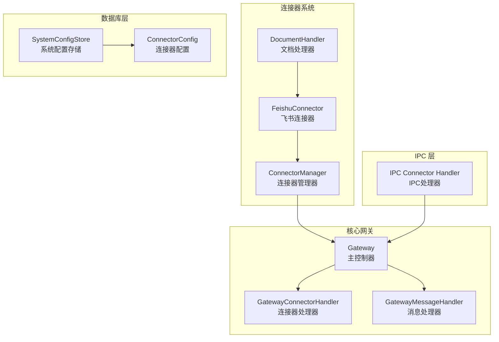
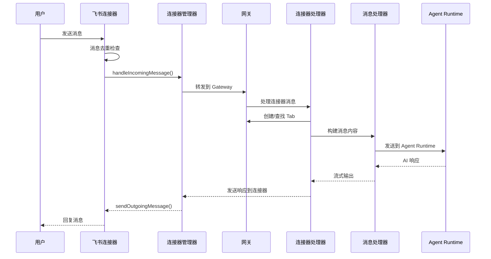
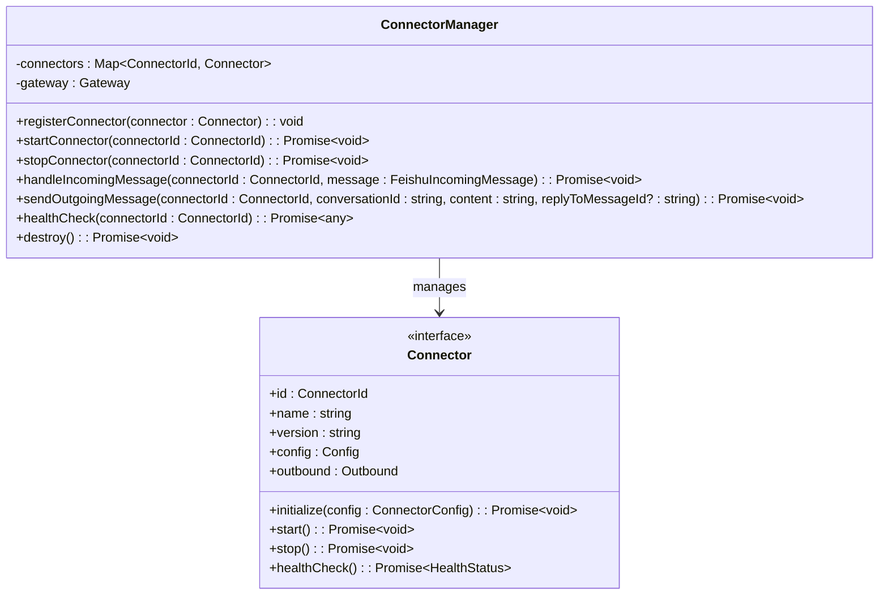
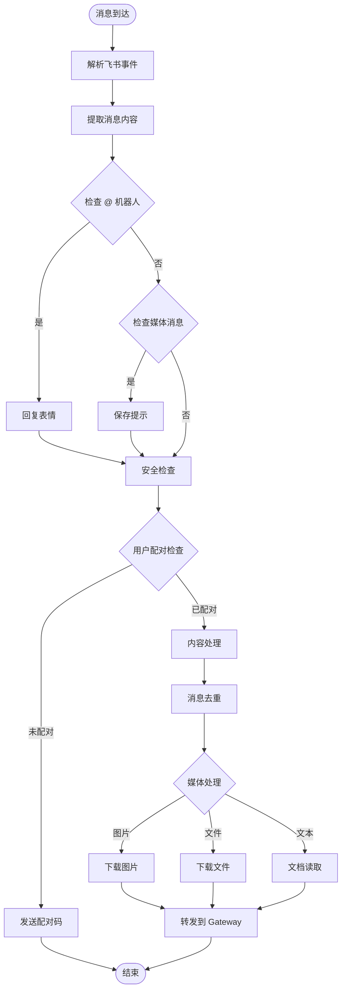
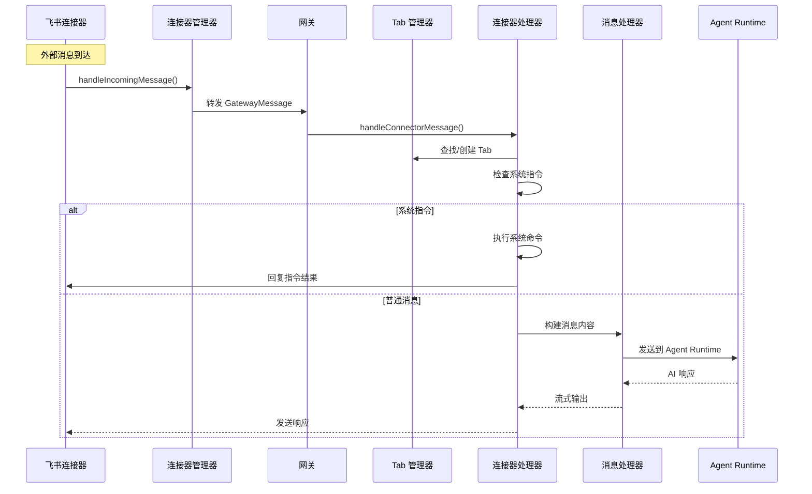

# 连接器系统

<cite>
**本文档引用的文件**
- [connector-manager.ts](file://src/main/connectors/connector-manager.ts)
- [index.ts](file://src/main/connectors/index.ts)
- [feishu-connector.ts](file://src/main/connectors/feishu/feishu-connector.ts)
- [document-handler.ts](file://src/main/connectors/feishu/document-handler.ts)
- [connector.ts](file://src/types/connector.ts)
- [gateway.ts](file://src/main/gateway.ts)
- [gateway-connector.ts](file://src/main/gateway-connector.ts)
- [gateway-message.ts](file://src/main/gateway-message.ts)
- [connector-config.ts](file://src/main/database/connector-config.ts)
- [system-config-store.ts](file://src/main/database/system-config-store.ts)
- [connector-handler.ts](file://src/main/ipc/connector-handler.ts)
- [connector-tool.ts](file://src/main/tools/connector-tool.ts)
- [gateway-tab.ts](file://src/main/gateway-tab.ts)
</cite>

## 目录
1. [简介](#简介)
2. [项目结构](#项目结构)
3. [核心组件](#核心组件)
4. [架构概览](#架构概览)
5. [详细组件分析](#详细组件分析)
6. [依赖关系分析](#依赖关系分析)
7. [性能考虑](#性能考虑)
8. [故障排除指南](#故障排除指南)
9. [结论](#结论)
10. [附录](#附录)

## 简介

DeepBot 连接器系统是一个模块化的消息通信框架，负责连接各种即时通讯平台并与 AI Agent Runtime 进行交互。该系统的核心目标是提供统一的接口来处理来自不同平台的消息，同时维护与 AI 系统的无缝集成。

系统采用插件化架构设计，支持多种连接器（如飞书、钉钉、微信、Slack）的动态加载和管理。每个连接器都实现了标准化的接口，确保消息格式的一致性和处理流程的统一性。

## 项目结构

连接器系统位于 `src/main/connectors/` 目录下，采用清晰的模块化组织：



**图表来源**
- [connector-manager.ts:21-379](file://src/main/connectors/connector-manager.ts#L21-L379)
- [feishu-connector.ts:28-994](file://src/main/connectors/feishu/feishu-connector.ts#L28-L994)
- [gateway.ts:29-772](file://src/main/gateway.ts#L29-L772)

**章节来源**
- [connector-manager.ts:1-379](file://src/main/connectors/connector-manager.ts#L1-L379)
- [feishu-connector.ts:1-994](file://src/main/connectors/feishu/feishu-connector.ts#L1-L994)
- [gateway.ts:1-772](file://src/main/gateway.ts#L1-L772)

## 核心组件

### ConnectorManager - 连接器管理器

ConnectorManager 是连接器系统的核心控制器，负责连接器的生命周期管理和消息路由。

**主要职责：**
- 连接器注册与发现
- 连接器启动/停止管理
- 配置加载与验证
- 外部消息处理与转发
- 出站消息发送
- 健康检查与监控

**关键特性：**
- 基于 Map 的连接器存储，支持 O(1) 查找
- 异步配置加载机制
- 完整的错误处理和恢复策略
- 支持图片和文件的二进制内容传输

**章节来源**
- [connector-manager.ts:21-379](file://src/main/connectors/connector-manager.ts#L21-L379)

### FeishuConnector - 飞书连接器

飞书连接器实现了完整的飞书平台集成，包括 WebSocket 长连接、消息去重、文档处理等功能。

**核心功能：**
- WebSocket 长连接维护
- 消息去重机制（基于 message_id 和内容）
- 飞书文档读取和解析
- 用户名缓存和通讯录查询
- 图片和文件的下载与上传

**技术特点：**
- 使用 @larksuiteoapi/node-sdk 官方 SDK
- 支持机器人 open_id 轮询获取
- 基于内存的去重缓存（1000条消息）
- 内容去重窗口（5秒内相同内容视为重复）

**章节来源**
- [feishu-connector.ts:28-994](file://src/main/connectors/feishu/feishu-connector.ts#L28-L994)

### DocumentHandler - 文档处理器

专门处理飞书文档的读取和解析功能。

**支持的文档类型：**
- 文档（docx/docs）
- 电子表格（sheets）
- 维基（wiki）

**处理流程：**
1. URL 提取和验证
2. 文档元信息获取
3. 内容读取和格式化
4. 错误处理和权限检查

**章节来源**
- [document-handler.ts:23-369](file://src/main/connectors/feishu/document-handler.ts#L23-L369)

## 架构概览

连接器系统采用分层架构设计，确保各组件职责清晰、耦合度低。



**图表来源**
- [feishu-connector.ts:368-577](file://src/main/connectors/feishu/feishu-connector.ts#L368-L577)
- [gateway-connector.ts:100-296](file://src/main/gateway-connector.ts#L100-L296)
- [gateway-message.ts:376-473](file://src/main/gateway-message.ts#L376-L473)

**章节来源**
- [gateway.ts:669-746](file://src/main/gateway.ts#L669-L746)
- [gateway-connector.ts:90-425](file://src/main/gateway-connector.ts#L90-L425)

## 详细组件分析

### ConnectorManager 类深度分析

ConnectorManager 实现了完整的连接器生命周期管理。



**图表来源**
- [connector-manager.ts:21-379](file://src/main/connectors/connector-manager.ts#L21-L379)
- [connector.ts:76-146](file://src/types/connector.ts#L76-L146)

**核心方法详解：**

1. **连接器注册** (`registerConnector`)
   - 使用 Map 存储连接器实例
   - 支持动态注册和查找

2. **启动流程** (`startConnector`)
   - 配置加载和验证
   - 连接器初始化
   - 异步启动和错误处理

3. **消息处理** (`handleIncomingMessage`)
   - 外部消息格式转换
   - Gateway 消息封装
   - 异常捕获和日志记录

**章节来源**
- [connector-manager.ts:35-168](file://src/main/connectors/connector-manager.ts#L35-L168)

### 飞书连接器实现分析

飞书连接器是系统中最复杂的组件，实现了完整的飞书平台集成。



**图表来源**
- [feishu-connector.ts:368-577](file://src/main/connectors/feishu/feishu-connector.ts#L368-L577)

**关键技术实现：**

1. **消息去重机制**
   - 基于 message_id 的去重缓存
   - 基于内容的时间窗口去重
   - 内存限制和自动清理

2. **用户配对系统**
   - Pairing 记录管理
   - 自动批准机制
   - 管理员权限控制

3. **文档处理功能**
   - URL 提取和验证
   - 多种文档类型的读取
   - 内容格式化和合并

**章节来源**
- [feishu-connector.ts:40-520](file://src/main/connectors/feishu/feishu-connector.ts#L40-L520)

### 消息路由处理流程

消息在系统中的流转路径体现了清晰的分层设计。



**图表来源**
- [gateway-connector.ts:98-296](file://src/main/gateway-connector.ts#L98-L296)
- [gateway-message.ts:76-160](file://src/main/gateway-message.ts#L76-L160)

**章节来源**
- [gateway-connector.ts:90-483](file://src/main/gateway-connector.ts#L90-L483)
- [gateway-message.ts:285-473](file://src/main/gateway-message.ts#L285-L473)

## 依赖关系分析

连接器系统的依赖关系体现了清晰的分层架构。

```mermaid
graph TB
subgraph "外部依赖"
SDK[@larksuiteoapi/node-sdk]
FS[文件系统]
WS[WebSocket]
end
subgraph "核心层"
CM[ConnectorManager]
GW[Gateway]
FC[FeishuConnector]
end
subgraph "工具层"
DH[DocumentHandler]
CT[ConnectorTool]
end
subgraph "基础设施"
SCS[SystemConfigStore]
IPCH[IPC Handler]
TAB[TabManager]
end
SDK --> FC
FS --> FC
WS --> FC
CM --> GW
FC --> CM
DH --> FC
CT --> GW
SCS --> CM
IPCH --> GW
TAB --> GW
```

**图表来源**
- [feishu-connector.ts:11-25](file://src/main/connectors/feishu/feishu-connector.ts#L11-L25)
- [gateway.ts:22-27](file://src/main/gateway.ts#L22-L27)

**依赖特点：**
- 外部 SDK 依赖集中在连接器层
- 核心业务逻辑与基础设施解耦
- IPC 层提供统一的前端通信接口
- 数据持久化通过配置存储模块管理

**章节来源**
- [system-config-store.ts:37-566](file://src/main/database/system-config-store.ts#L37-L566)
- [connector-handler.ts:33-405](file://src/main/ipc/connector-handler.ts#L33-L405)

## 性能考虑

连接器系统在设计时充分考虑了性能优化和资源管理。

### 内存管理
- 消息去重缓存限制为 1000 条
- 内容去重窗口设置为 5 秒
- 自动清理过期缓存条目

### 连接管理
- WebSocket 连接池管理
- 机器人 open_id 轮询机制
- 连接异常自动重连

### 处理效率
- 异步消息处理避免阻塞
- 流式响应减少内存占用
- 缓存机制提升查询性能

## 故障排除指南

### 常见问题诊断

**连接器启动失败**
1. 检查配置验证
2. 确认 API 凭据有效性
3. 查看连接器健康状态

**消息处理异常**
1. 检查消息去重机制
2. 验证用户配对状态
3. 确认文档权限设置

**性能问题**
1. 监控内存使用情况
2. 检查缓存命中率
3. 优化数据库查询

### 调试技巧

**日志分析**
- 连接器状态日志
- 消息流转追踪
- 错误堆栈分析

**监控指标**
- 连接器健康检查
- 消息处理延迟
- 内存使用峰值

**章节来源**
- [connector-manager.ts:341-358](file://src/main/connectors/connector-manager.ts#L341-L358)
- [feishu-connector.ts:235-248](file://src/main/connectors/feishu/feishu-connector.ts#L235-L248)

## 结论

DeepBot 连接器系统通过模块化设计和清晰的分层架构，成功实现了多平台即时通讯的统一接入。系统的核心优势包括：

1. **高度模块化** - 每个连接器都是独立的模块，便于扩展和维护
2. **统一接口** - 标准化的消息格式和处理流程
3. **健壮性** - 完善的错误处理和恢复机制
4. **性能优化** - 智能缓存和异步处理策略
5. **可扩展性** - 支持新连接器的快速集成

该系统为 DeepBot 提供了强大的外部通信能力，是实现多平台 AI 应用的关键基础设施。

## 附录

### 开发新连接器指南

**步骤 1：实现连接器接口**
```typescript
// 参考 Connector 接口定义
interface Connector {
  id: ConnectorId;
  name: string;
  version: string;
  config: Config;
  initialize(config: ConnectorConfig): Promise<void>;
  start(): Promise<void>;
  stop(): Promise<void>;
  healthCheck(): Promise<HealthStatus>;
  outbound: Outbound;
}
```

**步骤 2：实现配置管理**
- 实现配置加载和验证
- 支持配置持久化
- 提供配置 UI 集成

**步骤 3：实现消息处理**
- 处理外部消息格式
- 实现消息去重
- 支持图片和文件处理

**步骤 4：集成到系统**
- 在 Gateway 中注册连接器
- 实现 IPC 接口
- 添加健康检查

**章节来源**
- [connector.ts:76-146](file://src/types/connector.ts#L76-L146)
- [gateway.ts:69-99](file://src/main/gateway.ts#L69-L99)

### 配置文件示例

**连接器配置结构：**
```json
{
  "connector_id": "feishu",
  "connector_name": "飞书",
  "enabled": true,
  "config_json": {
    "appId": "your_app_id",
    "appSecret": "your_app_secret",
    "requirePairing": false
  },
  "created_at": 1640995200000,
  "updated_at": 1640995200000
}
```

**Pairing 记录结构：**
```json
{
  "connector_id": "feishu",
  "user_id": "user123",
  "pairing_code": "ABC123",
  "approved": false,
  "created_at": 1640995200000,
  "approved_at": null,
  "is_admin": false,
  "user_name": "张三",
  "open_id": "ou_abc123"
}
```