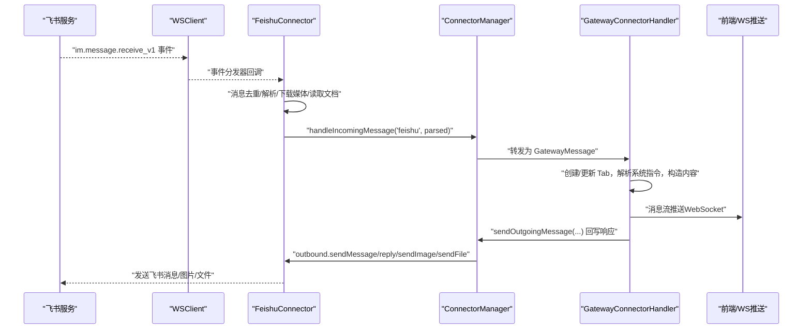
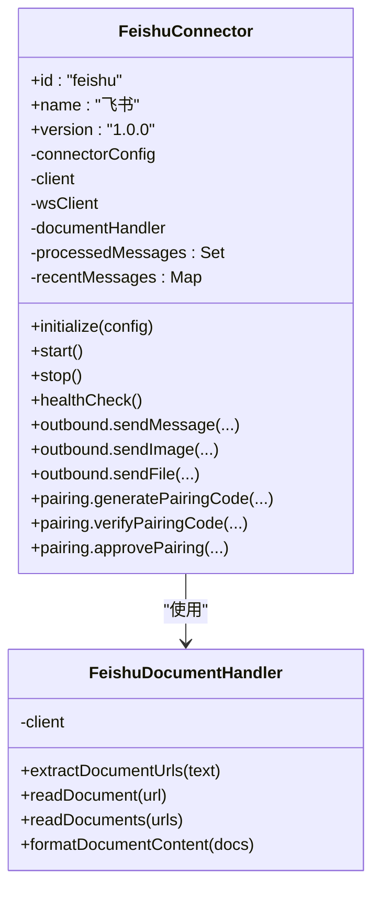
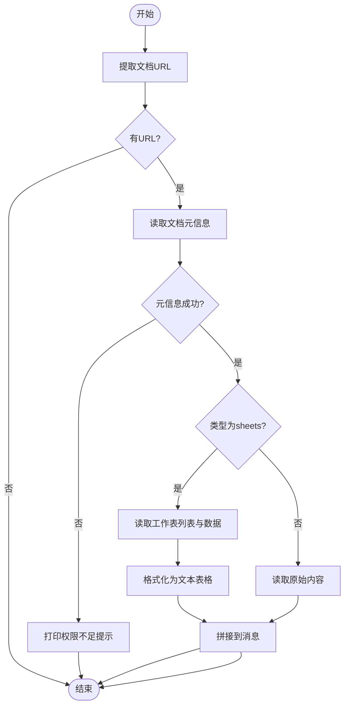
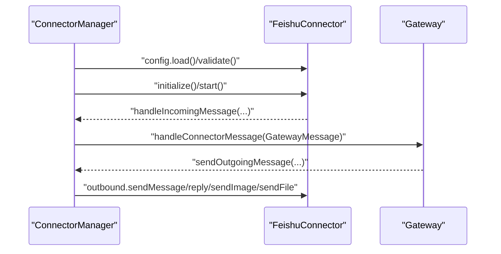
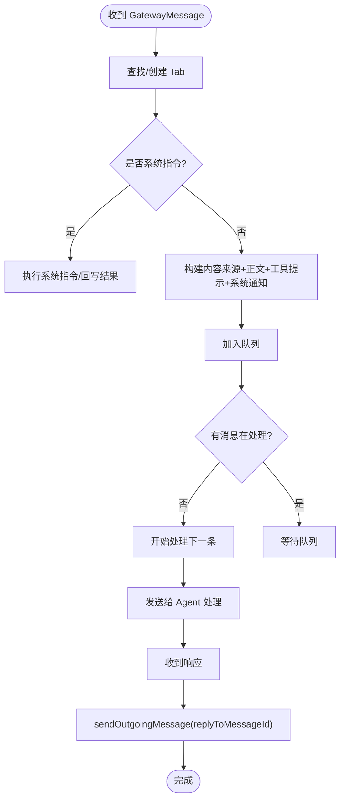
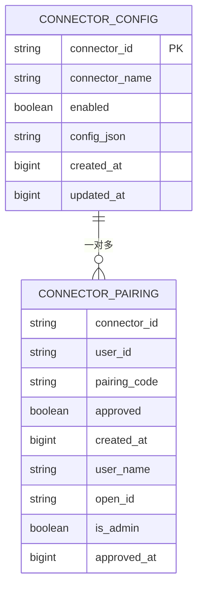
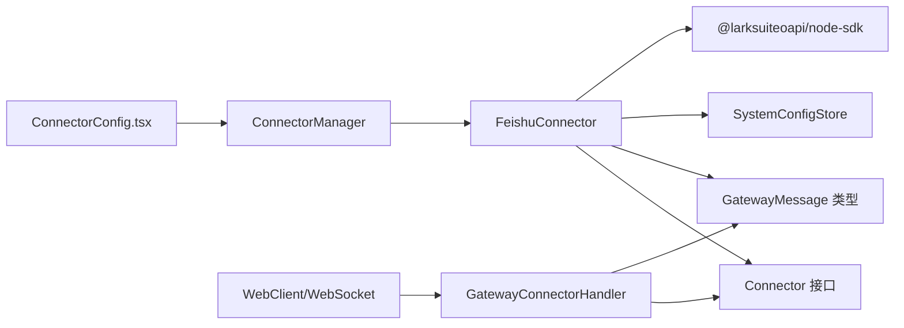

# 飞书连接器

<cite>
**本文引用的文件**
- [feishu-connector.ts](file://src/main/connectors/feishu/feishu-connector.ts)
- [document-handler.ts](file://src/main/connectors/feishu/document-handler.ts)
- [connector-manager.ts](file://src/main/connectors/connector-manager.ts)
- [connector-config.ts](file://src/main/database/connector-config.ts)
- [gateway-connector.ts](file://src/main/gateway-connector.ts)
- [connector.ts](file://src/types/connector.ts)
- [ConnectorConfig.tsx](file://src/renderer/components/settings/ConnectorConfig.tsx)
- [connector-handlers.ts](file://src/main/tools/handlers/connector-handlers.ts)
- [feishu-doc-tool.ts](file://src/main/tools/feishu-doc-tool.ts)
- [index.ts](file://src/renderer/api/index.ts)
- [gateway-adapter.ts](file://src/server/gateway-adapter.ts)
</cite>

## 目录
1. [简介](#简介)
2. [项目结构](#项目结构)
3. [核心组件](#核心组件)
4. [架构总览](#架构总览)
5. [详细组件分析](#详细组件分析)
6. [依赖关系分析](#依赖关系分析)
7. [性能与可靠性](#性能与可靠性)
8. [部署与配置指南](#部署与配置指南)
9. [故障排除](#故障排除)
10. [结论](#结论)
11. [附录：代码示例路径](#附录代码示例路径)

## 简介
本文件面向 史丽慧小助理 飞书连接器的技术文档，系统性阐述其架构设计、实现细节与运维实践。重点覆盖：
- 使用 LarkSuite 官方 Node.js SDK 建立 WebSocket 长连接并接收事件
- 消息解析、去重策略、会话与用户认证流程
- 文档处理能力：富文本块识别、文档协作与内容同步
- 配置管理：应用凭证、事件订阅、回调地址
- 消息路由与转发：格式转换、会话标识符管理
- 部署指南、配置示例与故障排除
- 代码示例路径：如何处理飞书消息、发送响应消息

## 项目结构
飞书连接器位于主进程模块中，围绕连接器生命周期、消息处理与网关交互展开，并通过数据库层持久化配置与配对记录，前端通过设置界面进行可视化配置与启停。

```mermaid
graph TB
subgraph "连接器层"
FC["FeishuConnector<br/>WebSocket 事件处理"]
FDH["FeishuDocumentHandler<br/>文档读取/格式化"]
end
subgraph "管理与存储"
CM["ConnectorManager<br/>连接器编排"]
CFG["SystemConfigStore<br/>连接器配置/配对记录"]
end
subgraph "网关与前端"
GW["GatewayConnectorHandler<br/>消息路由/系统指令"]
UI["ConnectorConfig.tsx<br/>前端配置界面"]
WS["WebClient/WebSocket<br/>消息推送"]
end
Lark["@larksuiteoapi/node-sdk<br/>SDK 客户端"]:::sdk
FC --> FDH
FC --> CM
CM --> GW
CFG <-- CM
CFG <-- FC
UI --> CM
WS --> GW
FC --> Lark
classDef sdk fill:#fff,stroke:#333,stroke-width:1px;
```

图表来源
- [feishu-connector.ts:28-150](file://src/main/connectors/feishu/feishu-connector.ts#L28-L150)
- [document-handler.ts:23-93](file://src/main/connectors/feishu/document-handler.ts#L23-L93)
- [connector-manager.ts:21-123](file://src/main/connectors/connector-manager.ts#L21-L123)
- [gateway-connector.ts:44-120](file://src/main/gateway-connector.ts#L44-L120)
- [ConnectorConfig.tsx:78-180](file://src/renderer/components/settings/ConnectorConfig.tsx#L78-L180)
- [index.ts:425-487](file://src/renderer/api/index.ts#L425-L487)

章节来源
- [feishu-connector.ts:28-150](file://src/main/connectors/feishu/feishu-connector.ts#L28-L150)
- [document-handler.ts:23-93](file://src/main/connectors/feishu/document-handler.ts#L23-L93)
- [connector-manager.ts:21-123](file://src/main/connectors/connector-manager.ts#L21-L123)
- [gateway-connector.ts:44-120](file://src/main/gateway-connector.ts#L44-L120)
- [ConnectorConfig.tsx:78-180](file://src/renderer/components/settings/ConnectorConfig.tsx#L78-L180)
- [index.ts:425-487](file://src/renderer/api/index.ts#L425-L487)

## 核心组件
- 飞书连接器（FeishuConnector）
  - 使用 LarkSuite SDK 初始化 Client 与 WSClient
  - 注册 im.message.receive_v1 事件分发器，异步处理消息
  - 实现消息去重、用户名称缓存、表情回复、媒体资源下载
  - 提供 outbound 发送文本/图片/文件能力
  - 支持配对授权与管理员审批
- 文档处理器（FeishuDocumentHandler）
  - 提取飞书文档/电子表格 URL，读取元信息与内容
  - 支持 docx/docs/wiki 与 sheets
  - 格式化电子表格为文本表格
- 连接器管理器（ConnectorManager）
  - 注册/启动/停止连接器
  - 将外部消息转换为 GatewayMessage 并转发
  - 统一发送外部消息（文本/图片/文件）
- 网关连接器处理器（GatewayConnectorHandler）
  - 创建/更新 Tab，解析系统指令（/new、/memory、/history、/stop、/status）
  - 构造发给 Agent 的内容，队列化消息，进度提醒
  - 将响应回写到连接器
- 配置与配对
  - SystemConfigStore 持久化连接器配置与配对记录
  - 前端 ConnectorConfig.tsx 提供可视化配置与启停
  - 工具层 connector-handlers.ts 提供启用/禁用连接器的工具接口

章节来源
- [feishu-connector.ts:28-150](file://src/main/connectors/feishu/feishu-connector.ts#L28-L150)
- [document-handler.ts:23-93](file://src/main/connectors/feishu/document-handler.ts#L23-L93)
- [connector-manager.ts:21-123](file://src/main/connectors/connector-manager.ts#L21-L123)
- [gateway-connector.ts:44-120](file://src/main/gateway-connector.ts#L44-L120)
- [connector-config.ts:13-98](file://src/main/database/connector-config.ts#L13-L98)
- [ConnectorConfig.tsx:78-180](file://src/renderer/components/settings/ConnectorConfig.tsx#L78-L180)
- [connector-handlers.ts:61-101](file://src/main/tools/handlers/connector-handlers.ts#L61-L101)

## 架构总览
飞书连接器通过 WebSocket 与 LarkSuite 事件推送对接，消息进入后经去重、解析、文档读取、安全校验，最终统一转交 GatewayConnectorHandler 处理；响应消息再由 ConnectorManager 通过连接器的 outbound 接口回写至飞书。



图表来源
- [feishu-connector.ts:132-150](file://src/main/connectors/feishu/feishu-connector.ts#L132-L150)
- [connector-manager.ts:130-168](file://src/main/connectors/connector-manager.ts#L130-L168)
- [gateway-connector.ts:100-296](file://src/main/gateway-connector.ts#L100-L296)
- [index.ts:425-487](file://src/renderer/api/index.ts#L425-L487)

## 详细组件分析

### 飞书连接器（FeishuConnector）
- 生命周期与配置
  - 初始化：创建 Lark.Client 与 FeishuDocumentHandler
  - 启动：创建 WSClient，注册 im.message.receive_v1 事件分发器，后台轮询机器人 open_id
  - 健康检查：基于 isStarted 与 wsClient 状态
- 消息处理
  - 解析 sender/open_id、消息类型、@ 机器人情况
  - 群组消息：@ 机器人、媒体消息、系统指令可免 @
  - 表情回复：收到消息后立即回复随机表情
  - 媒体下载：图片/文件资源下载到本地临时目录
  - 文档读取：从消息文本中提取飞书文档 URL，读取并拼接到消息内容
  - 安全校验：私聊未配对时生成配对码；管理员指令（如 pairing approve）优先处理
  - 去重：基于 message_id 与基于内容（5秒窗口）双重去重
- 发送消息
  - 文本：支持 reply API（chat_id）与 create API（chat_id/open_id）
  - 图片：先上传 image，再发送 image 消息，可带 caption
  - 文件：先上传 file，再发送 file 消息
- 配对机制
  - 生成配对码、校验配对码、批准配对
  - 首个用户自动批准并设为管理员，非首个用户推送待授权数量更新



图表来源
- [feishu-connector.ts:28-150](file://src/main/connectors/feishu/feishu-connector.ts#L28-L150)
- [document-handler.ts:23-93](file://src/main/connectors/feishu/document-handler.ts#L23-L93)

章节来源
- [feishu-connector.ts:28-150](file://src/main/connectors/feishu/feishu-connector.ts#L28-L150)
- [feishu-connector.ts:368-577](file://src/main/connectors/feishu/feishu-connector.ts#L368-L577)
- [feishu-connector.ts:581-800](file://src/main/connectors/feishu/feishu-connector.ts#L581-L800)
- [feishu-connector.ts:852-993](file://src/main/connectors/feishu/feishu-connector.ts#L852-L993)

### 文档处理器（FeishuDocumentHandler）
- 功能
  - URL 提取：支持 docx/docs/wiki/sheets 多类型
  - 文档读取：docx/docs/wiki 使用 docx API；sheets 使用 sheets API
  - 电子表格格式化：将二维数组转为带表头分隔线的文本表格
  - 批量读取与内容拼接：将多个文档内容格式化后附加到消息
- 权限提示：当 API 返回权限不足时，打印所需权限清单



图表来源
- [document-handler.ts:40-93](file://src/main/connectors/feishu/document-handler.ts#L40-L93)
- [document-handler.ts:98-166](file://src/main/connectors/feishu/document-handler.ts#L98-L166)
- [document-handler.ts:171-294](file://src/main/connectors/feishu/document-handler.ts#L171-L294)
- [document-handler.ts:334-367](file://src/main/connectors/feishu/document-handler.ts#L334-L367)

章节来源
- [document-handler.ts:40-93](file://src/main/connectors/feishu/document-handler.ts#L40-L93)
- [document-handler.ts:98-166](file://src/main/connectors/feishu/document-handler.ts#L98-L166)
- [document-handler.ts:171-294](file://src/main/connectors/feishu/document-handler.ts#L171-L294)
- [document-handler.ts:334-367](file://src/main/connectors/feishu/document-handler.ts#L334-L367)

### 连接器管理器（ConnectorManager）
- 职责
  - 注册连接器实例，启动/停止连接器
  - 从连接器加载配置并校验有效性
  - 将外部消息转换为 GatewayMessage 并转发
  - 统一发送外部消息（文本/图片/文件），支持 replyToMessageId
- 健康检查：委托连接器实现



图表来源
- [connector-manager.ts:45-81](file://src/main/connectors/connector-manager.ts#L45-L81)
- [connector-manager.ts:130-168](file://src/main/connectors/connector-manager.ts#L130-L168)
- [connector-manager.ts:178-291](file://src/main/connectors/connector-manager.ts#L178-L291)

章节来源
- [connector-manager.ts:45-81](file://src/main/connectors/connector-manager.ts#L45-L81)
- [connector-manager.ts:130-168](file://src/main/connectors/connector-manager.ts#L130-L168)
- [connector-manager.ts:178-291](file://src/main/connectors/connector-manager.ts#L178-L291)

### 网关连接器处理器（GatewayConnectorHandler）
- Tab 管理：根据 connectorId 与 conversationId 生成/更新 Tab，群组消息动态获取群名称
- 系统指令：/new、/memory、/history、/stop、/status 直接执行或回写结果
- 内容构建：将来源信息、消息正文、飞书工具提示与系统通知组合为 Agent 输入
- 队列化处理：消息入队，逐条处理，支持进度提醒定时器
- 响应回写：根据当前处理消息的 replyToMessageId 使用 reply API



图表来源
- [gateway-connector.ts:100-296](file://src/main/gateway-connector.ts#L100-L296)
- [gateway-connector.ts:369-425](file://src/main/gateway-connector.ts#L369-L425)
- [gateway-connector.ts:431-483](file://src/main/gateway-connector.ts#L431-L483)

章节来源
- [gateway-connector.ts:100-296](file://src/main/gateway-connector.ts#L100-L296)
- [gateway-connector.ts:369-425](file://src/main/gateway-connector.ts#L369-L425)
- [gateway-connector.ts:431-483](file://src/main/gateway-connector.ts#L431-L483)

### 配置与配对（SystemConfigStore）
- 连接器配置
  - 保存/读取/启用/删除连接器配置
  - 支持 JSON 序列化/反序列化
- 配对记录
  - 保存/查询/批准/删除配对记录
  - 设置/查询管理员权限
  - 获取所有配对记录（用于管理界面）



图表来源
- [connector-config.ts:13-98](file://src/main/database/connector-config.ts#L13-L98)
- [connector-config.ts:116-233](file://src/main/database/connector-config.ts#L116-L233)

章节来源
- [connector-config.ts:13-98](file://src/main/database/connector-config.ts#L13-L98)
- [connector-config.ts:116-233](file://src/main/database/connector-config.ts#L116-L233)

## 依赖关系分析
- 外部依赖
  - @larksuiteoapi/node-sdk：SDK 客户端与 WebSocket 事件分发
- 内部依赖
  - Connector 接口：统一生命周期与消息发送接口
  - GatewayMessage：跨层消息格式
  - SystemConfigStore：配置与配对持久化
  - 前端 WebSocket：消息推送与订阅



图表来源
- [connector.ts:76-146](file://src/types/connector.ts#L76-L146)
- [connector.ts:33-69](file://src/types/connector.ts#L33-L69)
- [feishu-connector.ts:11-25](file://src/main/connectors/feishu/feishu-connector.ts#L11-L25)
- [gateway-connector.ts:44-95](file://src/main/gateway-connector.ts#L44-L95)
- [ConnectorConfig.tsx:78-120](file://src/renderer/components/settings/ConnectorConfig.tsx#L78-L120)
- [index.ts:425-487](file://src/renderer/api/index.ts#L425-L487)

章节来源
- [connector.ts:76-146](file://src/types/connector.ts#L76-L146)
- [connector.ts:33-69](file://src/types/connector.ts#L33-L69)
- [feishu-connector.ts:11-25](file://src/main/connectors/feishu/feishu-connector.ts#L11-L25)
- [gateway-connector.ts:44-95](file://src/main/gateway-connector.ts#L44-L95)
- [ConnectorConfig.tsx:78-120](file://src/renderer/components/settings/ConnectorConfig.tsx#L78-L120)
- [index.ts:425-487](file://src/renderer/api/index.ts#L425-L487)

## 性能与可靠性
- 去重策略
  - 基于 message_id 的 Set 缓存，上限 1000 条
  - 基于内容（senderId + text）与时间窗（5 秒）的 Map 缓存
- 资源下载
  - 图片/文件下载到本地临时目录，避免重复下载
  - 使用纯英文文件名，减少 AI 处理时的排版问题
- 并发与异步
  - 事件回调中 setImmediate 异步处理，避免阻塞响应
  - 进度提醒定时器按固定节点触发，避免频繁 IO
- 健康检查
  - ConnectorManager.healthCheck 直接检查内部状态，避免额外网络请求

[本节为通用性能讨论，不直接分析具体文件]

## 部署与配置指南

### 飞书应用与凭证配置
- 在飞书开放平台创建应用，获取 App ID 与 App Secret
- 在前端设置页面填写 appId/appSecret，保存后可选择启用连接器

章节来源
- [ConnectorConfig.tsx:150-180](file://src/renderer/components/settings/ConnectorConfig.tsx#L150-L180)
- [feishu-connector.ts:54-80](file://src/main/connectors/feishu/feishu-connector.ts#L54-L80)

### 事件订阅与回调地址
- 使用 LarkSuite SDK 的 WSClient 自动建立长连接并注册 im.message.receive_v1 事件分发器
- 无需手动配置回调地址，事件由 SDK 主动推送

章节来源
- [feishu-connector.ts:125-150](file://src/main/connectors/feishu/feishu-connector.ts#L125-L150)
- [feishu-connector.ts:132-146](file://src/main/connectors/feishu/feishu-connector.ts#L132-L146)

### 启停与健康检查
- 通过工具接口 handleSetConnectorEnabled 控制连接器启停
- ConnectorManager.healthCheck 返回连接器健康状态

章节来源
- [connector-handlers.ts:61-101](file://src/main/tools/handlers/connector-handlers.ts#L61-L101)
- [connector-manager.ts:341-358](file://src/main/connectors/connector-manager.ts#L341-L358)

### 前端消息推送
- 建立 WebSocket 连接后批量订阅所有 Tab，确保外部消息（如飞书）历史不丢失
- 通过 gateway-adapter 将内部事件广播到 WebSocket

章节来源
- [index.ts:425-487](file://src/renderer/api/index.ts#L425-L487)
- [gateway-adapter.ts:141-176](file://src/server/gateway-adapter.ts#L141-L176)

## 故障排除
- WebSocket 连接失败
  - 检查 appId/appSecret 是否正确
  - 确认网络可达飞书开放平台
- 权限不足（文档读取失败）
  - 按日志提示在开放平台添加 docx:document:readonly、drive:drive:readonly 或 sheets:spreadsheet:readonly 权限
- 媒体下载失败
  - 检查 messageResource API 返回与本地临时目录权限
- 配对码无效或过期
  - 管理员可通过 /slhbot pairing approve feishu <配对码> 批准
- 进度提醒未送达
  - 检查 Tab 是否存在，以及 sendOutgoingMessage 是否被调用

章节来源
- [document-handler.ts:115-127](file://src/main/connectors/feishu/document-handler.ts#L115-L127)
- [feishu-connector.ts:852-902](file://src/main/connectors/feishu/feishu-connector.ts#L852-L902)
- [gateway-connector.ts:773-811](file://src/main/gateway-connector.ts#L773-L811)

## 结论
飞书连接器通过 LarkSuite SDK 的 WebSocket 事件机制实现低延迟的消息接入，结合去重、媒体下载、文档读取与配对授权等能力，形成完整的消息处理闭环。配合 GatewayConnectorHandler 的队列化与系统指令处理，能够稳定支撑多场景的会话与协作需求。

[本节为总结，不直接分析具体文件]

## 附录：代码示例路径
以下为关键流程的代码示例路径（不直接展示代码内容）：
- 处理飞书消息（接收事件、解析、去重、下载媒体、读取文档、安全校验、转发）
  - [事件分发与处理入口:132-150](file://src/main/connectors/feishu/feishu-connector.ts#L132-L150)
  - [消息解析与去重:368-577](file://src/main/connectors/feishu/feishu-connector.ts#L368-L577)
  - [媒体下载（图片/文件）:267-314](file://src/main/connectors/feishu/feishu-connector.ts#L267-L314)
  - [文档 URL 提取与读取:40-93](file://src/main/connectors/feishu/document-handler.ts#L40-L93)
  - [文档内容格式化:350-367](file://src/main/connectors/feishu/document-handler.ts#L350-L367)
- 发送响应消息（文本/图片/文件）
  - [文本回复（含 reply API）:581-636](file://src/main/connectors/feishu/feishu-connector.ts#L581-L636)
  - [图片发送（上传+发送）:638-723](file://src/main/connectors/feishu/feishu-connector.ts#L638-L723)
  - [文件发送（上传+发送）:725-800](file://src/main/connectors/feishu/feishu-connector.ts#L725-L800)
- 系统指令与队列处理
  - [系统指令解析与执行:194-248](file://src/main/gateway-connector.ts#L194-L248)
  - [队列化处理与进度提醒:369-425](file://src/main/gateway-connector.ts#L369-L425)
  - [进度提醒定时器:773-811](file://src/main/gateway-connector.ts#L773-L811)
- 配对与管理员审批
  - [生成/校验/批准配对码:948-991](file://src/main/connectors/feishu/feishu-connector.ts#L948-L991)
  - [管理员审批指令处理:852-902](file://src/main/connectors/feishu/feishu-connector.ts#L852-L902)
- 前端配置与启停
  - [前端配置界面:78-180](file://src/renderer/components/settings/ConnectorConfig.tsx#L78-L180)
  - [启用/禁用连接器工具:61-101](file://src/main/tools/handlers/connector-handlers.ts#L61-L101)