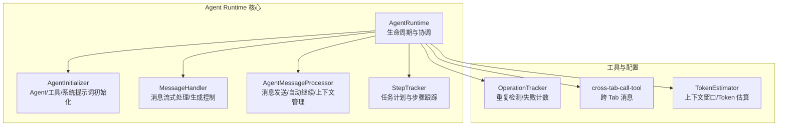
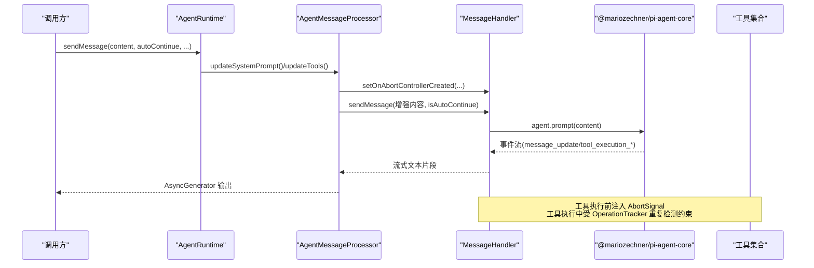
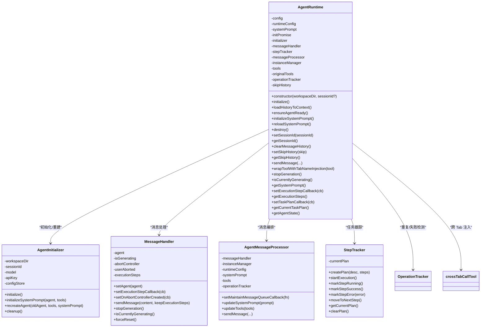
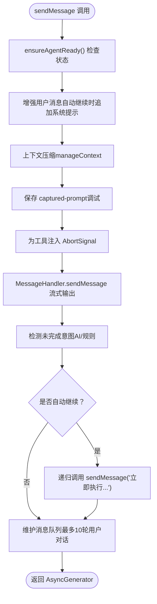
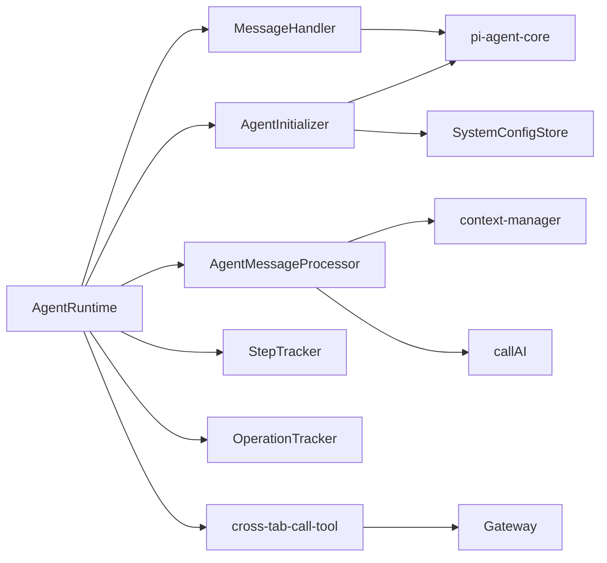

# Agent Runtime 核心架构

<cite>
**本文引用的文件**
- [agent-runtime.ts](file://src/main/agent-runtime/agent-runtime.ts)
- [types.ts](file://src/main/agent-runtime/types.ts)
- [agent-initializer.ts](file://src/main/agent-runtime/agent-initializer.ts)
- [message-handler.ts](file://src/main/agent-runtime/message-handler.ts)
- [agent-message-processor.ts](file://src/main/agent-runtime/agent-message-processor.ts)
- [step-tracker.ts](file://src/main/agent-runtime/step-tracker.ts)
- [step-description-generator.ts](file://src/main/agent-runtime/step-description-generator.ts)
- [index.ts](file://src/main/agent-runtime/index.ts)
- [tool-abort.ts](file://src/main/tools/tool-abort.ts)
- [cross-tab-call-tool.ts](file://src/main/tools/cross-tab-call-tool.ts)
- [token-estimator.ts](file://src/main/utils/token-estimator.ts)
</cite>

## 目录
1. [简介](#简介)
2. [项目结构](#项目结构)
3. [核心组件](#核心组件)
4. [架构总览](#架构总览)
5. [详细组件分析](#详细组件分析)
6. [依赖关系分析](#依赖关系分析)
7. [性能考量](#性能考量)
8. [故障排查指南](#故障排查指南)
9. [结论](#结论)

## 简介
本文件面向 Agent Runtime 核心架构，系统性阐述 AgentRuntime 类的设计理念、生命周期管理、初始化流程、配置管理与资源协调机制；详解其与 @mariozechner/pi-agent-core 的集成方式、多 Agent 实例管理策略、模型配置与 API 密钥处理、上下文窗口与 token 估算、工具包装与注入策略；并覆盖多标签页并发场景下的资源管理、智能状态检查与异常恢复、性能优化与调试技巧。

## 项目结构
Agent Runtime 模块位于 src/main/agent-runtime 下，采用“职责分离 + 模块化”的设计，围绕 AgentRuntime 为核心，配合 AgentInitializer、MessageHandler、AgentMessageProcessor、StepTracker 等子模块协同工作，形成从初始化、消息发送、工具执行、上下文管理到状态恢复的完整闭环。

图表来源
- [agent-runtime.ts:27-188](file://src/main/agent-runtime/agent-runtime.ts#L27-L188)
- [agent-initializer.ts:17-71](file://src/main/agent-runtime/agent-initializer.ts#L17-L71)
- [message-handler.ts:16-58](file://src/main/agent-runtime/message-handler.ts#L16-L58)
- [agent-message-processor.ts:20-45](file://src/main/agent-runtime/agent-message-processor.ts#L20-L45)
- [step-tracker.ts:34-65](file://src/main/agent-runtime/step-tracker.ts#L34-L65)
- [tool-abort.ts:149-271](file://src/main/tools/tool-abort.ts#L149-L271)
- [cross-tab-call-tool.ts:49-165](file://src/main/tools/cross-tab-call-tool.ts#L49-L165)
- [token-estimator.ts:121-140](file://src/main/utils/token-estimator.ts#L121-L140)

章节来源
- [agent-runtime.ts:1-188](file://src/main/agent-runtime/agent-runtime.ts#L1-L188)
- [index.ts:7-12](file://src/main/agent-runtime/index.ts#L7-L12)

## 核心组件
- AgentRuntime：统一入口，负责生命周期管理、配置装配、模块协调、异步初始化、工具包装与注入、状态检查与恢复、销毁清理。
- AgentInitializer：动态加载 @mariozechner/pi-agent-core，创建 Agent 实例、加载工具、构建系统提示词、支持 Agent 重建。
- MessageHandler：处理消息发送、流式输出、生成控制、执行步骤收集、超时与取消、异常恢复。
- AgentMessageProcessor：消息发送编排、上下文压缩、自动继续检测、工具 AbortSignal 注入、调试日志与 prompt 捕获。
- StepTracker：任务计划与步骤跟踪，支持重试、状态推进与完成检测。
- OperationTracker：重复操作检测与连续失败计数，保障稳定性与防抖。
- cross-tab-call-tool：跨 Tab 消息工具，配合 AgentRuntime 注入 senderTabName。
- TokenEstimator：上下文窗口与 token 估算，辅助上下文压缩与容量预警。

章节来源
- [types.ts:11-39](file://src/main/agent-runtime/types.ts#L11-L39)
- [agent-initializer.ts:17-179](file://src/main/agent-runtime/agent-initializer.ts#L17-L179)
- [message-handler.ts:16-751](file://src/main/agent-runtime/message-handler.ts#L16-L751)
- [agent-message-processor.ts:20-548](file://src/main/agent-runtime/agent-message-processor.ts#L20-L548)
- [step-tracker.ts:34-198](file://src/main/agent-runtime/step-tracker.ts#L34-L198)
- [tool-abort.ts:149-426](file://src/main/tools/tool-abort.ts#L149-L426)
- [cross-tab-call-tool.ts:49-165](file://src/main/tools/cross-tab-call-tool.ts#L49-L165)
- [token-estimator.ts:121-140](file://src/main/utils/token-estimator.ts#L121-L140)

## 架构总览
AgentRuntime 通过构造函数装配运行时配置（含模型、API Key、Base URL、上下文窗口、最大并发子 Agent 数），随后异步初始化 Agent、工具与系统提示词。消息发送通过 AgentMessageProcessor 调用 MessageHandler，后者基于 @mariozechner/pi-agent-core 的事件驱动模型实现流式输出与工具调用循环。工具链路中，OperationTracker 与 AbortSignal 保证幂等与可取消性；StepTracker 提供任务级可观测性；TokenEstimator 与上下文压缩保障长对话稳定性。

图表来源
- [agent-runtime.ts:661-688](file://src/main/agent-runtime/agent-runtime.ts#L661-L688)
- [agent-message-processor.ts:345-547](file://src/main/agent-runtime/agent-message-processor.ts#L345-L547)
- [message-handler.ts:114-587](file://src/main/agent-runtime/message-handler.ts#L114-L587)
- [agent-initializer.ts:42-71](file://src/main/agent-runtime/agent-initializer.ts#L42-L71)

## 详细组件分析

### AgentRuntime 设计与职责
- 生命周期管理：构造即异步初始化，initPromise 保障并发安全；destroy() 支持强制停止与状态重置。
- 配置管理：从系统配置与数据库读取模型上下文窗口，回退至模型 ID 推断；动态构建 Model 对象（OpenAI 或 Google Generative AI）。
- 资源协调：初始化 AgentInitializer、MessageHandler、StepTracker、AgentMessageProcessor；工具列表缓存与包装（重复检测 + Tab 名称注入）。
- 多会话支持：setSessionId() 支持切换会话并重建 Agent；clearMessageHistory()/setSkipHistory() 控制历史记录行为。
- 智能状态检查：ensureAgentReady() 检测并重置卡住的 streaming 状态与生成状态；stopGeneration() 支持异常恢复与实例重建。
- 多标签页并发：cross_tab_call 工具通过 AgentRuntime 注入 senderTabName，Gateway 层负责消息路由与队列。

图表来源
- [agent-runtime.ts:27-800](file://src/main/agent-runtime/agent-runtime.ts#L27-L800)
- [agent-initializer.ts:17-179](file://src/main/agent-runtime/agent-initializer.ts#L17-L179)
- [message-handler.ts:16-751](file://src/main/agent-runtime/message-handler.ts#L16-L751)
- [agent-message-processor.ts:20-548](file://src/main/agent-runtime/agent-message-processor.ts#L20-L548)
- [step-tracker.ts:34-198](file://src/main/agent-runtime/step-tracker.ts#L34-L198)
- [tool-abort.ts:149-426](file://src/main/tools/tool-abort.ts#L149-L426)
- [cross-tab-call-tool.ts:49-165](file://src/main/tools/cross-tab-call-tool.ts#L49-L165)

章节来源
- [agent-runtime.ts:65-188](file://src/main/agent-runtime/agent-runtime.ts#L65-L188)
- [types.ts:11-39](file://src/main/agent-runtime/types.ts#L11-L39)

### Agent 初始化与系统提示词
- 动态加载 @mariozechner/pi-agent-core，创建 Agent 实例并设置串行工具执行策略。
- 从 SystemConfigStore 读取模型配置（含 contextWindow），若缺失则通过模型 ID 推断；构建 Model 对象并注入 runtimeConfig。
- 初始化系统提示词：加载上下文文件、构建运行时参数、聚合工具名称，调用 buildSystemPrompt 并设置到 Agent。
- 支持 recreateAgent：保留历史消息，重建 Agent 实例，保持系统提示词与工具不变。

章节来源
- [agent-initializer.ts:42-138](file://src/main/agent-runtime/agent-initializer.ts#L42-L138)
- [agent-initializer.ts:148-179](file://src/main/agent-runtime/agent-initializer.ts#L148-L179)
- [agent-runtime.ts:68-164](file://src/main/agent-runtime/agent-runtime.ts#L68-L164)
- [agent-runtime.ts:193-229](file://src/main/agent-runtime/agent-runtime.ts#L193-L229)

### 消息发送与流式输出
- AgentMessageProcessor 负责消息增强（自动继续时追加系统提示）、上下文压缩、prompt 捕获与统计、自动继续检测。
- MessageHandler 基于 @mariozechner/pi-agent-core 事件模型实现流式输出，支持 Thinking 模拟、工具调用追踪、超时与取消。
- 工具链路：在 AbortController 创建回调中为工具注入 AbortSignal；工具执行前/后检查取消状态；OperationTracker 防止重复与连续失败。

图表来源
- [agent-message-processor.ts:345-547](file://src/main/agent-runtime/agent-message-processor.ts#L345-L547)
- [message-handler.ts:114-587](file://src/main/agent-runtime/message-handler.ts#L114-L587)
- [tool-abort.ts:101-144](file://src/main/tools/tool-abort.ts#L101-L144)

章节来源
- [agent-message-processor.ts:345-547](file://src/main/agent-runtime/agent-message-processor.ts#L345-L547)
- [message-handler.ts:114-587](file://src/main/agent-runtime/message-handler.ts#L114-L587)
- [tool-abort.ts:101-144](file://src/main/tools/tool-abort.ts#L101-L144)

### 工具包装与注入策略
- 重复检测与失败控制：wrapToolWithDuplicateDetection 为工具添加 OperationTracker，限制重复执行与连续失败阈值，必要时返回阻断结果或停止任务。
- 取消支持：wrapToolWithAbortSignal 为工具注入 AbortSignal，执行前后检查取消状态，确保快速响应 stopGeneration。
- 跨 Tab 注入：AgentRuntime.wrapToolWithTabNameInjection 为 cross_tab_call 工具注入 senderTabName，便于目标 Tab 识别来源。

章节来源
- [tool-abort.ts:280-426](file://src/main/tools/tool-abort.ts#L280-L426)
- [tool-abort.ts:101-144](file://src/main/tools/tool-abort.ts#L101-L144)
- [agent-runtime.ts:693-726](file://src/main/agent-runtime/agent-runtime.ts#L693-L726)
- [cross-tab-call-tool.ts:69-165](file://src/main/tools/cross-tab-call-tool.ts#L69-L165)

### 多标签页并发与资源管理
- 跨 Tab 消息：cross-tab-call-tool 通过 Gateway 查找目标 Tab 并发送消息，消息携带来源标记与系统提示，避免不必要的回复。
- Sender 注入：AgentRuntime 在工具执行前注入 senderTabName，确保目标 Tab 可识别来源。
- 并发控制：Agent.setToolExecution('sequential') 避免并发工具调用冲突；MessageHandler 通过 AbortController 与 generationId 防止竞态。

章节来源
- [cross-tab-call-tool.ts:49-165](file://src/main/tools/cross-tab-call-tool.ts#L49-L165)
- [agent-runtime.ts:693-726](file://src/main/agent-runtime/agent-runtime.ts#L693-L726)
- [agent-initializer.ts:67-68](file://src/main/agent-runtime/agent-initializer.ts#L67-L68)

### 智能状态检查与异常恢复
- ensureAgentReady：检测并重置卡住的 streaming 状态与生成状态，保证后续调用安全。
- stopGeneration：触发 AbortController、调用 Agent.abort（若可用）、递增 generationId、清理状态，随后可重建 Agent 实例。
- forceReset：MessageHandler 强制重置状态，适用于极端异常场景。

章节来源
- [agent-runtime.ts:430-456](file://src/main/agent-runtime/agent-runtime.ts#L430-L456)
- [agent-runtime.ts:731-744](file://src/main/agent-runtime/agent-runtime.ts#L731-L744)
- [message-handler.ts:682-698](file://src/main/agent-runtime/message-handler.ts#L682-L698)

## 依赖关系分析
- 外部依赖：@mariozechner/pi-agent-core（Agent、事件模型）、@mariozechner/pi-ai（Model 类型）。
- 内部依赖：SystemConfigStore（模型配置、工作区设置）、工具注册与加载（ToolLoader）、上下文管理（context-manager）、AI 客户端（callAI）。
- 关键耦合点：AgentRuntime 与 AgentInitializer 的初始化契约；MessageHandler 与 AgentMessageProcessor 的回调注入；OperationTracker 与工具链路的重复/失败检测。

图表来源
- [agent-runtime.ts:166-184](file://src/main/agent-runtime/agent-runtime.ts#L166-L184)
- [agent-initializer.ts:47-63](file://src/main/agent-runtime/agent-initializer.ts#L47-L63)
- [agent-message-processor.ts:403-423](file://src/main/agent-runtime/agent-message-processor.ts#L403-L423)
- [cross-tab-call-tool.ts:22-29](file://src/main/tools/cross-tab-call-tool.ts#L22-L29)

章节来源
- [agent-runtime.ts:11-21](file://src/main/agent-runtime/agent-runtime.ts#L11-L21)
- [agent-initializer.ts:7-12](file://src/main/agent-runtime/agent-initializer.ts#L7-L12)
- [agent-message-processor.ts:11-15](file://src/main/agent-runtime/agent-message-processor.ts#L11-L15)

## 性能考量
- 上下文窗口与 token 估算：优先从数据库读取 contextWindow，其次模型 ID 推断；TokenEstimator 提供简单高效估算，辅助上下文压缩与容量预警。
- 上下文压缩：在消息发送前调用 manageContext，压缩历史消息与工具定义，降低 token 使用率。
- 并发控制：Agent.setToolExecution('sequential') 降低工具间竞争；AbortController 与 generationId 防止竞态。
- 自动继续：detectUnfinishedIntent 使用 fast model 与短尾响应判断，避免不必要的二次调用。
- 资源清理：destroy() 强制停止生成、重置 Agent 状态、清理 Browser Control Server，释放内存与句柄。

章节来源
- [agent-runtime.ts:68-164](file://src/main/agent-runtime/agent-runtime.ts#L68-L164)
- [token-estimator.ts:121-140](file://src/main/utils/token-estimator.ts#L121-L140)
- [agent-message-processor.ts:406-423](file://src/main/agent-runtime/agent-message-processor.ts#L406-L423)
- [agent-runtime.ts:537-564](file://src/main/agent-runtime/agent-runtime.ts#L537-L564)

## 故障排查指南
- 空响应：MessageHandler.sendMessage 完成后若 fullResponse 为空且非用户停止，抛出错误提示检查 API 配置或网络。
- 超时与卡顿：MessageHandler 使用 TIMEOUTS.AGENT_MESSAGE_TIMEOUT 与进度定时器，超过阈值自动 abort 并返回提示。
- 重复操作：OperationTracker 检测重复执行与连续失败，超过阈值返回阻断结果或停止任务。
- 跨 Tab 问题：cross-tab-call-tool 注入 senderTabName，若找不到目标 Tab，打印可用 Tab 列表辅助定位。
- 状态异常：ensureAgentReady 与 forceReset 可重置卡住的 streaming 与生成状态；stopGeneration 后重建 Agent 实例。

章节来源
- [message-handler.ts:464-478](file://src/main/agent-runtime/message-handler.ts#L464-L478)
- [message-handler.ts:482-523](file://src/main/agent-runtime/message-handler.ts#L482-L523)
- [tool-abort.ts:163-202](file://src/main/tools/tool-abort.ts#L163-L202)
- [cross-tab-call-tool.ts:98-100](file://src/main/tools/cross-tab-call-tool.ts#L98-L100)
- [agent-runtime.ts:440-456](file://src/main/agent-runtime/agent-runtime.ts#L440-L456)
- [agent-runtime.ts:731-744](file://src/main/agent-runtime/agent-runtime.ts#L731-L744)

## 结论
AgentRuntime 以模块化与事件驱动为核心，结合 @mariozechner/pi-agent-core 的能力，实现了稳定、可观测、可扩展的 Agent 生命周期管理。通过系统提示词初始化、上下文压缩、工具链路的重复检测与取消支持、跨 Tab 协作与状态恢复机制，能够在复杂多标签页并发场景下保持高可靠性与高性能。建议在生产环境中启用上下文压缩、合理设置自动继续阈值、使用 captured-prompt 调试与优化 prompt，并持续监控连续失败与重复操作指标以提升稳定性。