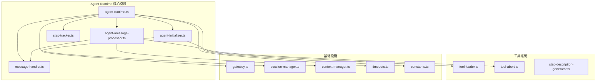
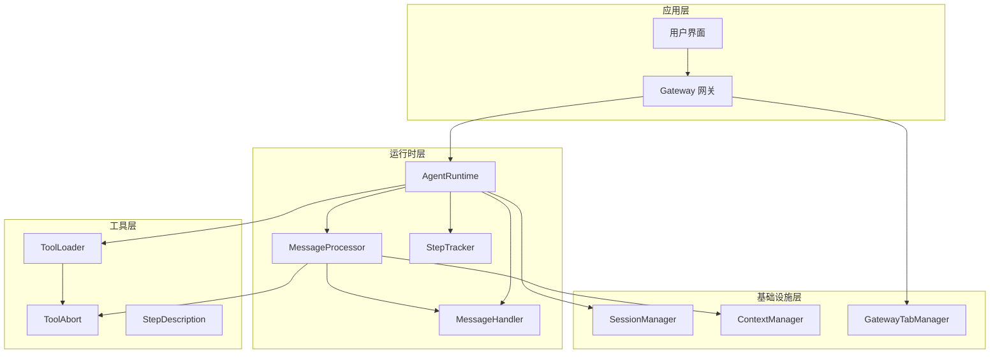
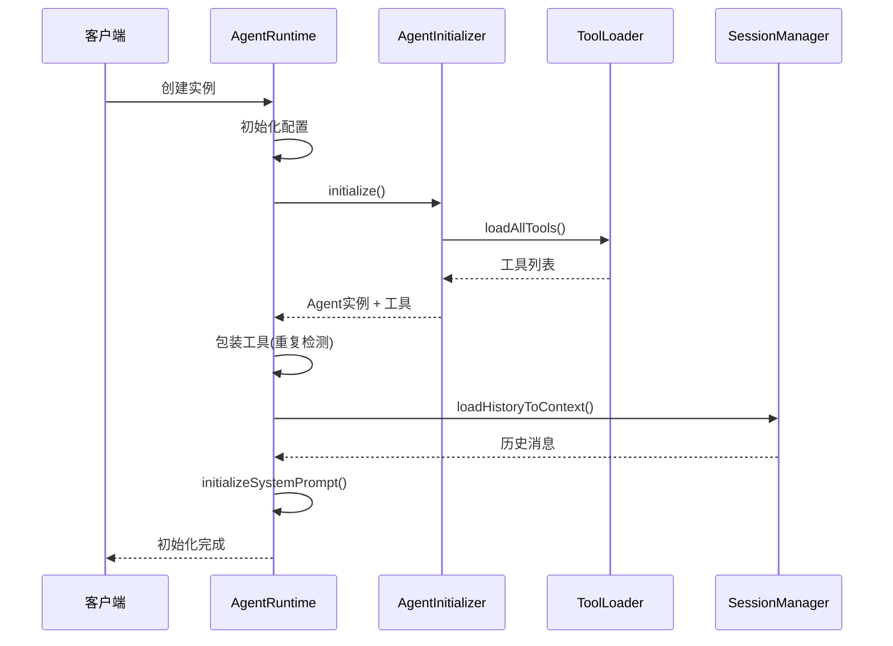
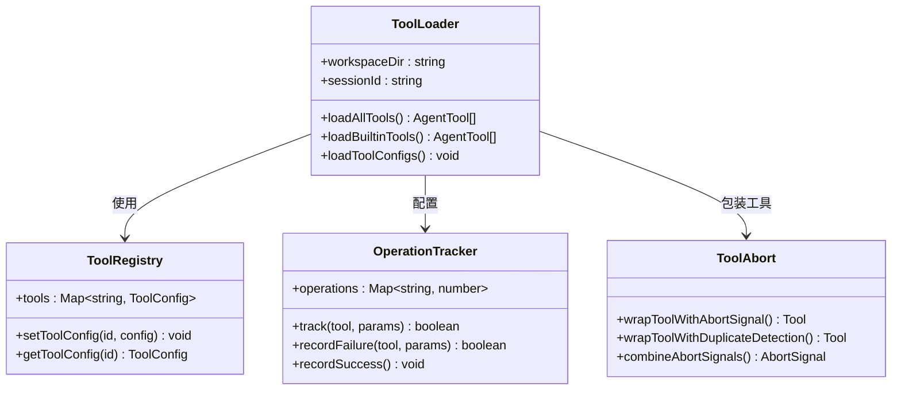
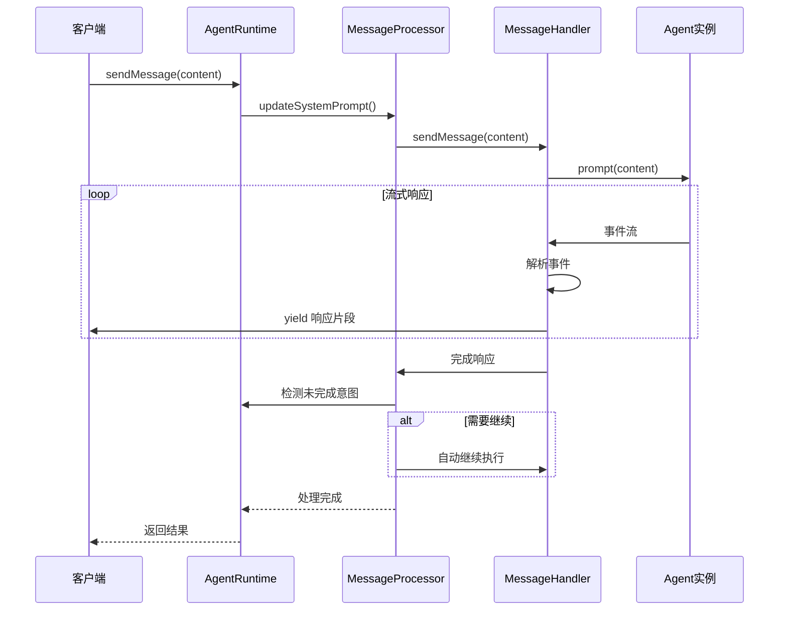
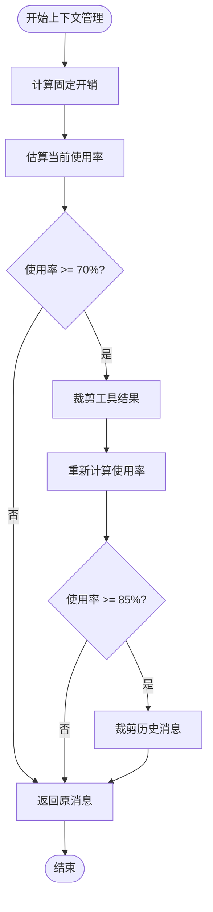
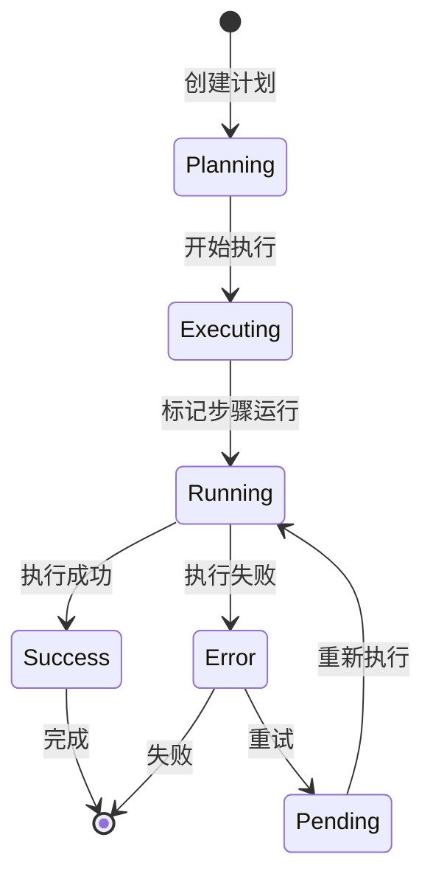

# Agent Runtime 运行时系统

<cite>
**本文档引用的文件**
- [agent-runtime.ts](file://src/main/agent-runtime/agent-runtime.ts)
- [agent-initializer.ts](file://src/main/agent-runtime/agent-initializer.ts)
- [agent-message-processor.ts](file://src/main/agent-runtime/agent-message-processor.ts)
- [message-handler.ts](file://src/main/agent-runtime/message-handler.ts)
- [types.ts](file://src/main/agent-runtime/types.ts)
- [step-tracker.ts](file://src/main/agent-runtime/step-tracker.ts)
- [step-description-generator.ts](file://src/main/agent-runtime/step-description-generator.ts)
- [tool-loader.ts](file://src/main/tools/registry/tool-loader.ts)
- [tool-abort.ts](file://src/main/tools/tool-abort.ts)
- [gateway.ts](file://src/main/gateway.ts)
- [session-manager.ts](file://src/main/session/session-manager.ts)
- [context-manager.ts](file://src/main/context/context-manager.ts)
- [timeouts.ts](file://src/main/config/timeouts.ts)
- [constants.ts](file://src/main/config/constants.ts)
</cite>

## 目录
1. [简介](#简介)
2. [项目结构](#项目结构)
3. [核心组件](#核心组件)
4. [架构概览](#架构概览)
5. [详细组件分析](#详细组件分析)
6. [依赖关系分析](#依赖关系分析)
7. [性能考虑](#性能考虑)
8. [故障排除指南](#故障排除指南)
9. [结论](#结论)

## 简介

Agent Runtime 运行时系统是 史丽慧小助理 项目的核心执行环境，负责管理 AI Agent 的完整生命周期，包括初始化、工具加载、消息处理、上下文管理和资源清理。该系统采用模块化设计，通过清晰的职责分离实现了高可扩展性和稳定性。

系统的主要特点包括：
- **多会话管理**：支持每个标签页独立的 Agent Runtime 实例
- **智能工具集成**：动态加载和管理各种工具插件
- **上下文压缩**：自动优化内存使用和性能
- **执行跟踪**：实时监控任务执行状态
- **错误处理**：完善的异常处理和恢复机制

## 项目结构

Agent Runtime 模块位于 `src/main/agent-runtime/` 目录下，采用功能模块化组织：



**图表来源**
- [agent-runtime.ts:1-909](file://src/main/agent-runtime/agent-runtime.ts#L1-L909)
- [agent-initializer.ts:1-188](file://src/main/agent-runtime/agent-initializer.ts#L1-L188)
- [agent-message-processor.ts:1-549](file://src/main/agent-runtime/agent-message-processor.ts#L1-L549)

**章节来源**
- [agent-runtime.ts:1-909](file://src/main/agent-runtime/agent-runtime.ts#L1-L909)
- [agent-initializer.ts:1-188](file://src/main/agent-runtime/agent-initializer.ts#L1-L188)
- [agent-message-processor.ts:1-549](file://src/main/agent-runtime/agent-message-processor.ts#L1-L549)

## 核心组件

### AgentRuntime 主控制器

AgentRuntime 是整个系统的中枢控制器，负责协调各个模块的协作。其核心职责包括：

- **生命周期管理**：初始化、配置、销毁 Agent 实例
- **工具集成**：动态加载和管理工具集合
- **消息路由**：处理用户输入并协调各组件执行
- **状态监控**：跟踪执行状态和性能指标

### AgentInitializer 初始化器

负责 Agent 的创建和配置，包括：
- 动态加载 @mariozechner/pi-agent-core
- 工具加载和配置
- 系统提示词构建
- Agent 实例创建

### MessageProcessor 消息处理器

处理消息发送和响应，具备：
- 流式输出支持
- 自动继续执行检测
- 工具调用管理
- 错误处理机制

### MessageHandler 消息处理器

底层消息处理，提供：
- 流式响应生成
- 执行步骤跟踪
- 取消信号支持
- 状态管理

**章节来源**
- [agent-runtime.ts:27-800](file://src/main/agent-runtime/agent-runtime.ts#L27-L800)
- [agent-initializer.ts:17-188](file://src/main/agent-runtime/agent-initializer.ts#L17-L188)
- [message-handler.ts:16-752](file://src/main/agent-runtime/message-handler.ts#L16-L752)

## 架构概览

Agent Runtime 采用分层架构设计，确保了良好的模块分离和可维护性：



**图表来源**
- [gateway.ts:29-772](file://src/main/gateway.ts#L29-L772)
- [agent-runtime.ts:1-909](file://src/main/agent-runtime/agent-runtime.ts#L1-L909)
- [agent-message-processor.ts:1-549](file://src/main/agent-runtime/agent-message-processor.ts#L1-L549)

## 详细组件分析

### AgentRuntime 生命周期管理

AgentRuntime 采用延迟初始化策略，确保资源的有效利用：



**图表来源**
- [agent-runtime.ts:193-229](file://src/main/agent-runtime/agent-runtime.ts#L193-L229)
- [agent-initializer.ts:42-71](file://src/main/agent-runtime/agent-initializer.ts#L42-L71)

#### 初始化流程详解

1. **配置加载**：从系统配置存储获取模型配置
2. **工具加载**：动态加载所有可用工具
3. **Agent 创建**：使用 pi-agent-core 创建 Agent 实例
4. **历史加载**：从会话管理器加载历史消息
5. **系统提示词**：构建并设置系统提示词

**章节来源**
- [agent-runtime.ts:65-188](file://src/main/agent-runtime/agent-runtime.ts#L65-L188)
- [agent-initializer.ts:42-138](file://src/main/agent-runtime/agent-initializer.ts#L42-L138)

### 工具加载机制

工具系统采用插件化架构，支持动态加载和配置：



**图表来源**
- [tool-loader.ts:40-312](file://src/main/tools/registry/tool-loader.ts#L40-L312)
- [tool-abort.ts:149-427](file://src/main/tools/tool-abort.ts#L149-L427)

#### 工具加载流程

1. **配置加载**：读取工具配置文件
2. **工具发现**：扫描内置工具定义
3. **动态导入**：按需加载工具实现
4. **配置应用**：应用用户自定义配置
5. **工具包装**：添加取消和重复检测支持

**章节来源**
- [tool-loader.ts:57-301](file://src/main/tools/registry/tool-loader.ts#L57-L301)
- [tool-abort.ts:280-427](file://src/main/tools/tool-abort.ts#L280-L427)

### 消息处理流程

消息处理采用流式架构，支持实时响应和中断：



**图表来源**
- [agent-message-processor.ts:345-548](file://src/main/agent-runtime/agent-message-processor.ts#L345-L548)
- [message-handler.ts:114-587](file://src/main/agent-runtime/message-handler.ts#L114-L587)

#### 消息处理关键特性

1. **流式输出**：实时传输响应片段
2. **中断支持**：支持用户主动停止
3. **自动继续**：智能检测并继续未完成的任务
4. **错误处理**：完善的异常捕获和恢复

**章节来源**
- [agent-message-processor.ts:345-548](file://src/main/agent-runtime/agent-message-processor.ts#L345-L548)
- [message-handler.ts:114-587](file://src/main/agent-runtime/message-handler.ts#L114-L587)

### 上下文管理

系统实现了智能的上下文压缩和管理：



**图表来源**
- [context-manager.ts:100-303](file://src/main/context/context-manager.ts#L100-L303)

#### 上下文管理策略

1. **固定开销计算**：系统提示词 + 工具定义
2. **渐进式压缩**：70%-85% 裁剪工具结果，>85% 裁剪历史
3. **智能保留**：优先保留重要的对话历史
4. **性能监控**：实时跟踪压缩效果

**章节来源**
- [context-manager.ts:100-303](file://src/main/context/context-manager.ts#L100-L303)

### 执行步骤跟踪

StepTracker 提供了完整的任务执行监控：



**图表来源**
- [step-tracker.ts:34-199](file://src/main/agent-runtime/step-tracker.ts#L34-L199)

#### 跟踪机制特点

1. **状态管理**：完整的执行状态跟踪
2. **重试机制**：自动重试失败的步骤
3. **进度报告**：实时更新执行进度
4. **错误处理**：详细的错误信息记录

**章节来源**
- [step-tracker.ts:34-199](file://src/main/agent-runtime/step-tracker.ts#L34-L199)

## 依赖关系分析

Agent Runtime 系统的依赖关系体现了清晰的分层架构：

```mermaid
graph TB
subgraph "外部依赖"
PAC[@mariozechner/pi-agent-core]
PAI[@mariozechner/pi-ai]
end
subgraph "内部模块"
AR[AgentRuntime]
AI[AgentInitializer]
MP[MessageProcessor]
MH[MessageHandler]
TL[ToolLoader]
TA[ToolAbort]
SM[SessionManager]
CM[ContextManager]
GW[Gateway]
end
subgraph "配置系统"
TS[Timeouts]
CT[Constants]
end
AR --> AI
AR --> MP
AR --> MH
AR --> TL
AR --> SM
MP --> MH
MP --> CM
AI --> PAC
AI --> PAI
TL --> TA
GW --> AR
GW --> SM
AR --> TS
AR --> CT
```

**图表来源**
- [agent-runtime.ts:11-22](file://src/main/agent-runtime/agent-runtime.ts#L11-L22)
- [gateway.ts:11-27](file://src/main/gateway.ts#L11-L27)

### 关键依赖关系

1. **@mariozechner/pi-agent-core**：Agent 核心功能
2. **@mariozechner/pi-ai**：AI 模型抽象
3. **SessionManager**：消息持久化
4. **ToolLoader**：工具系统集成
5. **Gateway**：会话管理协调

**章节来源**
- [agent-runtime.ts:11-22](file://src/main/agent-runtime/agent-runtime.ts#L11-L22)
- [gateway.ts:11-27](file://src/main/gateway.ts#L11-L27)

## 性能考虑

### 资源管理策略

Agent Runtime 实现了多种资源管理策略来优化性能：

1. **延迟初始化**：按需创建 Agent 实例
2. **内存优化**：智能上下文压缩
3. **并发控制**：工具执行串行化
4. **缓存机制**：模型配置和工具缓存

### 性能监控指标

系统提供了全面的性能监控能力：

- **Token 使用率**：实时跟踪上下文使用情况
- **执行时间**：监控各组件的处理时间
- **内存使用**：跟踪内存占用情况
- **错误率**：统计工具执行成功率

### 优化建议

1. **工具选择**：根据任务需求选择合适的工具组合
2. **上下文管理**：合理设置上下文窗口大小
3. **并发控制**：避免同时执行过多工具
4. **缓存策略**：充分利用工具和模型缓存

## 故障排除指南

### 常见问题及解决方案

#### Agent 初始化失败

**症状**：AgentRuntime 构造函数抛出异常
**原因**：模型配置错误或工具加载失败
**解决方案**：
1. 检查 API 密钥和基础 URL 配置
2. 验证工具配置文件
3. 查看详细的错误日志

#### 消息处理卡顿

**症状**：sendMessage 调用长时间无响应
**原因**：工具执行超时或网络问题
**解决方案**：
1. 检查工具执行时间限制
2. 验证网络连接状态
3. 使用 stopGeneration() 中断当前操作

#### 上下文溢出

**症状**：系统提示词初始化失败
**原因**：上下文窗口不足
**解决方案**：
1. 增加模型上下文窗口
2. 启用上下文压缩
3. 清理历史消息

### 调试技巧

1. **启用详细日志**：查看各组件的详细执行日志
2. **使用调试文件**：captured-prompt.md 保存完整请求
3. **监控执行状态**：通过 getAgentState() 检查 Agent 状态
4. **性能分析**：使用性能监控指标识别瓶颈

**章节来源**
- [agent-runtime.ts:537-564](file://src/main/agent-runtime/agent-runtime.ts#L537-L564)
- [message-handler.ts:592-624](file://src/main/agent-runtime/message-handler.ts#L592-L624)

## 结论

Agent Runtime 运行时系统通过精心设计的架构和实现，为 史丽慧小助理 提供了稳定可靠的 AI Agent 执行环境。系统的关键优势包括：

1. **模块化设计**：清晰的职责分离和依赖管理
2. **智能资源管理**：自动化的上下文压缩和内存优化
3. **强大的工具系统**：灵活的工具加载和执行机制
4. **完善的错误处理**：全面的异常捕获和恢复机制
5. **实时监控能力**：详细的执行状态跟踪和性能监控

该系统为 史丽慧小助理 的多标签页并发场景提供了坚实的基础，支持高效的资源管理和智能的工具选择执行编排。通过持续的优化和扩展，Agent Runtime 将能够更好地支持复杂的 AI 应用场景。