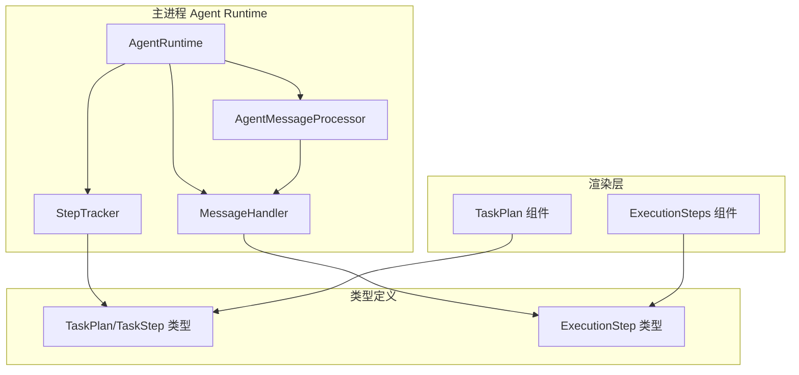
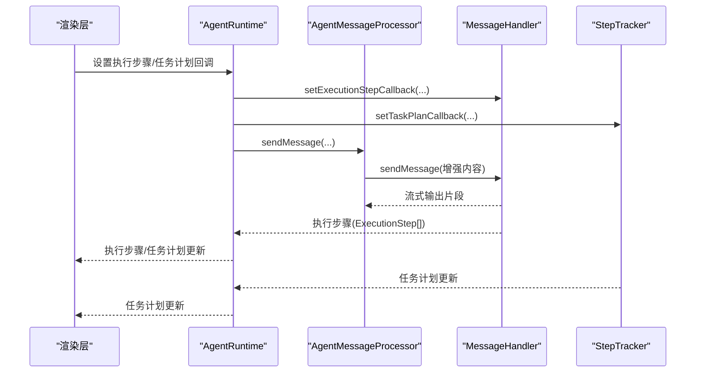
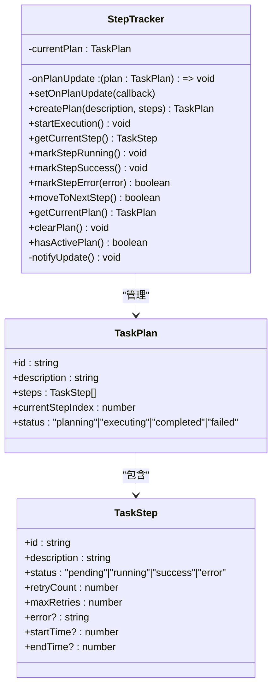
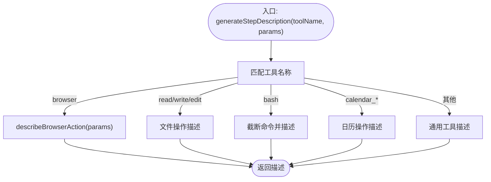
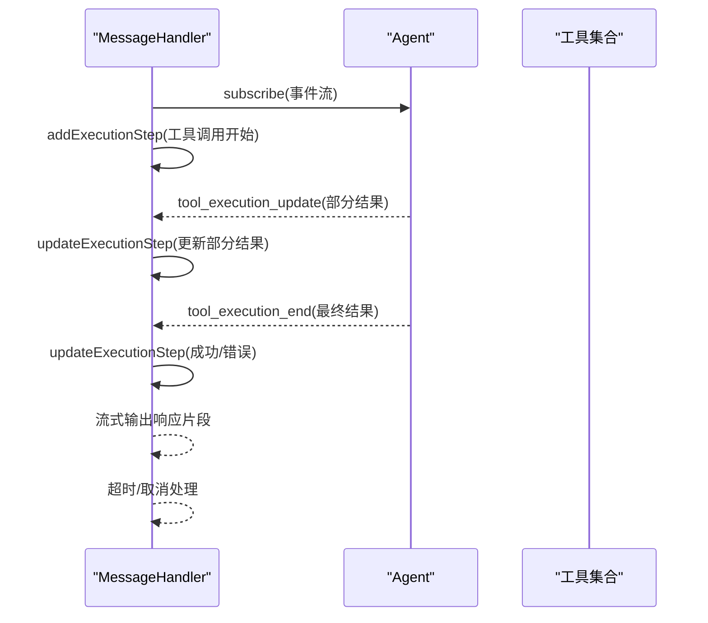
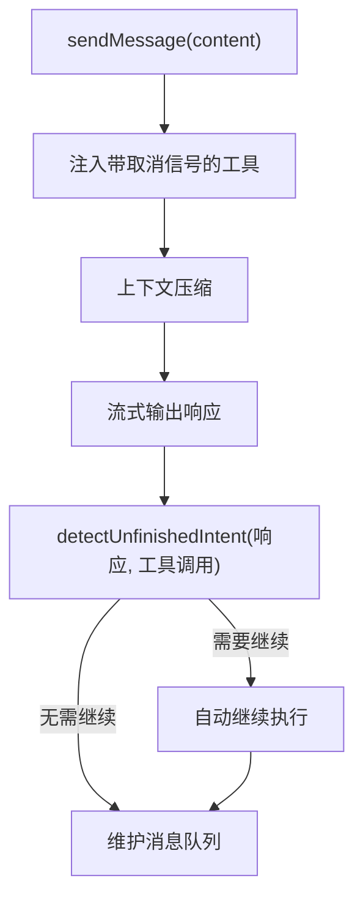
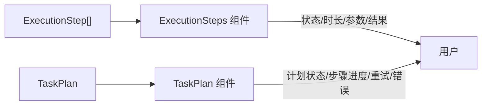
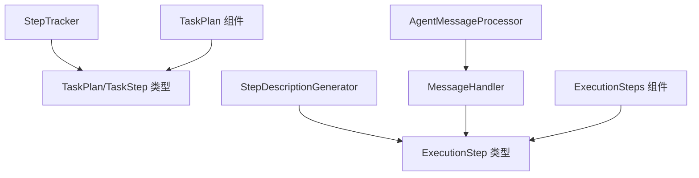

# 执行跟踪系统

<cite>
**本文引用的文件**
- [step-tracker.ts](file://src/main/agent-runtime/step-tracker.ts)
- [step-description-generator.ts](file://src/main/agent-runtime/step-description-generator.ts)
- [agent-runtime.ts](file://src/main/agent-runtime/agent-runtime.ts)
- [message-handler.ts](file://src/main/agent-runtime/message-handler.ts)
- [agent-message-processor.ts](file://src/main/agent-runtime/agent-message-processor.ts)
- [types.ts](file://src/main/agent-runtime/types.ts)
- [task-plan.ts](file://src/types/task-plan.ts)
- [message.ts](file://src/types/message.ts)
- [ExecutionSteps.tsx](file://src/renderer/components/ExecutionSteps.tsx)
- [TaskPlan.tsx](file://src/renderer/components/TaskPlan.tsx)
</cite>

## 目录
1. [简介](#简介)
2. [项目结构](#项目结构)
3. [核心组件](#核心组件)
4. [架构总览](#架构总览)
5. [详细组件分析](#详细组件分析)
6. [依赖关系分析](#依赖关系分析)
7. [性能考量](#性能考量)
8. [故障排查指南](#故障排查指南)
9. [结论](#结论)
10. [附录](#附录)

## 简介
本文件面向 Agent Runtime 的执行跟踪系统，聚焦 StepTracker 与 StepDescriptionGenerator 的设计与实现，系统性阐述执行步骤的采集、跟踪、描述生成与状态管理；解释如何支持多 Agent 协作、任务分解与进度可视化；说明智能步骤描述生成与执行历史记录的机制；并给出与消息处理系统的集成方式、实时进度反馈与任务计划动态调整能力。文档同时提供调试方法与性能优化建议，帮助开发者快速理解与扩展该系统。

## 项目结构
执行跟踪系统位于主进程 Agent Runtime 子模块中，围绕“任务计划”和“执行步骤”两条主线展开：
- 任务计划与步骤状态管理：由 StepTracker 负责，提供计划生命周期、步骤推进、重试与失败判定、回调通知等能力。
- 步骤描述生成：由 StepDescriptionGenerator 负责，将工具名称与参数映射为人类可读的描述文本。
- 消息处理与执行步骤采集：由 MessageHandler 与 AgentMessageProcessor 负责，负责工具调用事件的采集、状态更新与流式输出。
- 渲染层展示：ExecutionSteps.tsx 与 TaskPlan.tsx 负责将执行步骤与任务计划以 UI 形式呈现。

图表来源
- [agent-runtime.ts:27-188](file://src/main/agent-runtime/agent-runtime.ts#L27-L188)
- [message-handler.ts:16-58](file://src/main/agent-runtime/message-handler.ts#L16-L58)
- [agent-message-processor.ts:20-45](file://src/main/agent-runtime/agent-message-processor.ts#L20-L45)
- [step-tracker.ts:34-198](file://src/main/agent-runtime/step-tracker.ts#L34-L198)
- [task-plan.ts:5-22](file://src/types/task-plan.ts#L5-L22)
- [message.ts:15-25](file://src/types/message.ts#L15-L25)
- [ExecutionSteps.tsx:12-121](file://src/renderer/components/ExecutionSteps.tsx#L12-L121)
- [TaskPlan.tsx:12-105](file://src/renderer/components/TaskPlan.tsx#L12-L105)

章节来源
- [agent-runtime.ts:27-188](file://src/main/agent-runtime/agent-runtime.ts#L27-L188)
- [step-tracker.ts:34-198](file://src/main/agent-runtime/step-tracker.ts#L34-L198)
- [message-handler.ts:16-58](file://src/main/agent-runtime/message-handler.ts#L16-L58)
- [agent-message-processor.ts:20-45](file://src/main/agent-runtime/agent-message-processor.ts#L20-L45)
- [task-plan.ts:5-22](file://src/types/task-plan.ts#L5-L22)
- [message.ts:15-25](file://src/types/message.ts#L15-L25)
- [ExecutionSteps.tsx:12-121](file://src/renderer/components/ExecutionSteps.tsx#L12-L121)
- [TaskPlan.tsx:12-105](file://src/renderer/components/TaskPlan.tsx#L12-L105)

## 核心组件
- StepTracker：任务计划与步骤状态管理器，负责计划创建、执行启动、步骤推进、重试与失败判定、回调通知。
- StepDescriptionGenerator：步骤描述生成器，将工具名称与参数映射为人类可读描述。
- MessageHandler：消息处理与执行步骤采集器，负责工具调用事件的收集、状态更新、流式输出与超时/取消控制。
- AgentMessageProcessor：消息发送与自动继续逻辑，负责上下文管理、工具注入、自动继续检测与消息队列维护。
- 渲染组件：ExecutionSteps.tsx 与 TaskPlan.tsx，分别用于执行步骤与任务计划的 UI 展示。

章节来源
- [step-tracker.ts:34-198](file://src/main/agent-runtime/step-tracker.ts#L34-L198)
- [step-description-generator.ts:14-111](file://src/main/agent-runtime/step-description-generator.ts#L14-L111)
- [message-handler.ts:16-58](file://src/main/agent-runtime/message-handler.ts#L16-L58)
- [agent-message-processor.ts:20-45](file://src/main/agent-runtime/agent-message-processor.ts#L20-L45)
- [ExecutionSteps.tsx:12-121](file://src/renderer/components/ExecutionSteps.tsx#L12-L121)
- [TaskPlan.tsx:12-105](file://src/renderer/components/TaskPlan.tsx#L12-L105)

## 架构总览
执行跟踪系统围绕“任务计划”和“执行步骤”两条主线协同工作：
- 任务计划：StepTracker 维护 TaskPlan 与 TaskStep，提供状态推进与回调通知。
- 执行步骤：MessageHandler 采集工具调用事件，生成 ExecutionStep 并通过回调传递给上层；StepDescriptionGenerator 将工具名称与参数转换为描述文本，用于任务计划的步骤描述生成。
- 渲染层：UI 组件接收来自 StepTracker 与 MessageHandler 的数据，进行进度与步骤可视化。

图表来源
- [agent-runtime.ts:760-786](file://src/main/agent-runtime/agent-runtime.ts#L760-L786)
- [agent-message-processor.ts:440-451](file://src/main/agent-runtime/agent-message-processor.ts#L440-L451)
- [message-handler.ts:114-140](file://src/main/agent-runtime/message-handler.ts#L114-L140)
- [step-tracker.ts:38-43](file://src/main/agent-runtime/step-tracker.ts#L38-L43)

章节来源
- [agent-runtime.ts:760-786](file://src/main/agent-runtime/agent-runtime.ts#L760-L786)
- [agent-message-processor.ts:440-451](file://src/main/agent-runtime/agent-message-processor.ts#L440-L451)
- [message-handler.ts:114-140](file://src/main/agent-runtime/message-handler.ts#L114-L140)
- [step-tracker.ts:38-43](file://src/main/agent-runtime/step-tracker.ts#L38-L43)

## 详细组件分析

### StepTracker 设计与实现
StepTracker 负责任务计划与步骤的状态管理，提供计划生命周期、步骤推进、重试与失败判定、回调通知等能力。其关键职责包括：
- 计划创建：根据描述与步骤列表生成 TaskPlan，初始状态为 planning。
- 执行启动：将计划状态切换为 executing。
- 步骤推进：getCurrentStep 获取当前步骤，markStepRunning/markStepSuccess/markStepError 更新状态；moveToNextStep 推进到下一步。
- 重试与失败：markStepError 增加重试计数，若超过最大重试次数则将计划状态设为 failed；否则重置步骤状态为 pending。
- 回调通知：notifyUpdate 通过 setOnPlanUpdate 注册的回调向外部推送最新计划状态。

图表来源
- [step-tracker.ts:34-198](file://src/main/agent-runtime/step-tracker.ts#L34-L198)
- [task-plan.ts:5-22](file://src/types/task-plan.ts#L5-L22)

章节来源
- [step-tracker.ts:34-198](file://src/main/agent-runtime/step-tracker.ts#L34-L198)
- [task-plan.ts:5-22](file://src/types/task-plan.ts#L5-L22)

### StepDescriptionGenerator 设计与实现
StepDescriptionGenerator 将工具名称与参数映射为人类可读的描述文本，覆盖常见工具（如 browser、read、write、edit、bash、calendar_* 等），并对浏览器操作进行细粒度描述（如 open、navigate、act、wait、screenshot 等）。对于未知工具，回退为通用描述。

图表来源
- [step-description-generator.ts:14-46](file://src/main/agent-runtime/step-description-generator.ts#L14-L46)
- [step-description-generator.ts:54-110](file://src/main/agent-runtime/step-description-generator.ts#L54-L110)

章节来源
- [step-description-generator.ts:14-111](file://src/main/agent-runtime/step-description-generator.ts#L14-L111)

### 执行步骤采集与状态更新（MessageHandler）
MessageHandler 负责消息发送与执行步骤采集，关键流程如下：
- 初始化：设置 Agent 实例、生成 AbortController、注册 onAbortControllerCreated 回调，以便在工具执行前注入取消信号。
- 事件驱动：监听 agent 的事件流，识别 tool_execution_start/tool_execution_update/tool_execution_end，构建 ExecutionStep 并通过 addExecutionStep/updateExecutionStep 更新状态与结果。
- 流式输出：将 AI 响应分片逐块产出，支持超时与取消控制。
- 错误检测：detectErrorInResult 基于多种模式检测工具执行结果中的错误，确保步骤状态准确。

图表来源
- [message-handler.ts:114-140](file://src/main/agent-runtime/message-handler.ts#L114-L140)
- [message-handler.ts:277-323](file://src/main/agent-runtime/message-handler.ts#L277-L323)
- [message-handler.ts:589-624](file://src/main/agent-runtime/message-handler.ts#L589-L624)

章节来源
- [message-handler.ts:114-140](file://src/main/agent-runtime/message-handler.ts#L114-L140)
- [message-handler.ts:277-323](file://src/main/agent-runtime/message-handler.ts#L277-L323)
- [message-handler.ts:589-624](file://src/main/agent-runtime/message-handler.ts#L589-L624)

### 任务计划与步骤推进（AgentMessageProcessor）
AgentMessageProcessor 在消息发送过程中负责：
- 工具注入：在 AbortController 创建后，将工具包装为带取消信号的版本并注入 Agent.state.tools。
- 上下文管理：调用 manageContext 对历史消息进行压缩，维持上下文窗口。
- 自动继续：detectUnfinishedIntent 基于响应内容与工具调用情况判断是否需要继续执行，并自动发起二次调用。
- 消息队列维护：在发送完成后调用维护回调，确保消息轮次不超过阈值。

图表来源
- [agent-message-processor.ts:440-451](file://src/main/agent-runtime/agent-message-processor.ts#L440-L451)
- [agent-message-processor.ts:484-505](file://src/main/agent-runtime/agent-message-processor.ts#L484-L505)
- [agent-message-processor.ts:507-541](file://src/main/agent-runtime/agent-message-processor.ts#L507-L541)

章节来源
- [agent-message-processor.ts:440-451](file://src/main/agent-runtime/agent-message-processor.ts#L440-L451)
- [agent-message-processor.ts:484-505](file://src/main/agent-runtime/agent-message-processor.ts#L484-L505)
- [agent-message-processor.ts:507-541](file://src/main/agent-runtime/agent-message-processor.ts#L507-L541)

### 渲染层：执行步骤与任务计划可视化
- ExecutionSteps.tsx：展示执行步骤列表，支持展开/折叠、状态图标、时长显示、参数与结果查看。
- TaskPlan.tsx：展示任务计划的整体状态与步骤进度，支持当前步骤高亮、重试次数与错误信息展示。

图表来源
- [ExecutionSteps.tsx:12-121](file://src/renderer/components/ExecutionSteps.tsx#L12-L121)
- [TaskPlan.tsx:12-105](file://src/renderer/components/TaskPlan.tsx#L12-L105)

章节来源
- [ExecutionSteps.tsx:12-121](file://src/renderer/components/ExecutionSteps.tsx#L12-L121)
- [TaskPlan.tsx:12-105](file://src/renderer/components/TaskPlan.tsx#L12-L105)

## 依赖关系分析
- StepTracker 依赖 TaskPlan/TaskStep 类型，提供计划生命周期与状态推进。
- StepDescriptionGenerator 依赖工具名称与参数，生成人类可读描述，用于任务计划步骤描述。
- MessageHandler 依赖 Agent 事件流与 ExecutionStep 类型，负责步骤采集与状态更新。
- AgentMessageProcessor 依赖 MessageHandler 与工具集合，负责工具注入、上下文管理与自动继续。
- 渲染组件依赖 ExecutionStep 与 TaskPlan 类型，负责 UI 展示。

图表来源
- [step-tracker.ts:34-198](file://src/main/agent-runtime/step-tracker.ts#L34-L198)
- [step-description-generator.ts:14-111](file://src/main/agent-runtime/step-description-generator.ts#L14-L111)
- [message-handler.ts:16-58](file://src/main/agent-runtime/message-handler.ts#L16-L58)
- [agent-message-processor.ts:20-45](file://src/main/agent-runtime/agent-message-processor.ts#L20-L45)
- [task-plan.ts:5-22](file://src/types/task-plan.ts#L5-L22)
- [message.ts:15-25](file://src/types/message.ts#L15-L25)
- [ExecutionSteps.tsx:12-121](file://src/renderer/components/ExecutionSteps.tsx#L12-L121)
- [TaskPlan.tsx:12-105](file://src/renderer/components/TaskPlan.tsx#L12-L105)

章节来源
- [step-tracker.ts:34-198](file://src/main/agent-runtime/step-tracker.ts#L34-L198)
- [step-description-generator.ts:14-111](file://src/main/agent-runtime/step-description-generator.ts#L14-L111)
- [message-handler.ts:16-58](file://src/main/agent-runtime/message-handler.ts#L16-L58)
- [agent-message-processor.ts:20-45](file://src/main/agent-runtime/agent-message-processor.ts#L20-L45)
- [task-plan.ts:5-22](file://src/types/task-plan.ts#L5-L22)
- [message.ts:15-25](file://src/types/message.ts#L15-L25)
- [ExecutionSteps.tsx:12-121](file://src/renderer/components/ExecutionSteps.tsx#L12-L121)
- [TaskPlan.tsx:12-105](file://src/renderer/components/TaskPlan.tsx#L12-L105)

## 性能考量
- 流式输出与事件监听：MessageHandler 采用事件驱动与流式输出，避免一次性累积大量内容，降低内存占用与延迟。
- 上下文压缩：AgentMessageProcessor 调用 manageContext 对历史消息进行压缩，控制上下文窗口，提升响应速度与稳定性。
- 自动继续检测：detectUnfinishedIntent 仅对尾部响应进行判断，减少不必要的 AI 调用。
- 重试策略：StepTracker 的 maxRetries 控制重试上限，防止无限重试导致资源浪费。
- 渲染层优化：ExecutionSteps.tsx 对长结果进行截断显示，避免 UI 渲染压力过大。

[本节为通用性能建议，不直接分析具体文件，故无章节来源]

## 故障排查指南
- 生成被中断或超时
  - 现象：MessageHandler 在流式输出循环中检测到超时或 AbortController 被触发，输出“已停止”提示。
  - 排查：检查 TIMEOUTS.AGENT_MESSAGE_TIMEOUT 配置与网络环境；确认是否用户主动停止。
  - 参考
    - [message-handler.ts:482-504](file://src/main/agent-runtime/message-handler.ts#L482-L504)
    - [message-handler.ts:589-624](file://src/main/agent-runtime/message-handler.ts#L589-L624)
- 步骤状态异常
  - 现象：工具执行结束但状态未更新或错误未正确识别。
  - 排查：确认 tool_execution_end 事件是否到达；检查 detectErrorInResult 的错误模式匹配。
  - 参考
    - [message-handler.ts:307-323](file://src/main/agent-runtime/message-handler.ts#L307-L323)
    - [message-handler.ts:700-743](file://src/main/agent-runtime/message-handler.ts#L700-L743)
- 计划失败与重试
  - 现象：步骤多次失败后计划变为 failed。
  - 排查：检查 maxRetries 与 retryCount；确认是否达到最大重试次数。
  - 参考
    - [step-tracker.ts:118-145](file://src/main/agent-runtime/step-tracker.ts#L118-L145)
    - [step-tracker.ts:132-141](file://src/main/agent-runtime/step-tracker.ts#L132-L141)
- UI 未更新
  - 现象：执行步骤或任务计划未在界面显示。
  - 排查：确认 setExecutionStepCallback 与 setTaskPlanCallback 是否正确设置；检查回调是否被调用。
  - 参考
    - [agent-runtime.ts:760-786](file://src/main/agent-runtime/agent-runtime.ts#L760-L786)
    - [message-handler.ts:47-49](file://src/main/agent-runtime/message-handler.ts#L47-L49)
    - [step-tracker.ts:38-43](file://src/main/agent-runtime/step-tracker.ts#L38-L43)

章节来源
- [message-handler.ts:482-504](file://src/main/agent-runtime/message-handler.ts#L482-L504)
- [message-handler.ts:589-624](file://src/main/agent-runtime/message-handler.ts#L589-L624)
- [message-handler.ts:307-323](file://src/main/agent-runtime/message-handler.ts#L307-L323)
- [message-handler.ts:700-743](file://src/main/agent-runtime/message-handler.ts#L700-L743)
- [step-tracker.ts:118-145](file://src/main/agent-runtime/step-tracker.ts#L118-L145)
- [step-tracker.ts:132-141](file://src/main/agent-runtime/step-tracker.ts#L132-L141)
- [agent-runtime.ts:760-786](file://src/main/agent-runtime/agent-runtime.ts#L760-L786)

## 结论
执行跟踪系统通过 StepTracker 与 StepDescriptionGenerator 实现任务计划与步骤描述的可靠管理，结合 MessageHandler 与 AgentMessageProcessor 的事件驱动采集与自动继续逻辑，形成从“计划制定—步骤执行—状态更新—可视化展示”的完整闭环。系统支持多 Agent 协作、任务分解与进度可视化，并提供智能描述生成与执行历史记录能力。通过合理的超时/取消控制、上下文压缩与重试策略，系统在保证稳定性的同时兼顾性能与用户体验。

[本节为总结性内容，不直接分析具体文件，故无章节来源]

## 附录

### 关键数据结构与类型
- TaskPlan/TaskStep：任务计划与步骤的状态与元数据。
- ExecutionStep：工具执行步骤的描述、状态、参数、结果与时间信息。
- AgentRuntimeConfig/AgentStateInfo：运行时配置与 Agent 状态信息。

章节来源
- [task-plan.ts:5-22](file://src/types/task-plan.ts#L5-L22)
- [message.ts:15-25](file://src/types/message.ts#L15-L25)
- [types.ts:11-39](file://src/main/agent-runtime/types.ts#L11-L39)

### 代码示例路径（不含具体代码内容）
- 任务计划创建与推进
  - [step-tracker.ts:48-65](file://src/main/agent-runtime/step-tracker.ts#L48-L65)
  - [step-tracker.ts:70-77](file://src/main/agent-runtime/step-tracker.ts#L70-L77)
  - [step-tracker.ts:150-166](file://src/main/agent-runtime/step-tracker.ts#L150-L166)
- 步骤描述生成
  - [step-description-generator.ts:14-46](file://src/main/agent-runtime/step-description-generator.ts#L14-L46)
  - [step-description-generator.ts:54-110](file://src/main/agent-runtime/step-description-generator.ts#L54-L110)
- 执行步骤采集与状态更新
  - [message-handler.ts:277-323](file://src/main/agent-runtime/message-handler.ts#L277-L323)
  - [message-handler.ts:657-675](file://src/main/agent-runtime/message-handler.ts#L657-L675)
- 任务计划回调设置与获取
  - [agent-runtime.ts:760-786](file://src/main/agent-runtime/agent-runtime.ts#L760-L786)