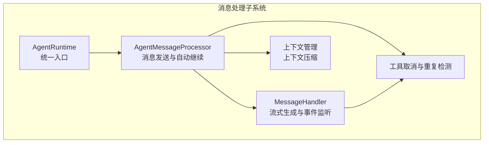
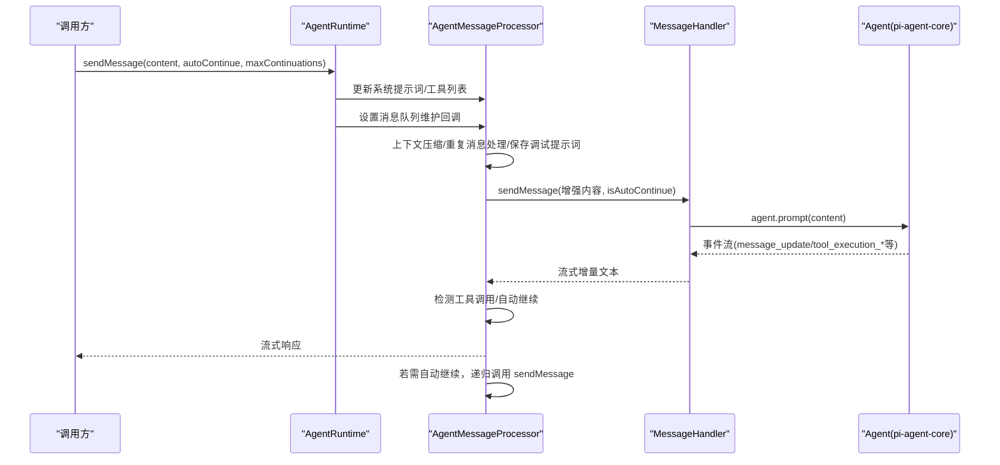
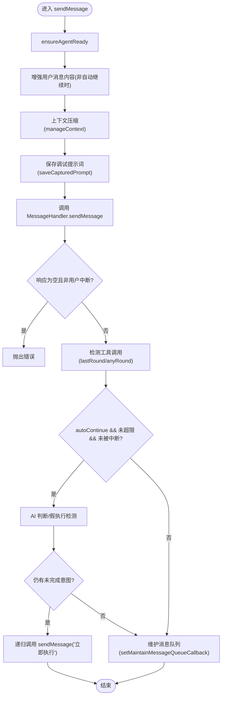
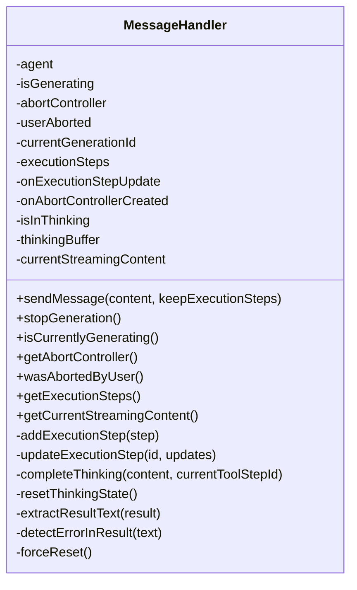
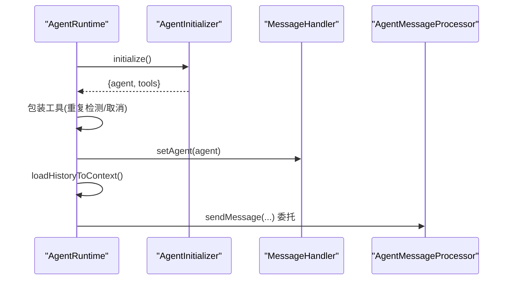
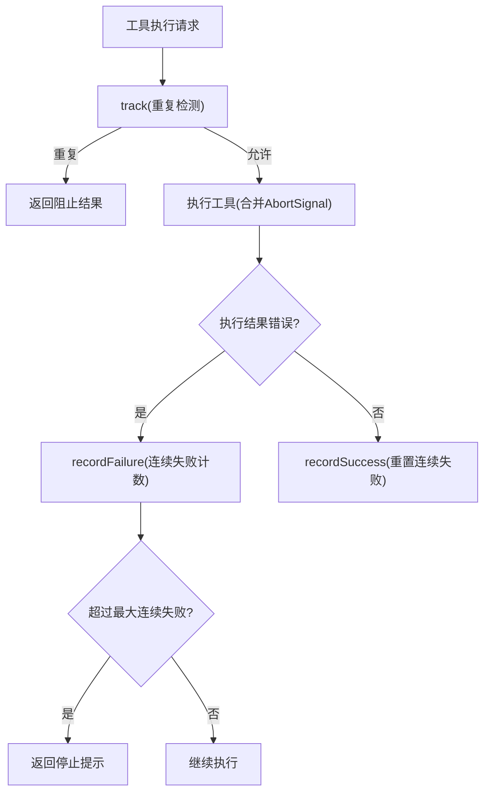
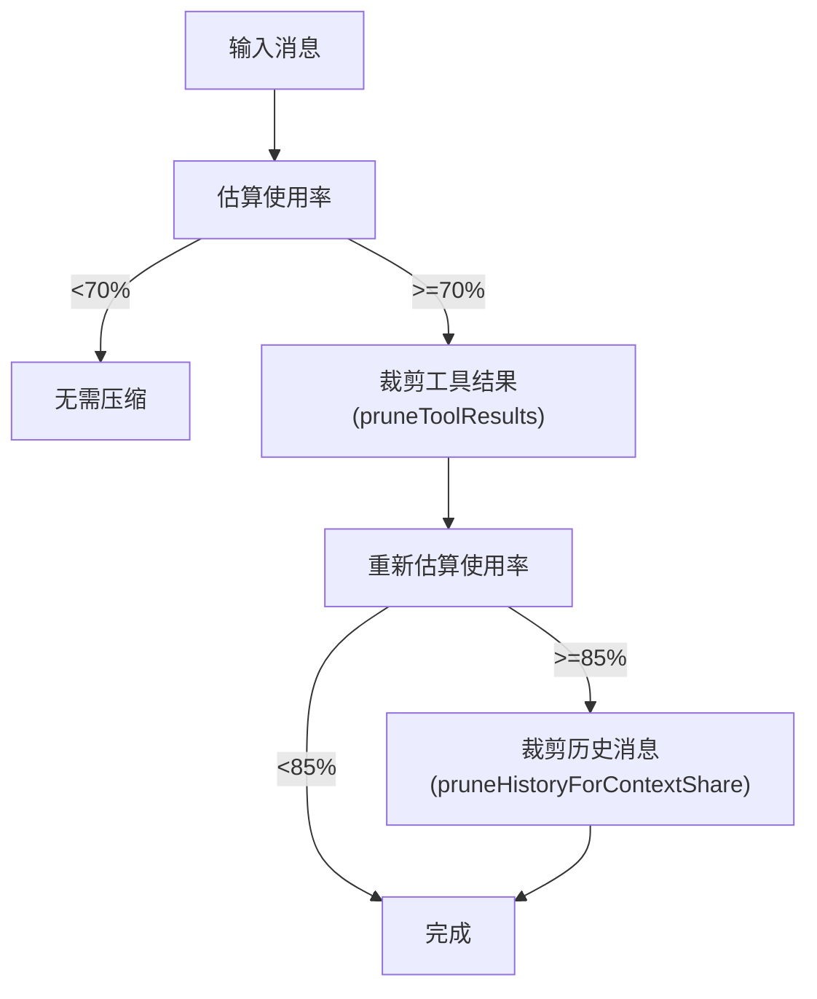
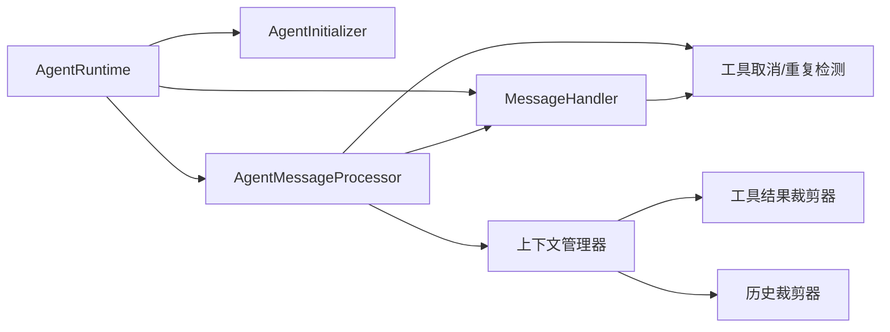

# 消息处理系统

<cite>
**本文引用的文件**
- [agent-message-processor.ts](file://src/main/agent-runtime/agent-message-processor.ts)
- [message-handler.ts](file://src/main/agent-runtime/message-handler.ts)
- [agent-runtime.ts](file://src/main/agent-runtime/agent-runtime.ts)
- [types.ts](file://src/main/agent-runtime/types.ts)
- [tool-abort.ts](file://src/main/tools/tool-abort.ts)
- [context-manager.ts](file://src/main/context/context-manager.ts)
- [history-pruner.ts](file://src/main/context/history-pruner.ts)
- [tool-result-pruner.ts](file://src/main/context/tool-result-pruner.ts)
- [timeouts.ts](file://src/main/config/timeouts.ts)
- [agent-initializer.ts](file://src/main/agent-runtime/agent-initializer.ts)
- [index.ts](file://src/main/agent-runtime/index.ts)
</cite>

## 目录
1. [简介](#简介)
2. [项目结构](#项目结构)
3. [核心组件](#核心组件)
4. [架构总览](#架构总览)
5. [详细组件分析](#详细组件分析)
6. [依赖关系分析](#依赖关系分析)
7. [性能考量](#性能考量)
8. [故障排查指南](#故障排查指南)
9. [结论](#结论)
10. [附录](#附录)

## 简介
本技术文档围绕 Agent Runtime 的消息处理系统，系统性阐述 AgentMessageProcessor 与 MessageHandler 的协作机制，覆盖消息接收、预处理、工具调用、结果返回、流式响应处理、自动继续机制、错误处理、超时控制与中断、以及与 Agent 状态管理、上下文维护和历史记录的集成方式。文档提供可视化图示与分层讲解，帮助读者快速理解并高效定位问题与优化性能。

## 项目结构
消息处理系统位于 src/main/agent-runtime 目录，核心文件包括：
- AgentMessageProcessor：负责消息发送、自动继续、上下文压缩、调试提示词保存等
- MessageHandler：负责流式生成、工具调用事件监听、执行步骤跟踪、超时与中断控制
- AgentRuntime：对外统一入口，协调初始化、系统提示词、工具包装、消息队列维护
- 工具与上下文：工具取消与重复检测、上下文压缩（工具结果裁剪、历史消息裁剪）

图表来源
- [agent-runtime.ts:658-688](file://src/main/agent-runtime/agent-runtime.ts#L658-L688)
- [agent-message-processor.ts:20-45](file://src/main/agent-runtime/agent-message-processor.ts#L20-L45)
- [message-handler.ts:16-35](file://src/main/agent-runtime/message-handler.ts#L16-L35)
- [context-manager.ts:100-303](file://src/main/context/context-manager.ts#L100-L303)
- [tool-abort.ts:101-144](file://src/main/tools/tool-abort.ts#L101-L144)

章节来源
- [agent-runtime.ts:658-688](file://src/main/agent-runtime/agent-runtime.ts#L658-L688)
- [agent-message-processor.ts:20-45](file://src/main/agent-runtime/agent-message-processor.ts#L20-L45)
- [message-handler.ts:16-35](file://src/main/agent-runtime/message-handler.ts#L16-L35)
- [context-manager.ts:100-303](file://src/main/context/context-manager.ts#L100-L303)
- [tool-abort.ts:101-144](file://src/main/tools/tool-abort.ts#L101-L144)

## 核心组件
- AgentRuntime：对外提供 sendMessage 异步生成器接口，负责系统提示词初始化、工具包装、消息队列维护与 Agent 状态修复。
- AgentMessageProcessor：封装消息发送流程，负责上下文压缩、重复消息处理、调试提示词保存、自动继续检测与触发。
- MessageHandler：实现流式输出、事件驱动的工具调用跟踪、超时与中断控制、执行步骤可视化。
- 工具取消与重复检测：为工具添加 AbortSignal 支持，合并运行时与工具自身的取消信号；对重复操作与连续失败进行防护。
- 上下文管理：根据使用率阈值进行工具结果裁剪与历史消息裁剪，保障上下文窗口不超限。

章节来源
- [agent-runtime.ts:658-688](file://src/main/agent-runtime/agent-runtime.ts#L658-L688)
- [agent-message-processor.ts:20-45](file://src/main/agent-runtime/agent-message-processor.ts#L20-L45)
- [message-handler.ts:16-35](file://src/main/agent-runtime/message-handler.ts#L16-L35)
- [tool-abort.ts:101-144](file://src/main/tools/tool-abort.ts#L101-L144)
- [context-manager.ts:100-303](file://src/main/context/context-manager.ts#L100-L303)

## 架构总览
消息处理系统采用“运行时协调 + 消息处理器 + 流式处理器”的三层协作：
- AgentRuntime：初始化 Agent、系统提示词与工具，暴露 sendMessage 异步生成器，负责状态修复与消息队列维护。
- AgentMessageProcessor：在 sendMessage 中进行上下文压缩、重复消息处理、保存调试提示词、调用 MessageHandler 并检测自动继续。
- MessageHandler：订阅 Agent 事件，解析 text_delta、工具调用、工具结果，实现流式输出、超时与中断控制、执行步骤可视化。

图表来源
- [agent-runtime.ts:661-687](file://src/main/agent-runtime/agent-runtime.ts#L661-L687)
- [agent-message-processor.ts:345-547](file://src/main/agent-runtime/agent-message-processor.ts#L345-L547)
- [message-handler.ts:114-587](file://src/main/agent-runtime/message-handler.ts#L114-L587)

章节来源
- [agent-runtime.ts:661-687](file://src/main/agent-runtime/agent-runtime.ts#L661-L687)
- [agent-message-processor.ts:345-547](file://src/main/agent-runtime/agent-message-processor.ts#L345-L547)
- [message-handler.ts:114-587](file://src/main/agent-runtime/message-handler.ts#L114-L587)

## 详细组件分析

### AgentMessageProcessor：消息发送与自动继续
职责与关键点：
- 维护 MessageHandler、Agent 实例、运行时配置、系统提示词与工具列表
- 上下文压缩：调用 manageContext，按阈值裁剪工具结果与历史消息
- 重复消息处理：若最后一条用户消息与当前内容相同，删除重复项
- 调试提示词保存：在发送前保存完整 prompt 到 .deepbot/debug/captured-prompt.md
- 自动继续检测：基于“最后轮次工具调用”“假执行关键词”“AI 判断”三类策略综合判定
- 递归自动继续：当检测到未完成意图且未超最大次数时，自动发送“立即执行”指令

图表来源
- [agent-message-processor.ts:345-547](file://src/main/agent-runtime/agent-message-processor.ts#L345-L547)

章节来源
- [agent-message-processor.ts:345-547](file://src/main/agent-runtime/agent-message-processor.ts#L345-L547)
- [context-manager.ts:100-303](file://src/main/context/context-manager.ts#L100-L303)

### MessageHandler：流式生成与事件驱动
职责与关键点：
- 流式输出：基于 Agent 事件流 text_delta，逐块产出增量文本
- 事件监听：监听 tool_execution_start/update/end、turn_start/end、agent_start/end 等
- Thinking 解析：通过文本解析模拟 MiniMax 不支持的 thinking 事件，实时更新执行步骤
- 超时与中断：使用 AbortController 与超时保护，支持用户主动停止与工具取消
- 执行步骤跟踪：add/updateExecutionStep，错误检测与结果提取
- 当前流式内容：getCurrentStreamingContent，用于前端滚动与状态显示

图表来源
- [message-handler.ts:16-751](file://src/main/agent-runtime/message-handler.ts#L16-L751)

章节来源
- [message-handler.ts:114-587](file://src/main/agent-runtime/message-handler.ts#L114-L587)

### AgentRuntime：统一入口与状态协调
职责与关键点：
- 初始化 Agent、系统提示词、工具列表，包装工具以支持重复检测与取消
- sendMessage 委托给 AgentMessageProcessor，设置系统提示词与工具列表，维护消息队列
- 状态修复：ensureAgentReady，检查并修复卡住的 streaming 状态与 MessageHandler 状态
- 历史消息加载：从 Session 加载最近对话到 Agent 上下文，并进行上下文压缩
- 会话切换与销毁：setSessionId、destroy，清理 Agent 状态与资源

图表来源
- [agent-runtime.ts:193-229](file://src/main/agent-runtime/agent-runtime.ts#L193-L229)
- [agent-initializer.ts:42-71](file://src/main/agent-runtime/agent-initializer.ts#L42-L71)

章节来源
- [agent-runtime.ts:658-688](file://src/main/agent-runtime/agent-runtime.ts#L658-L688)
- [agent-runtime.ts:429-456](file://src/main/agent-runtime/agent-runtime.ts#L429-L456)
- [agent-runtime.ts:236-308](file://src/main/agent-runtime/agent-runtime.ts#L236-L308)
- [agent-initializer.ts:42-71](file://src/main/agent-runtime/agent-initializer.ts#L42-L71)

### 工具取消与重复检测
- 取消机制：wrapToolWithAbortSignal 合并运行时与工具自身 AbortSignal，在执行前后检查，必要时抛出 AbortError
- 重复检测：OperationTracker 记录操作次数，超过阈值阻止重复执行；对浏览器、read、bash 等工具做特殊处理
- 失败检测：连续失败超过阈值时，返回“任务已停止”提示并终止流程

图表来源
- [tool-abort.ts:280-426](file://src/main/tools/tool-abort.ts#L280-L426)

章节来源
- [tool-abort.ts:101-144](file://src/main/tools/tool-abort.ts#L101-L144)
- [tool-abort.ts:280-426](file://src/main/tools/tool-abort.ts#L280-L426)

### 上下文管理与历史记录
- 上下文压缩：manageContext 根据使用率阈值先裁剪工具结果，再裁剪历史消息，保留固定开销（系统提示词 + 工具定义）
- 工具结果裁剪：softTrim 与 hardClear 两阶段，保护最后 N 个 assistant 消息，避免裁剪关键上下文
- 历史消息裁剪：按 token 份额分块丢弃最旧消息，或智能保护第一条 user 消息与最后 N 条消息

图表来源
- [context-manager.ts:100-303](file://src/main/context/context-manager.ts#L100-L303)
- [tool-result-pruner.ts:249-447](file://src/main/context/tool-result-pruner.ts#L249-L447)
- [history-pruner.ts:46-88](file://src/main/context/history-pruner.ts#L46-L88)

章节来源
- [context-manager.ts:100-303](file://src/main/context/context-manager.ts#L100-L303)
- [tool-result-pruner.ts:249-447](file://src/main/context/tool-result-pruner.ts#L249-L447)
- [history-pruner.ts:46-88](file://src/main/context/history-pruner.ts#L46-L88)

## 依赖关系分析
- AgentRuntime 依赖 AgentInitializer 初始化 Agent 与工具，依赖 AgentMessageProcessor 执行消息发送，依赖 MessageHandler 处理流式与事件
- AgentMessageProcessor 依赖 MessageHandler 进行流式生成，依赖上下文管理器进行压缩，依赖工具取消与重复检测包装工具
- MessageHandler 依赖工具取消机制，依赖超时配置进行保护，依赖执行步骤回调向外部暴露状态
- 上下文管理器依赖工具结果裁剪器与历史裁剪器，共同实现上下文压缩

图表来源
- [agent-runtime.ts:166-184](file://src/main/agent-runtime/agent-runtime.ts#L166-L184)
- [agent-message-processor.ts:20-45](file://src/main/agent-runtime/agent-message-processor.ts#L20-L45)
- [message-handler.ts:16-35](file://src/main/agent-runtime/message-handler.ts#L16-L35)
- [context-manager.ts:100-303](file://src/main/context/context-manager.ts#L100-L303)
- [tool-abort.ts:101-144](file://src/main/tools/tool-abort.ts#L101-L144)

章节来源
- [agent-runtime.ts:166-184](file://src/main/agent-runtime/agent-runtime.ts#L166-L184)
- [agent-message-processor.ts:20-45](file://src/main/agent-runtime/agent-message-processor.ts#L20-L45)
- [message-handler.ts:16-35](file://src/main/agent-runtime/message-handler.ts#L16-L35)
- [context-manager.ts:100-303](file://src/main/context/context-manager.ts#L100-L303)
- [tool-abort.ts:101-144](file://src/main/tools/tool-abort.ts#L101-L144)

## 性能考量
- 上下文压缩：通过阈值裁剪工具结果与历史消息，避免频繁超限导致的重试与失败
- 流式输出：基于事件流增量输出，降低前端渲染压力与首屏延迟
- 超时与中断：AbortController 与超时保护结合，避免长时间占用资源
- 工具执行：串行执行避免并发冲突，重复检测与失败上限防止无效重试
- 日志与调试：保存 captured-prompt 与进度定时器，便于定位性能瓶颈

[本节为通用指导，无需特定文件来源]

## 故障排查指南
- 空响应或 API 配置错误：MessageHandler 在 agent.prompt() 完成后检查响应长度，若为空抛出错误
- 用户主动停止：MessageHandler.wasAbortedByUser 与 AbortController.signal.aborted 标识，停止生成并返回“已停止”提示
- 超时控制：使用 TIMEOUTS.AGENT_MESSAGE_TIMEOUT 与流式循环中的超时检查，超过阈值强制停止
- 状态卡死：AgentRuntime.ensureAgentReady 检测并重置卡住的 streaming 状态与 MessageHandler 状态
- 工具重复执行：OperationTracker 检测重复操作并阻止，连续失败超过阈值时返回“任务已停止”
- 上下文超限：上下文管理器自动裁剪工具结果与历史消息，必要时调整阈值或减少历史轮次

章节来源
- [message-handler.ts:424-445](file://src/main/agent-runtime/message-handler.ts#L424-L445)
- [message-handler.ts:482-488](file://src/main/agent-runtime/message-handler.ts#L482-L488)
- [message-handler.ts:643-645](file://src/main/agent-runtime/message-handler.ts#L643-L645)
- [agent-runtime.ts:440-456](file://src/main/agent-runtime/agent-runtime.ts#L440-L456)
- [tool-abort.ts:163-202](file://src/main/tools/tool-abort.ts#L163-L202)
- [context-manager.ts:191-214](file://src/main/context/context-manager.ts#L191-L214)

## 结论
消息处理系统通过 AgentRuntime、AgentMessageProcessor 与 MessageHandler 的分层协作，实现了从消息接收、上下文压缩、工具调用到流式响应与自动继续的完整闭环。配合工具取消与重复检测、上下文压缩与历史裁剪、超时与中断控制，系统在保证稳定性的同时兼顾性能与可观测性。建议在生产环境中：
- 合理设置 autoContinue 与 maxContinuations，避免无限递归
- 关注上下文使用率，及时触发裁剪策略
- 使用 captured-prompt 与执行步骤回调进行调试与监控
- 在高并发场景下谨慎开启并行工具执行，必要时保持串行执行

[本节为总结性内容，无需特定文件来源]

## 附录
- 类型定义：AgentRuntimeConfig、AgentStateInfo、AgentInstanceManager
- 入口导出：AgentRuntime 类与相关类型

章节来源
- [types.ts:11-39](file://src/main/agent-runtime/types.ts#L11-L39)
- [index.ts:7-12](file://src/main/agent-runtime/index.ts#L7-L12)