# 运行时集成机制

<cite>
**本文档引用的文件**
- [src/main/agent-runtime/index.ts](file://src/main/agent-runtime/index.ts)
- [src/main/agent-runtime/agent-runtime.ts](file://src/main/agent-runtime/agent-runtime.ts)
- [src/main/agent-runtime/types.ts](file://src/main/agent-runtime/types.ts)
- [src/main/agent-runtime/agent-initializer.ts](file://src/main/agent-runtime/agent-initializer.ts)
- [src/main/agent-runtime/message-handler.ts](file://src/main/agent-runtime/message-handler.ts)
- [src/main/agent-runtime/agent-message-processor.ts](file://src/main/agent-runtime/agent-message-processor.ts)
- [src/main/agent-runtime/step-tracker.ts](file://src/main/agent-runtime/step-tracker.ts)
- [src/main/gateway.ts](file://src/main/gateway.ts)
- [src/main/gateway-message.ts](file://src/main/gateway-message.ts)
- [src/main/connectors/connector-manager.ts](file://src/main/connectors/connector-manager.ts)
- [src/main/config.ts](file://src/main/config.ts)
- [src/main/database/system-config-store.ts](file://src/main/database/system-config-store.ts)
- [src/main/context/context-manager.ts](file://src/main/context/context-manager.ts)
- [src/main/browser/agent-browser-wrapper.ts](file://src/main/browser/agent-browser-wrapper.ts)
- [src/server/index.ts](file://src/server/index.ts)
- [src/main/preload.ts](file://src/main/preload.ts)
</cite>

## 目录
1. [简介](#简介)
2. [项目结构](#项目结构)
3. [核心组件](#核心组件)
4. [架构概览](#架构概览)
5. [详细组件分析](#详细组件分析)
6. [依赖关系分析](#依赖关系分析)
7. [性能考虑](#性能考虑)
8. [故障排除指南](#故障排除指南)
9. [结论](#结论)
10. [附录](#附录)

## 简介

Agent Runtime 集成机制是 史丽慧小助理 项目的核心运行时系统，负责协调 AI Agent 的生命周期管理、消息处理、工具系统集成以及与外部系统的通信。该机制实现了高度解耦的组件架构，支持 Electron 主进程和 Web 服务器两种部署环境。

该系统的主要特点包括：
- **模块化设计**：清晰的职责分离和模块边界
- **松耦合通信**：通过事件驱动和回调机制实现组件间通信
- **动态配置**：支持运行时配置更新和热重载
- **多环境适配**：统一的接口设计支持桌面应用和 Web 服务
- **状态管理**：完善的错误处理和状态恢复机制

## 项目结构

史丽慧小助理 采用分层架构设计，Agent Runtime 位于核心层，向上提供统一接口，向下集成各种子系统。

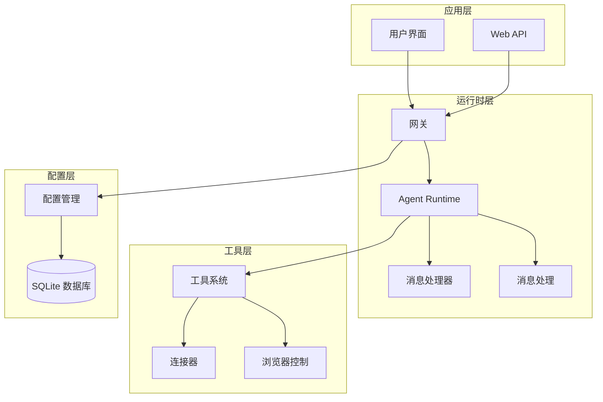

**图表来源**
- [src/main/gateway.ts:33-772](file://src/main/gateway.ts#L33-L772)
- [src/main/agent-runtime/agent-runtime.ts:27-188](file://src/main/agent-runtime/agent-runtime.ts#L27-L188)

**章节来源**
- [src/main/gateway.ts:1-796](file://src/main/gateway.ts#L1-L796)
- [src/main/agent-runtime/index.ts:1-13](file://src/main/agent-runtime/index.ts#L1-13)

## 核心组件

### Agent Runtime 核心接口

Agent Runtime 提供了统一的对外接口，封装了复杂的内部逻辑：

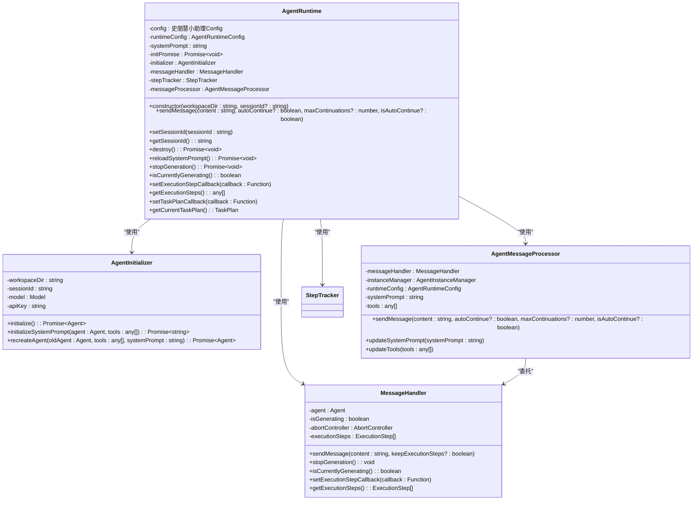

**图表来源**
- [src/main/agent-runtime/agent-runtime.ts:27-800](file://src/main/agent-runtime/agent-runtime.ts#L27-L800)
- [src/main/agent-runtime/agent-initializer.ts:17-188](file://src/main/agent-runtime/agent-initializer.ts#L17-L188)
- [src/main/agent-runtime/message-handler.ts:16-752](file://src/main/agent-runtime/message-handler.ts#L16-L752)
- [src/main/agent-runtime/agent-message-processor.ts:20-549](file://src/main/agent-runtime/agent-message-processor.ts#L20-L549)

### 类型定义体系

系统提供了完整的类型定义，确保类型安全和良好的开发体验：

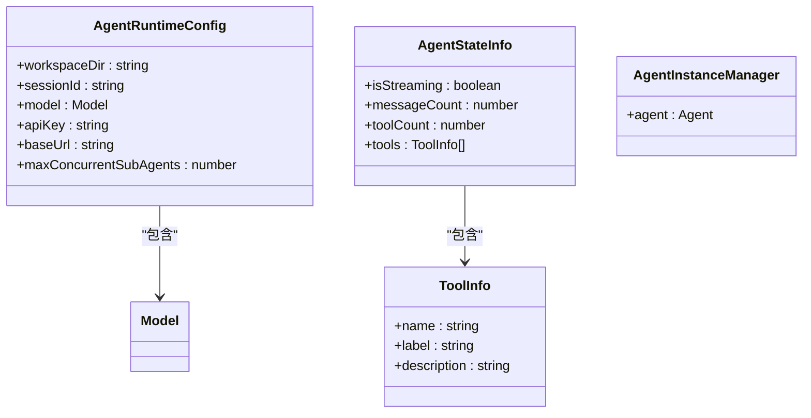

**图表来源**
- [src/main/agent-runtime/types.ts:11-39](file://src/main/agent-runtime/types.ts#L11-L39)

**章节来源**
- [src/main/agent-runtime/types.ts:1-40](file://src/main/agent-runtime/types.ts#L1-40)

## 架构概览

Agent Runtime 采用事件驱动的架构模式，通过消息队列和回调机制实现组件间的松耦合通信。

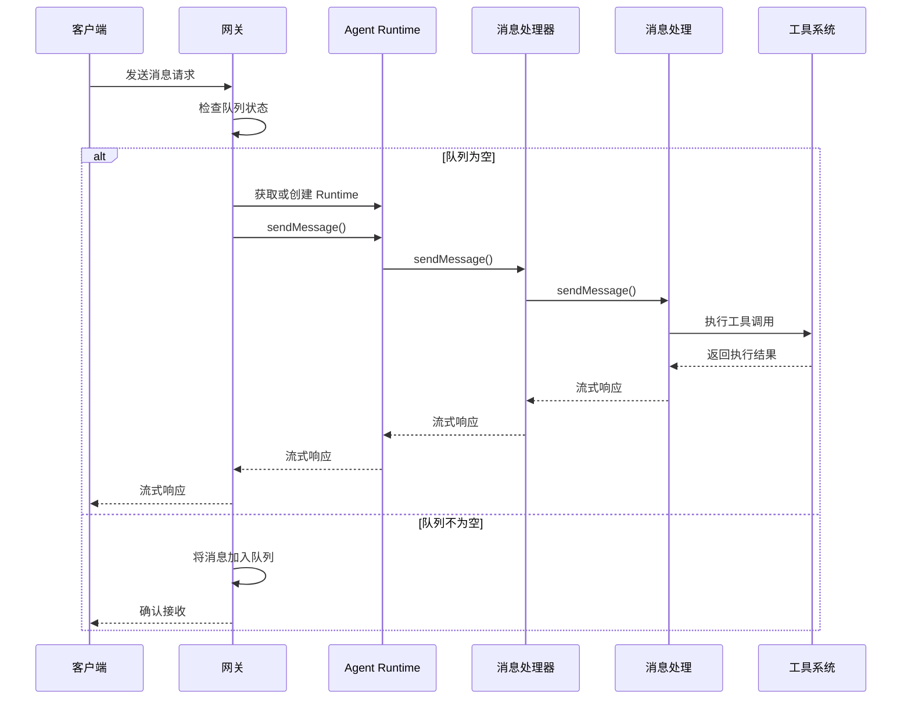

**图表来源**
- [src/main/gateway-message.ts:76-160](file://src/main/gateway-message.ts#L76-L160)
- [src/main/agent-runtime/agent-message-processor.ts:345-547](file://src/main/agent-runtime/agent-message-processor.ts#L345-L547)

**章节来源**
- [src/main/gateway-message.ts:1-525](file://src/main/gateway-message.ts#L1-L525)

## 详细组件分析

### 网关集成机制

网关作为系统的统一入口，负责协调各个子系统的交互：

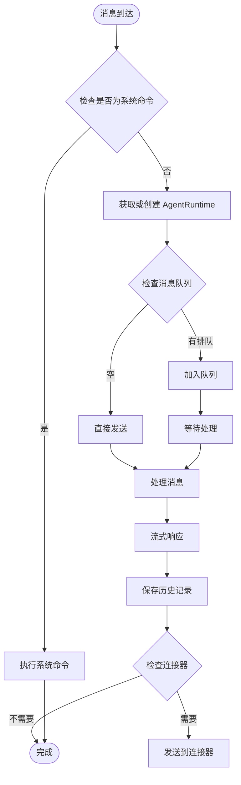

**图表来源**
- [src/main/gateway-message.ts:76-160](file://src/main/gateway-message.ts#L76-L160)

网关的核心功能包括：
- **消息路由**：根据会话 ID 路由到相应的 Agent Runtime
- **队列管理**：处理并发消息的排队和调度
- **错误恢复**：自动检测和恢复 AI 连接错误
- **连接器集成**：支持多种外部平台的消息转发

**章节来源**
- [src/main/gateway.ts:33-772](file://src/main/gateway.ts#L33-L772)

### 工具系统集成

工具系统提供了丰富的扩展能力，支持各种外部服务和本地操作：

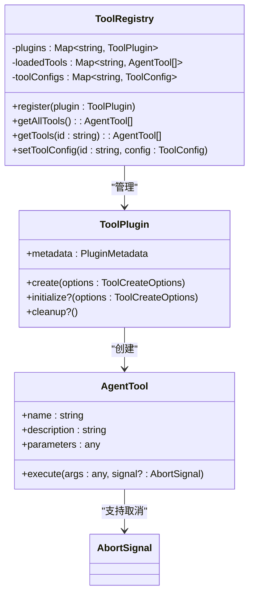

**图表来源**
- [src/main/tools/registry/tool-registry.ts:36-327](file://src/main/tools/registry/tool-registry.ts#L36-L327)

工具系统的特点：
- **插件化架构**：支持动态加载和卸载工具
- **配置管理**：提供工具启用/禁用和参数配置
- **取消支持**：所有工具都支持 AbortSignal 取消机制
- **类型安全**：完整的 TypeScript 类型定义

**章节来源**
- [src/main/tools/registry/tool-registry.ts:1-328](file://src/main/tools/registry/tool-registry.ts#L1-328)

### 连接器管理机制

连接器系统实现了与外部平台的无缝集成：

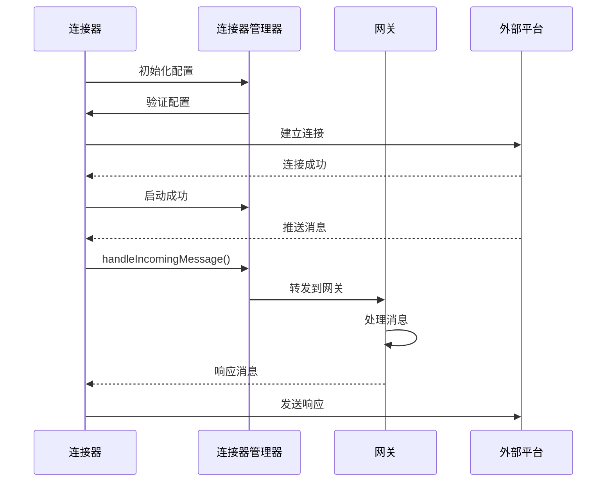

**图表来源**
- [src/main/connectors/connector-manager.ts:130-168](file://src/main/connectors/connector-manager.ts#L130-L168)

连接器管理器的功能：
- **生命周期管理**：启动、停止和监控连接器状态
- **配置验证**：确保连接器配置的有效性
- **消息路由**：在连接器和网关之间转发消息
- **健康检查**：定期检查连接器的运行状态

**章节来源**
- [src/main/connectors/connector-manager.ts:1-379](file://src/main/connectors/connector-manager.ts#L1-379)

### 配置管理系统

配置管理系统提供了统一的配置存储和管理机制：

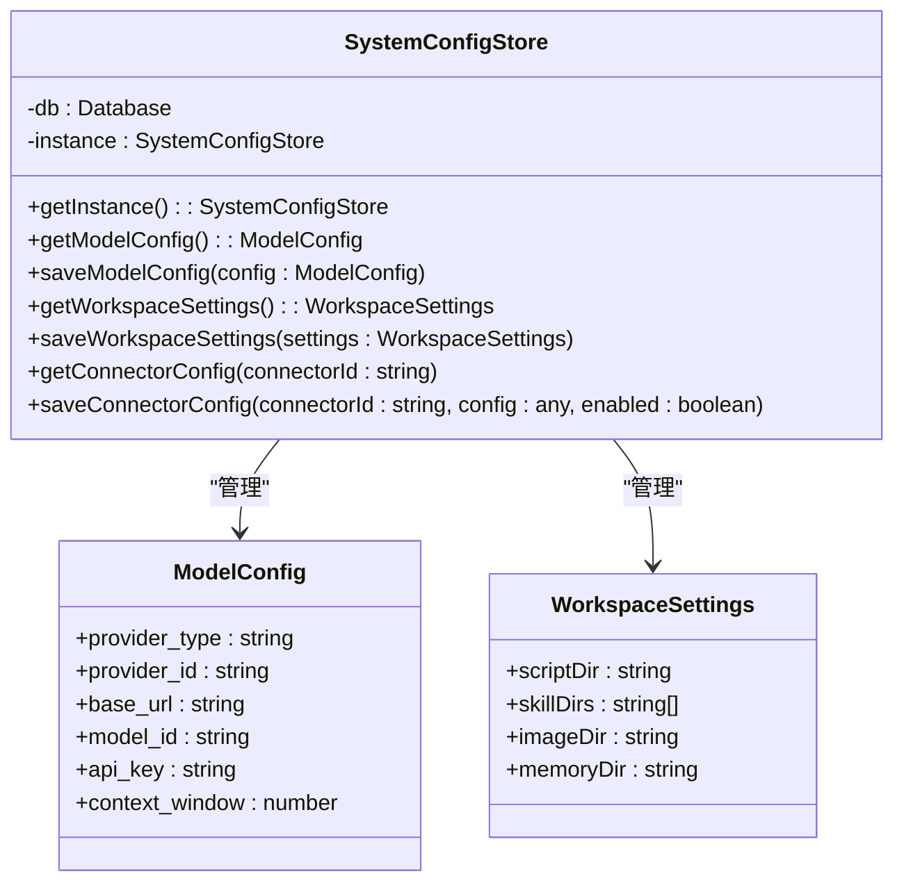

**图表来源**
- [src/main/database/system-config-store.ts:37-566](file://src/main/database/system-config-store.ts#L37-L566)

配置管理的特点：
- **持久化存储**：使用 SQLite 数据库存储配置信息
- **多配置源**：支持数据库、环境变量等多种配置来源
- **热重载支持**：配置更新后自动生效
- **类型安全**：完整的配置类型定义

**章节来源**
- [src/main/database/system-config-store.ts:1-576](file://src/main/database/system-config-store.ts#L1-576)

## 依赖关系分析

### 组件耦合度分析

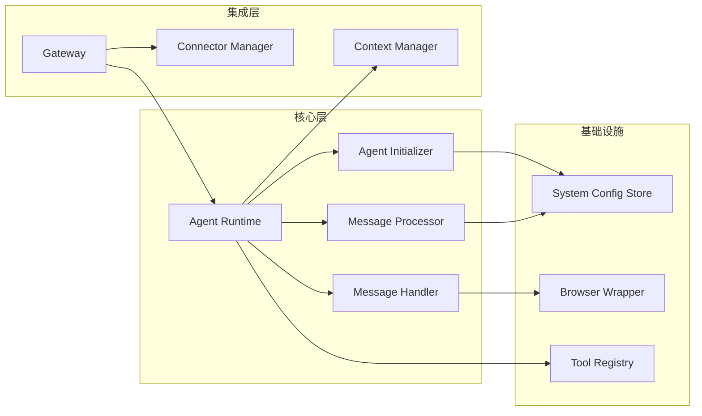

**图表来源**
- [src/main/agent-runtime/agent-runtime.ts:15-54](file://src/main/agent-runtime/agent-runtime.ts#L15-L54)
- [src/main/gateway.ts:22-52](file://src/main/gateway.ts#L22-L52)

### 错误传播机制

系统实现了完善的错误处理和传播机制：

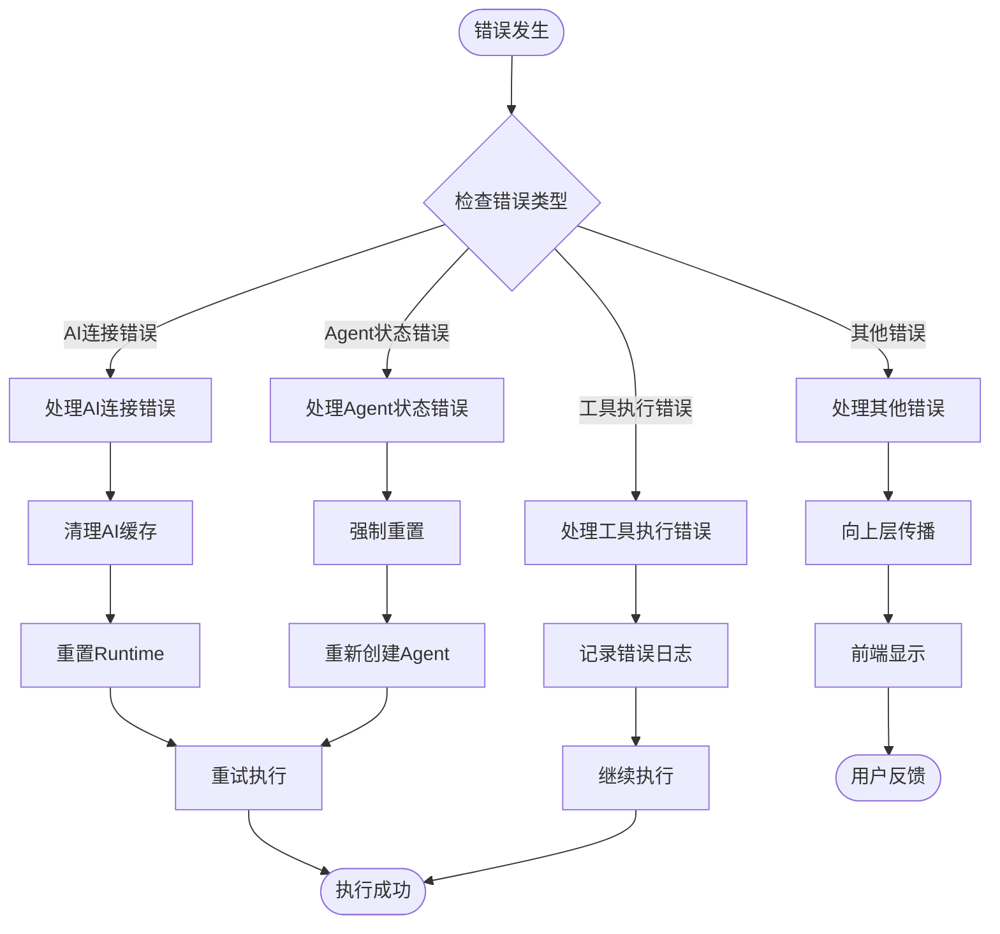

**图表来源**
- [src/main/gateway-message.ts:246-283](file://src/main/gateway-message.ts#L246-L283)

**章节来源**
- [src/main/gateway-message.ts:231-283](file://src/main/gateway-message.ts#L231-L283)

## 性能考虑

### 上下文管理优化

系统实现了智能的上下文压缩机制，确保在高负载情况下仍能保持良好的性能：

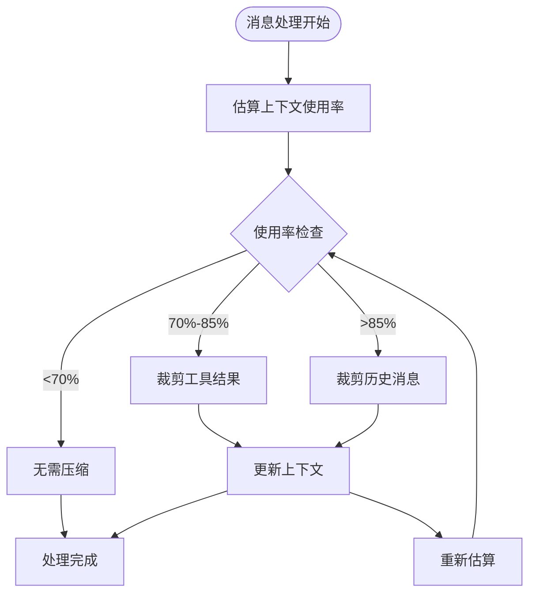

**图表来源**
- [src/main/context/context-manager.ts:100-303](file://src/main/context/context-manager.ts#L100-L303)

### 并发控制策略

系统采用了多层并发控制机制：

1. **消息队列**：每个会话独立的消息队列
2. **运行时隔离**：每个会话对应独立的 Agent Runtime
3. **工具执行串行化**：避免工具间的资源竞争
4. **内存管理**：定期清理历史消息和工具结果

**章节来源**
- [src/main/context/context-manager.ts:1-366](file://src/main/context/context-manager.ts#L1-L366)

## 故障排除指南

### 常见问题诊断

#### AI 连接问题
- **症状**：消息发送超时，返回空响应
- **诊断**：检查网络连接、API 密钥、代理设置
- **解决方案**：重新配置模型设置，检查防火墙设置

#### Agent 卡死问题
- **症状**：isCurrentlyGenerating 返回 true，但无响应
- **诊断**：检查工具执行状态，查看日志中的工具调用
- **解决方案**：调用 stopGeneration()，必要时重新创建 Agent Runtime

#### 工具执行失败
- **症状**：工具返回错误信息
- **诊断**：检查工具配置，验证外部服务可用性
- **解决方案**：更新工具配置，检查外部服务状态

### 日志分析技巧

系统提供了详细的日志输出，有助于问题诊断：

1. **运行时配置日志**：检查模型配置、API 设置
2. **消息处理日志**：跟踪消息流转和工具调用
3. **错误日志**：分析错误类型和堆栈信息
4. **性能日志**：监控上下文使用率和处理时间

**章节来源**
- [src/main/gateway-message.ts:478-500](file://src/main/gateway-message.ts#L478-L500)

## 结论

Agent Runtime 集成机制展现了现代 AI 应用系统的最佳实践，通过模块化设计、事件驱动架构和完善的错误处理机制，实现了高度解耦和可扩展的系统架构。

该机制的主要优势包括：
- **高度模块化**：清晰的职责分离和接口定义
- **强大的扩展性**：支持动态工具加载和连接器集成
- **完善的错误处理**：自动恢复和用户友好的错误提示
- **多环境适配**：统一的接口设计支持多种部署场景
- **性能优化**：智能的上下文管理和并发控制

未来的发展方向包括：
- **插件生态**：进一步完善工具插件系统
- **监控增强**：增加更详细的性能监控和分析
- **自动化运维**：提升系统的自愈能力和运维效率

## 附录

### 部署环境适配

#### Electron 主进程适配
- 使用 BrowserWindow 作为主窗口
- 通过 IPC 通道与渲染进程通信
- 支持本地文件系统和系统资源

#### Web 服务器适配
- 使用虚拟窗口对象替代 BrowserWindow
- 通过 WebSocket 与客户端通信
- 支持容器化部署和云环境

**章节来源**
- [src/server/index.ts:33-156](file://src/server/index.ts#L33-L156)
- [src/main/gateway.ts:415-432](file://src/main/gateway.ts#L415-L432)

### 热重载和动态配置

系统支持多种热重载场景：
- **模型配置更新**：重新加载所有 Agent Runtime
- **工具配置更新**：动态启用/禁用工具
- **连接器配置更新**：自动重启连接器
- **工作目录变更**：重新初始化相关组件

**章节来源**
- [src/main/gateway.ts:216-286](file://src/main/gateway.ts#L216-L286)