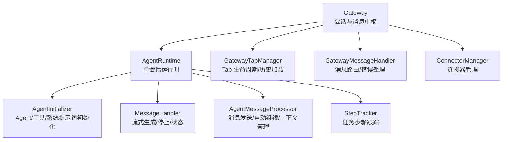
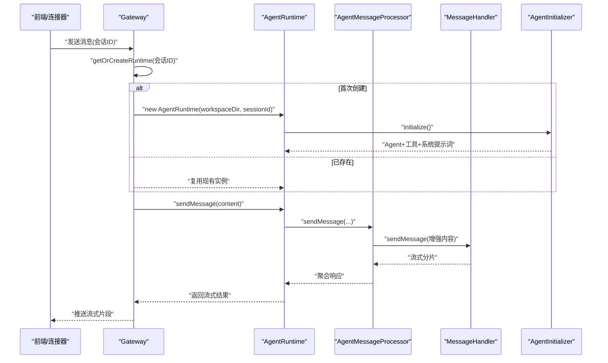
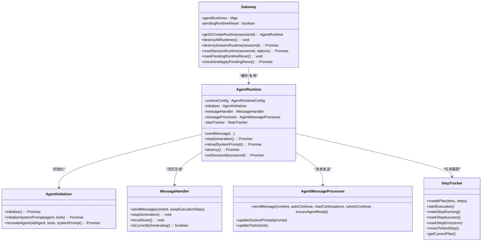
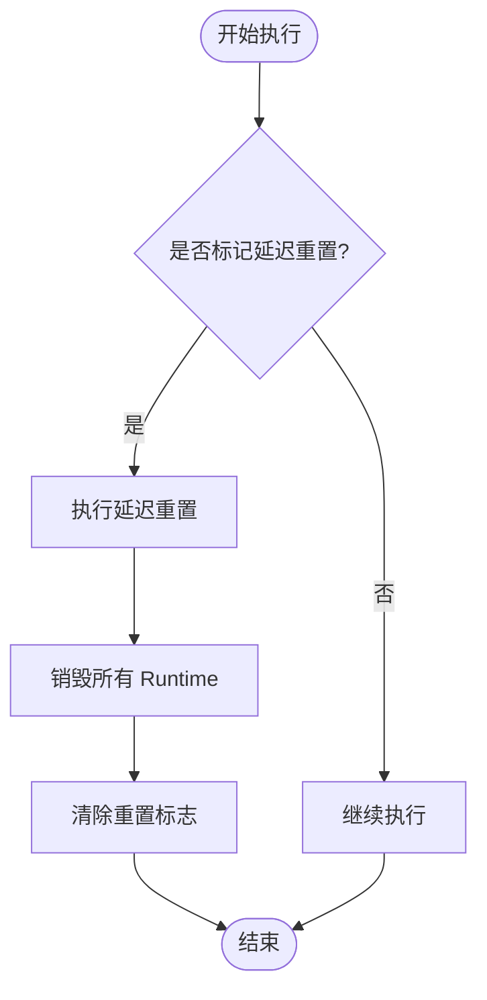
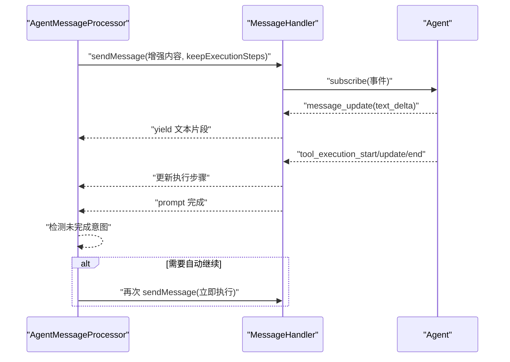
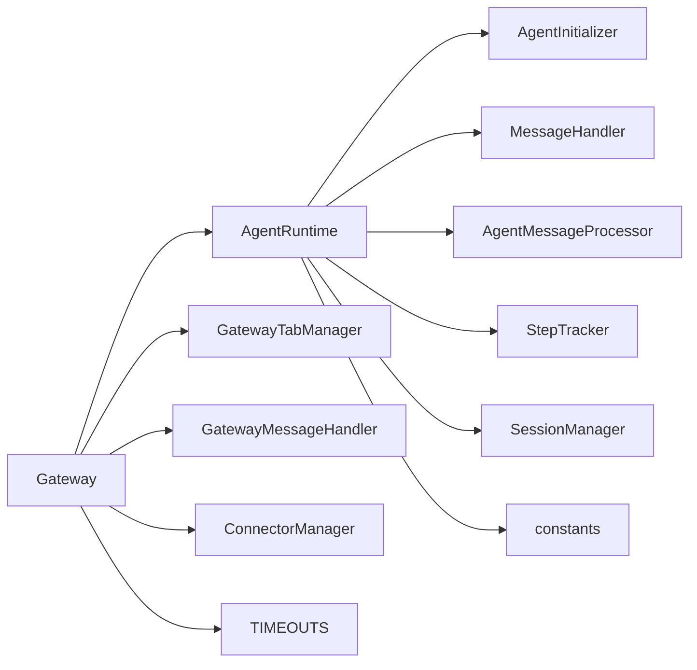

# AgentRuntime 生命周期管理

<cite>
**本文引用的文件**
- [gateway.ts](file://src/main/gateway.ts)
- [agent-runtime.ts](file://src/main/agent-runtime/agent-runtime.ts)
- [gateway-tab.ts](file://src/main/gateway-tab.ts)
- [agent-initializer.ts](file://src/main/agent-runtime/agent-initializer.ts)
- [message-handler.ts](file://src/main/agent-runtime/message-handler.ts)
- [agent-message-processor.ts](file://src/main/agent-runtime/agent-message-processor.ts)
- [types.ts](file://src/main/agent-runtime/types.ts)
- [step-tracker.ts](file://src/main/agent-runtime/step-tracker.ts)
- [timeouts.ts](file://src/main/config/timeouts.ts)
- [constants.ts](file://src/main/config/constants.ts)
- [tool-loader.ts](file://src/main/tools/registry/tool-loader.ts)
</cite>

## 目录
1. [简介](#简介)
2. [项目结构](#项目结构)
3. [核心组件](#核心组件)
4. [架构总览](#架构总览)
5. [详细组件分析](#详细组件分析)
6. [依赖关系分析](#依赖关系分析)
7. [性能考量](#性能考量)
8. [故障排查指南](#故障排查指南)
9. [结论](#结论)

## 简介
本文聚焦 DeepBot 的 AgentRuntime 生命周期管理，系统性阐述 Gateway 如何为每个标签页（Tab）管理一个 AgentRuntime 实例，覆盖实例创建、初始化、重置、销毁的完整生命周期；详解 getOrCreateRuntime 的实现原理（含实例缓存、工作目录配置、会话隔离）；解释延迟重置机制（pendingRuntimeReset 标志、检查点机制、优雅停机）的设计与实现；并提供性能优化建议与并发控制策略，说明其在多任务并发与资源优化中的关键作用。

## 项目结构
- Gateway 作为会话与消息的中枢，负责：
  - 维护每个 Tab 对应的 AgentRuntime 实例映射
  - 路由消息到对应 Runtime
  - 管理延迟重置与全局重载（模型、工具、工作目录）
  - 与 Tab 管理器、消息处理器、连接器处理器协同
- AgentRuntime 是单会话的运行时载体，协调初始化器、消息处理器、步骤跟踪器与消息处理器，提供统一的对外接口（发送消息、停止生成、重置、销毁等）

图表来源
- [gateway.ts](file://src/main/gateway.ts)
- [agent-runtime.ts](file://src/main/agent-runtime/agent-runtime.ts)
- [gateway-tab.ts](file://src/main/gateway-tab.ts)

章节来源
- [gateway.ts](file://src/main/gateway.ts)
- [agent-runtime.ts](file://src/main/agent-runtime/agent-runtime.ts)
- [gateway-tab.ts](file://src/main/gateway-tab.ts)

## 核心组件
- Gateway
  - 维护 Map<sessionId, AgentRuntime>
  - 提供 getOrCreateRuntime、destroyAllRuntimes、destroySessionRuntime、resetSessionRuntime 等生命周期管理方法
  - 提供 markPendingRuntimeReset/checkAndApplyPendingReset 实现延迟重置
  - 与 Tab 管理器、消息处理器、连接器处理器解耦协作
- AgentRuntime
  - 负责 Agent 初始化、工具装载、系统提示词构建、消息发送与流式输出、停止生成、重置与销毁
  - 内部包含 MessageHandler、AgentMessageProcessor、AgentInitializer、StepTracker 等子模块
- AgentInitializer
  - 负责加载工具、创建 Agent、构建系统提示词
- MessageHandler
  - 负责流式生成、停止生成、执行步骤收集、AbortController 管理
- AgentMessageProcessor
  - 负责消息发送、上下文压缩、自动继续检测、保存 captured prompt
- StepTracker
  - 负责任务计划与步骤状态跟踪
- GatewayTabManager
  - 负责 Tab 的创建、关闭、历史加载、持久化、欢迎消息等

章节来源
- [gateway.ts](file://src/main/gateway.ts)
- [agent-runtime.ts](file://src/main/agent-runtime/agent-runtime.ts)
- [agent-initializer.ts](file://src/main/agent-runtime/agent-initializer.ts)
- [message-handler.ts](file://src/main/agent-runtime/message-handler.ts)
- [agent-message-processor.ts](file://src/main/agent-runtime/agent-message-processor.ts)
- [step-tracker.ts](file://src/main/agent-runtime/step-tracker.ts)
- [gateway-tab.ts](file://src/main/gateway-tab.ts)

## 架构总览
Gateway 以“每个 Tab 一个 AgentRuntime”的策略进行实例管理，通过 getOrCreateRuntime 实现按会话 ID 的缓存与复用；在配置变更（模型、工具、工作目录）时，Gateway 提供统一的重载与销毁策略；AgentRuntime 内部通过初始化器、消息处理器、消息处理器与步骤跟踪器协同，保证消息发送、流式输出、自动继续、上下文压缩与状态恢复的稳定性。

图表来源
- [gateway.ts](file://src/main/gateway.ts)
- [agent-runtime.ts](file://src/main/agent-runtime/agent-runtime.ts)
- [agent-message-processor.ts](file://src/main/agent-runtime/agent-message-processor.ts)
- [message-handler.ts](file://src/main/agent-runtime/message-handler.ts)
- [agent-initializer.ts](file://src/main/agent-runtime/agent-initializer.ts)

## 详细组件分析

### Gateway 生命周期管理
- 实例缓存与会话隔离
  - 通过 Map<sessionId, AgentRuntime> 实现按会话 ID 的缓存，避免重复创建
  - 每个 Tab 对应一个独立的会话 ID，天然实现会话隔离
- getOrCreateRuntime 实现原理
  - 从系统配置读取工作目录 workspaceDir
  - 若缓存中不存在则创建新实例并放入缓存
  - 返回实例供调用方使用
- 重置与销毁
  - destroyAllRuntimes：遍历并销毁所有会话的 Runtime
  - destroySessionRuntime：销毁指定会话的 Runtime 并从缓存移除
  - resetSessionRuntime：销毁并可选择性重建，用于错误恢复或配置变更后的重置
- 延迟重置机制
  - pendingRuntimeReset 标志位用于标记“当前执行完成后”重置
  - checkAndApplyPendingReset 在每次执行完成后检查并应用重置
  - 与 markPendingRuntimeReset 配合，避免中断正在进行的任务
- 配置重载
  - reloadModelConfig/reloadToolConfig/reloadWorkspaceConfig/reloadSessionManager：分别触发模型、工具、工作目录、会话目录的重载
  - 重载后通常会销毁所有 Runtime，下次使用时按新配置重建

章节来源
- [gateway.ts](file://src/main/gateway.ts)

### AgentRuntime 生命周期与职责
- 构造与初始化
  - 读取系统配置（模型、API 类型、上下文窗口等），构建运行时配置
  - 初始化 AgentInitializer，创建 MessageHandler、StepTracker、AgentMessageProcessor
  - 异步 initialize：加载 Agent、工具、系统提示词，加载历史消息到上下文
- 发送消息与流式输出
  - sendMessage 委托给 AgentMessageProcessor
  - MessageHandler 负责流式生成、停止、执行步骤收集、AbortController 管理
- 停止生成与状态修复
  - stopGeneration：停止当前生成，必要时重建 Agent 实例
  - ensureAgentReady：检查并修复卡住的 streaming 状态与 MessageHandler 状态
- 重置与销毁
  - destroy：强制停止生成、重置 Agent 状态、清理资源
  - setSessionId：切换会话 ID 并重建 Agent
  - clearMessageHistory：清空消息历史（定时任务场景）
- 系统提示词与上下文
  - initializeSystemPrompt：构建系统提示词（支持等待重复初始化）
  - reloadSystemPrompt：在记忆更新后重新加载系统提示词
  - loadHistoryToContext：从 SessionManager 加载历史消息并压缩上下文

图表来源
- [gateway.ts](file://src/main/gateway.ts)
- [agent-runtime.ts](file://src/main/agent-runtime/agent-runtime.ts)
- [agent-initializer.ts](file://src/main/agent-runtime/agent-initializer.ts)
- [message-handler.ts](file://src/main/agent-runtime/message-handler.ts)
- [agent-message-processor.ts](file://src/main/agent-runtime/agent-message-processor.ts)
- [step-tracker.ts](file://src/main/agent-runtime/step-tracker.ts)

章节来源
- [agent-runtime.ts](file://src/main/agent-runtime/agent-runtime.ts)
- [agent-initializer.ts](file://src/main/agent-runtime/agent-initializer.ts)
- [message-handler.ts](file://src/main/agent-runtime/message-handler.ts)
- [agent-message-processor.ts](file://src/main/agent-runtime/agent-message-processor.ts)
- [step-tracker.ts](file://src/main/agent-runtime/step-tracker.ts)

### getOrCreateRuntime 实现要点
- 会话隔离
  - 以 sessionId 为键，每个会话拥有独立的 AgentRuntime 实例
- 工作目录配置
  - 从系统配置读取 workspaceDir，作为 AgentRuntime 的工作区根目录
- 实例缓存
  - 缓存 Map<sessionId, AgentRuntime>，避免重复创建
- 返回实例
  - 若不存在则创建并放入缓存，然后返回

章节来源
- [gateway.ts](file://src/main/gateway.ts)

### 延迟重置机制设计与实现
- pendingRuntimeReset 标志
  - 通过 markPendingRuntimeReset 标记“当前执行完成后”重置
- 检查点机制
  - 在每次执行完成后调用 checkAndApplyPendingReset
  - 若标志为真，则销毁所有 Runtime（或按需销毁指定会话）
- 优雅停机
  - 重置前等待当前生成完成，避免中断任务
  - resetSessionRuntime 支持“仅销毁不重建”，用于某些场景下的状态清理

图表来源
- [gateway.ts](file://src/main/gateway.ts)

章节来源
- [gateway.ts](file://src/main/gateway.ts)

### 消息发送与自动继续流程
- AgentMessageProcessor.sendMessage
  - 增强用户消息（非自动继续时追加强制执行指令）
  - 上下文压缩与消息队列维护
  - 调用 MessageHandler.sendMessage 获取流式响应
  - 检测未完成意图并自动继续（可配置最大次数）
- MessageHandler.sendMessage
  - 订阅 Agent 事件，解析 text_delta、tool_execution_* 等事件
  - 收集执行步骤，支持 AbortController 与超时保护
  - 流式输出，支持用户主动停止

图表来源
- [agent-message-processor.ts](file://src/main/agent-runtime/agent-message-processor.ts)
- [message-handler.ts](file://src/main/agent-runtime/message-handler.ts)

章节来源
- [agent-message-processor.ts](file://src/main/agent-runtime/agent-message-processor.ts)
- [message-handler.ts](file://src/main/agent-runtime/message-handler.ts)

### 工具加载与系统提示词构建
- 工具加载
  - ToolLoader.loadAllTools：加载内置工具，支持启用/禁用配置
  - AgentInitializer.initialize：创建 Agent 并注入工具
- 系统提示词
  - AgentInitializer.initializeSystemPrompt：构建系统提示词（含上下文文件、运行时参数、工具名称等）
  - AgentRuntime.reloadSystemPrompt：在记忆更新后重新加载

章节来源
- [tool-loader.ts](file://src/main/tools/registry/tool-loader.ts)
- [agent-initializer.ts](file://src/main/agent-runtime/agent-initializer.ts)
- [agent-runtime.ts](file://src/main/agent-runtime/agent-runtime.ts)

## 依赖关系分析
- Gateway 依赖
  - AgentRuntime（通过 getOrCreateRuntime）
  - GatewayTabManager（Tab 生命周期）
  - GatewayMessageHandler（消息路由）
  - ConnectorManager（连接器）
- AgentRuntime 依赖
  - AgentInitializer（Agent/工具/系统提示词）
  - MessageHandler（流式生成）
  - AgentMessageProcessor（消息发送/自动继续/上下文）
  - StepTracker（任务跟踪）
  - SessionManager（历史加载/上下文压缩）
- 配置与超时
  - TIMEOUTS：软超时（AbortSignal）与长任务阈值
  - constants：通用常量（如最大并发子 Agent 数）

图表来源
- [gateway.ts](file://src/main/gateway.ts)
- [agent-runtime.ts](file://src/main/agent-runtime/agent-runtime.ts)
- [timeouts.ts](file://src/main/config/timeouts.ts)
- [constants.ts](file://src/main/config/constants.ts)

章节来源
- [gateway.ts](file://src/main/gateway.ts)
- [agent-runtime.ts](file://src/main/agent-runtime/agent-runtime.ts)
- [timeouts.ts](file://src/main/config/timeouts.ts)
- [constants.ts](file://src/main/config/constants.ts)

## 性能考量
- 内存回收与实例复用
  - 使用 Map<sessionId, AgentRuntime> 缓存实例，避免频繁创建销毁
  - destroyAllRuntimes/destroySessionRuntime 在配置变更或长时间闲置后清理
  - clearMessageHistory 用于定时任务场景，避免历史消息累积
- 并发控制
  - MessageHandler 使用 AbortController 与 generationId 标识，避免并发冲突
  - Agent 设置工具执行为串行（sequential），降低并发工具调用的依赖问题
  - MAX_CONCURRENT_SUBAGENTS（来自 constants）限制子 Agent 并发
- 上下文压缩与消息队列
  - AgentMessageProcessor 与 AgentRuntime 内部均进行上下文压缩与消息队列维护，控制 token 使用率
- 超时与优雅停机
  - TIMEOUTS.AGENT_MESSAGE_TIMEOUT 提供软超时，配合 AbortController 优雅停止
  - stopGeneration/forceReset 保障状态一致性

章节来源
- [agent-runtime.ts](file://src/main/agent-runtime/agent-runtime.ts)
- [agent-message-processor.ts](file://src/main/agent-runtime/agent-message-processor.ts)
- [message-handler.ts](file://src/main/agent-runtime/message-handler.ts)
- [constants.ts](file://src/main/config/constants.ts)
- [timeouts.ts](file://src/main/config/timeouts.ts)

## 故障排查指南
- 常见问题与定位
  - “生成卡住”：检查 MessageHandler.isCurrentlyGenerating 与 Agent.state.isStreaming，必要时调用 forceReset 或 stopGeneration
  - “空响应”：检查 AI 客户端配置、API Key、模型上下文窗口，关注 captured prompt 调试文件
  - “重复执行/未完成意图”：查看 AgentMessageProcessor.detectUnfinishedIntent 的判断逻辑与自动继续次数
  - “工具未取消”：确认 AbortController 是否正确注入到工具（AgentMessageProcessor 在 sendMessage 前设置回调）
- 日志与调试
  - AgentRuntime 构造与初始化阶段输出详细配置信息
  - MessageHandler 在关键事件（thinking、tool_execution_*）输出调试日志
  - AgentMessageProcessor 保存 captured-prompt.md 用于对比实际发送内容
- 重置与恢复
  - 使用 resetSessionRuntime 或 destroySessionRuntime 清理状态
  - 使用 reloadModelConfig/reloadToolConfig/reloadWorkspaceConfig 触发重载

章节来源
- [agent-runtime.ts](file://src/main/agent-runtime/agent-runtime.ts)
- [agent-message-processor.ts](file://src/main/agent-runtime/agent-message-processor.ts)
- [message-handler.ts](file://src/main/agent-runtime/message-handler.ts)

## 结论
Gateway 通过“每个标签页一个 AgentRuntime”的策略实现了会话隔离与高效复用；getOrCreateRuntime 提供稳定的实例缓存与工作目录配置；延迟重置机制在保证用户体验的同时避免中断正在进行的任务；AgentRuntime 内部通过初始化器、消息处理器、消息处理器与步骤跟踪器的协同，确保消息发送、流式输出、自动继续、上下文压缩与状态恢复的稳定性。结合超时与并发控制策略，该体系在多任务并发与资源优化方面具有良好的可扩展性与鲁棒性。