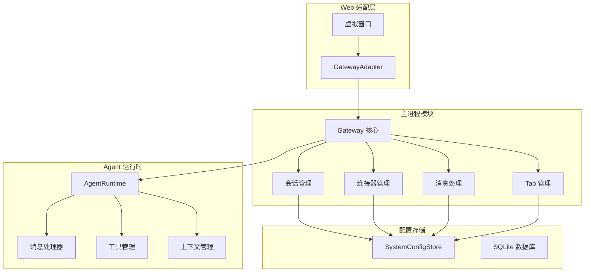
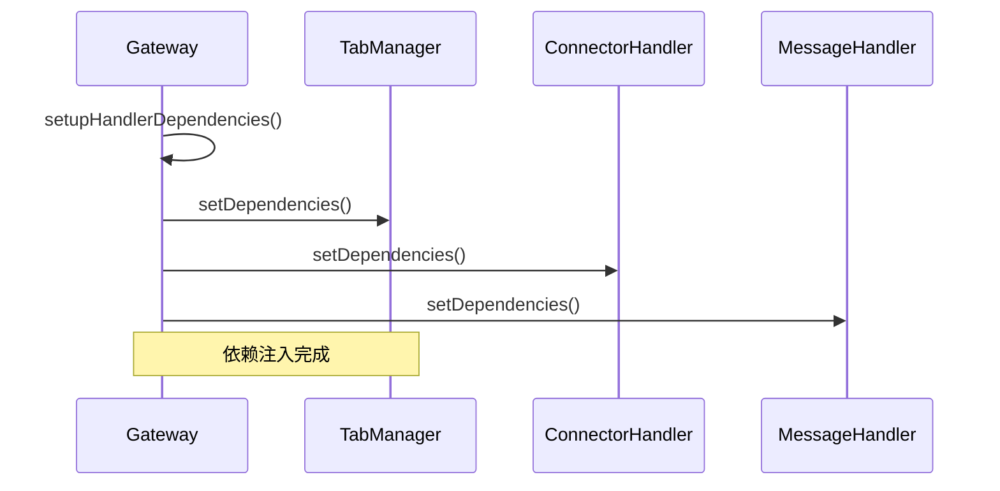
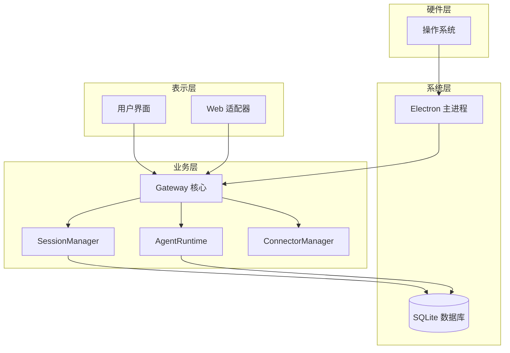
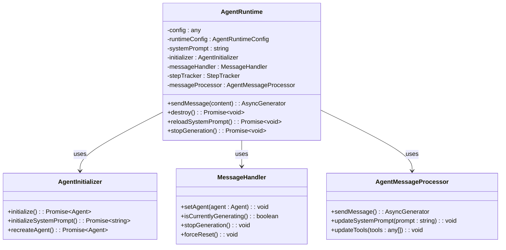
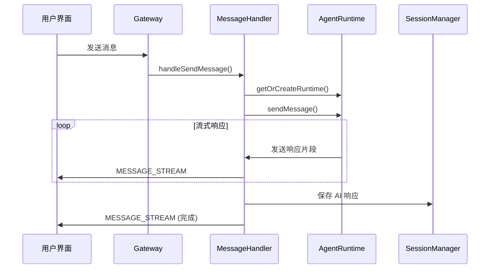
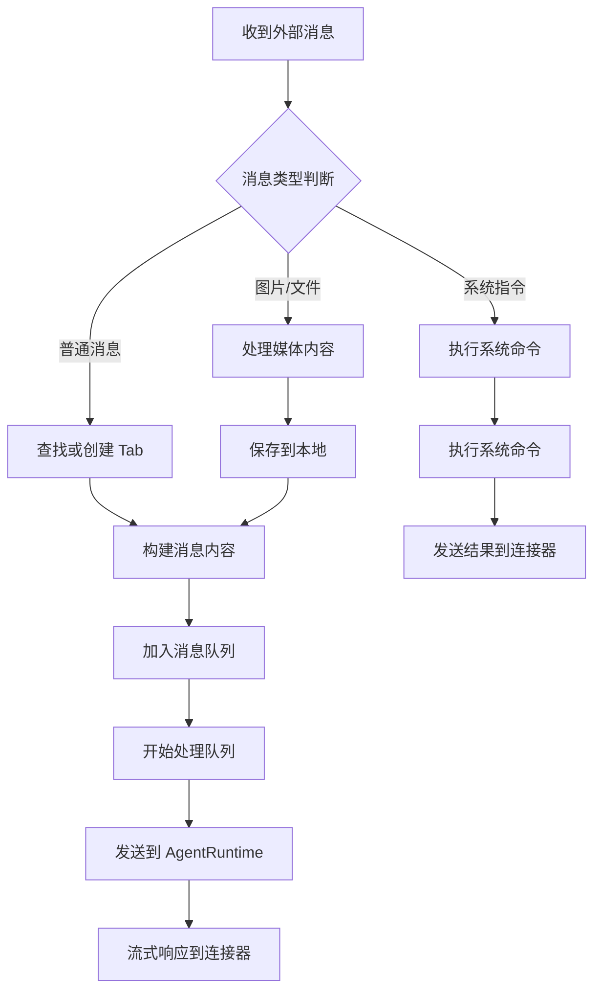
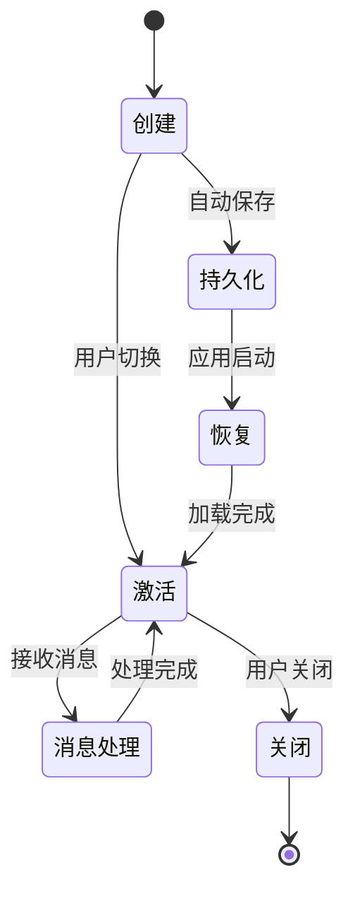
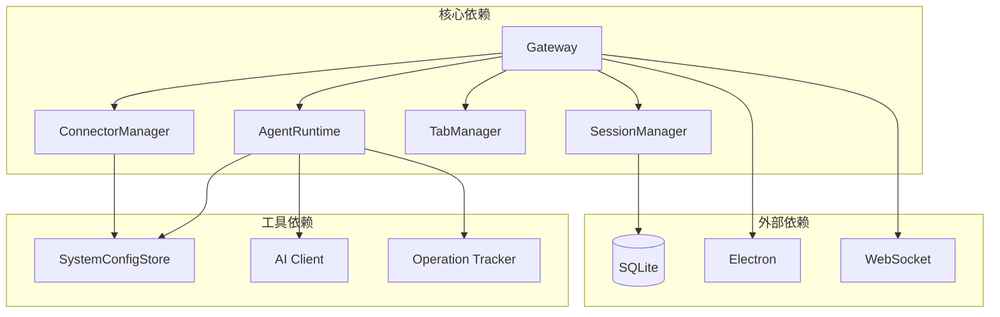

# Gateway 核心架构设计

<cite>
**本文档引用的文件**
- [gateway.ts](file://src/main/gateway.ts)
- [gateway-connector.ts](file://src/main/gateway-connector.ts)
- [gateway-message.ts](file://src/main/gateway-message.ts)
- [gateway-tab.ts](file://src/main/gateway-tab.ts)
- [agent-runtime.ts](file://src/main/agent-runtime/agent-runtime.ts)
- [connector-manager.ts](file://src/main/connectors/connector-manager.ts)
- [session-manager.ts](file://src/main/session/session-manager.ts)
- [gateway-adapter.ts](file://src/server/gateway-adapter.ts)
- [index.ts](file://src/main/index.ts)
- [agent-tab.ts](file://src/types/agent-tab.ts)
- [connector.ts](file://src/types/connector.ts)
- [system-config-store.ts](file://src/main/database/system-config-store.ts)
</cite>

## 目录
1. [简介](#简介)
2. [项目结构](#项目结构)
3. [核心组件](#核心组件)
4. [架构概览](#架构概览)
5. [详细组件分析](#详细组件分析)
6. [依赖分析](#依赖分析)
7. [性能考虑](#性能考虑)
8. [故障排除指南](#故障排除指南)
9. [结论](#结论)

## 简介

史丽慧小助理 Gateway 是 史丽慧小助理 AI 助手系统的核心中枢控制器，负责管理会话生命周期、路由消息到 Agent Runtime、处理流式响应以及管理多个 AgentRuntime 实例。Gateway 采用 Electron 主进程架构，在桌面应用和 Web 模式下都能提供一致的功能体验。

Gateway 的设计理念是"每个标签页对应一个独立的 AgentRuntime 实例"，这种设计确保了多任务并发处理能力和会话隔离性。通过 Map 结构管理多个 AgentRuntime 实例，每个实例都拥有独立的工作目录和内存状态。

## 项目结构

史丽慧小助理 采用模块化的项目结构，主要分为以下几个核心模块：



**图表来源**
- [gateway.ts:33-138](file://src/main/gateway.ts#L33-138)
- [agent-runtime.ts:27-188](file://src/main/agent-runtime/agent-runtime.ts#L27-188)

**章节来源**
- [gateway.ts:1-796](file://src/main/gateway.ts#L1-796)
- [index.ts:1-331](file://src/main/index.ts#L1-331)

## 核心组件

### Gateway 核心类

Gateway 类是整个系统的核心控制器，负责协调各个子系统的工作。其主要职责包括：

- **会话管理**：管理多个 AgentRuntime 实例，每个标签页对应一个实例
- **消息路由**：将用户消息路由到相应的 AgentRuntime
- **连接器集成**：处理来自外部连接器的消息
- **配置管理**：动态重新加载模型配置、工具配置和工作目录配置

Gateway 使用 Map 结构来管理 AgentRuntime 实例，键为 sessionId，值为对应的 AgentRuntime 实例：

```typescript
private agentRuntimes: Map<string, AgentRuntime> = new Map();
```

### 依赖注入机制

Gateway 采用了强大的依赖注入机制，通过 `setupHandlerDependencies` 方法统一设置各个处理器的依赖：



**图表来源**
- [gateway.ts:361-398](file://src/main/gateway.ts#L361-398)

### 全局实例管理

Gateway 实现了全局实例管理模式，通过 `setGlobalGatewayInstance` 和 `getGatewayInstance` 函数来管理全局实例：

```typescript
let gatewayInstance: Gateway | null = null;

export function setGlobalGatewayInstance(gateway: Gateway): void {
  gatewayInstance = gateway;
}

export function getGatewayInstance(): Gateway | null {
  return gatewayInstance;
}
```

**章节来源**
- [gateway.ts:774-796](file://src/main/gateway.ts#L774-796)

## 架构概览

史丽慧小助理 的整体架构采用分层设计，从底层到顶层依次为：



**图表来源**
- [gateway.ts:33-138](file://src/main/gateway.ts#L33-138)
- [system-config-store.ts:37-70](file://src/main/database/system-config-store.ts#L37-70)

## 详细组件分析

### AgentRuntime 组件

AgentRuntime 是每个标签页的核心执行单元，负责协调各个模块的工作：



**图表来源**
- [agent-runtime.ts:27-188](file://src/main/agent-runtime/agent-runtime.ts#L27-188)
- [agent-runtime.ts:166-184](file://src/main/agent-runtime/agent-runtime.ts#L166-184)

AgentRuntime 的初始化过程包括：

1. **配置加载**：从 SystemConfigStore 获取模型配置
2. **Agent 初始化**：创建并初始化 AI Agent 实例
3. **工具包装**：为工具添加重复检测和跨标签通信支持
4. **历史加载**：从 SessionManager 加载历史消息到上下文
5. **系统提示词初始化**：构建并初始化系统提示词

**章节来源**
- [agent-runtime.ts:193-229](file://src/main/agent-runtime/agent-runtime.ts#L193-229)

### 消息处理组件

消息处理组件负责处理用户消息的发送和 AI 响应的流式输出：



**图表来源**
- [gateway-message.ts:76-160](file://src/main/gateway-message.ts#L76-160)
- [gateway-message.ts:376-473](file://src/main/gateway-message.ts#L376-473)

消息处理的关键特性包括：

- **队列管理**：支持多个消息的排队处理
- **流式输出**：实时传输 AI 响应片段
- **错误处理**：自动恢复机制，处理 AI 连接错误
- **执行步骤跟踪**：实时更新工具执行状态

**章节来源**
- [gateway-message.ts:31-525](file://src/main/gateway-message.ts#L31-525)

### 连接器管理组件

连接器管理组件负责处理来自外部平台（如飞书、钉钉等）的消息：



**图表来源**
- [gateway-connector.ts:100-296](file://src/main/gateway-connector.ts#L100-296)
- [gateway-connector.ts:369-425](file://src/main/gateway-connector.ts#L369-425)

连接器管理的关键功能包括：

- **消息队列**：支持连接器 Tab 的多人消息处理
- **进度提醒**：定时发送任务执行进度
- **系统指令**：支持 `/new`、`/memory`、`/history` 等系统命令
- **跨平台适配**：支持多种外部平台的消息格式

**章节来源**
- [gateway-connector.ts:44-813](file://src/main/gateway-connector.ts#L44-813)

### Tab 管理组件

Tab 管理组件负责管理多个标签页的生命周期：



**图表来源**
- [gateway-tab.ts:492-611](file://src/main/gateway-tab.ts#L492-611)
- [gateway-tab.ts:687-761](file://src/main/gateway-tab.ts#L687-761)

Tab 管理的核心功能包括：

- **标签页创建**：支持普通标签页、连接器标签页和定时任务标签页
- **持久化存储**：使用 SQLite 存储标签页配置
- **历史加载**：支持标签页历史消息的加载和恢复
- **内存管理**：为每个标签页创建独立的 memory 文件

**章节来源**
- [gateway-tab.ts:26-796](file://src/main/gateway-tab.ts#L26-796)

## 依赖分析

### 组件耦合关系



**图表来源**
- [gateway.ts:11-31](file://src/main/gateway.ts#L11-31)
- [agent-runtime.ts:11-22](file://src/main/agent-runtime/agent-runtime.ts#L11-22)

### 依赖注入模式

Gateway 采用了标准的依赖注入模式，通过构造函数注入和 setter 注入相结合的方式：

1. **构造函数注入**：在 Gateway 构造函数中注入基本依赖
2. **Setter 注入**：通过 `setDependencies` 方法注入运行时依赖
3. **全局注入**：通过全局函数注入跨模块使用的实例

**章节来源**
- [gateway.ts:361-398](file://src/main/gateway.ts#L361-398)

## 性能考虑

### 内存管理

Gateway 通过 Map 结构管理多个 AgentRuntime 实例，每个实例都有独立的内存空间：

- **实例隔离**：每个 AgentRuntime 实例拥有独立的工作目录和内存状态
- **延迟初始化**：AgentRuntime 实例在首次使用时才创建
- **资源清理**：提供完整的资源清理机制，避免内存泄漏

### 并发处理

系统支持多标签页并发处理：

- **消息队列**：每个标签页都有独立的消息队列
- **执行步骤跟踪**：实时跟踪每个工具的执行状态
- **进度提醒**：定时发送任务执行进度，避免长时间无响应

### 缓存策略

- **AI 连接缓存**：AI 连接在首次使用时建立并缓存
- **配置缓存**：系统配置在内存中缓存，减少数据库访问
- **工具缓存**：工具列表在内存中缓存，提高工具调用效率

## 故障排除指南

### 常见问题诊断

1. **AgentRuntime 初始化失败**
   - 检查模型配置是否正确
   - 验证 API 密钥和基础 URL
   - 确认工作目录权限

2. **消息处理异常**
   - 检查网络连接状态
   - 验证 AI 服务可用性
   - 查看错误日志获取详细信息

3. **连接器消息丢失**
   - 确认连接器配置正确
   - 检查连接器状态
   - 验证消息格式

### 日志分析

系统提供了详细的日志记录机制：

- **初始化日志**：记录各个组件的初始化过程
- **错误日志**：捕获和记录所有异常情况
- **性能日志**：记录关键操作的执行时间和性能指标

**章节来源**
- [gateway.ts:153-171](file://src/main/gateway.ts#L153-171)
- [gateway-message.ts:246-283](file://src/main/gateway-message.ts#L246-283)

## 结论

史丽慧小助理 Gateway 通过精心设计的架构实现了高效、可靠的 AI 助手系统。其核心优势包括：

1. **模块化设计**：清晰的职责分离和模块边界
2. **依赖注入**：灵活的依赖管理机制
3. **并发处理**：支持多标签页并发执行
4. **错误恢复**：完善的错误处理和自动恢复机制
5. **跨平台支持**：同时支持 Electron 和 Web 模式

Gateway 的"每个标签页对应一个独立的 AgentRuntime 实例"设计模式，为用户提供了类似浏览器标签页的使用体验，同时保证了系统的稳定性和性能。通过合理的资源管理和缓存策略，系统能够在高并发场景下保持良好的响应性能。

未来的发展方向包括进一步优化内存使用、增强错误恢复能力、扩展更多外部连接器支持，以及提供更丰富的配置管理功能。