# Gateway 网关系统

<cite>
**本文档引用的文件**
- [gateway.ts](file://src/main/gateway.ts)
- [gateway-connector.ts](file://src/main/gateway-connector.ts)
- [gateway-message.ts](file://src/main/gateway-message.ts)
- [gateway-tab.ts](file://src/main/gateway-tab.ts)
- [agent-runtime.ts](file://src/main/agent-runtime/agent-runtime.ts)
- [connector-manager.ts](file://src/main/connectors/connector-manager.ts)
- [session-manager.ts](file://src/main/session/session-manager.ts)
- [session-store.ts](file://src/main/session/session-store.ts)
- [system-config-store.ts](file://src/main/database/system-config-store.ts)
- [gateway-adapter.ts](file://src/server/gateway-adapter.ts)
- [index.ts](file://src/main/index.ts)
- [agent-tab.ts](file://src/types/agent-tab.ts)
- [ipc.ts](file://src/types/ipc.ts)
</cite>

## 目录
1. [简介](#简介)
2. [项目结构](#项目结构)
3. [核心组件](#核心组件)
4. [架构概览](#架构概览)
5. [详细组件分析](#详细组件分析)
6. [依赖关系分析](#依赖关系分析)
7. [性能考虑](#性能考虑)
8. [故障排除指南](#故障排除指南)
9. [结论](#结论)

## 简介

史丽慧小助理 Gateway 网关系统是 史丽慧小助理 AI 助手的核心中枢控制器，负责管理多个标签页的并发会话、路由消息到 Agent Runtime、处理流式响应以及协调各种系统组件。该系统采用模块化设计，支持 Electron 主进程和 Web 模式两种部署方式。

Gateway 系统的核心设计理念是"单一职责分离"和"依赖注入"，通过精心设计的组件层次结构实现了高度的可扩展性和可维护性。系统能够同时管理多个 AgentRuntime 实例（每个标签页一个），确保每个会话的独立性和隔离性。

## 项目结构

史丽慧小助理 项目采用清晰的分层架构，主要分为以下几个核心层次：

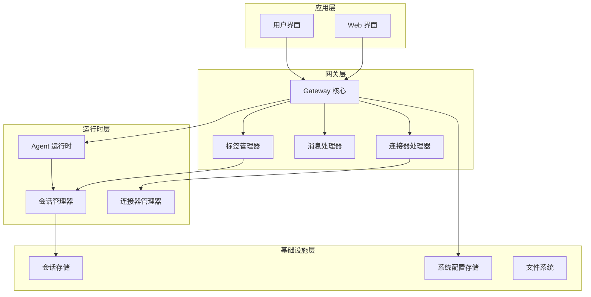

**图表来源**
- [gateway.ts:29-114](file://src/main/gateway.ts#L29-L114)
- [gateway-tab.ts:26-61](file://src/main/gateway-tab.ts#L26-L61)
- [gateway-message.ts:31-64](file://src/main/gateway-message.ts#L31-L64)

**章节来源**
- [gateway.ts:1-772](file://src/main/gateway.ts#L1-L772)
- [index.ts:1-800](file://src/main/index.ts#L1-L800)

## 核心组件

### Gateway 核心类

Gateway 类是整个系统的核心控制器，负责协调所有子组件的交互。其主要职责包括：

- **会话生命周期管理**：创建、销毁和管理 AgentRuntime 实例
- **消息路由**：将用户消息路由到相应的 AgentRuntime
- **流式响应处理**：实时处理和传输 AI 响应流
- **多实例协调**：管理每个标签页对应的独立 AgentRuntime

### 标签管理系统

GatewayTabManager 负责标签页的完整生命周期管理：

- **标签创建和销毁**：支持普通标签、连接器标签和定时任务标签
- **历史消息加载**：从会话存储中加载历史消息
- **持久化管理**：将标签配置持久化到数据库
- **内存文件管理**：为每个标签页管理独立的内存文件

### 消息处理系统

GatewayMessageHandler 实现了智能的消息队列和处理机制：

- **消息队列管理**：处理并发消息的排队和调度
- **流式响应处理**：实时传输 AI 响应的流式内容
- **错误处理和恢复**：自动处理 AI 连接错误并尝试恢复
- **执行步骤跟踪**：实时跟踪和报告执行步骤状态

### 连接器管理系统

GatewayConnectorHandler 处理来自外部连接器的消息：

- **连接器消息路由**：将外部消息转换为内部格式并路由到相应标签
- **系统命令处理**：处理 /new、/memory、/history 等系统命令
- **进度提醒机制**：为长时间任务提供进度提醒
- **响应回传**：将 AI 响应发送回外部连接器

**章节来源**
- [gateway.ts:29-114](file://src/main/gateway.ts#L29-L114)
- [gateway-tab.ts:26-61](file://src/main/gateway-tab.ts#L26-L61)
- [gateway-message.ts:31-64](file://src/main/gateway-message.ts#L31-L64)
- [gateway-connector.ts:44-88](file://src/main/gateway-connector.ts#L44-L88)

## 架构概览

Gateway 系统采用事件驱动的架构模式，通过精心设计的依赖注入机制实现松耦合的组件交互：

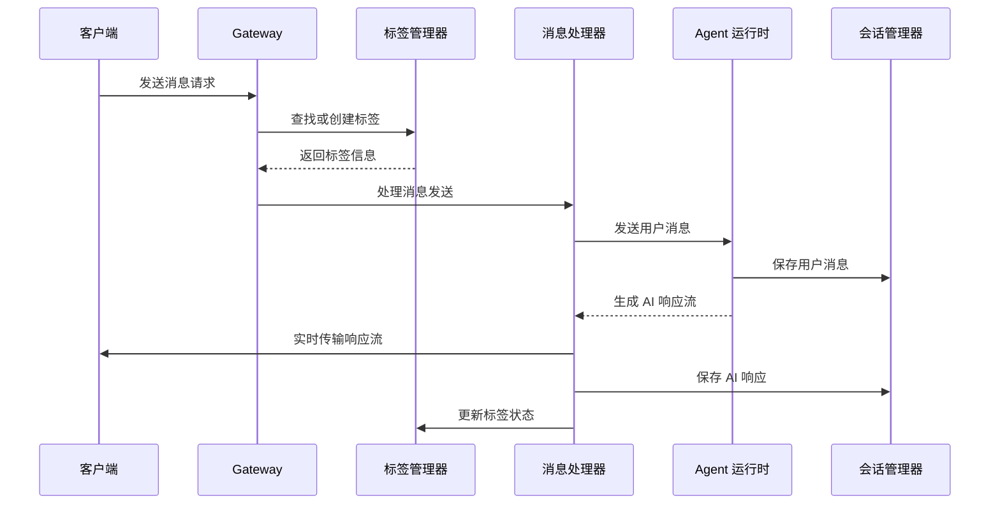

**图表来源**
- [gateway.ts:455-458](file://src/main/gateway.ts#L455-L458)
- [gateway-message.ts:76-160](file://src/main/gateway-message.ts#L76-L160)

系统架构的关键特点：

1. **模块化设计**：每个组件都有明确的职责边界
2. **事件驱动**：通过 IPC 通道实现组件间通信
3. **异步处理**：大量使用 Promise 和 async/await 实现非阻塞操作
4. **依赖注入**：通过 setDependencies 方法实现组件间的依赖关系管理

**章节来源**
- [gateway.ts:337-374](file://src/main/gateway.ts#L337-L374)
- [gateway-adapter.ts:45-58](file://src/server/gateway-adapter.ts#L45-L58)

## 详细组件分析

### Gateway 初始化流程

Gateway 的初始化过程是一个复杂的依赖注入和组件装配过程：

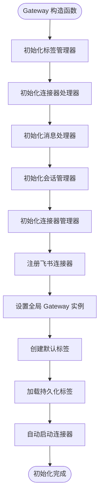

**图表来源**
- [gateway.ts:53-114](file://src/main/gateway.ts#L53-L114)

初始化过程的关键步骤：

1. **组件创建**：按顺序创建所有核心组件实例
2. **依赖注入**：通过 setupHandlerDependencies 方法注入依赖关系
3. **配置加载**：异步加载系统配置和持久化数据
4. **连接器启动**：自动启动已启用的连接器

### 会话生命周期管理

系统支持多种类型的标签页，每种类型都有特定的生命周期管理策略：

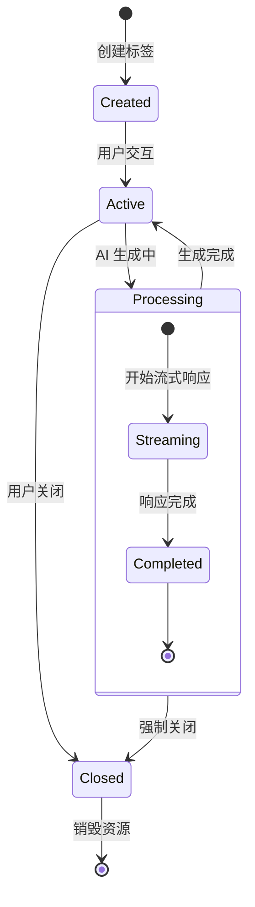

**图表来源**
- [gateway-tab.ts:687-761](file://src/main/gateway-tab.ts#L687-L761)
- [agent-runtime.ts:537-564](file://src/main/agent-runtime/agent-runtime.ts#L537-L564)

### 流式响应处理机制

Gateway 实现了高效的流式响应处理机制，确保用户能够实时接收 AI 响应：

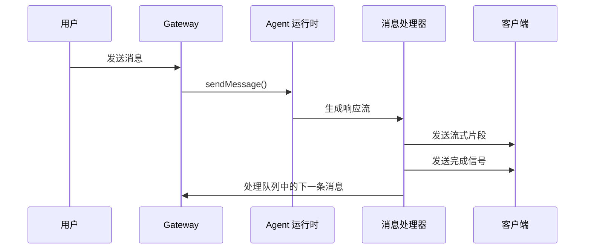

**图表来源**
- [gateway-message.ts:376-473](file://src/main/gateway-message.ts#L376-L473)

流式处理的关键特性：

1. **实时传输**：响应片段实时传输到客户端
2. **状态跟踪**：实时跟踪执行步骤和进度
3. **错误恢复**：自动处理连接错误并尝试恢复
4. **队列管理**：智能管理并发消息队列

### 多 AgentRuntime 实例协调

系统为每个标签页维护独立的 AgentRuntime 实例，确保会话隔离和并发处理：

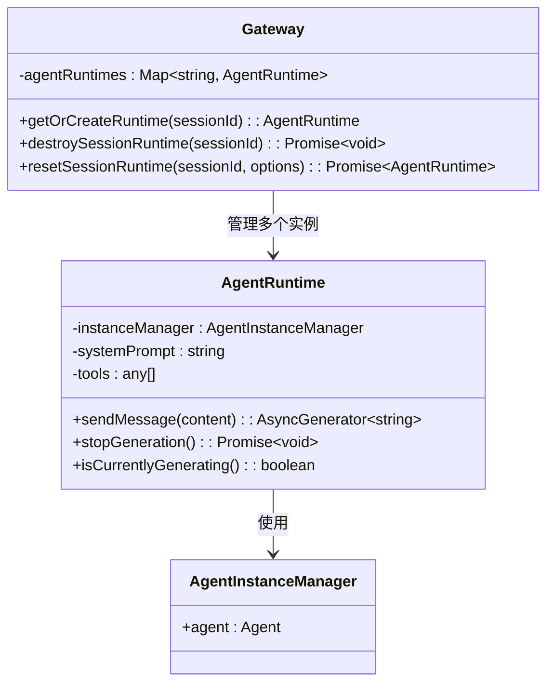

**图表来源**
- [gateway.ts:430-450](file://src/main/gateway.ts#L430-L450)
- [agent-runtime.ts:27-58](file://src/main/agent-runtime/agent-runtime.ts#L27-L58)

**章节来源**
- [gateway.ts:424-557](file://src/main/gateway.ts#L424-L557)
- [agent-runtime.ts:658-688](file://src/main/agent-runtime/agent-runtime.ts#L658-L688)

### Electron 主进程与 Web 模式的差异

Gateway 系统支持两种部署模式，每种模式都有特定的实现方式：

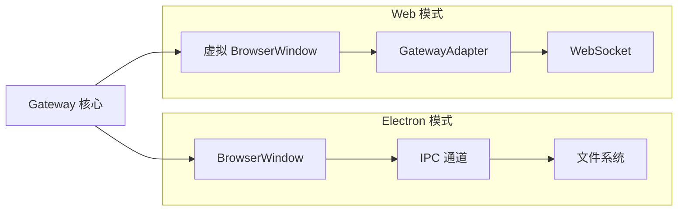

**图表来源**
- [gateway.ts:391-408](file://src/main/gateway.ts#L391-L408)
- [gateway-adapter.ts:45-65](file://src/server/gateway-adapter.ts#L45-L65)

两种模式的关键差异：

1. **窗口管理**：Electron 使用真实的 BrowserWindow，Web 使用虚拟窗口
2. **通信机制**：Electron 使用 IPC，Web 使用 WebSocket
3. **文件系统**：Electron 直接访问文件系统，Web 通过适配器间接访问

**章节来源**
- [gateway.ts:379-408](file://src/main/gateway.ts#L379-L408)
- [gateway-adapter.ts:17-43](file://src/server/gateway-adapter.ts#L17-L43)

## 依赖关系分析

Gateway 系统的依赖关系设计体现了良好的软件工程原则：

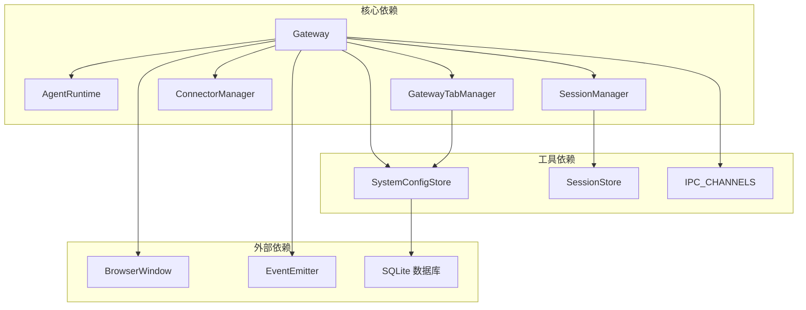

**图表来源**
- [gateway.ts:11-27](file://src/main/gateway.ts#L11-L27)
- [system-config-store.ts:37-70](file://src/main/database/system-config-store.ts#L37-L70)

### 依赖注入机制

系统采用集中式的依赖注入机制，通过 setDependencies 方法实现：

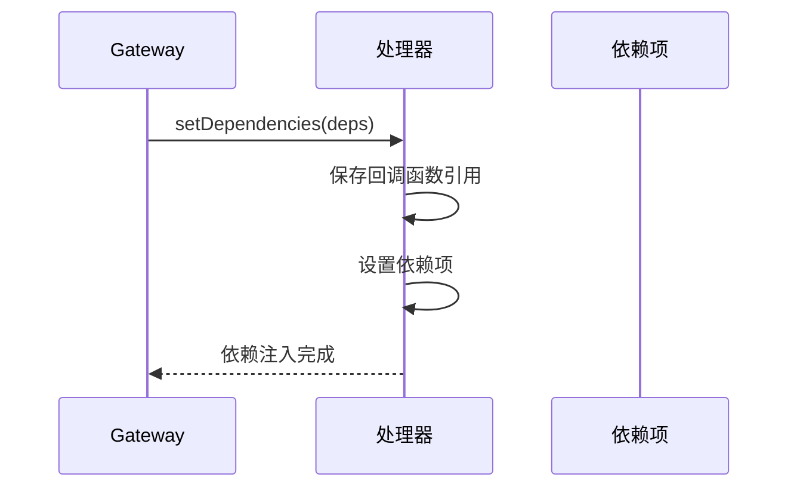

**图表来源**
- [gateway-connector.ts:66-88](file://src/main/gateway-connector.ts#L66-L88)
- [gateway-message.ts:49-64](file://src/main/gateway-message.ts#L49-L64)

**章节来源**
- [gateway.ts:337-374](file://src/main/gateway.ts#L337-L374)
- [gateway-connector.ts:66-88](file://src/main/gateway-connector.ts#L66-L88)

## 性能考虑

### 内存管理优化

系统采用了多项内存管理优化策略：

1. **懒加载机制**：AgentRuntime 实例按需创建，避免不必要的内存占用
2. **连接器缓存**：AI 连接在首次使用时建立并缓存
3. **会话数据分页**：使用倒序读取优化，减少内存占用
4. **资源及时释放**：标签关闭时及时释放相关资源

### 并发处理优化

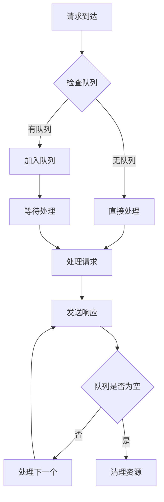

**图表来源**
- [gateway-message.ts:199-211](file://src/main/gateway-message.ts#L199-L211)

### 数据持久化优化

系统采用 JSONL 格式存储会话数据，具有以下优势：

1. **流式读取**：支持从文件末尾开始倒序读取，提高性能
2. **增量写入**：消息以追加方式写入，避免文件重建
3. **压缩存储**：结合上下文压缩算法，减少存储空间
4. **原子操作**：使用文件系统原子操作保证数据一致性

**章节来源**
- [session-store.ts:146-217](file://src/main/session/session-store.ts#L146-L217)
- [agent-runtime.ts:236-308](file://src/main/agent-runtime/agent-runtime.ts#L236-L308)

## 故障排除指南

### 常见错误类型和处理策略

系统实现了完善的错误处理和恢复机制：

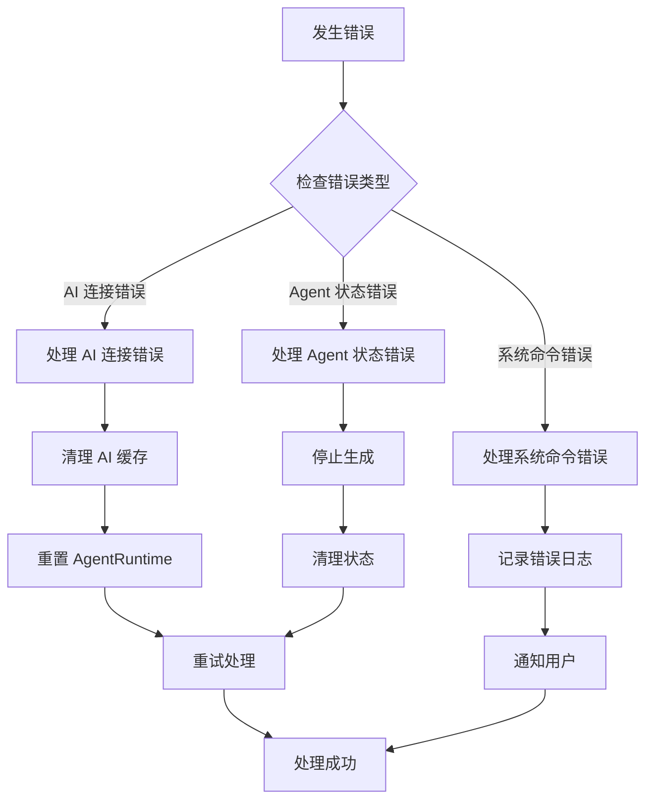

**图表来源**
- [gateway-message.ts:246-283](file://src/main/gateway-message.ts#L246-L283)

### 错误恢复策略

系统提供了多层次的错误恢复机制：

1. **自动恢复**：对于短暂的网络错误，系统会自动重试
2. **手动干预**：对于严重错误，提供用户友好的错误提示
3. **状态重置**：在必要时重置 AgentRuntime 状态
4. **资源清理**：确保错误处理后系统状态的一致性

### 调试和监控

系统提供了丰富的调试和监控功能：

1. **详细日志记录**：每个关键操作都有详细的日志记录
2. **状态监控**：实时监控 AgentRuntime 和连接器状态
3. **性能指标**：跟踪响应时间和资源使用情况
4. **错误报告**：收集和分析系统错误信息

**章节来源**
- [gateway-message.ts:231-283](file://src/main/gateway-message.ts#L231-L283)
- [gateway-connector.ts:773-798](file://src/main/gateway-connector.ts#L773-L798)

## 结论

史丽慧小助理 Gateway 网关系统通过精心设计的架构和实现，成功地解决了多标签页并发会话管理、消息路由、流式响应处理等复杂问题。系统的核心优势包括：

1. **模块化设计**：清晰的职责分离和组件边界
2. **高并发支持**：高效的队列管理和资源隔离
3. **灵活部署**：支持 Electron 和 Web 两种部署模式
4. **强大扩展性**：插件化的连接器和工具系统
5. **完善监控**：全面的日志记录和错误处理机制

该系统为 史丽慧小助理 AI 助手提供了稳定可靠的技术基础，能够满足从个人用户到企业级应用的各种需求。通过持续的优化和改进，Gateway 系统将继续为用户提供优秀的 AI 助手体验。