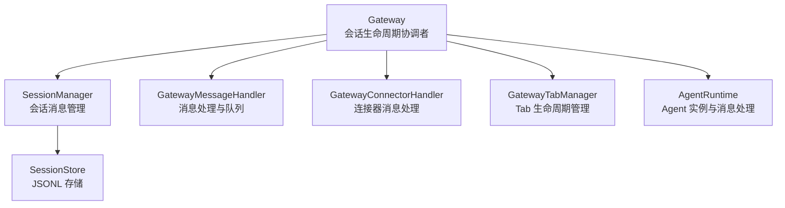
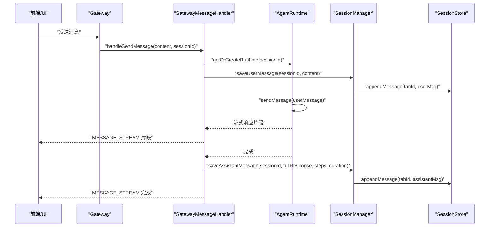
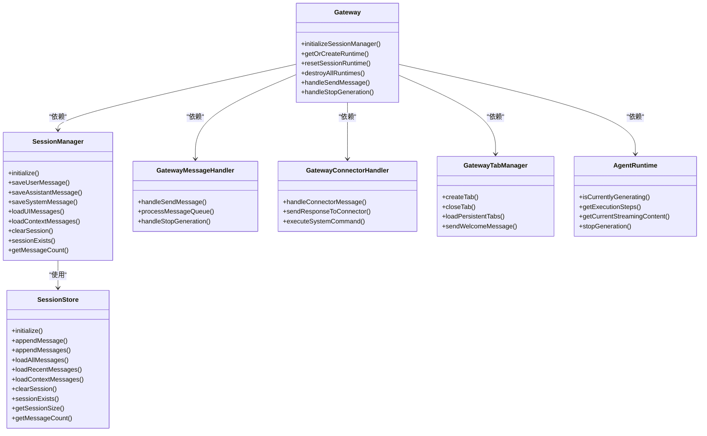

# 会话生命周期管理

<cite>
**本文档引用的文件**
- [gateway.ts](file://src/main/gateway.ts)
- [gateway-connector.ts](file://src/main/gateway-connector.ts)
- [gateway-message.ts](file://src/main/gateway-message.ts)
- [gateway-tab.ts](file://src/main/gateway-tab.ts)
- [session-manager.ts](file://src/main/session/session-manager.ts)
- [session-store.ts](file://src/main/session/session-store.ts)
- [id-generator.ts](file://src/shared/utils/id-generator.ts)
- [timeouts.ts](file://src/main/config/timeouts.ts)
- [agent-runtime.ts](file://src/main/agent-runtime/agent-runtime.ts)
- [agent-tab.ts](file://src/types/agent-tab.ts)
- [tab-config.ts](file://src/main/database/tab-config.ts)
</cite>

## 目录
1. [简介](#简介)
2. [项目结构](#项目结构)
3. [核心组件](#核心组件)
4. [架构总览](#架构总览)
5. [详细组件分析](#详细组件分析)
6. [依赖关系分析](#依赖关系分析)
7. [性能考量](#性能考量)
8. [故障排查指南](#故障排查指南)
9. [结论](#结论)
10. [附录](#附录)

## 简介
本文件面向 史丽慧小助理 的会话生命周期管理，系统性阐述 Gateway 如何管理多个并发会话的完整生命周期，包括会话创建、激活、休眠、销毁等状态转换；深入解析 SessionManager 的设计原理，包括会话存储机制、持久化策略、内存管理；解释会话 ID 生成规则、会话状态跟踪、会话超时处理等关键技术实现；提供会话创建流程、状态查询方法、会话清理机制的具体示例；给出最佳实践，包括内存优化策略、异常处理方案、性能监控指标，并解释会话管理在多 Agent 协作场景下的重要性与实现细节。

## 项目结构
围绕会话生命周期管理的关键模块如下：
- Gateway：会话生命周期与消息路由的核心协调者，负责会话创建、激活、重置、销毁，以及与 AgentRuntime、SessionManager、Tab 管理器、连接器的集成。
- SessionManager：会话消息的持久化与加载接口，提供 UI 消息与 Agent 上下文消息的读取、清理、计数等能力。
- SessionStore：底层 JSONL 文件存储，负责消息的追加、最近消息倒序读取、文件清理、消息计数等。
- GatewayMessageHandler：消息处理与队列管理，负责将用户消息转发至 AgentRuntime，处理流式响应，错误恢复与队列推进。
- GatewayConnectorHandler：连接器消息处理，负责将外部连接器消息映射到会话，支持系统指令、进度提醒、队列处理。
- GatewayTabManager：Tab 生命周期管理，负责 Tab 创建、关闭、持久化、历史加载、欢迎消息、任务 Tab 等。
- AgentRuntime：Agent 实例生命周期与消息处理，负责实际的 AI 交互、执行步骤跟踪、状态查询、停止生成等。
- ID 生成器：统一生成消息 ID、用户消息 ID、Tab ID、执行 ID 等，保证全局唯一性。
- 超时配置：集中管理会话相关超时参数，如会话清理、归档、扫描间隔等。

图表来源
- [gateway.ts:33-138](file://src/main/gateway.ts#L33-L138)
- [gateway-message.ts:31-64](file://src/main/gateway-message.ts#L31-L64)
- [gateway-connector.ts:44-88](file://src/main/gateway-connector.ts#L44-L88)
- [gateway-tab.ts:26-61](file://src/main/gateway-tab.ts#L26-L61)
- [session-manager.ts:17-33](file://src/main/session/session-manager.ts#L17-L33)
- [session-store.ts:46-63](file://src/main/session/session-store.ts#L46-L63)

章节来源
- [gateway.ts:33-138](file://src/main/gateway.ts#L33-L138)
- [gateway-message.ts:31-64](file://src/main/gateway-message.ts#L31-L64)
- [gateway-connector.ts:44-88](file://src/main/gateway-connector.ts#L44-L88)
- [gateway-tab.ts:26-61](file://src/main/gateway-tab.ts#L26-L61)
- [session-manager.ts:17-33](file://src/main/session/session-manager.ts#L17-L33)
- [session-store.ts:46-63](file://src/main/session/session-store.ts#L46-L63)

## 核心组件
- SessionManager：封装 SessionStore，提供用户消息、AI 响应、系统消息的保存与加载，UI 消息与上下文消息的读取，会话清理、存在性检查、消息计数等。
- SessionStore：以 JSONL 文件形式存储每条消息，支持追加、批量追加、最近 N 轮消息倒序读取、上下文消息读取、文件清理、存在性检查、文件大小与消息计数查询。
- Gateway：作为会话生命周期的中枢，负责初始化 SessionManager、管理 AgentRuntime 实例（每个 Tab 一个）、处理消息路由、系统指令、重置与销毁、连接器消息桥接、Web 模式初始化等。
- GatewayMessageHandler：负责消息队列、AI 连接错误自动恢复、流式响应发送、执行步骤实时上报、队列推进、停止生成等。
- GatewayConnectorHandler：负责连接器消息的解析、系统指令识别、进度提醒定时器、队列处理、回执发送等。
- GatewayTabManager：负责 Tab 的创建、关闭、持久化、历史加载、欢迎消息、任务 Tab、标题更新、活动时间更新等。
- AgentRuntime：负责 Agent 实例的生命周期、消息处理、执行步骤跟踪、状态查询、停止生成、系统提示词重载等。

章节来源
- [session-manager.ts:17-193](file://src/main/session/session-manager.ts#L17-L193)
- [session-store.ts:46-321](file://src/main/session/session-store.ts#L46-L321)
- [gateway.ts:33-772](file://src/main/gateway.ts#L33-L772)
- [gateway-message.ts:31-524](file://src/main/gateway-message.ts#L31-L524)
- [gateway-connector.ts:44-813](file://src/main/gateway-connector.ts#L44-L813)
- [gateway-tab.ts:26-795](file://src/main/gateway-tab.ts#L26-L795)
- [agent-runtime.ts:27-200](file://src/main/agent-runtime/agent-runtime.ts#L27-L200)

## 架构总览
Gateway 作为会话生命周期的中枢，协调 SessionManager、GatewayMessageHandler、GatewayConnectorHandler、GatewayTabManager 与 AgentRuntime。消息从 UI 或连接器进入，经过 Gateway 的路由与处理，最终由 AgentRuntime 生成流式响应并通过 SessionManager 持久化，同时通过 IPC 通道发送到前端。

图表来源
- [gateway.ts:479-490](file://src/main/gateway.ts#L479-L490)
- [gateway-message.ts:76-160](file://src/main/gateway-message.ts#L76-L160)
- [session-manager.ts:38-85](file://src/main/session/session-manager.ts#L38-L85)
- [session-store.ts:75-85](file://src/main/session/session-store.ts#L75-L85)
- [agent-runtime.ts:27-200](file://src/main/agent-runtime/agent-runtime.ts#L27-L200)

## 详细组件分析

### SessionManager 设计与实现
- 职责边界
  - 管理 SessionStore 实例
  - 提供消息持久化与加载接口
  - 管理上下文消息（最近 10 轮）
- 关键能力
  - 保存用户消息、AI 响应、系统消息
  - 加载 UI 显示消息（最近 100 轮）、加载 Agent 上下文消息（最近 10 轮）
  - 清空会话、检查会话存在性、获取消息数量
  - 将 SessionMessage 转换为 UI Message（过滤系统指令/提示）
  - 获取底层 SessionStore 实例与会话文件路径
- 设计要点
  - 通过 MAX_UI_ROUNDS 与 MAX_CONTEXT_ROUNDS 控制不同场景的消息上限
  - convertToUIMessages 过滤系统指令与系统提示，保障 UI 清晰
  - 通过 SessionStore 的 JSONL 文件实现轻量持久化

章节来源
- [session-manager.ts:17-193](file://src/main/session/session-manager.ts#L17-L193)

### SessionStore 设计与实现
- 职责边界
  - 管理每个 Tab 的对话历史（JSONL 格式）
  - 支持消息持久化与加载
  - 支持最近 N 轮消息查询
- 关键能力
  - 初始化会话目录
  - 追加消息、批量追加消息
  - 加载所有消息、加载最近 N 轮消息（倒序读取优化）、加载上下文消息
  - 清空会话文件、检查会话存在性、获取会话大小、获取消息数量
- 性能优化
  - loadRecentMessagesFromFile 倒序读取，遇到足够轮次后立即停止
  - getMessageCount 仅统计行数，不解析 JSON，降低 IO 成本
  - appendMessages 批量写入，减少磁盘写放大

章节来源
- [session-store.ts:46-321](file://src/main/session/session-store.ts#L46-L321)

### Gateway 会话生命周期管理
- 会话创建
  - 默认 Tab：创建 default Tab 并异步加载历史或发送欢迎消息
  - 普通 Tab：通过 GatewayTabManager.createTab 生成唯一 Tab ID，支持持久化与标题生成
  - 连接器 Tab：根据 conversationKey 查找或创建，支持飞书群名称动态更新
- 会话激活
  - 激活 Tab 时延迟加载历史，非激活 Tab 延迟加载，避免阻塞
  - 欢迎消息：当历史为空或仅含系统消息时，发送欢迎消息
- 会话重置与销毁
  - resetSessionRuntime：销毁并可选择性重建 AgentRuntime，用于错误恢复或配置变更
  - destroySessionRuntime：仅销毁指定会话的 Runtime
  - destroyAllRuntimes：批量销毁所有会话的 Runtime
- 会话清理
  - reloadSessionManager：重新初始化 SessionManager，适配会话目录变更
  - clearSession：通过 SessionManager 清空会话文件
- 会话状态跟踪
  - isSessionExecuting：查询会话是否正在生成
  - getActiveSessionCount、getSessionIds：调试与监控
- 会话超时处理
  - 通过 TIMEOUTS.SESSION_CLEANUP_TIMEOUT、SESSION_ARCHIVE_AFTER、SESSION_SWEEP_INTERVAL 等参数集中管理会话相关超时

章节来源
- [gateway.ts:57-138](file://src/main/gateway.ts#L57-L138)
- [gateway.ts:146-148](file://src/main/gateway.ts#L146-L148)
- [gateway.ts:288-305](file://src/main/gateway.ts#L288-L305)
- [gateway.ts:440-446](file://src/main/gateway.ts#L440-L446)
- [gateway.ts:527-581](file://src/main/gateway.ts#L527-L581)
- [gateway.ts:588-599](file://src/main/gateway.ts#L588-L599)
- [timeouts.ts:44-47](file://src/main/config/timeouts.ts#L44-L47)

### GatewayMessageHandler 消息处理与队列
- 消息队列
  - 每个会话维护独立队列，普通 Tab 在 Agent 正在生成时入队，定时任务 Tab 等待上一次执行完成
  - processMessageQueue 递归处理队列，支持错误恢复与自动重试
- 流式响应
  - 实时发送执行步骤更新，确保前端能及时看到工具调用状态
  - sendMessage 完成后发送完成信号与总时长
- 错误处理与自动恢复
  - 检测 AI 连接错误，清理 AI 缓存，重置 Runtime，自动重试
  - 对 Agent 状态异常进行状态清理与重试
- 停止生成
  - handleStopGeneration：调用 resetSessionRuntime，停止当前会话的生成

章节来源
- [gateway-message.ts:31-524](file://src/main/gateway-message.ts#L31-L524)

### GatewayConnectorHandler 连接器消息处理
- 系统指令
  - 支持 /status、/stop 等系统指令的特殊处理，不经过消息队列
  - 其他系统指令通过 executeSystemCommand 执行
- 进度提醒
  - 启动进度提醒定时器，按预设节点向用户发送“还在执行中”的提醒
  - 真实响应到达后清除定时器
- 队列处理
  - 将连接器消息加入 Tab 的 pendingMessages 队列，按顺序处理
  - 支持飞书群组场景的动态群名称更新

章节来源
- [gateway-connector.ts:98-296](file://src/main/gateway-connector.ts#L98-L296)
- [gateway-connector.ts:369-425](file://src/main/gateway-connector.ts#L369-L425)
- [gateway-connector.ts:773-798](file://src/main/gateway-connector.ts#L773-L798)

### GatewayTabManager Tab 生命周期
- 创建与关闭
  - createTab：生成唯一 Tab ID，支持持久化、标题生成、memory 文件创建
  - closeTab：关闭 Tab 时销毁对应 Runtime、删除 memory 文件、清空 session 文件、删除持久化配置
- 持久化
  - 通过 SQLite 表 agent_tabs 持久化 Tab 配置，支持标题更新、删除、清理非持久化 Tab
- 历史加载与欢迎消息
  - loadTabHistory：按需加载 Tab 历史
  - loadPersistentTabs：启动时恢复持久化 Tab
  - sendWelcomeMessage：根据历史情况决定是否发送欢迎消息
- 任务 Tab
  - getOrCreateTaskTab：为定时任务创建锁定的专属 Tab，支持暂停任务

章节来源
- [gateway-tab.ts:492-611](file://src/main/gateway-tab.ts#L492-L611)
- [gateway-tab.ts:687-761](file://src/main/gateway-tab.ts#L687-L761)
- [gateway-tab.ts:422-487](file://src/main/gateway-tab.ts#L422-L487)
- [gateway-tab.ts:616-652](file://src/main/gateway-tab.ts#L616-L652)
- [tab-config.ts:46-93](file://src/main/database/tab-config.ts#L46-L93)

### AgentRuntime 会话状态与执行
- 生命周期
  - 构造函数：根据配置创建模型对象，初始化各模块实例
  - initialize：异步初始化 Agent、工具、消息处理器等
- 状态查询
  - isCurrentlyGenerating：查询是否正在生成
  - getExecutionSteps、getCurrentStreamingContent：获取执行步骤与当前流式输出
- 停止生成
  - stopGeneration：停止当前生成，配合 resetSessionRuntime 使用
- 系统提示词重载
  - reloadSystemPrompt：在系统提示词更新后重载

章节来源
- [agent-runtime.ts:65-200](file://src/main/agent-runtime/agent-runtime.ts#L65-L200)
- [gateway.ts:312-352](file://src/main/gateway.ts#L312-L352)

### 会话 ID 生成规则
- 消息 ID：generateMessageId
- 用户消息 ID：generateUserMessageId
- 执行 ID：generateExecutionId（基于时间戳）
- Tab ID：generateTabId（基于时间戳 + 可选计数器）
- UUID：generateUUID（简化版）

章节来源
- [id-generator.ts:16-155](file://src/shared/utils/id-generator.ts#L16-L155)

### 会话状态跟踪与查询
- isSessionExecuting：查询会话是否正在生成
- getActiveSessionCount、getSessionIds：获取活跃会话数量与会话 ID 列表
- SessionManager 提供 sessionExists、getMessageCount、getSessionFilePath 等查询能力
- AgentRuntime 提供 getExecutionSteps、getCurrentStreamingContent 等执行状态查询

章节来源
- [gateway.ts:440-446](file://src/main/gateway.ts#L440-L446)
- [gateway.ts:588-599](file://src/main/gateway.ts#L588-L599)
- [session-manager.ts:142-151](file://src/main/session/session-manager.ts#L142-L151)
- [session-manager.ts:185-192](file://src/main/session/session-manager.ts#L185-L192)
- [gateway-message.ts:438-441](file://src/main/gateway-message.ts#L438-L441)

### 会话超时处理
- 会话清理超时：SESSION_CLEANUP_TIMEOUT（默认 30 分钟）
- 会话归档时间：SESSION_ARCHIVE_AFTER（默认 1 小时）
- 会话扫描间隔：SESSION_SWEEP_INTERVAL（默认 1 分钟）
- 会话管理器初始化超时：SESSION_MANAGER_INIT_TIMEOUT（默认 5 秒）

章节来源
- [timeouts.ts:44-52](file://src/main/config/timeouts.ts#L44-L52)

### 会话创建流程示例
- 默认 Tab 创建与历史加载
  - createDefaultTab：创建 default Tab
  - loadDefaultTabHistory：异步加载历史或发送欢迎消息
- 普通 Tab 创建
  - createTab：生成唯一 Tab ID，持久化配置，创建 memory 文件
- 连接器 Tab 创建
  - handleConnectorMessage：根据 conversationKey 查找或创建，支持飞书群名称动态更新

章节来源
- [gateway-tab.ts:88-108](file://src/main/gateway-tab.ts#L88-L108)
- [gateway-tab.ts:137-183](file://src/main/gateway-tab.ts#L137-L183)
- [gateway-tab.ts:492-611](file://src/main/gateway-tab.ts#L492-L611)
- [gateway-connector.ts:118-190](file://src/main/gateway-connector.ts#L118-L190)

### 状态查询方法示例
- 查询会话是否正在生成
  - isSessionExecuting(sessionId)
- 获取活跃会话数量与会话 ID 列表
  - getActiveSessionCount()、getSessionIds()
- 查询会话是否存在与消息数量
  - sessionExists(tabId)、getMessageCount(tabId)
- 查询会话文件路径
  - getSessionFilePath(tabId)

章节来源
- [gateway.ts:440-446](file://src/main/gateway.ts#L440-L446)
- [gateway.ts:588-599](file://src/main/gateway.ts#L588-L599)
- [session-manager.ts:142-151](file://src/main/session/session-manager.ts#L142-L151)
- [session-manager.ts:185-192](file://src/main/session/session-manager.ts#L185-L192)

### 会话清理机制示例
- 清空会话历史
  - clearSession(tabId)：通过 SessionManager 清空会话文件
- 重置会话 Runtime
  - resetSessionRuntime(sessionId, { recreate: false })：销毁并重置，不清空历史
- 关闭 Tab 并清理
  - closeTab(tabId)：销毁 Runtime、删除 memory 文件、清空 session 文件、删除持久化配置

章节来源
- [session-manager.ts:135-137](file://src/main/session/session-manager.ts#L135-L137)
- [gateway.ts:552-581](file://src/main/gateway.ts#L552-L581)
- [gateway-tab.ts:687-761](file://src/main/gateway-tab.ts#L687-L761)

### 多 Agent 协作场景下的会话管理
- 每个 Tab 对应一个 AgentRuntime，确保并发会话隔离
- 连接器 Tab 支持队列处理与进度提醒，提升多用户并发体验
- 定时任务 Tab 采用等待策略，避免并发冲突
- 执行步骤实时上报，便于前端与后端协同展示

章节来源
- [gateway.ts:35-46](file://src/main/gateway.ts#L35-L46)
- [gateway-connector.ts:369-425](file://src/main/gateway-connector.ts#L369-L425)
- [gateway-message.ts:165-196](file://src/main/gateway-message.ts#L165-L196)

## 依赖关系分析
- 组件耦合
  - Gateway 与 SessionManager、GatewayMessageHandler、GatewayConnectorHandler、GatewayTabManager、AgentRuntime 高内聚低耦合
  - SessionManager 依赖 SessionStore，提供高层接口
  - GatewayMessageHandler 与 GatewayConnectorHandler 通过回调注入依赖，解耦具体实现
- 外部依赖
  - 文件系统（JSONL）、SQLite（Tab 配置）、IPC 通道（前端通信）、AI 客户端（模型调用）
- 潜在循环依赖
  - 通过回调注入避免直接循环依赖，如 resetSessionRuntime 回调

图表来源
- [gateway.ts:33-138](file://src/main/gateway.ts#L33-L138)
- [session-manager.ts:17-33](file://src/main/session/session-manager.ts#L17-L33)
- [session-store.ts:46-63](file://src/main/session/session-store.ts#L46-L63)
- [gateway-message.ts:31-64](file://src/main/gateway-message.ts#L31-L64)
- [gateway-connector.ts:44-88](file://src/main/gateway-connector.ts#L44-L88)
- [gateway-tab.ts:26-61](file://src/main/gateway-tab.ts#L26-L61)
- [agent-runtime.ts:27-200](file://src/main/agent-runtime/agent-runtime.ts#L27-L200)

## 性能考量
- JSONL 存储与倒序读取
  - SessionStore 的 loadRecentMessagesFromFile 采用倒序读取，遇到足够轮次后立即停止，避免全文件解析
  - getMessageCount 仅统计行数，不解析 JSON，降低 IO 成本
- 消息队列与等待策略
  - 普通 Tab：Agent 正在生成时入队，避免并发冲突
  - 定时任务 Tab：等待上一次执行完成，确保任务有序执行
- 实时执行步骤上报
  - GatewayMessageHandler 在 sendAIResponse 中设置执行步骤回调，实时发送，无节流，确保前端及时感知
- 连接器进度提醒
  - GatewayConnectorHandler 启动进度提醒定时器，按预设节点发送“还在执行中”提醒，提升用户体验

章节来源
- [session-store.ts:179-217](file://src/main/session/session-store.ts#L179-L217)
- [session-store.ts:295-320](file://src/main/session/session-store.ts#L295-L320)
- [gateway-message.ts:404-413](file://src/main/gateway-message.ts#L404-L413)
- [gateway-connector.ts:773-798](file://src/main/gateway-connector.ts#L773-L798)

## 故障排查指南
- AI 连接错误自动恢复
  - GatewayMessageHandler 检测到 AI 连接错误（超时、网络、ECONNREFUSED、ETIMEDOUT、fetch failed 等），清理 AI 缓存，重置 Runtime，自动重试
- Agent 状态异常
  - 对 Agent 状态异常（already processing、未初始化、卡住等）进行状态清理与重试
- 连接器进度提醒异常
  - 若进度提醒发送失败，记录错误日志，不影响真实响应发送
- 会话清理与归档
  - 结合 TIMEOUTS.SESSION_CLEANUP_TIMEOUT、SESSION_ARCHIVE_AFTER、SESSION_SWEEP_INTERVAL 参数，定期清理长时间未活跃的会话

章节来源
- [gateway-message.ts:246-283](file://src/main/gateway-message.ts#L246-L283)
- [gateway-message.ts:332-368](file://src/main/gateway-message.ts#L332-L368)
- [gateway-connector.ts:782-791](file://src/main/gateway-connector.ts#L782-L791)
- [timeouts.ts:44-47](file://src/main/config/timeouts.ts#L44-L47)

## 结论
史丽慧小助理 的会话生命周期管理通过 Gateway 协调 SessionManager、SessionStore、GatewayMessageHandler、GatewayConnectorHandler、GatewayTabManager 与 AgentRuntime，实现了高并发、可扩展、可观测的会话管理。SessionStore 的 JSONL 存储与倒序读取优化、消息队列与等待策略、实时执行步骤上报、连接器进度提醒等特性，共同保障了良好的用户体验与系统稳定性。结合超时配置与自动恢复机制，系统能够在异常情况下快速恢复并继续提供服务。

## 附录
- 会话类型定义
  - AgentTab：包含 Tab 的 ID、标题、类型、消息历史、创建与活跃时间、持久化配置、连接器信息、任务信息、消息队列等字段
- Tab 配置持久化
  - 通过 SQLite 表 agent_tabs 持久化 Tab 配置，支持标题更新、删除、清理非持久化 Tab

章节来源
- [agent-tab.ts:23-46](file://src/types/agent-tab.ts#L23-L46)
- [tab-config.ts:46-93](file://src/main/database/tab-config.ts#L46-L93)