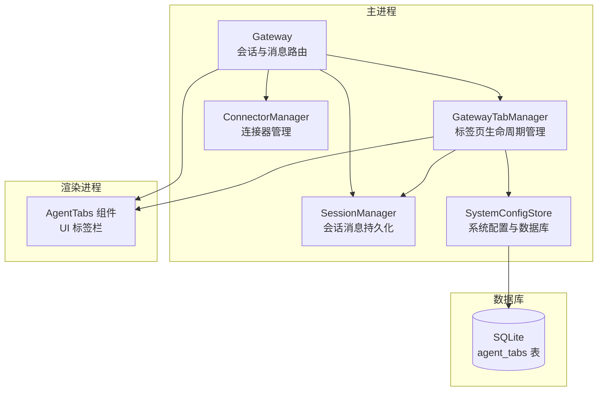
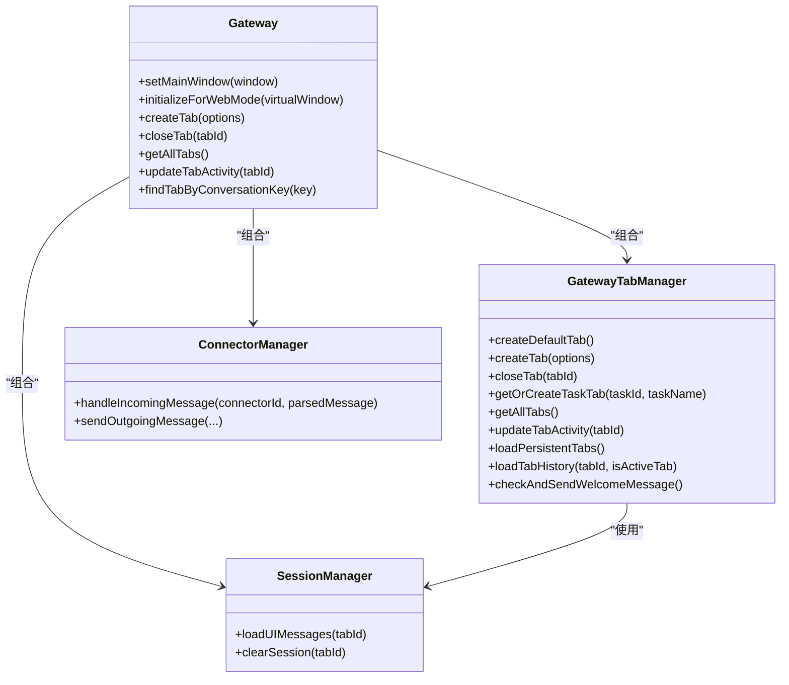
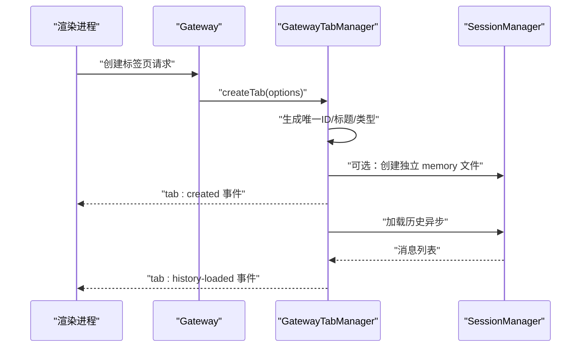
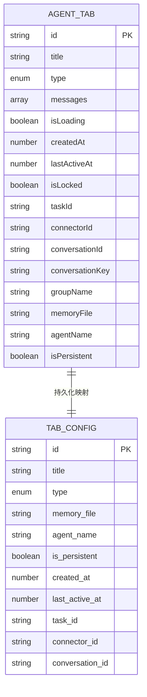
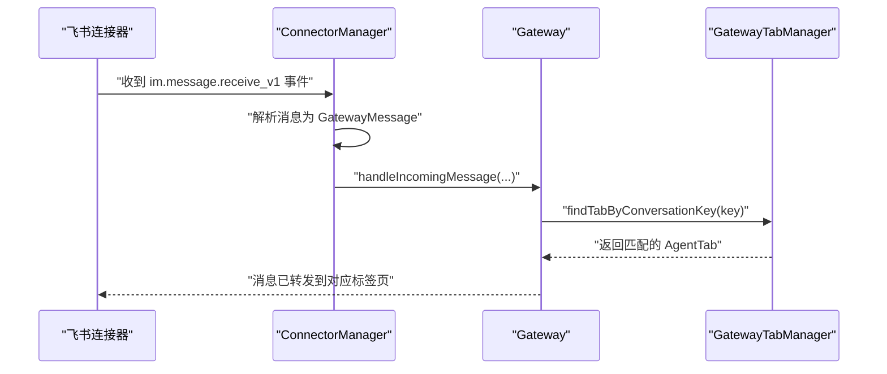
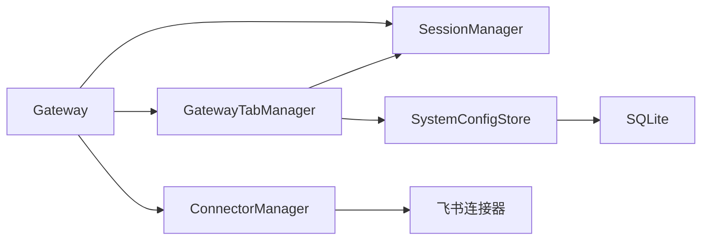

# 标签页管理系统

<cite>
**本文档引用的文件**
- [src/main/gateway-tab.ts](file://src/main/gateway-tab.ts)
- [src/main/gateway.ts](file://src/main/gateway.ts)
- [src/types/agent-tab.ts](file://src/types/agent-tab.ts)
- [src/main/database/tab-config.ts](file://src/main/database/tab-config.ts)
- [src/main/session/session-manager.ts](file://src/main/session/session-manager.ts)
- [src/main/session/session-store.ts](file://src/main/session/session-store.ts)
- [src/main/connectors/connector-manager.ts](file://src/main/connectors/connector-manager.ts)
- [src/main/connectors/feishu/feishu-connector.ts](file://src/main/connectors/feishu/feishu-connector.ts)
- [src/shared/constants/version.ts](file://src/shared/constants/version.ts)
- [src/renderer/components/AgentTabs.tsx](file://src/renderer/components/AgentTabs.tsx)
- [src/main/scheduled-tasks/types.ts](file://src/main/scheduled-tasks/types.ts)
</cite>

## 目录
1. [简介](#简介)
2. [项目结构](#项目结构)
3. [核心组件](#核心组件)
4. [架构总览](#架构总览)
5. [详细组件分析](#详细组件分析)
6. [依赖关系分析](#依赖关系分析)
7. [性能考量](#性能考量)
8. [故障排查指南](#故障排查指南)
9. [结论](#结论)
10. [附录](#附录)

## 简介
本文件面向 DeepBot 的标签页管理系统，重点围绕 GatewayTabManager 的设计原理与实现机制展开，涵盖标签页的创建、切换、关闭、持久化等核心功能；解释不同类型标签页（普通聊天标签页、连接器专用标签页、定时任务标签页）的管理策略；阐述标签页标题生成规则、活动状态跟踪、会话键值管理等关键技术实现；并提供具体的代码示例路径，展示标签页创建流程、状态查询方法、配置持久化机制。同时给出用户体验优化建议与多任务并行处理在用户界面交互中的作用说明。

## 项目结构
标签页系统位于主进程（src/main），并与会话存储、连接器、定时任务等模块协同工作。前端渲染侧通过 IPC 与主进程通信，实现标签页的创建、关闭与状态同步。

图示来源
- [src/main/gateway.ts](file://src/main/gateway.ts)
- [src/main/gateway-tab.ts](file://src/main/gateway-tab.ts)
- [src/main/session/session-manager.ts](file://src/main/session/session-manager.ts)
- [src/main/database/tab-config.ts](file://src/main/database/tab-config.ts)
- [src/main/connectors/connector-manager.ts](file://src/main/connectors/connector-manager.ts)
- [src/renderer/components/AgentTabs.tsx](file://src/renderer/components/AgentTabs.tsx)

章节来源
- [src/main/gateway.ts](file://src/main/gateway.ts)
- [src/main/gateway-tab.ts](file://src/main/gateway-tab.ts)
- [src/main/session/session-manager.ts](file://src/main/session/session-manager.ts)
- [src/main/database/tab-config.ts](file://src/main/database/tab-config.ts)
- [src/main/connectors/connector-manager.ts](file://src/main/connectors/connector-manager.ts)
- [src/renderer/components/AgentTabs.tsx](file://src/renderer/components/AgentTabs.tsx)

## 核心组件
- GatewayTabManager：负责标签页的创建、关闭、查询、历史加载、持久化、欢迎消息处理等生命周期管理。
- AgentTab 类型：定义标签页的数据结构，包括标题、类型、消息历史、加载状态、创建与活跃时间、会话键值、持久化配置等。
- TabConfig/数据库：负责标签页配置的持久化与恢复，包括标题、类型、内存文件、Agent 名称、是否持久化、创建与活跃时间、任务/连接器关联信息。
- SessionManager/SessionStore：负责消息的持久化与加载，支持 UI 展示轮次与上下文轮次的分离。
- ConnectorManager/FeishuConnector：负责外部连接器消息的接入与转发，支持基于 conversationKey 的标签页匹配。
- MAX_TABS：全局最大标签页数量限制。

章节来源
- [src/main/gateway-tab.ts](file://src/main/gateway-tab.ts)
- [src/types/agent-tab.ts](file://src/types/agent-tab.ts)
- [src/main/database/tab-config.ts](file://src/main/database/tab-config.ts)
- [src/main/session/session-manager.ts](file://src/main/session/session-manager.ts)
- [src/main/session/session-store.ts](file://src/main/session/session-store.ts)
- [src/main/connectors/connector-manager.ts](file://src/main/connectors/connector-manager.ts)
- [src/main/connectors/feishu/feishu-connector.ts](file://src/main/connectors/feishu/feishu-connector.ts)
- [src/shared/constants/version.ts](file://src/shared/constants/version.ts)

## 架构总览
Gateway 作为中枢，持有 GatewayTabManager、SessionManager、ConnectorManager 等子系统，并在初始化阶段完成依赖注入与自动启动连接器。GatewayTabManager 与 SessionManager 协同加载/保存标签页历史，与数据库进行持久化交互；与 ConnectorManager 协作处理外部消息并路由至对应标签页。

图示来源
- [src/main/gateway.ts](file://src/main/gateway.ts)
- [src/main/gateway-tab.ts](file://src/main/gateway-tab.ts)
- [src/main/session/session-manager.ts](file://src/main/session/session-manager.ts)
- [src/main/connectors/connector-manager.ts](file://src/main/connectors/connector-manager.ts)

## 详细组件分析

### GatewayTabManager 设计与实现
- 职责边界
  - 标签页生命周期管理：创建、关闭、查询、历史加载、欢迎消息处理、持久化恢复。
  - 会话键值管理：基于 conversationKey 的标签页查找与路由。
  - 活动状态跟踪：维护 lastActiveAt 并在关闭时更新数据库。
  - 任务专属标签页：锁定状态、任务映射、自动暂停任务。
  - 连接器专用标签页：基于 connectorId/conversationId 生成 conversationKey，支持飞书群组名称字段。
  - 定时任务标签页：复用或创建任务专属 Tab，标题带时钟图标，锁定只读。
- 关键实现要点
  - 标题生成：默认继承系统配置中的 Agent 名称，保证不重复；任务/连接器类型自动生成不重复名称。
  - 持久化：手动创建与连接器创建的标签页默认持久化；定时任务标签页持久化类型映射为 task。
  - 内存文件：每个标签页独立 memory 文件，便于独立记忆与清理。
  - 欢迎消息：根据会话历史判断是否发送；Web 模式下延迟发送或发送空历史事件。
  - 历史加载：默认 Tab 延迟加载；非激活 Tab 延迟加载；加载后通过 IPC 事件推送 UI。
  - 关闭流程：销毁对应 AgentRuntime、删除 memory 文件、清空 session 文件、持久化删除、任务暂停。
  - 依赖注入：通过 setDependencies 注入主窗口、SessionManager、消息发送回调、运行时销毁回调、Web 模式检测回调。

图示来源
- [src/main/gateway.ts](file://src/main/gateway.ts)
- [src/main/gateway-tab.ts](file://src/main/gateway-tab.ts)
- [src/main/session/session-manager.ts](file://src/main/session/session-manager.ts)

章节来源
- [src/main/gateway-tab.ts](file://src/main/gateway-tab.ts)
- [src/main/gateway.ts](file://src/main/gateway.ts)
- [src/main/session/session-manager.ts](file://src/main/session/session-manager.ts)
- [src/main/database/tab-config.ts](file://src/main/database/tab-config.ts)

### AgentTab 类型与数据模型
- 字段说明
  - id/title/type/messages/loading/createdAt/lastActiveAt：基础元信息与状态。
  - isLocked/taskId：定时任务专属标签页的锁定与任务绑定。
  - connectorId/conversationId/conversationKey：连接器专用标签页的会话键值。
  - groupName：飞书群组名称（群组标签页专用）。
  - memoryFile/agentName/isPersistent：标签页独立配置，支持继承主 Agent 名称或独立命名。
  - pendingMessages/processingMessageId：连接器标签页的消息队列与当前处理消息 ID。
- 类型映射
  - normal/connector/scheduled_task：前端类型；数据库类型 manual/task/connector。
  - scheduled_task 映射为数据库 task 类型。

图示来源
- [src/types/agent-tab.ts](file://src/types/agent-tab.ts)
- [src/main/database/tab-config.ts](file://src/main/database/tab-config.ts)

章节来源
- [src/types/agent-tab.ts](file://src/types/agent-tab.ts)
- [src/main/database/tab-config.ts](file://src/main/database/tab-config.ts)

### 标签页标题生成规则
- 默认继承系统配置中的 Agent 名称。
- 若提供自定义标题，则直接使用。
- 任务/连接器类型标签页：自动生成不重复的 Agent 名称，避免冲突。
- 飞书群组标签页：支持同步 groupName 字段，便于 UI 展示群名称。

章节来源
- [src/main/gateway-tab.ts](file://src/main/gateway-tab.ts)

### 活动状态跟踪与历史加载
- 活动状态：updateTabActivity 更新 lastActiveAt；持久化标签页通过 updateTabLastActive 同步数据库。
- 历史加载：默认 Tab 延迟加载；非激活 Tab 延迟加载；加载后通过 IPC 事件推送 UI。
- 欢迎消息：根据会话历史判断是否发送；Web 模式下延迟发送或发送空历史事件。

章节来源
- [src/main/gateway-tab.ts](file://src/main/gateway-tab.ts)
- [src/main/session/session-manager.ts](file://src/main/session/session-manager.ts)

### 会话键值管理与连接器路由
- conversationKey：由 connectorId 与 conversationId 组合生成，用于在连接器消息到达时定位对应标签页。
- ConnectorManager：接收外部消息后转换为 GatewayMessage，并交由 Gateway 处理；Gateway 通过 conversationKey 查找标签页并路由消息。
- 飞书连接器：使用 WebSocket 长连接接收消息，解析后交由 ConnectorManager 处理。

图示来源
- [src/main/connectors/feishu/feishu-connector.ts](file://src/main/connectors/feishu/feishu-connector.ts)
- [src/main/connectors/connector-manager.ts](file://src/main/connectors/connector-manager.ts)
- [src/main/gateway.ts](file://src/main/gateway.ts)
- [src/main/gateway-tab.ts](file://src/main/gateway-tab.ts)

章节来源
- [src/main/gateway-tab.ts](file://src/main/gateway-tab.ts)
- [src/main/connectors/connector-manager.ts](file://src/main/connectors/connector-manager.ts)
- [src/main/connectors/feishu/feishu-connector.ts](file://src/main/connectors/feishu/feishu-connector.ts)

### 不同类型标签页的管理策略
- 普通聊天标签页
  - 默认类型 normal；可自定义标题；默认持久化。
  - 支持独立 memory 文件与独立 Agent 名称。
- 连接器专用标签页
  - 类型 connector；conversationKey 由 connectorId 与 conversationId 组合生成。
  - 支持 groupName 字段（飞书群组）；消息队列 pendingMessages 与当前处理消息 processingMessageId。
- 定时任务标签页
  - 类型 scheduled_task；复用或创建任务专属 Tab，标题带时钟图标，锁定只读。
  - 关闭时自动暂停关联任务，避免资源浪费。

章节来源
- [src/main/gateway-tab.ts](file://src/main/gateway-tab.ts)
- [src/types/agent-tab.ts](file://src/types/agent-tab.ts)
- [src/main/scheduled-tasks/types.ts](file://src/main/scheduled-tasks/types.ts)

### 标签页创建流程与状态查询
- 创建流程
  - 参数校验与类型映射；生成唯一 ID 与标题；决定是否持久化与 memory 文件名。
  - 持久化：保存到数据库；创建独立 memory 文件；通知前端 tab:created。
  - 历史加载：异步加载 UI 历史并通过 tab:history-loaded 推送。
- 状态查询
  - getAllTabs 返回按创建时间排序的标签页列表（默认 Tab 置前）。
  - getTab/getTabs 提供按 ID 查询与集合查询。
  - updateTabActivity 更新最后活跃时间；持久化标签页同步数据库。

章节来源
- [src/main/gateway-tab.ts](file://src/main/gateway-tab.ts)

### 配置持久化机制
- 数据库表 agent_tabs：存储标签页的标题、类型、是否持久化、创建与活跃时间、任务/连接器关联信息。
- 保存：createTab 持久化；updateTabTitle 同步数据库；updateTabAgentName 同步 Agent 名称。
- 恢复：loadPersistentTabs 从数据库读取并重建标签页；异步加载历史。
- 清理：deleteNonPersistentTabs 清理非持久化标签页。

章节来源
- [src/main/database/tab-config.ts](file://src/main/database/tab-config.ts)
- [src/main/gateway-tab.ts](file://src/main/gateway-tab.ts)

### 用户体验优化建议
- 标签页排序策略
  - 默认 Tab 置前；其余按创建时间升序排列；可考虑最近活跃优先。
- 快捷键支持
  - Ctrl/Cmd + T 新建标签页；Ctrl/Cmd + W 关闭当前标签页；Ctrl/Cmd + Shift + [ ] 切换标签页。
- 历史记录管理
  - 支持一键清空当前标签页历史；提供“清空所有历史”警告与二次确认。
  - 任务专属标签页默认锁定，避免误操作。
- 会话键值管理
  - 连接器标签页支持群组名称显示；消息队列支持批量处理与回放。
- 多任务并行处理
  - 每个标签页独立 AgentRuntime，互不干扰；任务标签页关闭时自动暂停任务。

章节来源
- [src/renderer/components/AgentTabs.tsx](file://src/renderer/components/AgentTabs.tsx)
- [src/main/gateway-tab.ts](file://src/main/gateway-tab.ts)

## 依赖关系分析
- 组件耦合
  - Gateway 与 GatewayTabManager 高内聚；GatewayTabManager 与 SessionManager、SystemConfigStore、IPC 通信紧密。
  - ConnectorManager 与 Gateway 解耦，通过消息路由解耦外部连接器。
- 外部依赖
  - SQLite：用于标签页配置持久化。
  - 飞书 SDK：WebSocket 长连接接收消息。
  - Electron：IPC 与 BrowserWindow 用于前端通信。
- 潜在循环依赖
  - 通过依赖注入避免循环引用；GatewayTabManager 仅持有回调与 SessionManager 引用。

图示来源
- [src/main/gateway.ts](file://src/main/gateway.ts)
- [src/main/gateway-tab.ts](file://src/main/gateway-tab.ts)
- [src/main/session/session-manager.ts](file://src/main/session/session-manager.ts)
- [src/main/database/tab-config.ts](file://src/main/database/tab-config.ts)
- [src/main/connectors/connector-manager.ts](file://src/main/connectors/connector-manager.ts)
- [src/main/connectors/feishu/feishu-connector.ts](file://src/main/connectors/feishu/feishu-connector.ts)

章节来源
- [src/main/gateway.ts](file://src/main/gateway.ts)
- [src/main/gateway-tab.ts](file://src/main/gateway-tab.ts)
- [src/main/session/session-manager.ts](file://src/main/session/session-manager.ts)
- [src/main/database/tab-config.ts](file://src/main/database/tab-config.ts)
- [src/main/connectors/connector-manager.ts](file://src/main/connectors/connector-manager.ts)
- [src/main/connectors/feishu/feishu-connector.ts](file://src/main/connectors/feishu/feishu-connector.ts)

## 性能考量
- 历史加载优化
  - SessionStore 采用倒序读取文件，仅加载 UI 需要的最近轮次，避免全量加载。
- 消息持久化
  - JSONL 格式逐条追加，减少锁竞争；批量追加支持。
- 标签页数量限制
  - MAX_TABS 控制并发与资源占用，避免过度打开导致性能下降。
- 延迟加载
  - 非激活标签页延迟加载历史，降低初始化开销。
- 连接器去重
  - 飞书连接器内置消息去重与内容去重窗口，减少重复处理。

章节来源
- [src/main/session/session-store.ts](file://src/main/session/session-store.ts)
- [src/shared/constants/version.ts](file://src/shared/constants/version.ts)
- [src/main/connectors/feishu/feishu-connector.ts](file://src/main/connectors/feishu/feishu-connector.ts)

## 故障排查指南
- 标签页创建失败
  - 检查 MAX_TABS 限制；确认数据库连接正常；查看持久化保存日志。
- 历史加载异常
  - 检查 SessionManager 初始化与 session 目录权限；确认文件存在且可读。
- 欢迎消息未发送
  - 检查 Web 模式状态；确认 SessionManager 可用；查看 shouldSendWelcomeMessage 判定逻辑。
- 连接器消息未路由
  - 检查 conversationKey 生成与匹配；确认 ConnectorManager 正常启动；查看消息解析与转发日志。
- 关闭标签页异常
  - 检查是否为默认标签页（不可关闭）；确认 memory 文件与 session 文件清理；持久化配置删除日志。

章节来源
- [src/main/gateway-tab.ts](file://src/main/gateway-tab.ts)
- [src/main/session/session-manager.ts](file://src/main/session/session-manager.ts)
- [src/main/connectors/connector-manager.ts](file://src/main/connectors/connector-manager.ts)

## 结论
GatewayTabManager 通过清晰的职责划分与完善的生命周期管理，实现了标签页的创建、切换、关闭与持久化；结合 SessionManager 的高效历史加载与数据库的配置持久化，为用户提供了稳定可靠的多标签页交互体验。针对连接器与定时任务的专门策略进一步增强了系统的扩展性与可用性。建议在后续迭代中引入标签页排序策略、快捷键支持与历史记录管理等优化，持续提升用户体验。

## 附录
- 代码示例路径（不含具体代码内容）
  - 标签页创建流程：[src/main/gateway-tab.ts](file://src/main/gateway-tab.ts)
  - 状态查询方法：[src/main/gateway-tab.ts](file://src/main/gateway-tab.ts)
  - 配置持久化机制：[src/main/database/tab-config.ts](file://src/main/database/tab-config.ts)
  - 欢迎消息处理：[src/main/gateway-tab.ts](file://src/main/gateway-tab.ts)
  - 连接器消息路由：[src/main/connectors/connector-manager.ts](file://src/main/connectors/connector-manager.ts)
  - 会话历史加载：[src/main/session/session-manager.ts](file://src/main/session/session-manager.ts)