# 消息路由处理机制

<cite>
**本文档引用的文件**
- [gateway.ts](file://src/main/gateway.ts)
- [gateway-message.ts](file://src/main/gateway-message.ts)
- [gateway-connector.ts](file://src/main/gateway-connector.ts)
- [gateway-tab.ts](file://src/main/gateway-tab.ts)
- [agent-runtime.ts](file://src/main/agent-runtime/agent-runtime.ts)
- [message-handler.ts](file://src/main/agent-runtime/message-handler.ts)
- [agent-message-processor.ts](file://src/main/agent-runtime/agent-message-processor.ts)
- [connector-manager.ts](file://src/main/connectors/connector-manager.ts)
- [session-manager.ts](file://src/main/session/session-manager.ts)
- [connector.ts](file://src/types/connector.ts)
- [message.ts](file://src/types/message.ts)
- [ai-client.ts](file://src/main/utils/ai-client.ts)
</cite>

## 目录
1. [简介](#简介)
2. [项目结构](#项目结构)
3. [核心组件](#核心组件)
4. [架构概览](#架构概览)
5. [详细组件分析](#详细组件分析)
6. [依赖关系分析](#依赖关系分析)
7. [性能考虑](#性能考虑)
8. [故障排除指南](#故障排除指南)
9. [结论](#结论)

## 简介

史丽慧小助理 的消息路由处理机制是一个复杂的多层架构，负责管理从用户输入到 AI 响应的完整消息生命周期。该系统采用模块化设计，通过 Gateway 作为中央协调器，将不同类型的消息（用户输入消息、系统消息、连接器消息等）进行智能路由和处理。

系统的核心特点包括：
- **多会话管理**：每个 Tab 对应一个独立的 AgentRuntime 实例
- **消息队列机制**：支持并发消息的有序处理
- **流式响应**：实时传输 AI 响应内容
- **连接器集成**：支持多种外部通信平台
- **智能重试**：自动处理 AI 连接错误

## 项目结构

史丽慧小助理 的消息路由系统主要分布在以下核心文件中：

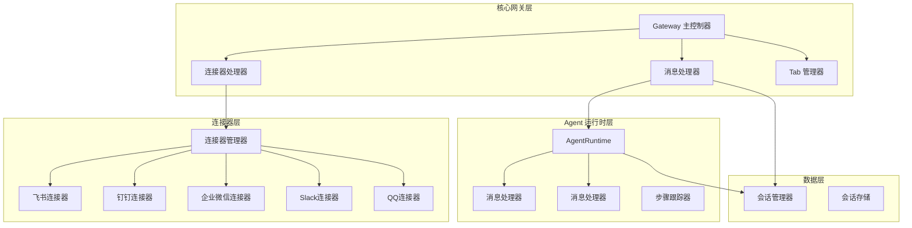

**图表来源**
- [gateway.ts:33-772](file://src/main/gateway.ts#L33-L772)
- [gateway-message.ts:31-524](file://src/main/gateway-message.ts#L31-L524)
- [gateway-connector.ts:44-800](file://src/main/gateway-connector.ts#L44-L800)
- [gateway-tab.ts:26-795](file://src/main/gateway-tab.ts#L26-L795)

**章节来源**
- [gateway.ts:1-796](file://src/main/gateway.ts#L1-L796)
- [gateway-message.ts:1-525](file://src/main/gateway-message.ts#L1-L525)
- [gateway-connector.ts:1-813](file://src/main/gateway-connector.ts#L1-L813)

## 核心组件

### Gateway 主控制器

Gateway 是整个消息路由系统的核心协调器，负责：

- **会话生命周期管理**：管理每个 Tab 的 AgentRuntime 实例
- **消息路由**：将不同类型的消息分发到相应的处理器
- **连接器集成**：管理外部连接器的生命周期
- **资源管理**：统一管理内存和连接资源

关键职责包括：
- 会话 ID 生成和管理
- AgentRuntime 的创建和销毁
- 消息队列的调度
- 错误处理和自动恢复

### 消息处理器 (GatewayMessageHandler)

专门处理用户消息的处理器，具有以下特性：

- **消息类型识别**：区分普通消息和系统命令
- **队列管理**：处理并发消息的有序执行
- **流式响应**：实时传输 AI 响应内容
- **错误恢复**：自动处理 AI 连接错误

### 连接器处理器 (GatewayConnectorHandler)

负责处理来自外部连接器的消息：

- **连接器消息解析**：将外部消息转换为内部格式
- **Tab 管理**：为连接器消息创建和管理专用 Tab
- **系统命令处理**：支持 /status、/stop 等系统命令
- **进度提醒**：向用户发送长时间任务的进度更新

### AgentRuntime

AI Agent 的运行时环境，提供：

- **消息发送接口**：支持流式响应的异步生成器
- **工具执行**：管理 Agent 可用的工具集合
- **状态管理**：跟踪 Agent 的执行状态
- **上下文维护**：维护对话历史和执行步骤

**章节来源**
- [gateway.ts:33-772](file://src/main/gateway.ts#L33-L772)
- [gateway-message.ts:31-524](file://src/main/gateway-message.ts#L31-L524)
- [gateway-connector.ts:44-800](file://src/main/gateway-connector.ts#L44-L800)
- [agent-runtime.ts:27-800](file://src/main/agent-runtime/agent-runtime.ts#L27-L800)

## 架构概览

史丽慧小助理 的消息路由架构采用分层设计，确保了良好的可扩展性和可维护性：

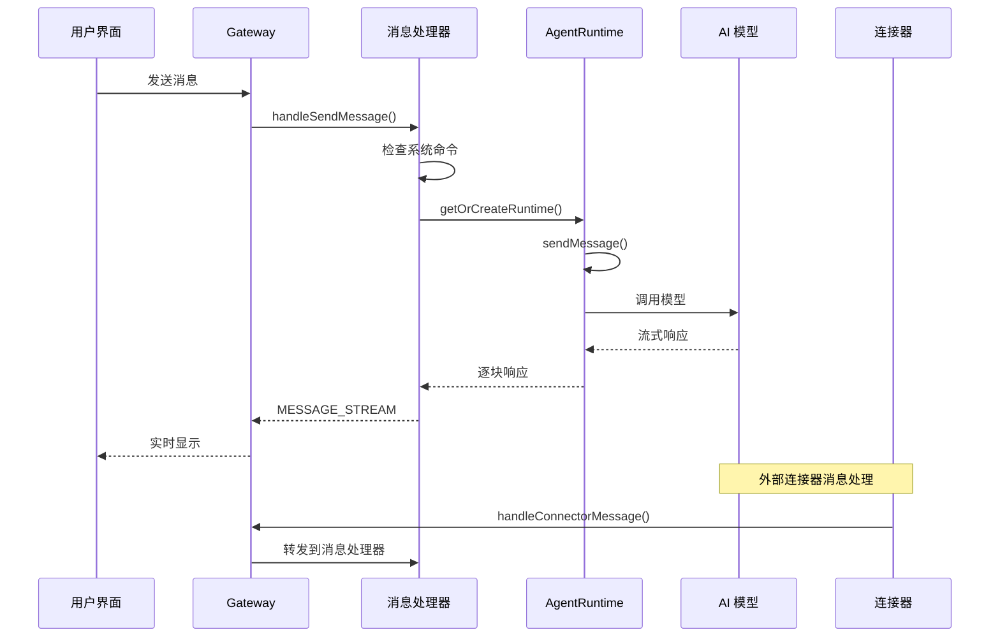

**图表来源**
- [gateway.ts:479-490](file://src/main/gateway.ts#L479-L490)
- [gateway-message.ts:76-160](file://src/main/gateway-message.ts#L76-L160)
- [agent-runtime.ts:661-688](file://src/main/agent-runtime/agent-runtime.ts#L661-L688)

## 详细组件分析

### 消息路由核心算法

#### 消息类型识别和处理流程

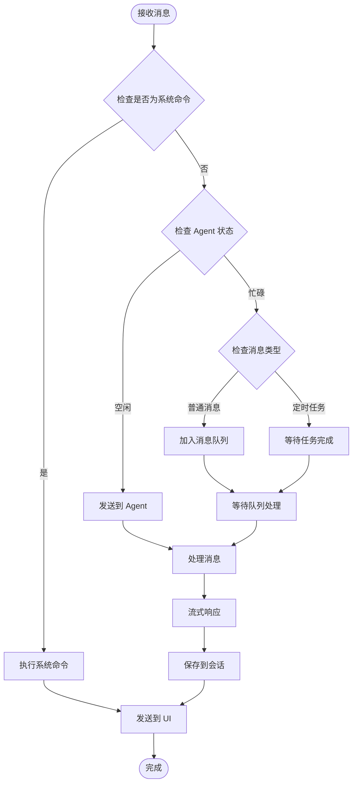

**图表来源**
- [gateway-message.ts:76-160](file://src/main/gateway-message.ts#L76-L160)
- [gateway-message.ts:198-211](file://src/main/gateway-message.ts#L198-L211)

#### 目标会话确定机制

系统通过以下规则确定消息的目标会话：

1. **默认会话**：当未指定 sessionId 时，使用 'default'
2. **连接器会话**：根据 conversationKey 自动匹配或创建
3. **任务会话**：定时任务使用 task-tab- 前缀的特殊会话
4. **持久化会话**：从数据库加载的会话配置

#### 消息优先级处理

系统实现了多层次的消息优先级机制：

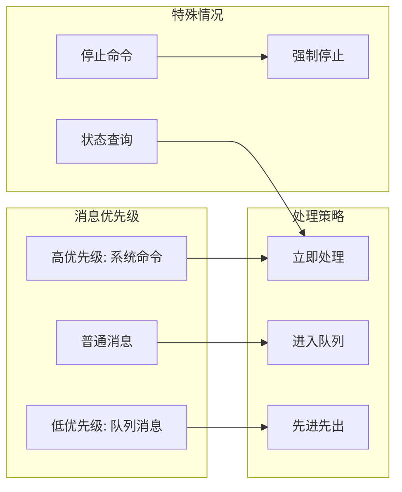

**图表来源**
- [gateway-connector.ts:194-248](file://src/main/gateway-connector.ts#L194-L248)
- [gateway-message.ts:120-132](file://src/main/gateway-message.ts#L120-L132)

**章节来源**
- [gateway-message.ts:76-371](file://src/main/gateway-message.ts#L76-L371)
- [gateway-connector.ts:98-296](file://src/main/gateway-connector.ts#L98-L296)

### 流式响应处理机制

#### 实时消息传输

系统采用异步生成器模式实现真正的流式响应：

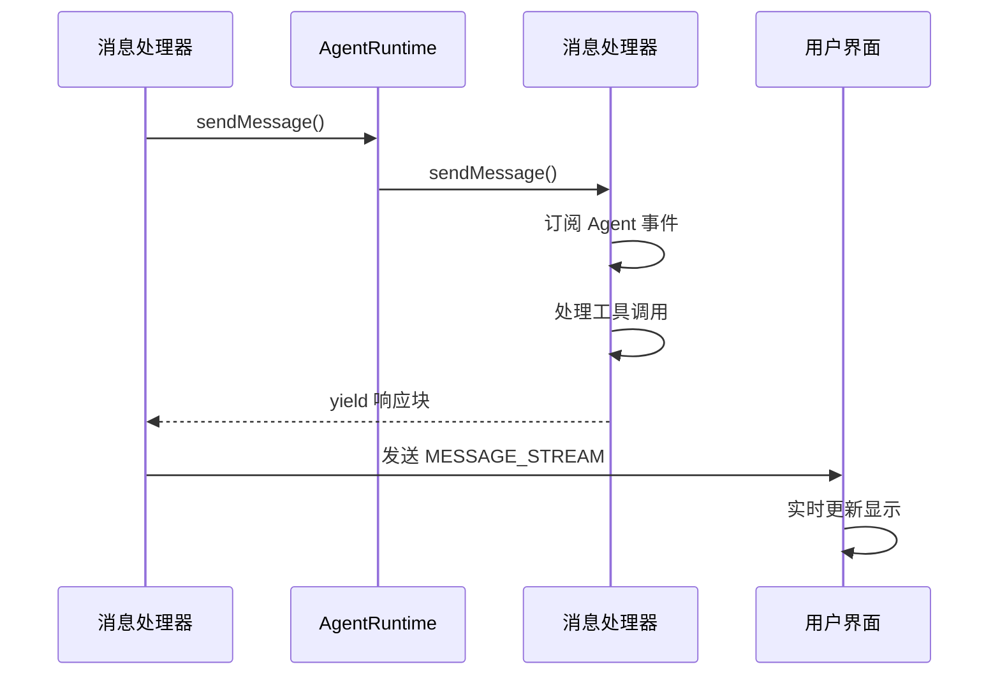

**图表来源**
- [agent-runtime.ts:661-688](file://src/main/agent-runtime/agent-runtime.ts#L661-L688)
- [message-handler.ts:114-587](file://src/main/agent-runtime/message-handler.ts#L114-L587)

#### 断线重连和消息缓冲

系统提供了完善的断线重连机制：

1. **连接状态监控**：实时监控 AI 连接状态
2. **自动重试**：检测到连接错误时自动重试
3. **状态恢复**：重置 Agent 状态并恢复执行
4. **消息缓冲**：在网络恢复后继续处理队列中的消息

#### 实时执行步骤更新

系统能够实时跟踪和显示 Agent 的执行步骤：

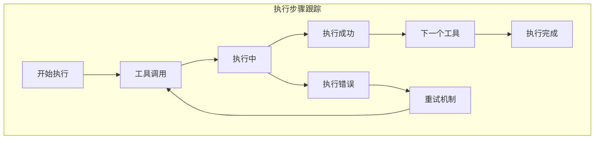

**图表来源**
- [message-handler.ts:63-82](file://src/main/agent-runtime/message-handler.ts#L63-L82)
- [agent-message-processor.ts:87-170](file://src/main/agent-runtime/agent-message-processor.ts#L87-L170)

**章节来源**
- [agent-runtime.ts:658-688](file://src/main/agent-runtime/agent-runtime.ts#L658-L688)
- [message-handler.ts:114-587](file://src/main/agent-runtime/message-handler.ts#L114-L587)
- [agent-message-processor.ts:87-170](file://src/main/agent-runtime/agent-message-processor.ts#L87-L170)

### 多 Agent 协作机制

#### Agent 实例管理

系统为每个会话维护独立的 Agent 实例：

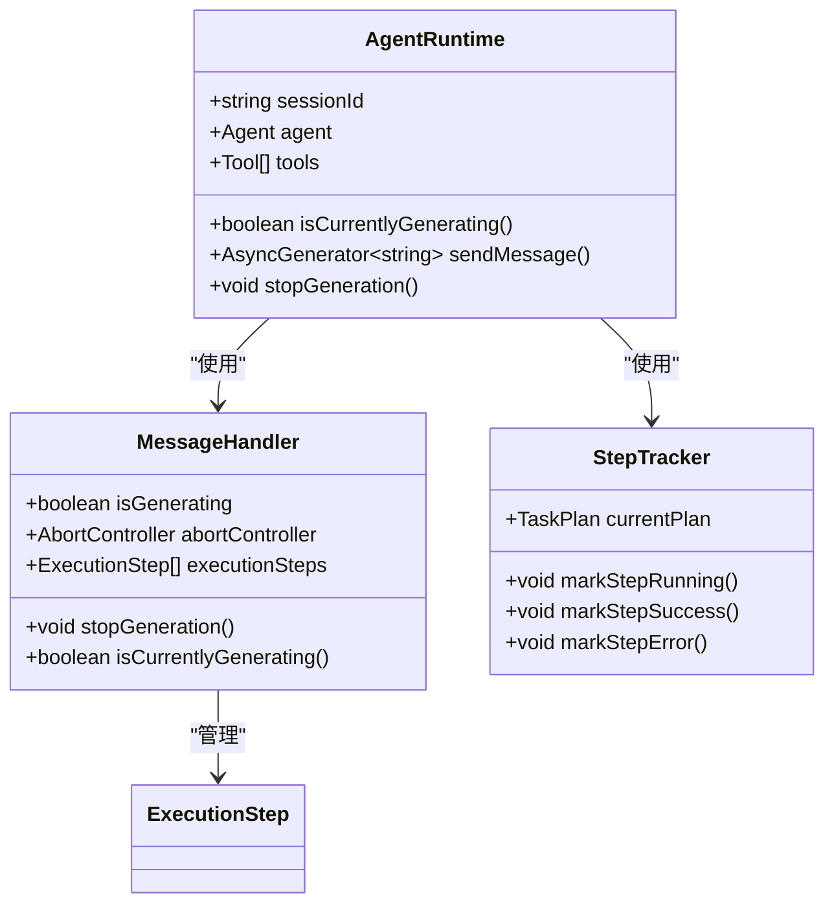

**图表来源**
- [agent-runtime.ts:27-800](file://src/main/agent-runtime/agent-runtime.ts#L27-L800)
- [message-handler.ts:16-752](file://src/main/agent-runtime/message-handler.ts#L16-L752)
- [step-tracker.ts:34-199](file://src/main/agent-runtime/step-tracker.ts#L34-L199)

#### 工具执行和状态管理

系统支持复杂的工具执行和状态管理：

1. **工具包装**：为每个工具添加重复检测和超时控制
2. **执行步骤跟踪**：实时跟踪每个工具的执行状态
3. **错误处理**：自动处理工具执行中的各种错误
4. **重试机制**：支持有限次数的自动重试

**章节来源**
- [agent-runtime.ts:193-229](file://src/main/agent-runtime/agent-runtime.ts#L193-L229)
- [message-handler.ts:63-82](file://src/main/agent-runtime/message-handler.ts#L63-L82)
- [step-tracker.ts:48-145](file://src/main/agent-runtime/step-tracker.ts#L48-L145)

### 外部连接器集成

#### 连接器管理架构

系统支持多种外部连接器的统一管理：

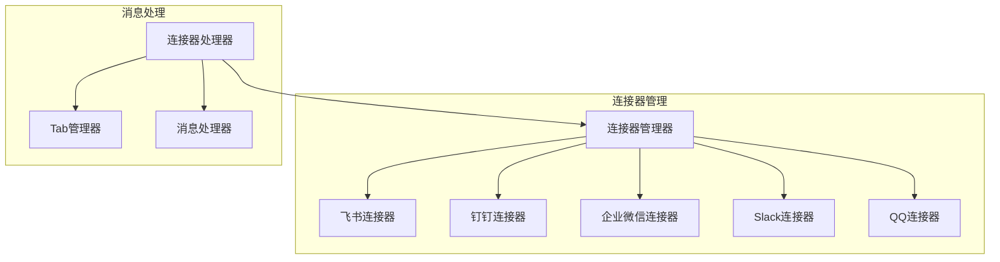

**图表来源**
- [connector-manager.ts:21-379](file://src/main/connectors/connector-manager.ts#L21-L379)
- [gateway-connector.ts:44-800](file://src/main/gateway-connector.ts#L44-L800)

#### 连接器消息处理流程

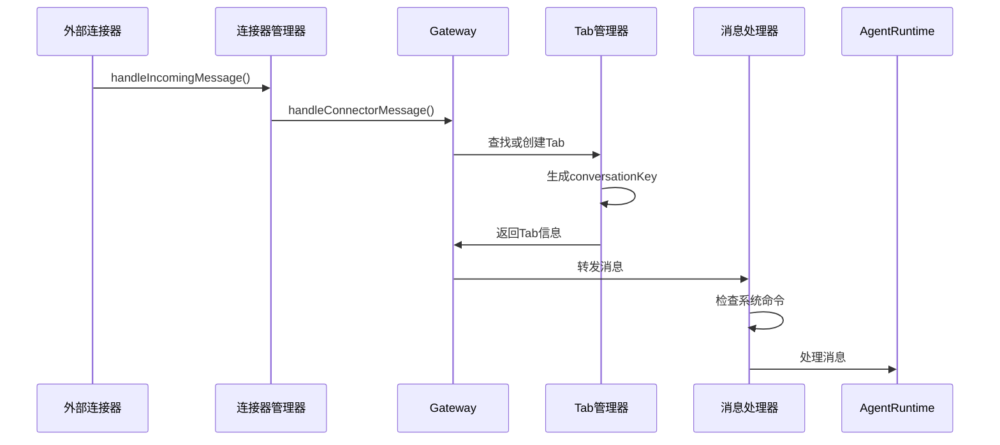

**图表来源**
- [connector-manager.ts:130-168](file://src/main/connectors/connector-manager.ts#L130-L168)
- [gateway-connector.ts:100-296](file://src/main/gateway-connector.ts#L100-L296)

**章节来源**
- [connector-manager.ts:21-379](file://src/main/connectors/connector-manager.ts#L21-L379)
- [gateway-connector.ts:98-425](file://src/main/gateway-connector.ts#L98-L425)

## 依赖关系分析

### 组件耦合度分析

系统采用了松耦合的设计原则：

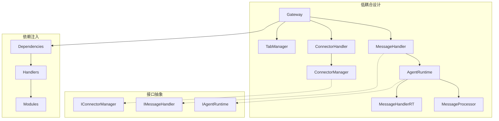

**图表来源**
- [gateway.ts:354-398](file://src/main/gateway.ts#L354-L398)
- [gateway-message.ts:48-64](file://src/main/gateway-message.ts#L48-L64)

### 数据流依赖

系统中的数据流向呈现清晰的层次结构：

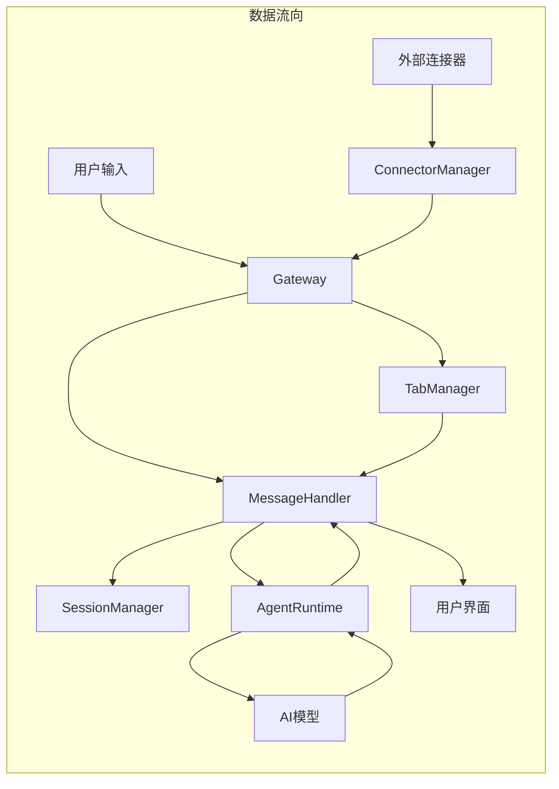

**图表来源**
- [gateway.ts:479-490](file://src/main/gateway.ts#L479-L490)
- [session-manager.ts:103-130](file://src/main/session/session-manager.ts#L103-L130)

**章节来源**
- [gateway.ts:354-398](file://src/main/gateway.ts#L354-L398)
- [session-manager.ts:17-195](file://src/main/session/session-manager.ts#L17-L195)

## 性能考虑

### 批量处理策略

系统实现了多种批量处理优化：

1. **消息队列批处理**：将多个消息合并处理
2. **工具执行批处理**：串行执行避免资源竞争
3. **内存管理优化**：及时清理不再使用的消息和状态

### 并发控制机制

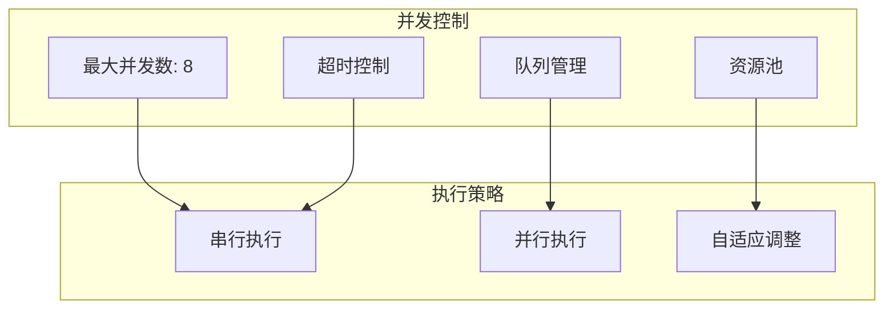

**图表来源**
- [agent-runtime.ts:152-153](file://src/main/agent-runtime/agent-runtime.ts#L152-L153)

### 内存管理方案

系统采用了多层内存管理策略：

1. **消息队列限制**：UI 显示最多 100 轮，Agent 上下文最多 10 轮
2. **自动清理机制**：定期清理过期的会话数据
3. **内存泄漏防护**：确保所有事件监听器正确注销

### AI 连接优化

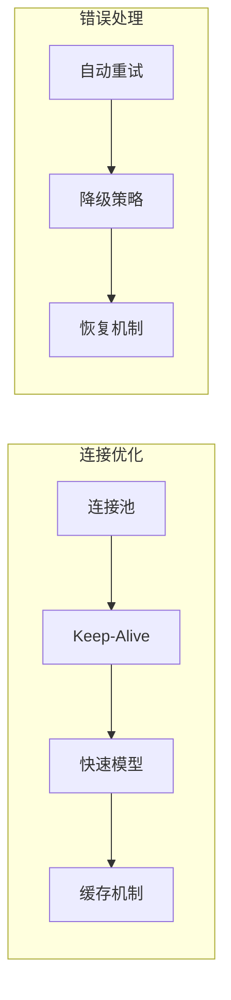

**图表来源**
- [ai-client.ts:51-91](file://src/main/utils/ai-client.ts#L51-L91)
- [ai-client.ts:159-187](file://src/main/utils/ai-client.ts#L159-L187)

**章节来源**
- [ai-client.ts:87-91](file://src/main/utils/ai-client.ts#L87-L91)
- [session-manager.ts:21-22](file://src/main/session/session-manager.ts#L21-L22)

## 故障排除指南

### 常见错误类型和处理

#### AI 连接错误

系统能够自动检测和处理多种 AI 连接错误：

| 错误类型 | 检测条件 | 处理策略 |
|---------|---------|---------|
| 超时错误 | 包含 'timeout' 或 '超时' | 清理缓存并重试 |
| 网络错误 | 包含 '网络' 或 '连接' | 重置 Agent 状态 |
| API 错误 | 包含 'API 请求超时' | 发送用户友好提示 |

#### Agent 状态异常

系统提供了多种状态恢复机制：

1. **强制重置**：重置 MessageHandler 状态
2. **Agent 重建**：重新创建 Agent 实例
3. **上下文恢复**：从会话中恢复消息历史

### 调试和监控

系统内置了丰富的调试和监控功能：

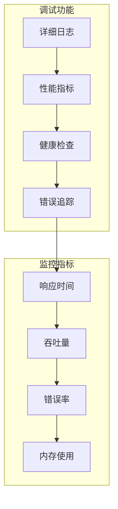

**图表来源**
- [gateway-message.ts:231-241](file://src/main/gateway-message.ts#L231-L241)
- [message-handler.ts:589-624](file://src/main/agent-runtime/message-handler.ts#L589-L624)

**章节来源**
- [gateway-message.ts:246-283](file://src/main/gateway-message.ts#L246-L283)
- [message-handler.ts:682-698](file://src/main/agent-runtime/message-handler.ts#L682-L698)

## 结论

史丽慧小助理 的消息路由处理机制展现了现代 AI 应用的复杂性和精密性。通过精心设计的分层架构和模块化组件，系统实现了：

1. **高效的多会话管理**：每个 Tab 独立的 AgentRuntime 实例确保了会话隔离和资源优化
2. **智能的消息路由**：通过类型识别和优先级处理，确保重要消息得到及时处理
3. **流畅的用户体验**：流式响应和实时更新提供了接近实时的交互体验
4. **强大的扩展性**：模块化设计支持新连接器和新功能的无缝集成
5. **可靠的稳定性**：完善的错误处理和自动恢复机制确保了系统的可靠性

该系统为多 Agent 协作和外部连接器集成提供了坚实的基础，是构建复杂 AI 应用的理想选择。通过持续的优化和改进，史丽慧小助理 的消息路由处理机制将继续为用户提供卓越的 AI 交互体验。