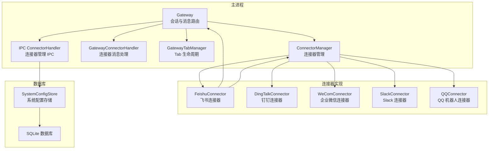
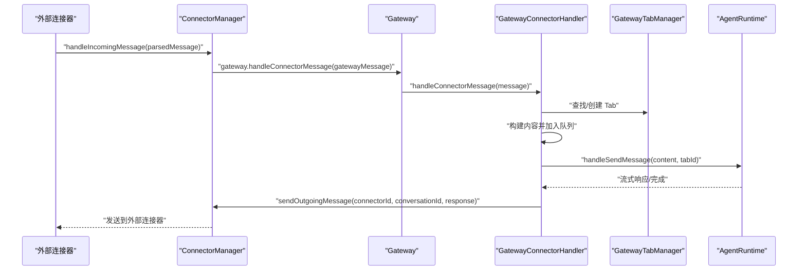
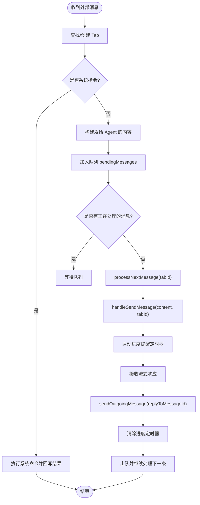
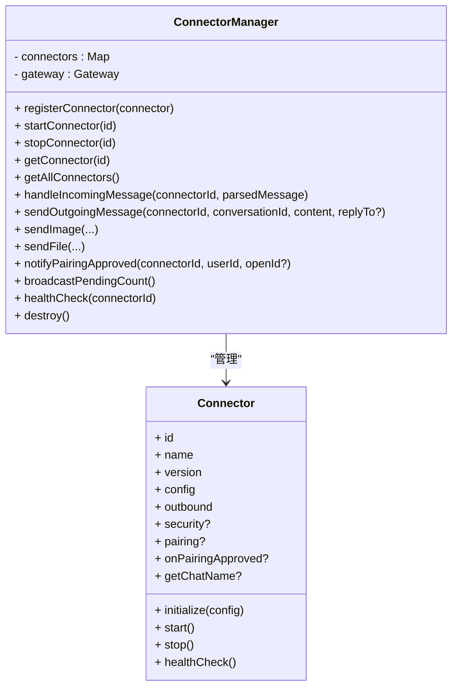
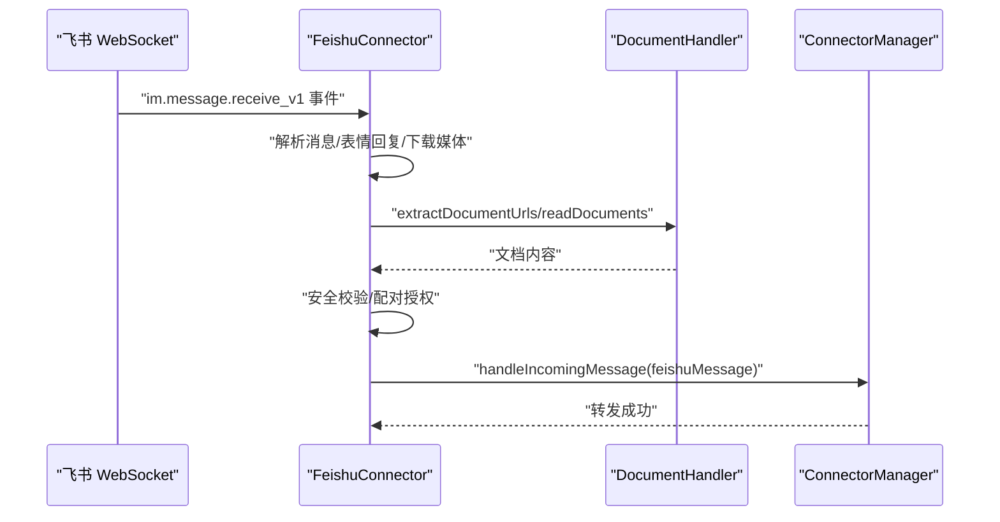
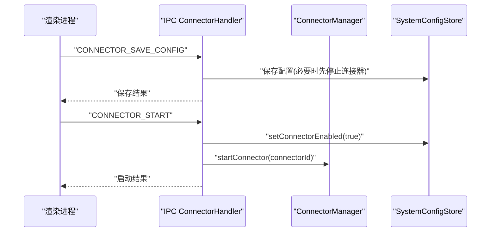
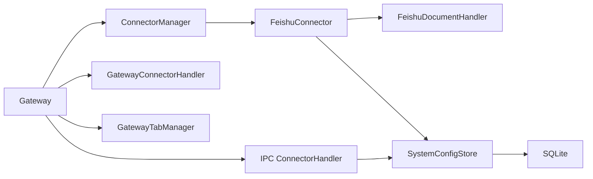

# 连接器集成处理

<cite>
**本文档引用的文件**
- [gateway-connector.ts](file://src/main/gateway-connector.ts)
- [connector-manager.ts](file://src/main/connectors/connector-manager.ts)
- [connector-handler.ts](file://src/main/ipc/connector-handler.ts)
- [connector.ts](file://src/types/connector.ts)
- [feishu-connector.ts](file://src/main/connectors/feishu/feishu-connector.ts)
- [gateway.ts](file://src/main/gateway.ts)
- [gateway-tab.ts](file://src/main/gateway-tab.ts)
- [connector-config.ts](file://src/main/database/connector-config.ts)
- [ipc.ts](file://src/types/ipc.ts)
- [document-handler.ts](file://src/main/connectors/feishu/document-handler.ts)
- [system-config-store.ts](file://src/main/database/system-config-store.ts)
</cite>

## 目录
1. [简介](#简介)
2. [项目结构](#项目结构)
3. [核心组件](#核心组件)
4. [架构总览](#架构总览)
5. [详细组件分析](#详细组件分析)
6. [依赖关系分析](#依赖关系分析)
7. [性能考虑](#性能考虑)
8. [故障排查指南](#故障排查指南)
9. [结论](#结论)
10. [附录](#附录)

## 简介
本文件面向 史丽慧小助理 连接器集成处理的技术文档，重点阐述 Gateway 如何与外部连接器进行集成与通信，涵盖连接器注册、消息转发、状态同步、系统指令处理、队列化消息处理、响应路由与错误处理等核心机制。同时给出不同类型连接器（即时通讯、API、数据源）的集成策略建议，并提供最佳实践（连接池管理、超时处理、重连策略、性能监控）以及在企业级应用中的关键作用与扩展性设计。

## 项目结构
连接器系统围绕 Gateway 展开，通过 ConnectorManager 统一管理各类连接器实例；GatewayConnectorHandler 负责将外部消息转换为内部消息格式并调度到 AgentRuntime；IPC 层提供连接器配置、启停、健康检查等管理能力；数据库层持久化连接器配置与配对记录；飞书连接器作为典型实现展示了消息解析、去重、文档读取、配对授权等高级特性。

图表来源
- [gateway.ts:33-138](file://src/main/gateway.ts#L33-L138)
- [connector-manager.ts:21-122](file://src/main/connectors/connector-manager.ts#L21-L122)
- [gateway-connector.ts:44-110](file://src/main/gateway-connector.ts#L44-L110)
- [gateway-tab.ts:26-61](file://src/main/gateway-tab.ts#L26-L61)
- [connector-handler.ts:33-40](file://src/main/ipc/connector-handler.ts#L33-L40)
- [system-config-store.ts:37-77](file://src/main/database/system-config-store.ts#L37-L77)

章节来源
- [gateway.ts:33-138](file://src/main/gateway.ts#L33-L138)
- [connector-manager.ts:21-122](file://src/main/connectors/connector-manager.ts#L21-L122)
- [gateway-connector.ts:44-110](file://src/main/gateway-connector.ts#L44-L110)
- [gateway-tab.ts:26-61](file://src/main/gateway-tab.ts#L26-L61)
- [connector-handler.ts:33-40](file://src/main/ipc/connector-handler.ts#L33-L40)
- [system-config-store.ts:37-77](file://src/main/database/system-config-store.ts#L37-L77)

## 核心组件
- Gateway：会话生命周期管理、消息路由、AgentRuntime 管理、连接器消息入口与响应出口。
- ConnectorManager：连接器注册、启停、配置校验、外部消息转发、内部消息发送、健康检查、配对通知。
- GatewayConnectorHandler：外部消息解析、Tab 管理、系统指令处理、消息队列化、进度提醒、响应路由。
- GatewayTabManager：Tab 创建/关闭/查询、历史加载、持久化、标题更新、任务 Tab 管理。
- IPC ConnectorHandler：连接器配置获取/保存、启停、健康检查、配对记录管理、待授权计数广播。
- 连接器实现（以飞书为例）：消息解析、去重、媒体下载、文档读取、配对授权、安全校验、发送/图片/文件。
- 数据库层：连接器配置、配对记录、Tab 配置、SQLite 存储与迁移。

章节来源
- [gateway.ts:33-138](file://src/main/gateway.ts#L33-L138)
- [connector-manager.ts:21-122](file://src/main/connectors/connector-manager.ts#L21-L122)
- [gateway-connector.ts:44-110](file://src/main/gateway-connector.ts#L44-L110)
- [gateway-tab.ts:26-61](file://src/main/gateway-tab.ts#L26-L61)
- [connector-handler.ts:33-40](file://src/main/ipc/connector-handler.ts#L33-L40)
- [feishu-connector.ts:28-101](file://src/main/connectors/feishu/feishu-connector.ts#L28-L101)

## 架构总览
Gateway 作为中枢，接收来自 ConnectorManager 的外部消息，交由 GatewayConnectorHandler 进行解析与路由；消息进入队列化处理，结合 Tab 管理与 Session 管理，最终由 AgentRuntime 处理并产生流式响应；响应通过 ConnectorManager 回写到外部连接器。

图表来源
- [connector-manager.ts:130-168](file://src/main/connectors/connector-manager.ts#L130-L168)
- [gateway.ts:693-695](file://src/main/gateway.ts#L693-L695)
- [gateway-connector.ts:100-296](file://src/main/gateway-connector.ts#L100-L296)
- [gateway-tab.ts:787-794](file://src/main/gateway-tab.ts#L787-L794)

章节来源
- [connector-manager.ts:130-207](file://src/main/connectors/connector-manager.ts#L130-L207)
- [gateway.ts:693-705](file://src/main/gateway.ts#L693-L705)
- [gateway-connector.ts:100-296](file://src/main/gateway-connector.ts#L100-L296)
- [gateway-tab.ts:787-794](file://src/main/gateway-tab.ts#L787-L794)

## 详细组件分析

### GatewayConnectorHandler 设计原理与机制
- 依赖注入：通过 setDependencies 注入 BrowserWindow、ConnectorManager、GatewayTabManager、SessionManager、消息发送与系统命令执行回调。
- 外部消息处理：
  - 解析消息来源与内容，生成/查找 Tab（按 connectorId_conversationId 组合键）。
  - 飞书群组消息：提前获取连接器实例，动态获取群名称并异步更新 Tab 标题。
  - 系统指令识别与处理：支持 /new、/memory、/history、/stop、/status、/reload-env 等，其中 /status 与 /stop 直接执行并回写结果。
  - 构建发给 Agent 的内容：包含来源标注、消息正文、飞书专用工具提示、系统上下文提示。
- 队列化消息处理：
  - 将消息封装为 pendingMessages，维护 processingMessageId。
  - 若无正在处理的消息，则立即处理；否则排队等待，使用 setImmediate 避免递归过深。
- 响应路由：
  - 从队列中取出当前处理消息的 replyToMessageId，调用 ConnectorManager.sendOutgoingMessage 发送。
  - 进度提醒：按固定时间点发送“还在执行中”的提示，真实回复后清除定时器。
- 错误处理：
  - 严格日志记录与错误抛出，保证异常可追踪。
  - 进度定时器与队列出队在 finally 中执行，确保状态一致性。

图表来源
- [gateway-connector.ts:100-296](file://src/main/gateway-connector.ts#L100-L296)
- [gateway-connector.ts:369-425](file://src/main/gateway-connector.ts#L369-L425)
- [gateway-connector.ts:431-483](file://src/main/gateway-connector.ts#L431-L483)

章节来源
- [gateway-connector.ts:44-110](file://src/main/gateway-connector.ts#L44-L110)
- [gateway-connector.ts:100-296](file://src/main/gateway-connector.ts#L100-L296)
- [gateway-connector.ts:369-483](file://src/main/gateway-connector.ts#L369-L483)

### ConnectorManager 管理机制
- 注册与启停：registerConnector、startConnector、stopConnector，启动前加载配置、校验 enabled、initialize、start。
- 外部消息处理：handleIncomingMessage 将外部消息转换为 GatewayMessage 并转发至 Gateway。
- 内部消息发送：sendOutgoingMessage/sendImage/sendFile 统一封装，调用连接器 outbound。
- 健康检查：healthCheck 调用连接器 healthCheck。
- 配对通知：notifyPairingApproved 统一入口，避免重复实现。
- 待授权计数广播：broadcastPendingCount 通过 Gateway 主窗口发送 IPC。

图表来源
- [connector-manager.ts:21-122](file://src/main/connectors/connector-manager.ts#L21-L122)
- [connector-manager.ts:130-207](file://src/main/connectors/connector-manager.ts#L130-L207)
- [connector-manager.ts:178-291](file://src/main/connectors/connector-manager.ts#L178-L291)
- [connector-manager.ts:301-333](file://src/main/connectors/connector-manager.ts#L301-L333)
- [connector-manager.ts:341-358](file://src/main/connectors/connector-manager.ts#L341-L358)

章节来源
- [connector-manager.ts:21-122](file://src/main/connectors/connector-manager.ts#L21-L122)
- [connector-manager.ts:130-207](file://src/main/connectors/connector-manager.ts#L130-L207)
- [connector-manager.ts:178-291](file://src/main/connectors/connector-manager.ts#L178-L291)
- [connector-manager.ts:301-358](file://src/main/connectors/connector-manager.ts#L301-L358)

### 飞书连接器（典型实现）
- 配置管理：load/save/validate，合并 enabled 字段。
- 生命周期：initialize 创建 SDK Client，start 启动 WebSocket 事件监听，stop 关闭连接。
- 消息处理：handleIncomingMessage 解析消息、表情回复、图片/文件下载、文档读取、去重、安全校验、配对授权、转发到 ConnectorManager。
- 发送能力：sendMessage/sendImage/sendFile，支持 reply API 与 open_id/chat_id 两种接收方式。
- 健康检查：检查内部状态。
- 文档读取：FeishuDocumentHandler 提取 URL、读取 docx/docs/wiki/sheets、格式化内容。

图表来源
- [feishu-connector.ts:132-146](file://src/main/connectors/feishu/feishu-connector.ts#L132-L146)
- [feishu-connector.ts:368-577](file://src/main/connectors/feishu/feishu-connector.ts#L368-L577)
- [feishu-connector.ts:581-800](file://src/main/connectors/feishu/feishu-connector.ts#L581-L800)
- [document-handler.ts:40-93](file://src/main/connectors/feishu/document-handler.ts#L40-L93)

章节来源
- [feishu-connector.ts:28-101](file://src/main/connectors/feishu/feishu-connector.ts#L28-L101)
- [feishu-connector.ts:103-175](file://src/main/connectors/feishu/feishu-connector.ts#L103-L175)
- [feishu-connector.ts:368-577](file://src/main/connectors/feishu/feishu-connector.ts#L368-L577)
- [feishu-connector.ts:581-800](file://src/main/connectors/feishu/feishu-connector.ts#L581-L800)
- [document-handler.ts:40-93](file://src/main/connectors/feishu/document-handler.ts#L40-L93)

### IPC 连接器管理处理器
- 提供连接器管理 IPC 接口：获取所有连接器、获取/保存配置、启动/停止、健康检查、配对记录管理、待授权计数广播。
- 保存配置时若连接器正在运行则先停止再保存，确保配置生效。
- 批准配对后通知连接器并推送待授权计数更新。

图表来源
- [connector-handler.ts:140-197](file://src/main/ipc/connector-handler.ts#L140-L197)
- [connector-handler.ts:200-231](file://src/main/ipc/connector-handler.ts#L200-L231)
- [connector-handler.ts:302-361](file://src/main/ipc/connector-handler.ts#L302-L361)

章节来源
- [connector-handler.ts:65-104](file://src/main/ipc/connector-handler.ts#L65-L104)
- [connector-handler.ts:140-231](file://src/main/ipc/connector-handler.ts#L140-L231)
- [connector-handler.ts:302-361](file://src/main/ipc/connector-handler.ts#L302-L361)

### 类型与消息格式
- GatewayMessage：统一的内部消息格式，包含来源标识、内容类型（text/image/file）、系统上下文等。
- Connector 接口：统一的连接器抽象，包含配置、生命周期、outbound 发送、可选安全与配对能力。
- IPC 通道：CONNECTOR_* 系列通道用于连接器管理的 IPC 通信。

章节来源
- [connector.ts:33-69](file://src/types/connector.ts#L33-L69)
- [connector.ts:76-146](file://src/types/connector.ts#L76-L146)
- [ipc.ts:96-110](file://src/types/ipc.ts#L96-L110)

## 依赖关系分析
- Gateway 依赖 ConnectorManager、GatewayConnectorHandler、GatewayTabManager、SessionManager。
- ConnectorManager 依赖 Gateway 与各连接器实现。
- IPC ConnectorHandler 依赖 SystemConfigStore 与 Gateway。
- 飞书连接器依赖 Lark SDK、SystemConfigStore、FeishuDocumentHandler。
- 数据库层 SystemConfigStore 提供连接器配置、配对记录、Tab 配置的持久化。

图表来源
- [gateway.ts:33-138](file://src/main/gateway.ts#L33-L138)
- [connector-manager.ts:21-122](file://src/main/connectors/connector-manager.ts#L21-L122)
- [feishu-connector.ts:28-101](file://src/main/connectors/feishu/feishu-connector.ts#L28-L101)
- [system-config-store.ts:37-77](file://src/main/database/system-config-store.ts#L37-L77)

章节来源
- [gateway.ts:33-138](file://src/main/gateway.ts#L33-L138)
- [connector-manager.ts:21-122](file://src/main/connectors/connector-manager.ts#L21-L122)
- [feishu-connector.ts:28-101](file://src/main/connectors/feishu/feishu-connector.ts#L28-L101)
- [system-config-store.ts:37-77](file://src/main/database/system-config-store.ts#L37-L77)

## 性能考虑
- 队列化与批处理：GatewayConnectorHandler 对消息进行队列化处理，避免并发冲突，使用 setImmediate 降低递归深度风险。
- 进度提醒：按固定时间点发送“还在执行中”提示，提升用户体验，减少前端轮询压力。
- 去重策略：飞书连接器对 message_id 与内容进行去重，防止重复处理与资源浪费。
- 异步处理：消息到达后立即返回成功响应，异步处理，避免阻塞事件循环。
- 连接池与重连：连接器生命周期管理中包含 stop/start，便于在配置变更或异常时进行重连与恢复。
- 数据持久化：配置与配对记录采用 SQLite，迁移与索引优化，保障管理接口性能。

## 故障排查指南
- 启动失败：检查 ConnectorManager.startConnector 的配置加载与校验，确认 enabled 状态与 validate 结果。
- 发送失败：检查 ConnectorManager.sendOutgoingMessage/outbound 调用链，关注 replyToMessageId 参数与连接器实现差异。
- 飞书文档读取失败：检查权限配置（docx/document:readonly、drive:drive:readonly、sheets:spreadsheet:readonly），查看 DocumentHandler 日志。
- 配对授权问题：检查 SystemConfigStore 中的配对记录与批准状态，确认通知回调是否触发。
- 进度提醒异常：检查 GatewayConnectorHandler 的定时器管理与清除逻辑，确保真实回复后及时清理。

章节来源
- [connector-manager.ts:45-81](file://src/main/connectors/connector-manager.ts#L45-L81)
- [feishu-connector.ts:581-800](file://src/main/connectors/feishu/feishu-connector.ts#L581-L800)
- [document-handler.ts:115-155](file://src/main/connectors/feishu/document-handler.ts#L115-L155)
- [system-config-store.ts:499-539](file://src/main/database/system-config-store.ts#L499-L539)
- [gateway-connector.ts:773-798](file://src/main/gateway-connector.ts#L773-L798)

## 结论
史丽慧小助理 的连接器集成体系以 Gateway 为核心，通过 ConnectorManager 统一管理连接器生命周期与消息路由，结合 GatewayConnectorHandler 的队列化与系统指令处理，实现了高可靠、可扩展的企业级消息集成。飞书连接器作为典型实现，展示了媒体处理、文档读取、配对授权等高级能力。配合 IPC 管理接口与数据库持久化，系统在易用性、可观测性与可维护性方面均达到企业级标准。

## 附录

### 不同类型连接器的集成策略
- 即时通讯连接器（飞书/钉钉/企业微信/Slack/QQ）：
  - 采用长连接或事件回调接入，实现消息解析、去重、媒体下载、文档读取、配对授权与安全校验。
  - 统一通过 ConnectorManager 的 sendOutgoingMessage/sendImage/sendFile 发送响应。
- API 连接器：
  - 以 HTTP/REST 或 SDK 方式接入，实现鉴权、超时与重试策略、错误码映射与幂等处理。
  - 通过 ConnectorManager 的 healthCheck 与 notifyPairingApproved 提升可观测性。
- 数据源连接器：
  - 针对数据库/文件系统/云存储等，实现连接池管理、事务控制、批量读取与增量同步。
  - 与 SessionManager 配合，确保消息与状态的一致性。

### 连接器集成最佳实践
- 连接池管理：为外部 API/数据库设置合理的连接池大小与超时阈值，避免资源枯竭。
- 超时处理：统一设置请求超时与重试上限，区分可重试与不可重试错误。
- 重连策略：指数退避 + 随机抖动，避免雪崩效应；在配置变更时优雅重启连接。
- 性能监控：埋点关键指标（QPS、P95/P99 延迟、错误率、重试次数），结合日志与告警。
- 安全与合规：输入校验、签名验证、敏感信息脱敏、审计日志与最小权限原则。
- 可观测性：统一的日志结构化、指标采集、分布式追踪与告警策略。