# 数据流架构

<cite>
**本文档引用的文件**
- [gateway.ts](file://src/main/gateway.ts)
- [gateway-message.ts](file://src/main/gateway-message.ts)
- [agent-runtime.ts](file://src/main/agent-runtime/agent-runtime.ts)
- [message-handler.ts](file://src/main/agent-runtime/message-handler.ts)
- [agent-initializer.ts](file://src/main/agent-runtime/agent-initializer.ts)
- [agent-message-processor.ts](file://src/main/agent-runtime/agent-message-processor.ts)
- [context-manager.ts](file://src/main/context/context-manager.ts)
- [session-manager.ts](file://src/main/session/session-manager.ts)
- [system-config-store.ts](file://src/main/database/system-config-store.ts)
- [gateway-tab.ts](file://src/main/gateway-tab.ts)
- [ai-client.ts](file://src/main/utils/ai-client.ts)
- [tool-loader.ts](file://src/main/tools/registry/tool-loader.ts)
- [prompts/index.ts](file://src/main/prompts/index.ts)
- [types/message.ts](file://src/types/message.ts)
- [types/agent-tab.ts](file://src/types/agent-tab.ts)
</cite>

## 目录
1. [简介](#简介)
2. [项目结构](#项目结构)
3. [核心组件](#核心组件)
4. [架构总览](#架构总览)
5. [详细组件分析](#详细组件分析)
6. [依赖关系分析](#依赖关系分析)
7. [性能考量](#性能考量)
8. [故障排查指南](#故障排查指南)
9. [结论](#结论)
10. [附录](#附录)

## 简介
本文件面向 DeepBot 系统的数据流架构，系统围绕“会话—消息—Agent 执行—工具调用—结果返回”的主线展开，覆盖从用户输入到流式响应、从上下文管理到配置持久化的全链路数据处理机制。重点阐述：
- 数据在各模块间的流转路径与职责边界
- 消息处理管道：验证、路由、优先级、队列与恢复
- 上下文管理与配置存储策略
- 并发控制、内存管理与性能优化建议

## 项目结构
DeepBot 采用“网关层（Gateway）—消息层（GatewayMessageHandler）—运行时层（AgentRuntime）—工具层（ToolLoader）”的分层设计，配合会话管理（SessionManager）、上下文管理（ContextManager）、配置存储（SystemConfigStore）与 Tab 生命周期管理（GatewayTabManager）形成闭环。

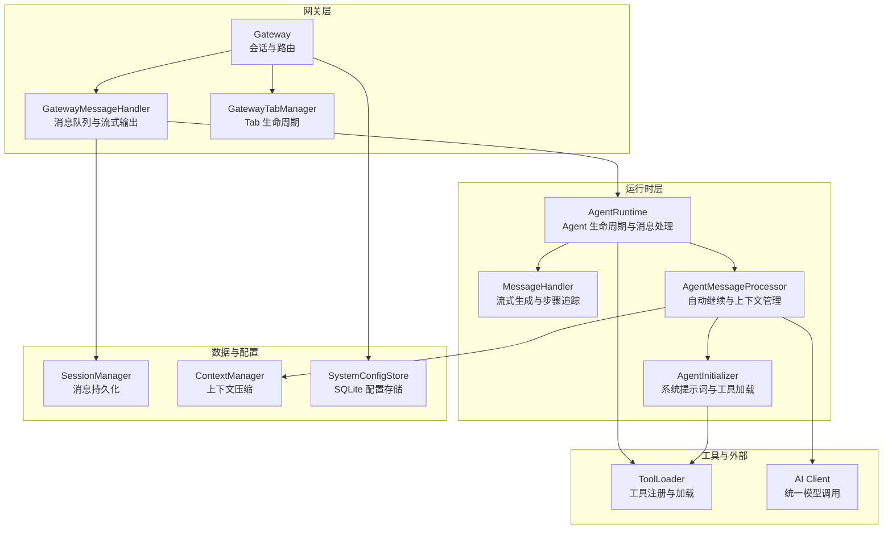

图表来源
- [gateway.ts:29-114](file://src/main/gateway.ts#L29-L114)
- [gateway-message.ts:31-64](file://src/main/gateway-message.ts#L31-L64)
- [agent-runtime.ts:27-188](file://src/main/agent-runtime/agent-runtime.ts#L27-L188)
- [agent-message-processor.ts:20-66](file://src/main/agent-runtime/agent-message-processor.ts#L20-L66)
- [context-manager.ts:100-169](file://src/main/context/context-manager.ts#L100-L169)
- [session-manager.ts:17-33](file://src/main/session/session-manager.ts#L17-L33)
- [system-config-store.ts:37-82](file://src/main/database/system-config-store.ts#L37-L82)
- [gateway-tab.ts:26-61](file://src/main/gateway-tab.ts#L26-L61)
- [ai-client.ts:196-235](file://src/main/utils/ai-client.ts#L196-L235)
- [tool-loader.ts:40-71](file://src/main/tools/registry/tool-loader.ts#L40-L71)

章节来源
- [gateway.ts:29-114](file://src/main/gateway.ts#L29-L114)
- [gateway-message.ts:31-64](file://src/main/gateway-message.ts#L31-L64)
- [agent-runtime.ts:27-188](file://src/main/agent-runtime/agent-runtime.ts#L27-L188)
- [agent-message-processor.ts:20-66](file://src/main/agent-runtime/agent-message-processor.ts#L20-L66)
- [context-manager.ts:100-169](file://src/main/context/context-manager.ts#L100-L169)
- [session-manager.ts:17-33](file://src/main/session/session-manager.ts#L17-L33)
- [system-config-store.ts:37-82](file://src/main/database/system-config-store.ts#L37-L82)
- [gateway-tab.ts:26-61](file://src/main/gateway-tab.ts#L26-L61)
- [ai-client.ts:196-235](file://src/main/utils/ai-client.ts#L196-L235)
- [tool-loader.ts:40-71](file://src/main/tools/registry/tool-loader.ts#L40-L71)

## 核心组件
- Gateway：会话与消息路由中枢，负责初始化、依赖注入、运行时生命周期管理、连接器与消息处理器协调。
- GatewayMessageHandler：消息队列、流式输出、错误恢复与自动重试、系统命令处理。
- AgentRuntime：Agent 生命周期、系统提示词、工具列表、消息发送与流式生成、上下文压缩、执行步骤追踪。
- AgentMessageProcessor：自动继续检测、上下文压缩、工具注入、重复消息去重、Captured Prompt 调试。
- MessageHandler：流式生成、工具调用事件收集、执行步骤状态管理、Abort 控制。
- AgentInitializer：Agent 实例创建、工具加载、系统提示词构建、Agent 重建。
- ContextManager：上下文压缩（工具结果裁剪、历史消息裁剪）、统计与阈值控制。
- SessionManager：消息持久化（UI/上下文）、会话读取、清理。
- SystemConfigStore：SQLite 单例配置存储（模型、工作目录、工具禁用、连接器等）。
- GatewayTabManager：Tab 创建/关闭/持久化、欢迎消息、历史加载、活动时间更新。
- ToolLoader：内置工具加载、禁用列表、配置注入。
- AI Client：统一模型调用、连接池、缓存、Keep-Alive、错误友好化。

章节来源
- [gateway.ts:29-114](file://src/main/gateway.ts#L29-L114)
- [gateway-message.ts:31-64](file://src/main/gateway-message.ts#L31-L64)
- [agent-runtime.ts:27-188](file://src/main/agent-runtime/agent-runtime.ts#L27-L188)
- [agent-message-processor.ts:20-66](file://src/main/agent-runtime/agent-message-processor.ts#L20-L66)
- [message-handler.ts:16-58](file://src/main/agent-runtime/message-handler.ts#L16-L58)
- [agent-initializer.ts:17-35](file://src/main/agent-runtime/agent-initializer.ts#L17-L35)
- [context-manager.ts:100-169](file://src/main/context/context-manager.ts#L100-L169)
- [session-manager.ts:17-33](file://src/main/session/session-manager.ts#L17-L33)
- [system-config-store.ts:37-82](file://src/main/database/system-config-store.ts#L37-L82)
- [gateway-tab.ts:26-61](file://src/main/gateway-tab.ts#L26-L61)
- [tool-loader.ts:40-71](file://src/main/tools/registry/tool-loader.ts#L40-L71)
- [ai-client.ts:196-235](file://src/main/utils/ai-client.ts#L196-L235)

## 架构总览
系统数据流自上而下分为三层：
- 应用层（Electron/Web）通过 Gateway 接收用户消息
- 网关层进行会话路由与消息队列管理
- 运行时层负责 Agent 执行、工具调用与上下文压缩
- 数据层负责消息持久化与配置存储

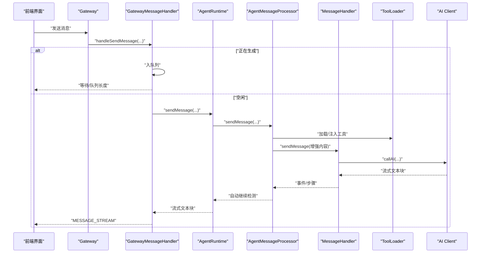

图表来源
- [gateway.ts:455-458](file://src/main/gateway.ts#L455-L458)
- [gateway-message.ts:76-160](file://src/main/gateway-message.ts#L76-L160)
- [agent-runtime.ts:661-688](file://src/main/agent-runtime/agent-runtime.ts#L661-L688)
- [agent-message-processor.ts:345-374](file://src/main/agent-runtime/agent-message-processor.ts#L345-L374)
- [message-handler.ts:114-135](file://src/main/agent-runtime/message-handler.ts#L114-L135)
- [ai-client.ts:196-235](file://src/main/utils/ai-client.ts#L196-L235)

## 详细组件分析

### 网关层（Gateway）
- 会话管理：为每个 Tab 维护一个 AgentRuntime 实例；支持重置、销毁、延迟重置标记。
- 依赖注入：统一设置 Tab/GatewayConnector/GatewayMessage 的依赖，贯穿生命周期。
- 连接器集成：注册并自动启动连接器；支持向连接器发送响应。
- 配置重载：模型、工具、工作目录、系统提示词的热重载与回退策略。

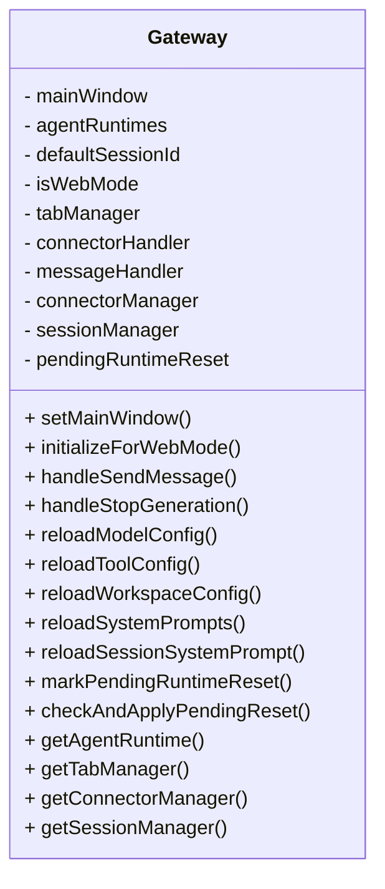

图表来源
- [gateway.ts:29-114](file://src/main/gateway.ts#L29-L114)
- [gateway.ts:337-374](file://src/main/gateway.ts#L337-L374)

章节来源
- [gateway.ts:29-114](file://src/main/gateway.ts#L29-L114)
- [gateway.ts:337-374](file://src/main/gateway.ts#L337-L374)

### 消息处理管道（GatewayMessageHandler）
- 消息验证与系统命令：识别以“/”开头的系统命令并直接执行。
- 并发与队列：若 Agent 正在生成，普通 Tab 入队列；任务 Tab 等待上一次执行完成。
- 流式输出：逐块发送 MESSAGE_STREAM，包含执行步骤、总耗时、发送时间戳。
- 错误恢复：识别 AI 连接错误，自动清理缓存、重置当前 Tab 的 Runtime 并重试。
- 历史记录：根据场景选择保存用户消息与 AI 响应（欢迎消息、任务 Tab 跳过）。

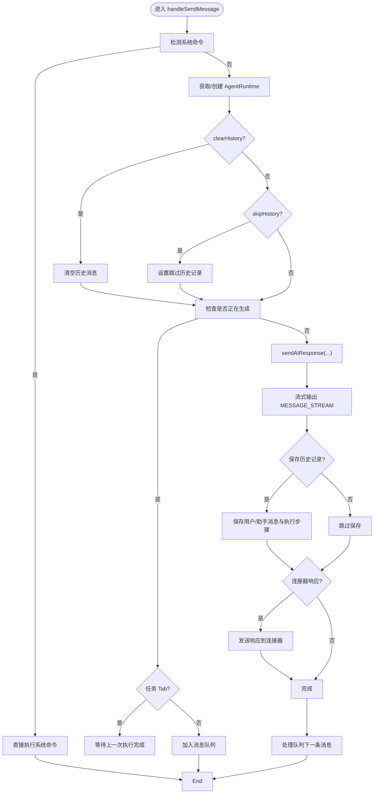

图表来源
- [gateway-message.ts:76-160](file://src/main/gateway-message.ts#L76-L160)
- [gateway-message.ts:165-196](file://src/main/gateway-message.ts#L165-L196)
- [gateway-message.ts:201-211](file://src/main/gateway-message.ts#L201-L211)
- [gateway-message.ts:376-473](file://src/main/gateway-message.ts#L376-L473)
- [gateway-message.ts:478-500](file://src/main/gateway-message.ts#L478-L500)

章节来源
- [gateway-message.ts:76-160](file://src/main/gateway-message.ts#L76-L160)
- [gateway-message.ts:165-196](file://src/main/gateway-message.ts#L165-L196)
- [gateway-message.ts:201-211](file://src/main/gateway-message.ts#L201-L211)
- [gateway-message.ts:376-473](file://src/main/gateway-message.ts#L376-L473)
- [gateway-message.ts:478-500](file://src/main/gateway-message.ts#L478-L500)

### Agent 运行时（AgentRuntime）
- 生命周期：异步初始化 Agent、加载工具、构建系统提示词；支持切换会话、清空历史、停止生成、销毁。
- 上下文加载：从 SessionManager 加载最近对话，转换为 Agent 消息格式，执行上下文压缩。
- 执行步骤：通过 MessageHandler 收集工具调用步骤，实时上报前端。
- 重复检测：工具包装去重与跨 Tab 名称注入，避免重复执行与混淆来源。

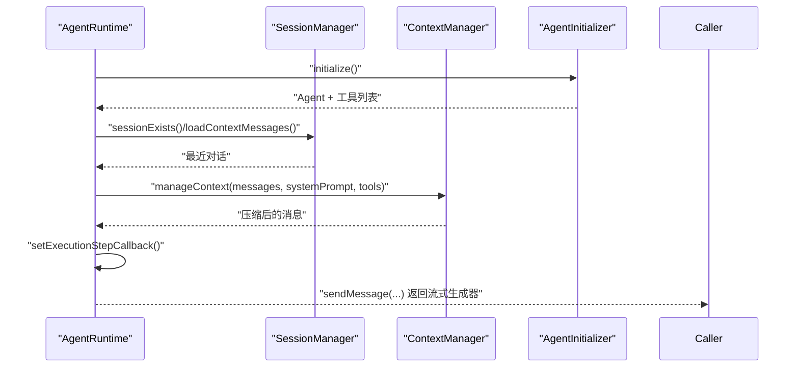

图表来源
- [agent-runtime.ts:193-229](file://src/main/agent-runtime/agent-runtime.ts#L193-L229)
- [agent-runtime.ts:236-308](file://src/main/agent-runtime/agent-runtime.ts#L236-L308)
- [agent-runtime.ts:661-688](file://src/main/agent-runtime/agent-runtime.ts#L661-L688)
- [context-manager.ts:100-169](file://src/main/context/context-manager.ts#L100-L169)
- [session-manager.ts:120-130](file://src/main/session/session-manager.ts#L120-L130)

章节来源
- [agent-runtime.ts:193-229](file://src/main/agent-runtime/agent-runtime.ts#L193-L229)
- [agent-runtime.ts:236-308](file://src/main/agent-runtime/agent-runtime.ts#L236-L308)
- [agent-runtime.ts:661-688](file://src/main/agent-runtime/agent-runtime.ts#L661-L688)
- [context-manager.ts:100-169](file://src/main/context/context-manager.ts#L100-L169)
- [session-manager.ts:120-130](file://src/main/session/session-manager.ts#L120-L130)

### 消息处理器（MessageHandler）
- 流式生成：订阅 Agent 事件，解析 text_delta、tool_execution_*，构建执行步骤。
- Thinking 模拟：解析<think>标签，实时更新执行步骤。
- 停止与恢复：AbortController 支持，用户停止后清理状态，允许新消息。
- 错误检测：对工具结果进行错误模式匹配，区分成功/失败。

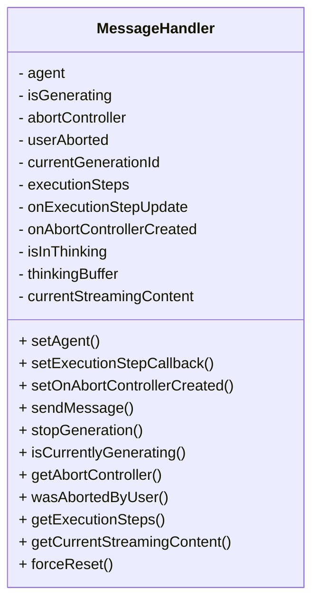

图表来源
- [message-handler.ts:16-58](file://src/main/agent-runtime/message-handler.ts#L16-L58)
- [message-handler.ts:114-135](file://src/main/agent-runtime/message-handler.ts#L114-L135)
- [message-handler.ts:592-624](file://src/main/agent-runtime/message-handler.ts#L592-L624)

章节来源
- [message-handler.ts:16-58](file://src/main/agent-runtime/message-handler.ts#L16-L58)
- [message-handler.ts:114-135](file://src/main/agent-runtime/message-handler.ts#L114-L135)
- [message-handler.ts:592-624](file://src/main/agent-runtime/message-handler.ts#L592-L624)

### 消息处理器（AgentMessageProcessor）
- 自动继续：检测未完成意图，必要时自动追加“立即执行”指令继续。
- 上下文压缩：在发送前对消息进行上下文压缩，降低 Token 使用率。
- Captured Prompt：保存最终发送给 AI 的完整 Prompt 用于调试。
- 工具注入：为工具添加 AbortSignal，支持中止。

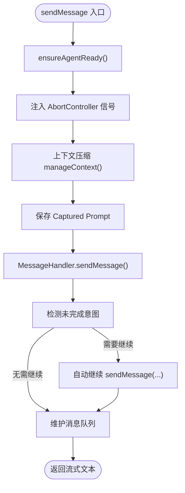

图表来源
- [agent-message-processor.ts:345-374](file://src/main/agent-runtime/agent-message-processor.ts#L345-L374)
- [agent-message-processor.ts:401-430](file://src/main/agent-runtime/agent-message-processor.ts#L401-L430)
- [agent-message-processor.ts:508-541](file://src/main/agent-runtime/agent-message-processor.ts#L508-L541)

章节来源
- [agent-message-processor.ts:345-374](file://src/main/agent-runtime/agent-message-processor.ts#L345-L374)
- [agent-message-processor.ts:401-430](file://src/main/agent-runtime/agent-message-processor.ts#L401-L430)
- [agent-message-processor.ts:508-541](file://src/main/agent-runtime/agent-message-processor.ts#L508-L541)

### 上下文管理（ContextManager）
- 压缩策略：先软裁剪工具结果（70%），再硬裁剪历史消息（85%），保留最大历史占比与预留 Token。
- 统计信息：记录压缩前后消息数、Token 数、节省量与使用率变化。
- 可配置阈值：软裁剪与硬裁剪比例、历史占比上限、预留 Token。

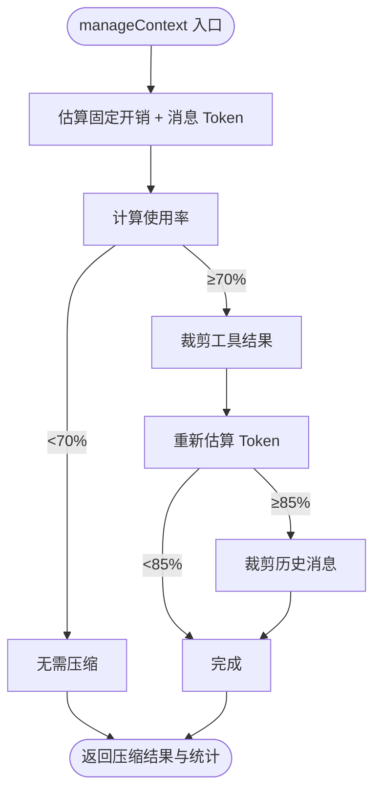

图表来源
- [context-manager.ts:100-169](file://src/main/context/context-manager.ts#L100-L169)
- [context-manager.ts:216-285](file://src/main/context/context-manager.ts#L216-L285)

章节来源
- [context-manager.ts:100-169](file://src/main/context/context-manager.ts#L100-L169)
- [context-manager.ts:216-285](file://src/main/context/context-manager.ts#L216-L285)

### 会话管理（SessionManager）
- 持久化：用户消息、助手消息（含执行步骤、总耗时、发送时间戳）分别保存。
- 读取：UI 显示最近 100 轮；Agent 上下文最近 10 轮。
- 辅助：清空会话、检查存在性、消息计数、路径构造。

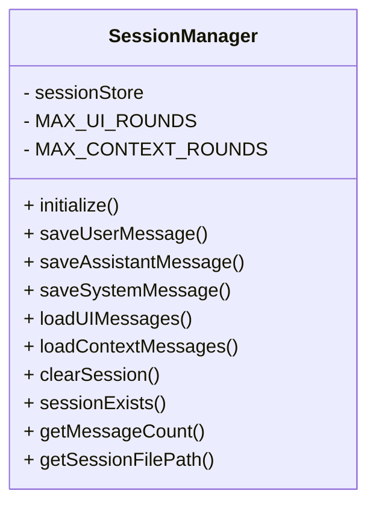

图表来源
- [session-manager.ts:17-33](file://src/main/session/session-manager.ts#L17-L33)
- [session-manager.ts:38-85](file://src/main/session/session-manager.ts#L38-L85)
- [session-manager.ts:103-130](file://src/main/session/session-manager.ts#L103-L130)

章节来源
- [session-manager.ts:17-33](file://src/main/session/session-manager.ts#L17-L33)
- [session-manager.ts:38-85](file://src/main/session/session-manager.ts#L38-L85)
- [session-manager.ts:103-130](file://src/main/session/session-manager.ts#L103-L130)

### 配置存储（SystemConfigStore）
- 单例模式：SQLite 存储，表结构覆盖环境、工作目录、模型、工具、连接器、Tab 等。
- 迁移：自动迁移新增字段（如 model_id_2、context_window、api_type 等）。
- 查询/更新：提供便捷的 CRUD 方法族，供运行时与网关层使用。

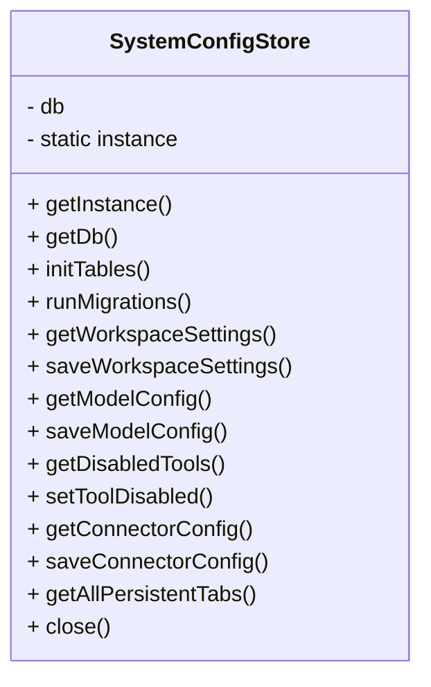

图表来源
- [system-config-store.ts:37-82](file://src/main/database/system-config-store.ts#L37-L82)
- [system-config-store.ts:230-315](file://src/main/database/system-config-store.ts#L230-L315)

章节来源
- [system-config-store.ts:37-82](file://src/main/database/system-config-store.ts#L37-L82)
- [system-config-store.ts:230-315](file://src/main/database/system-config-store.ts#L230-L315)

### Tab 生命周期（GatewayTabManager）
- 创建/关闭：支持持久化与非持久化 Tab；任务 Tab 锁定与暂停。
- 欢迎消息：根据历史消息判断是否发送；Web 模式下延迟发送。
- 历史加载：默认 Tab 延迟加载；其他 Tab 延迟加载避免阻塞。
- 活动时间：更新最后活跃时间，用于排序与回收。

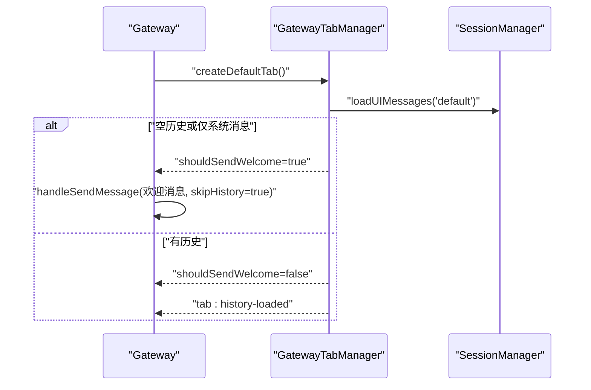

图表来源
- [gateway-tab.ts:88-108](file://src/main/gateway-tab.ts#L88-L108)
- [gateway-tab.ts:137-183](file://src/main/gateway-tab.ts#L137-L183)
- [gateway-tab.ts:195-216](file://src/main/gateway-tab.ts#L195-L216)

章节来源
- [gateway-tab.ts:88-108](file://src/main/gateway-tab.ts#L88-L108)
- [gateway-tab.ts:137-183](file://src/main/gateway-tab.ts#L137-L183)
- [gateway-tab.ts:195-216](file://src/main/gateway-tab.ts#L195-L216)

### 工具加载（ToolLoader）
- 加载策略：从内置工具集合加载，结合禁用列表与配置文件过滤。
- 注入时机：在 Agent 初始化阶段注入工具，支持跨 Tab 名称注入与重复检测包装。

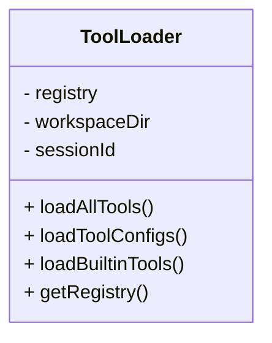

图表来源
- [tool-loader.ts:40-71](file://src/main/tools/registry/tool-loader.ts#L40-L71)
- [tool-loader.ts:109-301](file://src/main/tools/registry/tool-loader.ts#L109-L301)

章节来源
- [tool-loader.ts:40-71](file://src/main/tools/registry/tool-loader.ts#L40-L71)
- [tool-loader.ts:109-301](file://src/main/tools/registry/tool-loader.ts#L109-L301)

### 提示词系统（Prompts）
- 系统提示词构建：加载上下文文件、构建运行时参数、注入工具名称与工作区信息。
- 运行时参数：包含 agentId、模型、会话、时区、时间等。

章节来源
- [prompts/index.ts:5-7](file://src/main/prompts/index.ts#L5-L7)

### 类型定义（消息与 Tab）
- 消息类型：角色、执行步骤、上传文件/图片、总耗时、发送时间戳。
- Tab 类型：标题、类型、消息、创建/活跃时间、持久化配置、待处理消息队列等。

章节来源
- [types/message.ts:15-70](file://src/types/message.ts#L15-L70)
- [types/agent-tab.ts:23-46](file://src/types/agent-tab.ts#L23-L46)

## 依赖关系分析
- 紧耦合点
  - Gateway 与 GatewayMessageHandler、AgentRuntime、GatewayTabManager、SystemConfigStore 的双向依赖通过 setDependencies 注入。
  - AgentRuntime 依赖 AgentInitializer、MessageHandler、AgentMessageProcessor、ContextManager、SessionManager。
  - AgentMessageProcessor 依赖 MessageHandler、ToolLoader、AI Client。
- 松耦合点
  - SystemConfigStore 通过单例提供配置读取，避免跨模块重复初始化。
  - SessionManager 与 SQLite 交互封装，对外暴露统一接口。
- 循环依赖规避
  - 通过回调注入与延迟初始化（如 initializeSystemPrompt）避免循环依赖。

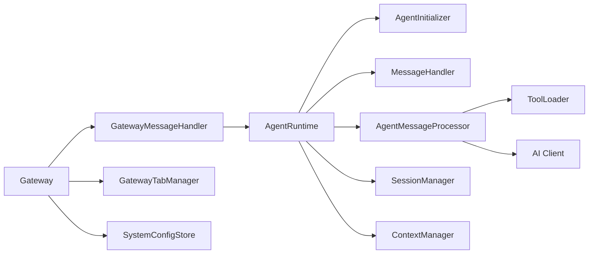

图表来源
- [gateway.ts:337-374](file://src/main/gateway.ts#L337-L374)
- [agent-runtime.ts:166-184](file://src/main/agent-runtime/agent-runtime.ts#L166-L184)
- [agent-message-processor.ts:32-45](file://src/main/agent-runtime/agent-message-processor.ts#L32-L45)
- [ai-client.ts:196-235](file://src/main/utils/ai-client.ts#L196-L235)

章节来源
- [gateway.ts:337-374](file://src/main/gateway.ts#L337-L374)
- [agent-runtime.ts:166-184](file://src/main/agent-runtime/agent-runtime.ts#L166-L184)
- [agent-message-processor.ts:32-45](file://src/main/agent-runtime/agent-message-processor.ts#L32-L45)
- [ai-client.ts:196-235](file://src/main/utils/ai-client.ts#L196-L235)

## 性能考量
- 连接池与缓存
  - AI Client 使用单例缓存 pi-ai 模块与 Model 实例，避免重复导入与连接重建。
  - 配置变更时清理缓存，确保新配置生效。
- 流式输出
  - MESSAGE_STREAM 实时推送，前端即时渲染；执行步骤实时上报，无节流。
- 上下文压缩
  - 70%/85% 阈值裁剪工具结果与历史消息，显著降低 Token 使用率。
- 并发控制
  - 串行工具执行（sequential），避免并发工具调用导致的资源竞争。
  - 任务 Tab 等待上一次执行完成，普通 Tab 入队列，避免 Agent 卡死。
- 内存管理
  - 定期维护消息队列（最多 10 轮用户对话），防止无限增长。
  - 停止生成后清理状态，重置 Agent 实例，避免残留状态影响后续调用。

章节来源
- [ai-client.ts:56-91](file://src/main/utils/ai-client.ts#L56-L91)
- [ai-client.ts:159-187](file://src/main/utils/ai-client.ts#L159-L187)
- [agent-message-processor.ts:68-70](file://src/main/agent-runtime/agent-message-processor.ts#L68-L70)
- [agent-runtime.ts:392-423](file://src/main/agent-runtime/agent-runtime.ts#L392-L423)
- [message-handler.ts:592-624](file://src/main/agent-runtime/message-handler.ts#L592-L624)

## 故障排查指南
- AI 连接错误
  - 现象：超时、网络错误、ECONNREFUSED、ETIMEDOUT、fetch failed。
  - 处理：自动清理 AI 缓存、重置当前 Tab 的 AgentRuntime、重试消息处理。
- Agent 卡住
  - 现象：isStreaming 残留、MessageHandler 卡住。
  - 处理：forceReset 清理状态，stopGeneration 重置 Agent 实例。
- 空响应
  - 现象：AI 返回空响应。
  - 处理：检查 API Key、模型配置、网络连通性；必要时降级提示词。
- 队列堆积
  - 现象：普通 Tab 多消息排队。
  - 处理：确认 Agent 空闲后自动消费队列；检查任务 Tab 是否长时间占用。

章节来源
- [gateway-message.ts:231-241](file://src/main/gateway-message.ts#L231-L241)
- [gateway-message.ts:246-283](file://src/main/gateway-message.ts#L246-L283)
- [gateway-message.ts:332-371](file://src/main/gateway-message.ts#L332-L371)
- [message-handler.ts:682-698](file://src/main/agent-runtime/message-handler.ts#L682-L698)

## 结论
DeepBot 的数据流架构以“网关—消息—运行时—工具—数据层”为主线，通过严格的职责分离、上下文压缩、队列与恢复机制、配置与会话持久化，实现了稳定、可扩展、可观测的端到端消息处理链路。在高并发与复杂工具调用场景下，系统通过连接池、流式输出、自动继续与状态清理等手段保障性能与可靠性。

## 附录
- 典型场景数据流
  - 用户输入 → 网关路由 → 消息队列/等待 → Agent 执行 → 工具调用 → 流式输出 → 历史保存 → 连接器响应
- 关键配置
  - 模型配置、工作目录、工具禁用、连接器配置均通过 SystemConfigStore 管理
- 类型与接口
  - 消息与 Tab 类型定义清晰，便于前端与后端协同