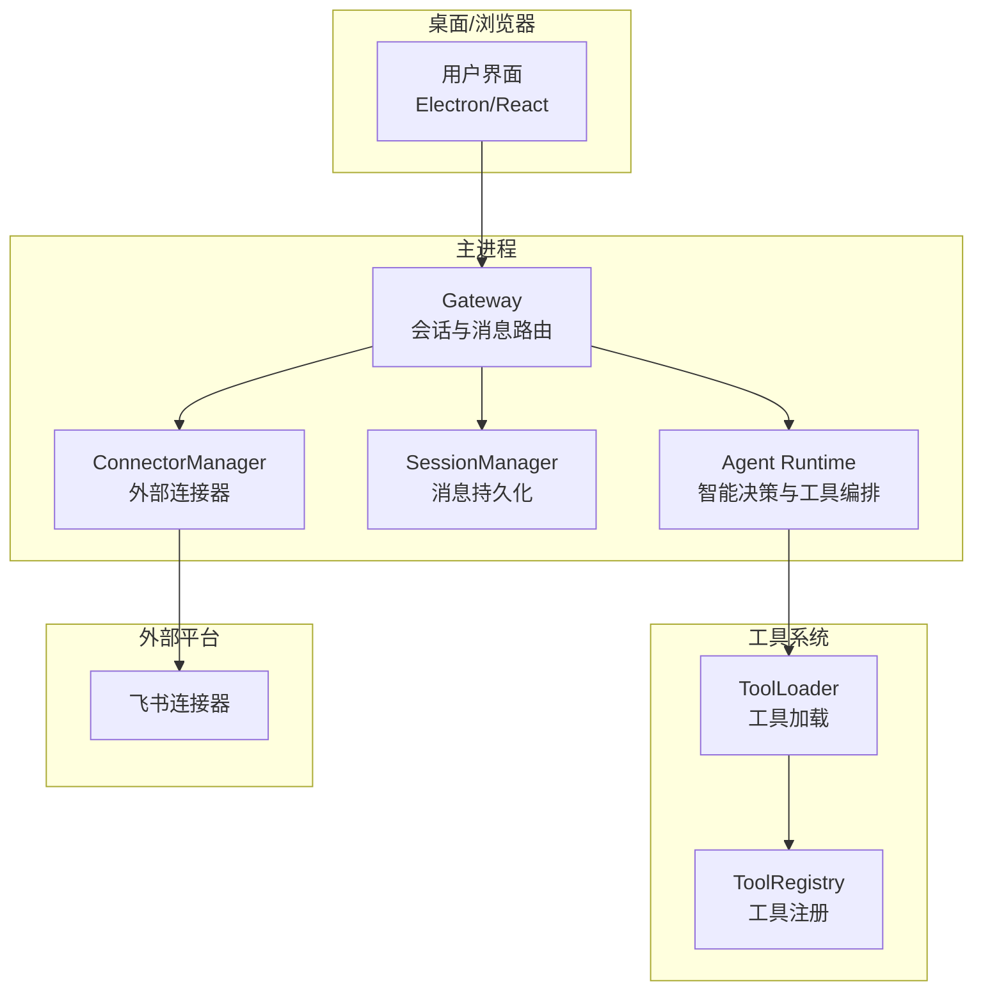
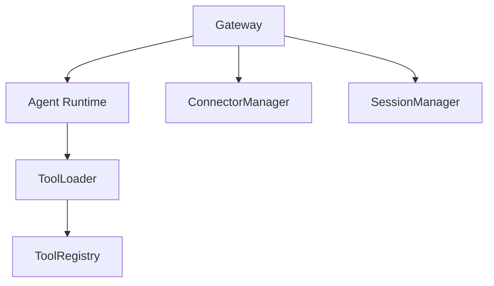
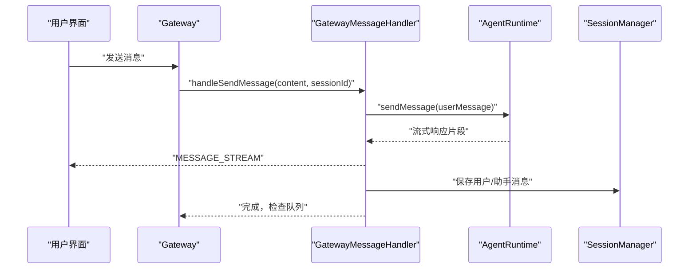
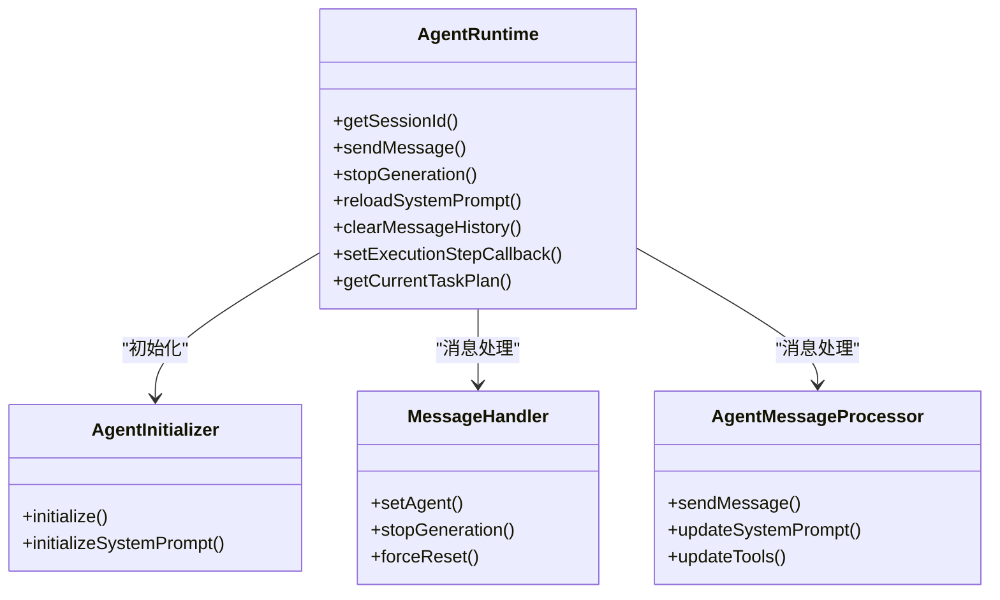
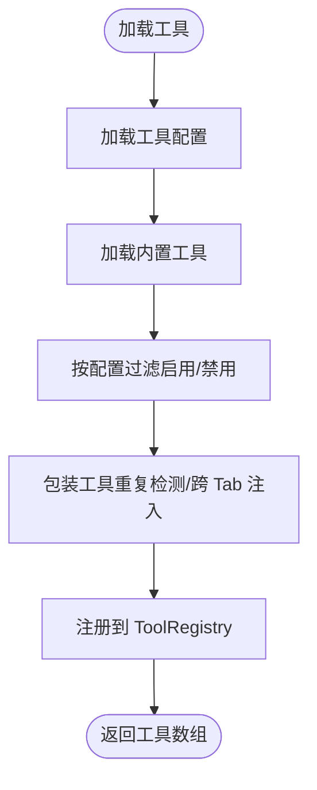
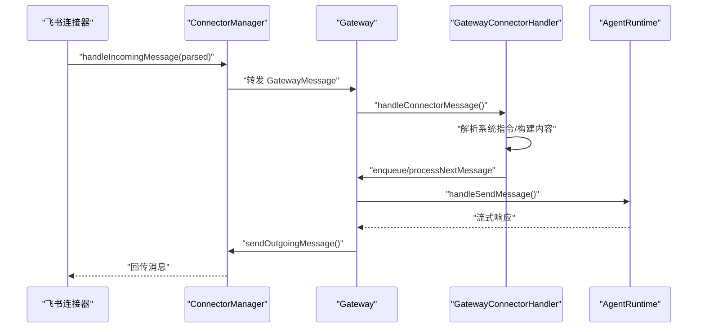
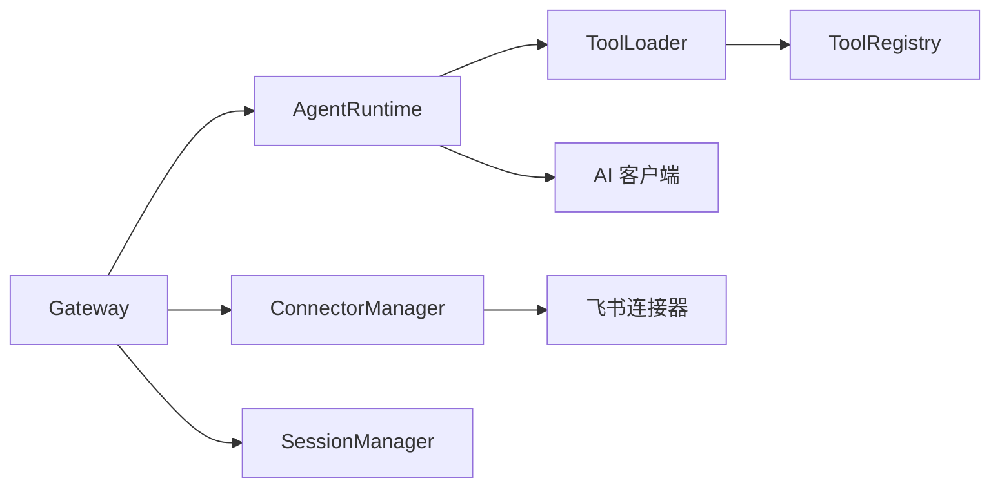

# 系统架构设计

<cite>
**本文引用的文件**
- [README.md](file://README.md)
- [package.json](file://package.json)
- [Dockerfile](file://Dockerfile)
- [docker-compose.yml](file://docker-compose.yml)
- [src/main/gateway.ts](file://src/main/gateway.ts)
- [src/main/gateway-connector.ts](file://src/main/gateway-connector.ts)
- [src/main/gateway-message.ts](file://src/main/gateway-message.ts)
- [src/main/agent-runtime/agent-runtime.ts](file://src/main/agent-runtime/agent-runtime.ts)
- [src/main/agent-runtime/types.ts](file://src/main/agent-runtime/types.ts)
- [src/main/connectors/connector-manager.ts](file://src/main/connectors/connector-manager.ts)
- [src/main/connectors/index.ts](file://src/main/connectors/index.ts)
- [src/main/tools/registry/tool-registry.ts](file://src/main/tools/registry/tool-registry.ts)
- [src/main/tools/registry/tool-loader.ts](file://src/main/tools/registry/tool-loader.ts)
- [src/main/session/session-manager.ts](file://src/main/session/session-manager.ts)
- [src/main/config/constants.ts](file://src/main/config/constants.ts)
</cite>

## 目录
1. [简介](#简介)
2. [项目结构](#项目结构)
3. [核心组件](#核心组件)
4. [架构总览](#架构总览)
5. [详细组件分析](#详细组件分析)
6. [依赖关系分析](#依赖关系分析)
7. [性能考量](#性能考量)
8. [故障排查指南](#故障排查指南)
9. [结论](#结论)
10. [附录](#附录)

## 简介
DeepBot 是一个系统级 AI 助手，面向企业生产提效，支持多 Agent 协作、跨 Tab 消息路由、外部连接器（如飞书）接入、技能扩展（Skills）、定时任务、记忆系统与安全路径白名单机制。系统采用模块化架构，核心由 Gateway、Agent Runtime、工具系统、连接器管理与会话管理组成，既支持桌面 Electron 应用，也支持 Docker Web 模式部署。

## 项目结构
- 主进程（Electron）：src/main
  - Gateway：会话与消息路由中枢
  - Agent Runtime：基于 pi-agent-core 的智能决策与工具编排
  - Connectors：外部连接器管理（飞书等）
  - Tools：13+ 内置工具与工具注册/加载
  - Session：会话与消息持久化
  - Config/Utils：配置常量、AI 客户端、路径安全等
- 渲染进程（React）：src/renderer
- 服务器（Web 模式）：src/server
- 共享与类型：src/shared、src/types
- Docker 部署：Dockerfile、docker-compose.yml

图表来源
- [src/main/gateway.ts:29-114](file://src/main/gateway.ts#L29-L114)
- [src/main/gateway-connector.ts:44-88](file://src/main/gateway-connector.ts#L44-L88)
- [src/main/gateway-message.ts:31-64](file://src/main/gateway-message.ts#L31-L64)
- [src/main/agent-runtime/agent-runtime.ts:27-188](file://src/main/agent-runtime/agent-runtime.ts#L27-L188)
- [src/main/connectors/connector-manager.ts:21-81](file://src/main/connectors/connector-manager.ts#L21-L81)
- [src/main/tools/registry/tool-loader.ts:40-71](file://src/main/tools/registry/tool-loader.ts#L40-L71)
- [src/main/tools/registry/tool-registry.ts:36-55](file://src/main/tools/registry/tool-registry.ts#L36-L55)

章节来源
- [README.md:128-225](file://README.md#L128-L225)
- [package.json:1-107](file://package.json#L1-L107)

## 核心组件
- Gateway（会话与消息路由）
  - 管理每个 Tab 的 Agent Runtime 实例
  - 负责消息路由、流式响应、连接器消息处理、系统命令执行
  - 支持延迟重置 AgentRuntime、重新加载系统提示词、Web 模式适配
- Agent Runtime
  - 基于 pi-agent-core，封装模型配置、工具加载、消息处理、执行步骤跟踪
  - 支持自动继续（最多 100 次）、操作去重（最多 3 次）、上下文压缩
- 工具系统
  - ToolLoader：集中加载内置工具，按配置启用/禁用
  - ToolRegistry：工具注册与查询、配置管理
  - 内置工具涵盖文件、命令、浏览器、日历、图片生成、网络搜索、记忆、技能管理、定时任务、跨 Tab 调用、飞书文档等
- 连接器管理
  - ConnectorManager：注册/启动/停止连接器，处理外部消息转发与回传
  - GatewayConnectorHandler：连接器消息解析、系统指令处理、进度提醒、队列处理
- 会话管理
  - SessionManager：UI 展示（最多 100 轮）、上下文（最多 10 轮）持久化与加载
- 安全与路径白名单
  - 工具执行前进行路径安全检查，限制工作目录、脚本目录、Skill 目录、图片目录等

章节来源
- [src/main/gateway.ts:29-772](file://src/main/gateway.ts#L29-L772)
- [src/main/agent-runtime/agent-runtime.ts:27-800](file://src/main/agent-runtime/agent-runtime.ts#L27-L800)
- [src/main/connectors/connector-manager.ts:21-379](file://src/main/connectors/connector-manager.ts#L21-L379)
- [src/main/gateway-connector.ts:44-800](file://src/main/gateway-connector.ts#L44-L800)
- [src/main/session/session-manager.ts:17-195](file://src/main/session/session-manager.ts#L17-L195)
- [src/main/tools/registry/tool-loader.ts:40-312](file://src/main/tools/registry/tool-loader.ts#L40-L312)
- [src/main/tools/registry/tool-registry.ts:36-328](file://src/main/tools/registry/tool-registry.ts#L36-L328)
- [README.md:473-496](file://README.md#L473-L496)

## 架构总览
系统采用“网关中枢 + 多会话 Agent Runtime + 工具编排 + 连接器”的分层架构：
- 网关层：统一入口，负责会话生命周期、消息路由、连接器桥接、系统命令与状态管理
- 运行时层：每个会话一个 Agent Runtime，负责与模型交互、工具编排、上下文维护
- 工具层：内置工具与注册表，支持动态启用/禁用与配置
- 连接器层：外部平台接入，统一消息格式与回传
- 会话层：消息持久化与上下文压缩，保障长对话与性能

图表来源
- [src/main/gateway.ts:29-114](file://src/main/gateway.ts#L29-L114)
- [src/main/agent-runtime/agent-runtime.ts:27-188](file://src/main/agent-runtime/agent-runtime.ts#L27-L188)
- [src/main/tools/registry/tool-loader.ts:40-71](file://src/main/tools/registry/tool-loader.ts#L40-L71)
- [src/main/connectors/connector-manager.ts:21-81](file://src/main/connectors/connector-manager.ts#L21-L81)
- [src/main/session/session-manager.ts:17-33](file://src/main/session/session-manager.ts#L17-L33)

## 详细组件分析

### Gateway（会话与消息路由）
- 职责
  - 管理每个 Tab 的 Agent Runtime 实例
  - 路由用户消息与连接器消息到对应 Runtime
  - 处理流式响应、错误恢复、系统命令、延迟重置
  - 初始化 SessionManager、ConnectorManager，并注入依赖
- 关键流程
  - handleSendMessage：进入消息处理管线，区分系统命令与普通消息
  - handleConnectorMessage：解析外部消息，创建/定位 Tab，入队处理
  - reloadSystemPrompt：动态重载系统提示词（记忆/技能更新后）
  - reloadModelConfig/reloadToolConfig：配置变更触发 Runtime 重置
- 与 Agent Runtime 的交互
  - getOrCreateRuntime：按会话获取/创建实例
  - sendMessage：委托消息处理与流式输出
  - resetSessionRuntime：异常/超时后的重置与恢复

图表来源
- [src/main/gateway.ts:455-466](file://src/main/gateway.ts#L455-L466)
- [src/main/gateway-message.ts:76-160](file://src/main/gateway-message.ts#L76-L160)
- [src/main/agent-runtime/agent-runtime.ts:661-688](file://src/main/agent-runtime/agent-runtime.ts#L661-L688)
- [src/main/session/session-manager.ts:38-85](file://src/main/session/session-manager.ts#L38-L85)

章节来源
- [src/main/gateway.ts:29-772](file://src/main/gateway.ts#L29-L772)
- [src/main/gateway-message.ts:31-525](file://src/main/gateway-message.ts#L31-L525)

### Agent Runtime（智能决策与工具编排）
- 职责
  - 初始化 Agent、加载工具、维护系统提示词
  - 处理消息流式输出、自动继续、执行步骤跟踪
  - 维护消息队列（最多 10 轮用户对话）、上下文压缩
- 关键机制
  - initializeSystemPrompt：动态组装系统提示词（基础、工具、记忆、Skills）
  - sendMessage：AsyncGenerator 流式输出，支持自动继续与最大次数控制
  - stopGeneration/resetSessionRuntime：异常状态恢复
  - loadHistoryToContext：从 SessionManager 加载历史并压缩上下文
- 与工具系统
  - 通过 ToolLoader 注入工具，包装重复检测与跨 Tab 名称注入

图表来源
- [src/main/agent-runtime/agent-runtime.ts:27-800](file://src/main/agent-runtime/agent-runtime.ts#L27-L800)
- [src/main/agent-runtime/types.ts:11-40](file://src/main/agent-runtime/types.ts#L11-L40)

章节来源
- [src/main/agent-runtime/agent-runtime.ts:27-800](file://src/main/agent-runtime/agent-runtime.ts#L27-L800)
- [src/main/agent-runtime/types.ts:11-40](file://src/main/agent-runtime/types.ts#L11-L40)

### 工具系统（ToolLoader 与 ToolRegistry）
- ToolLoader
  - 加载内置工具（文件、命令、浏览器、日历、图片生成、网络搜索、Web 获取、记忆、技能管理、定时任务、Chat、API、连接器、跨 Tab 调用、系统指令、飞书文档等）
  - 支持按配置启用/禁用工具
- ToolRegistry
  - 工具注册与查询、配置管理、工具列表导出
  - 历史遗留的目录扫描方法不再使用，当前通过显式导入加载

图表来源
- [src/main/tools/registry/tool-loader.ts:57-312](file://src/main/tools/registry/tool-loader.ts#L57-L312)
- [src/main/tools/registry/tool-registry.ts:46-328](file://src/main/tools/registry/tool-registry.ts#L46-L328)

章节来源
- [src/main/tools/registry/tool-loader.ts:40-312](file://src/main/tools/registry/tool-loader.ts#L40-L312)
- [src/main/tools/registry/tool-registry.ts:36-328](file://src/main/tools/registry/tool-registry.ts#L36-L328)

### 连接器管理（ConnectorManager 与 GatewayConnectorHandler）
- ConnectorManager
  - 注册/启动/停止连接器，处理外部消息格式转换与回传
  - 支持发送图片/文件、健康检查、广播待授权计数
- GatewayConnectorHandler
  - 解析连接器消息，创建/更新 Tab（支持飞书群名称动态更新）
  - 处理系统指令（/status、/stop、/new、/memory、/history、/reload-env）
  - 消息队列与进度提醒（定时发送“还在执行中”提示）

图表来源
- [src/main/connectors/connector-manager.ts:130-168](file://src/main/connectors/connector-manager.ts#L130-L168)
- [src/main/gateway-connector.ts:100-296](file://src/main/gateway-connector.ts#L100-L296)
- [src/main/gateway.ts:669-681](file://src/main/gateway.ts#L669-L681)

章节来源
- [src/main/connectors/connector-manager.ts:21-379](file://src/main/connectors/connector-manager.ts#L21-L379)
- [src/main/gateway-connector.ts:44-800](file://src/main/gateway-connector.ts#L44-L800)

### 会话管理（SessionManager）
- 职责
  - UI 展示消息（最多 100 轮）、Agent 上下文消息（最多 10 轮）
  - 保存用户消息、助手消息（含执行步骤、总时长、对应发送时间）、系统消息
  - 提供会话存在性检查、消息计数、路径查询
- 上下文压缩
  - AgentRuntime 在加载历史时调用上下文压缩，减少 Token 消耗

章节来源
- [src/main/session/session-manager.ts:17-195](file://src/main/session/session-manager.ts#L17-L195)
- [src/main/agent-runtime/agent-runtime.ts:236-308](file://src/main/agent-runtime/agent-runtime.ts#L236-L308)

### 安全与路径白名单
- 工具执行前进行路径安全检查，仅允许访问工作目录、脚本目录、Skill 目录、图片目录等
- 通过白名单机制保护系统安全，避免任意路径访问

章节来源
- [README.md:473-496](file://README.md#L473-L496)

## 依赖关系分析
- 组件耦合
  - Gateway 与 AgentRuntime 强耦合（一对一会话），弱耦合于 ConnectorManager/SessionManager
  - AgentRuntime 依赖 ToolLoader/ToolRegistry、SessionManager、AI 客户端
  - ConnectorManager 依赖 Gateway（回调注入）与具体连接器实现
- 外部依赖
  - 模型 SDK：pi-agent-core、pi-ai、pi-coding-agent
  - 浏览器控制：agent-browser、Playwright
  - Web 服务：Express、WS、CORS、JSON Web Token
  - 工具与第三方：Nodemailer、Tavily、Gemini Imagen 3 等

图表来源
- [src/main/gateway.ts:29-114](file://src/main/gateway.ts#L29-L114)
- [src/main/agent-runtime/agent-runtime.ts:27-188](file://src/main/agent-runtime/agent-runtime.ts#L27-L188)
- [src/main/connectors/connector-manager.ts:21-81](file://src/main/connectors/connector-manager.ts#L21-L81)
- [package.json:45-77](file://package.json#L45-L77)

章节来源
- [package.json:45-107](file://package.json#L45-L107)

## 性能考量
- 上下文窗口与 Token 控制
  - AgentRuntime 基于模型上下文窗口推断 maxTokens，避免超限
  - 历史消息加载后进行上下文压缩，维持最多 10 轮用户对话
- 流式输出与队列
  - MESSAGE_STREAM 实时推送，降低前端等待
  - 普通 Tab 使用消息队列串行处理；定时任务 Tab 等待上一次完成
- 进度提醒
  - 连接器消息处理中按节点发送“还在执行中”提醒，提升用户体验
- Docker 运行时
  - Playwright 浏览器缓存持久化，减少重复下载
  - Python 依赖与脚本目录挂载，提升脚本执行效率

章节来源
- [src/main/agent-runtime/agent-runtime.ts:104-143](file://src/main/agent-runtime/agent-runtime.ts#L104-L143)
- [src/main/agent-runtime/agent-runtime.ts:236-308](file://src/main/agent-runtime/agent-runtime.ts#L236-L308)
- [src/main/gateway-message.ts:120-132](file://src/main/gateway-message.ts#L120-L132)
- [src/main/gateway-connector.ts:39-40](file://src/main/gateway-connector.ts#L39-L40)
- [Dockerfile:52-107](file://Dockerfile#L52-L107)

## 故障排查指南
- AI 连接错误自动恢复
  - MessageHandler 检测超时/网络错误，清理 AI 连接缓存并重置 Runtime，再重试
- Agent 卡死状态修复
  - AgentRuntime/MessageHandler 检测 streaming 状态异常，强制重置并重建 Agent
- 连接器健康检查
  - ConnectorManager.healthCheck 返回连接器健康状态
- 进度提醒与队列
  - 连接器 Tab 的进度提醒定时器在真实响应后清除；队列消息处理失败时自动恢复
- Docker 健康检查
  - docker-compose 健康检查端点与重试策略

章节来源
- [src/main/gateway-message.ts:246-283](file://src/main/gateway-message.ts#L246-L283)
- [src/main/gateway-message.ts:336-371](file://src/main/gateway-message.ts#L336-L371)
- [src/main/agent-runtime/agent-runtime.ts:440-456](file://src/main/agent-runtime/agent-runtime.ts#L440-L456)
- [src/main/connectors/connector-manager.ts:341-358](file://src/main/connectors/connector-manager.ts#L341-L358)
- [src/main/gateway-connector.ts:773-800](file://src/main/gateway-connector.ts#L773-L800)
- [docker-compose.yml:59-65](file://docker-compose.yml#L59-L65)

## 结论
DeepBot 通过 Gateway 统一入口、Agent Runtime 智能决策与工具编排、连接器桥接外部平台、会话持久化与上下文压缩，形成高内聚、低耦合的企业级 AI 协作体系。系统具备良好的可扩展性（工具/连接器/技能）、安全路径白名单、Docker 部署与健康检查能力，适合在企业环境中落地。

## 附录

### 技术栈与版本兼容
- Node.js：≥ 20.0.0
- TypeScript：5.3+
- Electron：≥ 28（桌面）
- 模型 SDK：pi-agent-core、pi-ai、pi-coding-agent
- 浏览器控制：agent-browser、Playwright
- Web 服务：Express、WS、CORS
- 工具与第三方：Nodemailer、Tavily、Gemini Imagen 3 等

章节来源
- [README.md:39-44](file://README.md#L39-L44)
- [package.json:45-107](file://package.json#L45-L107)

### 基础设施要求与部署拓扑
- 桌面部署
  - Electron 主进程 + React 渲染进程
  - 依赖 Playwright 浏览器运行时
- Docker 部署
  - Web 服务端口暴露（默认 3008），数据目录通过 volumes 挂载
  - Python 3.11、pip、Playwright 运行时依赖安装
  - 健康检查端点与重启策略

章节来源
- [README.md:73-98](file://README.md#L73-L98)
- [Dockerfile:50-122](file://Dockerfile#L50-L122)
- [docker-compose.yml:1-65](file://docker-compose.yml#L1-L65)

### 安全、监控与灾难恢复
- 安全
  - 路径白名单机制，限制工具执行与命令行访问范围
- 监控
  - MESSAGE_STREAM 实时流式输出，EXECUTION_STEP_UPDATE 实时步骤更新
  - Connector 进度提醒与健康检查
- 灾难恢复
  - AI 连接错误自动恢复、Agent 状态异常重置、队列失败自动重试
  - Docker 健康检查与重启策略

章节来源
- [README.md:473-496](file://README.md#L473-L496)
- [src/main/gateway-message.ts:404-413](file://src/main/gateway-message.ts#L404-L413)
- [src/main/gateway-connector.ts:773-800](file://src/main/gateway-connector.ts#L773-L800)
- [docker-compose.yml:59-65](file://docker-compose.yml#L59-L65)